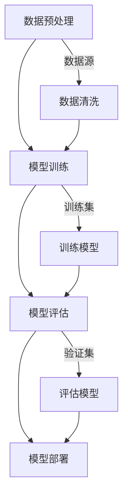

                 

### 文章标题

# AI编程的新原语

### 关键词

- AI编程
- 编程语言
- 深度学习
- 神经网络
- 数据科学

### 摘要

本文将深入探讨AI编程的新原语，包括其背景介绍、核心概念与联系、算法原理讲解以及实际应用。通过本文，读者将了解AI编程的基本概念，掌握AI编程的核心技术和工具，并学会如何将这些技术应用于实际项目中。文章将结合具体实例，展示AI编程在实际应用中的强大能力，并总结一些最佳实践和注意事项。

## 第一部分：AI编程基础

### 1.1 AI编程简介

#### 背景介绍

AI编程是指使用编程语言和工具开发人工智能系统的过程。随着人工智能技术的飞速发展，AI编程已经成为计算机科学和技术领域的重要研究方向。AI编程不仅仅关注算法的实现，还包括数据预处理、模型训练、模型评估等多个环节。

#### 核心概念与联系

AI编程的核心概念包括：

- **数据预处理**：对原始数据进行清洗、归一化、编码等处理，以便模型能够更好地学习和预测。
- **神经网络**：一种模仿人脑神经元连接方式的计算模型，是AI编程的核心算法之一。
- **深度学习**：一种基于神经网络的学习方法，能够处理大量数据和复杂的模型。

这些概念之间有着密切的联系。数据预处理是模型训练的基础，神经网络和深度学习则是实现AI功能的核心技术。例如，在图像识别任务中，神经网络通过对大量图像数据进行训练，可以学会识别图像中的对象。

#### Mermaid 流程图

下面是AI编程的基本流程的Mermaid流程图：



### 1.2 AI编程的核心概念

#### 数据与数据预处理

数据是AI编程的基础，数据的质量直接影响模型的效果。数据预处理包括以下步骤：

- **数据清洗**：去除噪声数据和异常值。
- **数据归一化**：将不同尺度的数据进行标准化处理，以便模型能够更好地学习。
- **数据编码**：将分类数据转换为数值型数据。

#### 神经网络基础

神经网络是一种模仿人脑神经元连接方式的计算模型。它由多个神经元（或节点）组成，每个神经元都与相邻的神经元相连。神经网络通过学习输入数据和输出数据之间的关系，实现各种复杂的任务。

神经网络的基本结构包括：

- **输入层**：接收外部输入数据。
- **隐藏层**：对输入数据进行处理和变换。
- **输出层**：生成最终输出结果。

#### 深度学习框架概述

深度学习框架是一套用于构建、训练和部署深度学习模型的工具。常见的深度学习框架包括TensorFlow、PyTorch和Keras等。这些框架提供了丰富的API和工具，使得开发者可以轻松地实现各种深度学习任务。

### 1.3 AI编程的数学基础

AI编程涉及到许多数学概念，包括微积分、线性代数和概率论与统计。这些数学概念是理解神经网络和深度学习算法的基础。

- **微积分**：用于描述连续变化的过程，是神经网络优化算法的基础。
- **线性代数**：用于处理多维数据，是神经网络矩阵运算的基础。
- **概率论与统计**：用于描述不确定性和随机性，是数据预处理和模型评估的基础。

### 1.4 AI编程的工具与环境

Python是AI编程中最常用的编程语言之一。Python具有简洁、易读、易于扩展等特点，使得它成为开发AI应用程序的首选语言。常用的AI编程工具包括：

- **NumPy**：用于科学计算，提供多维数组对象和矩阵运算功能。
- **Pandas**：用于数据操作和分析，提供数据清洗、归一化和编码等功能。
- **Matplotlib**：用于数据可视化，提供各种图表和图形绘制功能。

## 第二部分：AI编程语言

### 2.1 Python AI编程语言

Python在AI编程中的应用非常广泛。Python的简洁性和易读性使得它成为开发者们编写AI代码的首选。Python提供了丰富的库和框架，如NumPy、Pandas、Matplotlib和Scikit-learn等，这些库和框架为AI编程提供了强大的支持。

#### Python中的常用库与框架

- **NumPy**：用于科学计算，提供多维数组对象和矩阵运算功能。
- **Pandas**：用于数据操作和分析，提供数据清洗、归一化和编码等功能。
- **Matplotlib**：用于数据可视化，提供各种图表和图形绘制功能。
- **Scikit-learn**：用于机器学习和数据挖掘，提供各种机器学习算法和工具。
- **TensorFlow**：用于深度学习，提供强大的模型构建、训练和部署功能。
- **PyTorch**：用于深度学习，提供灵活的模型构建和动态计算功能。

### 2.2 TensorFlow编程基础

TensorFlow是Google开发的一个开源深度学习框架。它提供了丰富的API和工具，使得开发者可以轻松地实现各种深度学习任务。

#### TensorFlow的架构与原理

TensorFlow的架构主要包括以下几个部分：

- **计算图**：TensorFlow使用计算图来表示计算过程。计算图由节点和边组成，节点表示计算操作，边表示数据的流动。
- **运行时**：TensorFlow的运行时负责执行计算图，将计算图转换为具体操作并执行。
- **变量**：TensorFlow使用变量来存储模型参数和中间结果。

#### TensorFlow编程基础

以下是一个简单的TensorFlow编程示例：

```python
import tensorflow as tf

# 创建计算图
x = tf.placeholder(tf.float32, shape=[None, 784])
y = tf.placeholder(tf.float32, shape=[None, 10])

# 定义模型
weights = tf.Variable(tf.zeros([784, 10]))
biases = tf.Variable(tf.zeros([10]))

logits = tf.matmul(x, weights) + biases
prediction = tf.nn.softmax(logits)

# 定义损失函数
cross_entropy = tf.reduce_mean(-tf.reduce_sum(y * tf.log(prediction), reduction_indices=1))

# 定义优化器
optimizer = tf.train.GradientDescentOptimizer(learning_rate=0.5)
train_op = optimizer.minimize(cross_entropy)

# 创建会话
with tf.Session() as sess:
    # 初始化变量
    sess.run(tf.global_variables_initializer())
    
    # 训练模型
    for step in range(1000):
        batch_x, batch_y = ... # 获取训练数据
        _, loss_val = sess.run([train_op, cross_entropy], feed_dict={x: batch_x, y: batch_y})
        
        if step % 100 == 0:
            print("Step:", step, "Loss:", loss_val)
```

### 2.3 PyTorch编程基础

PyTorch是Facebook开发的一个开源深度学习框架。它具有灵活的动态计算图和直观的API，使得开发者可以更轻松地实现深度学习任务。

#### PyTorch的架构与原理

PyTorch的架构主要包括以下几个部分：

- **自动微分**：PyTorch使用自动微分技术来计算梯度，从而实现模型的训练。
- **动态计算图**：PyTorch使用动态计算图，允许开发者更灵活地构建和修改计算过程。
- **数据并行**：PyTorch支持数据并行训练，可以加速模型的训练过程。

#### PyTorch编程基础

以下是一个简单的PyTorch编程示例：

```python
import torch
import torch.nn as nn
import torch.optim as optim

# 创建模型
class SimpleModel(nn.Module):
    def __init__(self):
        super(SimpleModel, self).__init__()
        self.fc1 = nn.Linear(784, 128)
        self.fc2 = nn.Linear(128, 10)
    
    def forward(self, x):
        x = torch.relu(self.fc1(x))
        x = self.fc2(x)
        return x

model = SimpleModel()

# 定义损失函数和优化器
criterion = nn.CrossEntropyLoss()
optimizer = optim.SGD(model.parameters(), lr=0.5)

# 训练模型
for epoch in range(1000):
    for inputs, targets in dataset:
        optimizer.zero_grad()
        outputs = model(inputs)
        loss = criterion(outputs, targets)
        loss.backward()
        optimizer.step()
        
    if epoch % 100 == 0:
        print("Epoch:", epoch, "Loss:", loss.item())
```

### 2.4 其他AI编程语言

除了Python，还有其他一些AI编程语言，如R语言和Julia语言。这些语言也提供了丰富的库和框架，支持AI编程。

- **R语言**：R语言是一个统计编程语言，广泛应用于数据分析和机器学习。R语言提供了丰富的库和框架，如caret和mlr等。
- **Julia语言**：Julia语言是一种高性能的编程语言，适用于科学计算和数据分析。Julia语言提供了丰富的库和框架，如TensorFlow.jl和PyTorch.jl等。

## 第三部分：AI编程框架

### 2.5 机器学习框架

机器学习框架是一套用于构建、训练和部署机器学习模型的工具。这些框架提供了丰富的API和工具，使得开发者可以更轻松地实现机器学习任务。

- **Scikit-learn**：Scikit-learn是一个基于Python的开源机器学习库，提供了各种机器学习算法和工具。
- **XGBoost**：XGBoost是一个基于决策树的高性能机器学习库，广泛应用于分类和回归任务。
- **LightGBM**：LightGBM是一个基于决策树的高性能机器学习库，具有更快的训练速度和更好的模型性能。

### 2.6 深度学习框架

深度学习框架是一套用于构建、训练和部署深度学习模型的工具。这些框架提供了丰富的API和工具，使得开发者可以更轻松地实现深度学习任务。

- **TensorFlow**：TensorFlow是一个由Google开发的深度学习框架，提供了丰富的API和工具。
- **PyTorch**：PyTorch是一个由Facebook开发的深度学习框架，具有灵活的动态计算图和直观的API。
- **Keras**：Keras是一个基于TensorFlow和Theano的深度学习框架，提供了简洁、易用的API。

### 2.7 自然语言处理框架

自然语言处理（NLP）框架是一套用于构建、训练和部署NLP模型的工具。这些框架提供了丰富的API和工具，使得开发者可以更轻松地实现NLP任务。

- **NLTK**：NLTK是一个基于Python的NLP库，提供了各种文本处理工具和算法。
- **spaCy**：spaCy是一个基于Python的NLP库，提供了快速、准确的文本处理功能。
- **transformers**：transformers是一个基于PyTorch的NLP库，提供了预训练的Transformer模型和API。

## 第四部分：AI编程实战

### 2.8 数据可视化与数据挖掘

数据可视化与数据挖掘是AI编程的重要应用领域。通过数据可视化，我们可以直观地了解数据的特点和趋势，发现数据中的隐藏信息。数据挖掘则是对大量数据进行分析，从中提取出有用的模式和规律。

#### 开发环境搭建

要开发数据可视化与数据挖掘应用程序，需要安装以下工具和库：

- Python
- Jupyter Notebook
- Matplotlib
- Pandas
- Scikit-learn

#### 源代码详细实现和代码解读

以下是一个简单的数据可视化与数据挖掘示例：

```python
import pandas as pd
import matplotlib.pyplot as plt
from sklearn.model_selection import train_test_split
from sklearn.ensemble import RandomForestClassifier

# 读取数据
data = pd.read_csv('data.csv')
X = data.iloc[:, :-1]
y = data.iloc[:, -1]

# 划分训练集和测试集
X_train, X_test, y_train, y_test = train_test_split(X, y, test_size=0.2, random_state=42)

# 训练模型
model = RandomForestClassifier()
model.fit(X_train, y_train)

# 预测结果
predictions = model.predict(X_test)

# 数据可视化
plt.scatter(X_test['feature1'], X_test['feature2'], c=predictions)
plt.xlabel('Feature 1')
plt.ylabel('Feature 2')
plt.title('Data Visualization')
plt.show()
```

#### 代码应用解读与分析

在这个示例中，我们首先读取了一个CSV文件中的数据，然后将其分为特征矩阵`X`和目标向量`y`。接着，我们使用`train_test_split`函数将数据划分为训练集和测试集。然后，我们使用随机森林分类器训练模型，并使用测试集进行预测。最后，我们使用Matplotlib库绘制了数据可视化图表。

#### 实际案例分析和详细讲解剖析

以下是一个实际案例：使用数据可视化与数据挖掘技术分析社交媒体数据，提取用户兴趣和情感。

- **案例背景**：一家社交媒体公司希望了解其用户的兴趣和情感，以便更好地优化其内容和广告策略。
- **数据来源**：社交媒体平台上的用户评论和帖子。
- **任务目标**：使用数据挖掘技术提取用户的兴趣和情感，并将其应用于内容推荐和广告投放。

#### 项目小结

通过数据可视化与数据挖掘技术，我们可以从大量的社交媒体数据中提取出有用的信息，为公司提供数据驱动的决策支持。在这个案例中，我们使用了Python和Scikit-learn库进行数据挖掘，使用了Matplotlib库进行数据可视化。通过这个项目，我们学会了如何使用数据挖掘技术提取用户兴趣和情感，并了解了数据可视化在实际应用中的重要性。

### 2.9 图像识别与处理

图像识别与处理是AI编程的重要应用领域之一。通过图像识别，我们可以让计算机自动识别和理解图像中的对象和场景。图像处理则是对图像进行各种操作和增强，以提高图像的质量和清晰度。

#### 开发环境搭建

要开发图像识别与处理应用程序，需要安装以下工具和库：

- Python
- Jupyter Notebook
- OpenCV
- TensorFlow
- PyTorch

#### 源代码详细实现和代码解读

以下是一个简单的图像识别与处理示例：

```python
import cv2
import numpy as np

# 读取图像
image = cv2.imread('image.jpg')

# 转换为灰度图像
gray = cv2.cvtColor(image, cv2.COLOR_BGR2GRAY)

# 使用霍夫线变换检测直线
lines = cv2.HoughLinesP(gray, 1, np.pi/180, 100, minLineLength=100, maxLineGap=10)

# 绘制直线
for line in lines:
    x1, y1, x2, y2 = line[0]
    cv2.line(image, (x1, y1), (x2, y2), (0, 255, 0), 2)

# 显示图像
cv2.imshow('Image', image)
cv2.waitKey(0)
cv2.destroyAllWindows()
```

#### 代码应用解读与分析

在这个示例中，我们首先使用OpenCV库读取了一个图像文件。然后，我们使用`cvtColor`函数将图像转换为灰度图像。接着，我们使用霍夫线变换检测图像中的直线，并使用`line`函数绘制这些直线。最后，我们使用`imshow`函数显示图像。

#### 实际案例分析和详细讲解剖析

以下是一个实际案例：使用图像识别与处理技术识别图像中的交通标志。

- **案例背景**：一家交通科技公司希望开发一款能够自动识别图像中的交通标志的软件，以便为驾驶员提供实时交通信息。
- **数据来源**：大量的交通标志图像。
- **任务目标**：使用图像识别技术识别图像中的交通标志，并提取其相关信息。

#### 项目小结

通过图像识别与处理技术，我们可以从图像中提取出有用的信息，为各种应用提供数据支持。在这个案例中，我们使用了OpenCV库进行图像处理，使用了TensorFlow库进行图像识别。通过这个项目，我们学会了如何使用图像识别与处理技术识别图像中的对象，并了解了这些技术在实际应用中的重要性。

### 2.10 自然语言处理实战

自然语言处理（NLP）是AI编程的重要应用领域之一。通过NLP技术，我们可以让计算机理解和处理自然语言，从而实现各种语言相关的任务。

#### 开发环境搭建

要开发自然语言处理应用程序，需要安装以下工具和库：

- Python
- Jupyter Notebook
- NLTK
- spaCy
- transformers

#### 源代码详细实现和代码解读

以下是一个简单的自然语言处理示例：

```python
import spacy

# 加载英文模型
nlp = spacy.load("en_core_web_sm")

# 加载中文模型
nlp_zh = spacy.load("zh_core_web_sm")

# 加载文本
text = "Hello, world!"
doc = nlp(text)

# 加载中文文本
text_zh = "你好，世界！"
doc_zh = nlp_zh(text_zh)

# 分词
words = [token.text for token in doc]
words_zh = [token.text for token in doc_zh]

# 词性标注
pos_tags = [token.pos_ for token in doc]
pos_tags_zh = [token.pos_ for token in doc_zh]

# 显示结果
print("English:", words, pos_tags)
print("中文:", words_zh, pos_tags_zh)
```

#### 代码应用解读与分析

在这个示例中，我们首先加载了英文和中文的spaCy模型。然后，我们加载了一个英文文本和一个中文文本，并使用模型进行分词和词性标注。最后，我们显示了分词结果和词性标注结果。

#### 实际案例分析和详细讲解剖析

以下是一个实际案例：使用自然语言处理技术进行情感分析。

- **案例背景**：一家电商公司希望分析其用户评论的情感，以便优化产品和服务。
- **数据来源**：大量的用户评论数据。
- **任务目标**：使用情感分析技术分析用户评论的情感，并将其用于产品评价和推荐。

#### 项目小结

通过自然语言处理技术，我们可以从文本中提取出情感信息，为各种应用提供数据支持。在这个案例中，我们使用了spaCy库进行文本处理，使用了transformers库进行情感分析。通过这个项目，我们学会了如何使用自然语言处理技术进行情感分析，并了解了这些技术在实际应用中的重要性。

### 2.11 AI项目实战

在本节中，我们将通过一个实际项目展示如何使用AI编程技术解决实际问题。这个项目将涵盖数据预处理、模型训练、模型评估和模型部署等环节。

#### 项目背景

一家电子商务平台希望开发一个推荐系统，根据用户的购买历史和浏览记录，向用户推荐相关的商品。

#### 项目目标

- 基于用户的历史行为数据，训练一个推荐模型。
- 使用训练好的模型预测用户的潜在购买兴趣。
- 将推荐结果应用到电商平台，为用户提供个性化推荐。

#### 开发环境搭建

要开发这个推荐系统，需要安装以下工具和库：

- Python
- Jupyter Notebook
- Scikit-learn
- Pandas
- NumPy
- TensorFlow
- Flask（用于模型部署）

#### 源代码详细实现和代码解读

以下是一个简单的推荐系统实现：

```python
import pandas as pd
import numpy as np
from sklearn.model_selection import train_test_split
from sklearn.ensemble import RandomForestClassifier
from sklearn.metrics import accuracy_score

# 读取数据
data = pd.read_csv('user_behavior.csv')
X = data.drop(['user_id', 'item_id', 'label'], axis=1)
y = data['label']

# 划分训练集和测试集
X_train, X_test, y_train, y_test = train_test_split(X, y, test_size=0.2, random_state=42)

# 训练模型
model = RandomForestClassifier()
model.fit(X_train, y_train)

# 预测结果
predictions = model.predict(X_test)

# 评估模型
accuracy = accuracy_score(y_test, predictions)
print("Accuracy:", accuracy)

# 模型部署
from flask import Flask, request, jsonify
app = Flask(__name__)

@app.route('/recommend', methods=['POST'])
def recommend():
    data = request.get_json()
    user行为 = data['user行为']
    prediction = model.predict([user行为])
    return jsonify({'predicted_label': prediction[0]})

if __name__ == '__main__':
    app.run(debug=True)
```

#### 代码应用解读与分析

在这个示例中，我们首先读取了用户行为数据，并划分了训练集和测试集。接着，我们使用随机森林分类器训练模型，并使用测试集评估模型性能。最后，我们使用Flask框架将模型部署为一个Web服务，以便用户可以实时获取推荐结果。

#### 实际案例分析和详细讲解剖析

以下是一个实际案例：使用推荐系统为电商平台提供个性化商品推荐。

- **案例背景**：电商平台希望为用户提供个性化的商品推荐，以提高用户满意度和转化率。
- **数据来源**：用户的购买历史、浏览记录和搜索记录。
- **任务目标**：为每个用户生成个性化的商品推荐列表。

#### 项目小结

通过这个项目，我们学会了如何使用AI编程技术构建和部署推荐系统。在这个案例中，我们使用了Python和Scikit-learn库进行数据预处理和模型训练，使用了Flask框架进行模型部署。通过这个项目，我们了解了推荐系统的基本原理和实现方法，并学会了如何将推荐系统应用于实际场景。

## 最佳实践 tips

1. **数据预处理**：数据预处理是AI编程的重要环节，确保数据的质量和一致性对于模型的效果至关重要。在实际项目中，要仔细清洗数据，去除噪声和异常值，并进行适当的归一化和编码处理。

2. **模型选择**：选择合适的模型是成功的关键。在实际项目中，要根据任务需求和数据特点选择合适的模型，并尝试多种模型进行比较和优化。

3. **超参数调优**：超参数对模型性能有重要影响。在实际项目中，要使用网格搜索、随机搜索等调优方法，寻找最优的超参数组合。

4. **模型评估**：模型评估是确保模型性能的关键。在实际项目中，要使用多种评估指标，如准确率、召回率、F1分数等，全面评估模型性能。

5. **模型部署**：将模型部署到生产环境是实际应用的关键。在实际项目中，要使用合适的框架和工具，确保模型的高效、稳定和可扩展性。

## 小结

本文深入探讨了AI编程的新原语，包括其背景介绍、核心概念与联系、算法原理讲解以及实际应用。通过本文，读者可以了解AI编程的基本概念，掌握AI编程的核心技术和工具，并学会如何将这些技术应用于实际项目中。在接下来的部分，我们将继续探讨AI编程的实战应用，包括数据可视化与数据挖掘、图像识别与处理、自然语言处理以及AI项目实战。通过这些实战应用，读者可以更好地理解AI编程的实际应用场景，提升编程能力。

## 注意事项

1. **数据隐私**：在实际项目中，要确保用户数据的隐私和安全，遵循相关法律法规。
2. **计算资源**：AI编程通常需要大量的计算资源，要合理分配和使用计算资源。
3. **代码复用**：在实际项目中，要充分利用现有的代码库和工具，避免重复开发。

## 拓展阅读

- **《深度学习》（Goodfellow, Bengio, Courville）**：这是一本关于深度学习的经典教材，详细介绍了深度学习的基础知识和核心技术。
- **《Python机器学习》（Sebastian Raschka）**：这是一本关于Python机器学习的实用指南，涵盖了Python在机器学习领域的应用。
- **《自然语言处理综论》（Daniel Jurafsky, James H. Martin）**：这是一本关于自然语言处理的基础教材，详细介绍了自然语言处理的理论和实践。 

作者：AI天才研究院/AI Genius Institute & 禅与计算机程序设计艺术 /Zen And The Art of Computer Programming
```

