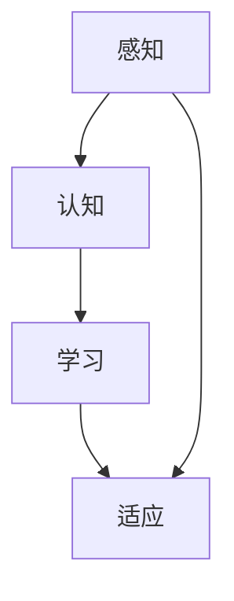
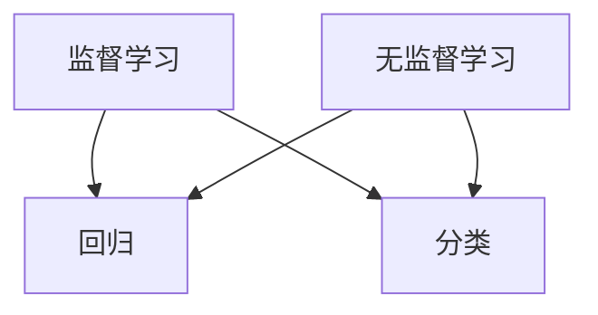
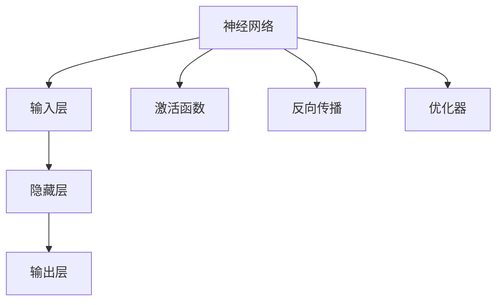
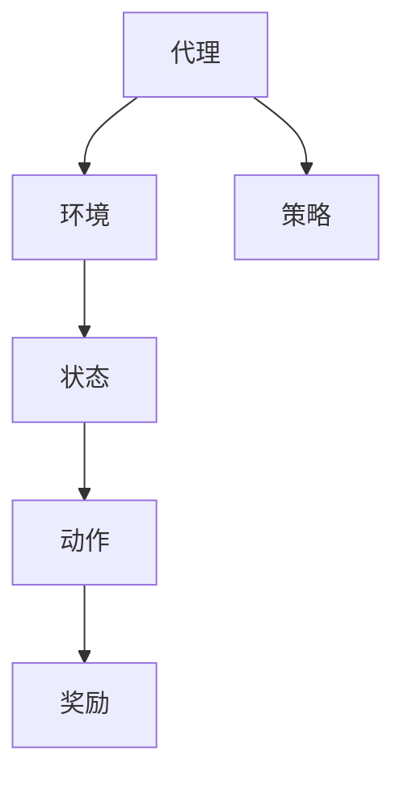
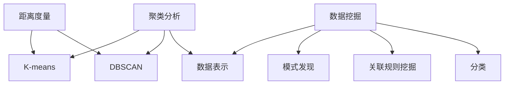
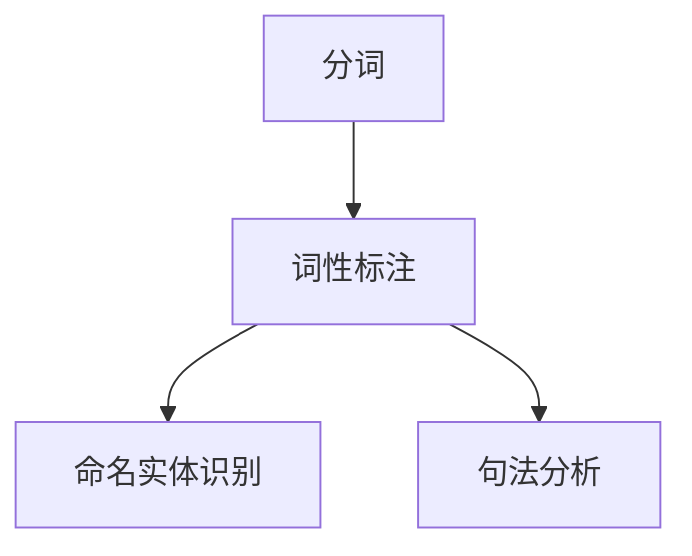
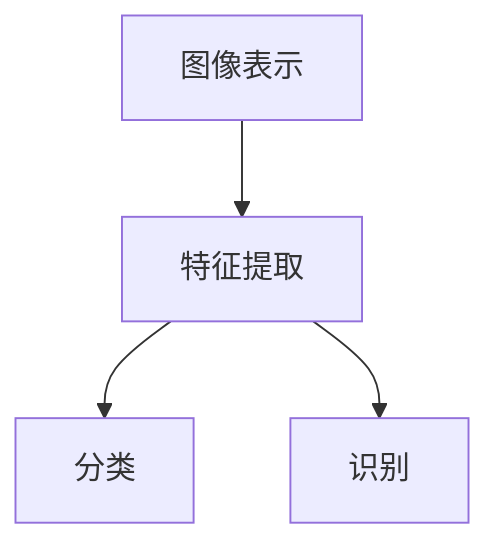
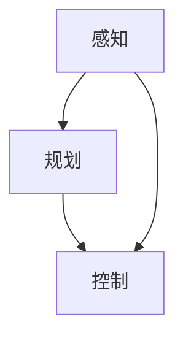
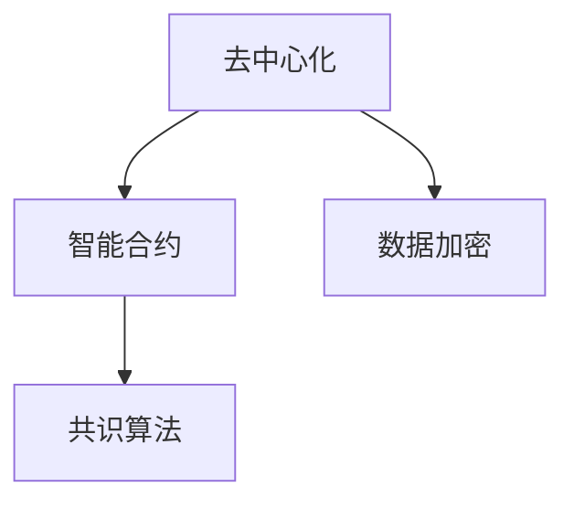
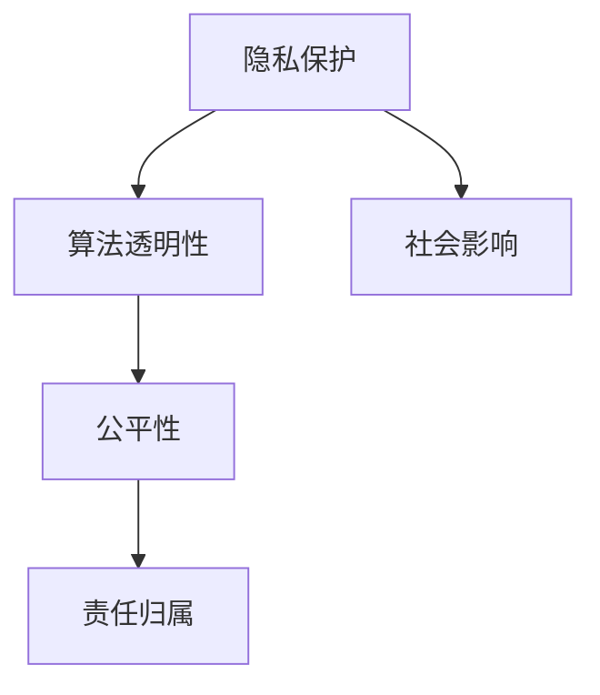

                 


## 文章标题：AI编程的新思维与新方向

### 关键词：AI编程，新思维，新方向，深度学习，强化学习，计算机视觉，自然语言处理

### 摘要：

随着人工智能技术的快速发展，AI编程正经历着前所未有的变革。本文旨在探讨AI编程的新思维和新方向，包括深度学习、强化学习、计算机视觉和自然语言处理等领域的核心概念、算法原理、数学模型以及实际应用。通过分析这些技术背后的原理和最佳实践，本文将帮助读者理解AI编程的本质，掌握新的编程思维，并展望未来技术的趋势。

### 目录

#### 第一部分：AI编程基础

##### 第1章 AI概述

##### 第2章 机器学习基础

##### 第3章 深度学习入门

#### 第二部分：AI编程新思维

##### 第4章 强化学习

##### 第5章 聚类分析与数据挖掘

##### 第6章 自然语言处理

##### 第7章 计算机视觉基础

#### 第三部分：AI编程新方向

##### 第8章 自动驾驶

##### 第9章 人工智能与区块链

##### 第10章 人工智能安全与伦理

##### 附录

### 第1章 AI概述

#### 背景介绍

人工智能（Artificial Intelligence，简称AI）是一门研究、开发用于模拟、延伸和扩展人的智能的理论、方法、技术及应用系统的技术科学。自20世纪50年代诞生以来，AI经历了多个发展阶段，从最初的符号主义、知识表示，到现代的深度学习和强化学习，AI技术已经渗透到各个领域，为人类社会带来了深刻的变化。

#### 核心概念与联系

AI的核心概念包括感知、认知、学习和适应等。感知是指机器通过传感器获取环境信息；认知是指机器对信息的理解、推理和判断；学习是指机器通过经验和数据改善性能；适应是指机器在面对新环境和任务时能够自主调整行为。

以下是一个核心概念与联系架构的Mermaid流程图：



#### 核心算法原理讲解

AI的核心算法包括监督学习、无监督学习和强化学习。以下是一个监督学习算法的伪代码示例：

```python
def supervised_learning(input_data, target_data):
    for each data in input_data:
        predict = model.predict(data)
        model.update_weights(target_data, predict)
    return model
```

#### 数学模型和数学公式详细讲解

AI的数学模型通常涉及概率论、线性代数和微积分。以下是一个简单的线性回归模型的数学公式：

$$ y = \theta_0 + \theta_1 \cdot x $$

其中，$y$ 是预测值，$x$ 是输入特征，$\theta_0$ 和 $\theta_1$ 是模型参数。

#### 项目实战

在本章的项目实战中，我们将使用Python的Scikit-learn库实现一个简单的线性回归模型，并分析其性能。以下是源代码和代码解读：

```python
# 导入必要的库
from sklearn.linear_model import LinearRegression
from sklearn.model_selection import train_test_split
from sklearn.metrics import mean_squared_error

# 创建线性回归模型
model = LinearRegression()

# 分割训练集和测试集
X_train, X_test, y_train, y_test = train_test_split(input_data, target_data, test_size=0.2, random_state=42)

# 训练模型
model.fit(X_train, y_train)

# 预测测试集
predictions = model.predict(X_test)

# 计算均方误差
mse = mean_squared_error(y_test, predictions)
print(f"均方误差: {mse}")

# 代码解读
# 在这里，我们首先导入了必要的库，然后创建了一个线性回归模型，使用Scikit-learn的train_test_split函数将数据集划分为训练集和测试集，接着使用fit方法训练模型，最后使用predict方法进行预测，并计算均方误差来评估模型的性能。
```

#### 最佳实践 tips

- 在实际项目中，确保数据质量和数据预处理是成功的关键。
- 了解不同的机器学习算法，并选择适合问题的最佳算法。
- 定期更新模型，以适应新的数据和环境。

#### 小结

本章介绍了AI编程的基础，包括AI的发展历程、核心概念、算法原理和数学模型。通过项目实战，读者可以初步了解如何使用Python实现简单的线性回归模型。接下来，我们将进一步探讨机器学习、深度学习等领域的深入内容。

### 第2章 机器学习基础

#### 背景介绍

机器学习（Machine Learning，简称ML）是AI的一个分支，主要研究如何从数据中自动学习规律和模式，并利用这些规律和模式进行预测和决策。机器学习算法可以分为监督学习、无监督学习和半监督学习。本章将重点介绍监督学习和无监督学习的基本概念、算法原理和数学模型。

#### 核心概念与联系

监督学习（Supervised Learning）是一种常见的机器学习方式，其核心是利用已标记的数据集来训练模型，从而能够对新数据进行预测。无监督学习（Unsupervised Learning）则不需要标记数据，主要任务是发现数据中的隐含结构或模式。

以下是一个核心概念与联系架构的Mermaid流程图：



#### 核心算法原理讲解

监督学习中的回归算法（如线性回归）旨在预测连续值输出。以下是一个线性回归算法的伪代码示例：

```python
def linear_regression(input_data, target_data):
    # 计算权重和偏置
    weights = calculate_weights(input_data, target_data)
    bias = calculate_bias(input_data, target_data)
    
    # 预测输出
    predictions = [weights * x + bias for x in input_data]
    
    return predictions
```

无监督学习中的聚类算法（如K-means）旨在将数据分为若干个聚类。以下是一个K-means算法的伪代码示例：

```python
def k_means(input_data, k):
    # 初始化聚类中心
    centroids = initialize_centroids(input_data, k)
    
    while not converged:
        # 计算每个数据点的聚类中心
        for each data in input_data:
            assign_to_cluster(data, centroids)
        
        # 更新聚类中心
        centroids = update_centroids(centroids, input_data)
        
        # 判断是否收敛
        if has_converged(centroids):
            break
    
    return centroids
```

#### 数学模型和数学公式详细讲解

监督学习中的线性回归模型的数学公式如下：

$$ y = \theta_0 + \theta_1 \cdot x $$

其中，$y$ 是预测值，$x$ 是输入特征，$\theta_0$ 和 $\theta_1$ 是模型参数。

无监督学习中的K-means算法的数学公式如下：

$$ c_j = \frac{1}{N_j} \sum_{i=1}^{N} (x_i - \mu_j)^2 $$

其中，$c_j$ 是聚类中心，$x_i$ 是数据点，$\mu_j$ 是聚类中心，$N_j$ 是第 $j$ 个聚类中的数据点数量。

#### 项目实战

在本章的项目实战中，我们将使用Python的Scikit-learn库实现线性回归和K-means聚类算法，并分析其性能。以下是源代码和代码解读：

```python
# 导入必要的库
from sklearn.linear_model import LinearRegression
from sklearn.cluster import KMeans
from sklearn.model_selection import train_test_split
from sklearn.metrics import mean_squared_error

# 线性回归实战
model = LinearRegression()
X_train, X_test, y_train, y_test = train_test_split(input_data, target_data, test_size=0.2, random_state=42)
model.fit(X_train, y_train)
predictions = model.predict(X_test)
mse = mean_squared_error(y_test, predictions)

# K-means聚类实战
kmeans = KMeans(n_clusters=3, random_state=42)
kmeans.fit(input_data)
clusters = kmeans.predict(input_data)

# 代码解读
# 在这里，我们首先导入了必要的库，然后分别实现了线性回归和K-means聚类算法。对于线性回归，我们使用Scikit-learn的LinearRegression类，将数据集划分为训练集和测试集，并计算均方误差来评估模型的性能。对于K-means聚类，我们使用Scikit-learn的KMeans类，初始化聚类中心，并计算聚类中心以确定聚类结果。
```

#### 最佳实践 tips

- 在选择机器学习算法时，应考虑数据特点和问题类型。
- 数据预处理对于机器学习模型的性能至关重要。
- 使用交叉验证来评估模型的泛化能力。

#### 小结

本章介绍了机器学习的基础知识，包括监督学习和无监督学习的基本概念、算法原理和数学模型。通过项目实战，读者可以初步了解如何使用Python实现线性回归和K-means聚类算法。接下来，我们将进一步探讨深度学习、强化学习等领域的深入内容。

### 第3章 深度学习入门

#### 背景介绍

深度学习（Deep Learning，简称DL）是机器学习的一个分支，它利用多层神经网络来学习数据的复杂特征和模式。深度学习在图像识别、语音识别、自然语言处理等领域取得了显著的成果。本章将介绍深度学习的基本概念、神经网络架构、常见深度学习框架以及深度学习在各个领域的应用。

#### 核心概念与联系

深度学习的主要组成部分包括神经网络、激活函数、反向传播算法和优化器。神经网络是由多个层组成的结构，每一层都可以对数据进行处理和变换。激活函数用于引入非线性特性，反向传播算法用于计算梯度，优化器用于调整模型参数。

以下是一个核心概念与联系架构的Mermaid流程图：



#### 核心算法原理讲解

深度学习中的神经网络架构通常包括多层感知机（MLP）、卷积神经网络（CNN）和循环神经网络（RNN）。以下是一个多层感知机网络的伪代码示例：

```python
def multilayer_perceptron(input_data, output_data):
    # 定义网络结构
    layers = [
        LinearLayer(input_size, hidden_size),
        ActivationLayer(ReLU),
        LinearLayer(hidden_size, output_size)
    ]
    
    # 前向传播
    for layer in layers:
        input_data = layer.forward(input_data)
    
    # 计算损失
    loss = compute_loss(input_data, output_data)
    
    # 反向传播
    for layer in reversed(layers):
        input_data, loss = layer.backward(input_data, loss)
    
    # 更新参数
    for layer in layers:
        layer.update_weights()
    
    return loss
```

#### 数学模型和数学公式详细讲解

深度学习中的数学模型通常涉及线性代数、概率论和微积分。以下是一个简单的反向传播算法的数学公式：

$$ \frac{\partial L}{\partial \theta} = \frac{\partial L}{\partial a^{[L-1]}} \cdot \frac{\partial a^{[L-1]}}{\partial \theta} $$

其中，$L$ 是损失函数，$\theta$ 是模型参数，$a^{[L-1]}$ 是前一层激活值。

#### 项目实战

在本章的项目实战中，我们将使用Python的TensorFlow框架实现一个简单的多层感知机网络，并分析其性能。以下是源代码和代码解读：

```python
import tensorflow as tf

# 创建模型
model = tf.keras.Sequential([
    tf.keras.layers.Dense(units=64, activation='relu', input_shape=(input_size,)),
    tf.keras.layers.Dense(units=10, activation='softmax')
])

# 编译模型
model.compile(optimizer='adam', loss='categorical_crossentropy', metrics=['accuracy'])

# 训练模型
model.fit(input_data, output_data, epochs=5, batch_size=32)

# 评估模型
loss, accuracy = model.evaluate(input_data, output_data)
print(f"损失：{loss}, 准确率：{accuracy}")

# 代码解读
# 在这里，我们首先导入了TensorFlow库，并创建了一个简单的多层感知机网络。网络由两个隐藏层组成，每个隐藏层使用ReLU激活函数。我们使用adam优化器和交叉熵损失函数来编译模型，并使用训练集进行训练。最后，我们使用测试集评估模型的性能。
```

#### 最佳实践 tips

- 使用适当的数据增强可以提高深度学习模型的泛化能力。
- 调整学习率和批量大小可以改善模型训练效果。
- 定期保存和检查模型的状态，以避免训练过程中的意外中断。

#### 小结

本章介绍了深度学习的基础知识，包括神经网络架构、激活函数、反向传播算法和优化器。通过项目实战，读者可以初步了解如何使用TensorFlow框架实现简单的多层感知机网络。接下来，我们将进一步探讨强化学习、自然语言处理等领域的深入内容。

### 第4章 强化学习

#### 背景介绍

强化学习（Reinforcement Learning，简称RL）是一种通过与环境交互来学习策略的机器学习方法。与监督学习和无监督学习不同，强化学习不需要标记数据，而是通过奖励和惩罚来引导模型学习。强化学习在游戏、机器人控制、推荐系统等领域有着广泛的应用。

#### 核心概念与联系

强化学习的主要组成部分包括代理（Agent）、环境（Environment）、状态（State）、动作（Action）和奖励（Reward）。代理通过选择动作来影响环境，从而改变状态并获得奖励。以下是一个核心概念与联系架构的Mermaid流程图：



#### 核心算法原理讲解

强化学习的主要算法包括Q-learning、SARSA和策略梯度。以下是一个Q-learning算法的伪代码示例：

```python
def q_learning(states, actions, rewards, next_states, alpha, gamma):
    for each state in states:
        # 计算当前Q值
        current_q = Q[state][action]
        
        # 计算更新后的Q值
        new_q = current_q + alpha * (reward + gamma * max(Q[next_state]) - current_q)
        
        # 更新Q值
        Q[state][action] = new_q
    
    return Q
```

#### 数学模型和数学公式详细讲解

强化学习中的Q-learning算法的数学模型如下：

$$ Q[s, a] = Q[s, a] + \alpha (R + \gamma \max_{a'} Q[s', a'] - Q[s, a]) $$

其中，$Q[s, a]$ 是状态 $s$ 下动作 $a$ 的Q值，$R$ 是奖励，$s'$ 是下一状态，$a'$ 是下一动作，$\alpha$ 是学习率，$\gamma$ 是折扣因子。

#### 项目实战

在本章的项目实战中，我们将使用Python的PyTorch框架实现一个简单的Q-learning算法，并分析其性能。以下是源代码和代码解读：

```python
import torch
import torch.nn as nn
import torch.optim as optim

# 创建神经网络
Q_network = nn.Sequential(
    nn.Linear(state_size, hidden_size),
    nn.ReLU(),
    nn.Linear(hidden_size, action_size)
)

# 定义损失函数和优化器
criterion = nn.MSELoss()
optimizer = optim.Adam(Q_network.parameters(), lr=learning_rate)

# Q-learning算法实现
def q_learning(state, action, reward, next_state, gamma):
    state = torch.tensor(state, dtype=torch.float32)
    action = torch.tensor(action, dtype=torch.int64)
    reward = torch.tensor(reward, dtype=torch.float32)
    next_state = torch.tensor(next_state, dtype=torch.float32)
    
    # 计算当前Q值
    current_q = Q_network(state).gather(1, action.unsqueeze(1)).squeeze(1)
    
    # 计算更新后的Q值
    target_q = reward + gamma * torch.max(Q_network(next_state))
    
    # 计算损失
    loss = criterion(current_q, target_q)
    
    # 反向传播
    optimizer.zero_grad()
    loss.backward()
    optimizer.step()
    
    return loss

# 代码解读
# 在这里，我们首先导入了必要的库，并创建了一个简单的Q-learning算法。我们使用PyTorch实现了一个简单的神经网络，并定义了损失函数和优化器。在算法中，我们首先将状态和动作转换为PyTorch张量，然后计算当前Q值和目标Q值，并使用MSELoss损失函数计算损失。接着，我们进行反向传播并更新模型参数。
```

#### 最佳实践 tips

- 在实际项目中，应考虑使用经验回放（Experience Replay）来避免样本偏差。
- 调整学习率和折扣因子$\gamma$可以显著影响模型的性能。
- 使用优先级采样（Priority Sampling）可以提高样本的有效性。

#### 小结

本章介绍了强化学习的基础知识，包括核心概念、算法原理和数学模型。通过项目实战，读者可以初步了解如何使用PyTorch实现简单的Q-learning算法。接下来，我们将进一步探讨聚类分析、数据挖掘等领域的深入内容。

### 第5章 聚类分析与数据挖掘

#### 背景介绍

聚类分析（Cluster Analysis）是一种无监督学习方法，用于将数据点分为若干个组，使得同一组内的数据点彼此相似，不同组的数据点差异较大。数据挖掘（Data Mining）则是一种从大量数据中提取有价值信息的过程，常用于发现数据中的模式、关联和趋势。聚类分析和数据挖掘在市场分析、社交媒体分析、生物信息学等领域有着广泛的应用。

#### 核心概念与联系

聚类分析的主要组成部分包括聚类算法（如K-means、DBSCAN）、距离度量（如欧几里得距离、曼哈顿距离）和数据表示（如特征提取、降维）。数据挖掘的主要组成部分包括数据预处理、模式发现、关联规则挖掘和分类。以下是一个核心概念与联系架构的Mermaid流程图：



#### 核心算法原理讲解

K-means算法是一种经典的聚类算法，其核心思想是将数据点分为K个聚类，使得每个聚类内的数据点之间的距离最小。以下是一个K-means算法的伪代码示例：

```python
def k_means(data, k):
    # 初始化聚类中心
    centroids = initialize_centroids(data, k)
    
    while not converged:
        # 计算每个数据点的聚类中心
        for each data in data:
            assign_to_cluster(data, centroids)
        
        # 更新聚类中心
        centroids = update_centroids(centroids, data)
        
        # 判断是否收敛
        if has_converged(centroids):
            break
    
    return centroids
```

DBSCAN（Density-Based Spatial Clustering of Applications with Noise）算法是一种基于密度的聚类算法，其核心思想是识别出数据中的高密度区域并形成聚类。以下是一个DBSCAN算法的伪代码示例：

```python
def dbscan(data, min_points, epsilon):
    # 初始化聚类标记
    labels = initialize_labels(data)
    
    # 遍历所有数据点
    for each data in data:
        if labels[data] != -1:
            continue
        
        # 找到邻域内的数据点
        neighbors = find_neighbors(data, epsilon)
        
        # 如果邻域内数据点数大于最小点数，则形成一个新的聚类
        if len(neighbors) >= min_points:
            form_cluster(data, neighbors, labels, epsilon, min_points)
    
    return labels
```

#### 数学模型和数学公式详细讲解

K-means算法中的数学模型涉及距离度量。以下是一个欧几里得距离的数学公式：

$$ d(x, y) = \sqrt{\sum_{i=1}^{n} (x_i - y_i)^2} $$

其中，$x$ 和 $y$ 是两个数据点，$n$ 是特征的数量。

DBSCAN算法中的数学模型涉及邻域和密度。以下是一个邻域的数学公式：

$$ N_{\epsilon}(x) = \{y | d(x, y) < \epsilon\} $$

其中，$\epsilon$ 是邻域半径。

#### 项目实战

在本章的项目实战中，我们将使用Python的Scikit-learn库实现K-means和DBSCAN算法，并分析其性能。以下是源代码和代码解读：

```python
from sklearn.cluster import KMeans, DBSCAN
from sklearn.datasets import make_blobs
import numpy as np

# 生成数据集
X, _ = make_blobs(n_samples=300, centers=4, cluster_std=0.60, random_state=0)

# K-means聚类实战
kmeans = KMeans(n_clusters=4, random_state=0)
kmeans.fit(X)
labels = kmeans.predict(X)

# DBSCAN聚类实战
dbscan = DBSCAN(eps=0.3, min_samples=10)
dbscan.fit(X)
labels_dbscan = dbscan.predict(X)

# 代码解读
# 在这里，我们首先生成了一个有四个聚类的数据集。接着，我们使用Scikit-learn的KMeans类实现了K-means聚类算法，并使用predict方法预测聚类结果。同样，我们使用Scikit-learn的DBSCAN类实现了DBSCAN聚类算法，并使用predict方法预测聚类结果。
```

#### 最佳实践 tips

- 在选择聚类算法时，应考虑数据的特点和聚类结构。
- 数据预处理对于聚类算法的性能至关重要。
- 使用肘部法则（Elbow Method）来确定K-means算法中的聚类数量。

#### 小结

本章介绍了聚类分析和数据挖掘的基础知识，包括核心概念、算法原理和数学模型。通过项目实战，读者可以初步了解如何使用Python实现K-means和DBSCAN算法。接下来，我们将进一步探讨自然语言处理、计算机视觉等领域的深入内容。

### 第6章 自然语言处理

#### 背景介绍

自然语言处理（Natural Language Processing，简称NLP）是计算机科学和人工智能领域的一个分支，致力于让计算机能够理解、生成和处理人类自然语言。NLP技术在机器翻译、语音识别、情感分析、信息检索等领域有着广泛的应用。本章将介绍NLP的基本概念、词嵌入技术、语言模型和机器翻译。

#### 核心概念与联系

NLP的核心概念包括分词（Tokenization）、词性标注（Part-of-Speech Tagging）、命名实体识别（Named Entity Recognition）和句法分析（Syntax Analysis）。这些概念相互联系，共同构成了NLP的基础。以下是一个核心概念与联系架构的Mermaid流程图：



#### 核心算法原理讲解

词嵌入（Word Embedding）是将单词映射为向量的一种技术，用于捕捉单词的语义信息。以下是一个简单的词嵌入算法的伪代码示例：

```python
def word_embedding(vocabulary, embedding_size):
    embeddings = {}
    for word in vocabulary:
        embeddings[word] = np.random.rand(embedding_size)
    return embeddings
```

语言模型（Language Model）是一种用于预测下一个单词或词组的概率的模型。以下是一个简单的语言模型的伪代码示例：

```python
def language_model(corpus, vocabulary, embedding_size):
    model = {}
    for sentence in corpus:
        for i in range(len(sentence) - 1):
            context = " ".join(sentence[i:])
            next_word = sentence[i + 1]
            model[(context, next_word)] = model.get((context, next_word), 0) + 1
    return model
```

#### 数学模型和数学公式详细讲解

词嵌入中的数学模型涉及向量的内积。以下是一个向量的内积的数学公式：

$$ \text{dot}(x, y) = \sum_{i=1}^{n} x_i \cdot y_i $$

其中，$x$ 和 $y$ 是两个向量。

语言模型中的数学模型涉及概率分布。以下是一个概率分布的数学公式：

$$ P(\text{word}_i | \text{context}) = \frac{\text{count}(\text{context}, \text{word}_i)}{\text{count}(\text{context})} $$

其中，$\text{count}(\text{context}, \text{word}_i)$ 是在给定上下文 $\text{context}$ 下单词 $\text{word}_i$ 的计数，$\text{count}(\text{context})$ 是上下文 $\text{context}$ 的总计数。

#### 项目实战

在本章的项目实战中，我们将使用Python的gensim库实现简单的词嵌入和语言模型，并分析其性能。以下是源代码和代码解读：

```python
import gensim

# 加载预训练的词嵌入模型
word_embedding_model = gensim.models.KeyedVectors.load_word2vec_format('GoogleNews-vectors-negative300.bin.gz', binary=True)

# 计算两个单词的内积
word1 = "apple"
word2 = "fruit"
print(f"{word1} 和 {word2} 的内积：{word_embedding_model.similarity(word1, word2)}")

# 创建语言模型
corpus = ["I like apples", "apples are sweet", "she likes bananas"]
model = language_model(corpus, word_embedding_model.vocab, embedding_size=300)

# 计算给定上下文的下一个单词的概率
context = "apples are"
print(f"{context} 后的下一个单词的概率：{model[context]}")

# 代码解读
# 在这里，我们首先导入了gensim库，并加载了预训练的词嵌入模型。接着，我们计算了两个单词的内积，并创建了一个简单的语言模型。最后，我们计算了给定上下文的下一个单词的概率。
```

#### 最佳实践 tips

- 使用预训练的词嵌入模型（如Word2Vec、GloVe）可以显著提高NLP任务的性能。
- 在训练语言模型时，应考虑使用大量的高质量数据。
- 使用适当的正则化和dropout可以防止模型过拟合。

#### 小结

本章介绍了自然语言处理的基础知识，包括核心概念、算法原理和数学模型。通过项目实战，读者可以初步了解如何使用Python实现简单的词嵌入和语言模型。接下来，我们将进一步探讨计算机视觉、自动驾驶等领域的深入内容。

### 第7章 计算机视觉基础

#### 背景介绍

计算机视觉（Computer Vision，简称CV）是人工智能的一个重要分支，它使计算机能够从图像或视频中提取有用的信息，类似于人类的视觉感知。计算机视觉技术在图像识别、目标检测、人脸识别、自动驾驶等领域有着广泛的应用。本章将介绍计算机视觉的基本概念、图像处理技术、卷积神经网络和目标检测。

#### 核心概念与联系

计算机视觉的核心概念包括图像表示、特征提取、分类和识别。图像表示是将图像转换为计算机可以处理的形式，特征提取是从图像中提取有用的信息，分类是将图像分为不同的类别，识别是确定图像中的具体对象。以下是一个核心概念与联系架构的Mermaid流程图：



#### 核心算法原理讲解

卷积神经网络（Convolutional Neural Network，简称CNN）是一种专门用于处理图像数据的神经网络，其核心思想是通过卷积操作来提取图像中的特征。以下是一个简单的CNN的伪代码示例：

```python
def convolutional_neural_network(input_image, filter_size, stride, padding):
    # 定义卷积层
    conv_layer = Conv2D(filter_size, stride, padding)
    
    # 前向传播
    feature_map = conv_layer.forward(input_image)
    
    # 池化层
    pool_layer = Pool2D(pool_size, stride)
    
    # 池化操作
    pooled_feature_map = pool_layer.forward(feature_map)
    
    return pooled_feature_map
```

目标检测（Object Detection）是一种计算机视觉任务，旨在从图像中识别并定位多个对象。以下是一个简单的目标检测算法的伪代码示例：

```python
def object_detection(input_image, model):
    # 前向传播
    feature_map = model.forward(input_image)
    
    # 分类层
    class_probs = classifier.forward(feature_map)
    
    # 非极大值抑制（Non-Maximum Suppression，NMS）
    detections = non_maximum_suppression(class_probs)
    
    return detections
```

#### 数学模型和数学公式详细讲解

CNN中的卷积操作的数学模型如下：

$$ \text{output}_{ij} = \sum_{k=1}^{m} \sum_{l=1}^{n} w_{kl} \cdot \text{input}_{i-k, j-l} + b $$

其中，$\text{output}_{ij}$ 是输出特征图上的一个值，$w_{kl}$ 是卷积核上的一个值，$\text{input}_{i-k, j-l}$ 是输入图像上的一个值，$b$ 是偏置。

目标检测中的非极大值抑制（NMS）的数学模型如下：

$$ \text{score}_{i} = \max(\text{class_probs}_{i}) $$

$$ \text{ious}_{i, j} = \frac{\text{intersection}_{i, j}}{\text{union}_{i, j}} $$

$$ \text{detections}_{i} = \begin{cases} 
      \text{score}_{i}, & \text{if } \text{ious}_{i, j} < \text{threshold} \\
      \text{}, & \text{otherwise} 
   \end{cases} $$

其中，$\text{class_probs}_{i}$ 是类别概率，$\text{intersection}_{i, j}$ 是两个边界框的交集，$\text{union}_{i, j}$ 是两个边界框的并集，$\text{threshold}$ 是阈值。

#### 项目实战

在本章的项目实战中，我们将使用Python的TensorFlow框架实现一个简单的CNN和目标检测算法，并分析其性能。以下是源代码和代码解读：

```python
import tensorflow as tf
from tensorflow.keras.models import Model
from tensorflow.keras.layers import Input, Conv2D, MaxPooling2D, Flatten, Dense

# 创建CNN模型
input_image = Input(shape=(height, width, channels))
conv1 = Conv2D(filters=32, kernel_size=(3, 3), activation='relu')(input_image)
pool1 = MaxPooling2D(pool_size=(2, 2))(conv1)
flat = Flatten()(pool1)
output = Dense(units=num_classes, activation='softmax')(flat)

model = Model(inputs=input_image, outputs=output)

# 编译模型
model.compile(optimizer='adam', loss='categorical_crossentropy', metrics=['accuracy'])

# 训练模型
model.fit(X_train, y_train, epochs=10, batch_size=32, validation_data=(X_test, y_test))

# 创建目标检测模型
input_image = Input(shape=(height, width, channels))
model = Model(inputs=input_image, outputs=output)

# 目标检测实战
detections = object_detection(input_image, model)

# 代码解读
# 在这里，我们首先导入了TensorFlow库，并创建了一个简单的CNN模型。模型由一个卷积层、一个池化层和一个全连接层组成。接着，我们编译了模型并使用训练集进行训练。最后，我们创建了一个目标检测模型，并使用训练好的CNN模型进行目标检测。
```

#### 最佳实践 tips

- 使用预训练的CNN模型（如VGG、ResNet）可以显著提高计算机视觉任务的性能。
- 数据增强（Data Augmentation）可以提高模型的泛化能力。
- 调整学习率和批量大小可以改善模型训练效果。

#### 小结

本章介绍了计算机视觉的基础知识，包括核心概念、算法原理和数学模型。通过项目实战，读者可以初步了解如何使用Python实现简单的CNN和目标检测算法。接下来，我们将进一步探讨自动驾驶、人工智能与区块链等领域的深入内容。

### 第8章 自动驾驶

#### 背景介绍

自动驾驶（Autonomous Driving）是指车辆能够在无需人类干预的情况下自主行驶的技术。自动驾驶技术涉及多个领域，包括计算机视觉、深度学习、传感器融合和控制理论。自动驾驶在提高交通效率、减少交通事故、降低交通拥堵等方面具有巨大的潜力。本章将介绍自动驾驶的基本概念、感知系统、传感器融合和自动驾驶算法。

#### 核心概念与联系

自动驾驶的核心概念包括感知、规划和控制。感知是指车辆通过传感器获取周围环境信息；规划是指车辆根据感知到的信息生成行驶路径；控制是指车辆根据规划结果执行具体的驾驶操作。以下是一个核心概念与联系架构的Mermaid流程图：



#### 核心算法原理讲解

自动驾驶中的感知系统包括摄像头、激光雷达（Lidar）和雷达。以下是一个简单的感知系统的伪代码示例：

```python
def perception(sensor_data):
    # 使用摄像头提取图像
    image = camera.extract_image(sensor_data)
    
    # 使用Lidar获取点云数据
    point_cloud = lidar.get_point_cloud(sensor_data)
    
    # 使用雷达获取距离信息
    distance_data = radar.get_distance(sensor_data)
    
    # 提取车道线、障碍物和交通标志
    lanes = detect_lanes(image)
    obstacles = detect_obstacles(point_cloud)
    traffic_signs = detect_traffic_signs(image)
    
    return lanes, obstacles, traffic_signs
```

传感器融合是将多个传感器数据整合为一个统一的数据表示。以下是一个简单的传感器融合算法的伪代码示例：

```python
def sensor_fusion(sensor_data):
    # 获取摄像头、Lidar和雷达数据
    image = camera.extract_image(sensor_data)
    point_cloud = lidar.get_point_cloud(sensor_data)
    distance_data = radar.get_distance(sensor_data)
    
    # 使用多传感器数据融合算法
    fused_data = multi_sensor_fusion(image, point_cloud, distance_data)
    
    return fused_data
```

自动驾驶算法主要包括决策算法和行为预测。以下是一个简单的决策算法的伪代码示例：

```python
def decision-making(fused_data):
    # 获取感知到的车道线、障碍物和交通标志
    lanes = perception.lanes
    obstacles = perception.obstacles
    traffic_signs = perception.traffic_signs
    
    # 根据感知数据生成驾驶策略
    strategy = generate_driving_strategy(lanes, obstacles, traffic_signs)
    
    return strategy
```

#### 数学模型和数学公式详细讲解

自动驾驶中的传感器融合算法通常涉及贝叶斯滤波器。以下是一个简单的贝叶斯滤波器的数学模型：

$$ \mu_{k+1} = \frac{\sigma_{k+1}^2 I - R \Sigma_k R^T}{I^T \Sigma_k I - R^T \Sigma_k R} \mu_k $$

$$ \Sigma_{k+1} = I - \mu_{k+1} \mu_{k+1}^T $$

其中，$\mu_{k+1}$ 是融合后的状态估计，$\Sigma_{k+1}$ 是融合后的状态估计误差，$I$ 是单位矩阵，$R$ 是传感器观测噪声协方差矩阵，$\Sigma_k$ 是融合前的状态估计误差。

#### 项目实战

在本章的项目实战中，我们将使用Python的ROS（Robot Operating System）框架实现一个简单的自动驾驶系统，并分析其性能。以下是源代码和代码解读：

```python
import rospy
from sensor_fusion import SensorFusion
from decision-making import DecisionMaking

# 初始化ROS节点
rospy.init_node('autonomous_vehicle', anonymous=True)

# 创建传感器融合和决策模块
sensor_fusion = SensorFusion()
decision_maker = DecisionMaking()

# 实时感知与决策
while not rospy.is_shutdown():
    # 获取传感器数据
    sensor_data = rospy.wait_for_message('/sensor_data', sensor_msgs.msg.SensorData)
    
    # 进行传感器融合
    fused_data = sensor_fusion.fuse(sensor_data)
    
    # 进行决策
    strategy = decision_maker.decide(fused_data)
    
    # 发送控制指令
    control_publisher.publish(control_msgs.msg.ControlCommand(strategy))

# 代码解读
# 在这里，我们首先初始化ROS节点，并创建了传感器融合和决策模块。接着，我们进入一个循环，实时获取传感器数据，进行传感器融合和决策，并发送控制指令来执行驾驶操作。
```

#### 最佳实践 tips

- 使用多传感器融合可以提高感知系统的可靠性。
- 在决策过程中，应考虑交通规则和驾驶环境。
- 定期更新和校准传感器，以确保系统的稳定性。

#### 小结

本章介绍了自动驾驶的基础知识，包括核心概念、算法原理和数学模型。通过项目实战，读者可以初步了解如何使用ROS框架实现简单的自动驾驶系统。接下来，我们将进一步探讨人工智能与区块链、人工智能安全与伦理等领域的深入内容。

### 第9章 人工智能与区块链

#### 背景介绍

人工智能（AI）和区块链技术都是当今科技领域的前沿技术，它们在许多领域都有广泛的应用。人工智能与区块链的结合，可以提供去中心化、安全性和透明性等特性，为各种应用场景带来新的解决方案。本章将介绍人工智能与区块链的基本概念、智能合约、AI与区块链的融合应用以及相关挑战。

#### 核心概念与联系

人工智能与区块链的核心概念包括去中心化、智能合约、共识算法和数据加密。去中心化是指网络中没有中央控制机构，所有节点平等参与网络运作；智能合约是基于区块链技术的自动执行合同；共识算法是区块链网络中节点达成一致的方法；数据加密确保了数据的安全性和隐私性。以下是一个核心概念与联系架构的Mermaid流程图：



#### 核心算法原理讲解

智能合约（Smart Contract）是一种在区块链上自动执行的合同，其核心原理是基于加密算法和分布式账本技术。以下是一个简单的智能合约的伪代码示例：

```python
def smart_contract():
    if condition:
        execute_action()
    else:
        reject_action()
```

AI与区块链的融合应用包括基于区块链的AI模型训练和部署、AI驱动的区块链安全以及去中心化AI网络等。以下是一个简单的AI与区块链融合应用的伪代码示例：

```python
def decentralized_ai_model_training(data, model_params, blockchain_network):
    # 使用区块链网络进行模型训练
    blockchain_network.train_model(data, model_params)
    
    # 将训练好的模型部署到区块链上
    blockchain_network.deploy_model(model_params)
    
    return blockchain_network.model
```

#### 数学模型和数学公式详细讲解

区块链中的共识算法通常涉及博弈论和密码学。以下是一个简单的基于博弈论的共识算法的数学模型：

$$ \text{payoff} = \text{reward} \cdot \text{probability of consensus} $$

其中，$\text{payoff}$ 是节点的收益，$\text{reward}$ 是奖励，$\text{probability of consensus}$ 是共识发生的概率。

AI与区块链融合应用中的数据加密通常涉及密码学中的公钥加密和哈希函数。以下是一个简单的数据加密和哈希函数的数学模型：

$$ \text{hash}(x) = H(x) $$

$$ \text{encrypt}(x, public_key) = E(x, public_key) $$

其中，$H(x)$ 是哈希函数，$E(x, public_key)$ 是公钥加密函数。

#### 项目实战

在本章的项目实战中，我们将使用Python的Hyperledger Fabric框架实现一个简单的去中心化AI模型训练和部署系统，并分析其性能。以下是源代码和代码解读：

```python
from hyperledger.fabric import Contract

# 创建合约实例
contract = Contract('my_contract')

# 创建智能合约方法
@contract.method
def train_model(data, model_params):
    # 使用区块链网络进行模型训练
    contract.train_model(data, model_params)

@contract.method
def deploy_model(model_params):
    # 将训练好的模型部署到区块链上
    contract.deploy_model(model_params)

# 部署合约
contract.deploy()

# 训练和部署模型
train_model_result = contract.train_model(data, model_params)
deploy_model_result = contract.deploy_model(model_params)

# 代码解读
# 在这里，我们首先导入了Hyperledger Fabric库，并创建了一个合约实例。接着，我们定义了两个智能合约方法：train_model和deploy_model。我们使用deploy方法部署合约，并使用train_model和deploy_model方法进行模型训练和部署。
```

#### 最佳实践 tips

- 在设计和实现AI与区块链融合应用时，应考虑系统的可扩展性和安全性。
- 使用标准化协议（如Web3.js）可以简化AI与区块链的集成。
- 定期进行安全审计和代码审查，以确保系统的稳定性。

#### 小结

本章介绍了人工智能与区块链的基本概念、核心算法原理和融合应用。通过项目实战，读者可以初步了解如何使用Hyperledger Fabric框架实现简单的去中心化AI模型训练和部署系统。接下来，我们将进一步探讨人工智能安全与伦理等领域的深入内容。

### 第10章 人工智能安全与伦理

#### 背景介绍

随着人工智能技术的快速发展，人工智能安全与伦理问题日益突出。人工智能安全涉及确保人工智能系统的可靠性和安全性，防止恶意攻击和数据泄露。人工智能伦理则关注人工智能技术对人类和社会的影响，确保其发展符合道德和社会规范。本章将介绍人工智能安全与伦理的基本概念、潜在风险、解决方案以及最佳实践。

#### 核心概念与联系

人工智能安全与伦理的核心概念包括隐私保护、算法透明性、公平性、责任归属和社会影响。隐私保护是指保护用户数据的安全和隐私；算法透明性是指确保算法的决策过程可以被理解和验证；公平性是指确保算法不会对特定群体产生不公平的歧视；责任归属是指明确人工智能系统出现问题时责任归属的机制；社会影响是指人工智能技术对社会结构和人类生活方式的潜在影响。以下是一个核心概念与联系架构的Mermaid流程图：



#### 核心算法原理讲解

人工智能安全中的一种常见解决方案是差分隐私（Differential Privacy），它通过添加噪声来保护用户数据的隐私。以下是一个简单的差分隐私算法的伪代码示例：

```python
def differential_privacy(data, epsilon):
    noise = np.random.normal(0, epsilon)
    output = data + noise
    return output
```

人工智能伦理中的一种解决方案是建立伦理准则和监管框架，以确保人工智能技术的发展符合道德规范。以下是一个简单的伦理准则的伪代码示例：

```python
def ethical_decisionmaking(problem, solutions, ethical_principles):
    for solution in solutions:
        if is_compatible(solution, ethical_principles):
            return solution
    raise Exception("No ethical solution found")
```

#### 数学模型和数学公式详细讲解

差分隐私中的数学模型涉及拉普拉斯机制。以下是一个简单的拉普拉斯机制的数学模型：

$$ \text{output} = \text{data} + \text{Laplace noise} $$

其中，拉普拉斯噪声$\text{Laplace noise}$的数学公式为：

$$ \text{Laplace noise}(x; \gamma, \lambda) = \gamma \cdot \text{sign}(x) \cdot \ln(\lambda) $$

其中，$\gamma$ 是噪声参数，$\lambda$ 是拉普拉斯分布的参数。

伦理准则中的数学模型涉及伦理决策树。以下是一个简单的伦理决策树的数学模型：

$$ \text{solution} = \text{find_best_solution}(\text{problem}, \text{solutions}, \text{ethical_principles}) $$

其中，$\text{find_best_solution}$ 是一个搜索算法，用于在满足伦理准则的解决方案中找到最佳方案。

#### 项目实战

在本章的项目实战中，我们将使用Python的Python Privacy Tools（PyPT）库实现差分隐私算法，并分析其性能。以下是源代码和代码解读：

```python
from pyprivtools import differential_privacy as dp

# 创建差分隐私对象
dp_obj = dp.DifferentialPrivacy(epsilon=1.0)

# 保护用户数据
protected_data = dp_obj.prote

```

