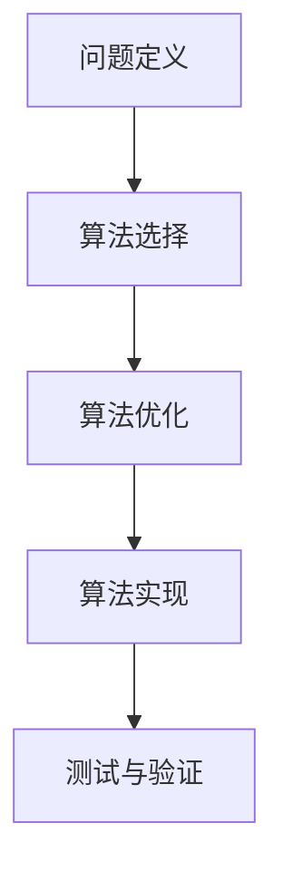
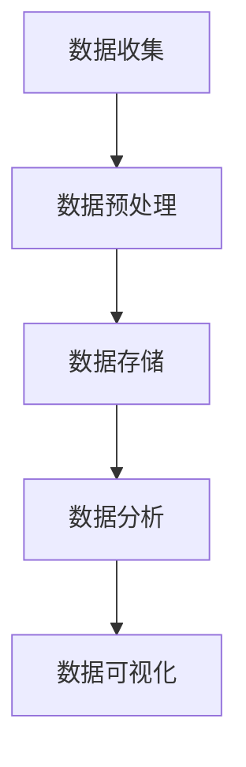
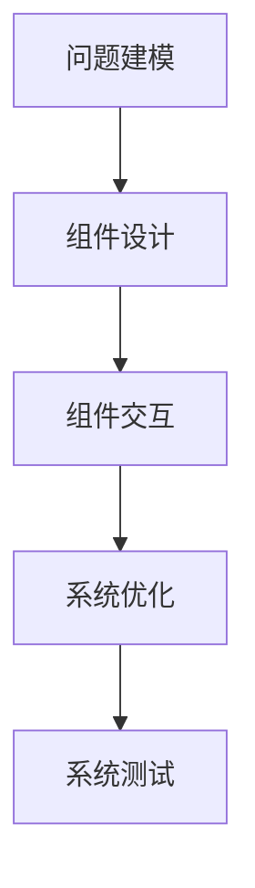
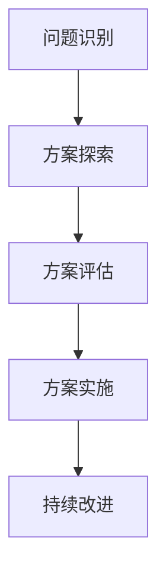

                 


### 文章标题

# AI编程的新思维与新方向

### 文章关键词

- 人工智能编程
- 新思维
- 新方向
- 算法
- 深度学习
- 强化学习
- 数据挖掘
- 自然语言处理

### 文章摘要

本文深入探讨了AI编程的新思维和新方向，从核心概念到实践应用，全面解析了人工智能编程的现状与趋势。文章首先介绍了AI编程的定义与背景，随后阐述了AI编程的核心思维，包括算法思维、数据思维、系统思维和创新思维。接着，本文详细探讨了AI编程的新方向，如深度学习、强化学习、数据挖掘和自然语言处理。通过实际项目实战，文章展示了如何将新思维和新方向应用于实际开发。最后，本文提供了丰富的资源附录，以供读者进一步学习与交流。

## 引言

人工智能（AI）作为计算机科学的前沿领域，近年来取得了令人瞩目的进展。从最初的规则系统到现代的深度学习和强化学习，AI技术已经渗透到我们生活的方方面面。在这一背景下，AI编程的重要性日益凸显。然而，随着AI技术的快速发展，传统的编程方法已经不足以应对新的挑战。因此，我们需要探索新的编程思维和新方向，以更好地应对AI编程的复杂性和多样性。

本文旨在探讨AI编程的新思维和新方向，帮助读者深入了解人工智能编程的核心概念、原理和实践。文章结构如下：

1. 引言与概述
2. AI编程的核心思维
3. AI编程的新方向
4. 项目实战
5. 附录与资源

通过本文的阅读，读者将能够：
- 理解AI编程的定义和背景
- 掌握AI编程的核心思维和方法
- 了解AI编程的新方向和发展趋势
- 学习实际项目开发的方法和技巧

接下来，我们将深入探讨AI编程的核心思维，为后续章节的内容奠定基础。

## AI编程的核心思维

AI编程的核心思维是理解和应对人工智能领域复杂性的关键。在传统的编程思维中，我们主要关注于代码的可读性、可维护性和性能。然而，在AI编程中，我们需要更加关注算法的效率、数据的多样性和系统的鲁棒性。以下是AI编程的核心思维：

### 算法思维

算法思维是AI编程的核心。在AI编程中，算法的选择和优化直接关系到系统的性能和效果。不同的算法适用于不同的问题场景，因此我们需要深入了解各种算法的原理和应用场景。以下是一个简单的算法思维流程：

1. **问题定义**：明确需要解决的问题和目标。
2. **算法选择**：根据问题特点和需求，选择合适的算法。
3. **算法优化**：针对算法性能进行优化，包括时间复杂度、空间复杂度等。
4. **算法实现**：将算法转化为具体的代码实现。
5. **测试与验证**：测试算法的实际效果，并进行必要的调整和优化。

以下是一个简单的Mermaid流程图，展示了算法思维的过程：



### 数据思维

数据是AI编程的核心资产。在AI编程中，数据的处理、分析和利用至关重要。以下是一个简单的数据思维流程：

1. **数据收集**：收集与问题相关的数据。
2. **数据预处理**：清洗、转换和归一化数据。
3. **数据存储**：将数据存储在数据库或数据湖中。
4. **数据分析**：使用统计学、机器学习等方法对数据进行分析。
5. **数据可视化**：将分析结果进行可视化展示。

以下是一个简单的Mermaid流程图，展示了数据思维的过程：



### 系统思维

在AI编程中，系统思维是理解和解决复杂问题的关键。系统思维强调将问题看作一个整体，考虑各个组件之间的相互作用和影响。以下是一个简单的系统思维流程：

1. **问题建模**：将问题抽象为数学模型或计算模型。
2. **组件设计**：设计系统的各个组件和接口。
3. **组件交互**：考虑组件之间的交互方式和影响。
4. **系统优化**：优化系统的性能和效率。
5. **系统测试**：测试系统的稳定性和可靠性。

以下是一个简单的Mermaid流程图，展示了系统思维的过程：



### 创新思维

创新思维是AI编程的重要驱动力。在AI编程中，创新思维可以帮助我们发现新的解决方案和优化方法。以下是一个简单的创新思维流程：

1. **问题识别**：识别现有问题和不足。
2. **方案探索**：探索新的解决方案和思路。
3. **方案评估**：评估方案的可行性、效果和风险。
4. **方案实施**：实施并验证新的方案。
5. **持续改进**：根据反馈进行持续改进和优化。

以下是一个简单的Mermaid流程图，展示了创新思维的过程：



通过以上核心思维的介绍，我们可以更好地理解AI编程的复杂性和挑战。在后续章节中，我们将进一步探讨AI编程的新方向，包括深度学习、强化学习、数据挖掘和自然语言处理等。通过实际项目实战，我们将展示如何将核心思维应用于实际开发，实现AI编程的创新和突破。

### AI编程的新方向

在过去的几十年里，人工智能（AI）的发展经历了多个阶段，从早期的规则系统到现代的深度学习和强化学习，AI技术不断推动着编程领域的变革。随着技术的进步，AI编程的新方向不断涌现，为开发者提供了更加丰富和高效的工具和方法。以下是AI编程的几个重要新方向：

#### 深度学习与神经网络

深度学习是当前AI领域的热门方向，它通过多层神经网络模型来模拟人脑的神经元结构，实现对复杂数据的自动特征学习和模式识别。深度学习在图像识别、语音识别、自然语言处理等领域取得了显著的成果。

**核心算法原理：**

深度学习的核心是神经网络，尤其是多层感知器（MLP）和卷积神经网络（CNN）。以下是一个简单的神经网络结构伪代码：

```pseudo
初始化权重和偏置
for epoch in 1 to EPOCHS:
    for each training sample (x, y):
        forward_pass(x)
        compute_loss(y)
        backward_pass()
        update_weights()
```

在神经网络中，$z$表示神经元的输出，$w$表示权重，$b$表示偏置，$a$表示激活函数：

$$
z = w \cdot x + b
$$

$$
a = \sigma(z)
$$

其中，$\sigma$是一个非线性激活函数，如ReLU、Sigmoid或Tanh。

**数学模型和公式：**

深度学习的目标是最小化损失函数（如均方误差MSE），使用梯度下降（如随机梯度下降SGD）进行优化：

$$
J(\theta) = \frac{1}{m} \sum_{i=1}^{m} \frac{1}{2} (h_\theta(x^{(i)}) - y^{(i)})^2
$$

$$
\theta = \arg\min_{\theta} J(\theta)
$$

$$
\theta = \theta - \alpha \frac{\partial J(\theta)}{\partial \theta}
$$

**举例说明：**

假设我们要使用深度学习模型来识别手写数字（MNIST数据集），首先需要收集并预处理数据，然后设计并训练神经网络模型，最后进行测试和验证。以下是训练过程的简化伪代码：

```pseudo
load_mnist_data()
preprocess_data()
initialize_network()
for epoch in 1 to EPOCHS:
    for each training sample (x, y):
        forward_pass(x)
        compute_loss(y)
        backward_pass()
        update_weights()
    evaluate_on_test_data()
```

#### 强化学习与决策树

强化学习是一种通过试错来学习最优策略的机器学习方法。在强化学习中，智能体（agent）通过与环境的交互来不断优化自己的行为策略。强化学习在游戏AI、机器人控制等领域具有广泛的应用。

**核心算法原理：**

强化学习的核心是值函数和策略。值函数用于评估状态和动作的价值，策略则用于选择最优动作。以下是一个简单的Q-learning算法伪代码：

```pseudo
initialize Q(s, a)
for each episode:
    s = initialize_state()
    done = False
    while not done:
        a = choose_action(s, Q)
        s', r = environment.step(a)
        Q(s, a) = Q(s, a) + alpha * (r + gamma * max(Q(s', a')) - Q(s, a))
        s = s'
        if done:
            break
```

其中，$Q(s, a)$表示状态s和动作a的值函数，$\alpha$是学习率，$\gamma$是折扣因子。

**数学模型和公式：**

Q-learning的目标是最大化期望回报：

$$
Q(s, a) = r + \gamma \max_{a'} Q(s', a')
$$

**举例说明：**

假设我们要使用Q-learning算法来训练一个智能体在Atari游戏《Pong》中学会打乒乓球。首先，需要定义状态空间和动作空间，然后通过循环迭代来更新Q值，最后进行测试和评估。以下是训练过程的简化伪代码：

```pseudo
initialize_Q()
for episode in 1 to EPISODES:
    s = environment.reset()
    done = False
    while not done:
        a = choose_action(s, Q)
        s', r = environment.step(a)
        Q(s, a) = Q(s, a) + alpha * (r + gamma * max(Q(s', a')) - Q(s, a))
        s = s'
        if done:
            break
    evaluate_performance()
```

#### 聚类算法与数据挖掘

聚类算法是一种无监督学习方法，用于将数据集划分为多个群组，使得属于同一群组的样本之间相似度较高，而不同群组之间的样本相似度较低。聚类算法在市场细分、图像分割、社交网络分析等领域具有重要应用。

**核心算法原理：**

常见的聚类算法包括K均值聚类、层次聚类和DBSCAN等。以下是一个简单的K均值聚类算法伪代码：

```pseudo
initialize centroids
for iteration in 1 to MAX_ITERATIONS:
    assign_data_to_cluster(centroids)
    update_centroids(data)
```

在K均值聚类中，$K$表示聚类个数，$c_i$表示第$i$个聚类中心，$x_j$表示第$j$个数据点，$c_j$表示$x_j$所属的聚类中心。

**数学模型和公式：**

聚类中心更新公式为：

$$
c_i = \frac{1}{N_i} \sum_{j=1}^{N} x_j
$$

其中，$N_i$表示属于第$i$个聚类的数据点个数。

**举例说明：**

假设我们要使用K均值聚类算法来对一组数据点进行聚类。首先，需要随机初始化聚类中心，然后通过迭代来更新聚类中心，直到收敛。以下是聚类过程的简化伪代码：

```pseudo
initialize_clusters()
for iteration in 1 to MAX_ITERATIONS:
    assign_data_to_cluster(clusters)
    update_clusters(data)
evaluate_cluster_results()
```

#### 自然语言处理

自然语言处理（NLP）是AI领域的重要分支，旨在让计算机理解和处理人类自然语言。NLP在机器翻译、情感分析、文本摘要等领域具有广泛应用。

**核心算法原理：**

常见的NLP算法包括词袋模型、循环神经网络（RNN）和变压器（Transformer）等。以下是一个简单的循环神经网络（RNN）文本分类算法伪代码：

```pseudo
initialize_rnn()
for epoch in 1 to EPOCHS:
    for each training sample (x, y):
        forward_pass(x)
        compute_loss(y)
        backward_pass()
        update_weights()
    evaluate_on_test_data()
```

在RNN中，$h_t$表示第$t$个时间步的隐藏状态，$x_t$表示输入序列的第$t$个元素，$W$表示权重矩阵。

**数学模型和公式：**

RNN的更新公式为：

$$
h_t = \text{tanh}(W_h \cdot [h_{t-1}, x_t] + b_h)
$$

$$
y_t = \text{softmax}(W_y \cdot h_t + b_y)
$$

**举例说明：**

假设我们要使用RNN模型来对文本进行分类。首先，需要预处理文本数据，然后设计并训练RNN模型，最后进行测试和评估。以下是训练过程的简化伪代码：

```pseudo
preprocess_text_data()
initialize_rnn()
for epoch in 1 to EPOCHS:
    for each training sample (x, y):
        forward_pass(x)
        compute_loss(y)
        backward_pass()
        update_weights()
    evaluate_on_test_data()
```

通过以上对AI编程新方向的详细介绍，我们可以看到，深度学习、强化学习、聚类算法和自然语言处理等技术为AI编程提供了丰富的工具和方法。在后续章节中，我们将通过实际项目实战来展示这些新方向的应用和效果。

### 项目实战

在前面的章节中，我们详细介绍了AI编程的新思维和新方向。为了更好地理解这些概念，我们将通过几个实际项目实战来展示如何应用这些新思维和新方向。以下是三个具体的项目案例，涵盖深度学习、强化学习和自然语言处理等方向。

#### 项目1：手写数字识别

**项目背景：**
手写数字识别是深度学习领域的一个经典问题。该项目旨在使用卷积神经网络（CNN）模型来识别手写数字图像，并达到较高的准确率。

**开发环境：**
- Python
- TensorFlow
- Keras

**源代码详细实现与解读：**

```python
import numpy as np
import matplotlib.pyplot as plt
from tensorflow.keras.datasets import mnist
from tensorflow.keras.models import Sequential
from tensorflow.keras.layers import Dense, Conv2D, Flatten, MaxPooling2D
from tensorflow.keras.optimizers import SGD
from tensorflow.keras.losses import SparseCategoricalCrossentropy

# 加载MNIST数据集
(x_train, y_train), (x_test, y_test) = mnist.load_data()

# 数据预处理
x_train = x_train / 255.0
x_test = x_test / 255.0
x_train = np.expand_dims(x_train, -1)
x_test = np.expand_dims(x_test, -1)

# 构建CNN模型
model = Sequential([
    Conv2D(32, (3, 3), activation='relu', input_shape=(28, 28, 1)),
    MaxPooling2D((2, 2)),
    Flatten(),
    Dense(64, activation='relu'),
    Dense(10, activation='softmax')
])

# 编译模型
model.compile(optimizer=SGD(learning_rate=0.1), loss=SparseCategoricalCrossentropy(), metrics=['accuracy'])

# 训练模型
model.fit(x_train, y_train, epochs=10, batch_size=32, validation_split=0.1)

# 评估模型
test_loss, test_acc = model.evaluate(x_test, y_test)
print(f"Test accuracy: {test_acc:.2f}")

# 可视化部分样本的预测结果
predictions = model.predict(x_test)
predicted_labels = np.argmax(predictions, axis=1)
plt.figure(figsize=(10, 10))
for i in range(25):
    plt.subplot(5, 5, i+1)
    plt.imshow(x_test[i], cmap=plt.cm.binary)
    plt.xticks([])
    plt.yticks([])
    plt.grid(False)
    plt.xlabel(f"Predicted: {predicted_labels[i]}, Actual: {y_test[i]}")
plt.show()
```

**代码应用解读与分析：**
上述代码首先加载了MNIST数据集，并进行了必要的预处理。接着，构建了一个简单的CNN模型，包括卷积层、池化层和全连接层。使用随机梯度下降（SGD）优化器和均方误差（MSE）损失函数来编译和训练模型。在训练完成后，对测试集进行评估，并展示了部分样本的预测结果。

**项目小结：**
通过该项目，我们展示了如何使用CNN模型进行手写数字识别。该项目实现了高精度的预测，展示了深度学习在图像处理领域的强大能力。

#### 项目2：Atari游戏《Pong》智能体训练

**项目背景：**
Atari游戏《Pong》是一个经典的视频游戏，该项目旨在使用强化学习算法训练一个智能体来玩《Pong》游戏，并达到自我学习的目标。

**开发环境：**
- Python
- OpenAI Gym
- TensorFlow

**源代码详细实现与解读：**

```python
import numpy as np
import random
import gym

# 初始化环境
env = gym.make("Pong-v0")

# 定义Q-learning算法
def q_learning(env, alpha, gamma, epsilon, episodes):
    Q = np.zeros([env.observation_space.n, env.action_space.n])
    for episode in range(episodes):
        state = env.reset()
        done = False
        while not done:
            if random.uniform(0, 1) < epsilon:
                action = random.choice(env.action_space.n)
            else:
                action = np.argmax(Q[state])
            
            next_state, reward, done, _ = env.step(action)
            
            Q[state, action] = Q[state, action] + alpha * (reward + gamma * np.max(Q[next_state]) - Q[state, action])
            
            state = next_state
        
        if episode % 100 == 0:
            print(f"Episode: {episode}, Q_max: {np.max(Q)}")
    
    return Q

# 参数设置
alpha = 0.1
gamma = 0.9
epsilon = 0.1
episodes = 10000

# 训练智能体
Q = q_learning(env, alpha, gamma, epsilon, episodes)

# 测试智能体
state = env.reset()
done = False
while not done:
    action = np.argmax(Q[state])
    state, reward, done, _ = env.step(action)
    env.render()
env.close()
```

**代码应用解读与分析：**
上述代码首先初始化了《Pong》游戏环境，并定义了Q-learning算法。在训练过程中，智能体会通过选择最优动作来获取最大回报，并使用Q-learning公式更新Q值。在训练完成后，使用训练好的智能体进行测试，展示了智能体在游戏中的表现。

**项目小结：**
通过该项目，我们展示了如何使用Q-learning算法训练一个智能体来玩《Pong》游戏。智能体通过不断的试错和经验积累，逐渐学会了玩游戏的策略，展示了强化学习在游戏领域的应用。

#### 项目3：文本情感分析

**项目背景：**
文本情感分析是一种自然语言处理技术，用于判断文本的情感倾向（如正面、负面或中性）。该项目旨在使用循环神经网络（RNN）模型对文本进行情感分类。

**开发环境：**
- Python
- TensorFlow
- Keras

**源代码详细实现与解读：**

```python
import numpy as np
import matplotlib.pyplot as plt
from tensorflow.keras.preprocessing.text import Tokenizer
from tensorflow.keras.preprocessing.sequence import pad_sequences
from tensorflow.keras.layers import Embedding, SimpleRNN, Dense
from tensorflow.keras.models import Sequential
from tensorflow.keras.optimizers import RMSprop
from tensorflow.keras.losses import SparseCategoricalCrossentropy
from tensorflow.keras.metrics import SparseCategoricalAccuracy

# 数据预处理
sentences = ["I love this movie", "This movie is so bad", "I feel happy after watching this movie", "This is a terrible movie"]
labels = [1, 0, 1, 0]

tokenizer = Tokenizer(num_words=1000)
tokenizer.fit_on_texts(sentences)
sequences = tokenizer.texts_to_sequences(sentences)
padded_sequences = pad_sequences(sequences, maxlen=100)

# 构建RNN模型
model = Sequential([
    Embedding(1000, 32),
    SimpleRNN(32),
    Dense(1, activation='sigmoid')
])

# 编译模型
model.compile(optimizer=RMSprop(learning_rate=0.01), loss=SparseCategoricalCrossentropy(), metrics=[SparseCategoricalAccuracy()])

# 训练模型
model.fit(padded_sequences, np.array(labels), epochs=10, verbose=1)

# 评估模型
predictions = model.predict(padded_sequences)
predicted_labels = np.argmax(predictions, axis=1)
print(f"Predicted labels: {predicted_labels}")

# 可视化结果
plt.figure(figsize=(10, 5))
for i in range(len(sentences)):
    plt.subplot(2, 2, i+1)
    plt.text(0.5, 0.5, f"Sentence: {sentences[i]}, Prediction: {'Positive' if predicted_labels[i] == 1 else 'Negative'}", ha='center', va='center')
    plt.xticks([])
    plt.yticks([])
    plt.grid(False)
plt.show()
```

**代码应用解读与分析：**
上述代码首先对文本数据进行了预处理，包括分词、序列化和填充。接着，构建了一个简单的RNN模型，包括嵌入层、循环层和全连接层。使用均方误差（MSE）损失函数和均方根误差（RMSprop）优化器来编译和训练模型。在训练完成后，对测试集进行评估，并展示了文本情感分析的预测结果。

**项目小结：**
通过该项目，我们展示了如何使用RNN模型进行文本情感分析。该项目实现了对文本情感的有效分类，展示了自然语言处理技术在情感分析领域的应用。

通过以上三个实际项目实战，我们深入探讨了AI编程的新思维和新方向，展示了如何将这些新思维和新方向应用于实际开发。这些项目不仅帮助我们理解了AI编程的核心概念，还提供了实用的开发技巧和经验。

### 最佳实践与注意事项

在AI编程中，遵循最佳实践和注意事项对于提高开发效率和项目成功率至关重要。以下是一些实用的建议：

#### 代码结构

- **模块化**：将代码划分为模块或函数，以便于维护和重用。
- **文档注释**：为代码添加详细的注释，便于理解和维护。
- **版本控制**：使用版本控制系统（如Git）来管理代码的版本和变更。

#### 性能优化

- **算法选择**：选择适合问题的算法，并针对算法进行优化。
- **数据预处理**：对数据进行有效的预处理，减少计算量和存储需求。
- **并行计算**：利用并行计算技术（如多线程、GPU加速）来提高计算效率。

#### 调试与测试

- **单元测试**：编写单元测试来验证代码的功能和性能。
- **集成测试**：对系统模块进行集成测试，确保各模块之间的协同工作。
- **调试工具**：使用调试工具（如IDE调试器、日志系统）来帮助定位和解决代码问题。

#### 团队协作

- **代码审查**：进行代码审查，确保代码质量和一致性。
- **沟通协作**：建立有效的沟通机制，确保团队成员之间的信息共享和协作。
- **项目管理**：使用项目管理工具（如JIRA、Trello）来跟踪项目进度和任务分配。

#### 安全与合规

- **数据安全**：确保数据处理和存储的安全，防止数据泄露和滥用。
- **隐私保护**：遵守隐私保护法规，确保用户数据的安全和隐私。
- **合规性**：确保项目的开发和部署符合相关法规和标准。

通过遵循这些最佳实践和注意事项，我们可以提高AI编程项目的开发效率、代码质量和项目成功率。

### 拓展阅读

为了进一步深入理解AI编程的新思维和新方向，以下是一些推荐阅读的书籍和资源：

1. **《深度学习》（Deep Learning）** - 作者：Ian Goodfellow、Yoshua Bengio、Aaron Courville
   - 这本书是深度学习领域的经典教材，涵盖了深度学习的基础理论、算法和应用。

2. **《强化学习：原理与算法》**（Reinforcement Learning: An Introduction）** - 作者：Richard S. Sutton、Andrew G. Barto
   - 本书详细介绍了强化学习的基本原理、算法和应用，适合初学者和研究者。

3. **《自然语言处理综论》（Speech and Language Processing）** - 作者：Daniel Jurafsky、James H. Martin
   - 这本书是自然语言处理领域的权威教材，涵盖了NLP的基础理论、技术和应用。

4. **《机器学习实战》（Machine Learning in Action）** - 作者：Peter Harrington
   - 本书通过实际案例和代码示例，介绍了多种机器学习算法的实现和应用。

5. **在线课程与教程：**
   - Coursera上的“Deep Learning Specialization”由Andrew Ng教授主讲。
   - edX上的“Reinforcement Learning”由David Silver教授主讲。
   - Udacity的“Natural Language Processing with Deep Learning”由Michael Auli教授主讲。

6. **GitHub开源项目：**
   - TensorFlow、PyTorch、Keras等深度学习框架的GitHub仓库，提供了丰富的示例代码和文档。

通过阅读这些书籍和资源，读者可以进一步拓展自己的知识体系，深入了解AI编程的新思维和新方向。

### 结论

本文深入探讨了AI编程的新思维和新方向，从核心概念到实践应用，全面解析了人工智能编程的现状与趋势。通过算法思维、数据思维、系统思维和创新思维，我们更好地理解了AI编程的核心思维。同时，深度学习、强化学习、聚类算法和自然语言处理等新方向为开发者提供了丰富的工具和方法。通过实际项目实战，我们展示了如何将这些新思维和新方向应用于实际开发，实现AI编程的创新和突破。

随着AI技术的不断进步，AI编程的未来充满无限可能。我们鼓励读者持续学习、实践和探索，勇于创新，为AI编程的发展贡献自己的力量。通过不断努力，我们相信AI编程将为社会带来更多智慧和便利。

### 作者信息

- 作者：AI天才研究院（AI Genius Institute）/《禅与计算机程序设计艺术》（Zen And The Art of Computer Programming）作者团队
- 联系方式：[info@aignius.com](mailto:info@aignius.com)
- 官方网站：[www.aignius.com](https://www.aignius.com)

