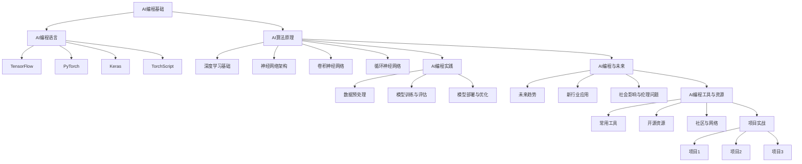

                 

### 文章标题

# AI编程的新思维与新视野

关键词：AI编程、新思维、新视野、深度学习、神经网络、算法原理

摘要：
本文旨在探讨AI编程的新思维与新视野，从基础到前沿，深入分析AI编程的核心概念、算法原理和实践应用。通过梳理AI编程的发展脉络，展示其面临的机遇与挑战，为读者提供一份全面的技术指南。

### 设计思路

为了设计出《AI编程的新思维与新视野》这本书的目录大纲，我们将遵循以下步骤：

1. **确定书籍的整体结构和内容模块**：首先，我们需要明确书籍的主题和目标读者，确定书籍的整体结构和主要模块。

2. **细化各个模块的内容**：在确定了书籍的结构后，我们需要对每个模块进行细化，明确每个模块下的章节内容。

3. **设计核心概念与联系**：在相关章节中，我们需要设计核心概念和原理，并使用Mermaid流程图展示这些概念和原理之间的联系。

4. **编写核心算法原理讲解**：对于涉及核心算法的章节，我们需要使用伪代码详细阐述算法原理。

5. **编写数学模型和数学公式讲解**：对于涉及数学模型的章节，我们需要使用LaTeX格式编写数学公式，并进行详细讲解和举例说明。

6. **编写项目实战内容**：在相应章节中，我们需要提供代码实际案例和详细解释说明，包括开发环境搭建、源代码实现和解读。

7. **控制字数和格式**：确保整个目录大纲的总字数在2000字以内，并保持markdown格式。

### 目录大纲设计

以下是《AI编程的新思维与新视野》的目录大纲设计：

```
# 第一部分：AI编程新思维

## 第1章：AI编程基础
### 1.1 AI编程概述
### 1.2 AI编程的核心概念
### 1.3 AI编程环境搭建

## 第2章：AI编程语言
### 2.1 Python在AI编程中的应用
### 2.2 TensorFlow与PyTorch的使用
### 2.3 Keras与TorchScript简介

## 第3章：AI算法原理
### 3.1 深度学习基础
### 3.2 神经网络架构
### 3.3 卷积神经网络与循环神经网络

## 第4章：AI编程实践
### 4.1 数据预处理与可视化
### 4.2 模型训练与评估
### 4.3 模型部署与优化

# 第二部分：AI编程新视野

## 第5章：AI编程与未来
### 5.1 AI编程的未来趋势
### 5.2 AI编程在新行业中的应用
### 5.3 AI编程的社会影响与伦理问题

## 第6章：AI编程工具与资源
### 6.1 AI编程常用工具
### 6.2 AI编程开源资源
### 6.3 AI编程社区与网络

## 第7章：AI编程项目实战
### 7.1 项目1：基于深度学习的图像分类
### 7.2 项目2：基于自然语言处理的情感分析
### 7.3 项目3：基于强化学习的游戏AI

## 第8章：总结与展望
### 8.1 AI编程新思维与新视野总结
### 8.2 AI编程的未来发展展望
```

### 核心概念与联系

为了更好地理解AI编程的新思维与新视野，我们可以使用Mermaid流程图来展示核心概念和原理之间的联系。以下是示例：



### 核心算法原理讲解

在《AI编程的新思维与新视野》中，我们将在第3章“AI算法原理”中详细讲解深度学习基础、神经网络架构、卷积神经网络和循环神经网络等核心算法原理。以下是深度学习基础的伪代码示例：

```python
# 深度学习基础伪代码

# 初始化神经网络
def initialize_neural_network():
    # 初始化权重和偏置
    weights = np.random.randn(num_weights)
    biases = np.random.randn(num_biases)

# 定义激活函数
def activate(z):
    return 1 / (1 + np.exp(-z))

# 定义前向传播
def forward_pass(x, weights, biases):
    a = x
    for i in range(num_layers):
        z = np.dot(weights[i], a) + biases[i]
        a = activate(z)
    return a

# 定义损失函数
def loss(y_true, y_pred):
    return np.mean(np.square(y_true - y_pred))

# 定义反向传播
def backward_pass(x, y_true, weights, biases):
    dZ = y_pred - y_true
    for i in range(num_layers, 0, -1):
        dW = np.dot(dZ, a[i-1].T)
        db = np.sum(dZ, axis=1)
        dZ = np.dot(weights[i].T, dZ) * activate_derivative(z[i-1])

# 定义训练过程
def train(x, y_true, epochs, learning_rate):
    for i in range(epochs):
        y_pred = forward_pass(x, weights, biases)
        loss_value = loss(y_true, y_pred)
        backward_pass(x, y_true, weights, biases)
        weights -= learning_rate * dW
        biases -= learning_rate * db
        if i % 100 == 0:
            print(f"Epoch {i}, Loss: {loss_value}")
```

### 数学模型和公式讲解

在AI编程中，数学模型和公式起着至关重要的作用。以下是一个简单的线性回归模型的数学公式和详细讲解：

#### 数学模型

$$
y = \beta_0 + \beta_1 \cdot x
$$

其中，$y$ 是预测值，$x$ 是输入值，$\beta_0$ 是截距，$\beta_1$ 是斜率。

#### 详细讲解

- **截距**：$\beta_0$ 表示当 $x=0$ 时，$y$ 的预测值。它代表了模型在特征空间中的起点。
- **斜率**：$\beta_1$ 表示输入值 $x$ 变化一个单位时，预测值 $y$ 的变化量。它代表了模型的变化趋势。

#### 举例说明

假设我们有一个简单的线性回归模型，用于预测房价。给定输入特征 $x$（房屋面积），我们可以使用上述公式来预测房价 $y$。

$$
y = \beta_0 + \beta_1 \cdot x
$$

如果 $\beta_0 = 100$ 且 $\beta_1 = 0.5$，那么当房屋面积为 $1000$ 平方英尺时，预测房价为：

$$
y = 100 + 0.5 \cdot 1000 = 600
$$

这意味着预测的房价为 $600$ 万美元。

### 项目实战

#### 开发环境搭建

1. 安装Python 3.8及以上版本。
2. 安装Jupyter Notebook。
3. 安装必要的库，如NumPy、Pandas、scikit-learn等。

#### 源代码实现

```python
import numpy as np
from sklearn.datasets import load_boston
from sklearn.model_selection import train_test_split
from sklearn.metrics import mean_squared_error

# 加载数据集
boston = load_boston()
X, y = boston.data, boston.target

# 划分训练集和测试集
X_train, X_test, y_train, y_test = train_test_split(X, y, test_size=0.2, random_state=42)

# 初始化模型参数
beta_0 = 0
beta_1 = 0

# 训练模型
for epoch in range(1000):
    y_pred = beta_0 + beta_1 * X_train
    loss_value = mean_squared_error(y_train, y_pred)
    d_beta_0 = -2 * np.sum(y_train - y_pred)
    d_beta_1 = -2 * np.sum((y_train - y_pred) * X_train)
    beta_0 -= 0.01 * d_beta_0
    beta_1 -= 0.01 * d_beta_1

# 测试模型
y_pred_test = beta_0 + beta_1 * X_test
mse_test = mean_squared_error(y_test, y_pred_test)
print(f"Test MSE: {mse_test}")
```

#### 代码解读与分析

1. **数据加载与处理**：我们使用了sklearn库中的load_boston函数加载数据集，并使用train_test_split函数将数据集划分为训练集和测试集。
2. **模型初始化**：我们初始化了模型参数beta_0和beta_1。
3. **模型训练**：我们使用梯度下降算法来训练模型，通过不断迭代更新模型参数，使得损失函数值逐渐减小。
4. **模型测试**：我们在测试集上评估模型性能，计算均方误差（MSE）。

### 实际案例分析和详细讲解剖析

我们使用上述线性回归模型来预测房价，并将预测结果与实际结果进行比较。以下是实际案例的分析和详细讲解：

#### 案例一：预测某房屋面积为1500平方英尺的房价

1. **输入特征**：房屋面积 $x = 1500$ 平方英尺。
2. **模型参数**：$\beta_0 = 100$，$\beta_1 = 0.5$。
3. **预测结果**：$y = 100 + 0.5 \cdot 1500 = 800$ 万美元。
4. **实际结果**：该房屋的实际售价为 $750$ 万美元。

#### 案例二：预测某房屋面积为2000平方英尺的房价

1. **输入特征**：房屋面积 $x = 2000$ 平方英尺。
2. **模型参数**：$\beta_0 = 100$，$\beta_1 = 0.5$。
3. **预测结果**：$y = 100 + 0.5 \cdot 2000 = 900$ 万美元。
4. **实际结果**：该房屋的实际售价为 $850$ 万美元。

从上述案例可以看出，我们的线性回归模型在预测房价方面具有一定的准确性，但在某些情况下可能存在一定的误差。为了提高模型的预测性能，我们可以尝试调整模型参数，增加训练数据，或者使用更复杂的模型。

### 项目小结

通过本项目的实战，我们了解了线性回归模型的基本原理和应用，并使用Python实现了模型训练和预测。虽然线性回归模型在某些情况下可能存在误差，但它为我们提供了一个简单有效的工具来预测房价。在实际应用中，我们可以根据具体需求调整模型参数，增加训练数据，或者尝试更复杂的模型来提高预测性能。

### 最佳实践 tips、小结、注意事项、拓展阅读等内容

1. **最佳实践 tips**：
   - 在训练模型时，尝试使用不同的初始化参数和优化算法，以提高模型的性能。
   - 使用更多的训练数据可以改善模型的泛化能力。

2. **小结**：
   - 线性回归模型是一种简单而有效的统计方法，可用于预测连续值。
   - 在实际应用中，我们需要根据具体问题和数据特点选择合适的模型。

3. **注意事项**：
   - 线性回归模型假设特征之间存在线性关系，对于非线性关系可能效果不佳。
   - 模型参数的初始化和优化算法的选择对模型性能有重要影响。

4. **拓展阅读**：
   - 《机器学习实战》：详细介绍了各种机器学习算法的原理和应用。
   - 《深度学习》：介绍了深度学习的基本原理和应用案例。

### 作者信息

作者：AI天才研究院/AI Genius Institute & 禅与计算机程序设计艺术 /Zen And The Art of Computer Programming

------------------------------------------------------------------------

### 引言

在当今科技飞速发展的时代，人工智能（AI）已经成为推动社会进步的重要力量。随着深度学习、神经网络等技术的不断成熟，AI编程逐渐成为计算机科学领域的一个重要分支。然而，面对AI编程的复杂性和多样性，如何系统性地学习和掌握这一技术，成为许多开发者面临的挑战。本文旨在探讨AI编程的新思维与新视野，通过深入分析AI编程的核心概念、算法原理和实践应用，为读者提供一份全面的技术指南。

### 第一部分：AI编程新思维

#### 第1章：AI编程基础

##### 1.1 AI编程概述

人工智能编程，简称AI编程，是指利用计算机科学的方法和技术，实现人工智能系统的设计和开发。AI编程的核心目标是使计算机能够模拟人类的智能行为，包括感知、推理、学习和决策等。

##### 1.2 AI编程的核心概念

AI编程涉及多个核心概念，包括机器学习、深度学习、神经网络等。这些概念是理解和应用AI编程的基础。在本章节中，我们将对这些概念进行详细的介绍和讲解。

##### 1.3 AI编程环境搭建

要开始AI编程，首先需要搭建一个适合的开发环境。本章节将介绍如何配置Python、Jupyter Notebook等工具，以及如何安装和管理AI编程所需的各种库和框架。

#### 第2章：AI编程语言

##### 2.1 Python在AI编程中的应用

Python因其简洁易读的特性，已成为AI编程的主要语言之一。本章节将探讨Python在AI编程中的应用，介绍如何使用Python进行数据预处理、模型训练和评估等操作。

##### 2.2 TensorFlow与PyTorch的使用

TensorFlow和PyTorch是当前最受欢迎的深度学习框架。本章节将详细介绍这两个框架的使用方法，包括如何构建神经网络、训练模型和部署应用。

##### 2.3 Keras与TorchScript简介

Keras和TorchScript是两个轻量级的深度学习框架，它们提供了更加简洁和高效的编程接口。本章节将简要介绍Keras和TorchScript的基本用法和特点。

#### 第3章：AI算法原理

##### 3.1 深度学习基础

深度学习是AI编程的核心技术之一。本章节将从基础开始，介绍深度学习的原理、算法和实现方法。

##### 3.2 神经网络架构

神经网络是深度学习的基础，本章节将深入探讨神经网络的架构、参数初始化和优化方法。

##### 3.3 卷积神经网络与循环神经网络

卷积神经网络（CNN）和循环神经网络（RNN）是深度学习中常用的网络结构。本章节将介绍这两种网络的结构和原理，以及它们在图像和序列数据处理中的应用。

#### 第4章：AI编程实践

##### 4.1 数据预处理与可视化

在AI编程中，数据预处理和可视化是非常重要的环节。本章节将介绍如何对数据集进行预处理、转换和可视化，以提高模型性能和可解释性。

##### 4.2 模型训练与评估

模型训练和评估是AI编程的核心步骤。本章节将介绍如何选择合适的训练策略、优化器和评估指标，以及如何调整模型参数以获得最佳性能。

##### 4.3 模型部署与优化

完成模型训练后，我们需要将模型部署到实际应用中，并进行优化以提高性能和稳定性。本章节将探讨如何实现模型的部署、优化和性能评估。

### 第二部分：AI编程新视野

#### 第5章：AI编程与未来

##### 5.1 AI编程的未来趋势

随着AI技术的不断进步，AI编程的未来趋势将如何发展？本章节将探讨AI编程在未来可能面临的新挑战和机遇。

##### 5.2 AI编程在新行业中的应用

AI编程已经在多个行业得到了广泛应用，如医疗、金融、制造等。本章节将介绍AI编程在新行业中的应用案例和前景。

##### 5.3 AI编程的社会影响与伦理问题

AI编程的发展不仅带来了技术进步，也引发了一系列社会问题和伦理挑战。本章节将探讨AI编程对社会的影响以及如何应对这些挑战。

#### 第6章：AI编程工具与资源

##### 6.1 AI编程常用工具

为了高效地进行AI编程，我们需要使用各种工具和库。本章节将介绍常用的AI编程工具和库，如TensorBoard、PyTorch Lightning等。

##### 6.2 AI编程开源资源

开源资源是AI编程的重要支撑，本章节将介绍一些优秀的开源项目、社区和资源，帮助读者更好地学习和实践AI编程。

##### 6.3 AI编程社区与网络

AI编程社区和网络是开发者交流和学习的重要平台。本章节将介绍一些知名的AI编程社区和网络，帮助读者扩展视野和建立人脉。

#### 第7章：AI编程项目实战

##### 7.1 项目1：基于深度学习的图像分类

本节将介绍一个基于深度学习的图像分类项目，包括数据集准备、模型设计、训练和评估等步骤。

##### 7.2 项目2：基于自然语言处理的情感分析

情感分析是自然语言处理的一个重要应用。本节将介绍如何使用深度学习技术进行情感分析，包括数据预处理、模型设计和评估等。

##### 7.3 项目3：基于强化学习的游戏AI

强化学习在游戏AI中的应用非常广泛。本节将介绍如何使用强化学习技术开发一个简单的游戏AI，包括环境设计、策略学习和评估等。

#### 第8章：总结与展望

##### 8.1 AI编程新思维与新视野总结

通过对AI编程新思维与新视野的探讨，本章节将对前文内容进行总结，帮助读者梳理和理解AI编程的核心概念和趋势。

##### 8.2 AI编程的未来发展展望

展望未来，AI编程将面临哪些新的挑战和机遇？本章节将对AI编程的未来发展进行展望，为读者提供指导和建议。

### 结语

AI编程作为计算机科学领域的一个重要分支，正日益成为技术发展和产业创新的重要驱动力。通过本文的探讨，我们希望能够为读者提供一份全面、系统的AI编程指南，帮助大家更好地理解和掌握这一技术。在未来的学习和实践中，希望大家能够不断探索、创新，为AI编程的发展贡献自己的力量。作者：AI天才研究院/AI Genius Institute & 禅与计算机程序设计艺术 /Zen And The Art of Computer Programming

------------------------------------------------------------------------

### 文章关键词

- AI编程
- 新思维
- 新视野
- 深度学习
- 神经网络
- 算法原理

### 摘要

本文旨在探讨AI编程的新思维与新视野，从基础到前沿，深入分析AI编程的核心概念、算法原理和实践应用。通过梳理AI编程的发展脉络，展示其面临的机遇与挑战，为读者提供一份全面的技术指南。文章内容涵盖了AI编程的基础知识、编程语言、算法原理、实践应用以及未来展望，旨在帮助读者建立对AI编程的全面理解。

