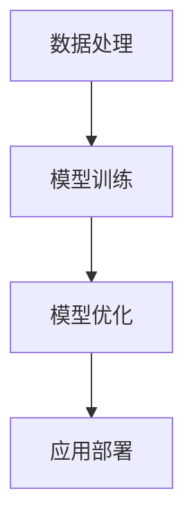

                 

### 文章标题：AI编程的新思维与新高度

关键词：AI编程，新思维，新高度，神经网络，深度学习，模块化编程，自动化编程，大数据，云计算，未来发展趋势

摘要：本文将深入探讨AI编程的新思维与新高度。首先，我们回顾了AI编程的背景与意义，然后详细分析了AI编程的核心概念与架构，包括数据处理、模型训练和模型优化等。接着，我们介绍了神经网络算法与深度学习算法，并探讨了它们的应用场景。随后，我们阐述了AI编程的新思维，如模块化编程和自动化编程。最后，我们展望了AI编程的未来发展趋势，包括大数据与AI编程、云计算与AI编程等，并分析了AI编程在行业中的应用和产业发展趋势。

---

### 第1章：AI编程的背景与意义

#### 1.1 AI编程的概念与特点

**1.1.1 AI编程的定义**

AI编程，即人工智能编程，是指使用编程语言和工具来开发人工智能系统的过程。这些系统通常能够模拟人类智能行为，如学习、推理、感知和决策等。

**1.1.2 AI编程与传统编程的区别**

传统编程注重逻辑和流程控制，而AI编程则更侧重于数据、算法和模型。AI编程需要处理大量的数据，使用复杂的算法来训练模型，并优化模型的性能。

**1.1.3 AI编程的发展历程**

AI编程的历史可以追溯到20世纪50年代，随着计算机技术的发展，AI编程经历了多个阶段，包括符号主义、连接主义、统计学习等。

#### 1.2 AI编程的意义

**1.2.1 提升软件开发效率**

AI编程可以自动化许多传统编程任务，如代码生成、测试和调试等，从而大大提升软件开发效率。

**1.2.2 促进人工智能应用的发展**

AI编程是人工智能应用发展的基础，通过编程，我们可以将人工智能技术应用于各个领域，如医疗、金融、教育等。

**1.2.3 引领未来软件开发的新方向**

AI编程正在引领未来软件开发的新方向，如自动化编程、模块化编程等，这些新思维将使软件开发更加高效和智能。

---

### 第2章：AI编程的核心概念与架构

#### 2.1 AI编程的核心概念

**2.1.1 数据处理**

数据处理是AI编程的基础，包括数据采集、数据清洗、数据预处理和数据可视化等。

**2.1.2 模型训练**

模型训练是指使用数据来训练模型，使其能够识别和预测数据中的模式。

**2.1.3 模型优化**

模型优化是指通过调整模型的参数，提高模型的性能和准确性。

#### 2.2 AI编程的架构

**2.2.1 数据流架构**

数据流架构是指数据在系统中流动的路径，包括数据采集、存储、处理和输出等。

**2.2.2 算法架构**

算法架构是指算法在系统中的组织结构，包括算法的设计、实现和优化等。

**2.2.3 系统架构**

系统架构是指系统的整体结构，包括硬件、软件和网络等。

---

### 第3章：AI编程的关键算法与模型

#### 3.1 神经网络算法

**3.1.1 神经网络的基本原理**

神经网络是一种模仿人脑结构的计算模型，它由大量相互连接的神经元组成。

**3.1.2 神经网络的主要类型**

神经网络分为多层感知机、卷积神经网络、循环神经网络等。

**3.1.3 神经网络的训练过程**

神经网络的训练过程包括前向传播、反向传播和参数调整等。

#### 3.2 深度学习算法

**3.2.1 深度学习的概念与特点**

深度学习是一种人工智能方法，它使用多层神经网络来学习数据中的复杂特征。

**3.2.2 深度学习的主要算法**

深度学习的主要算法包括卷积神经网络、循环神经网络、生成对抗网络等。

**3.2.3 深度学习的应用场景**

深度学习广泛应用于图像识别、语音识别、自然语言处理等领域。

---

### 第4章：AI编程的实际应用场景

#### 4.1 自然语言处理

**4.1.1 语言模型**

语言模型是一种用于预测文本的算法，它基于大量语料库进行训练。

**4.1.2 文本分类**

文本分类是一种将文本数据分类到预定义类别的方法。

**4.1.3 机器翻译**

机器翻译是一种将一种语言的文本翻译成另一种语言的方法。

#### 4.2 计算机视觉

**4.2.1 图像识别**

图像识别是一种识别图像中物体和场景的方法。

**4.2.2 目标检测**

目标检测是一种在图像中定位和识别物体的方法。

**4.2.3 语音识别**

语音识别是一种将语音信号转换为文本的方法。

---

### 第5章：AI编程的新思维

#### 5.1 模块化编程

**5.1.1 模块化编程的概念与优势**

模块化编程是一种将程序划分为独立模块的方法，它提高了代码的可维护性和可重用性。

**5.1.2 模块化编程的实现方法**

模块化编程可以通过设计模块接口、模块依赖和模块实现等来实现。

**5.1.3 模块化编程的实际应用**

模块化编程在人工智能系统中被广泛应用于数据预处理、模型训练和模型评估等环节。

#### 5.2 自动化编程

**5.2.1 自动化编程的概念与原理**

自动化编程是一种通过编程来自动执行任务的方法，它提高了开发效率和代码质量。

**5.2.2 自动化编程的实现方式**

自动化编程可以通过编写脚本、使用自动化工具和集成开发环境（IDE）等来实现。

**5.2.3 自动化编程的应用领域**

自动化编程在AI编程中广泛应用于数据采集、模型训练和模型优化等环节。

---

### 第6章：AI编程的新高度

#### 6.1 大数据与AI编程

**6.1.1 大数据的概念与特点**

大数据是一种数据量巨大、种类繁多、价值密度低的数据集合。

**6.1.2 大数据与AI编程的关系**

大数据为AI编程提供了丰富的数据资源，使得AI编程能够处理更复杂的问题。

**6.1.3 大数据在AI编程中的应用**

大数据在AI编程中的应用包括数据采集、数据预处理、模型训练和模型评估等。

#### 6.2 云计算与AI编程

**6.2.1 云计算的概念与特点**

云计算是一种通过网络访问和共享计算资源的方法。

**6.2.2 云计算在AI编程中的应用**

云计算在AI编程中的应用包括数据存储、模型训练和模型部署等。

**6.2.3 云计算与AI编程的挑战与机遇**

云计算为AI编程带来了巨大的挑战和机遇，如数据安全、模型性能和成本控制等。

---

### 第7章：AI编程的未来发展趋势

#### 7.1 AI编程的技术趋势

**7.1.1 AI编程的发展方向**

AI编程的未来发展方向包括新型算法、新型模型和新型架构等。

**7.1.2 AI编程的关键技术**

AI编程的关键技术包括深度学习、强化学习和迁移学习等。

**7.1.3 AI编程的未来挑战**

AI编程的未来挑战包括算法复杂度、数据安全和模型解释性等。

#### 7.2 AI编程的产业趋势

**7.2.1 AI编程在行业中的应用**

AI编程在医疗、金融、教育等行业中得到了广泛应用。

**7.2.2 AI编程的产业发展趋势**

AI编程的产业发展趋势包括产业融合、技术创新和人才培养等。

**7.2.3 AI编程在全球化背景下的机遇与挑战**

AI编程在全球化背景下面临着巨大的机遇与挑战，如技术竞争、数据安全和国际合作等。

---

### 附录

#### 附录A：AI编程工具与资源

- AI编程工具：TensorFlow、PyTorch、Keras等
- AI编程资源：在线课程、书籍、论坛和社区等

#### 附录B：AI编程常见问题解答

- 如何处理大量数据？
- 如何优化神经网络模型？
- 如何实现自动化编程？

#### 附录C：AI编程项目实战案例

- 自然语言处理项目：语言模型训练与优化
- 计算机视觉项目：目标检测与图像识别
- 医疗项目：疾病诊断与预测

---

### Mermaid 流程图



### 伪代码示例

```python
# 神经网络训练伪代码
def train_neural_network(data, labels, epochs):
    for epoch in range(epochs):
        for sample in data:
            predicted_output = neural_network.forward(sample)
            loss = calculate_loss(predicted_output, labels[sample])
            neural_network.backward(loss)
        print("Epoch: ", epoch, "Loss: ", loss)
    return neural_network
```

### 数学模型与公式

```latex
\section{数学模型与公式}

\subsection{损失函数}

$$
Loss = \frac{1}{2} \sum_{i=1}^{n} (\hat{y_i} - y_i)^2
$$
```

### 作者信息

作者：AI天才研究院/AI Genius Institute & 禅与计算机程序设计艺术 /Zen And The Art of Computer Programming

---

### 结束语

AI编程的新思维与新高度为软件开发带来了前所未有的变革，从数据处理、模型训练到模型优化，再到实际应用，AI编程正在深刻地改变我们的生活方式。未来，随着技术的不断进步，AI编程将迎来更多的发展机遇和挑战。让我们共同探索AI编程的新思维与新高度，为未来的人工智能世界贡献我们的智慧和力量。

