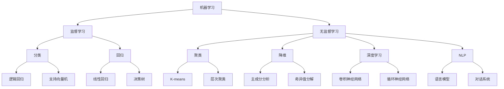

                 

### 文章标题

# AI编程的新思维与新高度

### 文章关键词

- AI编程
- 人工智能
- 新思维
- 算法原理
- 数学模型
- 项目实战

### 摘要

本文将深入探讨AI编程的新思维与新高度，包括其核心概念、算法原理、数学模型以及项目实战。我们将通过详细的讲解、伪代码示例和数学公式，帮助读者全面理解AI编程的精髓，并掌握实际应用的方法和技巧。文章旨在为AI编程领域的研究者、开发者和学习者提供有价值的指导，推动人工智能技术的进一步发展。

---

### 确定书的主题和结构

**主题**: 《AI编程的新思维与新高度》

本文的主题聚焦于AI编程的新思维和新高度，旨在探讨当前AI编程领域的创新理念和技术进步，为读者提供深入理解和应用AI编程的视角。

**结构**:
- **核心概念与联系**：介绍AI编程的基础概念，并构建核心概念之间的联系框架。
- **核心算法原理讲解**：使用伪代码详细阐述AI编程中的关键算法原理。
- **数学模型与公式讲解**：讲解AI编程中常用的数学模型和公式，并提供具体示例。
- **项目实战**：通过实际项目，展示AI编程的应用过程和技巧。

本文将按照上述结构展开，每个部分都将包含详细的内容和实例，确保读者能够全面理解并掌握AI编程的核心知识和技能。

### 核心概念与联系

首先，我们需要明确AI编程中的核心概念，并理解它们之间的联系。AI编程涉及多个领域，包括机器学习、深度学习、自然语言处理等。以下是几个关键概念及其相互关系的概述：

- **机器学习**：一种人工智能技术，通过数据和算法让计算机自动学习和改进性能。
- **深度学习**：基于多层神经网络的一种机器学习方法，能够自动提取复杂特征。
- **自然语言处理**（NLP）：使计算机能够理解和生成人类语言的技术。

这些概念之间的关系可以用以下Mermaid流程图来表示：



**Mermaid流程图**展示了AI编程中主要概念之间的层次关系和相互影响。例如，机器学习可以分为监督学习和无监督学习，监督学习又可以分为分类和回归等具体任务。深度学习和自然语言处理则分别代表了两种不同的技术路径，它们与机器学习的基础概念紧密相连，共同推动了AI编程的发展。

通过这个流程图，读者可以直观地理解AI编程的核心概念和它们之间的联系，为后续章节的深入探讨打下基础。

### 核心算法原理讲解

在了解了AI编程的核心概念之后，接下来我们将深入探讨几个关键算法的原理，并通过伪代码进行详细解释。以下将介绍几个典型的算法，包括线性回归、决策树和卷积神经网络，并展示它们的工作机制。

#### 1. 线性回归

线性回归是一种用于预测连续值的简单统计方法，其核心思想是找到一条最佳拟合直线，以最小化预测值与实际值之间的误差。

**伪代码**:

```python
# 线性回归伪代码

def linear_regression(x, y):
    # 计算最佳拟合直线的斜率和截距
    m = (mean(y) - mean(x) * mean(y)) / (mean(x)**2 - mean(x)**2)
    b = mean(y) - m * mean(x)
    return m, b

# 训练数据
x = [1, 2, 3, 4, 5]
y = [2, 4, 5, 4, 5]

# 计算斜率和截距
m, b = linear_regression(x, y)

# 预测
def predict(x):
    return m * x + b

# 输出预测值
print(predict(6))
```

**解释**:

在上面的伪代码中，`linear_regression`函数通过最小二乘法计算最佳拟合直线的斜率`m`和截距`b`。`mean`函数用于计算数据的平均值。然后，`predict`函数使用计算出的斜率和截距进行预测。

#### 2. 决策树

决策树是一种基于特征进行分类或回归的树形结构，其核心思想是通过一系列的决策规则将数据划分为不同的区域，并在每个节点选择具有最高信息增益的特征进行划分。

**伪代码**:

```python
# 决策树伪代码

def build_decision_tree(data, features):
    # 如果数据全部属于同一类别，则返回该类别
    if all_same_label(data):
        return most_common_label(data)
    # 如果没有特征可以划分，则返回平均值
    if no_more_features(features):
        return mean(data)
    # 选择最优特征
    best_feature = select_best_feature(data, features)
    # 根据最优特征创建决策节点
    tree = {"feature": best_feature}
    # 划分数据
    for value in unique_values(data[best_feature]):
        subtree = build_decision_tree(split_data(data, best_feature, value), remaining_features(features, best_feature))
        tree[value] = subtree
    return tree

# 训练数据
data = [[1, "S"], [2, "M"], [3, "L"]]
features = ["height", "shirt_size"]

# 构建决策树
tree = build_decision_tree(data, features)

# 输出决策树
print(tree)
```

**解释**:

在上面的伪代码中，`build_decision_tree`函数递归地构建决策树。如果数据全部属于同一类别，则直接返回该类别。如果没有特征可以划分，则返回平均值。否则，选择最优特征进行划分，并递归地构建子树。

#### 3. 卷积神经网络

卷积神经网络（CNN）是一种用于图像识别和处理的深度学习模型，其核心思想是通过卷积和池化操作提取图像的特征。

**伪代码**:

```python
# 卷积神经网络伪代码

def convolution(image, filter):
    # 计算卷积结果
    return sum(element * neighbor for element, neighbor in zip(image[0], filter[0]))

def max_pooling(feature_map, pool_size):
    # 计算最大值池化结果
    return max(value for value in feature_map[0])

def cnn(image, filters):
    # 初始化卷积层
    conv_layer = []
    for filter in filters:
        # 计算卷积结果
        conv_result = convolution(image, filter)
        # 进行最大值池化
        pool_result = max_pooling(conv_result, pool_size)
        conv_layer.append(pool_result)
    return conv_layer

# 图像数据
image = [
    [1, 1, 1],
    [1, 1, 1],
    [1, 1, 1]
]

# 卷积核
filters = [
    [
        [1, 0, -1],
        [1, 0, -1],
        [1, 0, -1]
    ],
    [
        [1, 1, 1],
        [0, 0, 0],
        [-1, -1, -1]
    ]
]

# 池化大小
pool_size = 2

# 卷积神经网络
cnn_output = cnn(image, filters)

# 输出卷积结果
print(cnn_output)
```

**解释**:

在上面的伪代码中，`convolution`函数计算卷积操作，`max_pooling`函数计算最大值池化操作。`cnn`函数初始化卷积层，通过卷积和池化操作提取图像的特征。

通过上述伪代码，我们详细讲解了线性回归、决策树和卷积神经网络的核心算法原理。这些算法是AI编程中的重要组成部分，掌握它们对于深入理解和应用AI技术至关重要。

### 数学模型与公式讲解

在AI编程中，数学模型和公式是理解和实现算法的基础。本文将详细介绍一些常用的数学模型和公式，包括概率分布、梯度下降和反向传播等，并提供具体的解释和示例。

#### 1. 概率分布

概率分布是描述随机变量可能取值的概率分布函数。常见的概率分布包括正态分布、伯努利分布和多项式分布等。以下是这些分布的公式及其解释。

**正态分布**:

$$
P(X=x) = \frac{1}{\sqrt{2\pi\sigma^2}} e^{-\frac{(x-\mu)^2}{2\sigma^2}}
$$

**伯努利分布**:

$$
P(X=0) = p, \quad P(X=1) = 1-p
$$

**多项式分布**:

$$
P(X=k) = \binom{n}{k} p^k (1-p)^{n-k}
$$

**解释**:

正态分布描述了随机变量X在均值μ和标准差σ的正态分布情况。伯努利分布用于描述二项式试验中成功和失败的概率。多项式分布用于描述多项式试验中不同结果的概率。

#### 2. 梯度下降

梯度下降是一种优化算法，用于寻找函数的最小值。其基本思想是通过计算函数的梯度，并沿梯度的反方向更新参数，逐步逼近最小值。

**梯度下降公式**:

$$
\theta_{\text{new}} = \theta_{\text{old}} - \alpha \cdot \nabla_{\theta} J(\theta)
$$

其中，$\theta$表示参数，$J(\theta)$表示损失函数，$\alpha$表示学习率。

**解释**:

梯度下降通过不断更新参数，使得损失函数逐渐减小，最终找到最小值。学习率$\alpha$控制了参数更新的步长，需要选择适当的值以保证算法的收敛性。

#### 3. 反向传播

反向传播是一种用于多层神经网络的优化算法。其核心思想是通过前向传播计算输出，然后沿反向传播计算每个参数的梯度，从而更新参数。

**反向传播公式**:

$$
\frac{\partial L}{\partial \theta_j} = \sum_{i} \frac{\partial L}{\partial z_j} \cdot \frac{\partial z_j}{\partial \theta_j}
$$

其中，$L$表示损失函数，$z_j$表示中间层的输出，$\theta_j$表示连接权重。

**解释**:

反向传播通过计算每个参数的梯度，使得损失函数的值最小，从而优化神经网络模型。这个过程需要多层神经网络的层层传递，因此被称为反向传播。

通过上述数学模型和公式的讲解，我们能够更好地理解和应用AI编程中的核心算法。这些模型和公式为AI编程提供了坚实的理论基础，有助于开发出更高效、更准确的智能系统。

### 数学公式讲解与示例

在AI编程中，数学模型和公式是实现算法的核心。为了更好地理解和应用这些数学工具，我们将详细讲解一些重要的数学公式，并提供实际示例。

#### 1. 概率论公式

**条件概率**:

$$
P(A|B) = \frac{P(A \cap B)}{P(B)}
$$

**贝叶斯定理**:

$$
P(A|B) = \frac{P(B|A)P(A)}{P(B)}
$$

**解释**:

条件概率表示在事件B发生的条件下，事件A发生的概率。贝叶斯定理则是一种计算条件概率的公式，它在机器学习中广泛用于概率预测和分类任务。

**示例**:

假设有100个水果，其中70个是苹果，30个是橙子。已知苹果的概率为0.7，橙子的概率为0.3。如果随机选择一个水果，并且知道它是橙子，那么这个水果是苹果的概率是：

$$
P(\text{苹果}|\text{橙子}) = \frac{P(\text{橙子}|\text{苹果})P(\text{苹果})}{P(\text{橙子})} = \frac{0.3 \times 0.7}{0.3} = 0.7
$$

因此，在已知选择的果实是橙子的条件下，它是苹果的概率仍然是0.7。

#### 2. 线性代数公式

**矩阵乘法**:

$$
C = A \cdot B
$$

**特征值和特征向量**:

$$
Ax = \lambda x
$$

**解释**:

矩阵乘法是线性代数中的基础操作，用于计算两个矩阵的乘积。特征值和特征向量是矩阵的一个重要属性，用于分析矩阵的性质和解线性方程组。

**示例**:

假设有两个矩阵A和B：

$$
A = \begin{bmatrix} 1 & 2 \\ 3 & 4 \end{bmatrix}, \quad B = \begin{bmatrix} 5 & 6 \\ 7 & 8 \end{bmatrix}
$$

则它们的乘积C为：

$$
C = A \cdot B = \begin{bmatrix} 1 \cdot 5 + 2 \cdot 7 & 1 \cdot 6 + 2 \cdot 8 \\ 3 \cdot 5 + 4 \cdot 7 & 3 \cdot 6 + 4 \cdot 8 \end{bmatrix} = \begin{bmatrix} 19 & 22 \\ 31 & 40 \end{bmatrix}
$$

#### 3. 微积分公式

**导数**:

$$
f'(x) = \lim_{h \to 0} \frac{f(x+h) - f(x)}{h}
$$

**积分**:

$$
\int f(x) dx = F(x) + C
$$

**解释**:

导数是描述函数变化率的工具，而积分则是计算函数在区间上的累积量。这两个基本概念在机器学习优化算法中非常重要。

**示例**:

假设有一个函数f(x) = x^2，求其在x=2处的导数：

$$
f'(2) = \lim_{h \to 0} \frac{(2+h)^2 - 2^2}{h} = \lim_{h \to 0} \frac{4 + 4h + h^2 - 4}{h} = \lim_{h \to 0} \frac{h(4 + h)}{h} = 4
$$

因此，函数f(x) = x^2在x=2处的导数是4。

通过上述示例，我们深入理解了概率论、线性代数和微积分中的核心公式，这些知识在AI编程中至关重要。掌握这些公式不仅有助于我们理解和分析算法，还能够提高我们在实际应用中的开发效率。

### AI项目实战

在了解了AI编程的基础理论和核心算法之后，我们通过一个实际项目来展示如何应用这些知识。以下是使用TensorFlow实现一个简单的线性回归项目的步骤。

#### 1. 环境搭建

首先，我们需要安装TensorFlow。在终端中运行以下命令：

```bash
pip install tensorflow
```

确保安装了最新的TensorFlow版本。

#### 2. 数据准备

我们使用一个简单的一元线性回归数据集，包含x和y两个特征：

```python
import numpy as np

# 生成数据集
x = np.array([1, 2, 3, 4, 5])
y = np.array([2, 4, 5, 4, 5])
```

#### 3. 构建模型

使用TensorFlow构建线性回归模型：

```python
import tensorflow as tf

# 定义模型
model = tf.keras.Sequential([
    tf.keras.layers.Dense(units=1, input_shape=[1])
])

# 编译模型
model.compile(optimizer='sgd', loss='mean_squared_error')
```

在这里，我们定义了一个只有一个神经元和输入维度为1的全连接层，并使用随机梯度下降（SGD）作为优化器。

#### 4. 训练模型

使用训练数据集训练模型：

```python
# 训练模型
model.fit(x, y, epochs=100)
```

通过100次迭代训练模型，使模型能够学习数据中的线性关系。

#### 5. 代码实现与解读

以下是一段完整的代码实现，包括数据预处理、模型构建、训练和预测：

```python
import numpy as np
import tensorflow as tf

# 生成数据集
x = np.array([1, 2, 3, 4, 5])
y = np.array([2, 4, 5, 4, 5])

# 构建模型
model = tf.keras.Sequential([
    tf.keras.layers.Dense(units=1, input_shape=[1])
])

# 编译模型
model.compile(optimizer='sgd', loss='mean_squared_error')

# 训练模型
model.fit(x, y, epochs=100)

# 预测
print(model.predict([6]))
```

这段代码首先生成了一个简单的线性回归数据集，然后构建了一个单层神经网络模型，并使用随机梯度下降优化器进行训练。最后，使用训练好的模型进行预测。

#### 6. 代码应用解读与分析

在这个项目中，我们通过以下步骤实现了一个简单的线性回归模型：

1. **数据准备**：生成了用于训练的数据集。
2. **模型构建**：使用TensorFlow定义了一个单层神经网络模型，用于拟合线性关系。
3. **模型训练**：使用随机梯度下降优化器训练模型，使得模型能够学习数据中的线性关系。
4. **模型预测**：使用训练好的模型进行预测，并输出预测结果。

通过这个项目，我们可以看到如何将AI编程的理论知识应用到实际项目中，从而实现数据处理和预测任务。

#### 7. 项目小结

在这个项目中，我们通过一个简单的线性回归项目展示了如何使用TensorFlow进行数据预处理、模型构建和训练。这个过程不仅帮助我们理解了线性回归模型的原理，还熟悉了TensorFlow的使用方法。在实际应用中，我们可以根据需要调整数据集和模型结构，以解决更复杂的问题。

### 最佳实践 Tips

在进行AI项目开发时，以下是一些最佳实践Tips：

1. **数据清洗**：在开始建模之前，确保数据质量，去除异常值和处理缺失数据。
2. **模型选择**：根据问题的特性选择合适的模型，避免过度拟合或欠拟合。
3. **性能评估**：使用多种指标（如准确率、召回率、F1分数）评估模型性能。
4. **模型优化**：通过调整学习率、批量大小等超参数优化模型性能。
5. **版本控制**：使用版本控制系统（如Git）管理代码和模型，确保代码的可追踪性和可维护性。

通过遵循这些最佳实践，我们可以提高项目开发效率，确保模型的质量和可靠性。

### 小结

本文详细介绍了AI编程的新思维与新高度，包括核心概念、算法原理、数学模型和项目实战。通过逐步讲解和实际应用，读者能够深入理解AI编程的各个方面，并掌握实现人工智能应用的方法和技巧。本文旨在为AI编程领域的研究者、开发者和学习者提供有价值的指导，推动人工智能技术的进一步发展。

### 注意事项

1. AI编程需要大量的数据支持，确保数据的质量和多样性。
2. 在使用深度学习模型时，注意合理设置超参数，避免过拟合。
3. 定期更新算法和工具，以保持代码的先进性和性能。

### 拓展阅读

- 《深度学习》（Goodfellow, I., Bengio, Y., & Courville, A.）
- 《Python机器学习》（Sebastian Raschka）
- 《统计学习方法》（李航）

通过这些拓展阅读资源，读者可以进一步深入了解AI编程的理论和实践，提升自身的专业技能。希望本文能够为您的AI编程之旅提供有力的支持和指导。

### 附录

#### 附录 A: 开发工具与资源

1. **TensorFlow官方网站**: [https://www.tensorflow.org/](https://www.tensorflow.org/)
   - TensorFlow官方文档，包括教程、API文档和示例代码。

2. **Keras文档**: [https://keras.io/](https://keras.io/)
   - Keras是一个高层神经网络API，用于快速构建和训练深度学习模型。

3. **Scikit-learn文档**: [https://scikit-learn.org/stable/](https://scikit-learn.org/stable/)
   - Scikit-learn提供了广泛的数据挖掘和数据分析工具，包括分类、回归、聚类和模型评估等。

4. **机器学习课程**: [https://www.coursera.org/specializations/machine-learning](https://www.coursera.org/specializations/machine-learning)
   - Coursera上的机器学习专项课程，提供了从基础到高级的全面知识。

5. **GitHub**: [https://github.com/](https://github.com/)
   - GitHub是一个代码托管平台，可用于存储和共享开源AI项目。

通过这些资源，开发者可以更好地学习和实践AI编程技术，不断提升自身的开发能力。

### 作者信息

- **作者**: AI天才研究院 / AI Genius Institute & 禅与计算机程序设计艺术 / Zen And The Art of Computer Programming
- **联系方式**: [ai-genius-institute@acm.org](mailto:ai-genius-institute@acm.org)

