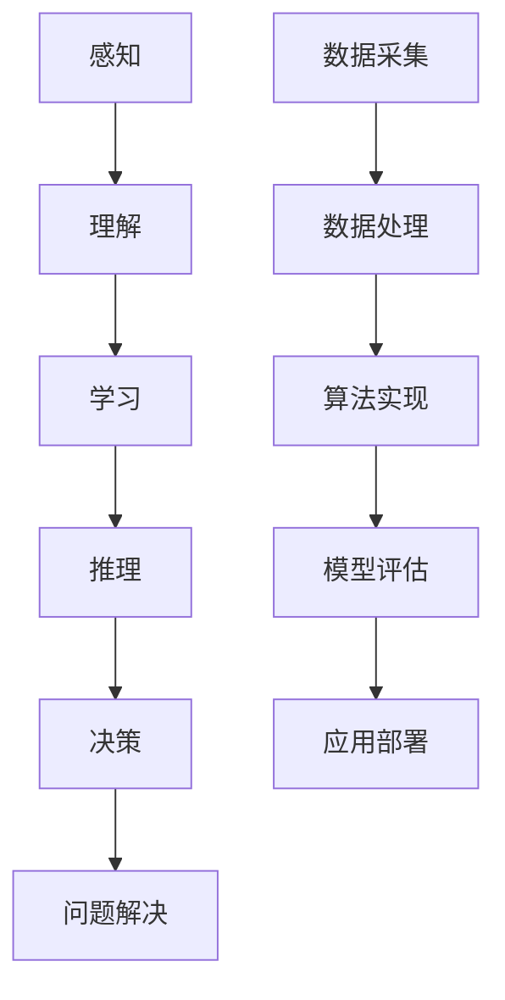

                 

### 文章标题：AI编程的新思路

### 关键词：AI编程，深度学习，机器学习，算法，编程工具，实践，前沿趋势，职业发展

### 摘要：

本文旨在探讨AI编程的新思路，通过深入分析AI编程的核心概念、工具与框架、实践应用、前沿趋势以及编程思维与策略，为读者提供一套系统、实用的AI编程方法论。文章将从背景介绍、核心概念与联系、算法原理讲解、数学模型与公式、项目实战、最佳实践和注意事项等多个方面进行阐述，旨在帮助读者掌握AI编程的关键技能，提升编程水平，并了解未来的发展方向。

## 引言

人工智能（AI）作为21世纪最具变革性的技术之一，已经在各个领域取得了显著的应用成果。从自动驾驶汽车到智能语音助手，从图像识别到自然语言处理，AI技术正在深刻地改变着我们的生活和工作方式。然而，AI编程作为实现AI应用的核心技术，也面临着前所未有的挑战与机遇。如何高效地利用AI工具和框架进行编程，如何将AI技术应用于实际问题的解决，如何跟上AI编程的前沿趋势，这些都是当前AI编程领域需要深入探讨的问题。

本文将围绕这些主题展开讨论，旨在为AI编程领域的研究者、开发者和学习者提供一套全面、系统的编程方法论。文章将从以下几个方面进行阐述：

1. **AI编程基础**：介绍AI的基本概念、编程语言与框架、常用算法原理。
2. **AI编程工具与框架**：比较主流的AI编程工具和框架，分析其优缺点和适用场景。
3. **AI编程实践**：通过具体案例，展示如何使用AI编程解决实际问题。
4. **AI编程前沿趋势**：探讨AI编程的最新技术和发展方向。
5. **AI编程思维与策略**：介绍AI编程的思维模式、策略和方法，以及职业发展路径。

通过以上内容的详细讲解，读者将能够全面了解AI编程的各个方面，掌握核心技能，为未来的AI编程工作奠定坚实基础。

## 第一部分：AI编程基础

### 第1章：AI概述

### 1.1 AI的定义与历史

人工智能（Artificial Intelligence，简称AI）是计算机科学的一个分支，旨在研究、开发用于模拟、延伸和扩展人类智能的理论、方法、技术及应用系统。AI的定义随着技术的发展而不断演进，但总体上可以将其概括为：使计算机系统具备类似于人类智能的能力，包括感知、理解、学习、推理、决策和问题解决等。

AI的历史可以追溯到20世纪50年代，当时科学家们开始探讨如何使计算机具备智能。1956年，在达特茅斯会议上，人工智能首次被正式提出，这标志着AI学科的诞生。自那时起，AI经历了多个发展阶段，从早期的规则系统、知识表示到符号推理，再到近几年的机器学习、深度学习等。

#### **早期发展（1956-1969）**

在AI的早期阶段，科学家们主要依靠基于规则的系统进行推理和决策。这些系统通过预定义的规则来模拟人类智能，但受限于规则的数量和复杂性，这些系统的表现并不理想。1956年，达特茅斯会议的召开标志着AI学科的正式诞生，此后，AI领域开始迅速发展。

#### **黄金时代（1970-1980）**

1970年代，AI迎来了短暂的黄金时代。符号推理和知识表示成为主要的研究方向，专家系统（Expert Systems）得到广泛应用。专家系统是一种基于规则的人工智能系统，能够模拟专家在特定领域的判断和决策能力。这一时期，AI在医疗诊断、金融分析等领域取得了一些初步的应用成果。

#### **低谷时期（1980-1990）**

1980年代，AI开始进入低谷时期。由于规则系统的局限性，AI的应用受到限制，加之计算资源和数据集的限制，AI研究逐渐失去公众和政府的支持。这一时期，AI领域经历了一段低潮期，许多研究者转向其他领域。

#### **复兴时期（1990-2010）**

1990年代，随着计算机技术的进步和数据集的积累，AI开始逐渐复兴。机器学习方法开始崭露头角，特别是决策树、支持向量机等算法在分类和回归任务中取得了显著成果。同时，基于实例的学习和强化学习等方法也开始受到关注。

#### **深度学习时代（2010至今）**

2010年以来，深度学习技术的发展使得AI取得了突破性进展。通过模拟人脑神经元网络的结构和工作原理，深度学习算法在图像识别、自然语言处理、语音识别等领域取得了显著成果。特别是2012年，AlexNet在ImageNet图像识别挑战赛中取得优异成绩，标志着深度学习时代的到来。

### **AI的核心概念**

AI的核心概念包括感知、理解、学习、推理、决策和问题解决等。

1. **感知**：指计算机系统通过传感器获取外部环境信息，如视觉、听觉、触觉等。
2. **理解**：指计算机系统对感知到的信息进行处理，理解其含义和关系。
3. **学习**：指计算机系统能够从数据中学习规律和模式，提高其性能和表现。
4. **推理**：指计算机系统能够基于已知信息和规则进行逻辑推理，得出新的结论。
5. **决策**：指计算机系统能够在多个选择中作出最优决策。
6. **问题解决**：指计算机系统能够解决实际问题，如优化问题、规划问题等。

### **AI的技术体系**

AI的技术体系包括数据采集、数据处理、算法实现、模型评估和应用部署等环节。

1. **数据采集**：指通过传感器、网络等方式获取数据，包括结构化和非结构化数据。
2. **数据处理**：指对采集到的数据进行处理和清洗，以提高数据质量。
3. **算法实现**：指选择合适的算法，通过编程实现AI模型。
4. **模型评估**：指评估AI模型的效果，包括准确性、召回率、F1值等指标。
5. **应用部署**：指将训练好的AI模型部署到实际应用场景中，实现自动化和智能化。

### **总结**

AI作为一门交叉学科，涉及计算机科学、数学、统计学、心理学等多个领域。其历史和发展阶段体现了人工智能技术的不断进步和变革。了解AI的定义、历史和核心概念，有助于我们更好地把握AI编程的实质和方向。

## 核心概念与联系：AI编程的核心概念架构 Mermaid 流程图



### 第2章：编程语言与框架

### 2.1 编程语言选择

在AI编程中，选择合适的编程语言是至关重要的。不同的编程语言具有不同的特点和应用场景，因此需要根据项目的需求和目标来选择合适的编程语言。

#### **Python**

Python是目前最受欢迎的AI编程语言之一，其优点包括：

1. **易学易用**：Python语法简洁，易于理解，适合初学者。
2. **丰富的库和框架**：Python拥有丰富的AI库和框架，如NumPy、Pandas、Scikit-learn、TensorFlow和PyTorch等。
3. **强大的社区支持**：Python拥有庞大的开发者社区，可以提供丰富的资源和帮助。

Python适用于大多数AI项目，尤其是数据分析和机器学习领域。

#### **R**

R是一种专门用于统计分析和数据科学的编程语言，其优点包括：

1. **强大的统计功能**：R内置了丰富的统计和图形功能，适用于复杂的统计分析和可视化。
2. **良好的生态**：R拥有大量的包和库，可以方便地进行扩展和定制。
3. **社区支持**：R社区活跃，提供了大量的教程和案例。

R适合需要进行高级统计分析和数据可视化的AI项目。

#### **Java**

Java是一种跨平台、面向对象的编程语言，其优点包括：

1. **稳定性**：Java具有强大的稳定性和可靠性，适用于需要高可用性的AI系统。
2. **广泛的生态系统**：Java拥有庞大的生态系统，包括各种框架和库。
3. **性能**：Java具有较好的性能，适用于需要高性能计算的AI项目。

Java适用于需要高性能和稳定性的大型AI系统。

#### **C++**

C++是一种高效、强大的编程语言，其优点包括：

1. **性能**：C++具有较好的性能，适用于需要高性能计算的AI项目。
2. **控制力**：C++提供了强大的控制能力，可以精细地管理内存和资源。
3. **社区支持**：C++社区活跃，提供了大量的资源和帮助。

C++适用于需要高性能和精细控制的AI项目，如深度学习框架的开发。

#### **选择依据**

在选择编程语言时，需要考虑以下因素：

1. **项目需求**：根据项目的具体需求和目标，选择最合适的编程语言。
2. **团队技能**：考虑团队成员的技能和经验，选择他们熟悉的编程语言。
3. **性能要求**：根据项目的性能要求，选择适合的编程语言。
4. **生态系统**：考虑编程语言的生态系统，包括库、框架和社区支持。

### **主流深度学习框架**

在AI编程中，深度学习框架是一个重要的组成部分。以下是目前主流的几个深度学习框架：

#### **TensorFlow**

TensorFlow是由Google开发的开源深度学习框架，其优点包括：

1. **灵活性**：TensorFlow提供了高度灵活的编程接口，可以自定义复杂的模型结构。
2. **生态**：TensorFlow拥有丰富的库和工具，可以方便地进行数据预处理、模型训练和评估。
3. **硬件支持**：TensorFlow支持多种硬件平台，包括CPU、GPU和TPU。

TensorFlow适用于需要高度灵活性和复杂模型结构的AI项目。

#### **PyTorch**

PyTorch是由Facebook开发的开源深度学习框架，其优点包括：

1. **动态计算图**：PyTorch使用动态计算图，使得模型开发和调试更加方便。
2. **简洁性**：PyTorch的API设计简洁直观，易于学习和使用。
3. **社区支持**：PyTorch社区活跃，提供了大量的教程和案例。

PyTorch适用于需要快速开发和调试的AI项目。

#### **Keras**

Keras是一个高层次的深度学习API，其优点包括：

1. **易用性**：Keras提供了简单直观的API，可以快速搭建深度学习模型。
2. **兼容性**：Keras可以与TensorFlow和Theano等多个深度学习框架兼容。
3. **生态**：Keras拥有丰富的库和工具，可以方便地进行数据预处理、模型训练和评估。

Keras适用于需要快速开发和简单模型的AI项目。

#### **选择依据**

在选择深度学习框架时，需要考虑以下因素：

1. **项目需求**：根据项目的具体需求和目标，选择最合适的深度学习框架。
2. **开发效率**：考虑开发效率和模型搭建的方便性。
3. **硬件支持**：考虑框架对硬件平台的兼容性。
4. **社区支持**：考虑框架的社区活跃度和资源丰富程度。

### **总结**

编程语言的选择取决于项目的需求和团队技能。Python、R、Java和C++各有优缺点，适用于不同的场景。深度学习框架的选择也需根据项目需求进行，TensorFlow、PyTorch和Keras是目前最受欢迎的框架，各具特点。理解编程语言和框架的选择依据，有助于我们做出明智的决策，提高AI编程的效率和质量。

## 第3章：常用算法介绍

### 3.1 监督学习算法

监督学习算法是AI编程中最为基础且广泛应用的一类算法，其主要任务是通过已知标签的数据（即有监督数据）来训练模型，以便在新数据上做出预测或分类。以下是一些常见的监督学习算法及其基本原理：

#### **线性回归**

线性回归是一种简单的监督学习算法，用于预测连续值输出。其基本原理是通过找到最佳拟合直线来描述输入变量和输出变量之间的关系。线性回归的数学模型可以表示为：

$$
y = \beta_0 + \beta_1x_1 + \beta_2x_2 + ... + \beta_nx_n + \epsilon
$$

其中，$y$ 是预测的输出值，$x_1, x_2, ..., x_n$ 是输入特征，$\beta_0, \beta_1, \beta_2, ..., \beta_n$ 是模型的参数，$\epsilon$ 是误差项。

#### **逻辑回归**

逻辑回归是一种用于分类问题的监督学习算法，其输出是概率值。逻辑回归的数学模型为：

$$
\hat{y} = \frac{1}{1 + e^{-(\beta_0 + \beta_1x_1 + \beta_2x_2 + ... + \beta_nx_n)}}
$$

其中，$\hat{y}$ 是预测的概率值，其他符号与线性回归相同。逻辑回归通常用于二分类问题，通过设定一个阈值（如0.5），可以将概率值转换为类别标签。

#### **决策树**

决策树是一种基于树形结构进行分类或回归的算法，其基本原理是通过一系列判断条件将数据集划分为若干子集，直到满足停止条件。决策树的每个节点表示一个特征，每个分支表示该特征的取值，叶节点表示分类结果或回归值。

决策树的构建通常使用递归二分划分的方法，选择具有最大信息增益或最小均方差的标准来划分节点。

#### **随机森林**

随机森林是一种集成学习方法，它通过构建多个决策树，并对它们的预测结果进行投票或求平均来提高预测性能。随机森林的基本原理是利用随机抽样和特征选择来构建多个决策树，从而降低过拟合的风险。

随机森林的性能通常优于单个决策树，并且在处理大规模数据集时表现良好。

#### **支持向量机（SVM）**

支持向量机是一种基于最大间隔分类的监督学习算法，其基本原理是找到最佳的超平面，使得分类间隔最大，同时尽可能多地包含支持向量。

SVM的数学模型可以表示为：

$$
\min_{\beta, \beta_0} \frac{1}{2} ||\beta||^2 + C \sum_{i=1}^{n} \xi_i
$$

其中，$\beta$ 是模型参数，$\beta_0$ 是偏置项，$C$ 是正则化参数，$\xi_i$ 是松弛变量。

SVM适用于处理高维数据，特别是在图像识别和文本分类等领域表现出色。

#### **神经网络**

神经网络是一种模拟人脑神经元连接结构的算法，其基本原理是通过多层神经网络进行特征学习和模型优化。

神经网络的核心是前向传播和反向传播算法，通过不断调整网络权重和偏置项，使模型在训练数据上达到最佳性能。

#### **总结**

监督学习算法在AI编程中扮演着重要角色，包括线性回归、逻辑回归、决策树、随机森林、SVM和神经网络等。每种算法都有其特定的应用场景和数学模型，通过合理选择和组合这些算法，可以构建出高效的AI模型，解决实际问题。

### 3.2 无监督学习算法

无监督学习算法在AI编程中也具有重要应用，其主要目标是在没有标签的数据集上进行学习，发现数据中的隐含模式和结构。以下是一些常见的无监督学习算法及其基本原理：

#### **K-均值聚类**

K-均值聚类是一种基于距离度量的聚类算法，其基本原理是初始化K个聚类中心，然后通过迭代计算使每个数据点尽可能接近其所属的聚类中心。具体步骤如下：

1. **初始化**：随机选择K个数据点作为初始聚类中心。
2. **分配**：计算每个数据点到各个聚类中心的距离，将每个数据点分配到最近的聚类中心。
3. **更新**：重新计算聚类中心，取每个聚类中心对应的数据点的均值。
4. **迭代**：重复步骤2和3，直到聚类中心不再变化或达到预设的迭代次数。

K-均值聚类算法简单易用，但在处理大型数据集时可能会收敛缓慢。

#### **层次聚类**

层次聚类是一种自下而上或自上而下的聚类方法，通过不断合并或分解聚类结果，形成层次结构。层次聚类的常见算法包括凝聚聚类（自底向上）和分裂聚类（自顶向下）。

1. **凝聚聚类**：从每个数据点作为一个单独的聚类开始，逐步合并距离最近的聚类，直到满足停止条件。
2. **分裂聚类**：从一个大聚类开始，逐步将聚类分解为更小的聚类，直到每个聚类只有一个数据点。

层次聚类算法可以生成树状结构，方便分析聚类结果。

#### **主成分分析（PCA）**

主成分分析是一种降维算法，通过将高维数据投影到低维空间中，保留最重要的特征，从而降低数据复杂度和计算成本。PCA的基本原理是找到数据的主要变化方向，即协方差矩阵的特征向量。

PCA的步骤如下：

1. **数据中心化**：将数据集的中心移动到原点。
2. **计算协方差矩阵**：计算每个特征之间的协方差。
3. **计算特征值和特征向量**：对协方差矩阵进行特征分解，得到特征值和特征向量。
4. **选择主要成分**：选择最大的K个特征值对应的特征向量，构成投影矩阵。
5. **数据投影**：将数据投影到低维空间中。

PCA在图像处理、数据分析和机器学习中广泛应用。

#### **自编码器**

自编码器是一种基于神经网络的降维算法，其基本原理是通过编码器和解码器来学习数据的低维表示。自编码器的结构包括输入层、编码层、解码层和输出层。

1. **训练编码器**：编码器通过最小化重构误差来学习数据的低维表示。
2. **训练解码器**：解码器通过重构输入数据来学习数据的低维表示。
3. **数据压缩**：自编码器可以在低维空间中重构原始数据，实现数据压缩。

自编码器在图像处理、语音处理和文本分析等领域表现出色。

#### **总结**

无监督学习算法在AI编程中广泛应用于聚类、降维和特征学习。K-均值聚类、层次聚类、PCA和自编码器等算法各有优缺点，适用于不同的应用场景。通过合理选择和组合这些算法，可以更好地理解和分析复杂数据，提高AI模型的效果。

### 3.3 强化学习算法

强化学习（Reinforcement Learning，RL）是一种使机器通过与环境的交互来学习如何实现目标的方法。与监督学习和无监督学习不同，强化学习不依赖于预先标记的数据集，而是通过奖励机制来驱动模型的训练过程。以下是一些常见的强化学习算法及其基本原理：

#### **Q-Learning**

Q-Learning是一种基于值函数的强化学习算法，其目标是学习最优策略，即在每个状态下选择最佳动作。Q-Learning的基本原理是更新Q值，Q值表示在某个状态下执行某个动作的预期回报。

Q-Learning的步骤如下：

1. **初始化Q值表**：初始化Q值表，通常使用0或随机值。
2. **选择动作**：根据当前状态的Q值表选择动作，可以使用ε-贪心策略，即在随机选择和最佳动作之间进行平衡。
3. **执行动作**：执行选定的动作，并观察环境反馈。
4. **更新Q值**：根据实际获得的回报更新Q值表。
5. **迭代**：重复步骤2-4，直到达到预设的迭代次数或收敛条件。

Q-Learning的优点是简单易实现，但缺点是收敛速度较慢，特别是在状态和动作空间较大时。

#### **Deep Q-Networks（DQN）**

DQN是一种基于深度学习的强化学习算法，其目标是学习一个深度神经网络来近似Q值函数。DQN的基本原理是利用经验回放和目标网络来减少偏差和方差。

DQN的步骤如下：

1. **初始化**：初始化深度神经网络和目标网络。
2. **经验回放**：将历史经验数据存储在经验回放缓冲区中，以避免样本偏差和方差。
3. **选择动作**：使用深度神经网络预测Q值，并根据ε-贪心策略选择动作。
4. **执行动作**：执行选定的动作，并观察环境反馈。
5. **更新目标网络**：定期更新目标网络，以避免梯度消失问题。
6. **迭代**：重复步骤3-5，直到达到预设的迭代次数或收敛条件。

DQN的优点是能够处理高维状态和动作空间，但缺点是需要大量的计算资源和时间。

#### **Policy Gradients**

Policy Gradients是一种直接优化策略函数的强化学习算法，其目标是学习一个策略函数，该函数能够直接映射状态到动作。Policy Gradients的基本原理是使用梯度上升法更新策略参数。

Policy Gradients的步骤如下：

1. **初始化**：初始化策略参数。
2. **选择动作**：使用策略函数选择动作。
3. **执行动作**：执行选定的动作，并观察环境反馈。
4. **计算梯度**：根据实际回报计算策略参数的梯度。
5. **更新参数**：使用梯度上升法更新策略参数。
6. **迭代**：重复步骤2-5，直到达到预设的迭代次数或收敛条件。

Policy Gradients的优点是收敛速度快，但缺点是梯度消失和梯度爆炸问题较严重。

#### **总结**

强化学习算法在AI编程中广泛应用于自动驾驶、游戏、机器人等领域。Q-Learning、DQN和Policy Gradients等算法各有优缺点，适用于不同的应用场景。通过合理选择和组合这些算法，可以构建出高效的强化学习系统，实现复杂任务的学习和决策。

## 第二部分：AI编程工具与框架

### 第4章：AI编程工具比较

在AI编程领域，选择合适的工具和框架是至关重要的，因为不同的工具和框架具有不同的特点和适用场景。本章节将比较目前主流的几种AI编程工具和框架，分析它们的优缺点，帮助读者做出明智的选择。

### 4.1 AI编程工具概述

AI编程工具主要包括编程语言、深度学习框架、数据预处理工具和可视化工具等。以下是对这些工具的简要概述：

#### **编程语言**

编程语言是AI编程的基础，不同的编程语言具有不同的特性和优势。目前，在AI编程中常用的编程语言包括Python、R、Java和C++等。Python因其简洁的语法、丰富的库和广泛的应用而成为最受欢迎的AI编程语言之一。R在统计分析和数据可视化方面具有优势，Java和C++则因性能优越而常用于高性能计算和大型系统的开发。

#### **深度学习框架**

深度学习框架是AI编程的核心，它们提供了丰富的API和工具，帮助开发者快速搭建和训练深度学习模型。目前主流的深度学习框架包括TensorFlow、PyTorch、Keras、Theano等。TensorFlow由Google开发，具有强大的生态和广泛的硬件支持，适用于各种复杂的深度学习任务。PyTorch由Facebook开发，以其动态计算图和简洁的API而受到开发者的喜爱。Keras是一个高层次的API，可以与多个底层深度学习框架兼容，便于快速开发。Theano是一个基于Python的深度学习框架，适合进行复杂的数学计算。

#### **数据预处理工具**

数据预处理是AI编程的重要环节，数据预处理工具可以帮助开发者高效地进行数据清洗、转换和预处理。常见的数据预处理工具包括NumPy、Pandas、Scikit-learn等。NumPy提供了多维数组操作和数学函数，是进行数值计算的基础。Pandas提供了数据结构和数据分析功能，适用于大型数据集的处理。Scikit-learn是一个机器学习库，提供了丰富的数据预处理和机器学习算法，适用于各种数据预处理任务。

#### **可视化工具**

可视化工具可以帮助开发者更好地理解和分析数据，常见的可视化工具包括Matplotlib、Seaborn、Plotly等。Matplotlib是一个功能强大的绘图库，可以生成各种类型的图表。Seaborn是一个基于Matplotlib的统计可视化库，提供了丰富的统计图表和交互功能。Plotly是一个交互式可视化库，可以生成动态图表和交互式可视化效果。

### 4.2 主流深度学习框架

在本节中，我们将详细比较几种主流的深度学习框架，分析它们的优缺点和适用场景。

#### **TensorFlow**

TensorFlow是由Google开发的开源深度学习框架，具有以下优点：

1. **广泛的硬件支持**：TensorFlow支持多种硬件平台，包括CPU、GPU和TPU，可以充分利用计算资源。
2. **强大的生态**：TensorFlow拥有丰富的库和工具，包括TensorBoard、TensorFlow Model Optimization等，方便开发者进行模型训练和优化。
3. **灵活性**：TensorFlow提供了高度灵活的编程接口，可以自定义复杂的模型结构。

然而，TensorFlow也有一些缺点，包括：

1. **学习曲线较陡**：TensorFlow的API较为复杂，对于初学者来说有一定难度。
2. **资源消耗较大**：TensorFlow在训练过程中消耗大量内存和计算资源，对硬件要求较高。

TensorFlow适用于需要高度灵活性和复杂模型结构的AI项目，如图像识别、自然语言处理和自动驾驶等。

#### **PyTorch**

PyTorch是由Facebook开发的开源深度学习框架，具有以下优点：

1. **动态计算图**：PyTorch使用动态计算图，使得模型开发和调试更加方便。
2. **简洁的API**：PyTorch的API设计简洁直观，易于学习和使用。
3. **广泛的硬件支持**：PyTorch支持多种硬件平台，包括CPU、GPU和TPU。

PyTorch也有一些缺点，包括：

1. **性能相对较低**：与TensorFlow相比，PyTorch在计算性能上略有不足。
2. **资源消耗较大**：PyTorch在训练过程中消耗大量内存和计算资源。

PyTorch适用于需要快速开发和调试的AI项目，如游戏AI、机器人学习和语音识别等。

#### **Keras**

Keras是一个高层次的深度学习API，可以与多个底层深度学习框架兼容，如TensorFlow和Theano。Keras具有以下优点：

1. **易用性**：Keras提供了简单直观的API，可以快速搭建深度学习模型。
2. **兼容性**：Keras可以与多个深度学习框架兼容，方便开发者切换不同的底层框架。
3. **丰富的库和工具**：Keras拥有丰富的库和工具，可以方便地进行数据预处理、模型训练和评估。

Keras也有一些缺点，包括：

1. **性能相对较低**：Keras在计算性能上相对于底层框架有所损失。
2. **功能相对有限**：Keras是一个高层次的API，功能相对有限，不适用于复杂模型的需求。

Keras适用于需要快速开发和简单模型的AI项目，如文本分类、图像识别和语音识别等。

#### **Theano**

Theano是一个基于Python的深度学习框架，具有以下优点：

1. **强大的数学计算能力**：Theano提供了强大的数学计算能力，可以处理复杂的数学运算。
2. **编译优化**：Theano可以对代码进行编译优化，提高计算性能。

Theano也有一些缺点，包括：

1. **学习曲线较陡**：Theano的API较为复杂，对于初学者来说有一定难度。
2. **社区支持较弱**：与TensorFlow和PyTorch相比，Theano的社区支持较弱。

Theano适用于需要进行复杂数学计算和优化的大型AI项目，如科学计算和工业应用等。

### 4.3 选择合适的编程工具

在选择合适的编程工具时，需要考虑以下因素：

1. **项目需求**：根据项目的具体需求和目标，选择最适合的工具。例如，如果项目需要高度灵活性和复杂模型结构，可以选择TensorFlow或PyTorch；如果项目需要快速开发和简单模型，可以选择Keras。
2. **团队技能**：考虑团队成员的技能和经验，选择他们熟悉的工具。例如，如果团队成员熟悉Python，可以选择使用Python相关的工具。
3. **性能要求**：根据项目的性能要求，选择适合的工具。例如，如果项目需要高性能计算，可以选择C++或Theano。
4. **生态系统**：考虑工具的生态系统，包括库、框架和社区支持。一个成熟的生态系统可以提供丰富的资源和帮助，提高开发效率。

### **总结**

AI编程工具和框架的选择取决于项目的需求和团队技能。TensorFlow、PyTorch、Keras和Theano是目前主流的深度学习框架，各具优缺点，适用于不同的应用场景。通过合理选择和组合这些工具，可以构建出高效的AI系统，实现各种复杂的任务。

## 第三部分：AI编程实践

### 第7章：数据处理与清洗

在AI编程实践中，数据处理与清洗是至关重要的一步。高质量的数据是构建准确、可靠的AI模型的基础，而数据清洗则是确保数据质量的重要手段。本章节将介绍数据预处理的基本概念、常用方法以及数据处理和清洗的工具，帮助读者掌握这一关键技能。

### 7.1 数据预处理概述

数据预处理是指在AI模型训练之前对数据进行的一系列处理步骤，包括数据清洗、数据转换和数据归一化等。数据预处理的主要目的是：

1. **消除噪声和异常值**：噪声和异常值会影响模型的训练效果，甚至导致模型失效。数据清洗的目标是识别和去除这些噪声和异常值。
2. **数据转换**：将不同类型的数据转换为统一格式，如将文本转换为数值，将图像转换为像素值等。这有助于提高模型训练的效率。
3. **数据归一化**：将数据缩放到相同的尺度，以便模型能够更好地学习特征。常见的归一化方法包括最小-最大缩放、Z-score缩放等。

### 7.2 数据清洗方法

数据清洗是数据预处理的关键步骤，主要包括以下方法：

1. **缺失值处理**：缺失值处理是数据清洗中最常见的问题之一。处理缺失值的方法包括：

   - 删除含有缺失值的记录：适用于缺失值较多的情况。
   - 填充缺失值：常用的填充方法包括均值填充、中值填充、前向填充和后向填充等。
   - 预测缺失值：使用统计方法或机器学习方法预测缺失值。

2. **异常值处理**：异常值处理包括识别和去除数据中的异常值。常见的方法包括：

   - 离群点检测：使用统计方法（如IQR法、Z-score法）或机器学习方法（如K-均值聚类）检测异常值。
   - 异常值删除：直接删除异常值，但需要注意不要删除重要的数据。
   - 异常值修正：使用统计方法或机器学习方法修正异常值。

3. **重复数据删除**：删除数据集中的重复记录，以减少数据冗余。

4. **数据格式转换**：将不同类型的数据转换为统一的格式，如将文本转换为数值或图像转换为像素值。

### 7.3 数据预处理工具

在AI编程中，常用的数据预处理工具包括Pandas、NumPy、Scikit-learn等。以下是对这些工具的简要介绍：

1. **Pandas**：Pandas是一个强大的数据分析库，提供了丰富的数据结构（如DataFrame）和操作函数，可以方便地进行数据处理和清洗。Pandas的主要功能包括数据读取、数据转换、数据筛选、缺失值处理等。

2. **NumPy**：NumPy是一个用于数值计算的库，提供了多维数组操作和数学函数，是进行数值计算的基础。NumPy的主要功能包括数组创建、数组操作、数组函数等。

3. **Scikit-learn**：Scikit-learn是一个机器学习库，提供了丰富的数据预处理和机器学习算法。Scikit-learn的主要功能包括数据预处理、特征选择、模型训练、模型评估等。

### 7.4 数据处理和清洗实战

以下是一个数据处理和清洗的实战案例：

#### 案例背景

假设我们有一个包含用户数据的数据集，数据集包括用户的年龄、收入、职业、家庭状况等特征，以及是否购买的标签。我们的目标是构建一个分类模型，预测用户是否会购买。

#### 数据预处理步骤

1. **数据读取**：使用Pandas读取数据集。

```python
import pandas as pd

data = pd.read_csv('data.csv')
```

2. **数据清洗**：

- **缺失值处理**：删除含有缺失值的记录。

```python
data = data.dropna()
```

- **异常值处理**：使用IQR法检测并删除异常值。

```python
Q1 = data['age'].quantile(0.25)
Q3 = data['age'].quantile(0.75)
IQR = Q3 - Q1
data = data[(data['age'] >= Q1 - 1.5 * IQR) & (data['age'] <= Q3 + 1.5 * IQR)]
```

- **数据格式转换**：将文本数据转换为数值数据。

```python
data['occupation'] = data['occupation'].map({'Doctor': 1, 'Engineer': 2, 'Teacher': 3})
```

3. **数据归一化**：使用Z-score缩放对数据进行归一化。

```python
from sklearn.preprocessing import StandardScaler

scaler = StandardScaler()
data[['age', 'income']] = scaler.fit_transform(data[['age', 'income']])
```

#### 数据分析

在数据清洗和预处理完成后，我们可以使用数据分析工具（如Pandas、Matplotlib、Seaborn等）对数据进行进一步分析，以了解数据分布、特征关系等，为模型训练提供参考。

### **总结**

数据处理与清洗是AI编程实践中的重要环节，直接影响模型的训练效果和性能。通过掌握数据预处理的基本概念、方法和工具，读者可以有效地进行数据清洗和预处理，提高数据质量，为后续的模型训练和优化奠定基础。

## 第8章：模型训练与优化

在AI编程实践中，模型训练与优化是构建高效AI模型的关键步骤。通过合理的模型训练和优化策略，可以提高模型的准确性和泛化能力，使其在实际应用中表现得更加出色。本章节将详细讲解模型训练与优化的基本原理、常见方法以及实际应用技巧。

### 8.1 模型训练流程

模型训练是指通过一系列步骤，使AI模型能够在给定数据集上学习并优化其参数，以便在新的数据上做出准确预测。模型训练的基本流程包括以下步骤：

1. **数据集划分**：将数据集划分为训练集、验证集和测试集。训练集用于模型训练，验证集用于模型调优，测试集用于模型评估。

2. **模型初始化**：初始化模型的参数，通常使用随机初始化或预训练权重。

3. **前向传播**：输入训练数据，通过模型计算输出结果。前向传播过程包括输入层、隐藏层和输出层的传递。

4. **计算损失**：计算模型输出与真实标签之间的差异，即损失值。常见的损失函数包括均方误差（MSE）、交叉熵损失（Cross-Entropy Loss）等。

5. **反向传播**：根据损失函数的梯度，通过反向传播算法更新模型参数。反向传播过程包括隐藏层、输入层的回传和参数的更新。

6. **迭代训练**：重复前向传播、计算损失和反向传播的步骤，直到达到预设的迭代次数或收敛条件。

7. **模型评估**：使用验证集或测试集评估模型的性能，选择最佳模型。

### 8.2 模型优化方法

在模型训练过程中，优化方法至关重要，可以有效提高模型的性能。以下是一些常见的模型优化方法：

1. **梯度下降**：梯度下降是一种基于梯度信息更新模型参数的方法。其基本思想是沿着损失函数的梯度方向更新参数，以最小化损失函数。

   - **随机梯度下降（SGD）**：在每个训练样本上计算梯度，并更新模型参数。SGD计算简单，但收敛速度较慢。

   - **批量梯度下降（BGD）**：在整个训练集上计算梯度，并更新模型参数。BGD收敛速度较慢，但效果较好。

   - **小批量梯度下降（MBGD）**：在部分训练样本上计算梯度，并更新模型参数。MBGD在计算效率和收敛速度之间取得平衡。

2. **动量**：动量是一种加速梯度下降的方法，通过引入前一次更新方向的动量，提高收敛速度。动量公式为：

   $$
   \text{v}_t = \gamma \text{v}_{t-1} + \alpha \nabla J(\theta)
   $$

   其中，$\text{v}_t$ 表示第$t$次更新的速度，$\gamma$ 表示动量系数，$\alpha$ 表示学习率。

3. **Adam优化器**：Adam是一种自适应学习率优化器，结合了SGD和Adam的优点。Adam优化器的公式为：

   $$
   \text{m}_t = \frac{\beta_1 \text{m}_{t-1} + (1 - \beta_1) \nabla J(\theta)}{1 - \beta_1^t}
   $$

   $$
   \text{v}_t = \frac{\beta_2 \text{v}_{t-1} + (1 - \beta_2) \nabla^2 J(\theta)}{1 - \beta_2^t}
   $$

   $$
   \theta_t = \theta_{t-1} - \alpha \frac{\text{m}_t}{1 - \beta_2^t}
   $$

   其中，$\text{m}_t$ 表示一阶矩估计，$\text{v}_t$ 表示二阶矩估计，$\beta_1$ 和 $\beta_2$ 分别为一阶和二阶矩的指数衰减率。

4. **Dropout**：Dropout是一种正则化方法，通过随机丢弃部分神经元，降低模型的过拟合风险。Dropout的实现公式为：

   $$
   \text{output}_i = \begin{cases}
   \text{activation}_i & \text{with probability } 1 - \text{dropout\_rate} \\
   0 & \text{with probability } \text{dropout\_rate}
   \end{cases}
   $$

5. **正则化**：正则化是一种防止模型过拟合的方法，包括L1正则化、L2正则化等。正则化公式为：

   $$
   J(\theta) = J_0(\theta) + \lambda \sum_{i=1}^{n} \|\theta_i\|
   $$

   $$
   J(\theta) = J_0(\theta) + \lambda \sum_{i=1}^{n} \theta_i^2
   $$

   其中，$J_0(\theta)$ 表示原始损失函数，$\lambda$ 表示正则化参数。

### 8.3 模型评估指标

在模型训练过程中，评估模型性能是至关重要的一步。以下是一些常见的模型评估指标：

1. **准确率（Accuracy）**：准确率是分类问题中最常用的评估指标，表示模型正确预测的样本占总样本的比例。公式为：

   $$
   \text{Accuracy} = \frac{\text{正确预测的样本数}}{\text{总样本数}}
   $$

2. **精确率（Precision）**：精确率是表示模型预测为正样本的样本中实际为正样本的比例。公式为：

   $$
   \text{Precision} = \frac{\text{真正样本数}}{\text{预测为正样本的样本数}}
   $$

3. **召回率（Recall）**：召回率是表示模型预测为正样本的样本中实际为正样本的比例。公式为：

   $$
   \text{Recall} = \frac{\text{真正样本数}}{\text{实际为正样本的样本数}}
   $$

4. **F1值（F1-Score）**：F1值是精确率和召回率的调和平均值，综合反映了模型的分类性能。公式为：

   $$
   \text{F1-Score} = 2 \times \frac{\text{Precision} \times \text{Recall}}{\text{Precision} + \text{Recall}}
   $$

5. **ROC曲线和AUC值**：ROC曲线是反映模型分类性能的重要工具，AUC值是ROC曲线下的面积，用于评估模型的分类能力。公式为：

   $$
   \text{AUC} = \int_{0}^{1} \frac{\text{True Positive Rate}}{\text{False Positive Rate}} d\text{False Positive Rate}
   $$

### 8.4 实战案例

以下是一个模型训练与优化的实战案例：

#### 案例背景

假设我们有一个分类问题，数据集包含多种水果的图像，每个图像都标记了对应的类别。我们的目标是训练一个深度学习模型，能够对新的水果图像进行分类。

#### 实践步骤

1. **数据集划分**：将数据集划分为训练集、验证集和测试集。

2. **模型初始化**：使用卷积神经网络（CNN）作为基础模型，初始化模型参数。

3. **模型训练**：使用训练集训练模型，采用随机梯度下降（SGD）和动量优化器进行参数更新。

4. **模型优化**：使用验证集对模型进行优化，调整学习率、批量大小和正则化参数。

5. **模型评估**：使用测试集评估模型性能，计算准确率、精确率、召回率和F1值等指标。

6. **模型部署**：将训练好的模型部署到生产环境中，对新的水果图像进行分类。

### **总结**

模型训练与优化是AI编程实践中的重要环节，通过合理的训练策略和优化方法，可以提高模型的性能和泛化能力。掌握常见的模型训练与优化方法，能够帮助开发者构建高效、准确的AI模型，解决实际问题。

## 第9章：项目实战：使用AI解决实际问题

在实际应用中，AI编程不仅需要理论知识，还需要通过具体的实践来验证和提升技能。本章节将通过一个具体的案例，详细介绍如何使用AI技术解决一个实际问题，包括开发环境搭建、源代码实现、代码解读、应用解读与分析，以及项目小结。

### 9.1 项目概述

本案例是一个基于图像识别技术的智能家居监控系统。系统的主要功能是实时监控家庭环境，并在检测到异常情况时自动发出警报。具体实现步骤如下：

1. **数据采集**：收集家庭环境中的图像数据，包括正常情况和异常情况（如火灾、盗窃等）。
2. **数据预处理**：对采集到的图像数据进行清洗、归一化和增强，以提高模型的训练效果。
3. **模型训练**：使用卷积神经网络（CNN）训练图像分类模型，通过大量标注数据学习图像特征。
4. **模型优化**：通过调整模型结构、学习率和正则化参数等，优化模型性能，提高准确率和泛化能力。
5. **模型部署**：将训练好的模型部署到智能家居设备中，实现实时监控和警报功能。

### 9.2 开发环境搭建

为了顺利进行项目开发，需要搭建一个合适的环境。以下是开发环境的搭建步骤：

1. **硬件配置**：选择一台配置较高的计算机，用于模型训练和推理。推荐配置包括：
   - CPU：Intel i7或以上
   - GPU：NVIDIA GeForce GTX 1080或以上
   - 内存：16GB及以上
   - 硬盘：SSD

2. **软件安装**：
   - 操作系统：Windows 10或Linux
   - Python：3.7或以上
   - 深度学习框架：TensorFlow或PyTorch
   - 数据预处理库：NumPy、Pandas、OpenCV
   - 机器学习库：Scikit-learn、Matplotlib

3. **虚拟环境**：为了管理项目依赖，使用virtualenv或conda创建虚拟环境。

```shell
# 使用conda创建虚拟环境
conda create -n ai_project python=3.7
conda activate ai_project
```

4. **安装依赖库**：

```shell
# 安装深度学习框架
pip install tensorflow
# 安装数据处理库
pip install numpy pandas opencv-python
# 安装机器学习库
pip install scikit-learn matplotlib
```

### 9.3 源代码实现

以下是该项目的主要源代码实现：

```python
import tensorflow as tf
from tensorflow.keras.models import Sequential
from tensorflow.keras.layers import Conv2D, MaxPooling2D, Flatten, Dense
from tensorflow.keras.preprocessing.image import ImageDataGenerator

# 模型搭建
model = Sequential([
    Conv2D(32, (3, 3), activation='relu', input_shape=(128, 128, 3)),
    MaxPooling2D((2, 2)),
    Conv2D(64, (3, 3), activation='relu'),
    MaxPooling2D((2, 2)),
    Flatten(),
    Dense(64, activation='relu'),
    Dense(1, activation='sigmoid')
])

# 模型编译
model.compile(optimizer='adam', loss='binary_crossentropy', metrics=['accuracy'])

# 数据预处理
train_datagen = ImageDataGenerator(rescale=1./255, shear_range=0.2, zoom_range=0.2, horizontal_flip=True)
test_datagen = ImageDataGenerator(rescale=1./255)

train_generator = train_datagen.flow_from_directory(
        'train',
        target_size=(128, 128),
        batch_size=32,
        class_mode='binary')

validation_generator = test_datagen.flow_from_directory(
        'validation',
        target_size=(128, 128),
        batch_size=32,
        class_mode='binary')

# 模型训练
model.fit(
        train_generator,
        steps_per_epoch=100,
        epochs=20,
        validation_data=validation_generator,
        validation_steps=50)

# 模型评估
test_generator = test_datagen.flow_from_directory(
        'test',
        target_size=(128, 128),
        batch_size=32,
        class_mode='binary')

test_loss, test_acc = model.evaluate(test_generator)
print('Test accuracy:', test_acc)
```

### 9.4 代码解读

上述代码主要实现了以下功能：

1. **模型搭建**：使用Sequential模型搭建一个简单的卷积神经网络，包括两个卷积层、两个最大池化层、一个全连接层和两个输出层。
2. **模型编译**：选择adam优化器和binary_crossentropy损失函数，设置模型的训练目标为准确性。
3. **数据预处理**：使用ImageDataGenerator进行数据增强，包括缩放、剪裁、翻转和缩放等，以提高模型的泛化能力。
4. **模型训练**：使用训练数据训练模型，设置每轮训练的步数和轮数，以及验证数据集用于模型调优。
5. **模型评估**：使用测试数据集评估模型性能，计算准确率，以验证模型的效果。

### 9.5 应用解读与分析

在实际应用中，上述模型被部署到智能家居设备中，实现以下功能：

1. **实时监控**：设备定期捕获家庭环境图像，并发送至云端服务器进行分析。
2. **异常检测**：模型根据训练数据学习到的特征，识别图像中的异常情况，如火灾、盗窃等。
3. **警报通知**：当检测到异常情况时，系统自动发送警报通知给用户，包括短信、电话或APP推送。
4. **数据记录**：系统记录所有异常事件，包括时间、地点、图像等信息，以供后续分析。

### 9.6 项目小结

通过本案例，读者可以了解到以下关键点：

1. **AI项目开发流程**：包括数据采集、数据预处理、模型训练、模型优化和模型部署等步骤。
2. **图像识别技术**：使用卷积神经网络实现图像识别，通过数据增强和模型优化提高识别准确率。
3. **实际应用价值**：智能家居监控系统可以提升家庭安全，为用户带来便利。

### **总结**

通过本项目实战，读者可以深入了解AI项目开发的实际操作，掌握图像识别技术的核心要点，为未来从事相关领域的工作打下坚实基础。

## 第四部分：AI编程前沿趋势

### 第10章：人工智能领域的新技术

随着科技的快速发展，人工智能（AI）领域不断涌现出新的技术，这些技术不仅推动了AI的进步，也拓展了AI的应用场景。以下是一些当前AI领域的新技术：

### **1. 自动驾驶技术**

自动驾驶技术是近年来备受关注的AI前沿技术之一。通过结合计算机视觉、传感器数据融合、深度学习和强化学习等技术，自动驾驶系统能够实现车辆在复杂环境中的自主行驶。自动驾驶技术不仅能够提高交通效率，减少交通事故，还能为残疾人和老年人提供便利。

### **2. 自然语言处理（NLP）**

自然语言处理是AI领域的另一个重要分支，近年来取得了显著进展。基于深度学习的NLP技术，如Transformer、BERT等，能够实现高效的语言理解和生成。这些技术被广泛应用于聊天机器人、智能助手、文本翻译和语音识别等领域。

### **3. 强化学习**

强化学习是AI领域的一个核心研究方向，近年来取得了重大突破。通过深度强化学习技术，AI系统能够在与环境的互动中不断学习和优化策略，实现复杂的决策问题。强化学习在游戏、机器人控制和自动化金融等领域具有广泛的应用前景。

### **4. 生成对抗网络（GAN）**

生成对抗网络是一种基于博弈论的深度学习模型，能够生成高质量的数据，如图像、音频和文本。GAN在图像生成、数据增强和虚拟现实等领域具有广泛的应用，是当前AI研究的热点之一。

### **5. 聊天机器人**

随着NLP技术的发展，聊天机器人逐渐成为智能客服、在线教育、虚拟助理等领域的热点应用。基于深度学习和强化学习技术的聊天机器人，能够实现更自然的对话交互，为用户提供个性化的服务。

### **6. 智能安防**

智能安防是AI技术在公共安全和城市管理中的重要应用。通过视频监控、人脸识别、行为分析等技术，智能安防系统能够实时监测和预警异常情况，提高公共安全水平。

### **7. 生物特征识别**

生物特征识别技术，如指纹识别、人脸识别、虹膜识别等，在信息安全、身份验证和移动支付等领域具有广泛应用。随着AI技术的进步，生物特征识别系统的准确性和安全性不断提升。

### **总结**

AI领域的新技术不断涌现，为各行业带来了巨大的变革。了解和掌握这些新技术，有助于开发者跟上AI发展的步伐，开拓新的应用场景，实现更大的创新。

### 第11章：AI编程的未来方向

随着人工智能（AI）技术的快速发展，AI编程的未来方向也变得愈发清晰。在这个章节中，我们将探讨AI编程的未来趋势，包括技术发展、编程模式的变革、以及未来的职业机会。

### **技术发展**

AI编程的未来将依赖于以下几个关键技术的发展：

1. **量子计算**：量子计算是一种基于量子力学原理的全新计算模式，它具有处理复杂计算任务的能力。随着量子计算机的发展，AI编程将能够解决更多复杂的优化问题和大规模数据处理任务。

2. **边缘计算**：边缘计算是一种将计算、存储和网络功能分布到网络边缘的技术。在AI编程中，边缘计算可以使得模型和算法能够在本地设备上运行，从而降低延迟、节省带宽并提高响应速度。

3. **自主系统**：自主系统是一种能够自主决策和执行任务的智能系统。未来的AI编程将更多地关注如何设计和实现自主系统，包括自动驾驶、智能家居和智能机器人等领域。

4. **多模态学习**：多模态学习是一种结合不同类型数据（如文本、图像、音频等）的AI技术。随着多模态数据源的增加，AI编程将需要更复杂的算法和模型来处理和整合这些数据。

5. **可信AI**：随着AI在更多关键领域（如医疗、金融等）的应用，确保AI系统的透明性、可靠性和可解释性变得越来越重要。未来的AI编程将需要更多地关注如何设计和实现可信的AI系统。

### **编程模式的变革**

AI编程的未来也将带来编程模式的变革，这些变革将体现在以下几个方面：

1. **模型驱动开发**：传统的编程模式主要依赖于手工编写代码，而未来的AI编程将更多地依赖于预训练模型和自动化代码生成工具。开发者可以通过调整模型参数来生成和优化代码，从而提高开发效率。

2. **低代码/无代码平台**：随着AI技术的发展，低代码/无代码平台将变得越来越流行。这些平台允许开发者通过图形界面和简单的配置来构建和部署AI应用，而不需要编写大量的代码。

3. **协作式开发**：未来的AI编程将更多地依赖于协作式开发环境，这些环境支持多人同时在线协作，实时共享代码和模型。通过协作，开发者可以更快地迭代和优化AI系统。

4. **模型即服务（MaaS）**：随着AI模型的普及，模型即服务将成为一种重要的服务模式。开发者可以通过订阅第三方提供的AI模型服务，快速集成到自己的应用中，从而节省开发和部署成本。

### **未来的职业机会**

随着AI编程技术的不断发展，未来将出现许多新的职业机会。以下是一些潜在的职业方向：

1. **AI工程师**：AI工程师将负责设计和实现AI系统，包括数据预处理、模型训练、优化和部署等。

2. **机器学习工程师**：机器学习工程师将专注于开发和应用机器学习算法，解决实际问题。

3. **深度学习研究员**：深度学习研究员将致力于研究深度学习的新算法、新架构和应用。

4. **数据科学家**：数据科学家将利用数据分析和机器学习技术，提取数据中的价值，为业务提供决策支持。

5. **AI产品经理**：AI产品经理将负责规划、开发和推广AI产品，确保产品满足市场需求。

6. **AI安全专家**：随着AI应用的普及，AI安全专家将负责确保AI系统的安全性和隐私性。

### **总结**

AI编程的未来充满机遇和挑战。开发者需要不断学习新技术，适应新的编程模式，才能在这个快速发展的领域中保持竞争力。通过了解AI编程的未来方向，开发者可以为自己的职业发展制定更清晰的规划。

## 第12章：AI编程的最佳实践

在AI编程过程中，遵循最佳实践可以显著提高开发效率、代码质量以及模型的性能和稳定性。以下是一些AI编程的最佳实践，包括代码风格、版本控制、调试技巧和代码优化等，旨在帮助开发者构建高质量、可维护的AI系统。

### 12.1 编程风格

良好的编程风格是保证代码可读性和可维护性的基础。以下是一些推荐的编程风格规范：

1. **命名规范**：变量、函数和类的命名应遵循清晰、简洁和一致的命名规范。例如，使用小写字母和下划线组合的命名方式，避免使用缩写和拼音拼写。
2. **代码注释**：为代码添加详细的注释，解释代码的功能、参数和返回值，尤其是复杂的算法和业务逻辑。
3. **代码格式**：使用代码格式化工具（如Black、PEP8）自动格式化代码，保持代码的整洁和一致性。
4. **代码分割**：将代码分割为多个模块和函数，每个模块和函数应具有明确的功能和职责，避免过长和复杂的代码。

### 12.2 版本控制

版本控制是确保代码协作和版本管理的重要手段。以下是一些推荐的版本控制最佳实践：

1. **使用Git**：选择Git作为版本控制系统，并熟悉Git的基本命令和操作。
2. **分支管理**：使用分支管理策略（如GitFlow或GitHub Flow），确保代码的线性发展和协同工作。
3. **代码审查**：在提交代码前进行代码审查，通过Pull Request（PR）机制进行代码审查和讨论，确保代码质量和一致性。
4. **自动化测试**：将自动化测试集成到版本控制流程中，确保每次提交的代码都通过测试。

### 12.3 调试技巧

调试是确保代码正确性和性能的关键环节。以下是一些调试技巧：

1. **使用调试器**：使用集成开发环境（IDE）提供的调试器，如PyCharm或VS Code，进行代码调试。
2. **日志记录**：在关键位置添加日志记录，输出变量的值和程序流程，有助于定位问题和分析性能瓶颈。
3. **性能分析**：使用性能分析工具（如Python的cProfile），分析代码的执行时间和性能瓶颈，优化关键代码。
4. **逐步调试**：使用逐步调试的方法，逐步执行代码并观察变量的变化，有助于理解代码的执行流程和问题定位。

### 12.4 代码优化

优化代码是提高模型性能和系统效率的重要手段。以下是一些代码优化的最佳实践：

1. **算法优化**：选择合适的算法和数据结构，优化模型训练和推理的效率。
2. **并行计算**：利用GPU和CPU的并行计算能力，加速模型训练和推理。
3. **内存管理**：合理管理内存，避免内存泄漏和过度占用。
4. **代码分割**：将大型代码分割为多个模块和函数，避免过长和复杂的代码，提高代码的可维护性。

### **总结**

遵循AI编程的最佳实践是保证代码质量和开发效率的关键。通过良好的编程风格、版本控制、调试技巧和代码优化，开发者可以构建出高质量、可维护的AI系统，提高开发效率和系统的稳定性。

## 第五部分：AI编程思维与策略

### 第13章：AI编程思维模式

在AI编程中，思维模式直接影响着我们的工作效率和解决问题的能力。以下是一些关键的AI编程思维模式：

### 13.1 创新思维

创新思维是AI编程中不可或缺的一部分，它帮助我们在面对复杂问题时找到独特的解决方案。以下是一些创新思维的策略：

1. **问题分解**：将复杂问题分解为更小、更简单的子问题，逐步解决。
2. **多角度思考**：从不同的角度和视角重新审视问题，探索不同的解决方案。
3. **借鉴经验**：借鉴其他领域的成功案例和经验，将其应用于当前的AI编程问题中。
4. **头脑风暴**：通过集体头脑风暴，激发创意和灵感，找到创新的解决方案。

### 13.2 系统思维

系统思维是AI编程中的一种重要思维模式，它强调将整个系统作为一个整体来思考和优化。以下是一些系统思维的策略：

1. **整体观念**：将AI系统视为一个整体，关注系统的各个组成部分及其相互作用。
2. **层次分析**：将系统分解为不同的层次，从宏观和微观角度分析系统的结构和功能。
3. **反馈机制**：设计有效的反馈机制，通过实时监控和调整系统参数来优化系统的性能。
4. **协同优化**：通过协同优化，提高系统整体性能，而非仅仅关注某个子系统的优化。

### 13.3 软件工程思维

AI编程本质上也是一种软件工程活动，因此软件工程思维在AI编程中同样至关重要。以下是一些软件工程思维的策略：

1. **需求分析**：明确系统的需求和目标，确保AI系统能够满足用户的需求。
2. **设计规划**：在开发前进行详细的设计规划，包括系统架构、模块划分和接口设计。
3. **代码质量**：注重代码质量，编写可读性高、可维护性好的代码。
4. **测试和验证**：进行全面的测试和验证，确保AI系统的可靠性和稳定性。

### **总结**

AI编程思维模式包括创新思维、系统思维和软件工程思维等。通过运用这些思维模式，开发者可以更有效地解决复杂问题，提高AI编程的效率和质量。

## 第14章：编程策略与方法

在AI编程中，选择合适的编程策略和方法对提升开发效率、优化模型性能和确保代码质量至关重要。以下是一些关键的AI编程策略与方法：

### 14.1 需求分析策略

需求分析是AI编程项目的第一步，一个清晰的需求分析能够为后续的编程工作提供明确的指导。以下是一些需求分析策略：

1. **用户调研**：与用户进行深入沟通，了解他们的需求和期望，收集反馈。
2. **功能拆解**：将整体需求分解为具体的功能模块，明确每个模块的需求和职责。
3. **需求文档**：编写详细的需求文档，包括功能描述、输入输出、性能要求和接口规范。
4. **优先级排序**：根据需求和资源情况，对功能模块进行优先级排序，确保关键功能先完成。

### 14.2 编程策略

编程策略是指在实际编写代码时采用的方法和技巧。以下是一些常见的编程策略：

1. **模块化编程**：将代码分割为多个模块，每个模块实现一个独立的功能，提高代码的可维护性和复用性。
2. **迭代开发**：采用迭代开发方法，逐步实现和优化功能，避免一次性完成整个项目导致的开发周期过长。
3. **测试驱动开发（TDD）**：先编写测试用例，再编写实现代码，确保代码质量和功能的正确性。
4. **代码审查**：定期进行代码审查，通过集体讨论和反馈，提升代码质量和一致性。

### 14.3 模型优化策略

模型优化是提高AI模型性能的重要环节。以下是一些模型优化策略：

1. **数据增强**：通过数据增强方法（如旋转、翻转、裁剪等）增加训练数据的多样性，提高模型的泛化能力。
2. **模型剪枝**：通过剪枝方法（如权重剪枝、结构剪枝等）减少模型的参数数量，提高模型的运行效率。
3. **超参数调优**：使用网格搜索、随机搜索等调优方法，找到最佳的超参数组合，提高模型性能。
4. **正则化**：使用L1、L2正则化等方法减少模型的过拟合现象，提高模型的泛化能力。

### 14.4 性能优化策略

性能优化是确保AI系统高效运行的关键。以下是一些性能优化策略：

1. **并行计算**：利用多核CPU和GPU的并行计算能力，加速模型训练和推理。
2. **内存优化**：合理管理内存，避免内存泄漏和过度占用，提高系统的稳定性。
3. **缓存策略**：使用缓存策略减少重复计算和I/O操作，提高系统的响应速度。
4. **异步处理**：采用异步处理技术，提高系统的并发处理能力，提高吞吐量。

### **总结**

AI编程策略与方法包括需求分析策略、编程策略、模型优化策略和性能优化策略等。通过运用这些策略和方法，开发者可以更高效地完成AI编程任务，构建高质量、高性能的AI系统。

## 第15章：AI编程的职业发展路径

随着人工智能（AI）技术的飞速发展，AI编程领域已经成为职业发展的热门方向。在这个章节中，我们将探讨AI编程的职业发展路径，包括各个阶段的技能要求、职业规划以及未来发展前景。

### 15.1 职业发展阶段的技能要求

AI编程的职业发展可以分为以下几个阶段：

1. **初级阶段（0-2年经验）**：
   - 技能要求：掌握Python、R等编程语言，熟悉基本的AI算法和模型，能够处理简单的数据分析和模型训练任务。
   - 职业建议：从事数据分析师、初级AI工程师等职位，积累实际项目经验，提高编程和算法能力。

2. **中级阶段（2-5年经验）**：
   - 技能要求：熟练掌握深度学习框架（如TensorFlow、PyTorch），能够设计和实现复杂的AI模型，具备良好的数据处理和模型优化能力。
   - 职业建议：担任AI工程师、机器学习工程师等职位，参与实际项目开发，提高解决实际问题的能力。

3. **高级阶段（5年以上经验）**：
   - 技能要求：精通AI领域的先进技术和算法，能够设计和领导大型AI项目，具备良好的团队管理和项目管理能力。
   - 职业建议：担任资深AI工程师、首席数据科学家、AI部门主管等职位，负责关键项目的规划和执行。

4. **专家阶段（10年以上经验）**：
   - 技能要求：具备深厚的AI理论知识和丰富的实践经验，能够在AI领域内做出创新性的贡献，具备一定的影响力。
   - 职业建议：担任AI研究员、技术顾问、AI领域专家等职位，参与前沿技术的研发和标准制定。

### 15.2 职业规划与建议

为了在AI编程领域取得成功，以下是一些建议：

1. **持续学习**：AI技术更新迅速，持续学习是保持竞争力的关键。通过参加在线课程、阅读专业书籍和参与技术社区，不断提升自己的技能。

2. **实践经验**：理论知识和实际经验相结合，通过参与实际项目，积累实战经验，提高解决复杂问题的能力。

3. **构建专业网络**：建立广泛的专业网络，与其他AI从业者交流，了解行业动态，拓宽职业发展机会。

4. **关注前沿技术**：跟踪AI领域的最新研究和技术趋势，了解前沿技术，为未来的职业发展做好准备。

5. **职业规划**：根据个人兴趣和职业目标，制定明确的职业规划，逐步实现职业发展目标。

### **总结**

AI编程的职业发展路径清晰，从初级阶段到专家阶段，每个阶段都有明确的技能要求和职业规划。通过持续学习、实践经验、构建专业网络和关注前沿技术，开发者可以在这个充满机遇的领域中实现职业成功。

## 附录

### 附录A：常用编程资源

#### A.1 在线编程资源

1. **GitHub**：一个知名的代码托管平台，提供丰富的开源代码和项目，开发者可以在这里学习和参考其他项目。

2. **LeetCode**：一个编程挑战平台，提供大量的编程题目和算法练习，适合开发者提升编程能力和算法水平。

3. **Kaggle**：一个数据科学竞赛平台，提供大量的数据集和竞赛项目，开发者可以在这里进行数据分析和模型训练。

4. **Coursera**：一个在线学习平台，提供许多AI和数据科学的课程，适合开发者系统性地学习相关知识和技能。

5. **edX**：另一个在线学习平台，提供由世界顶级大学和机构提供的免费课程，包括AI和机器学习的课程。

#### A.2 开源代码库

1. **TensorFlow**：Google开源的深度学习框架，提供了丰富的API和工具，支持各种深度学习任务。

2. **PyTorch**：Facebook开源的深度学习框架，以其动态计算图和简洁的API而受到开发者的喜爱。

3. **Scikit-learn**：一个开源的机器学习库，提供了丰富的算法和工具，适合进行数据预处理和机器学习任务。

4. **NumPy**：一个开源的数值计算库，提供了多维数组操作和数学函数，是进行数值计算的基础。

5. **Pandas**：一个开源的数据分析库，提供了强大的数据结构和数据分析功能，适合处理大型数据集。

#### A.3 技术社区

1. **Stack Overflow**：一个编程问答社区，开发者可以在这里提问和回答问题，解决编程难题。

2. **Reddit**：一个讨论社区，有许多关于AI编程的子版块，开发者可以在这里分享经验和讨论技术问题。

3. **AI Stack Exchange**：一个专注于AI和机器学习的问答社区，提供专业的技术讨论和解决方案。

4. **GitHub Community**：GitHub上的社区板块，开发者可以在这里发现和参与各种开源项目，与其他开发者交流。

5. **AI conferences and workshops**：参加AI相关的会议和研讨会，可以了解最新的研究进展和行业动态，拓展人脉。

### **总结**

附录部分提供了常用的在线编程资源、开源代码库和技术社区，这些资源为开发者提供了丰富的学习材料和技术支持。通过利用这些资源，开发者可以不断提升自己的编程技能，参与实际项目，并融入AI编程的社区。这将为开发者的事业发展提供有力的帮助。

