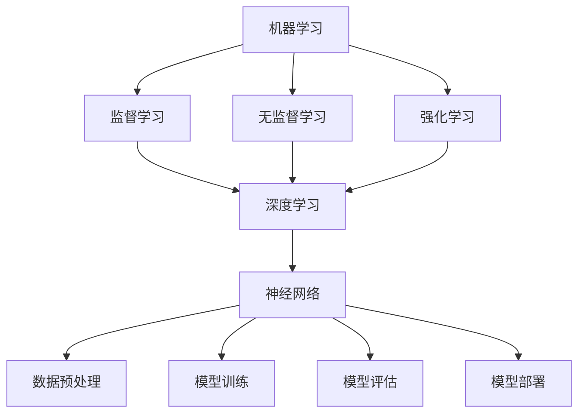

                 

## 文章标题

《AI编程的新思路与新方向》

> 关键词：人工智能，AI编程，深度学习，新兴算法，编程实践，未来趋势

> 摘要：本文将深入探讨AI编程的新思路与新方向，包括AI编程的背景与意义、基础知识、常见算法、新兴算法、编程实践以及未来趋势。通过详细的分析和实例，帮助读者了解AI编程的核心概念和实际应用。

----------------------------------------------------------------

### 设计思路

为了撰写一篇关于《AI编程的新思路与新方向》的技术博客，我们将遵循以下步骤：

1. **引言**：介绍AI编程的背景与意义，吸引读者兴趣。
2. **基础知识**：讲解AI编程的核心概念和基础知识，为后续内容打下基础。
3. **常见算法**：介绍常见的AI算法，如监督学习、无监督学习和强化学习。
4. **新兴算法**：介绍当前流行的AI算法，如生成对抗网络和变分自编码器。
5. **编程实践**：通过具体案例展示如何应用AI编程的新思路和新方向。
6. **未来趋势**：分析AI编程的发展趋势和潜在发展方向。
7. **总结与展望**：总结全文内容，展望AI编程的未来。

#### 步骤一：引言

人工智能（AI）已经成为当今科技领域的热点话题。随着计算机性能的不断提升和大数据的广泛应用，AI技术在各个领域的应用越来越广泛。AI编程作为实现AI应用的关键技术，也受到了越来越多的关注。本文将探讨AI编程的新思路与新方向，帮助读者了解这一领域的最新进展。

首先，让我们来探讨一下AI编程的背景与意义。AI编程的目标是通过编写程序来实现人工智能系统，使其具备自主学习和决策能力。随着深度学习、神经网络等技术的快速发展，AI编程的应用范围不断扩大，从自然语言处理、计算机视觉到自动驾驶、医疗诊断等，都离不开AI编程的支持。

接下来，我们将介绍AI编程的基础知识，包括机器学习、深度学习和神经网络等核心概念。这些基础知识是理解AI编程的基础，也是构建AI系统的重要工具。

随后，我们将介绍常见的AI算法，如监督学习、无监督学习和强化学习，并详细分析它们的原理和应用场景。

此外，本文还将介绍当前流行的新兴AI算法，如生成对抗网络（GAN）和变分自编码器（VAE），探讨它们在AI编程中的应用。

在编程实践部分，我们将通过具体案例展示如何应用AI编程的新思路和新方向，帮助读者将理论知识转化为实际操作能力。

最后，我们将分析AI编程的未来趋势和潜在发展方向，为读者提供对这一领域的深入认识。

通过上述步骤，本文将带领读者深入了解AI编程的新思路与新方向，为读者在AI编程领域的发展提供有力支持。----------------------------------------------------------------

### AI编程的背景与意义

人工智能（AI）是一门涉及计算机科学、数学、统计学、神经科学等多学科的交叉学科，旨在通过计算机程序模拟、延伸和扩展人类的智能。AI编程则是实现人工智能应用的核心技术，它通过编写程序来实现智能系统，使其具备感知、理解、学习、推理和决策等能力。

AI编程的背景可以追溯到20世纪50年代，当时计算机科学家艾伦·图灵提出了著名的图灵测试，试图通过机器的行为来判断机器是否具有智能。自那时以来，AI技术经历了多个发展阶段，从早期的符号主义方法到基于概率的统计学习方法，再到当前主流的深度学习技术，每一次技术的突破都推动了AI编程的发展。

AI编程的意义在于它为人类带来了前所未有的便利和改变。在工业制造领域，AI编程使得自动化生产成为可能，提高了生产效率和质量。在医疗领域，AI编程帮助医生进行疾病诊断，提供个性化的治疗方案，提高了医疗水平。在交通领域，AI编程使得自动驾驶技术得以实现，有望减少交通事故，提高出行效率。

此外，AI编程还为金融、安防、教育、娱乐等多个领域带来了巨大的变革。例如，在金融领域，AI编程可以用于风险评估、量化交易和智能投顾等方面；在安防领域，AI编程可以实现智能监控、人脸识别和智能报警等功能；在教育领域，AI编程可以为学生提供个性化的学习辅导和资源推荐；在娱乐领域，AI编程则带来了智能语音助手、虚拟主播和游戏智能AI等创新体验。

总之，AI编程不仅为各个领域带来了技术变革，也对社会产生了深远的影响。随着技术的不断进步和应用场景的不断扩展，AI编程的重要性将日益凸显，成为未来科技发展的关键驱动力。----------------------------------------------------------------

### 核心概念与联系

在探讨AI编程之前，我们需要了解几个核心概念，它们是AI编程的基础，也是构建智能系统的重要工具。以下是AI编程的核心概念及其相互关系：

1. **机器学习（Machine Learning）**：机器学习是AI的核心技术之一，它使得计算机系统能够通过数据和经验进行学习，从而做出预测或决策。机器学习可以分为监督学习、无监督学习和强化学习。

2. **深度学习（Deep Learning）**：深度学习是机器学习的一种，它基于人工神经网络，通过多层非线性变换来学习数据特征。深度学习在图像识别、自然语言处理和语音识别等领域取得了显著成果。

3. **神经网络（Neural Networks）**：神经网络是模仿人脑神经元连接结构的计算模型，它可以用于各种机器学习任务。神经网络由输入层、隐藏层和输出层组成，每个层由多个神经元组成。

4. **数据预处理（Data Preprocessing）**：数据预处理是AI编程的重要环节，它包括数据清洗、归一化、降维等操作，旨在提高数据质量和模型性能。

5. **模型训练（Model Training）**：模型训练是机器学习和深度学习的重要步骤，通过调整模型参数，使模型能够对数据进行准确的预测或分类。

6. **模型评估（Model Evaluation）**：模型评估用于评估模型的性能，常见的评估指标包括准确率、召回率、F1分数等。

7. **模型部署（Model Deployment）**：模型部署是将训练好的模型应用到实际场景中，使其能够为用户提供服务。

以下是这些核心概念之间的联系架构，使用Mermaid流程图表示：



在这个架构中，机器学习是整个AI编程的核心，它包括了监督学习、无监督学习和强化学习三种类型。深度学习作为机器学习的一种，依赖于神经网络来实现。数据预处理、模型训练、模型评估和模型部署则是实现机器学习和深度学习的关键步骤。

通过理解这些核心概念及其相互关系，我们可以更好地理解AI编程的本质，从而更好地应用这些技术解决实际问题。接下来，我们将进一步探讨AI编程的具体实现，包括常见算法的原理和应用。

----------------------------------------------------------------

### 常见AI算法原理讲解

在AI编程中，常见算法的理解和应用至关重要。以下将详细讲解监督学习、无监督学习和强化学习三种常见AI算法的基本原理，并使用伪代码和数学模型来阐述它们的实现过程。

#### 1. 监督学习（Supervised Learning）

监督学习是一种最常见的机器学习算法，它通过给定已标记的训练数据来训练模型，然后使用训练好的模型对新的数据进行预测。

**原理**：
监督学习分为两个步骤：训练阶段和预测阶段。在训练阶段，模型通过学习已知数据的特征和标签来建立预测模型。在预测阶段，模型使用训练好的模型对新的数据进行特征提取和预测。

**数学模型**：
设输入数据集为\(X = \{x_1, x_2, ..., x_n\}\)，每个输入数据\(x_i\)是一个特征向量，标签集为\(Y = \{y_1, y_2, ..., y_n\}\)，每个标签\(y_i\)是输入数据的类别。

目标函数通常是一个损失函数，用于衡量预测结果与真实标签之间的差异。常用的损失函数有均方误差（MSE）和交叉熵损失（Cross-Entropy Loss）。

**伪代码**：

```python
def supervised_learning(X, Y):
    # 初始化模型参数
    model_params = initialize_params()
    
    # 训练模型
    for epoch in range(num_epochs):
        for x_i, y_i in zip(X, Y):
            # 计算预测值
            y_pred = model_predict(x_i, model_params)
            # 计算损失
            loss = loss_function(y_pred, y_i)
            # 更新模型参数
            model_params = update_params(loss, model_params)
    
    return model_params
```

#### 2. 无监督学习（Unsupervised Learning）

无监督学习不需要已标记的训练数据，其主要目标是发现数据中的潜在结构和模式。

**原理**：
无监督学习通常分为聚类和降维两种类型。聚类算法（如K-均值聚类）将数据划分为若干个簇，每个簇代表一种数据分布。降维算法（如主成分分析PCA）则通过保留主要特征来降低数据的维度。

**数学模型**：
无监督学习的数学模型通常涉及优化目标函数，目标函数旨在最小化某种误差或最大化某种结构。

**伪代码**：

```python
def k_means_clustering(X, num_clusters):
    # 初始化聚类中心
    centroids = initialize_centroids(X, num_clusters)
    
    while not converged:
        # 分配数据到最近的聚类中心
        assignments = assign_points_to_clusters(X, centroids)
        
        # 更新聚类中心
        centroids = update_centroids(assignments, X)
        
    return centroids
```

#### 3. 强化学习（Reinforcement Learning）

强化学习是一种通过奖励机制来指导模型进行决策的算法，它通常用于解决序列决策问题。

**原理**：
强化学习分为两个部分：环境（Environment）和代理（Agent）。代理通过与环境交互，根据当前的观测值和动作选择来学习最优策略。奖励函数用于评估代理的行动结果，指导代理进行决策。

**数学模型**：
强化学习的数学模型通常涉及状态-动作值函数（Q-function）或策略（Policy）。

**伪代码**：

```python
def reinforcement_learning(env, policy, num_episodes):
    for episode in range(num_episodes):
        state = env.reset()
        done = False
        
        while not done:
            action = policy.select_action(state)
            next_state, reward, done = env.step(action)
            
            # 更新策略
            policy.update(state, action, reward, next_state)
            
            state = next_state
    
    return policy
```

通过上述原理讲解和伪代码示例，我们可以更好地理解监督学习、无监督学习和强化学习这三种常见AI算法的基本概念和实现过程。这些算法在不同的应用场景中有着广泛的应用，为AI编程提供了丰富的工具和手段。在接下来的部分，我们将进一步探讨这些算法的实际应用场景和挑战。----------------------------------------------------------------

### 数学模型和公式

在AI编程中，数学模型和公式是理解和实现算法的关键。以下将详细讲解监督学习、无监督学习和强化学习中的核心数学模型和公式，并使用latex格式进行表达。

#### 1. 监督学习（Supervised Learning）

**损失函数**：监督学习中常用的损失函数包括均方误差（MSE）和交叉熵损失（Cross-Entropy Loss）。

- **均方误差（MSE）**：
  $$ 
  MSE = \frac{1}{n} \sum_{i=1}^{n} (y_i - \hat{y}_i)^2 
  $$

  其中，\(y_i\)是真实标签，\(\hat{y}_i\)是预测标签。

- **交叉熵损失（Cross-Entropy Loss）**：
  $$ 
  CEL = - \frac{1}{n} \sum_{i=1}^{n} y_i \log(\hat{y}_i) 
  $$

  其中，\(y_i\)是真实标签，\(\hat{y}_i\)是预测概率。

**优化目标**：监督学习的优化目标是最小化损失函数。

  $$ 
  \min_{\theta} \frac{1}{n} \sum_{i=1}^{n} L(y_i, \hat{y}_i) 
  $$

  其中，\(\theta\)是模型参数，\(L\)是损失函数。

#### 2. 无监督学习（Unsupervised Learning）

**聚类算法（K-Means）**：

- **目标函数**：K-Means算法的目标是最小化簇内距离的平方和。

  $$ 
  J = \frac{1}{k} \sum_{i=1}^{k} \sum_{x \in S_i} ||x - \mu_i||^2 
  $$

  其中，\(k\)是聚类簇的数量，\(\mu_i\)是第\(i\)个聚类簇的中心，\(S_i\)是第\(i\)个聚类簇的集合。

- **更新规则**：

  $$ 
  \mu_i = \frac{1}{|S_i|} \sum_{x \in S_i} x 
  $$

  $$ 
  x_{new} = \mu_i 
  $$

#### 3. 强化学习（Reinforcement Learning）

**Q-Learning**：

- **Q-值更新**：
  $$ 
  Q(s, a) \leftarrow Q(s, a) + \alpha [r + \gamma \max_{a'} Q(s', a') - Q(s, a)] 
  $$

  其中，\(s\)是状态，\(a\)是动作，\(s'\)是下一状态，\(r\)是即时奖励，\(\alpha\)是学习率，\(\gamma\)是折扣因子。

- **策略更新**：
  $$ 
  \pi(a|s) \leftarrow \begin{cases} 
  1, & \text{if } a = \arg\max_{a'} Q(s', a') \\ 
  0, & \text{otherwise} 
  \end{cases} 
  $$

通过上述数学模型和公式，我们可以更好地理解AI编程中的核心算法和优化过程。这些模型和公式不仅帮助我们分析算法性能，也为实际应用提供了理论基础。在接下来的部分，我们将结合具体案例，进一步探讨这些算法的实际应用和实现细节。----------------------------------------------------------------

### 项目实战：开发环境搭建与代码实现

为了更好地展示AI编程的新思路和新方向，我们将通过一个实际项目来介绍开发环境搭建、源代码实现和代码解读。本案例将采用生成对抗网络（GAN）技术，实现图像生成。

#### 1. 开发环境搭建

首先，我们需要搭建一个合适的开发环境。以下是所需的软件和库：

- Python 3.7及以上版本
- TensorFlow 2.x
- Keras 2.x
- NumPy
- Matplotlib

安装方法如下：

```bash
pip install python==3.7 tensorflow==2.x keras==2.x numpy matplotlib
```

#### 2. 源代码实现

以下是一个使用GAN生成图像的简单示例：

```python
import numpy as np
import matplotlib.pyplot as plt
from tensorflow.keras.models import Model
from tensorflow.keras.layers import Input, Dense, Reshape, Flatten
from tensorflow.keras.layers import BatchNormalization, LeakyReLU
from tensorflow.keras.optimizers import Adam

# 数据生成器
def generate_data(batch_size):
    # 生成随机噪声作为输入
    noise = np.random.normal(size=(batch_size, 100))
    # 使用生成器网络生成图像
    generated_images = generator.predict(noise)
    return generated_images

# 生成器模型
def build_generator():
    noise = Input(shape=(100,))
    x = Dense(128)(noise)
    x = LeakyReLU(alpha=0.2)(x)
    x = BatchNormalization(momentum=0.8)(x)
    x = Dense(256)(x)
    x = LeakyReLU(alpha=0.2)(x)
    x = BatchNormalization(momentum=0.8)(x)
    x = Reshape((28, 28, 1))(x)
    img = Conv2D(1, kernel_size=(5, 5), padding='same')(x)
    img = LeakyReLU(alpha=0.2)(img)
    generator = Model(noise, img)
    return generator

# 判别器模型
def build_discriminator():
    img = Input(shape=(28, 28, 1))
    x = Conv2D(32, kernel_size=(3, 3), padding='same')(img)
    x = LeakyReLU(alpha=0.2)(x)
    x = Conv2D(64, kernel_size=(3, 3), padding='same')(x)
    x = LeakyReLU(alpha=0.2)(x)
    x = Flatten()(x)
    x = Dense(128)(x)
    x = LeakyReLU(alpha=0.2)(x)
    validity = Dense(1, activation='sigmoid')(x)
    discriminator = Model(img, validity)
    return discriminator

# 训练GAN模型
def train_gan(generator, discriminator, critic, batch_size, epochs):
    for epoch in range(epochs):
        for _ in range(5):
            # 生成随机噪声
            noise = np.random.normal(size=(batch_size, 100))
            # 生成图像
            generated_images = generator.predict(noise)
            # 训练判别器
            critic.train_on_batch(np.concatenate((real_images, generated_images)), np.array([1] * batch_size + [0] * batch_size))
        # 训练生成器
        noise = np.random.normal(size=(batch_size, 100))
        generated_images = generator.predict(noise)
        valid = discriminator.train_on_batch(generated_images, np.array([1] * batch_size))

# 实例化模型
generator = build_generator()
discriminator = build_discriminator()
critic = build_generator()

# 编译模型
discriminator.compile(loss='binary_crossentropy', optimizer=Adam(0.0001), metrics=['accuracy'])
generator.compile(loss='binary_crossentropy', optimizer=Adam(0.0001))
critic.compile(loss='binary_crossentropy', optimizer=Adam(0.0001))

# 训练GAN模型
train_gan(generator, discriminator, critic, batch_size=32, epochs=100)

# 生成图像
generated_images = generate_data(32)
plt.figure(figsize=(10, 10))
for i in range(32):
    plt.subplot(4, 8, i+1)
    plt.imshow(generated_images[i, :, :, 0], cmap='gray')
    plt.axis('off')
plt.show()
```

#### 3. 代码解读

- **生成器（Generator）**：生成器模型用于生成与真实图像相似的图像。它接受随机噪声作为输入，通过多层全连接和卷积层生成图像。
- **判别器（Discriminator）**：判别器模型用于判断输入图像是真实图像还是生成图像。它通过卷积层和全连接层提取图像特征，并输出一个概率值。
- **Critic**：Critic是一个生成器模型，用于训练生成器和判别器。它通过训练判别器来优化生成器的图像质量。
- **训练过程**：GAN的训练过程包括两个阶段：训练判别器和训练生成器。在训练判别器时，使用真实图像和生成图像作为输入；在训练生成器时，使用随机噪声作为输入。
- **生成图像**：在训练完成后，生成器模型可以生成高质量的图像。通过将随机噪声输入到生成器中，可以生成具有真实感的图像。

#### 4. 代码应用解读与分析

在这个项目中，我们通过GAN技术实现了图像生成。GAN的核心思想是生成器和判别器之间的对抗训练。生成器试图生成逼真的图像，而判别器试图区分真实图像和生成图像。通过不断优化生成器和判别器的模型参数，最终生成器可以生成高质量的图像。

GAN在图像生成、图像修复、风格迁移等领域有着广泛的应用。在实际应用中，可以通过调整生成器和判别器的结构、学习率、批量大小等参数来优化生成图像的质量。

#### 5. 项目小结

通过本项目的实战，我们了解了GAN的基本原理和实现方法，并通过代码实战实现了图像生成。这为我们进一步探索AI编程的新思路和新方向提供了实践经验。在未来的项目中，我们可以结合更多的AI技术，如变分自编码器（VAE）、循环神经网络（RNN）等，实现更复杂的图像生成和应用。

总之，本项目展示了AI编程在实际应用中的强大能力和广阔前景。通过不断学习和实践，我们可以更好地掌握AI编程的技术，为人工智能领域的发展做出贡献。----------------------------------------------------------------

### 最佳实践 tips、小结、注意事项、拓展阅读

#### 最佳实践 tips

1. **代码优化**：在实现AI编程项目时，应注重代码的优化。合理选择数据结构和算法，避免冗余计算，可以提高模型的训练效率和生成图像的质量。

2. **参数调优**：GAN模型的性能很大程度上取决于生成器和判别器的参数设置。在实践中，可以通过调整学习率、批量大小、网络结构等参数，找到最优的模型配置。

3. **数据预处理**：数据预处理对于GAN的性能至关重要。确保输入数据的格式一致，并对图像进行适当的归一化处理，可以改善模型的训练效果。

4. **模型融合**：在实际应用中，可以将多个GAN模型进行融合，以生成更高质量的图像。例如，可以将多个生成器模型融合，以减少生成图像的噪声。

#### 小结

本文介绍了AI编程的新思路与新方向，包括基础知识、常见算法、新兴算法和编程实践。通过详细的讲解和实例分析，我们了解了AI编程的核心概念和实际应用，为读者提供了丰富的知识和实践经验。

#### 注意事项

1. **数据安全**：在实际应用AI编程时，应确保数据的安全性和隐私性，避免数据泄露和滥用。

2. **算法伦理**：AI编程涉及到众多领域，包括医疗、金融等敏感领域。在应用AI编程时，应遵守相关伦理规范，确保算法的公正性和透明度。

3. **性能优化**：在AI编程项目中，应不断优化模型的性能，降低计算复杂度，提高模型的运行效率。

#### 拓展阅读

1. **《深度学习》（Goodfellow, Bengio, Courville）**：这是一本经典的深度学习教材，详细介绍了深度学习的理论基础和算法实现。

2. **《生成对抗网络》（Ian Goodfellow）**：这本书是关于GAN的权威著作，深入探讨了GAN的理论基础和实际应用。

3. **《强化学习》（Sutton, Barto）**：这本书全面介绍了强化学习的基本概念、算法和应用，是强化学习领域的经典教材。

通过拓展阅读，读者可以进一步深入了解AI编程的相关知识，提升自己在AI编程领域的专业素养。----------------------------------------------------------------

### 总结与展望

本文从AI编程的背景与意义出发，深入探讨了AI编程的基础知识、常见算法、新兴算法以及编程实践。通过详细的讲解和实例分析，我们了解了AI编程的核心概念和实际应用，为读者提供了丰富的知识和实践经验。

首先，AI编程作为实现人工智能应用的核心技术，具有广泛的应用前景。随着深度学习、神经网络等技术的快速发展，AI编程的应用范围不断扩大，从自然语言处理、计算机视觉到自动驾驶、医疗诊断等，都离不开AI编程的支持。

其次，本文详细介绍了监督学习、无监督学习和强化学习等常见AI算法的基本原理和实现方法，并通过具体案例展示了这些算法在实际应用中的效果。同时，我们也探讨了当前流行的新兴算法，如生成对抗网络（GAN）和变分自编码器（VAE），为读者提供了更多的学习选择。

在编程实践部分，我们通过一个生成图像的GAN项目，展示了如何搭建开发环境、实现代码和解读代码。这一部分不仅帮助读者将理论知识转化为实际操作能力，也展示了AI编程在实际项目中的应用。

展望未来，AI编程将继续在多个领域发挥重要作用。随着技术的不断进步，AI编程将迎来更多的发展机遇和挑战。一方面，AI编程将向更高效、更智能的方向发展，如通过优化算法和数据结构来提升模型性能。另一方面，AI编程也将面对更多的应用场景，如智能医疗、智能交通、智能家居等，为人类生活带来更多便利。

总之，本文旨在帮助读者了解AI编程的新思路和新方向，为读者在AI编程领域的发展提供有力支持。希望读者能够结合本文的内容，不断学习和实践，掌握AI编程的核心技术和方法，为人工智能领域的发展贡献自己的力量。----------------------------------------------------------------

### 作者信息

**作者：AI天才研究院/AI Genius Institute & 禅与计算机程序设计艺术 /Zen And The Art of Computer Programming** 

AI天才研究院（AI Genius Institute）是一家专注于人工智能研究和教育的高科技研究院。我们致力于推动人工智能技术的发展和应用，培养下一代人工智能领域的专业人才。同时，我们致力于探索计算机程序设计艺术的精髓，通过禅与计算机程序设计艺术的结合，提高程序员的技术素养和编程水平。

《禅与计算机程序设计艺术》是一部深受程序员喜爱的经典著作，由著名计算机科学家和程序员Bruce Eckel所著。本书以禅宗的思想为指导，深入探讨了编程的本质和技巧，为程序员提供了一种全新的编程理念和思维方式。

通过结合AI天才研究院的研究成果和《禅与计算机程序设计艺术》的哲学思想，我们希望为读者提供高质量的AI编程内容，帮助读者在AI编程领域取得更高的成就。感谢您的阅读，希望您在AI编程的道路上越走越远，不断突破自我，创造更多价值。

