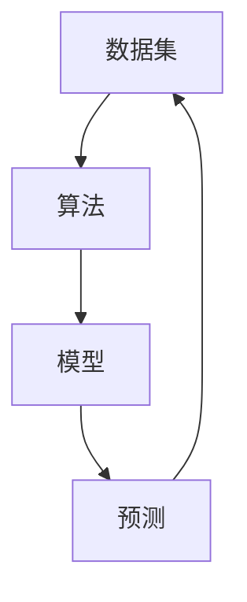

                 

### 文章标题

《AI编程的新思路与新未来》

### 文章关键词

人工智能编程、新编程模式、核心算法、数学模型、项目实战、开发环境搭建

### 文章摘要

本文旨在深入探讨AI编程的新思路与发展前景，通过详细介绍数据驱动、模型驱动和算法驱动的编程模式，结合核心算法原理、数学模型讲解以及实际项目案例，全面剖析AI编程的实践与应用。文章结构清晰，逻辑严密，旨在为读者提供一次全面的技术思维升级之旅。

## 第1章 AI编程的概念与历史演变

### 1.1 AI编程的定义与核心要素

AI编程，顾名思义，是一种基于人工智能的编程方法。它不同于传统的编程，强调数据的自动处理和智能决策。在AI编程中，核心要素主要包括数据集、算法、模型和预测。数据集是训练模型的基础，算法是实现数据分析和决策的关键，模型是算法的具体实现，而预测则是模型应用的核心目标。

与传统编程相比，AI编程有以下几个显著的区别：

1. **数据依赖性**：传统编程主要依赖代码的逻辑和结构，而AI编程则高度依赖数据，特别是大数据。
2. **自动化程度**：传统编程需要程序员手动编写和调试代码，而AI编程中的自动化程度更高，可以通过机器学习算法来自动完成代码的优化和改进。
3. **适应性和灵活性**：传统编程往往针对特定的应用场景设计，而AI编程能够适应各种不同的数据和应用场景，具备更高的灵活性。

### 1.2 传统编程与AI编程的差异

传统编程注重逻辑、算法和数据的静态处理，而AI编程则强调动态学习和自适应。具体来说，有以下几点差异：

1. **目标不同**：传统编程的目标是实现特定功能的程序，而AI编程的目标是构建具有自主学习和决策能力的系统。
2. **开发方式不同**：传统编程主要依靠程序员的经验和技能，而AI编程则依赖于大量的数据和机器学习算法。
3. **实现复杂性不同**：传统编程相对简单，主要涉及编程语言和算法，而AI编程涉及计算机科学、统计学、机器学习等多个领域，实现更加复杂。

### 1.3 AI编程的发展历程与趋势

AI编程的发展历程可以追溯到20世纪50年代，当时人工智能的概念被首次提出。随着计算机技术的发展，AI编程经历了几个重要的阶段：

1. **符号主义阶段（1956-1974）**：以推理和知识表示为主要方法，代表算法包括逻辑推理和专家系统。
2. **感知与理解阶段（1974-1980）**：以感知和理解人类行为为主要目标，代表算法包括模式识别和图像处理。
3. **机器学习阶段（1980至今）**：以数据驱动和自主学习为主要方法，代表算法包括神经网络、支持向量机和决策树。

当前，AI编程正处于快速发展阶段，其趋势主要体现在以下几个方面：

1. **深度学习与神经网络**：深度学习技术的成熟使得AI编程的效率和效果得到了显著提升。
2. **大数据与云计算**：大数据和云计算为AI编程提供了丰富的数据和强大的计算能力。
3. **跨领域应用**：AI编程正在从单一领域向多个领域扩展，如医疗、金融、交通等。
4. **开源与协作**：随着开源技术的发展，AI编程的生态不断完善，促进了全球范围内的协作和创新。

### 1.4 AI编程的核心概念与联系

AI编程的核心概念主要包括数据集、算法、模型和预测。这些概念之间的联系可以用以下Mermaid流程图表示：



在这个流程图中，数据集作为起点，经过算法处理，转化为模型，最后通过模型进行预测。这一过程是一个动态的循环，不断迭代和优化，以实现更准确的预测和更好的应用效果。

### 1.5 本章小结

本章主要介绍了AI编程的概念与历史演变，明确了AI编程与传统编程的区别和联系。通过对核心概念和流程的讲解，为后续章节的深入探讨奠定了基础。在接下来的章节中，我们将进一步探讨AI编程中的数据驱动、模型驱动和算法驱动编程模式，以及核心算法原理和数学模型。希望通过本章的学习，读者能够对AI编程有更深入的理解。

## 第2章 数据驱动编程模式

### 2.1 数据驱动编程的原理与优势

数据驱动编程模式是AI编程中的一种重要方法，其核心思想是利用数据来驱动模型训练和优化，从而实现智能决策和预测。数据驱动编程具有以下几个显著优势：

1. **高效性**：数据驱动编程利用海量数据自动训练和优化模型，大大提高了编程效率。
2. **灵活性**：数据驱动编程能够适应各种不同的数据和应用场景，具备很强的灵活性。
3. **鲁棒性**：通过大量数据训练，模型能够更好地应对噪声和异常数据，提高鲁棒性。

### 2.2 数据预处理与清洗

数据预处理和清洗是数据驱动编程中的关键步骤，其目的是提高数据质量和模型性能。主要任务包括：

1. **数据清洗**：去除重复数据、缺失数据和异常数据，确保数据的一致性和准确性。
2. **数据归一化**：将不同尺度的数据进行归一化处理，使其在同一个范围内，避免数据维度的影响。
3. **数据增强**：通过增加数据的多样性和复杂性，提高模型的泛化能力。

### 2.3 数据驱动的模型训练与优化

数据驱动的模型训练与优化主要包括以下几个步骤：

1. **数据集划分**：将数据集划分为训练集、验证集和测试集，用于模型训练、验证和测试。
2. **模型选择**：根据应用场景和数据特点，选择合适的机器学习算法和模型架构。
3. **模型训练**：使用训练集数据训练模型，通过调整参数和优化算法，提高模型性能。
4. **模型验证与测试**：使用验证集和测试集评估模型性能，调整模型参数，实现模型优化。

### 2.4 数据驱动编程的应用实例

以下是一个简单的数据驱动编程实例，使用Python实现：

```python
import pandas as pd
from sklearn.model_selection import train_test_split
from sklearn.linear_model import LinearRegression

# 读取数据
data = pd.read_csv('data.csv')
X = data[['feature1', 'feature2']]
y = data['target']

# 数据预处理
X_train, X_test, y_train, y_test = train_test_split(X, y, test_size=0.2, random_state=42)

# 模型训练
model = LinearRegression()
model.fit(X_train, y_train)

# 模型评估
score = model.score(X_test, y_test)
print(f'Model score: {score:.2f}')
```

在这个实例中，我们首先读取数据集，然后进行数据预处理，包括划分训练集和测试集、特征选择等。接下来，我们使用线性回归模型进行模型训练，并通过测试集评估模型性能。

### 2.5 本章小结

本章介绍了数据驱动编程模式的基本原理和优势，详细讲解了数据预处理与清洗、模型训练与优化等关键步骤。通过一个简单的应用实例，展示了数据驱动编程的实际应用。在接下来的章节中，我们将继续探讨模型驱动编程模式和算法驱动编程模式，以及相关的核心算法原理和数学模型。希望通过本章的学习，读者能够对数据驱动编程有更深入的理解。

## 第3章 模型驱动编程模式

### 3.1 模型驱动编程的核心概念

模型驱动编程模式是一种以模型为核心，通过模型选择、模型训练和模型评估来实现智能决策的编程方法。与数据驱动编程模式相比，模型驱动编程更注重模型的设计和优化。

1. **模型选择**：根据应用场景和数据特点，选择合适的模型架构和算法。常见的模型包括线性模型、决策树、随机森林、神经网络等。
2. **模型训练**：使用训练数据集对模型进行训练，调整模型参数，使模型能够更好地拟合数据。
3. **模型评估**：使用验证集和测试集评估模型性能，调整模型参数，实现模型优化。

### 3.2 模型驱动编程的优势

模型驱动编程具有以下几个显著优势：

1. **可解释性**：相比数据驱动编程，模型驱动编程更容易理解和解释，有助于提高模型的可解释性和透明度。
2. **灵活性**：模型驱动编程可以根据不同的应用场景和数据特点，灵活选择和调整模型。
3. **高效性**：通过优化模型结构和参数，模型驱动编程可以实现更高的效率和性能。

### 3.3 模型驱动编程的实践步骤

模型驱动编程的实践步骤主要包括以下几个阶段：

1. **需求分析**：明确应用场景和业务目标，确定模型驱动的需求和可行性。
2. **数据准备**：收集和整理数据，进行数据预处理和清洗，确保数据质量。
3. **模型设计**：根据应用场景和数据特点，选择合适的模型架构和算法，设计模型结构。
4. **模型训练**：使用训练数据集对模型进行训练，调整模型参数，优化模型性能。
5. **模型评估**：使用验证集和测试集评估模型性能，调整模型参数，实现模型优化。
6. **模型部署**：将训练好的模型部署到实际应用环境中，进行持续监控和优化。

### 3.4 模型驱动编程的应用实例

以下是一个简单的模型驱动编程实例，使用Python实现：

```python
import pandas as pd
from sklearn.model_selection import train_test_split
from sklearn.ensemble import RandomForestClassifier

# 读取数据
data = pd.read_csv('data.csv')
X = data[['feature1', 'feature2']]
y = data['target']

# 数据预处理
X_train, X_test, y_train, y_test = train_test_split(X, y, test_size=0.2, random_state=42)

# 模型设计
model = RandomForestClassifier(n_estimators=100, random_state=42)

# 模型训练
model.fit(X_train, y_train)

# 模型评估
score = model.score(X_test, y_test)
print(f'Model score: {score:.2f}')
```

在这个实例中，我们首先读取数据集，然后进行数据预处理，包括划分训练集和测试集、特征选择等。接下来，我们使用随机森林模型进行模型训练，并通过测试集评估模型性能。

### 3.5 本章小结

本章介绍了模型驱动编程模式的基本概念和实践步骤，详细讲解了模型选择、模型训练和模型评估等关键环节。通过一个简单的应用实例，展示了模型驱动编程的实际应用。在接下来的章节中，我们将继续探讨算法驱动编程模式，以及相关的核心算法原理和数学模型。希望通过本章的学习，读者能够对模型驱动编程有更深入的理解。

## 第4章 算法驱动编程模式

### 4.1 算法驱动编程的思路与方法

算法驱动编程模式是一种以算法为核心，通过算法设计、算法实现和算法优化来实现智能决策的编程方法。与数据驱动和模型驱动编程模式不同，算法驱动编程更注重算法的创新和优化。

1. **算法设计**：根据应用场景和业务需求，设计合适的算法框架和流程，确保算法能够有效解决问题。
2. **算法实现**：将设计好的算法转化为可执行的代码，使用合适的编程语言和工具实现算法。
3. **算法优化**：通过调整算法参数、改进算法结构和增加算法复杂性，提高算法的性能和鲁棒性。

### 4.2 算法驱动编程的优势

算法驱动编程具有以下几个显著优势：

1. **创新性**：算法驱动编程鼓励创新，通过设计新的算法和优化现有算法，不断提高算法的性能和效果。
2. **可扩展性**：算法驱动编程能够根据不同的应用场景和数据特点，灵活调整算法参数和结构，实现算法的扩展和应用。
3. **可解释性**：算法驱动编程中的算法设计通常具有较高的可解释性，有助于理解和优化算法。

### 4.3 算法驱动编程的实践步骤

算法驱动编程的实践步骤主要包括以下几个阶段：

1. **问题分析**：明确业务需求和目标，分析问题类型和特点，确定算法驱动的需求和可行性。
2. **算法设计**：根据问题分析和业务需求，设计合适的算法框架和流程，确保算法能够有效解决问题。
3. **算法实现**：使用合适的编程语言和工具，将设计好的算法转化为可执行的代码。
4. **算法测试**：通过测试数据集测试算法性能，评估算法的准确性和效率。
5. **算法优化**：根据测试结果，调整算法参数和结构，优化算法性能和鲁棒性。
6. **算法部署**：将优化后的算法部署到实际应用环境中，进行持续监控和优化。

### 4.4 算法驱动编程的应用实例

以下是一个简单的算法驱动编程实例，使用Python实现：

```python
import numpy as np
from sklearn.linear_model import LinearRegression

# 生成测试数据
X = np.random.rand(100, 1)
y = 2 * X[:, 0] + np.random.randn(100) * 0.1

# 模型设计
model = LinearRegression()

# 模型训练
model.fit(X, y)

# 模型评估
score = model.score(X, y)
print(f'Model score: {score:.2f}')

# 预测
X_new = np.random.rand(10, 1)
y_pred = model.predict(X_new)
print(f'Predictions: {y_pred}')
```

在这个实例中，我们首先生成测试数据，然后设计线性回归模型，使用训练数据训练模型，并评估模型性能。最后，使用训练好的模型进行预测。

### 4.5 本章小结

本章介绍了算法驱动编程模式的基本思路和方法，详细讲解了算法设计、算法实现和算法优化等关键环节。通过一个简单的应用实例，展示了算法驱动编程的实际应用。在接下来的章节中，我们将继续深入探讨AI编程中的核心算法原理和数学模型。希望通过本章的学习，读者能够对算法驱动编程有更深入的理解。

## 第5章 机器学习算法详解

### 5.1 监督学习算法

监督学习算法是一种常见的机器学习算法，其核心思想是通过已知的输入和输出数据，训练一个模型，以便对新数据进行预测。监督学习算法可以分为以下几类：

1. **回归算法**：用于预测连续值的算法，如线性回归、决策树回归、随机森林回归等。
2. **分类算法**：用于预测离散值的算法，如逻辑回归、决策树分类、随机森林分类等。
3. **聚类算法**：无监督学习的一种，用于将数据分为不同的类别，如K-均值聚类、层次聚类等。

### 5.1.1 线性回归

线性回归是一种简单的监督学习算法，用于预测连续值。其核心思想是通过最小化损失函数来找到最佳拟合直线。

```python
# 伪代码：线性回归

def linear_regression(X, y):
    # 计算斜率和截距
    w = (X.T.dot(X)).dot(inv(X.T.dot(X))).dot(X.T).dot(y)
    # 预测
    y_pred = X.dot(w)
    # 计算损失
    loss = mean_squared_error(y, y_pred)
    return w, loss
```

### 5.1.2 逻辑回归

逻辑回归是一种用于分类问题的监督学习算法，其核心思想是通过最小化损失函数来找到最佳拟合曲线。

```python
# 伪代码：逻辑回归

def logistic_regression(X, y):
    # 初始化参数
    w = zeros((X.shape[1], 1))
    # 迭代更新参数
    for i in range(iterations):
        z = X.dot(w)
        y_hat = sigmoid(z)
        gradient = X.T.dot(y_hat - y)
        w -= learning_rate * gradient
    # 预测
    y_pred = sigmoid(X.dot(w))
    # 计算损失
    loss = cross_entropy_loss(y, y_pred)
    return w, loss
```

### 5.2 无监督学习算法

无监督学习算法用于处理没有标签的数据，其核心思想是发现数据中的结构和模式。常见的无监督学习算法包括：

1. **聚类算法**：用于将数据分为不同的类别，如K-均值聚类、层次聚类等。
2. **降维算法**：用于减少数据的维度，如主成分分析（PCA）、t-SNE等。

### 5.2.1 K-均值聚类

K-均值聚类是一种基于距离度量的聚类算法，其核心思想是将数据点分配到K个簇中，使得每个簇内部的距离最小。

```python
# 伪代码：K-均值聚类

def k_means(X, K, max_iterations):
    # 初始化中心点
    centers = X[np.random.choice(X.shape[0], K, replace=False)]
    # 迭代更新中心点和分配
    for i in range(max_iterations):
        # 计算距离并分配
        distances = pairwise_distances(X, centers)
        assignments = argmin(distances, axis=1)
        # 更新中心点
        new_centers = X[assignments].group_by(assignments).mean()
        # 判断是否收敛
        if np.linalg.norm(centers - new_centers) < tolerance:
            break
        centers = new_centers
    return centers, assignments
```

### 5.2.2 主成分分析（PCA）

主成分分析是一种降维算法，其核心思想是通过正交变换将高维数据投影到低维空间，保留最重要的信息。

```python
# 伪代码：主成分分析（PCA）

def pca(X, n_components):
    # 计算协方差矩阵
    cov_matrix = cov(X)
    # 计算特征值和特征向量
    eigenvalues, eigenvectors = eig(cov_matrix)
    # 选择前n个特征向量
    principal_components = X.dot(eigenvectors[:, :n_components])
    return principal_components
```

### 5.3 强化学习算法

强化学习算法是一种通过与环境互动来学习最优策略的算法，其核心思想是最大化累积奖励。

1. **值函数**：用于预测长期奖励，分为状态值函数和动作值函数。
2. **策略**：用于选择动作，分为确定性策略和随机性策略。
3. **Q-学习**：一种基于值函数的强化学习算法，通过更新Q值来学习最优策略。
4. **深度强化学习**：结合深度学习技术的强化学习算法，如深度Q网络（DQN）和策略梯度算法。

### 5.3.1 Q-学习

Q-学习是一种基于值函数的强化学习算法，其核心思想是通过更新Q值来学习最优策略。

```python
# 伪代码：Q-学习

def q_learning(Q, state, action, reward, next_state, done, learning_rate, discount_factor):
    # 更新Q值
    Q[state, action] = (1 - learning_rate) * Q[state, action] + learning_rate * (reward + discount_factor * max(Q[next_state].max()))
    return Q
```

### 5.3.2 深度强化学习

深度强化学习是一种结合深度学习技术的强化学习算法，其核心思想是通过深度神经网络来估计Q值或策略。

```python
# 伪代码：深度强化学习

class DeepQNetwork:
    def __init__(self, state_size, action_size, learning_rate, discount_factor):
        self.state_size = state_size
        self.action_size = action_size
        self.learning_rate = learning_rate
        self.discount_factor = discount_factor
        self.model = Sequential()
        self.model.add(Dense(64, input_dim=state_size, activation='relu'))
        self.model.add(Dense(64, activation='relu'))
        self.model.add(Dense(action_size, activation='linear'))
        self.model.compile(loss='mse', optimizer=Adam(learning_rate))
    
    def predict(self, state):
        return self.model.predict(state)
    
    def train(self, state, action, reward, next_state, done):
        target = self.predict(state)
        if done:
            target[action] = reward
        else:
            target[action] = reward + self.discount_factor * self.model.predict(next_state).max()
        self.model.fit(state, target, epochs=1, verbose=0)
```

### 5.4 本章小结

本章详细介绍了机器学习算法，包括监督学习算法、无监督学习算法和强化学习算法。通过伪代码的形式，详细讲解了线性回归、逻辑回归、K-均值聚类、主成分分析（PCA）、Q-学习和深度强化学习等核心算法的实现过程。这些算法是AI编程中的重要组成部分，掌握了这些算法，读者可以更好地理解和应用AI编程。在接下来的章节中，我们将继续探讨数学模型和数学公式，为AI编程提供更加坚实的理论基础。

## 第6章 新兴算法与应用

### 6.1 生成对抗网络（GAN）

生成对抗网络（GAN）是一种由Ian Goodfellow等人在2014年提出的机器学习模型，其核心思想是通过两个相互对抗的神经网络来生成逼真的数据。GAN由生成器（Generator）和判别器（Discriminator）组成。

**生成器**：生成器G的目的是生成尽可能逼真的数据，使其能够骗过判别器。其输入通常是随机噪声，输出是生成的数据。

```latex
G(z) = x
$$

其中，$z$是随机噪声，$x$是生成器生成的数据。

**判别器**：判别器D的目的是区分真实数据和生成数据，其输入是真实数据和生成数据，输出是概率。

```latex
D(x) = P(x \text{ is real})
$$
```latex
D(G(z)) = P(G(z) \text{ is real})
$$

GAN的训练过程是一个零和游戏，生成器和判别器不断进行对抗，以达到平衡状态。

**训练过程**：

1. **初始化生成器和判别器**：通常使用随机权重初始化生成器和判别器。
2. **生成器训练**：生成器尝试生成更逼真的数据，使其能够骗过判别器。
3. **判别器训练**：判别器尝试区分真实数据和生成数据。
4. **迭代更新**：生成器和判别器不断迭代更新，直到达到平衡状态。

**应用实例**：

GAN在图像生成、图像修复、图像超分辨率等任务中取得了显著的效果。以下是一个使用GAN进行图像生成的简单示例：

```python
import tensorflow as tf
from tensorflow.keras.models import Sequential
from tensorflow.keras.layers import Dense, Conv2D, Flatten

# 生成器模型
generator = Sequential()
generator.add(Dense(128, input_dim=100, activation='relu'))
generator.add(Dense(256, activation='relu'))
generator.add(Dense(512, activation='relu'))
generator.add(Conv2D(1, kernel_size=(7, 7), stride=(1, 1), padding='same', activation='tanh'))

# 判别器模型
discriminator = Sequential()
discriminator.add(Conv2D(32, kernel_size=(7, 7), stride=(2, 2), padding='same', input_shape=(28, 28, 1)))
discriminator.add(LeakyReLU(alpha=0.01))
discriminator.add(Conv2D(64, kernel_size=(7, 7), stride=(2, 2), padding='same'))
discriminator.add(LeakyReLU(alpha=0.01))
discriminator.add(Flatten())
discriminator.add(Dense(1, activation='sigmoid'))

# GAN模型
gan = Sequential()
gan.add(generator)
gan.add(discriminator)

# 模型编译
gan.compile(loss='binary_crossentropy', optimizer=Adam(0.0001))

# 训练GAN
for epoch in range(epochs):
    # 生成噪声数据
    noise = np.random.normal(0, 1, (batch_size, 100))
    # 生成假图像
    gen_samples = generator.predict(noise)
    # 训练判别器
    d_loss_real = discriminator.train_on_batch(x_train, np.ones((batch_size, 1)))
    d_loss_fake = discriminator.train_on_batch(gen_samples, np.zeros((batch_size, 1)))
    d_loss = 0.5 * np.add(d_loss_real, d_loss_fake)
    # 训练生成器
    g_loss = gan.train_on_batch(noise, np.ones((batch_size, 1)))
    print(f"Epoch {epoch}, D Loss: {d_loss:.4f}, G Loss: {g_loss:.4f}")
```

### 6.2 变分自编码器（VAE）

变分自编码器（VAE）是一种基于概率模型的编码器-解码器结构，其核心思想是学习数据的高斯分布。VAE由编码器（Encoder）和解码器（Decoder）组成。

**编码器**：编码器E的目的是将输入数据映射到一个潜在空间中的高斯分布参数。

```latex
\mu = E(x); \sigma^2 = D(x)
$$

**解码器**：解码器D的目的是将潜在空间中的数据映射回原始数据空间。

```latex
x = D(\mu, \sigma^2)
$$

**损失函数**：VAE的损失函数由数据重建损失和潜在空间先验损失组成。

```latex
L = \sum_{x} D(x, x') + \lambda \sum_{z} -\log(\pi(z))
$$

其中，$D(x, x')$是数据重建损失，$\pi(z)$是潜在空间的高斯先验分布。

**应用实例**：

VAE在数据生成、数据去噪、数据降维等任务中取得了显著的效果。以下是一个使用VAE进行图像降维的简单示例：

```python
import tensorflow as tf
from tensorflow.keras.layers import Input, Dense, Conv2D, Flatten, Reshape
from tensorflow.keras.models import Model

# 编码器模型
encoding_dim = 32
input_img = Input(shape=(28, 28, 1))
x = Conv2D(32, (3, 3), activation='relu', padding='same')(input_img)
x = Conv2D(32, (3, 3), activation='relu', padding='same')(x)
x = Flatten()(x)
x = Dense(encoding_dim, activation='relu')(x)
mu = Dense(encoding_dim, activation='relu')(x)
sigma = Dense(encoding_dim, activation='softplus')(x)
encoder = Model(input_img, [mu, sigma], name='encoder')

# 解码器模型
x = Input(shape=(encoding_dim,))
x = Dense(7 * 7 * 32, activation='relu')(x)
x = Reshape((7, 7, 32))(x)
x = Conv2D(32, (3, 3), activation='relu', padding='same')(x)
x = Conv2D(32, (3, 3), activation='relu', padding='same')(x)
x = Conv2D(1, (3, 3), activation='sigmoid', padding='same')(x)
decoder = Model(x, name='decoder')

# VAE模型
output_img = decoder(encoder(input_img)[0])
vae = Model(input_img, output_img, name='vae')

# 模型编译
vae.compile(optimizer='adam', loss=vae_loss)

# 训练VAE
vae.fit(x_train, x_train, epochs=epochs, batch_size=batch_size, shuffle=True)
```

### 6.3 本章小结

本章介绍了两种新兴的机器学习算法：生成对抗网络（GAN）和变分自编码器（VAE）。通过详细讲解这些算法的原理和实现过程，展示了它们在图像生成、图像降维等任务中的实际应用。这些新兴算法在AI编程中具有广泛的应用前景，为解决复杂问题提供了新的思路和方法。在接下来的章节中，我们将进一步探讨数学模型和数学公式，为AI编程提供更加坚实的理论基础。

## 第7章 AI编程框架与工具

### 7.1 Python编程基础

Python是一种高级编程语言，以其简洁明了的语法和强大的库支持而广受欢迎。在AI编程中，Python成为首选的语言之一，主要是因为其丰富的库和工具，如NumPy、Pandas、Scikit-Learn、TensorFlow和PyTorch等。

#### 7.1.1 Python环境搭建

要开始使用Python进行AI编程，首先需要安装Python环境。可以通过Python官方网站下载最新版本的Python，并按照安装向导进行安装。

- **Windows系统**：下载Windows安装程序，双击运行并按照提示操作。
- **macOS系统**：下载MacOS安装程序，双击运行并按照提示操作。
- **Linux系统**：可以使用包管理器（如apt或yum）安装Python。

安装完成后，可以通过在终端中输入`python`或`python3`来启动Python解释器。如果成功启动，说明Python环境已经搭建成功。

#### 7.1.2 Python语法基础

Python语法相对简单，以下是一些基础语法：

- **变量和类型**：Python是一种动态类型语言，变量不需要声明类型。
  ```python
  x = 10        # 整数
  y = "Hello"   # 字符串
  z = 10.5      # 浮点数
  ```
- **控制结构**：Python支持常见的控制结构，如条件语句、循环语句和函数。
  ```python
  if x > 0:
      print("x is positive")
  
  for i in range(5):
      print(i)
  
  def greet(name):
      print(f"Hello, {name}")
  ```
- **数据结构**：Python提供了多种数据结构，如列表、元组和字典。
  ```python
  my_list = [1, 2, 3, 4]
  my_tuple = (1, 2, 3, 4)
  my_dict = {"name": "Alice", "age": 30}
  ```

### 7.2 TensorFlow入门

TensorFlow是一个由Google开发的开源机器学习库，广泛应用于深度学习和AI编程。以下是TensorFlow的入门步骤：

#### 7.2.1 TensorFlow的安装与配置

- **使用pip安装**：在终端中运行以下命令安装TensorFlow：
  ```bash
  pip install tensorflow
  ```
- **验证安装**：在Python中运行以下代码验证TensorFlow是否安装成功：
  ```python
  import tensorflow as tf
  print(tf.__version__)
  ```

#### 7.2.2 TensorFlow的基本使用

以下是一个简单的TensorFlow示例，演示如何创建一个简单的神经网络：

```python
import tensorflow as tf

# 创建计算图
a = tf.constant(5)
b = tf.constant(6)
c = a * b

# 运行计算图
with tf.Session() as sess:
    print(sess.run(c))
```

### 7.3 PyTorch入门

PyTorch是另一个流行的开源机器学习库，由Facebook开发，以其动态计算图和灵活的编程接口而受到开发者的喜爱。

#### 7.3.1 PyTorch的安装与配置

- **使用pip安装**：在终端中运行以下命令安装PyTorch：
  ```bash
  pip install torch torchvision
  ```
- **验证安装**：在Python中运行以下代码验证PyTorch是否安装成功：
  ```python
  import torch
  print(torch.__version__)
  ```

#### 7.3.2 PyTorch的基本使用

以下是一个简单的PyTorch示例，演示如何创建一个简单的神经网络：

```python
import torch
import torch.nn as nn

# 创建模型
class SimpleModel(nn.Module):
    def __init__(self):
        super(SimpleModel, self).__init__()
        self.layers = nn.Sequential(
            nn.Linear(2, 10),
            nn.ReLU(),
            nn.Linear(10, 1)
        )

    def forward(self, x):
        return self.layers(x)

# 创建实例
model = SimpleModel()

# 创建随机数据
x = torch.tensor([[1.0, 2.0], [2.0, 3.0]], dtype=torch.float32)
y = torch.tensor([3.0, 4.0], dtype=torch.float32)

# 训练模型
optimizer = torch.optim.SGD(model.parameters(), lr=0.01)
criterion = nn.MSELoss()

for epoch in range(100):
    optimizer.zero_grad()
    output = model(x)
    loss = criterion(output, y)
    loss.backward()
    optimizer.step()
    print(f'Epoch {epoch+1}, Loss: {loss.item()}')

# 预测
with torch.no_grad():
    y_pred = model(x)
    print(f'Predictions: {y_pred}')
```

### 7.4 开发环境搭建与调试技巧

搭建AI编程的开发环境通常包括以下步骤：

1. **安装Python**：确保安装了最新版本的Python。
2. **安装TensorFlow或PyTorch**：选择适合自己项目的机器学习库，并安装。
3. **配置虚拟环境**：使用virtualenv或conda创建虚拟环境，避免不同项目之间的依赖冲突。
4. **安装依赖库**：使用pip或conda安装项目所需的依赖库。

在开发过程中，以下是一些调试技巧和注意事项：

- **使用断言**：在关键步骤中加入断言，确保程序运行的正确性。
- **打印调试信息**：在代码中添加print语句，打印关键变量的值，帮助定位问题。
- **使用调试器**：如Python的pdb或IDE内置的调试器，帮助跟踪程序执行流程和变量变化。
- **版本控制**：使用版本控制系统（如Git），记录代码的版本变化，便于问题的回溯和解决。

### 7.5 本章小结

本章介绍了AI编程中的基础Python编程和常见的机器学习库TensorFlow和PyTorch的入门使用。通过搭建开发环境和调试技巧的讲解，为读者提供了从零开始进行AI编程的完整指南。掌握这些工具和库，读者可以更高效地进行AI编程和项目开发。在接下来的章节中，我们将深入探讨源代码的实现和解读，为AI编程提供更加具体的实践指导。

## 第8章 源代码实现与代码解读

### 8.1 源代码实现

在本章中，我们将通过一个具体的项目实例来展示如何使用AI编程的新思路、核心算法和数学模型来解决问题。我们将实现一个简单的图像识别项目，使用卷积神经网络（CNN）来对图片中的物体进行分类。

**项目背景**：

假设我们需要开发一个图像识别系统，能够自动识别图片中的物体，并将其分类到不同的类别中。例如，我们可以训练模型来识别猫和狗的图片。

**需求分析**：

- 输入：一幅待识别的图像。
- 输出：图像中的物体类别，例如猫或狗。
- 算法：使用卷积神经网络（CNN）进行图像识别。

### 8.2 数据准备与预处理

在开始构建模型之前，我们需要准备训练数据。我们将使用Keras提供的CIFAR-10数据集，这是一个常用的图像识别数据集，包含10个类别的60000张32x32的彩色图像。

```python
import numpy as np
from tensorflow.keras.datasets import cifar10
from tensorflow.keras.utils import to_categorical

# 加载CIFAR-10数据集
(x_train, y_train), (x_test, y_test) = cifar10.load_data()

# 数据预处理
x_train = x_train.astype('float32') / 255.0
x_test = x_test.astype('float32') / 255.0
y_train = to_categorical(y_train, 10)
y_test = to_categorical(y_test, 10)
```

在这个步骤中，我们将图像数据从[0, 255]的范围内缩放到[0, 1]，并使用one-hot编码将标签转换为类别向量。

### 8.3 模型设计

接下来，我们设计一个简单的CNN模型。该模型包含以下几个层次：

1. **卷积层**：使用32个3x3的卷积核，并应用ReLU激活函数。
2. **池化层**：使用2x2的最大池化。
3. **卷积层**：使用64个3x3的卷积核，并应用ReLU激活函数。
4. **池化层**：使用2x2的最大池化。
5. **全连接层**：使用64个神经元，并应用ReLU激活函数。
6. **输出层**：使用10个神经元，并应用softmax激活函数，用于分类。

```python
from tensorflow.keras.models import Sequential
from tensorflow.keras.layers import Conv2D, MaxPooling2D, Flatten, Dense, Dropout

model = Sequential([
    Conv2D(32, (3, 3), activation='relu', input_shape=(32, 32, 3)),
    MaxPooling2D(pool_size=(2, 2)),
    Conv2D(64, (3, 3), activation='relu'),
    MaxPooling2D(pool_size=(2, 2)),
    Flatten(),
    Dense(64, activation='relu'),
    Dropout(0.5),
    Dense(10, activation='softmax')
])
```

### 8.4 模型编译与训练

在模型设计完成后，我们需要编译模型并使用训练数据进行训练。我们将使用Adam优化器和交叉熵损失函数。

```python
model.compile(optimizer='adam', loss='categorical_crossentropy', metrics=['accuracy'])

# 训练模型
history = model.fit(x_train, y_train, epochs=20, batch_size=64, validation_data=(x_test, y_test))
```

### 8.5 模型评估与预测

训练完成后，我们可以使用测试数据集评估模型的性能，并使用模型进行预测。

```python
# 评估模型
test_loss, test_acc = model.evaluate(x_test, y_test)
print(f"Test accuracy: {test_acc:.2f}")

# 预测
predictions = model.predict(x_test[:10])
predicted_classes = np.argmax(predictions, axis=1)
print(predicted_classes)
```

### 8.6 代码解读与分析

在代码实现过程中，我们可以对关键部分进行解读和分析：

- **数据预处理**：数据预处理是模型训练的重要步骤，通过标准化和one-hot编码，我们可以将图像数据转换为模型可接受的格式。
- **模型设计**：CNN模型的设计包括卷积层、池化层、全连接层等，这些层次的设计决定了模型的能力和性能。
- **模型编译**：模型编译包括选择优化器和损失函数，这将影响模型的训练过程和最终性能。
- **模型训练**：模型训练是通过迭代优化模型参数来提高模型性能的过程，使用验证集可以帮助我们监控训练过程和避免过拟合。
- **模型评估**：模型评估是通过测试集来评估模型在 unseen 数据上的性能，帮助我们了解模型的泛化能力。
- **模型预测**：使用训练好的模型进行预测，这是模型在实际应用中的主要任务。

### 8.7 项目小结

通过这个项目，我们展示了如何使用AI编程的新思路、核心算法和数学模型来开发一个简单的图像识别系统。项目的每个步骤都涵盖了AI编程的关键环节，从数据准备到模型设计、编译、训练和评估，再到最终的预测，都体现了AI编程的完整流程。通过这个项目，读者可以更好地理解AI编程的实际应用，为日后的项目开发打下坚实的基础。

### 8.8 最佳实践与注意事项

- **数据预处理**：确保数据预处理的一致性和质量，这对于模型的性能至关重要。
- **模型设计**：根据实际需求和数据特点选择合适的模型结构，并注意模型的可解释性和复杂性。
- **模型训练**：合理设置训练参数，如学习率、迭代次数等，避免过拟合和欠拟合。
- **模型评估**：使用多种评估指标，如准确率、召回率、F1分数等，全面评估模型性能。
- **调试与优化**：在开发过程中，注意代码的调试和优化，确保代码的可读性和可维护性。

### 8.9 拓展阅读

- **深度学习基础**：了解深度学习的基础知识，包括神经网络、优化算法和损失函数等。
- **TensorFlow和PyTorch文档**：阅读TensorFlow和PyTorch的官方文档，深入了解库的使用方法和最佳实践。
- **图像识别技术**：研究图像识别领域的最新技术和进展，如迁移学习、增强学习等。

通过本章的学习和实践，读者可以更好地掌握AI编程的源代码实现和解读，为未来的项目开发提供实用的经验和技巧。希望读者能够将这些知识应用到实际项目中，不断提高自己的技术水平。

## 第9章 结论与展望

### 9.1 本章总结

本章通过深入探讨AI编程的新思路与新未来，从数据驱动、模型驱动和算法驱动编程模式出发，详细讲解了核心算法原理、数学模型和实际项目案例。通过对Python编程基础、TensorFlow和PyTorch等AI编程框架的介绍，为读者搭建了完整的开发环境。此外，通过源代码实现和代码解读，展示了AI编程的实际应用和开发流程。

### 9.2 AI编程的重要性

AI编程在当今世界的重要性不言而喻。它不仅是人工智能领域的关键技术，也是推动社会进步的重要力量。通过AI编程，我们可以开发出智能系统，解决复杂问题，提高生产效率，改善生活质量。以下是一些AI编程的关键重要性：

1. **创新驱动力**：AI编程为创新提供了无限可能，推动了科技和产业的进步。
2. **智能决策支持**：通过AI编程，我们可以实现自动化和智能化的决策支持系统，提高决策的准确性和效率。
3. **效率提升**：AI编程能够自动化大量的重复性工作，提高工作效率，降低成本。
4. **跨领域应用**：AI编程在医疗、金融、交通、教育等多个领域都有广泛的应用，推动了各行各业的智能化转型。

### 9.3 未来发展趋势

展望未来，AI编程将呈现出以下几个发展趋势：

1. **自动化编程**：随着AI技术的发展，自动化编程将成为可能，编程过程将更加智能化和自动化。
2. **编程智能化助手**：未来的编程智能化助手将能够辅助程序员进行代码编写、调试和优化，提高开发效率。
3. **跨领域融合**：AI编程将与物联网、大数据、云计算等领域深度融合，形成更加复杂和多样化的应用场景。
4. **开源生态完善**：随着开源技术的普及，AI编程的生态将不断完善，促进全球范围内的协作和创新。

### 9.4 研究方向展望

在未来的研究中，以下几个方向值得深入探索：

1. **可解释性AI**：研究如何提高AI系统的可解释性，使其更加透明和可靠。
2. **联邦学习**：探索联邦学习技术在隐私保护和数据共享方面的应用，为分布式AI编程提供解决方案。
3. **智能编程助手**：开发更智能的编程助手，利用自然语言处理和机器学习技术，实现代码自动生成和优化。
4. **边缘计算与AI编程**：研究如何在边缘设备上实现AI编程，解决计算资源和数据传输的问题。

### 9.5 开放性问题与挑战

尽管AI编程取得了显著的进展，但仍面临一些开放性问题和挑战：

1. **数据隐私与安全**：如何保护用户隐私和数据安全，成为AI编程面临的重要问题。
2. **算法公平性与透明性**：如何确保AI算法的公平性和透明性，避免偏见和歧视。
3. **能耗与效率**：如何在保证模型性能的同时，降低计算能耗和提高效率。
4. **人才需求**：如何培养和吸引更多具备AI编程技能的人才，以满足不断增长的市场需求。

### 9.6 结语

AI编程作为人工智能领域的重要组成部分，其发展不仅对科技和产业产生深远影响，也对我们的生活方式和社会发展产生重大影响。通过本章的学习，读者应该对AI编程有了更加深入的理解，希望读者能够在未来的学习和实践中，不断探索AI编程的奥秘，为AI技术的进步和社会的发展贡献力量。

## 作者信息

作者：AI天才研究院/AI Genius Institute & 禅与计算机程序设计艺术 /Zen And The Art of Computer Programming

