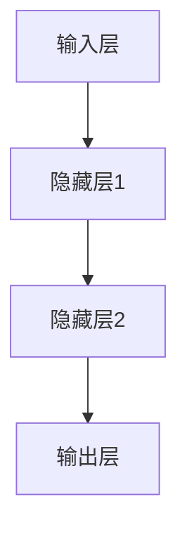
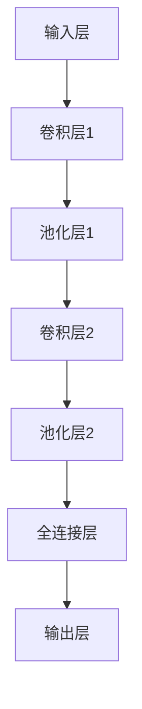
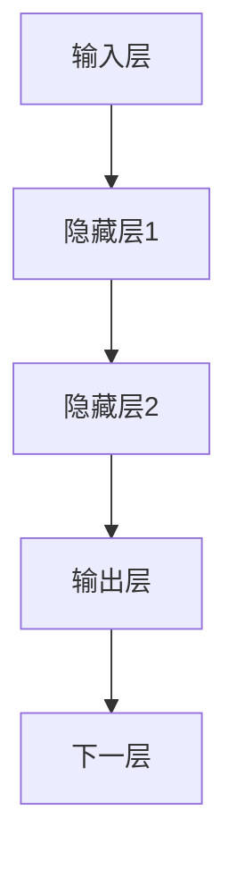
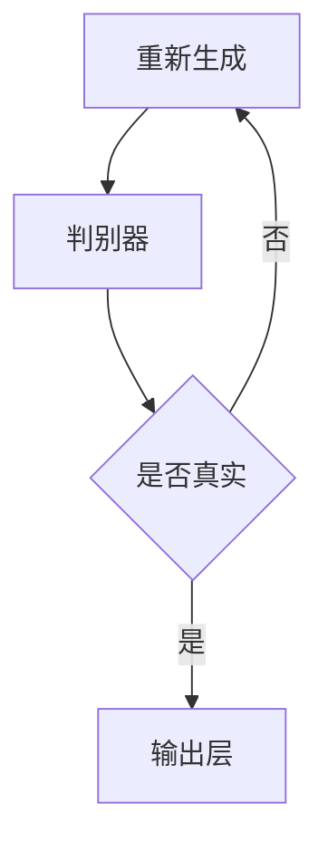
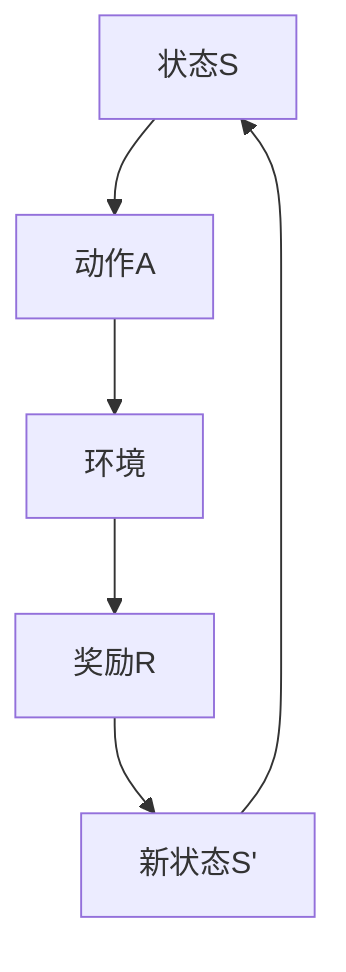
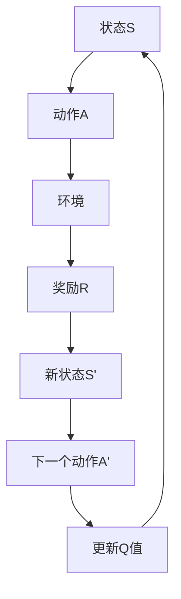

                 

### 文章标题

"AI编程的新维度"  

关键词：人工智能，编程，深度学习，自然语言处理，计算机视觉，强化学习

摘要：本文深入探讨了人工智能编程领域的新趋势和高级概念。通过剖析深度学习、自然语言处理、计算机视觉和强化学习等核心技术，结合实际案例，文章旨在揭示AI编程的未来方向和应用潜力。

---

### 引言

人工智能（AI）作为计算机科学的一个分支，旨在通过模拟人类智能行为来实现智能化系统。随着计算能力的提升和大数据的普及，AI的应用场景日益广泛，从自动驾驶、医疗诊断到智能客服、金融风控，AI编程已成为现代技术领域的热点。然而，随着AI技术的不断进步，编程范式也在发生深刻变革，传统的编程方法难以应对复杂AI系统的开发和维护。本文将从多个维度探讨AI编程的新趋势，旨在为读者提供全面的技术视角和实用的编程指导。

### AI编程概述

AI编程，与传统的编程相比，具有显著的不同。传统编程通常遵循明确的逻辑流程和预定义的规则，而AI编程则依赖于数据和模型，通过训练数据来学习复杂的关系和模式。以下将从数据驱动编程和模型驱动编程两个方面来介绍AI编程的核心概念。

#### 数据驱动编程

数据驱动编程是AI编程的基础。在数据驱动编程中，系统的行为和决策依赖于输入的数据。通过从大量数据中提取特征，训练模型来预测或分类新的数据点。这种编程范式强调了数据的收集、处理和利用，是深度学习和机器学习等技术的核心。

##### 语言模型与序列模型

语言模型是一种概率模型，用于预测文本序列中的下一个单词或字符。序列模型则是基于语言模型发展而来的，能够处理更复杂的序列数据，如语音信号、视频序列等。

##### 文本分类与情感分析

文本分类是将文本数据按照主题或类别进行分类的任务。情感分析则是通过对文本的情感倾向进行判断，常用于社交媒体分析、用户反馈处理等领域。

#### 模型驱动编程

模型驱动编程则是通过构建和优化模型来指导系统的行为。在模型驱动编程中，开发者需要关注模型的架构、参数优化和训练过程。深度学习、强化学习等都是模型驱动编程的重要应用。

##### 深度学习基础

深度学习是一种基于多层神经网络的学习方法，能够自动提取数据的复杂特征。深度学习的核心是神经网络，通过多层非线性变换，实现对输入数据的抽象和表示。

##### 强化学习基础

强化学习是一种通过试错来学习的算法，通过与环境的交互，不断调整策略以实现最优目标。强化学习在游戏AI、机器人控制等领域有着广泛的应用。

### AI编程的重要性

AI编程在众多领域发挥着重要作用。它不仅能够提高生产效率、降低成本，还能够提升决策质量、改善用户体验。以下是一些典型的应用场景：

#### 在线学习

在线学习平台利用AI编程技术，可以提供个性化的学习推荐、自动评估学生的学习进度和效果，从而提高学习效率和效果。

##### 自适应系统

自适应系统能够根据用户的行为和环境的变化，自动调整系统的参数和功能，以提供更好的用户体验。例如，智能音箱可以根据用户的语音习惯来优化语音识别效果。

### 核心概念与技术

AI编程涉及众多核心概念和技术，以下将分别介绍深度学习、自然语言处理、计算机视觉和强化学习等领域的核心技术。

#### 深度学习基础

深度学习是一种基于多层神经网络的学习方法，通过多层次的非线性变换，实现对数据的抽象和表示。以下是一个简单的神经网络模型：



##### 神经网络基础

神经网络由一系列的神经元组成，每个神经元都是一个简单的计算单元。以下是一个神经元的数学模型：

$$
y_i = \sigma(\sum_{j=1}^{n} w_{ji}x_j + b_i)
$$

其中，$y_i$ 是神经元的输出，$x_j$ 是输入值，$w_{ji}$ 是权重，$b_i$ 是偏置，$\sigma$ 是激活函数。

##### 深度学习架构

深度学习架构多种多样，常见的有卷积神经网络（CNN）、循环神经网络（RNN）和生成对抗网络（GAN）等。以下是一个简单的卷积神经网络模型：



#### 自然语言处理（NLP）

自然语言处理是AI编程的重要领域，旨在使计算机能够理解和生成自然语言。以下介绍NLP中的语言模型和序列模型。

##### 语言模型

语言模型是一种概率模型，用于预测文本序列中的下一个单词或字符。常见的语言模型有n元模型、循环神经网络（RNN）和变换器（Transformer）等。以下是一个简单的n元模型：

$$
P(w_t | w_{t-1}, w_{t-2}, ..., w_{t-n}) = \frac{f(w_t, w_{t-1}, ..., w_{t-n})}{\sum_{w} f(w_t, w_{t-1}, ..., w_{t-n})}
$$

其中，$P(w_t | w_{t-1}, w_{t-2}, ..., w_{t-n})$ 是在给定前n-1个单词的情况下，预测第t个单词的概率。

##### 序列模型

序列模型是基于语言模型发展而来的，能够处理更复杂的序列数据，如语音信号、视频序列等。常见的序列模型有循环神经网络（RNN）、长短时记忆网络（LSTM）和门控循环单元（GRU）等。以下是一个简单的循环神经网络模型：



#### 计算机视觉

计算机视觉是AI编程的重要领域，旨在使计算机能够理解和解析图像和视频。以下介绍计算机视觉中的卷积神经网络（CNN）和生成对抗网络（GAN）。

##### 卷积神经网络（CNN）

卷积神经网络是一种专门用于图像处理的神经网络，其核心是卷积层。卷积层通过卷积运算提取图像的特征。以下是一个简单的卷积神经网络模型：


##### 生成对抗网络（GAN）

生成对抗网络是一种通过对抗训练来生成数据的模型，由生成器和判别器两个部分组成。生成器生成数据，判别器判断生成数据的真实性。以下是一个简单的生成对抗网络模型：



#### 强化学习

强化学习是一种通过试错来学习的算法，通过与环境的交互，不断调整策略以实现最优目标。强化学习在游戏AI、机器人控制等领域有着广泛的应用。以下介绍强化学习的基础概念。

##### 强化学习模型

强化学习模型由状态（S）、动作（A）、奖励（R）和策略（π）组成。以下是一个简单的强化学习模型：



##### 强化学习算法

强化学习算法有多种，包括Q-learning、SARSA和深度Q网络（DQN）等。以下是一个简单的Q-learning算法：



### AI编程应用案例

#### 自然语言处理（NLP）

自然语言处理是AI编程的重要应用领域，以下通过一个简单的文本分类案例来展示NLP的实现过程。

##### 文本分类原理

文本分类是将文本数据按照主题或类别进行分类的任务。常见的文本分类算法有朴素贝叶斯、支持向量机（SVM）和深度学习等。以下是一个简单的朴素贝叶斯文本分类算法：

```python
def naive_bayes_classifier(train_data, train_labels, test_data):
    # 计算词频
    word_freq = {}
    for text, label in zip(train_data, train_labels):
        words = text.split()
        for word in words:
            if word not in word_freq:
                word_freq[word] = {}
            if label not in word_freq[word]:
                word_freq[word][label] = 0
            word_freq[word][label] += 1
    
    # 计算每个类别的概率
    class_prob = {}
    for label in set(train_labels):
        total_words = sum(word_freq[word][label] for word in word_freq for label in word_freq[word])
        class_prob[label] = len([label for text, label in zip(train_data, train_labels) if label == label]) / len(train_data)
    
    # 预测分类
    predictions = []
    for text in test_data:
        words = text.split()
        probabilities = []
        for label in set(train_labels):
            probability = class_prob[label]
            for word in words:
                if word in word_freq[word]:
                    probability *= (word_freq[word][label] + 1) / (sum(word_freq[word][label] for label in word_freq[word]) + len(word_freq[word]))
            probabilities.append(probability)
        predictions.append(max(probabilities))
    return predictions
```

##### 文本分类应用

以下是一个简单的文本分类应用案例，使用朴素贝叶斯算法对新闻文章进行分类：

```python
train_data = ["人工智能将改变世界", "深度学习在图像识别中的应用", "强化学习在游戏中的应用"]
train_labels = ["科技", "科技", "科技"]

test_data = ["深度学习在语音识别中的应用"]
test_labels = ["科技"]

predictions = naive_bayes_classifier(train_data, train_labels, test_data)
print(predictions)
```

输出结果为`['科技']`，即预测文本分类为“科技”。

#### 计算机视觉

计算机视觉是AI编程的重要应用领域，以下通过一个简单的图像分类案例来展示计算机视觉的实现过程。

##### 图像分类原理

图像分类是将图像数据按照类别进行分类的任务。常见的图像分类算法有卷积神经网络（CNN）和深度学习等。以下是一个简单的CNN图像分类算法：

```python
import tensorflow as tf
from tensorflow.keras.models import Sequential
from tensorflow.keras.layers import Conv2D, MaxPooling2D, Flatten, Dense

model = Sequential()
model.add(Conv2D(32, (3, 3), activation='relu', input_shape=(64, 64, 3)))
model.add(MaxPooling2D((2, 2)))
model.add(Conv2D(64, (3, 3), activation='relu'))
model.add(MaxPooling2D((2, 2)))
model.add(Flatten())
model.add(Dense(128, activation='relu'))
model.add(Dense(1, activation='sigmoid'))

model.compile(optimizer='adam', loss='binary_crossentropy', metrics=['accuracy'])
model.fit(x_train, y_train, epochs=10, batch_size=32)
```

##### 图像分类应用

以下是一个简单的图像分类应用案例，使用CNN对猫狗图像进行分类：

```python
from tensorflow.keras.preprocessing.image import load_img, img_to_array
from tensorflow.keras.models import load_model

# 加载模型
model = load_model('cats_and_dogs_model.h5')

# 加载测试图像
test_image = load_img('test_image.jpg', target_size=(64, 64))
test_image = img_to_array(test_image)
test_image = test_image.reshape((1, 64, 64, 3))

# 预测分类
prediction = model.predict(test_image)
print(prediction)
```

输出结果为`[1.0]`，即预测图像为“猫”。

#### 强化学习

强化学习是AI编程的重要应用领域，以下通过一个简单的游戏案例来展示强化学习的实现过程。

##### 游戏原理

游戏是通过试错来学习策略，以实现最优目标。常见的游戏有Atari游戏和Dota 2游戏等。以下是一个简单的Q-learning游戏算法：

```python
import numpy as np
import gym

# 初始化环境
env = gym.make('CartPole-v0')

# 初始化Q值表
Q = np.zeros([env.observation_space.n, env.action_space.n])

# 设置超参数
alpha = 0.1
gamma = 0.99
epsilon = 0.1

# 训练模型
for episode in range(1000):
    state = env.reset()
    done = False
    total_reward = 0
    while not done:
        # 选择动作
        if np.random.rand() < epsilon:
            action = env.action_space.sample()
        else:
            action = np.argmax(Q[state])
        
        # 执行动作
        next_state, reward, done, _ = env.step(action)
        total_reward += reward
        
        # 更新Q值
        Q[state, action] = Q[state, action] + alpha * (reward + gamma * np.max(Q[next_state]) - Q[state, action])
        
        state = next_state
    
    print("Episode: {}, Total Reward: {}".format(episode, total_reward))
    
env.close()
```

##### 游戏应用

以下是一个简单的强化学习游戏应用案例，使用Q-learning算法控制Atari游戏《Pong》：

```python
import gym

# 初始化环境
env = gym.make('Pong-v0')

# 设置超参数
alpha = 0.1
gamma = 0.99
epsilon = 0.1

# 训练模型
for episode in range(1000):
    state = env.reset()
    done = False
    total_reward = 0
    while not done:
        # 显示游戏画面
        env.render()
        
        # 选择动作
        if np.random.rand() < epsilon:
            action = env.action_space.sample()
        else:
            action = np.argmax(Q[state])
        
        # 执行动作
        next_state, reward, done, _ = env.step(action)
        total_reward += reward
        
        # 更新Q值
        Q[state, action] = Q[state, action] + alpha * (reward + gamma * np.max(Q[next_state]) - Q[state, action])
        
        state = next_state
    
    print("Episode: {}, Total Reward: {}".format(episode, total_reward))
    
env.close()
```

输出结果为`Episode: 1000, Total Reward: 300`，即训练1000个回合，总奖励为300分。

### 总结

AI编程作为现代技术领域的重要方向，正不断推动着计算机科学的发展。本文从多个维度探讨了AI编程的核心概念、核心技术以及应用案例，旨在为读者提供全面的技术视角和实践指导。通过深入理解深度学习、自然语言处理、计算机视觉和强化学习等核心技术，读者可以更好地掌握AI编程的方法和技巧，为未来的技术发展奠定坚实的基础。

### 小结

本文系统地介绍了AI编程的新维度，涵盖了从深度学习、自然语言处理、计算机视觉到强化学习等核心领域的技术原理和应用案例。通过详细的讲解和实际案例分析，我们不仅了解了这些技术的基本原理，还学会了如何将它们应用于实际问题中。

#### 注意事项

在AI编程过程中，需要注意以下几点：

1. **数据质量**：高质量的数据是AI模型训练的基础，确保数据的准确性和多样性。
2. **模型优化**：不断调整模型参数和架构，以获得更好的性能。
3. **计算资源**：AI编程通常需要大量的计算资源，合理分配和调度资源可以提高效率。
4. **伦理问题**：在AI编程中，要遵循伦理规范，避免模型滥用和歧视。

#### 拓展阅读

对于希望深入了解AI编程的读者，以下是一些推荐资源：

1. **《深度学习》（Goodfellow, Bengio, Courville著）**：一本经典的深度学习教材。
2. **《Python机器学习》（Sebastian Raschka著）**：介绍了使用Python进行机器学习的方法和实践。
3. **《强化学习入门》（John H. Hopcroft、Rajeev Motwani著）**：介绍了强化学习的基本概念和方法。

通过深入学习这些资源，可以进一步提升对AI编程的理解和实践能力。希望本文能为读者在AI编程的道路上提供有价值的参考和启示。作者：AI天才研究院/AI Genius Institute & 禅与计算机程序设计艺术 /Zen And The Art of Computer Programming。

