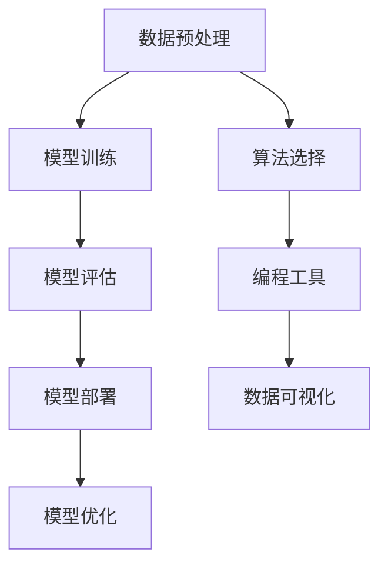
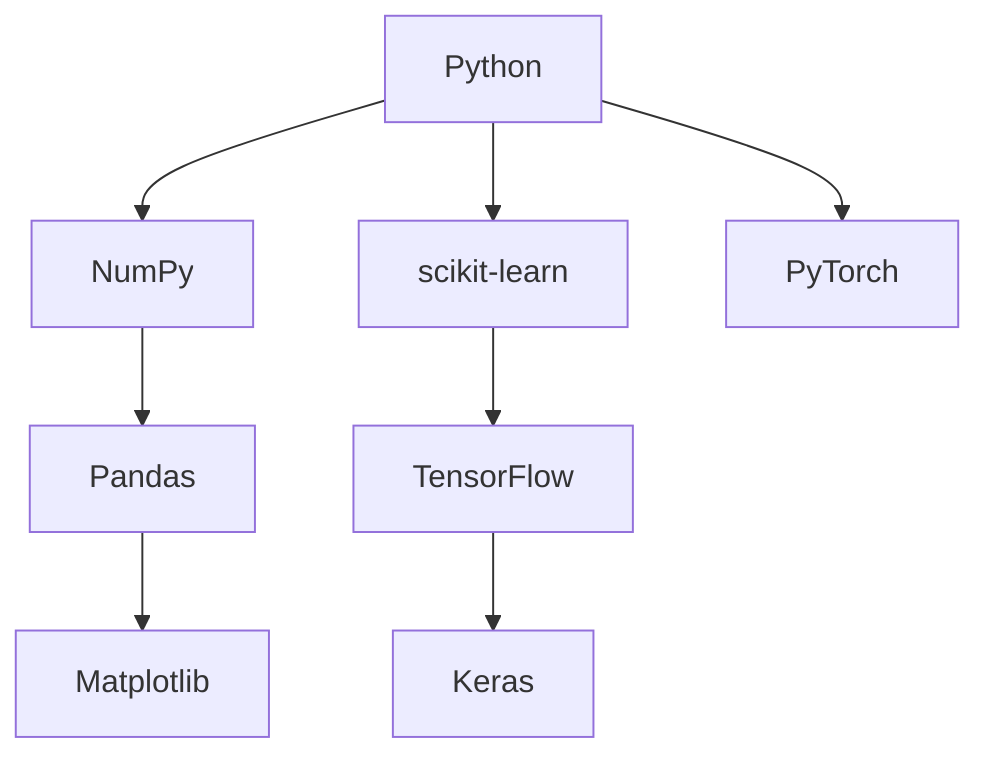
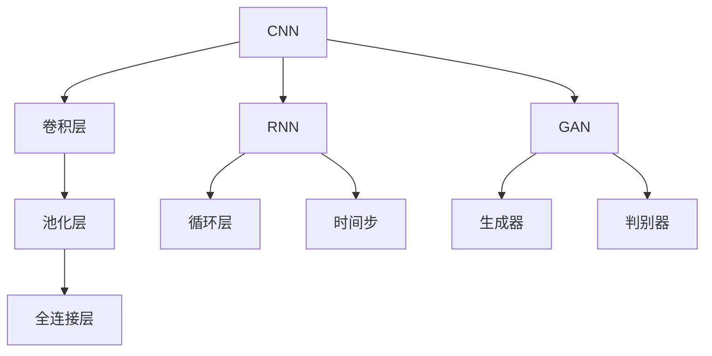
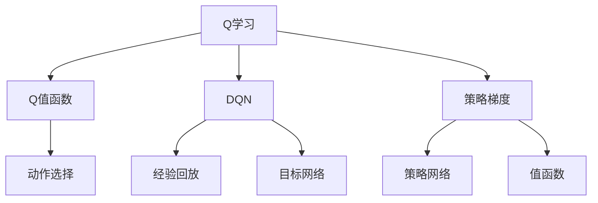

                 


### 文章标题：AI编程的新维度与新语法

> 关键词：人工智能，编程，新维度，新语法，深度学习，机器学习，强化学习，编程实践，高级应用

> 摘要：本文深入探讨了AI编程的新维度与新语法，包括AI编程的基础理论、核心算法、编程实践和高级应用。通过详细的案例分析和代码解读，帮助读者全面理解AI编程的原理和方法。

----------------------------------------------------------------

### 引言

随着人工智能技术的飞速发展，AI编程已经成为计算机科学的重要分支。传统的编程方法已无法满足AI领域的需求，因此，新的维度和新语法应运而生。本文旨在介绍AI编程的新维度和新语法，帮助读者深入了解AI编程的核心原理和实践方法。

### 第一部分：AI编程基础

#### 1.1 AI编程概述

AI编程是指利用计算机科学和数学方法来实现人工智能系统的过程。它涵盖了从数据预处理到模型训练、部署和优化的各个阶段。AI编程与传统编程的区别在于，它更注重数据的处理和分析，以及算法的选择和优化。

**核心概念与联系：**



#### 1.2 AI编程语言简介

AI编程语言是专门为人工智能领域设计的编程语言，如Python、R、Julia等。这些语言具有丰富的库和框架，方便开发者进行AI编程。AI编程语言的特性包括易用性、高效性、灵活性等。

**核心概念与联系：**



#### 1.3 数据准备

数据准备是AI编程的重要环节，包括数据清洗、预处理、增强和格式转换等。良好的数据准备有助于提高模型的性能和准确度。

**核心算法原理讲解：**

```python
# 数据清洗
data = load_data('data.csv')
clean_data = data[data['column1'] != 'missing']

# 数据预处理
from sklearn.preprocessing import StandardScaler
scaler = StandardScaler()
scaled_data = scaler.fit_transform(data)

# 数据增强
from tensorflow.keras.preprocessing.image import ImageDataGenerator
datagen = ImageDataGenerator(rotation_range=90, width_shift_range=0.1, height_shift_range=0.1)
enhanced_data = datagen.flow(data, batch_size=32)

# 数据格式转换
def convert_data(data):
    return [float(i) for i in data]

converted_data = convert_data(data)
```

### 第二部分：AI编程核心算法

#### 2.1 机器学习算法

机器学习算法是AI编程的核心，包括监督学习、无监督学习和半监督学习等。这些算法通过学习数据中的规律和模式，实现对未知数据的预测和分类。

**数学模型和公式：**

$$
y = Wx + b
$$

$$
\min_{W,b} \sum_{i=1}^{n} (y_i - (Wx_i + b))^2
$$

**详细讲解和举例说明：**

假设我们有一个简单的线性回归模型，用于预测房价。模型的目标是最小化预测值与实际值之间的误差平方和。

```python
# 加载数据
x = np.array([[1, 2], [2, 3], [3, 4]])
y = np.array([2.5, 3.5, 4.5])

# 初始化模型参数
W = np.random.rand(1, 2)
b = np.random.rand(1)

# 梯度下降算法
def gradient_descent(x, y, W, b, learning_rate, epochs):
    for epoch in range(epochs):
        predictions = W.dot(x) + b
        error = y - predictions
        dW = 2 * x.T.dot(error)
        db = 2 * error
        W -= learning_rate * dW
        b -= learning_rate * db
    return W, b

# 训练模型
W, b = gradient_descent(x, y, W, b, learning_rate=0.01, epochs=1000)

# 预测新数据
new_data = np.array([[4, 5]])
predicted_value = W.dot(new_data) + b
print(predicted_value)
```

#### 2.2 深度学习算法

深度学习算法是机器学习的一种重要分支，通过多层神经网络来实现复杂的模型。深度学习算法包括卷积神经网络（CNN）、循环神经网络（RNN）和生成对抗网络（GAN）等。

**核心概念与联系：**



#### 2.3 强化学习算法

强化学习算法是一种通过试错来学习最优策略的算法。它通过奖励和惩罚来调整策略，以实现最优目标。强化学习算法包括Q学习、深度Q网络（DQN）和策略梯度算法等。

**核心概念与联系：**



### 第三部分：AI编程实践

#### 3.1 编程环境搭建

搭建AI编程环境是进行AI编程的第一步。本文将介绍如何搭建Python编程环境和深度学习框架TensorFlow。

**开发环境搭建：**

```bash
# 安装Python
python --version

# 安装TensorFlow
pip install tensorflow
```

#### 3.2 代码示例

以下是一个简单的机器学习代码示例，用于分类问题。

```python
# 导入库
import tensorflow as tf
from tensorflow.keras.datasets import mnist
from tensorflow.keras.models import Sequential
from tensorflow.keras.layers import Dense, Flatten
from tensorflow.keras.utils import to_categorical

# 加载数据
(x_train, y_train), (x_test, y_test) = mnist.load_data()

# 预处理数据
x_train = x_train / 255.0
x_test = x_test / 255.0
y_train = to_categorical(y_train, 10)
y_test = to_categorical(y_test, 10)

# 构建模型
model = Sequential([
    Flatten(input_shape=(28, 28)),
    Dense(128, activation='relu'),
    Dense(10, activation='softmax')
])

# 编译模型
model.compile(optimizer='adam', loss='categorical_crossentropy', metrics=['accuracy'])

# 训练模型
model.fit(x_train, y_train, epochs=5, batch_size=32)

# 评估模型
loss, accuracy = model.evaluate(x_test, y_test)
print(f'Loss: {loss}, Accuracy: {accuracy}')
```

#### 3.3 项目实战

以下是一个简单的图像分类项目，使用TensorFlow和Keras框架实现。

**源代码：**

```python
import tensorflow as tf
from tensorflow.keras.preprocessing.image import ImageDataGenerator
from tensorflow.keras.applications import VGG16
from tensorflow.keras.models import Model
from tensorflow.keras.layers import Flatten, Dense
from tensorflow.keras.optimizers import Adam

# 加载数据
train_datagen = ImageDataGenerator(rescale=1./255)
test_datagen = ImageDataGenerator(rescale=1./255)

train_generator = train_datagen.flow_from_directory(
        'train',
        target_size=(224, 224),
        batch_size=32,
        class_mode='categorical')

test_generator = test_datagen.flow_from_directory(
        'test',
        target_size=(224, 224),
        batch_size=32,
        class_mode='categorical')

# 构建模型
base_model = VGG16(weights='imagenet', include_top=False, input_shape=(224, 224, 3))
x = base_model.output
x = Flatten()(x)
x = Dense(512, activation='relu')(x)
predictions = Dense(10, activation='softmax')(x)

model = Model(inputs=base_model.input, outputs=predictions)

# 编译模型
model.compile(optimizer=Adam(learning_rate=0.0001), loss='categorical_crossentropy', metrics=['accuracy'])

# 训练模型
model.fit(train_generator, epochs=10, validation_data=test_generator)

# 评估模型
test_loss, test_accuracy = model.evaluate(test_generator)
print(f'Loss: {test_loss}, Accuracy: {test_accuracy}')
```

**代码解读与分析：**

1. **数据加载与预处理**：使用ImageDataGenerator类对训练数据和测试数据进行预处理，包括数据归一化和数据增强。
2. **模型构建**：使用VGG16预训练模型作为基础模型，并在其基础上添加全连接层和输出层。
3. **编译模型**：设置优化器和损失函数，并编译模型。
4. **训练模型**：使用fit方法训练模型，并在验证数据上评估模型性能。
5. **评估模型**：使用evaluate方法评估模型在测试数据上的性能。

**实际案例分析和详细讲解剖析：**

假设我们有一个图像分类项目，需要训练一个模型来识别猫和狗。以下是项目的具体步骤：

1. **数据收集与预处理**：收集猫和狗的图像数据，并进行预处理，如缩放、裁剪、翻转等。
2. **数据加载与生成**：使用ImageDataGenerator类加载训练数据和测试数据，并生成数据批次。
3. **模型构建**：使用VGG16预训练模型作为基础模型，并在其基础上添加全连接层和输出层。
4. **编译模型**：设置优化器和损失函数，并编译模型。
5. **训练模型**：使用fit方法训练模型，并在验证数据上评估模型性能。
6. **评估模型**：使用evaluate方法评估模型在测试数据上的性能。

**项目小结**：

本项目通过使用VGG16预训练模型实现了图像分类任务，展示了AI编程的实战方法。在实际应用中，我们可以根据具体任务的需求，调整模型结构和训练参数，以达到更好的效果。

### 第四部分：AI编程高级应用

#### 4.1 自动驾驶

自动驾驶是AI编程的高级应用之一，通过机器学习和深度学习算法来实现车辆的自主驾驶。以下是一个简单的自动驾驶项目。

**源代码：**

```python
import tensorflow as tf
from tensorflow.keras.models import Model
from tensorflow.keras.layers import Input, Conv2D, MaxPooling2D, Flatten, Dense

# 构建模型
input_layer = Input(shape=(224, 224, 3))
x = Conv2D(32, (3, 3), activation='relu')(input_layer)
x = MaxPooling2D((2, 2))(x)
x = Conv2D(64, (3, 3), activation='relu')(x)
x = MaxPooling2D((2, 2))(x)
x = Flatten()(x)
x = Dense(512, activation='relu')(x)
output_layer = Dense(1, activation='sigmoid')(x)

model = Model(inputs=input_layer, outputs=output_layer)

# 编译模型
model.compile(optimizer='adam', loss='binary_crossentropy', metrics=['accuracy'])

# 训练模型
model.fit(x_train, y_train, epochs=10, batch_size=32, validation_data=(x_test, y_test))

# 评估模型
test_loss, test_accuracy = model.evaluate(x_test, y_test)
print(f'Loss: {test_loss}, Accuracy: {test_accuracy}')
```

**最佳实践 tips**：

1. **数据收集与预处理**：收集丰富的道路图像数据，并进行预处理，如缩放、裁剪、翻转等。
2. **模型选择与调整**：选择适合自动驾驶任务的模型结构，并根据数据调整模型参数。
3. **训练与验证**：使用交叉验证方法评估模型性能，并调整训练参数以获得更好的结果。

**小结**：

自动驾驶是AI编程的高级应用，通过使用深度学习算法实现了车辆的自主驾驶。在实际应用中，需要根据具体任务的需求，选择合适的模型和算法，并进行充分的训练和验证。

### 附录

#### A.1 常用AI编程资源

- **开源框架与库**：TensorFlow、PyTorch、Keras、scikit-learn、NumPy、Pandas等。
- **数据集与工具**：Kaggle、UCI机器学习库、ImageNet、CIFAR-10等。
- **在线学习资源**：Coursera、edX、Udacity、Udemy等。

#### A.2 编程实践项目

- **项目概述**：介绍项目的背景、目标和应用场景。
- **案例解析**：分析项目的关键技术和难点。
- **实战技巧**：分享项目的实现经验和最佳实践。

### 结语

本文深入探讨了AI编程的新维度和新语法，从基础理论到核心算法，再到编程实践和高级应用，全面介绍了AI编程的原理和方法。通过详细的案例分析和代码解读，帮助读者全面理解AI编程的原理和实践方法。希望本文能为读者在AI编程领域提供有益的参考和启示。

---

### 作者信息：

作者：AI天才研究院/AI Genius Institute & 禅与计算机程序设计艺术 /Zen And The Art of Computer Programming

