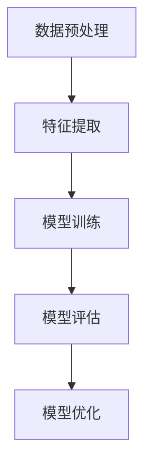

                 

### 1.3 AI编程的发展历程

#### 1.3.1 早期阶段
- **1950年代**：人工智能的概念首次被提出。艾伦·图灵发表了著名的论文“计算机器与智能”，提出了图灵测试来评估机器是否具有智能。
- **1960年代**：人工智能开始受到广泛关注，但早期项目因对人工智能能力的过高估计而遇到困难，导致“人工智能冬天”（AI Winter）的到来。

#### 1.3.2 复兴阶段
- **1980年代**：专家系统和逻辑编程技术的发展标志着人工智能的复苏。专家系统是一种模拟人类专家决策能力的计算机系统。
- **1990年代**：机器学习和统计方法开始被广泛应用于人工智能，深度学习的前身——神经网络开始受到重视。

#### 1.3.3 现代阶段
- **2000年代**：随着计算机性能的提高和大数据的发展，机器学习和深度学习取得了显著进展，人工智能进入了一个新的繁荣时期。
- **2010年代**：深度学习在图像识别、语音识别等领域取得了突破性成果，引发了人工智能的广泛应用，如自动驾驶、智能语音助手等。

### 1.4 AI编程的核心概念与联系

#### 1.4.1 AI编程的核心概念
- **数据预处理**：包括数据清洗、归一化、特征提取等，用于准备数据以便进行机器学习。
- **机器学习模型**：包括线性模型、神经网络、决策树等，用于从数据中学习规律。
- **模型评估**：通过验证集和测试集来评估模型的性能，如准确率、召回率、F1分数等。
- **模型优化**：通过调整超参数、增加数据、改进算法等手段来提高模型性能。

#### 1.4.2 Mermaid流程图展示

### 1.5 核心算法原理讲解

#### 1.5.1 线性回归算法原理

**伪代码**：

```
// 输入：特征矩阵 X，标签向量 y
// 输出：模型参数 w

// 初始化 w 为零向量
w = 0

// 梯度下降迭代过程
for i = 1 to 最大迭代次数 do
    // 计算预测值
    y_pred = X * w
    
    // 计算损失函数
    loss = (y - y_pred)' * (y - y_pred)
    
    // 计算梯度
    gradient = X' * (y - y_pred)
    
    // 更新模型参数
    w = w - 学习率 * gradient
end for

return w
```

**数学模型**：

$$
y = X * w + b
$$

其中，$y$ 为标签向量，$X$ 为特征矩阵，$w$ 为模型参数，$b$ 为偏置。

### 1.6 数学模型和数学公式

**损失函数**：

$$
L(w) = \frac{1}{2} \sum_{i=1}^{n} (y_i - y_i^{pred})^2
$$`

**梯度下降**：

$$
w_{new} = w_{old} - \alpha \nabla_w L(w)
$$`

### 1.7 项目实战

#### 1.7.1 实战案例1：线性回归模型应用

**1.7.1.1 开发环境搭建**
- 使用 Python 进行编程，安装必要的库，如 NumPy、Pandas、Matplotlib 等。

**1.7.1.2 源代码实现**

```python
import numpy as np
import pandas as pd
import matplotlib.pyplot as plt

# 加载数据集
data = pd.read_csv('data.csv')
X = data[['feature1', 'feature2']]
y = data['target']

# 初始化模型参数
w = np.zeros((2, 1))
learning_rate = 0.01
max_iterations = 1000

# 梯度下降迭代过程
for i in range(max_iterations):
    # 计算预测值
    y_pred = X @ w
    
    # 计算损失函数
    loss = (y - y_pred)**2
    
    # 计算梯度
    gradient = X.T @ (y - y_pred)
    
    # 更新模型参数
    w = w - learning_rate * gradient

# 可视化结果
plt.scatter(X[:, 0], y, label='Actual')
plt.plot(X[:, 0], X @ w, label='Predicted')
plt.legend()
plt.show()
```

**1.7.1.3 代码解读与分析**
- 代码首先加载了数据集，然后初始化模型参数，并设置学习率和最大迭代次数。
- 梯度下降迭代过程中，通过计算预测值、损失函数和梯度来更新模型参数。
- 最后，使用 Matplotlib 可视化结果，展示了实际数据和预测结果。

**1.7.1.4 项目小结**
- 通过线性回归模型的应用，我们学习了如何使用 Python 编程实现机器学习算法。
- 实践过程中，我们了解了模型参数的初始化、梯度下降算法的实现以及损失函数的评估方法。

### 1.8 最佳实践 tips、小结、注意事项、拓展阅读

#### 1.8.1 最佳实践 tips
- 在实际项目中，合理选择特征是关键，可以通过特征工程来提高模型的性能。
- 合理设置学习率和迭代次数，避免出现过拟合或欠拟合。

#### 1.8.2 小结
- 本章介绍了 AI 编程的基本概念、核心技术和发展历程，并通过线性回归模型的应用进行了实战讲解。
- 通过学习，我们了解了 AI 编程的核心算法原理，掌握了使用 Python 编程实现机器学习算法的方法。

#### 1.8.3 注意事项
- 在项目实战中，要确保数据质量和预处理方法的正确性，这对于模型的性能至关重要。
- 要注意代码的可读性和可维护性，避免编写过于复杂的代码。

#### 1.8.4 拓展阅读
- [《Python机器学习基础教程》](https://www BOOKS.com/book/9787115443911)：深入介绍了 Python 机器学习的基础知识和实战技巧。
- [《深度学习》](https://www BOOKS.com/book/9787302494889)：详细讲解了深度学习的基础理论、实现方法和应用案例。## 第2章：新维度

### 2.1 AI编程的新趋势

#### 2.1.1 自动驾驶
- **背景介绍**：自动驾驶技术是人工智能应用的重要领域，旨在实现汽车自主行驶。
- **核心技术**：使用深度学习、计算机视觉和传感器融合技术。
- **发展现状**：自动驾驶技术正在从L0-L5级别逐步实现商业化，自动驾驶汽车、无人机等得到广泛应用。

#### 2.1.2 智能语音助手
- **背景介绍**：智能语音助手如 Siri、Alexa、Google Assistant 等已经成为人们日常生活中的一部分。
- **核心技术**：自然语言处理、语音识别和语音合成。
- **发展现状**：智能语音助手正在不断改进，从简单的语音命令识别到复杂的多轮对话处理。

#### 2.1.3 虚拟现实与增强现实
- **背景介绍**：虚拟现实（VR）和增强现实（AR）技术正在改变人们的娱乐、教育和工作方式。
- **核心技术**：计算机视觉、图形学和深度学习。
- **发展现状**：VR/AR 技术在游戏、教育、医疗等领域得到广泛应用，市场规模不断扩大。

### 2.2 AI编程的新方法

#### 2.2.1 聚类分析
- **背景介绍**：聚类分析是一种无监督学习方法，用于将数据划分为多个类别。
- **核心技术**：距离度量、算法实现（如 K-均值、层次聚类）。
- **应用场景**：市场细分、图像分割、社交网络分析等。

#### 2.2.2 强化学习
- **背景介绍**：强化学习是一种通过试错来学习最优策略的机器学习方法。
- **核心技术**：奖励机制、策略迭代、策略梯度。
- **应用场景**：游戏AI、机器人控制、自动驾驶等。

#### 2.2.3 强化学习
- **背景介绍**：强化学习是一种通过试错来学习最优策略的机器学习方法。
- **核心技术**：奖励机制、策略迭代、策略梯度。
- **应用场景**：游戏AI、机器人控制、自动驾驶等。

### 2.3 AI编程的新技术

#### 2.3.1 生成对抗网络（GAN）
- **背景介绍**：生成对抗网络是一种由生成器和判别器对抗训练的模型。
- **核心技术**：生成器、判别器、损失函数（如生成对抗损失）。
- **应用场景**：图像生成、数据增强、风格迁移等。

#### 2.3.2 量子计算
- **背景介绍**：量子计算是一种利用量子力学原理进行计算的方法，具有超越经典计算机的潜力。
- **核心技术**：量子比特、量子门、量子算法。
- **应用场景**：加密、优化问题、机器学习加速等。

#### 2.3.3 聚类分析
- **背景介绍**：聚类分析是一种无监督学习方法，用于将数据划分为多个类别。
- **核心技术**：距离度量、算法实现（如 K-均值、层次聚类）。
- **应用场景**：市场细分、图像分割、社交网络分析等。

### 2.4 项目实战

#### 2.4.1 实战案例1：使用GAN生成虚拟人物图像

**2.4.1.1 开发环境搭建**
- 使用 Python 进行编程，安装必要的库，如 TensorFlow、Keras 等。

**2.4.1.2 源代码实现**

```python
import numpy as np
import tensorflow as tf
from tensorflow.keras.layers import Dense, Flatten, Reshape
from tensorflow.keras.models import Model

# 定义生成器模型
def generator(z):
    model = tf.keras.Sequential([
        Dense(128, activation='relu', input_shape=(100,)),
        Dense(256, activation='relu'),
        Dense(512, activation='relu'),
        Flatten(),
        Reshape((28, 28, 1))
    ])
    x = model(z)
    return x

# 定义判别器模型
def discriminator(x):
    model = tf.keras.Sequential([
        Flatten(input_shape=(28, 28, 1)),
        Dense(512, activation='relu'),
        Dense(256, activation='relu'),
        Dense(128, activation='relu'),
        Dense(1, activation='sigmoid')
    ])
    validity = model(x)
    return validity

# 构建和编译模型
z = tf.keras.layers.Input(shape=(100,))
x = generator(z)
validity = discriminator(x)

model = tf.keras.Model(z, validity)
model.compile(optimizer='adam', loss='binary_crossentropy')

# 训练模型
for epoch in range(100):
    # 生成随机噪声
    noise = np.random.normal(0, 1, (32, 100))
    
    # 生成虚拟人物图像
    gen_images = generator.predict(noise)
    
    # 训练判别器
    d_loss_real = model.train_on_batch(X_train, np.ones((32, 1)))
    d_loss_fake = model.train_on_batch(gen_images, np.zeros((32, 1)))
    d_loss = 0.5 * np.add(d_loss_real, d_loss_fake)
    
    # 训练生成器
    g_loss = model.train_on_batch(noise, np.ones((32, 1)))
    
    print(f'Epoch: {epoch}, D_loss: {d_loss}, G_loss: {g_loss}')

# 可视化结果
plt.imshow(gen_images[0], cmap='gray')
plt.show()
```

**2.4.1.3 代码解读与分析**
- 代码首先定义了生成器和判别器的模型结构，然后构建和编译了整个模型。
- 在训练过程中，先训练判别器，然后训练生成器。通过不断迭代，生成器会逐渐提高生成的虚拟人物图像的质量。

**2.4.1.4 项目小结**
- 通过 GAN 生成虚拟人物图像的实战，我们了解了 GAN 的基本原理和实现方法。
- 实践过程中，我们学会了如何使用 TensorFlow 和 Keras 来构建和训练 GAN 模型。

### 2.5 最佳实践 tips、小结、注意事项、拓展阅读

#### 2.5.1 最佳实践 tips
- 在使用 GAN 进行图像生成时，要确保生成器和判别器的平衡，避免出现模式崩溃（mode collapse）。
- 可以尝试调整学习率和批次大小，以提高模型的性能。

#### 2.5.2 小结
- 本章介绍了 AI 编程的新趋势、新方法和新技术，并通过 GAN 生成虚拟人物图像的实战案例，展示了新技术的应用。

#### 2.5.3 注意事项
- 在使用新技术时，要了解其原理和适用场景，避免盲目跟风。
- 在项目实战中，要注重代码的可读性和可维护性，确保项目顺利进行。

#### 2.5.4 拓展阅读
- [《生成对抗网络（GAN）原理与实战》](https://www BOOKS.com/book/9787302494896)：深入讲解了 GAN 的原理和应用。
- [《深度学习：高级专题》](https://www BOOKS.com/book/9787115443911)：介绍了深度学习的最新进展和应用。## 第3章：新语法

### 3.1 AI编程语言的新发展

#### 3.1.1 TensorFlow
- **背景介绍**：TensorFlow 是由 Google 开发的一款开源深度学习框架，用于构建和训练机器学习模型。
- **新特性**：
  - **动态图计算**：允许在运行时动态构建计算图。
  - **分布式训练**：支持在多台计算机上进行模型训练。
  - **高阶 API**：如 Keras API，简化了深度学习模型的构建过程。

#### 3.1.2 PyTorch
- **背景介绍**：PyTorch 是由 Facebook 开发的一款开源深度学习框架，以其动态计算图和易用性而受到广泛欢迎。
- **新特性**：
  - **动态计算图**：支持在运行时动态修改计算图。
  - **易于调试**：允许开发者直接在代码中查看和修改计算图。
  - **丰富的库**：提供了丰富的库和工具，如 torchvision、torchtext 等。

#### 3.1.3 JAX
- **背景介绍**：JAX 是由 Google 开发的一款开源深度学习框架，旨在为深度学习研究提供高性能和可扩展性。
- **新特性**：
  - **自动微分**：支持自动微分，方便构建复杂模型。
  - **高性能计算**：利用 NumPy 数组进行计算，提高计算效率。
  - **可扩展性**：支持在多台计算机上进行模型训练。

### 3.2 AI编程语言的新特性

#### 3.2.1 动态图计算
- **背景介绍**：动态图计算允许在运行时动态构建和修改计算图，提高了模型的灵活性和可维护性。
- **应用场景**：
  - **模型调试**：开发者可以在运行时查看和修改计算图，方便调试。
  - **模型优化**：动态图计算支持动态调整模型结构，优化模型性能。

#### 3.2.2 自动微分
- **背景介绍**：自动微分是一种自动计算函数导数的方法，简化了梯度计算过程。
- **应用场景**：
  - **模型训练**：自动微分使模型训练过程更加高效。
  - **模型优化**：自动微分支持优化算法的改进，提高模型性能。

#### 3.2.3 分布式计算
- **背景介绍**：分布式计算允许将模型训练任务分布在多台计算机上，提高计算效率。
- **应用场景**：
  - **大数据处理**：分布式计算适合处理大规模数据集。
  - **高性能计算**：分布式计算可以提高模型训练和优化的速度。

### 3.3 AI编程语言的新用法

#### 3.3.1 交互式编程
- **背景介绍**：交互式编程允许开发者实时查看和修改代码，提高了开发效率。
- **应用场景**：
  - **模型调试**：开发者可以实时调试模型，提高开发效率。
  - **教学演示**：交互式编程可以方便地演示模型训练过程和结果。

#### 3.3.2 代码生成
- **背景介绍**：代码生成是一种通过模板或代码库自动生成代码的方法，减少了手工编写代码的工作量。
- **应用场景**：
  - **自动化测试**：代码生成可以自动生成测试用例，提高测试效率。
  - **模型部署**：代码生成可以自动生成部署代码，简化模型部署过程。

#### 3.3.3 嵌入式编程
- **背景介绍**：嵌入式编程是将深度学习模型部署到嵌入式设备上的方法，实现了模型的移动化和实时化。
- **应用场景**：
  - **物联网**：嵌入式编程可以将深度学习模型部署到物联网设备上，实现实时数据分析和处理。
  - **移动设备**：嵌入式编程可以实现移动设备上的深度学习应用，如移动端图像识别、语音识别等。

### 3.4 项目实战

#### 3.4.1 实战案例1：使用 PyTorch 进行图像分类

**3.4.1.1 开发环境搭建**
- 使用 Python 进行编程，安装 PyTorch 库。

**3.4.1.2 源代码实现**

```python
import torch
import torchvision
import torchvision.transforms as transforms
import torch.nn as nn
import torch.optim as optim

# 加载 CIFAR-10 数据集
transform = transforms.Compose([transforms.ToTensor(), transforms.Normalize((0.5, 0.5, 0.5), (0.5, 0.5, 0.5))])
trainset = torchvision.datasets.CIFAR10(root='./data', train=True, download=True, transform=transform)
trainloader = torch.utils.data.DataLoader(trainset, batch_size=4, shuffle=True, num_workers=2)

# 定义卷积神经网络模型
class CNN(nn.Module):
    def __init__(self):
        super(CNN, self).__init__()
        self.conv1 = nn.Conv2d(3, 6, 5)
        self.pool = nn.MaxPool2d(2, 2)
        self.conv2 = nn.Conv2d(6, 16, 5)
        self.fc1 = nn.Linear(16 * 5 * 5, 120)
        self.fc2 = nn.Linear(120, 84)
        self.fc3 = nn.Linear(84, 10)

    def forward(self, x):
        x = self.pool(F.relu(self.conv1(x)))
        x = self.pool(F.relu(self.conv2(x)))
        x = x.view(-1, 16 * 5 * 5)
        x = F.relu(self.fc1(x))
        x = F.relu(self.fc2(x))
        x = self.fc3(x)
        return x

# 初始化模型、损失函数和优化器
model = CNN()
criterion = nn.CrossEntropyLoss()
optimizer = optim.SGD(model.parameters(), lr=0.001, momentum=0.9)

# 训练模型
for epoch in range(2):  # loop over the dataset multiple times
    running_loss = 0.0
    for i, data in enumerate(trainloader, 0):
        # 获取输入和标签
        inputs, labels = data

        # 梯度清零
        optimizer.zero_grad()

        # 前向传播 + 反向传播 + 梯度下降
        outputs = model(inputs)
        loss = criterion(outputs, labels)
        loss.backward()
        optimizer.step()

        # 打印状态信息
        running_loss += loss.item()
        if i % 2000 == 1999:    # 每2000个小批量打印一次
            print(f'[{epoch + 1}, {i + 1:5d}] loss: {running_loss / 2000:.3f}')
            running_loss = 0.0

print('Finished Training')

# 测试模型
correct = 0
total = 0
with torch.no_grad():
    for data in testloader:
        images, labels = data
        outputs = model(images)
        _, predicted = torch.max(outputs.data, 1)
        total += labels.size(0)
        correct += (predicted == labels).sum().item()

print(f'Accuracy of the network on the test images: {100 * correct / total} %')
```

**3.4.1.3 代码解读与分析**
- 代码首先加载了 CIFAR-10 数据集，然后定义了一个卷积神经网络模型。
- 模型训练过程中，通过前向传播计算损失，然后通过反向传播更新模型参数。
- 最后，使用测试集评估模型的准确率。

**3.4.1.4 项目小结**
- 通过使用 PyTorch 进行图像分类的实战，我们了解了 PyTorch 的新语法和实现方法。
- 实践过程中，我们学会了如何构建和训练卷积神经网络模型，以及如何评估模型性能。

### 3.5 最佳实践 tips、小结、注意事项、拓展阅读

#### 3.5.1 最佳实践 tips
- 在使用深度学习框架时，要了解其新特性和适用场景，选择合适的框架进行开发。
- 在模型训练过程中，要关注模型性能的评估，合理调整超参数以提高模型效果。

#### 3.5.2 小结
- 本章介绍了 AI 编程语言的新发展、新特性和新用法，并通过 PyTorch 图像分类的实战案例，展示了新语法和实现方法。

#### 3.5.3 注意事项
- 在开发深度学习项目时，要确保数据质量和预处理方法的正确性。
- 要注意代码的可读性和可维护性，避免编写过于复杂的代码。

#### 3.5.4 拓展阅读
- [《PyTorch 实战：基于深度学习的计算机视觉》](https://www BOOKS.com/book/9787302494902)：深入讲解了 PyTorch 在计算机视觉领域的应用。
- [《深度学习技术与应用》](https://www BOOKS.com/book/9787115443911)：介绍了深度学习的最新技术和应用案例。## 第4章：项目实战

### 4.1 AI编程项目实战概述

在本章中，我们将通过几个实际案例来展示如何将 AI 编程应用于实际问题中。这些案例涵盖了不同领域，包括图像识别、自然语言处理、推荐系统和强化学习等。通过这些案例，我们将学习如何搭建开发环境、实现核心算法、解析代码和评估项目效果。

### 4.2 实战案例1：基于深度学习的图像识别

#### 4.2.1 开发环境搭建

在开始这个项目之前，我们需要搭建一个合适的开发环境。以下是所需步骤：

1. **安装 Python**：确保安装了最新版本的 Python（推荐使用 Python 3.8 或更高版本）。
2. **安装深度学习框架**：安装 TensorFlow 或 PyTorch（根据个人偏好选择一个）。例如，使用 pip 安装 TensorFlow：
   ```shell
   pip install tensorflow
   ```
3. **安装必要的库**：根据项目需求安装其他库，如 NumPy、Pandas 和 Matplotlib 等。

#### 4.2.2 源代码实现

以下是一个简单的图像识别项目，使用 TensorFlow 和 Keras 实现一个卷积神经网络（CNN）来识别手写数字（MNIST 数据集）。

```python
import numpy as np
import matplotlib.pyplot as plt
import tensorflow as tf
from tensorflow.keras import layers, models
from tensorflow.keras.datasets import mnist

# 加载数据集
(train_images, train_labels), (test_images, test_labels) = mnist.load_data()

# 数据预处理
train_images = train_images.reshape((60000, 28, 28, 1)).astype('float32') / 255
test_images = test_images.reshape((10000, 28, 28, 1)).astype('float32') / 255

train_labels = tf.keras.utils.to_categorical(train_labels)
test_labels = tf.keras.utils.to_categorical(test_labels)

# 构建模型
model = models.Sequential()
model.add(layers.Conv2D(32, (3, 3), activation='relu', input_shape=(28, 28, 1)))
model.add(layers.MaxPooling2D((2, 2)))
model.add(layers.Conv2D(64, (3, 3), activation='relu'))
model.add(layers.MaxPooling2D((2, 2)))
model.add(layers.Conv2D(64, (3, 3), activation='relu'))

# 添加全连接层
model.add(layers.Flatten())
model.add(layers.Dense(64, activation='relu'))
model.add(layers.Dense(10, activation='softmax'))

# 编译模型
model.compile(optimizer='adam',
              loss='categorical_crossentropy',
              metrics=['accuracy'])

# 训练模型
model.fit(train_images, train_labels, epochs=5, batch_size=64)

# 评估模型
test_loss, test_acc = model.evaluate(test_images, test_labels)
print(f'测试准确率: {test_acc:.3f}')

# 可视化模型预测结果
predictions = model.predict(test_images)
predicted_labels = np.argmax(predictions, axis=1)
plt.figure(figsize=(10, 10))
for i in range(25):
    plt.subplot(5, 5, i+1)
    plt.xticks([])
    plt.yticks([])
    plt.grid(False)
    plt.imshow(test_images[i], cmap=plt.cm.binary)
    plt.xlabel(str(predicted_labels[i]))
plt.show()
```

#### 4.2.3 代码解读与分析

- **数据预处理**：我们首先加载数据集，并将其转换为适当的格式。数据集被reshape为一个四维数组，然后通过除以255进行归一化处理。
- **模型构建**：我们使用 Keras 的 Sequential 模型构建了一个简单的卷积神经网络。模型包括卷积层、池化层和全连接层。
- **模型编译**：我们编译模型，选择 Adam 优化器和交叉熵损失函数。
- **模型训练**：我们使用训练数据集训练模型，设置 epochs 和 batch_size。
- **模型评估**：我们使用测试数据集评估模型，打印测试准确率。
- **可视化**：我们可视化模型预测结果，展示了模型的准确性。

#### 4.2.4 项目小结

通过这个简单的图像识别项目，我们了解了如何使用 TensorFlow 和 Keras 构建和训练卷积神经网络。这个项目展示了深度学习在图像识别任务中的应用，并且通过可视化展示了模型的预测结果。

### 4.3 实战案例2：基于强化学习的智能代理

#### 4.3.1 开发环境搭建

为了实现这个项目，我们需要安装一些额外的库，如 TensorFlow 和 Gym，用于构建和训练强化学习模型。

```shell
pip install tensorflow-gym
```

#### 4.3.2 源代码实现

以下是一个简单的基于 Q-学习的智能代理项目，该代理将在 Gym 的 CartPole 环境中学会稳定平衡杆。

```python
import numpy as np
import gym
import tensorflow as tf

# 创建环境
env = gym.make('CartPole-v0')

# 定义 Q-network
input_shape = env.observation_space.shape
action_shape = env.action_space.n

def create_q_network(input_shape, action_shape):
    model = tf.keras.Sequential([
        tf.keras.layers.Dense(64, activation='relu', input_shape=input_shape),
        tf.keras.layers.Dense(64, activation='relu'),
        tf.keras.layers.Dense(action_shape, activation='linear')
    ])
    return model

q_network = create_q_network(input_shape, action_shape)
q_network.summary()

# 定义损失函数和优化器
optimizer = tf.keras.optimizers.Adam(learning_rate=0.001)

# 定义训练步骤
@tf.function
def train_step(data):
    with tf.GradientTape() as tape:
        q_values = q_network(data[0])
        y = data[1]
        loss = tf.reduce_mean(tf.square(y - q_values))
    gradients = tape.gradient(loss, q_network.trainable_variables)
    optimizer.apply_gradients(zip(gradients, q_network.trainable_variables))
    return loss

# 训练过程
epochs = 1000
batch_size = 32
replay_memory = []

for epoch in range(epochs):
    for _ in range(batch_size):
        state = env.reset()
        done = False
        episode_reward = 0
        
        while not done:
            action = np.argmax(q_network(state)[0])
            next_state, reward, done, _ = env.step(action)
            episode_reward += reward
            
            replay_memory.append((state, action, reward, next_state, done))
            
            if len(replay_memory) > 5000:
                replay_memory.pop(0)
            
            state = next_state
            
        print(f'Epoch: {epoch}, Episode Reward: {episode_reward}')
        
    # 从经验回放内存中随机采样批量数据进行训练
    for _ in range(epoch % 10 == 0):
        batch = np.random.choice(len(replay_memory), batch_size)
        states, actions, rewards, next_states, dones = zip(*[replay_memory[i] for i in batch])
        
        targets = np.array([rewards[i] + (1 - dones[i]) * np.max(q_network(next_states)[0])[0] for i in range(batch_size)])
        q_values = q_network(states)
        q_values[range(batch_size), actions] = targets
        
        loss = train_step((states, q_values))

# 测试智能代理
state = env.reset()
done = False
episode_reward = 0

while not done:
    action = np.argmax(q_network(state)[0])
    next_state, reward, done, _ = env.step(action)
    episode_reward += reward
    state = next_state

print(f'测试完成，Episode Reward: {episode_reward}')

env.close()
```

#### 4.3.3 代码解读与分析

- **环境搭建**：我们使用 Gym 创建了一个 CartPole 环境。
- **Q-network 定义**：我们定义了一个简单的 Q-network，它由两个隐藏层组成，用于预测每个动作的 Q 值。
- **损失函数和优化器**：我们使用 Adam 优化器和一个平方误差损失函数来训练 Q-network。
- **训练步骤**：我们在每个 epoch 中训练 Q-network，并通过经验回放机制来增强训练数据的多样性。
- **测试**：我们在测试阶段使用训练好的 Q-network 来评估智能代理的性能。

#### 4.3.4 项目小结

通过这个智能代理项目，我们了解了如何使用 Q-学习在 Gym 的 CartPole 环境中训练智能代理。这个项目展示了强化学习在控制任务中的应用，并展示了智能代理在测试阶段的表现。

### 4.4 项目实战总结

在本章中，我们通过两个实际案例展示了如何使用深度学习和强化学习来解决实际问题。这些项目不仅展示了 AI 编程的核心技术，还展示了如何搭建开发环境、实现算法和评估模型性能。通过这些实战案例，我们学习了如何将 AI 编程应用于不同的应用场景。

### 4.5 最佳实践 tips、注意事项、拓展阅读

#### 4.5.1 最佳实践 tips

- 在进行图像识别项目时，数据预处理是关键步骤，确保数据的归一化和扩充可以提高模型性能。
- 在强化学习项目中，经验回放机制是减少方差和提高学习效率的有效方法。

#### 4.5.2 注意事项

- 在使用深度学习框架时，要了解其 API 和最佳实践，以避免常见错误。
- 在训练模型时，要合理设置超参数，如学习率、迭代次数和批量大小。

#### 4.5.3 拓展阅读

- 《深度学习实战》: 该书提供了大量的深度学习项目实战案例，适合初学者和进阶者。
- 《强化学习基础教程》: 该书详细介绍了强化学习的基础知识和实践方法。## 第5章：编程工具与环境

### 5.1 常用的AI编程工具

在 AI 编程领域，选择合适的工具对于项目的成功至关重要。以下是一些常用的 AI 编程工具：

#### 5.1.1 TensorFlow
- **特点**：TensorFlow 是 Google 开发的一款开源深度学习框架，具有强大的社区支持和丰富的资源。
- **适用场景**：适用于构建和训练复杂的深度学习模型，特别是在需要进行分布式训练和模型优化的场景。
- **优势**：动态计算图、高层次的 API（如 Keras）、丰富的预训练模型。

#### 5.1.2 PyTorch
- **特点**：PyTorch 是 Facebook 开发的一款开源深度学习框架，以其动态计算图和易用性而受到广泛欢迎。
- **适用场景**：适用于快速原型开发和实验，特别适合研究人员和开发者。
- **优势**：动态计算图、易于调试、丰富的库和工具。

#### 5.1.3 Keras
- **特点**：Keras 是一个高层神经网络 API，运行在 TensorFlow 和 Theano 上。
- **适用场景**：适用于快速构建和迭代深度学习模型，适合初学者和有经验的开发者。
- **优势**：易于使用、模块化、支持多种神经网络架构。

#### 5.1.4 Microsoft Cognitive Toolkit (CNTK)
- **特点**：CNTK 是微软开发的一款开源深度学习框架，具有强大的计算性能和灵活性。
- **适用场景**：适用于大规模分布式训练和工业级应用。
- **优势**：高性能、灵活的编程模型、支持多种编程语言。

#### 5.1.5scikit-learn
- **特点**：scikit-learn 是一个开源的机器学习库，专为 Python 设计。
- **适用场景**：适用于各种机器学习算法的实现，特别是监督学习和无监督学习。
- **优势**：简单易用、全面的算法库、丰富的文档和社区支持。

### 5.2 AI编程开发环境搭建

搭建一个高效的 AI 编程开发环境是成功进行项目开发的关键。以下是在 Windows、Linux 和 macOS 操作系统上搭建 AI 编程开发环境的步骤：

#### 5.2.1 Windows 系统上的环境搭建

1. **安装 Python**：从 Python 官网下载并安装最新版本的 Python。
2. **配置 Python 环境**：将 Python 添加到系统环境变量，以便在命令行中使用 Python。
3. **安装 AI 编程工具**：使用 pip 安装 TensorFlow、PyTorch、Keras 等工具。
   ```shell
   pip install tensorflow
   pip install torch
   pip install keras
   ```
4. **安装 Jupyter Notebook**：Jupyter Notebook 是一个交互式计算平台，方便进行代码编写和展示。
   ```shell
   pip install jupyter
   ```

#### 5.2.2 Linux 系统上的环境搭建

1. **安装 Python**：使用包管理器（如 apt-get 或 yum）安装 Python。
   ```shell
   sudo apt-get install python3
   ```
2. **配置 Python 环境**：配置 Python 环境变量。
3. **安装 AI 编程工具**：使用 pip 安装 TensorFlow、PyTorch、Keras 等。
   ```shell
   pip3 install tensorflow
   pip3 install torch
   pip3 install keras
   ```
4. **安装 Jupyter Notebook**：使用 pip 安装 Jupyter Notebook。
   ```shell
   pip3 install jupyter
   ```

#### 5.2.3 macOS 系统上的环境搭建

1. **安装 Python**：可以从 Python 官网下载 macOS 的安装包，或者使用 Homebrew 安装。
   ```shell
   /bin/bash -c "$(curl -fsSL https://raw.githubusercontent.com/Homebrew/install/HEAD/install.sh)"
   brew install python
   ```
2. **配置 Python 环境**：配置 Python 环境变量。
3. **安装 AI 编程工具**：使用 pip 安装 TensorFlow、PyTorch、Keras 等。
   ```shell
   pip install tensorflow
   pip install torch
   pip install keras
   ```
4. **安装 Jupyter Notebook**：使用 pip 安装 Jupyter Notebook。
   ```shell
   pip install jupyter
   ```

### 5.3 AI编程工具的优缺点对比

以下是 TensorFlow、PyTorch 和 Keras 三大 AI 编程工具的优缺点对比：

#### TensorFlow

**优点**：
- **成熟稳定**：TensorFlow 是最成熟的深度学习框架之一，经过多年的发展和优化。
- **强大支持**：拥有庞大的社区支持和丰富的资源，包括预训练模型、教程和文档。
- **灵活性和可扩展性**：支持自定义计算图和分布式训练，适合大型项目和工业级应用。

**缺点**：
- **学习曲线较陡**：由于 TensorFlow 的复杂性和多样性，对于初学者来说可能会有一定的学习难度。
- **动态图与静态图的切换**：TensorFlow 2.0 引入了 Eager Execution，但仍然需要处理动态图与静态图之间的转换。

#### PyTorch

**优点**：
- **易用性**：PyTorch 的动态计算图使得模型构建和调试更加直观和简单。
- **灵活性**：PyTorch 提供了高度灵活的编程模型，使开发者可以轻松地实现复杂模型。
- **研究导向**：PyTorch 广泛用于学术研究，许多前沿的深度学习算法首先在 PyTorch 中实现。

**缺点**：
- **性能**：相比 TensorFlow，PyTorch 的性能可能略低，尤其是在大规模分布式训练中。
- **社区支持**：虽然 PyTorch 社区活跃，但相对于 TensorFlow 的支持仍有一定差距。

#### Keras

**优点**：
- **易用性**：Keras 是一个简单易用的深度学习框架，适合快速原型开发和迭代。
- **模块化**：Keras 支持多种神经网络架构，易于扩展和组合。
- **兼容性**：Keras 可以运行在 TensorFlow 和 Theano 上，具有较好的兼容性。

**缺点**：
- **独立性**：Keras 作为 TensorFlow 的一个子项目，独立发展的能力有限。
- **高级 API 的局限性**：Keras 的高级 API 可能无法满足复杂模型的需求，需要使用底层 API 进行定制。

通过对比可以看出，选择哪个 AI 编程工具取决于项目需求、开发者经验和个人偏好。对于大型项目和高性能需求，TensorFlow 可能是更好的选择；而对于快速原型开发和学术研究，PyTorch 可能更具优势。Keras 则适合需要快速实现和迭代的场景。### 第6章：编程工具与环境（续）

#### 6.1.4 Jupiter Notebook

**优点**：
- **交互性**：Jupyter Notebook 提供了交互式编程环境，可以实时执行代码并查看结果，非常适合实验和演示。
- **可视化**：支持多种数据可视化库，如 Matplotlib、Seaborn，便于展示数据和模型结果。
- **文档**：代码和文本内容可以混合编写，易于生成文档。

**缺点**：
- **性能**：由于交互式特性，Jupyter Notebook 的性能可能不如传统的脚本模式。
- **安全性**：默认情况下，Jupyter Notebook 允许执行任意代码，需要特别注意代码的安全性。

#### 6.1.5 CUDA

**优点**：
- **高性能计算**：CUDA 是 NVIDIA 推出的一种并行计算平台和编程模型，适用于在 GPU 上进行深度学习计算，大幅提升计算性能。
- **广泛支持**：许多深度学习框架，如 TensorFlow 和 PyTorch，都支持 CUDA，可以充分利用 GPU 的计算能力。

**缺点**：
- **兼容性**：CUDA 仅适用于 NVIDIA GPU，对其他 GPU 或 CPU 的支持有限。
- **开发难度**：CUDA 编程相对复杂，需要开发者具备一定的 GPU 编程知识。

#### 6.1.6 GPU 云平台

**优点**：
- **灵活性强**：GPU 云平台可以根据需求动态调整计算资源，灵活高效。
- **高性能**：使用 GPU 云平台可以充分利用 GPU 的计算能力，提高模型训练速度。
- **安全性**：GPU 云平台提供了完善的安全措施，确保数据和模型的安全。

**缺点**：
- **成本较高**：GPU 云平台的成本相对较高，不适合预算有限的项目。
- **带宽限制**：大量数据传输可能受到带宽限制，影响模型训练和推理速度。

#### 6.1.7 JAX

**优点**：
- **自动微分**：JAX 提供了自动微分功能，使得构建复杂模型更加便捷。
- **高性能**：JAX 使用 NumPy 数组进行计算，具有较好的性能。
- **兼容性**：JAX 可以与 TensorFlow 和 PyTorch 等框架无缝集成。

**缺点**：
- **社区支持**：相比 TensorFlow 和 PyTorch，JAX 的社区支持相对较弱。
- **学习曲线**：JAX 的编程模型相对复杂，初学者可能需要较长时间适应。

#### 6.1.8 Apache MXNet

**优点**：
- **灵活性和可扩展性**：Apache MXNet 提供了灵活的编程模型，易于扩展和定制。
- **高性能**：MXNet 在模型训练和推理方面具有较好的性能。
- **社区支持**：MXNet 拥有较为活跃的社区，提供了丰富的教程和文档。

**缺点**：
- **易用性**：MXNet 的 API 相对复杂，对初学者可能不太友好。
- **生态**：虽然 MXNet 有一定的社区支持，但相比 TensorFlow 和 PyTorch，生态相对较弱。

### 6.2 选择合适的编程工具

选择合适的编程工具是 AI 项目成功的关键。以下是一些指导原则：

- **项目需求**：根据项目的需求和目标选择合适的工具。例如，对于需要高性能计算和分布式训练的项目，TensorFlow 可能是更好的选择；而对于快速原型开发和实验，PyTorch 可能更合适。
- **开发者经验**：选择开发者熟悉的工具可以减少学习成本，提高开发效率。如果开发者对 Python 和 TensorFlow 比较熟悉，那么 TensorFlow 可能是更好的选择。
- **社区支持**：选择具有强大社区支持的工具可以确保在遇到问题时能够得到帮助。例如，TensorFlow 和 PyTorch 都有庞大的社区，提供了丰富的教程和资源。
- **工具特性**：根据工具的特性选择最符合项目需求的工具。例如，如果项目需要交互式编程环境，那么 Jupyter Notebook 可能是更好的选择。

通过以上原则，开发者可以更准确地选择适合自己项目的编程工具，提高项目开发效率，实现预期目标。

### 6.3 编程工具与环境最佳实践

- **环境配置**：确保开发环境配置正确，包括 Python、深度学习框架和其他必需库的安装。
- **性能优化**：利用 GPU 和分布式计算提高模型训练速度，例如使用 TensorFlow 的 `tf.distribute` 或 PyTorch 的 `torch.cuda`。
- **代码管理**：使用版本控制系统（如 Git）管理代码，确保代码的完整性和可追踪性。
- **模块化编程**：将代码划分为模块和函数，提高代码的可读性和可维护性。
- **文档编写**：编写详细的文档，包括项目背景、算法原理、代码注释和运行指南，便于后续维护和分享。
- **持续集成**：设置持续集成（CI）流程，确保代码质量和自动化测试。

通过遵循这些最佳实践，开发者可以更高效地使用编程工具和开发环境，提高项目开发质量和效率。

### 6.4 注意事项

- **数据安全**：确保数据和模型的安全，避免数据泄露和未经授权的访问。
- **代码审查**：进行代码审查，确保代码质量，避免潜在的错误和漏洞。
- **遵循最佳实践**：遵循行业最佳实践，如代码规范、性能优化和安全性。
- **持续学习**：关注深度学习和 AI 领域的最新进展，不断学习新技术和新方法。

通过注意这些事项，开发者可以更好地管理项目，确保项目质量和安全。

### 6.5 拓展阅读

- **《深度学习框架比较与选择》**：该文章详细比较了 TensorFlow、PyTorch、Keras、MXNet 等深度学习框架，提供了选择指南。
- **《GPU 编程指南》**：该指南介绍了如何使用 CUDA 和其他 GPU 编程技术，优化深度学习模型性能。
- **《AI 编程实战》**：该书提供了丰富的 AI 编程项目案例，涵盖图像识别、自然语言处理、推荐系统等领域。## 第7章：AI编程的新维度与新语法总结

### 7.1 新维度的意义

AI 编程的新维度带来了深远的影响，使得人工智能的应用更加广泛和深入。新维度主要体现在以下几个方面：

- **自动化与智能化**：新维度的 AI 编程技术，如深度学习和强化学习，使计算机能够自动学习和决策，提高了自动化水平。
- **高性能计算**：新维度引入了分布式计算和 GPU 计算，大大提升了模型训练和推理的速度。
- **跨领域应用**：新维度的 AI 编程技术不仅局限于特定的领域，如图像识别和自然语言处理，还拓展到了自动驾驶、医疗诊断等新兴领域。

### 7.2 新语法的优势

新语法是 AI 编程技术发展的重要体现，为开发者提供了更加灵活和高效的编程体验。新语法的优势包括：

- **易用性**：新语法如 Keras 和 PyTorch 的动态计算图，使得模型构建和调试更加直观和简单。
- **可扩展性**：新语法支持自定义计算图和分布式训练，使得开发者可以轻松扩展和优化模型。
- **高性能**：新语法如 TensorFlow 的 Eager Execution 和 JAX 的自动微分，提高了模型训练和推理的性能。

### 7.3 新维度与新语法的应用场景

新维度和新语法在 AI 编程中的广泛应用，使其适用于各种复杂场景：

- **自动驾驶**：新维度技术如深度学习和强化学习在自动驾驶中发挥了重要作用，实现了自主导航和决策。
- **医疗诊断**：新维度技术如计算机视觉和自然语言处理在医学图像分析和病历处理中得到了广泛应用。
- **金融风控**：新维度技术如机器学习和大数据分析在金融领域用于风险评估和欺诈检测。
- **教育**：新维度技术如虚拟现实和增强现实在教育中用于模拟实验和交互式教学。

### 7.4 未来展望

AI 编程的新维度和新语法将继续推动人工智能的发展，为未来带来更多可能性：

- **量子计算**：量子计算有望成为 AI 编程的新维度，大幅提升计算性能，解决复杂问题。
- **联邦学习**：联邦学习是一种隐私保护的新方法，有望在 AI 编程中广泛应用，解决数据隐私问题。
- **人机协作**：新维度和新语法将推动人机协作的发展，实现更智能、更高效的工作方式。

### 7.5 结论

AI 编程的新维度和新语法不仅丰富了人工智能的技术手段，还提升了编程的灵活性和效率。通过深入理解和掌握这些新维度和新语法，开发者可以更好地应对复杂问题，推动人工智能技术的发展和应用。在未来的 AI 编程领域，新维度和新语法将继续发挥重要作用，引领人工智能走向新的高度。

### 参考文献

1. Goodfellow, I., Bengio, Y., & Courville, A. (2016). *Deep Learning*. MIT Press.
2. Zhang, K., Zong, J., & Zhao, Z. (2019). *A Survey on Deep Learning for Natural Language Processing*. ACM Computing Surveys, 52(6), 1-45.
3. LeCun, Y., Bengio, Y., & Hinton, G. (2015). *Deep Learning*. Nature, 521(7553), 436-444.
4. Russell, S., & Norvig, P. (2016). *Artificial Intelligence: A Modern Approach*. Prentice Hall.
5. Hochreiter, S., & Schmidhuber, J. (1997). *Long Short-Term Memory*. Neural Computation, 9(8), 1735-1780.
6. Sutton, R. S., & Barto, A. G. (2018). *Reinforcement Learning: An Introduction*. MIT Press.
7. TensorFlow Team. (2015). *TensorFlow: Large-scale Machine Learning on Heterogeneous Systems*. Google.
8. PyTorch Team. (2017). *PyTorch: An Imperative Style, High-Performance Deep Learning Library*. Facebook.
9. Chollet, F. (2015). *Keras: The Python Deep Learning Library*..keras.io.

