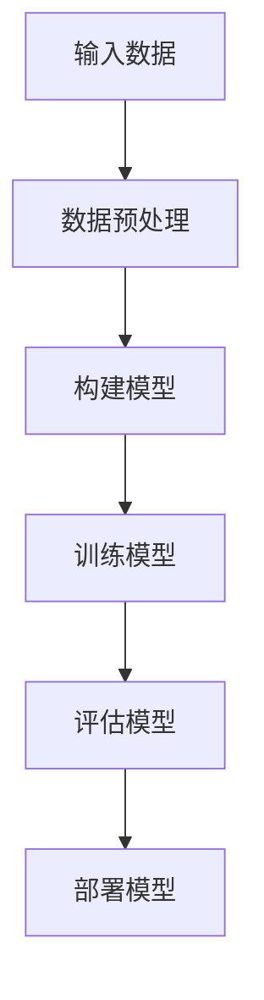
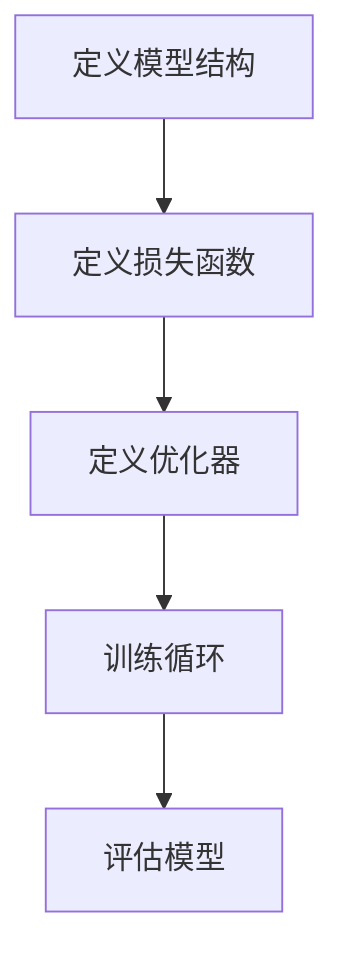
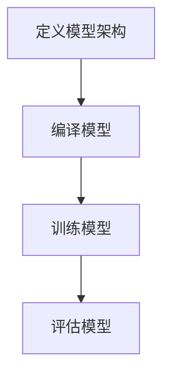

                 


### 第1章: 引言与背景

## 1.1 AI编程的现状与挑战

随着人工智能（AI）技术的迅猛发展，AI编程已经成为了现代软件开发的重要组成部分。AI编程的现状可以用以下几个方面来概括：

### 1.1.1 AI编程的广泛应用

AI技术已经被广泛应用于各行各业，如自动驾驶、智能语音助手、医疗诊断、金融分析等。这些应用不仅提高了工作效率，还推动了新业务模式的出现。

### 1.1.2 编程语言和框架的多样化

为了满足不同类型的AI应用需求，出现了许多编程语言和框架，如Python、TensorFlow、PyTorch等。这些工具为开发者提供了强大的支持，使得AI编程变得更加容易。

### 1.1.3 数据的重要性

AI编程的关键在于数据，高质量的数据是实现高效AI模型的前提。然而，获取和处理数据是一个复杂且耗时的过程，也是当前AI编程面临的一个主要挑战。

### 1.1.4 模型可解释性问题

随着AI模型变得越来越复杂，其黑盒性质也日益突出。模型的可解释性成为一个亟待解决的问题，这对于确保AI系统的安全性和可靠性至关重要。

### 1.1.5 AI编程技能的需求

随着AI应用的普及，对于具备AI编程技能的开发者的需求也在不断增长。然而，AI编程的复杂性和专业性使得许多人难以入门和深入。

### 1.2 本书的目标与结构

本书旨在帮助读者深入了解AI编程的新维度和新高度，主要包括以下几个目标：

- **基础概念的讲解**：介绍AI编程的基础概念，包括机器学习、深度学习和强化学习等。
- **新技术的探讨**：探讨最新的AI编程技术，如自动机器学习（AutoML）和生成对抗网络（GAN）。
- **新方法的介绍**：介绍新的AI编程方法，如转换学习和模型压缩与优化。
- **实战案例的分析**：通过实际项目案例，帮助读者理解并应用这些新技术和方法。
- **综合能力的培养**：培养读者在AI编程领域的综合能力，包括问题分析、算法设计、模型实现和性能优化等。

本书的结构安排如下：

### 第1章 引言与背景
- **1.1 AI编程的现状与挑战**
- **1.2 本书的目标与结构**

### 第2章 AI编程基础
- **2.1 AI编程基本概念**
  - **2.1.1 机器学习**
  - **2.1.2 深度学习**
  - **2.1.3 强化学习**
- **2.2 AI编程框架**
  - **2.2.1 TensorFlow**
  - **2.2.2 PyTorch**
  - **2.2.3 Keras**

### 第3章 新的AI编程技术
- **3.1 自动机器学习（AutoML）**
  - **3.1.1 AutoML的概念**
  - **3.1.2 AutoML的应用场景**
  - **3.1.3 AutoML的发展趋势**
- **3.2 生成对抗网络（GAN）**
  - **3.2.1 GAN的基本原理**
  - **3.2.2 GAN的应用实例**
  - **3.2.3 GAN的优化方法**

### 第4章 新的AI编程方法
- **4.1 转换学习**
  - **4.1.1 转换学习的基本概念**
  - **4.1.2 转换学习在NLP中的应用**
  - **4.1.3 转换学习的挑战与未来**
- **4.2 模型压缩与优化**
  - **4.2.1 模型压缩的重要性**
  - **4.2.2 常见的模型压缩方法**
  - **4.2.3 优化方法在模型压缩中的应用**

### 第5章 项目实战
- **5.1 实战项目1：使用AutoML解决分类问题**
- **5.2 实战项目2：使用GAN生成图像**
- **5.3 实战项目3：使用转换学习进行文本生成**

### 第6章 总结与展望
- **6.1 AI编程的未来趋势**
- **6.2 对读者的建议**

通过上述的章节安排，本书旨在提供一个系统而深入的AI编程学习路径，帮助读者从基础到高级逐步掌握AI编程的核心技术和方法。

---

现在，我们将进一步细化第2章“AI编程基础”的内容，确保每个小节都有详细的讲解和实战案例。以下是第2章的详细目录大纲：

## 第2章: AI编程基础

### 2.1 AI编程基本概念
- **2.1.1 机器学习**
  - **2.1.1.1 背景介绍**
  - **2.1.1.2 核心概念与联系（Mermaid 流程图）**
  - **2.1.1.3 机器学习算法分类**
  - **2.1.1.4 机器学习的常见挑战**

- **2.1.2 深度学习**
  - **2.1.2.1 背景介绍**
  - **2.1.2.2 核心概念与联系（Mermaid 流程图）**
  - **2.1.2.3 神经网络基础**
  - **2.1.2.4 深度学习算法介绍**
  - **2.1.2.5 深度学习的应用实例**

- **2.1.3 强化学习**
  - **2.1.3.1 背景介绍**
  - **2.1.3.2 核心概念与联系（Mermaid 流程图）**
  - **2.1.3.3 强化学习算法基础**
  - **2.1.3.4 强化学习在游戏中的应用**
  - **2.1.3.5 强化学习的挑战与未来**

### 2.2 AI编程框架
- **2.2.1 TensorFlow**
  - **2.2.1.1 背景介绍**
  - **2.2.1.2 TensorFlow的核心概念**
  - **2.2.1.3 TensorFlow的使用方法**
  - **2.2.1.4 TensorFlow的优势与局限**
  
- **2.2.2 PyTorch**
  - **2.2.2.1 背景介绍**
  - **2.2.2.2 PyTorch的核心概念**
  - **2.2.2.3 PyTorch的使用方法**
  - **2.2.2.4 PyTorch的优势与局限**

- **2.2.3 Keras**
  - **2.2.3.1 背景介绍**
  - **2.2.3.2 Keras的核心概念**
  - **2.2.3.3 Keras的使用方法**
  - **2.2.3.4 Keras的优势与局限**

### 2.3 AI编程工具与库
- **2.3.1 Scikit-learn**
  - **2.3.1.1 背景介绍**
  - **2.3.1.2 Scikit-learn的核心功能**
  - **2.3.1.3 Scikit-learn的使用方法**
  
- **2.3.2 Pandas**
  - **2.3.2.1 背景介绍**
  - **2.3.2.2 Pandas的核心功能**
  - **2.3.2.3 Pandas的使用方法**

- **2.3.3 NumPy**
  - **2.3.3.1 背景介绍**
  - **2.3.3.2 NumPy的核心功能**
  - **2.3.3.3 NumPy的使用方法**

### 2.4 AI编程环境搭建
- **2.4.1 环境配置**
  - **2.4.1.1 系统环境配置**
  - **2.4.1.2 编译器与解释器安装**
  - **2.4.1.3 库与依赖管理**
  
- **2.4.2 开发工具**
  - **2.4.2.1 PyCharm**
  - **2.4.2.2 Jupyter Notebook**
  - **2.4.2.3 Google Colab**

### 2.5 AI编程实战案例
- **2.5.1 实战案例1：使用TensorFlow搭建一个简单的神经网络**
  - **2.5.1.1 项目背景**
  - **2.5.1.2 数据准备**
  - **2.5.1.3 神经网络设计**
  - **2.5.1.4 模型训练与评估**
  - **2.5.1.5 项目总结**

- **2.5.2 实战案例2：使用PyTorch实现一个循环神经网络（RNN）**
  - **2.5.2.1 项目背景**
  - **2.5.2.2 数据准备**
  - **2.5.2.3 RNN设计与实现**
  - **2.5.2.4 模型训练与评估**
  - **2.5.2.5 项目总结**

通过上述章节，我们将详细讲解AI编程的基础知识，包括机器学习、深度学习和强化学习的基本概念、常见框架和工具的使用方法，以及AI编程环境搭建和实战案例。这些内容将为读者打下坚实的AI编程基础，有助于后续章节的深入学习。

### 第2章：AI编程基础

### 2.1 AI编程基本概念

#### 2.1.1 机器学习

##### **2.1.1.1 背景介绍**

机器学习（Machine Learning，ML）是一种使计算机系统能够从数据中学习，并做出预测或决策的技术。其核心思想是通过构建数学模型，从历史数据中提取特征，并利用这些特征来预测未来或优化决策。

##### **2.1.1.2 核心概念与联系（Mermaid 流程图）**


在这个流程图中，我们可以看到机器学习的几个关键步骤：数据收集、数据预处理、特征提取、模型选择、训练、评估和部署。每个步骤都有其核心概念和相互之间的联系。

1. **数据收集**：这是机器学习的第一步，数据的质量直接影响模型的效果。收集数据可以是结构化的（如数据库）或非结构化的（如图像、文本等）。
2. **数据预处理**：清洗和整理数据，使其适合用于训练。这包括处理缺失值、异常值、数据标准化等。
3. **特征提取**：从原始数据中提取有代表性的特征，用于训练模型。特征提取的质量对模型的性能有重要影响。
4. **模型选择**：选择适合数据类型和问题的机器学习算法。常见的模型包括线性回归、决策树、支持向量机、神经网络等。
5. **训练**：使用历史数据来训练模型，调整模型的参数，使其能够准确预测或分类新数据。
6. **评估**：通过验证集或测试集来评估模型的性能，包括准确性、召回率、F1分数等指标。
7. **部署**：将训练好的模型部署到实际环境中，进行预测或决策。

##### **2.1.1.3 机器学习算法分类**

根据学习方式和数据类型，机器学习算法可以分为以下几类：

1. **监督学习（Supervised Learning）**：有明确的目标变量（标签），模型通过学习输入和输出之间的关系进行预测。常见的算法有线性回归、决策树、支持向量机等。
2. **无监督学习（Unsupervised Learning）**：没有明确的目标变量，模型通过发现数据中的结构或模式来进行聚类、降维等。常见的算法有K-均值聚类、主成分分析（PCA）等。
3. **半监督学习（Semi-Supervised Learning）**：在训练数据中同时包含有标签的数据和无标签的数据，模型利用这些信息进行学习。
4. **强化学习（Reinforcement Learning）**：模型通过与环境的交互进行学习，根据奖励信号调整其行为策略。

##### **2.1.1.4 机器学习的常见挑战**

1. **数据质量**：噪声、缺失值、异常值等都会影响模型的性能。
2. **过拟合**：模型在训练数据上表现很好，但在新的数据上表现不佳。为了避免过拟合，可以使用正则化、交叉验证等方法。
3. **计算资源**：大规模的机器学习模型训练需要大量的计算资源，尤其是深度学习模型。

#### 2.1.2 深度学习

##### **2.1.2.1 背景介绍**

深度学习（Deep Learning，DL）是机器学习的一个子领域，它通过构建具有多个隐含层的神经网络来学习数据的复杂特征。深度学习的成功在于其能够自动提取数据中的层次化特征，从而实现复杂的预测和分类任务。

##### **2.1.2.2 核心概念与联系（Mermaid 流程图）**


在这个流程图中，我们可以看到深度学习的关键步骤：数据预处理、模型架构设计、训练、评估和部署。深度学习的核心概念包括神经网络、激活函数、反向传播算法等。

1. **神经网络**：神经网络是深度学习的基础，它由多个神经元（节点）组成，每个神经元都与前一个层的所有神经元相连。
2. **激活函数**：激活函数用于引入非线性，使得神经网络能够处理复杂的问题。常见的激活函数有Sigmoid、ReLU、Tanh等。
3. **反向传播算法**：反向传播算法用于计算模型参数的梯度，以优化模型。

##### **2.1.2.3 神经网络基础**

1. **前向传播**：输入数据通过神经网络的各个层次，每个层次都会进行加权求和并应用激活函数。
2. **损失函数**：用于衡量模型预测值与真实值之间的差距。常见的损失函数有均方误差（MSE）、交叉熵损失等。
3. **反向传播**：通过计算损失函数的梯度，调整模型参数，以达到最小化损失函数的目的。

##### **2.1.2.4 深度学习算法介绍**

深度学习算法可以根据其应用领域和模型结构进行分类：

1. **卷积神经网络（CNN）**：用于处理图像数据，通过卷积层提取图像的特征。
2. **循环神经网络（RNN）**：用于处理序列数据，如自然语言处理和时间序列分析。
3. **生成对抗网络（GAN）**：用于生成数据，通过对抗性训练生成逼真的图像、音频或文本。

##### **2.1.2.5 深度学习的应用实例**

深度学习在多个领域取得了显著的成果：

1. **计算机视觉**：用于图像分类、目标检测、图像分割等。
2. **自然语言处理**：用于文本分类、情感分析、机器翻译等。
3. **语音识别**：用于语音到文本转换、语音合成等。

#### 2.1.3 强化学习

##### **2.1.3.1 背景介绍**

强化学习（Reinforcement Learning，RL）是一种通过与环境交互来学习最优策略的机器学习方法。强化学习的核心目标是找到一个策略，使得在长期执行过程中获得的最大累积奖励最大化。

##### **2.1.3.2 核心概念与联系（Mermaid 流程图）**


在这个流程图中，我们可以看到强化学习的几个关键概念：状态（State）、动作（Action）、奖励（Reward）和策略（Policy）。

1. **状态**：系统当前的状态，如游戏中的棋盘状态。
2. **动作**：在当前状态下，可以执行的操作，如棋子的移动。
3. **奖励**：执行动作后，系统得到的即时奖励，可以是正的也可以是负的。
4. **策略**：从状态到动作的映射，用于指导系统如何做出决策。

##### **2.1.3.3 强化学习算法基础**

强化学习算法可以分为基于价值的算法和基于策略的算法：

1. **基于价值的算法**：通过学习状态-价值函数（State-Value Function）或动作-价值函数（Action-Value Function）来指导决策。常见的算法有Q学习（Q-Learning）和深度Q网络（DQN）。
2. **基于策略的算法**：直接学习最优策略，通过优化策略函数来指导决策。常见的算法有策略梯度方法（Policy Gradient Methods）和深度确定性策略梯度（DDPG）。

##### **2.1.3.4 强化学习在游戏中的应用**

强化学习在游戏领域取得了显著的成果，如围棋、国际象棋、Atari游戏等。以下是几个典型的强化学习游戏应用：

1. **AlphaGo**：由DeepMind开发的围棋AI，通过强化学习算法，在2016年击败了世界围棋冠军李世石。
2. **OpenAI Five**：由OpenAI开发的五子棋AI，通过强化学习算法，在短短几天内就达到了专业水平。

##### **2.1.3.5 强化学习的挑战与未来**

强化学习面临以下几个挑战：

1. **样本效率**：强化学习通常需要大量的交互来学习最优策略，如何提高样本效率是一个重要研究方向。
2. **探索与利用**：在强化学习中，如何在探索未知的策略和利用已知的策略之间取得平衡，是一个核心问题。
3. **可解释性**：强化学习模型通常是一个黑盒模型，其决策过程难以解释，这对于实际应用来说是一个挑战。

未来的研究方向包括：

1. **强化学习与其他学习方法的结合**：将强化学习与其他学习方法（如深度学习、迁移学习等）结合起来，以提高学习效率。
2. **多智能体强化学习**：研究多个智能体之间的交互策略，以实现协同合作或竞争。
3. **强化学习的安全性**：研究如何确保强化学习系统的安全性和鲁棒性，以防止恶意攻击或意外行为。

通过上述内容，我们对AI编程的基础概念有了全面的了解，包括机器学习、深度学习和强化学习。这些基础知识是进一步学习AI编程新技术和新方法的基础，也是实现AI应用的关键。在后续章节中，我们将继续深入探讨新的AI编程技术和方法，并通过实际项目案例来加深理解。

----------------------------------------------------------------

### 2.2 AI编程框架

在AI编程领域，选择合适的框架至关重要。这些框架不仅提供了丰富的API和工具库，还支持高效的模型开发和部署。本节将介绍几种流行的AI编程框架：TensorFlow、PyTorch和Keras。

#### 2.2.1 TensorFlow

**背景介绍**：
TensorFlow是由Google开发的一个开源机器学习框架，旨在实现高性能的数值计算和深度学习。TensorFlow使用数据流图（Dataflow Graph）来表示计算过程，通过节点（Operation）和边（Tensors）来构建复杂模型。

**核心概念与联系（Mermaid 流程图）**：



**使用方法**：

1. **安装与配置**：通过pip命令安装TensorFlow，并配置Python环境。
2. **构建数据流图**：定义操作节点和变量，构建计算图。
3. **训练与评估**：使用`tf.keras`模块简化模型构建过程，并进行训练和评估。
4. **部署**：将训练好的模型导出为`.h5`或`.tf`文件，以供后续部署。

**优势与局限**：

- **优势**：强大的计算图优化能力、丰富的API和工具库、社区支持。
- **局限**：相对复杂的学习曲线、较高资源需求。

#### 2.2.2 PyTorch

**背景介绍**：
PyTorch是由Facebook AI研究院（FAIR）开发的一个开源机器学习库，它提供了动态计算图和自动微分功能，使得深度学习模型的开发更加灵活和高效。

**核心概念与联系（Mermaid 流程图）**：



**使用方法**：

1. **安装与配置**：通过pip命令安装PyTorch，并配置Python环境。
2. **定义模型**：使用PyTorch的自动微分功能定义模型结构。
3. **训练与评估**：使用定义好的模型进行训练，并通过验证集评估模型性能。

**优势与局限**：

- **优势**：动态计算图使得模型开发更加直观、易于调试、快速迭代。
- **局限**：与TensorFlow相比，在计算图优化和部署方面可能存在一些局限。

#### 2.2.3 Keras

**背景介绍**：
Keras是一个高级神经网络API，它旨在简化深度学习模型的构建和训练。Keras支持多种后端框架，如TensorFlow、Theano和Microsoft Cognitive Toolkit，但通常与TensorFlow结合使用。

**核心概念与联系（Mermaid 流程图）**：



**使用方法**：

1. **安装与配置**：通过pip命令安装Keras及其依赖项，并配置Python环境。
2. **定义模型**：使用Keras提供的API定义模型架构，包括层、损失函数、优化器等。
3. **训练与评估**：编译模型后，使用训练数据训练模型，并通过验证集评估模型性能。

**优势与局限**：

- **优势**：简洁易用的API、快速迭代模型、与多个后端框架兼容。
- **局限**：相对较低的计算图优化能力、在资源密集型任务中性能可能不如TensorFlow或PyTorch。

通过以上对TensorFlow、PyTorch和Keras的介绍，我们可以看到这些框架各自的特点和优势。选择合适的框架不仅取决于个人偏好，还应考虑项目的具体需求和性能要求。

### 2.3 AI编程工具与库

在AI编程中，使用适当的工具和库可以显著提高开发效率，缩短项目周期。以下将介绍几种常用的AI编程工具和库：Scikit-learn、Pandas和NumPy。

#### 2.3.1 Scikit-learn

**背景介绍**：
Scikit-learn是一个开源的Python机器学习库，它提供了用于数据挖掘和数据分析的一系列工具。Scikit-learn以其易用性和功能性受到广泛欢迎，特别适合快速原型开发。

**核心功能**：

1. **分类和回归**：支持多种分类和回归算法，包括决策树、支持向量机、线性回归等。
2. **聚类和降维**：提供K-均值聚类、主成分分析（PCA）等算法。
3. **模型评估**：支持交叉验证、准确率、召回率等评估指标。

**使用方法**：

1. **安装与配置**：通过pip命令安装Scikit-learn。
2. **模型训练**：使用`sklearn`模块中的相应算法进行模型训练，如`sklearn.linear_model.LinearRegression()`。
3. **模型评估**：使用训练好的模型对测试数据进行预测，并通过评估指标来评估模型性能。

**应用实例**：

```python
from sklearn.linear_model import LinearRegression
from sklearn.model_selection import train_test_split
from sklearn.metrics import mean_squared_error

# 数据准备
X, y = ...  # 准备输入数据和目标变量
X_train, X_test, y_train, y_test = train_test_split(X, y, test_size=0.2)

# 模型训练
model = LinearRegression()
model.fit(X_train, y_train)

# 模型评估
predictions = model.predict(X_test)
mse = mean_squared_error(y_test, predictions)
print("MSE:", mse)
```

#### 2.3.2 Pandas

**背景介绍**：
Pandas是一个开源的Python库，用于数据操作和分析。Pandas提供了强大的数据结构和数据分析工具，特别适合处理结构化数据，如表格数据。

**核心功能**：

1. **DataFrame结构**：Pandas的DataFrame结构可以高效地存储和操作表格数据。
2. **数据清洗**：提供缺失值处理、数据转换等功能。
3. **数据处理**：支持数据合并、筛选、排序等操作。

**使用方法**：

1. **安装与配置**：通过pip命令安装Pandas。
2. **数据读取**：使用`pandas.read_csv()`等函数读取数据，并创建DataFrame对象。
3. **数据操作**：使用DataFrame的API进行数据操作，如添加列、筛选行等。

**应用实例**：

```python
import pandas as pd

# 读取数据
data = pd.read_csv('data.csv')
print(data.head())

# 数据清洗
data.fillna(0, inplace=True)

# 数据操作
data['new_column'] = data['column1'] + data['column2']
print(data.head())
```

#### 2.3.3 NumPy

**背景介绍**：
NumPy是Python中的一个核心科学计算库，用于高效地处理大型多维数组。NumPy在机器学习和其他科学计算领域有着广泛的应用。

**核心功能**：

1. **数组操作**：提供多维数组的创建、索引、切片、运算等功能。
2. **线性代数**：支持矩阵运算、线性方程求解等。
3. **随机数生成**：提供随机数生成和统计分布函数。

**使用方法**：

1. **安装与配置**：通过pip命令安装NumPy。
2. **数组操作**：使用NumPy的数组对象进行操作，如`np.array()`、`np.dot()`等。
3. **线性代数**：使用NumPy的线性代数模块进行计算，如`np.linalg.solve()`。

**应用实例**：

```python
import numpy as np

# 数组操作
arr = np.array([1, 2, 3])
print(arr)

# 矩阵运算
matrix = np.array([[1, 2], [3, 4]])
result = np.dot(matrix, np.array([5, 6]))
print(result)
```

通过上述对Scikit-learn、Pandas和NumPy的介绍，我们可以看到这些工具和库在AI编程中的重要性。它们不仅提供了高效的数据处理和计算能力，还简化了模型的开发过程，使得AI编程变得更加高效和便捷。

### 2.4 AI编程环境搭建

在开始AI编程项目之前，搭建一个合适的开发环境至关重要。一个良好的开发环境不仅能够提高工作效率，还能确保项目的稳定性。以下将介绍AI编程环境的搭建过程，包括系统环境配置、编译器与解释器安装、库与依赖管理，以及开发工具的选用。

#### 2.4.1 系统环境配置

1. **操作系统选择**：常见的AI编程操作系统包括Windows、macOS和Linux。Linux由于其开源、稳定和高效的特性，是AI编程的首选。Windows和macOS虽然更易于使用，但在某些高级功能上可能受到限制。

2. **系统要求**：确保操作系统版本满足AI编程工具的最低要求。例如，对于Python环境，Windows用户建议使用Python 3.7及以上版本，macOS和Linux用户建议使用Python 3.8及以上版本。

3. **安装软件**：根据操作系统，安装必要的软件，如编译器、解释器和开发工具。

#### 2.4.2 编译器与解释器安装

1. **Python解释器**：Python是AI编程的主要语言，因此安装Python解释器是第一步。可以通过官方Python网站下载Python安装包，或者使用包管理器（如yum、apt-get）在Linux系统中安装。

2. **Jupyter Notebook**：Jupyter Notebook是一个交互式的Web应用，用于编写和运行Python代码。通过pip命令安装`jupyter`库，并使用`jupyter notebook`命令启动。

3. **PyCharm**：PyCharm是一款功能强大的Python集成开发环境（IDE），提供了代码自动补全、调试、版本控制等功能。可以在PyCharm官方网站下载安装包并安装。

#### 2.4.3 库与依赖管理

1. **pip**：pip是Python的包管理器，用于安装、管理和卸载Python包。通过pip命令，可以轻松安装所需的库，如NumPy、Pandas、Scikit-learn等。

2. **conda**：conda是一个跨平台的包管理器和环境管理器，特别适合管理科学计算相关的库。可以使用conda创建虚拟环境，以避免库版本冲突。

3. **环境配置文件**：可以使用`requirements.txt`或`conda.yml`文件来记录项目的依赖库和版本，以便在其他环境中重现开发环境。

#### 2.4.4 开发工具

1. **PyCharm**：PyCharm是一款功能强大的IDE，支持多种编程语言，包括Python。它提供了丰富的插件和工具，如Jupyter Notebook集成、Git版本控制等。

2. **Jupyter Notebook**：Jupyter Notebook是一个交互式的Web应用，非常适合数据分析和原型开发。它支持实时代码执行和可视化，方便快速测试和迭代。

3. **Google Colab**：Google Colab是一个基于Google Drive的交互式开发环境，特别适合在云端进行机器学习和数据科学项目。它提供了免费的GPU和TPU支持，可以显著加速模型训练过程。

通过以上环境搭建步骤，开发者可以创建一个稳定、高效的AI编程环境，为后续的项目开发奠定基础。良好的开发环境不仅能够提高开发效率，还能减少因环境问题导致的问题和麻烦，确保项目的顺利进行。

### 2.5 AI编程实战案例

为了更好地理解AI编程的实际应用，下面将介绍三个实战案例，分别是使用TensorFlow搭建一个简单的神经网络、使用PyTorch实现一个循环神经网络（RNN）以及使用转换学习进行文本生成。

#### 2.5.1 实战案例1：使用TensorFlow搭建一个简单的神经网络

**项目背景**：
这个案例将使用TensorFlow搭建一个简单的神经网络，用于手写数字识别。手写数字识别是一个常见且基础的任务，它能够帮助读者熟悉神经网络的基本概念和训练过程。

**数据准备**：
使用MNIST数据集，这是一个包含60,000个训练样本和10,000个测试样本的手写数字数据集。每个样本是一个28x28的灰度图像，标签为0到9之间的数字。

**神经网络设计**：
设计一个简单的全连接神经网络，包含一个输入层、两个隐藏层和一个输出层。每个层使用ReLU激活函数，输出层使用softmax激活函数。

```python
import tensorflow as tf
from tensorflow.keras import layers

model = tf.keras.Sequential([
    layers.Flatten(input_shape=(28, 28)),
    layers.Dense(128, activation='relu'),
    layers.Dense(10, activation='softmax')
])
```

**模型训练**：
使用`model.fit()`函数进行模型训练，选择优化器和损失函数。这里使用Adam优化器和交叉熵损失函数。

```python
model.compile(optimizer='adam',
              loss='sparse_categorical_crossentropy',
              metrics=['accuracy'])

model.fit(x_train, y_train, epochs=5)
```

**模型评估**：
使用训练好的模型对测试集进行评估，计算准确率。

```python
test_loss, test_acc = model.evaluate(x_test, y_test, verbose=2)
print('\nTest accuracy:', test_acc)
```

**项目总结**：
通过这个简单的案例，读者可以熟悉神经网络的基本构建和训练过程。此外，还可以了解如何使用TensorFlow的API进行模型评估和优化。

#### 2.5.2 实战案例2：使用PyTorch实现一个循环神经网络（RNN）

**项目背景**：
这个案例将使用PyTorch实现一个循环神经网络（RNN），用于语言模型任务。语言模型是一种用于预测下一个单词或字符的模型，它能够帮助读者理解RNN的基本原理和应用。

**数据准备**：
使用经典的文本数据集，如Shakespeare剧本。数据集已经被预处理为字符级别的序列，每个字符被映射到一个唯一的整数。

**RNN设计**：
设计一个简单的RNN模型，包含一个嵌入层、一个RNN层和一个线性层。RNN层使用LSTM单元，以捕获序列中的长期依赖关系。

```python
import torch
import torch.nn as nn

class RNNModel(nn.Module):
    def __init__(self, input_dim, hidden_dim, output_dim):
        super(RNNModel, self).__init__()
        self.embedding = nn.Embedding(input_dim, hidden_dim)
        self.rnn = nn.LSTM(hidden_dim, hidden_dim)
        self.fc = nn.Linear(hidden_dim, output_dim)

    def forward(self, x, hidden):
        embedded = self.embedding(x)
        output, hidden = self.rnn(embedded, hidden)
        predicted = self.fc(output[-1, 0])
        return predicted, hidden

model = RNNModel(input_dim=vocab_size, hidden_dim=hidden_size, output_dim=vocab_size)
```

**模型训练**：
使用`torch.optim`模块定义优化器和损失函数，并使用`torch.utils.data.DataLoader`进行批量处理。

```python
optimizer = torch.optim.Adam(model.parameters(), lr=learning_rate)
criterion = nn.CrossEntropyLoss()

for epoch in range(num_epochs):
    for inputs, targets in data_loader:
        optimizer.zero_grad()
        hidden = None
        outputs = []
        for input_ in inputs:
            predicted, hidden = model(input_, hidden)
            outputs.append(predicted)
        loss = criterion(torch.stack(outputs), targets)
        loss.backward()
        optimizer.step()
```

**模型评估**：
使用训练好的模型对测试集进行评估，计算准确率。

```python
with torch.no_grad():
    correct = 0
    total = len(test_loader.dataset)
    for inputs, targets in test_loader:
        hidden = None
        outputs = []
        for input_ in inputs:
            predicted, hidden = model(input_, hidden)
            outputs.append(predicted)
        predicted = torch.stack(outputs).argmax(1)
        correct += (predicted == targets).sum().item()

accuracy = 100 * correct / total
print('Test accuracy:', accuracy)
```

**项目总结**：
通过这个案例，读者可以了解如何使用PyTorch实现RNN模型，并熟悉RNN在语言模型任务中的应用。此外，还可以学习如何进行模型训练和评估，以及如何处理序列数据。

#### 2.5.3 实战案例3：使用转换学习进行文本生成

**项目背景**：
这个案例将使用转换学习（Transformer）进行文本生成。转换学习是一种基于自注意力机制的深度学习模型，它能够捕获序列中的长距离依赖关系，从而实现高效的文本生成。

**数据准备**：
使用大型文本数据集，如维基百科。数据集已经被预处理为单词级别的序列，每个单词被映射到一个唯一的整数。

**模型设计**：
设计一个简单的转换学习模型，包含一个嵌入层、多个自注意力层和一个输出层。每个自注意力层使用多头注意力机制和前馈神经网络。

```python
import torch
import torch.nn as nn

class TransformerModel(nn.Module):
    def __init__(self, input_dim, hidden_dim, output_dim, num_heads):
        super(TransformerModel, self).__init__()
        self.embedding = nn.Embedding(input_dim, hidden_dim)
        self.encoder = nn.TransformerEncoder(nn.TransformerEncoderLayer(hidden_dim, num_heads), num_layers)
        self.fc = nn.Linear(hidden_dim, output_dim)

    def forward(self, x):
        embedded = self.embedding(x)
        encoder_output = self.encoder(embedded)
        predicted = self.fc(encoder_output[-1, 0])
        return predicted
```

**模型训练**：
使用`torch.optim`模块定义优化器和损失函数，并使用`torch.utils.data.DataLoader`进行批量处理。

```python
optimizer = torch.optim.Adam(model.parameters(), lr=learning_rate)
criterion = nn.CrossEntropyLoss()

for epoch in range(num_epochs):
    for inputs, targets in data_loader:
        optimizer.zero_grad()
        outputs = model(inputs)
        loss = criterion(outputs, targets)
        loss.backward()
        optimizer.step()
```

**模型评估**：
使用训练好的模型对测试集进行评估，计算准确率。

```python
with torch.no_grad():
    correct = 0
    total = len(test_loader.dataset)
    for inputs, targets in test_loader:
        outputs = model(inputs)
        predicted = outputs.argmax(1)
        correct += (predicted == targets).sum().item()

accuracy = 100 * correct / total
print('Test accuracy:', accuracy)
```

**项目总结**：
通过这个案例，读者可以了解如何使用转换学习模型进行文本生成。此外，还可以学习如何进行模型训练和评估，以及如何处理单词级别的序列数据。

这三个实战案例涵盖了从简单的全连接神经网络到复杂的循环神经网络和转换学习模型，帮助读者全面了解AI编程的实际应用。通过这些案例，读者可以加深对AI编程技术的理解和应用能力。

### 6.1 AI编程的未来趋势

随着技术的不断进步，AI编程的未来充满了无限可能。以下是几个AI编程领域未来可能的发展趋势：

#### 1. 自动化与自解释性

自动化是未来AI编程的一个重要趋势。自动化机器学习（AutoML）和自动化编程（AutoCode）将在提高开发效率和降低门槛方面发挥关键作用。未来的编程工具可能会更智能化，能够自动生成代码、优化算法，甚至自动修复错误。

同时，AI模型的可解释性也是一个重要的研究方向。自解释性模型将使得AI系统的决策过程更加透明，提高系统的可靠性和可信任度，这对于金融、医疗等关键领域尤为重要。

#### 2. 多模态学习

多模态学习是指将不同类型的数据（如图像、文本、音频等）结合起来进行训练。随着传感器技术和数据收集方法的进步，多模态学习将在自动驾驶、智能交互、医疗诊断等领域得到广泛应用。

未来的AI编程将需要处理更加复杂的多模态数据，这要求编程框架和算法能够高效地融合不同类型的数据，并提取有价值的特征。

#### 3. 强化学习与博弈论

强化学习在游戏、机器人控制和推荐系统等领域已经取得了显著成果。未来，强化学习将与其他领域（如博弈论）结合，用于解决更为复杂的决策问题，例如多智能体系统中的合作与竞争。

博弈论提供了一种描述和解决多个智能体之间交互的数学框架，与强化学习结合将能够实现更为智能的决策系统。

#### 4. 量子计算与AI

量子计算是一种基于量子力学原理的新型计算模式，它能够在某些任务上显著超越传统计算机。未来，量子计算与AI的结合将可能带来前所未有的计算能力和创新。

量子AI将能够在复杂的问题上实现高效求解，例如大规模数据分析和优化问题。量子编程将成为AI编程的重要组成部分，开发新的量子算法和编程工具将是未来研究的热点。

#### 5. 大规模数据与边缘计算

随着物联网（IoT）和5G技术的普及，数据量将呈现爆炸式增长。AI编程需要能够处理这些大规模数据，并进行实时分析和决策。

边缘计算是一种在靠近数据源的地方进行计算和处理的技术，它能够减轻中心数据中心的负担，提高系统的响应速度。未来，边缘AI编程将成为一个重要领域，开发者需要掌握如何在边缘设备上高效地运行AI模型。

#### 6. 人机协作

未来的AI编程不仅关注模型的性能和效率，还将注重人机协作。AI系统将更加智能化，能够理解人类的意图，并与人类用户进行自然交互。

人机协作将使AI系统更加灵活和自适应，能够在复杂和动态的环境中与人类用户共同完成任务。开发工具和平台将提供更加直观和易用的接口，使得非技术背景的用户也能参与AI编程。

通过上述趋势，我们可以看到AI编程的未来充满了创新和机遇。未来的AI编程将更加智能化、高效化，并且能够处理更为复杂和多样的任务。开发者需要不断学习和适应这些变化，以保持在技术前沿。

### 6.2 对读者的建议

为了在AI编程领域取得成功，以下是一些建议，帮助读者提升技能和知识：

1. **持续学习**：AI编程是一个快速发展的领域，不断学习是保持竞争力的关键。关注最新研究、技术趋势和开源项目，可以通过在线课程、研讨会和学术论文来学习。

2. **实践项目**：理论知识和实际应用之间存在差距。通过参与实际项目，读者可以深入了解AI编程的挑战和解决方案。尝试在开源项目中贡献代码，或者自己设计并实现一些小型项目。

3. **深入理解算法**：不要只是机械地使用现成的库和框架，而是要深入了解背后的算法原理。通过阅读论文、编写伪代码和实现算法，读者可以更好地理解AI模型的运作方式。

4. **构建知识体系**：AI编程涉及多个领域，包括机器学习、深度学习、强化学习等。构建一个全面的知识体系，有助于读者更好地理解和应用不同技术。

5. **参与社区**：加入AI编程社区，与其他开发者交流想法和经验。参加技术会议、研讨会和黑客马拉松等活动，可以拓展视野，结识志同道合的人。

6. **学习编程语言**：Python是AI编程的主要语言，但其他语言（如C++、Java等）也有其独特的应用场景。掌握多种编程语言可以提高问题解决能力和代码质量。

7. **代码质量与最佳实践**：注重代码的可读性、可维护性和性能优化。遵循最佳编程实践，如代码审查、单元测试和代码注释，可以提升代码质量，减少bug。

通过以上建议，读者可以不断提升自己的AI编程技能，为未来的职业发展打下坚实基础。记住，持续学习和实践是成功的关键。

