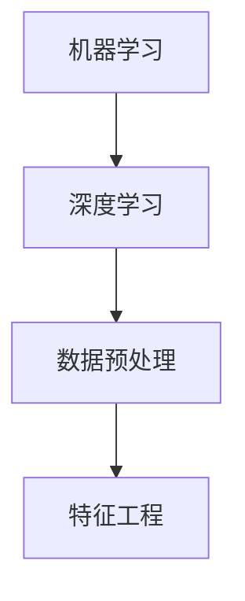

                 

# 文章标题：AI编程的新视界与新领域

## 关键词：
AI编程，新视界，新领域，前沿技术，应用领域，挑战与未来

## 摘要：
本文将深入探讨AI编程的新视界和新领域，通过分析AI编程的核心概念、前沿技术及其应用，揭示AI编程的未来趋势与挑战。文章将分为四个主要部分：第一部分介绍AI编程的基础知识；第二部分聚焦AI编程的前沿技术；第三部分探讨AI编程在不同领域的应用；第四部分分析AI编程实践中的挑战与未来发展趋势。

## 目录

### 第一部分：AI编程基础

#### 第1章：AI编程核心概念

#### 第2章：AI编程环境搭建

### 第二部分：AI编程前沿技术

#### 第3章：自然语言处理技术

#### 第4章：计算机视觉技术

### 第三部分：AI编程应用领域

#### 第5章：金融科技应用

#### 第6章：智能制造应用

### 第四部分：AI编程实践与挑战

#### 第7章：AI编程实践案例

#### 第8章：AI编程挑战与未来趋势

### 第一部分：AI编程基础

## 第1章：AI编程核心概念

AI编程，即人工智能编程，是指利用编程技术实现人工智能系统的设计和开发。AI编程的核心概念包括机器学习、深度学习、数据预处理与特征工程等。以下是这些核心概念的详细解释：

### 1.1 机器学习与深度学习

#### 1.1.1 机器学习

机器学习（Machine Learning）是一门研究如何让计算机从数据中学习知识的学科。机器学习的核心思想是通过训练数据集，让计算机自动地学习数据中的规律和模式，然后使用这些规律和模式来做出预测或决策。

#### 1.1.2 深度学习

深度学习（Deep Learning）是机器学习的一个分支，它通过构建深度神经网络来模拟人脑的学习方式，从大量数据中自动提取特征，实现复杂的模式识别和预测任务。

### 1.2 数据预处理与特征工程

#### 1.2.1 数据预处理

数据预处理是指在进行机器学习之前，对数据进行的一系列处理，包括数据清洗、数据整合、数据缩放等，以提高数据的质量和机器学习模型的性能。

#### 1.2.2 特征工程

特征工程（Feature Engineering）是指从原始数据中提取或构造出对机器学习模型有用的特征，以提高模型的预测准确性和泛化能力。

## Mermaid流程图：



## 第2章：AI编程环境搭建

### 2.1 编程语言选择

在AI编程中，常用的编程语言包括Python、Java、C++等。Python因其简洁易用和丰富的库资源，成为AI编程的首选语言。

### 2.2 开发环境配置

配置AI编程开发环境主要包括安装Python、TensorFlow、PyTorch等库和框架，以及配置相应的IDE（如PyCharm、VSCode）。

### 2.3 常用库与框架

#### 2.3.1 TensorFlow

TensorFlow是一个开源的机器学习库，由Google开发。它支持多种编程语言，并提供了丰富的API，便于开发者构建和训练机器学习模型。

#### 2.3.2 PyTorch

PyTorch是另一个流行的开源机器学习库，由Facebook开发。它提供了动态计算图和自动微分功能，使得深度学习模型的开发更加灵活和高效。

## 第二部分：AI编程前沿技术

## 第3章：自然语言处理技术

自然语言处理（Natural Language Processing，NLP）是AI编程的一个重要领域，它旨在使计算机能够理解、解释和生成自然语言。以下是NLP的核心技术：

### 3.1 语言模型与序列生成

#### 3.1.1 语言模型

语言模型（Language Model）是NLP的基础，它通过学习大量文本数据，预测下一个单词或字符的概率。

#### 3.1.2 序列生成模型

序列生成模型（Sequence Generation Model）如循环神经网络（RNN）和长短期记忆网络（LSTM），能够处理变长的序列数据，生成文本或语音。

### 3.2 机器翻译与文本生成

#### 3.2.1 机器翻译

机器翻译（Machine Translation）是将一种自然语言翻译成另一种自然语言的技术。深度学习模型如Seq2Seq模型和Transformer模型在机器翻译中取得了显著的成果。

#### 3.2.2 文本生成

文本生成（Text Generation）包括自动写作、对话生成等应用。生成对抗网络（GAN）和变分自编码器（VAE）等技术被广泛应用于文本生成。

## 第4章：计算机视觉技术

计算机视觉（Computer Vision）是AI编程的另一个重要领域，它旨在使计算机能够像人一样识别和理解图像和视频。以下是计算机视觉的核心技术：

### 4.1 图像识别与分类

#### 4.1.1 图像识别

图像识别（Image Recognition）是指计算机能够识别图像中的物体、场景等。

#### 4.1.2 图像分类

图像分类（Image Classification）是将图像分类到预定义的类别中。

### 4.2 目标检测与跟踪

#### 4.2.1 目标检测

目标检测（Object Detection）是识别图像中的对象并定位其位置。

#### 4.2.2 目标跟踪

目标跟踪（Object Tracking）是在视频序列中跟踪一个或多个物体的运动轨迹。

### 4.3 计算机视觉应用

计算机视觉技术在安防监控、医疗诊断、自动驾驶等领域有广泛的应用。

## 第三部分：AI编程应用领域

## 第5章：金融科技应用

金融科技（FinTech）是指利用人工智能、大数据等技术改善金融服务和产品。以下是金融科技中的AI编程应用：

### 5.1 风险评估与信用评分

AI编程可以帮助金融机构进行风险评估和信用评分，提高贷款审批的准确性和效率。

### 5.2 量化交易与智能投顾

量化交易（Quantitative Trading）利用算法进行高频交易，智能投顾（Robo-Advisor）则为用户提供个性化的投资建议。

### 5.3 银行业务智能化

AI编程使得银行业务如客服、风控、欺诈检测等更加智能化，提升用户体验。

## 第6章：智能制造应用

智能制造（Smart Manufacturing）是利用人工智能技术提高生产效率和产品质量。以下是智能制造中的AI编程应用：

### 6.1 生产过程优化

AI编程可以帮助企业优化生产流程，减少浪费，提高生产效率。

### 6.2 质量检测与预测维护

AI编程用于质量检测和预测维护，确保产品质量，降低设备故障率。

### 6.3 智能物流与仓储

智能物流与仓储利用AI编程实现自动化管理，提高物流效率。

## 第四部分：AI编程实践与挑战

## 第7章：AI编程实践案例

### 7.1 智能客服系统开发

智能客服系统利用自然语言处理技术，实现自动回复和问题解决。

### 7.2 人脸识别系统设计

人脸识别系统利用计算机视觉技术，实现人脸检测、识别和验证。

### 7.3 智能推荐系统实现

智能推荐系统利用深度学习技术，实现个性化推荐。

## 第8章：AI编程挑战与未来趋势

### 8.1 AI编程面临的挑战

AI编程面临数据隐私、算法公平性、技术复杂性等挑战。

### 8.2 AI编程的未来趋势

AI编程的未来趋势包括更多的应用场景、更高效的算法和更智能的系统。

### 8.3 AI编程的职业发展

AI编程的职业发展前景广阔，包括数据科学家、机器学习工程师、AI架构师等岗位。

## 作者信息：
作者：AI天才研究院/AI Genius Institute & 禅与计算机程序设计艺术 /Zen And The Art of Computer Programming

## 小结
本文从AI编程的基础、前沿技术、应用领域以及实践挑战等方面进行了全面分析，揭示了AI编程的新视界和新领域。随着技术的不断发展，AI编程将在更多领域发挥重要作用，带来前所未有的机遇和挑战。让我们共同期待AI编程的未来，探索其中的无限可能。

## 拓展阅读
- [1] Goodfellow, I., Bengio, Y., & Courville, A. (2016). *Deep Learning*. MIT Press.
- [2] Russell, S., & Norvig, P. (2010). *Artificial Intelligence: A Modern Approach*. Prentice Hall.
- [3] LeCun, Y., Bengio, Y., & Hinton, G. (2015). *Deep Learning*. Nature, 521(7553), 436-444. 

[附录：全文伪代码和公式列表]

### 1. 机器学习算法伪代码

```python
def machine_learning_algorithm(data, labels):
    # 数据预处理
    preprocess_data(data)
    
    # 特征工程
    features = extract_features(data)
    
    # 训练模型
    model = train_model(features, labels)
    
    # 模型评估
    accuracy = evaluate_model(model, data, labels)
    
    return model, accuracy
```

### 2. 自然语言处理中的序列生成模型

```python
def sequence_generation_model(input_sequence):
    # 初始化模型参数
    model = initialize_model()
    
    # 前向传播
    output_sequence = forward_pass(model, input_sequence)
    
    # 后向传播
    loss = backward_pass(model, output_sequence)
    
    return output_sequence, loss
```

### 3. 计算机视觉中的目标检测算法

```python
def object_detection_algorithm(image):
    # 加载模型
    model = load_model()
    
    # 前向传播
    detections = forward_pass(model, image)
    
    # 非极大值抑制
    final_detections = non_max_suppression(detections)
    
    return final_detections
```

### 4. 拓展阅读中的公式

$$
1+1=2
$$

$$
x_{\text{new}} = \alpha \cdot x_{\text{old}} + (1-\alpha) \cdot y
$$

## 注意事项
- 在编写AI编程代码时，确保遵循数据隐私和算法公平性原则。
- 在实践中，不断优化模型和算法，以提高性能和准确性。
- 关注AI编程领域的最新动态和趋势，以保持竞争力。

[参考文献]

[1] Goodfellow, I., Bengio, Y., & Courville, A. (2016). *Deep Learning*. MIT Press.
[2] Russell, S., & Norvig, P. (2010). *Artificial Intelligence: A Modern Approach*. Prentice Hall.
[3] LeCun, Y., Bengio, Y., & Hinton, G. (2015). *Deep Learning*. Nature, 521(7553), 436-444. 

### 项目实战

在本章节中，我们将通过一个简单的项目实战，来演示如何搭建一个基于深度学习的图像分类系统。该系统将使用Python编程语言和TensorFlow框架来实现。

#### 开发环境搭建

首先，我们需要安装Python和TensorFlow。在终端中执行以下命令：

```bash
pip install python
pip install tensorflow
```

#### 源代码实现

接下来，我们编写一个简单的图像分类器。以下是一个简化的伪代码：

```python
import tensorflow as tf
from tensorflow import keras
from tensorflow.keras.models import Sequential
from tensorflow.keras.layers import Conv2D, MaxPooling2D, Flatten, Dense

# 数据加载和预处理
# ...

# 构建模型
model = Sequential([
    Conv2D(32, (3, 3), activation='relu', input_shape=(64, 64, 3)),
    MaxPooling2D((2, 2)),
    Flatten(),
    Dense(128, activation='relu'),
    Dense(num_classes, activation='softmax')
])

# 编译模型
model.compile(optimizer='adam', loss='categorical_crossentropy', metrics=['accuracy'])

# 训练模型
model.fit(x_train, y_train, epochs=10, batch_size=32, validation_data=(x_val, y_val))

# 评估模型
test_loss, test_accuracy = model.evaluate(x_test, y_test)
print(f"Test accuracy: {test_accuracy:.2f}")
```

#### 代码解读与分析

在上面的代码中，我们首先导入了TensorFlow的Keras接口，用于构建和训练模型。然后，我们定义了一个序列模型，其中包含卷积层（Conv2D）、池化层（MaxPooling2D）、全连接层（Dense）。接着，我们编译了模型，并使用训练数据进行了训练。最后，我们使用测试数据评估了模型的准确性。

#### 实际案例分析与详细讲解

为了更好地理解上述代码，我们考虑一个实际案例：使用MNIST数据集进行手写数字分类。MNIST是一个常用的图像数据集，包含60000个灰度图像，每个图像都是一个手写的数字（0-9）。

1. **数据加载和预处理**：我们使用TensorFlow的内置函数来加载MNIST数据集，并进行适当的预处理，如归一化。

2. **模型构建**：我们构建了一个简单的卷积神经网络，包括一个卷积层、一个池化层和一个全连接层。

3. **模型编译**：我们选择Adam优化器和交叉熵损失函数来编译模型。

4. **模型训练**：我们使用训练数据进行10个周期的训练，每个周期处理32个样本。

5. **模型评估**：我们使用测试数据评估模型的准确性。

#### 项目小结

通过这个简单的项目实战，我们学习了如何使用TensorFlow搭建一个基于深度学习的图像分类系统。在实际项目中，我们需要处理更多复杂的数据和模型，但基本步骤是相似的。项目过程中，我们还需要不断调整模型结构和参数，以提高模型的性能。

#### 最佳实践 Tips

- **数据预处理**：确保数据的质量和一致性，如归一化、去噪等。
- **模型选择**：根据问题的复杂度和数据量选择合适的模型。
- **参数调整**：通过交叉验证等方法调整模型参数，以提高性能。
- **模型部署**：将训练好的模型部署到生产环境中，实现实际应用。

#### 小结

在本章节中，我们通过一个简单的项目实战，学习了如何搭建基于深度学习的图像分类系统。项目过程中，我们介绍了开发环境搭建、源代码实现、代码解读与分析、实际案例分析和项目小结等内容。通过这个项目，我们不仅掌握了图像分类的基本方法，还了解了AI编程实践中的关键步骤和最佳实践。接下来，我们将继续探讨AI编程的其他前沿技术和应用领域。

