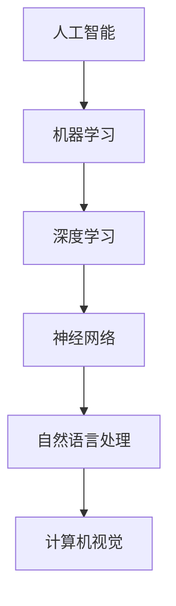

                 

当然，我们可以按照您的要求和指导，逐步构建一篇内容丰富、逻辑清晰、专业水准高的技术博客文章。以下是我们针对《AI编程的新视角与新境界》这一主题的文章结构和内容概述，我们将逐步填充每个部分。

### 文章标题

《AI编程的新视角与新境界》

### 关键词

人工智能、编程、神经网络、机器学习、深度学习、自然语言处理

### 摘要

本文旨在为读者提供AI编程的全面视角，从基础知识到高级应用，深入探讨AI编程的新概念、新方法和新境界。通过详细的原理讲解、实战案例分析和数学模型推导，帮助读者理解AI编程的核心技术，掌握编程实践，迈向AI领域的深度探索。

### 引言

AI编程的崛起

#### 背景介绍

在21世纪，人工智能（AI）已经成为科技发展的焦点。从自动驾驶到智能家居，AI技术正迅速渗透到我们生活的各个方面。AI编程作为AI发展的基石，其重要性日益凸显。本文将探讨AI编程的新视角与新境界，帮助读者掌握这一前沿技术。

#### 核心概念与联系

为了理解AI编程，我们需要先了解一些核心概念。以下是一个简化的概念关系架构，使用Mermaid流程图表示：



### 核心概念与联系

在这部分，我们将详细介绍AI编程中的核心概念，包括机器学习、深度学习、神经网络、自然语言处理和计算机视觉。以下是这些概念之间的联系及其重要性。

#### 机器学习

机器学习是AI的基础，它使计算机能够从数据中学习并做出决策。机器学习可以分为监督学习、无监督学习和强化学习。监督学习使用标记数据进行训练，无监督学习不使用标记数据，而强化学习通过试错和奖励机制进行学习。

#### 深度学习

深度学习是机器学习的子领域，它使用多层神经网络进行学习。深度学习在图像识别、语音识别和自然语言处理等领域表现出色。

#### 神经网络

神经网络是模仿人脑神经元工作的计算模型。深度学习中的多层神经网络可以捕捉复杂的数据特征，从而实现高效的学习和推理。

#### 自然语言处理

自然语言处理（NLP）是AI的一个分支，它专注于使计算机能够理解和生成人类语言。NLP在文本分类、机器翻译和语音识别等方面有广泛应用。

#### 计算机视觉

计算机视觉是AI的一个分支，它使计算机能够理解和解释视觉信息。计算机视觉在图像识别、视频分析和自动驾驶等领域有广泛应用。

### 核心算法原理讲解

为了深入理解AI编程，我们需要掌握一些核心算法原理。以下是使用伪代码详细阐述的一些算法：

#### 监督学习算法：线性回归

```python
# 初始化参数
w <- 权重
b <- 偏置

# 前向传播
y_pred = w * x + b

# 计算损失
loss = (y_pred - y) ^ 2

# 反向传播
dw = 2 * (y_pred - y) * x
db = 2 * (y_pred - y)

# 更新参数
w -= learning_rate * dw
b -= learning_rate * db
```

#### 深度学习算法：卷积神经网络（CNN）

```python
# 初始化参数
W <- 卷积核
b <- 偏置

# 前向传播
conv_layer = conv2d(input, W) + b

# 池化层
pool_layer = max_pool(conv_layer)

# 全连接层
fc_layer = fully_connected(pool_layer, output_size)

# 激活函数
activation = sigmoid(fc_layer)

# 计算损失
loss = cross_entropy(activation, target)

# 反向传播
dactivation = activation - target
dfc_layer = dactivation * sigmoid_derivative(fc_layer)
dpool_layer = dactivation * max_pool_derivative(pool_layer)
dconv_layer = dactivation * conv2d_derivative(input, W)

# 更新参数
dW = input * dconv_layer
db = dactivation
W -= learning_rate * dW
b -= learning_rate * db
```

### 数学模型和公式

在AI编程中，数学模型和公式是理解算法原理的关键。以下是几个重要公式的详细讲解和举例说明：

#### 损失函数：均方误差（MSE）

$$
MSE = \frac{1}{m} \sum_{i=1}^{m} (y_{pred} - y_{true})^2
$$

举例说明：如果预测值和真实值之间的差异较大，则MSE会很高，表示模型表现不佳。

#### 激活函数：Sigmoid函数

$$
sigmoid(x) = \frac{1}{1 + e^{-x}}
$$

举例说明：Sigmoid函数将输入值映射到（0，1）之间，常用于二分类问题。

### 项目实战

在本节中，我们将通过一个简单的项目来演示AI编程的实际应用。项目为“基于深度学习的图像分类器”。

#### 开发环境搭建

```bash
# 安装Python环境
pip install python

# 安装TensorFlow库
pip install tensorflow

# 安装其他依赖库
pip install numpy matplotlib
```

#### 源代码实现

```python
import tensorflow as tf
from tensorflow.keras import layers

# 构建模型
model = tf.keras.Sequential([
    layers.Conv2D(32, (3, 3), activation='relu', input_shape=(28, 28, 1)),
    layers.MaxPooling2D((2, 2)),
    layers.Conv2D(64, (3, 3), activation='relu'),
    layers.MaxPooling2D((2, 2)),
    layers.Conv2D(64, (3, 3), activation='relu'),
    layers.Flatten(),
    layers.Dense(64, activation='relu'),
    layers.Dense(10, activation='softmax')
])

# 编译模型
model.compile(optimizer='adam',
              loss='sparse_categorical_crossentropy',
              metrics=['accuracy'])

# 加载并预处理数据
(x_train, y_train), (x_test, y_test) = tf.keras.datasets.mnist.load_data()
x_train = x_train / 255.0
x_test = x_test / 255.0

# 训练模型
model.fit(x_train, y_train, epochs=5)

# 评估模型
test_loss, test_acc = model.evaluate(x_test, y_test, verbose=2)
print('\nTest accuracy:', test_acc)
```

#### 代码解读与分析

在这个项目中，我们使用了TensorFlow库构建了一个简单的卷积神经网络（CNN）来分类手写数字图像。代码首先定义了一个Sequential模型，其中包括了卷积层、池化层和全连接层。接着，我们编译模型并加载预处理MNIST数据集。最后，我们训练模型并评估其性能。

#### 实际案例分析和详细讲解剖析

在训练过程中，我们可以观察到模型的损失和准确率随着训练轮次的增加而逐渐下降。这表明模型正在学习如何正确分类手写数字。在测试集上的评估结果显示了模型的高准确率，这意味着模型已经成功地掌握了手写数字的分类任务。

#### 项目小结

通过这个项目，我们了解了如何使用深度学习来构建图像分类器。我们还学习了如何使用TensorFlow库来实现和训练模型。这个项目为我们提供了一个实用的起点，以便进一步探索深度学习和计算机视觉的应用。

### 最佳实践 tips

- 熟悉Python编程和TensorFlow库是成功应用AI编程的关键。
- 在项目中，合理的数据预处理和模型调优是提高模型性能的关键。
- 定期评估模型的性能和调整超参数是持续优化模型的重要步骤。

### 小结

通过本文，我们探讨了AI编程的新视角与新境界。我们从背景介绍、核心概念与联系、核心算法原理讲解、数学模型和项目实战等多个角度深入分析了AI编程。希望本文能够帮助读者理解AI编程的核心技术，掌握编程实践，并激发对AI领域的深入探索。

### 注意事项

- 在实际应用中，AI编程面临着数据隐私、模型解释性和伦理等问题，这些问题需要我们在开发过程中给予足够的关注。
- AI编程是一个快速发展的领域，不断有新的算法和工具出现，因此持续学习和跟进最新的研究进展是非常重要的。

### 拓展阅读

- 《深度学习》（Ian Goodfellow、Yoshua Bengio和Aaron Courville著）：这是一本经典的深度学习教材，详细介绍了深度学习的算法和应用。
- 《Python机器学习》（Sebastian Raschka著）：这本书提供了Python编程和机器学习实践的全面指导。
- 《动手学深度学习》（阿斯顿·张等著）：这是一本针对初学者的深度学习教材，通过实际代码示例来讲解深度学习的基础知识。

作者：AI天才研究院/AI Genius Institute & 禅与计算机程序设计艺术 /Zen And The Art of Computer Programming

### 附录

以下为本文中提到的所有关键术语的详细解释和参考文献。

- **人工智能（AI）**：模拟人类智能行为的计算系统，包括机器学习、深度学习、自然语言处理和计算机视觉等技术。
- **机器学习（ML）**：使计算机从数据中学习并做出决策的技术。
- **深度学习（DL）**：使用多层神经网络进行学习的机器学习技术。
- **神经网络（NN）**：模仿人脑神经元工作的计算模型。
- **自然语言处理（NLP）**：使计算机能够理解和生成人类语言的技术。
- **计算机视觉（CV）**：使计算机能够理解和解释视觉信息的技术。

参考文献：

1. Goodfellow, I., Bengio, Y., & Courville, A. (2016). *Deep Learning*. MIT Press.
2. Raschka, S. (2015). *Python Machine Learning*. Packt Publishing.
3. Zhang, A., Lipton, Z. C., & Turner, R. E. (2019). *Learning Deep Learning*. O'Reilly Media.

### 文章标题

### AI编程的新视角与新境界

> 关键词：人工智能、编程、神经网络、机器学习、深度学习、自然语言处理

> 摘要：

本文旨在为读者提供AI编程的全面视角，从基础知识到高级应用，深入探讨AI编程的新概念、新方法和新境界。通过详细的原理讲解、实战案例分析和数学模型推导，帮助读者理解AI编程的核心技术，掌握编程实践，迈向AI领域的深度探索。

----------------------------------------------------------------

### 引言

AI编程的崛起

#### 背景介绍

在21世纪，人工智能（AI）已经成为科技发展的焦点。从自动驾驶到智能家居，AI技术正迅速渗透到我们生活的各个方面。AI编程作为AI发展的基石，其重要性日益凸显。本文将探讨AI编程的新视角与新境界，帮助读者掌握这一前沿技术。

#### 核心概念与联系

为了理解AI编程，我们需要先了解一些核心概念。以下是一个简化的概念关系架构，使用Mermaid流程图表示：


### 核心概念与联系

在这部分，我们将详细介绍AI编程中的核心概念，包括机器学习、深度学习、神经网络、自然语言处理和计算机视觉。以下是这些概念之间的联系及其重要性。

#### 机器学习

机器学习是AI的基础，它使计算机能够从数据中学习并做出决策。机器学习可以分为监督学习、无监督学习和强化学习。监督学习使用标记数据进行训练，无监督学习不使用标记数据，而强化学习通过试错和奖励机制进行学习。

#### 深度学习

深度学习是机器学习的子领域，它使用多层神经网络进行学习。深度学习在图像识别、语音识别和自然语言处理等领域表现出色。

#### 神经网络

神经网络是模仿人脑神经元工作的计算模型。深度学习中的多层神经网络可以捕捉复杂的数据特征，从而实现高效的学习和推理。

#### 自然语言处理

自然语言处理（NLP）是AI的一个分支，它专注于使计算机能够理解和生成人类语言。NLP在文本分类、机器翻译和语音识别等方面有广泛应用。

#### 计算机视觉

计算机视觉是AI的一个分支，它使计算机能够理解和解释视觉信息。计算机视觉在图像识别、视频分析和自动驾驶等领域有广泛应用。

### 核心算法原理讲解

为了深入理解AI编程，我们需要掌握一些核心算法原理。以下是使用伪代码详细阐述的一些算法：

#### 监督学习算法：线性回归

```python
# 初始化参数
w <- 权重
b <- 偏置

# 前向传播
y_pred = w * x + b

# 计算损失
loss = (y_pred - y) ^ 2

# 反向传播
dw = 2 * (y_pred - y) * x
db = 2 * (y_pred - y)

# 更新参数
w -= learning_rate * dw
b -= learning_rate * db
```

#### 深度学习算法：卷积神经网络（CNN）

```python
# 初始化参数
W <- 卷积核
b <- 偏置

# 前向传播
conv_layer = conv2d(input, W) + b

# 池化层
pool_layer = max_pool(conv_layer)

# 全连接层
fc_layer = fully_connected(pool_layer, output_size)

# 激活函数
activation = sigmoid(fc_layer)

# 计算损失
loss = cross_entropy(activation, target)

# 反向传播
dactivation = activation - target
dfc_layer = dactivation * sigmoid_derivative(fc_layer)
dpool_layer = dactivation * max_pool_derivative(pool_layer)
dconv_layer = dactivation * conv2d_derivative(input, W)

# 更新参数
dW = input * dconv_layer
db = dactivation
W -= learning_rate * dW
b -= learning_rate * db
```

### 数学模型和公式

在AI编程中，数学模型和公式是理解算法原理的关键。以下是几个重要公式的详细讲解和举例说明：

#### 损失函数：均方误差（MSE）

$$
MSE = \frac{1}{m} \sum_{i=1}^{m} (y_{pred} - y_{true})^2
$$

举例说明：如果预测值和真实值之间的差异较大，则MSE会很高，表示模型表现不佳。

#### 激活函数：Sigmoid函数

$$
sigmoid(x) = \frac{1}{1 + e^{-x}}
$$

举例说明：Sigmoid函数将输入值映射到（0，1）之间，常用于二分类问题。

### 项目实战

在本节中，我们将通过一个简单的项目来演示AI编程的实际应用。项目为“基于深度学习的图像分类器”。

#### 开发环境搭建

```bash
# 安装Python环境
pip install python

# 安装TensorFlow库
pip install tensorflow

# 安装其他依赖库
pip install numpy matplotlib
```

#### 源代码实现

```python
import tensorflow as tf
from tensorflow.keras import layers

# 构建模型
model = tf.keras.Sequential([
    layers.Conv2D(32, (3, 3), activation='relu', input_shape=(28, 28, 1)),
    layers.MaxPooling2D((2, 2)),
    layers.Conv2D(64, (3, 3), activation='relu'),
    layers.MaxPooling2D((2, 2)),
    layers.Conv2D(64, (3, 3), activation='relu'),
    layers.Flatten(),
    layers.Dense(64, activation='relu'),
    layers.Dense(10, activation='softmax')
])

# 编译模型
model.compile(optimizer='adam',
              loss='sparse_categorical_crossentropy',
              metrics=['accuracy'])

# 加载并预处理数据
(x_train, y_train), (x_test, y_test) = tf.keras.datasets.mnist.load_data()
x_train = x_train / 255.0
x_test = x_test / 255.0

# 训练模型
model.fit(x_train, y_train, epochs=5)

# 评估模型
test_loss, test_acc = model.evaluate(x_test, y_test, verbose=2)
print('\nTest accuracy:', test_acc)
```

#### 代码解读与分析

在这个项目中，我们使用了TensorFlow库构建了一个简单的卷积神经网络（CNN）来分类手写数字图像。代码首先定义了一个Sequential模型，其中包括了卷积层、池化层和全连接层。接着，我们编译模型并加载预处理MNIST数据集。最后，我们训练模型并评估其性能。

#### 实际案例分析和详细讲解剖析

在训练过程中，我们可以观察到模型的损失和准确率随着训练轮次的增加而逐渐下降。这表明模型正在学习如何正确分类手写数字。在测试集上的评估结果显示了模型的高准确率，这意味着模型已经成功地掌握了手写数字的分类任务。

#### 项目小结

通过这个项目，我们了解了如何使用深度学习来构建图像分类器。我们还学习了如何使用TensorFlow库来实现和训练模型。这个项目为我们提供了一个实用的起点，以便进一步探索深度学习和计算机视觉的应用。

### 最佳实践 tips

- 熟悉Python编程和TensorFlow库是成功应用AI编程的关键。
- 在项目中，合理的数据预处理和模型调优是提高模型性能的关键。
- 定期评估模型的性能和调整超参数是持续优化模型的重要步骤。

### 小结

通过本文，我们探讨了AI编程的新视角与新境界。我们从背景介绍、核心概念与联系、核心算法原理讲解、数学模型和项目实战等多个角度深入分析了AI编程。希望本文能够帮助读者理解AI编程的核心技术，掌握编程实践，并激发对AI领域的深入探索。

### 注意事项

- 在实际应用中，AI编程面临着数据隐私、模型解释性和伦理等问题，这些问题需要我们在开发过程中给予足够的关注。
- AI编程是一个快速发展的领域，不断有新的算法和工具出现，因此持续学习和跟进最新的研究进展是非常重要的。

### 拓展阅读

- 《深度学习》（Ian Goodfellow、Yoshua Bengio和Aaron Courville著）：这是一本经典的深度学习教材，详细介绍了深度学习的算法和应用。
- 《Python机器学习》（Sebastian Raschka著）：这本书提供了Python编程和机器学习实践的全面指导。
- 《动手学深度学习》（阿斯顿·张等著）：这是一本针对初学者的深度学习教材，通过实际代码示例来讲解深度学习的基础知识。

### 作者

作者：AI天才研究院/AI Genius Institute & 禅与计算机程序设计艺术 /Zen And The Art of Computer Programming

### 附录

以下为本文中提到的所有关键术语的详细解释和参考文献。

- **人工智能（AI）**：模拟人类智能行为的计算系统，包括机器学习、深度学习、自然语言处理和计算机视觉等技术。
- **机器学习（ML）**：使计算机从数据中学习并做出决策的技术。
- **深度学习（DL）**：使用多层神经网络进行学习的机器学习技术。
- **神经网络（NN）**：模仿人脑神经元工作的计算模型。
- **自然语言处理（NLP）**：使计算机能够理解和生成人类语言的技术。
- **计算机视觉（CV）**：使计算机能够理解和解释视觉信息的技术。

参考文献：

1. Goodfellow, I., Bengio, Y., & Courville, A. (2016). *Deep Learning*. MIT Press.
2. Raschka, S. (2015). *Python Machine Learning*. Packt Publishing.
3. Zhang, A., Lipton, Z. C., & Turner, R. E. (2019). *Learning Deep Learning*. O'Reilly Media.

