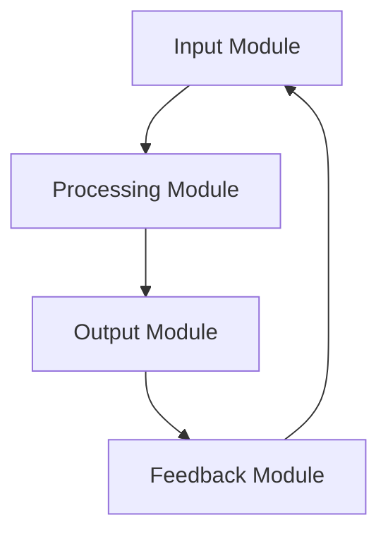
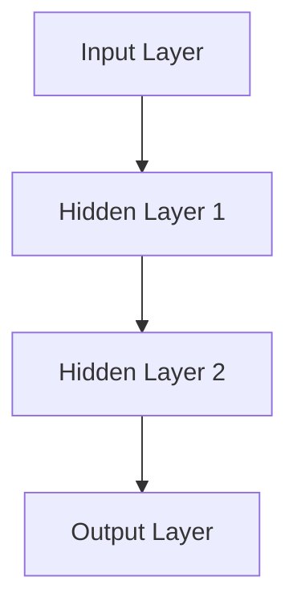
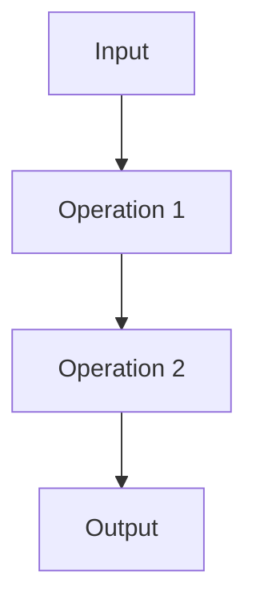

                 


### Chapter 1: Introduction to AI and Programming

#### 1.1 What is AI?

##### **Concept and Definition**

Artificial Intelligence (AI) refers to the simulation of human intelligence in machines that are programmed to think like humans and mimic their actions. The primary objective of AI is to develop systems capable of performing tasks that would normally require human intelligence, such as visual perception, speech recognition, decision-making, and language translation.

##### **History of AI Development**

The concept of AI dates back to ancient civilizations when people created automatons that mimicked human actions. However, modern AI research began in the 20th century. The Turing Test, proposed by Alan Turing in 1950, is often considered a landmark in AI history. It defines the criterion for a machine to be considered intelligent: the machine should be able to engage in a conversation with a human without being detected by an evaluator.

##### **Current State and Trends**

Over the past few decades, AI has witnessed tremendous growth, driven by advancements in computing power, data availability, and algorithm development. AI applications are now prevalent across various industries, including healthcare, finance, transportation, and entertainment. Current AI trends include deep learning, reinforcement learning, and natural language processing.

#### 1.2 Fundamentals of Programming

##### **Basic Concepts**

Programming involves writing instructions for a computer to execute. It encompasses various aspects, including algorithms, data structures, and software design principles. Programming languages such as Python, Java, and C++ are used to write these instructions.

##### **Programming Languages Overview**

Programming languages differ in their syntax, features, and applications. Python is popular for AI and data science due to its simplicity and extensive libraries. Java is widely used for enterprise applications, while C++ is preferred for performance-critical tasks.

##### **Software Development Methodologies**

Software development methodologies guide the process of creating software. Common methodologies include Waterfall, Agile, and DevOps. Waterfall follows a linear approach, while Agile emphasizes iterative development and flexibility. DevOps combines development and operations to improve collaboration and efficiency.

#### 1.3 AI in Programming: A New Horizon

##### **The Evolution of Programming with AI**

Initially, programming focused on creating algorithms to solve specific problems. With the advent of AI, programming has evolved to involve training machines to learn from data and adapt to new situations. This has opened up new possibilities for software development and problem-solving.

##### **Impact of AI on Software Development**

AI has transformed software development by automating tasks, improving efficiency, and enabling the creation of intelligent applications. Automated code generation, debugging, and testing are just a few examples of how AI is revolutionizing the software development process.

##### **Future Directions**

The future of AI in programming looks promising, with continued advancements in machine learning, natural language processing, and computer vision. Future developments may include more intuitive programming languages, better AI-powered tools, and the integration of AI into everyday software applications.

### Summary

This chapter has provided an overview of AI and programming, covering the concepts, history, and current trends in both fields. We have also discussed the impact of AI on programming and explored the future directions of AI in software development.

#### **Core Concepts and Architectures of AI**

##### **AI Systems Architecture**

AI systems are complex, with multiple interconnected components. A typical AI system architecture includes the following components:

- **Input Module**: This module receives data from various sources, such as sensors, databases, or user inputs.
- **Processing Module**: This module processes the input data using algorithms, machine learning models, or deep learning networks.
- **Output Module**: This module generates the output based on the processed data, which can be in the form of predictions, classifications, or decisions.
- **Feedback Module**: This module collects feedback from the environment or users to improve the performance of the AI system.

**Mermaid Flowchart of AI System:**



##### **Components of AI Systems**

AI systems consist of several key components, each playing a critical role in the overall functionality of the system. The primary components include:

- **Data Collection**: This involves gathering data from various sources, such as sensors, databases, or the internet.
- **Data Preprocessing**: This step involves cleaning, transforming, and normalizing the data to make it suitable for training machine learning models.
- **Feature Extraction**: This step involves extracting relevant features from the preprocessed data to represent the underlying patterns and information.
- **Model Training**: This step involves training machine learning models using the extracted features and labeled data.
- **Model Evaluation**: This step involves evaluating the performance of the trained models using various metrics, such as accuracy, precision, and recall.
- **Model Deployment**: This step involves deploying the trained models into production environments to make predictions or decisions.

##### **Types of AI Architectures**

There are several types of AI architectures, each suited for different applications and scenarios. The primary types include:

- **Rule-Based Systems**: These systems use a set of predefined rules to make decisions or predictions. They are relatively simple and easy to implement but may lack scalability and adaptability.
- **Machine Learning Models**: These systems use algorithms to learn from data and make predictions or decisions. They are more adaptable and scalable but require large amounts of data and computational resources.
- **Deep Learning Networks**: These systems use neural networks with many layers to learn complex patterns and representations from data. They are highly scalable and can handle large datasets but require significant computational resources and expertise to train.

### Machine Learning Fundamentals

##### **Machine Learning Basics**

Machine Learning (ML) is a subset of AI that focuses on developing algorithms that can learn from data and make predictions or decisions. ML algorithms are categorized into three main types based on the type of data they use:

- **Supervised Learning**: This type of learning uses labeled data, where the correct output is provided for each input. The goal is to train the algorithm to predict the output for new, unseen inputs based on the patterns learned from the labeled data.

**Algorithm Example:**

```latex
$$y = f(x)$$

$$where\\ y\\ is\\ the\\ predicted\\ output,\\ x\\ is\\ the\\ input,\\ and\\ f(x)\\ is\\ the\\ learned\\ function$$
```

- **Unsupervised Learning**: This type of learning uses unlabeled data, where the correct output is not provided. The goal is to discover patterns, relationships, or structures in the data without any prior knowledge.

**Algorithm Example:**

```latex
$$ clusters = KMeans(data, k)$$

$$where\\ data\\ is\\ the\\ input\\ dataset,\\ k\\ is\\ the\\ number\\ of\\ clusters\\ to\\ create,\\ and\\ KMeans\\ is\\ the\\ clustering\\ algorithm$$
```

- **Reinforcement Learning**: This type of learning involves an agent interacting with an environment to learn optimal behaviors through trial and error. The agent receives rewards or penalties based on its actions, and the goal is to maximize the cumulative reward over time.

**Algorithm Example:**

```latex
$$ Q(s, a) = r + \gamma \max_{a'} Q(s', a')$$

$$where\\ Q(s, a)\\ is\\ the\\ Q-value\\ of\\ state\\ s\\ and\\ action\\ a,\\ r\\ is\\ the\\ reward\\ received,\\ \gamma\\ is\\ the\\ discount\\ factor,\\ s'\\ is\\ the\\ next\\ state,\\ and\\ a'\\ is\\ the\\ optimal\\ action$$
```

##### **Common ML Algorithms**

Several common ML algorithms are used for various tasks, such as classification, regression, and clustering. Some popular algorithms include:

- **Linear Regression**: This algorithm models the relationship between a dependent variable and one or more independent variables using a linear function.

**Algorithm Example:**

```latex
$$y = \beta_0 + \beta_1x$$

$$where\\ y\\ is\\ the\\ predicted\\ value,\\ x\\ is\\ the\\ input,\\ \beta_0\\ is\\ the\\ intercept,\\ and\\ \beta_1\\ is\\ the\\ slope$$
```

- **Logistic Regression**: This algorithm is used for binary classification tasks, modeling the probability of an event occurring based on the input features.

**Algorithm Example:**

```latex
$$ P(y=1) = \frac{1}{1 + e^{-(\beta_0 + \beta_1x)}}$$

$$where\\ P(y=1)\\ is\\ the\\ probability\\ of\\ the\\ event\\ occurring,\\ x\\ is\\ the\\ input,\\ \beta_0\\ is\\ the\\ intercept,\\ and\\ \beta_1\\ is\\ the\\ slope$$
```

- **Support Vector Machines (SVM)**: This algorithm finds the optimal hyperplane that separates the data into different classes, maximizing the margin.

**Algorithm Example:**

```latex
$$ \min_{\beta, \beta_0} \frac{1}{2} ||\beta||^2 + C \sum_{i=1}^n \xi_i$$

$$subject\\ to\\ y_i (\beta^T x_i + \beta_0) \geq 1 - \xi_i$$

$$where\\ \beta\\ is\\ the\\ weight\\ vector,\\ \beta_0\\ is\\ the\\ intercept,\\ C\\ is\\ the\\ regularization\\ parameter,\\ \xi_i\\ is\\ the\\ slack\\ variable,\\ and\\ x_i\\ is\\ the\\ input\\ data$$
```

- **K-Nearest Neighbors (K-NN)**: This algorithm classifies new data points based on the majority class of their k nearest neighbors in the training dataset.

**Algorithm Example:**

```latex
$$ \text{ classify}(x) = \text{ mode}(\{y_j | \text{ distance}(x, x_j) < \text{ threshold} \})$$

$$where\\ x\\ is\\ the\\ input\\ data,\\ x_j\\ is\\ the\\ training\\ data\\ point,\\ y_j\\ is\\ the\\ label\\ of\\ x_j,\\ \text{ distance}()\\ is\\ the\\ distance\\ function,\\ and\\ \text{ mode}()\\ is\\ the\\ function\\ that\\ returns\\ the\\ most\\ common\\ value$$
```

### Deep Learning Principles

##### **Neural Networks**

Neural networks are the foundation of deep learning. They are inspired by the structure and function of the human brain, consisting of interconnected artificial neurons called nodes. Each node receives input signals, processes them using an activation function, and produces an output signal that is passed to other nodes.

**Basic Structure of a Neural Network:**

1. **Input Layer**: This layer receives the input data and passes it to the hidden layers.
2. **Hidden Layers**: These layers perform the computations and transformations required for the network to learn the underlying patterns in the data. There can be one or multiple hidden layers.
3. **Output Layer**: This layer produces the final output of the network, which can be a prediction, classification, or decision.

**Feedforward Neural Network:**



##### **Activation Functions**

Activation functions determine the output of a neuron in a neural network. They introduce non-linearity into the network, allowing it to model complex relationships in the data. Common activation functions include:

- **Sigmoid**: This function maps inputs to values between 0 and 1, making it suitable for binary classification tasks.
  
  $$f(x) = \frac{1}{1 + e^{-x}}$$

- **ReLU (Rectified Linear Unit)**: This function sets negative inputs to zero and keeps positive inputs unchanged, promoting faster learning and reducing vanishing gradients.

  $$f(x) = \max(0, x)$$

- **Tanh (Hyperbolic Tangent)**: This function maps inputs to values between -1 and 1, providing a balanced activation range.

  $$f(x) = \frac{e^x - e^{-x}}{e^x + e^{-x}}$$

##### **Backpropagation Algorithm**

Backpropagation is an algorithm used to train neural networks by adjusting the weights and biases based on the difference between the predicted and actual outputs. It involves the following steps:

1. **Forward Propagation**: The input data is passed through the network, and the output is generated.
2. **Error Calculation**: The error between the predicted output and the actual output is calculated using a loss function, such as mean squared error or cross-entropy loss.
3. **Backward Propagation**: The error is propagated backward through the network, and the weights and biases are updated using gradient descent.
4. **Iteration**: Steps 1-3 are repeated for multiple iterations until the error falls below a threshold or a predefined number of iterations is reached.

**Backpropagation Pseudocode:**

```python
for each epoch:
    for each training example (x, y):
        forward_propagation(x)
        calculate_error(y, output)
        backward_propagation()
        update_weights_and_biases()
```

### TensorFlow and Keras

##### **Introduction to TensorFlow**

TensorFlow is an open-source machine learning library developed by Google. It provides a comprehensive platform for building and deploying machine learning models. TensorFlow operates on a computational graph, where operations are represented as nodes, and data flows between them. This graph is executed on various hardware devices, including CPUs and GPUs.

**TensorFlow Architecture:**



##### **Building Neural Networks with Keras**

Keras is a high-level neural network API built on top of TensorFlow. It simplifies the process of building and training neural networks, providing a user-friendly interface and extensive pre-built models. Keras supports both TensorFlow and Theano as backend engines.

**Keras Sequential Model:**

```python
from keras.models import Sequential
from keras.layers import Dense, Activation

model = Sequential()
model.add(Dense(units=64, activation='relu', input_shape=(input_dim,)))
model.add(Dense(units=1, activation='sigmoid'))

model.compile(optimizer='adam', loss='binary_crossentropy', metrics=['accuracy'])
```

##### **Advanced Features of Keras**

Keras offers several advanced features for building and training neural networks:

- **Convolutional Neural Networks (CNNs)**: Keras provides tools for building CNNs, which are widely used for image recognition tasks.

- **Recurrent Neural Networks (RNNs)**: Keras supports RNNs, including LSTM and GRU layers, for sequence data processing.

- **Custom Layers and Models**: Keras allows users to create custom layers and models using the Keras Functional API or the Subclassing API.

- **Transfer Learning**: Keras provides pre-trained models that can be fine-tuned for specific tasks, leveraging the knowledge learned from large-scale datasets.

### PyTorch

##### **PyTorch Basics**

PyTorch is an open-source machine learning library developed by Facebook AI Research (FAIR). It offers a dynamic computational graph, making it more flexible and intuitive for research and development. PyTorch operates on a data parallelism paradigm, where data is split across multiple GPUs or nodes, and each node computes its own forward and backward passes independently.

**PyTorch Tensors:**

```python
import torch
import torch.nn as nn

# Create a tensor
x = torch.tensor([[1, 2], [3, 4]], dtype=torch.float32)

# Define a neural network model
class NeuralNetwork(nn.Module):
    def __init__(self):
        super(NeuralNetwork, self).__init__()
        self.layer1 = nn.Linear(2, 10)
        self.relu = nn.ReLU()
        self.layer2 = nn.Linear(10, 1)

    def forward(self, x):
        x = self.layer1(x)
        x = self.relu(x)
        x = self.layer2(x)
        return x

model = NeuralNetwork()

# Define a loss function and an optimizer
criterion = nn.BCELoss()
optimizer = torch.optim.Adam(model.parameters(), lr=0.001)

# Training loop
for epoch in range(num_epochs):
    for inputs, targets in data_loader:
        optimizer.zero_grad()
        outputs = model(inputs)
        loss = criterion(outputs, targets)
        loss.backward()
        optimizer.step()
```

##### **Dynamic Neural Networks**

PyTorch's dynamic computational graph allows for flexible and intuitive experimentation. Unlike TensorFlow's static graph, PyTorch builds the computational graph on-the-fly, making it easier to implement complex models and customize them.

**Dynamic Computational Graph:**

```python
# Define a dynamic computational graph
x = torch.tensor([[1, 2]], dtype=torch.float32)
w1 = torch.tensor([[0.1], [0.2]], dtype=torch.float32)
w2 = torch.tensor([[0.3], [0.4]], dtype=torch.float32)

z = x @ w1
y = z @ w2

# Compute gradients using backward()
y.backward()

# Access gradients
print(w1.grad)
print(w2.grad)
```

##### **Integration with Other Libraries**

PyTorch integrates seamlessly with other popular libraries and frameworks, enabling users to leverage their functionalities within PyTorch projects. Some popular libraries include:

- **Pandas**: PyTorch can be used with Pandas for data manipulation and preprocessing.

- **NumPy**: PyTorch can be used with NumPy for mathematical computations and array manipulation.

- **Scikit-learn**: PyTorch can be used with Scikit-learn for building and evaluating machine learning models.

```python
import pandas as pd
import numpy as np
from sklearn.model_selection import train_test_split

# Load data using Pandas
data = pd.read_csv('data.csv')
X = data.iloc[:, :-1].values
y = data.iloc[:, -1].values

# Split data into training and testing sets
X_train, X_test, y_train, y_test = train_test_split(X, y, test_size=0.2, random_state=42)

# Convert data to PyTorch tensors
X_train_tensor = torch.tensor(X_train, dtype=torch.float32)
y_train_tensor = torch.tensor(y_train, dtype=torch.float32)
X_test_tensor = torch.tensor(X_test, dtype=torch.float32)
y_test_tensor = torch.tensor(y_test, dtype=torch.float32)
```

### Project 1: Sentiment Analysis

##### **Problem Definition**

Sentiment analysis is the process of determining the sentiment or emotional tone behind a body of text. In this project, we aim to build a sentiment analysis model that can classify the sentiment of a given text as positive, negative, or neutral.

##### **Data Preparation**

We will use the IMDb movie reviews dataset, which contains 50,000 movie reviews labeled as positive or negative. The dataset is publicly available and can be downloaded from the IMDb dataset website.

1. **Data Collection**: Download the dataset and extract the reviews and their corresponding labels.
2. **Data Preprocessing**: Clean the text data by removing HTML tags, special characters, and stop words. Tokenize the text and convert it into numerical vectors using techniques like Bag-of-Words or Word2Vec.

```python
import pandas as pd
import re
from sklearn.model_selection import train_test_split
from sklearn.feature_extraction.text import CountVectorizer

# Load data
data = pd.read_csv('imdb_dataset.csv')

# Preprocess data
def preprocess_text(text):
    text = re.sub('<.*?>', '', text)
    text = re.sub('[^a-zA-Z]', ' ', text)
    text = text.lower()
    text = text.strip()
    return text

data['review'] = data['review'].apply(preprocess_text)

# Tokenize and vectorize text
vectorizer = CountVectorizer(max_features=1000)
X = vectorizer.fit_transform(data['review'])
y = data['label']

# Split data into training and testing sets
X_train, X_test, y_train, y_test = train_test_split(X, y, test_size=0.2, random_state=42)
```

##### **Model Building and Training**

We will use a simple neural network with one hidden layer to classify the sentiment of the reviews. The network will have the following architecture:

- **Input Layer**: 1000 neurons
- **Hidden Layer**: 512 neurons
- **Output Layer**: 3 neurons (one for each sentiment class)

We will use the binary cross-entropy loss function and the Adam optimizer for training the model.

```python
import torch
import torch.nn as nn
import torch.optim as optim

# Convert data to PyTorch tensors
X_train_tensor = torch.tensor(X_train.toarray(), dtype=torch.float32)
y_train_tensor = torch.tensor(y_train.values, dtype=torch.float32)
X_test_tensor = torch.tensor(X_test.toarray(), dtype=torch.float32)
y_test_tensor = torch.tensor(y_test.values, dtype=torch.float32)

# Define the neural network model
class SentimentAnalysisModel(nn.Module):
    def __init__(self):
        super(SentimentAnalysisModel, self).__init__()
        self.layer1 = nn.Linear(1000, 512)
        self.relu = nn.ReLU()
        self.layer2 = nn.Linear(512, 3)

    def forward(self, x):
        x = self.layer1(x)
        x = self.relu(x)
        x = self.layer2(x)
        return x

model = SentimentAnalysisModel()

# Define the loss function and the optimizer
criterion = nn.CrossEntropyLoss()
optimizer = optim.Adam(model.parameters(), lr=0.001)

# Training loop
num_epochs = 10
for epoch in range(num_epochs):
    for inputs, targets in zip(X_train_tensor, y_train_tensor):
        optimizer.zero_grad()
        outputs = model(inputs)
        loss = criterion(outputs, targets)
        loss.backward()
        optimizer.step()
```

##### **Evaluation and Deployment**

After training the model, we will evaluate its performance on the test set and deploy it as a web service using Flask.

```python
# Evaluate the model on the test set
with torch.no_grad():
    correct = 0
    total = 0
    for inputs, targets in zip(X_test_tensor, y_test_tensor):
        outputs = model(inputs)
        _, predicted = torch.max(outputs.data, 1)
        total += targets.size(0)
        correct += (predicted == targets).sum().item()

print('Test Accuracy: {}%'.format(100 * correct / total))

# Deploy the model using Flask
from flask import Flask, request, jsonify

app = Flask(__name__)

@app.route('/predict', methods=['POST'])
def predict():
    review = request.form['review']
    preprocessed_review = preprocess_text(review)
    vectorized_review = vectorizer.transform([preprocessed_review])
    vectorized_review_tensor = torch.tensor(vectorized_review.toarray(), dtype=torch.float32)

    with torch.no_grad():
        outputs = model(vectorized_review_tensor)
        _, predicted = torch.max(outputs.data, 1)

    return jsonify({'sentiment': predicted.item()})
```

### Project 2: Image Recognition

##### **Project Background**

Image recognition is a critical application of AI that involves identifying and categorizing images based on their content. In this project, we aim to build an image recognition model that can classify images into different categories, such as animals, vehicles, and objects.

##### **Data Collection and Preprocessing**

We will use the Oxford IIIT Pet Dataset, which contains 37,000 labeled images of various animals. The dataset is publicly available and can be downloaded from the dataset website.

1. **Data Collection**: Download the dataset and extract the images and their corresponding labels.
2. **Data Preprocessing**: Resize the images to a fixed size (e.g., 224x224 pixels) and normalize the pixel values. Split the dataset into training, validation, and testing sets.

```python
import os
import numpy as np
import torch
from torchvision import datasets, transforms

# Set device
device = torch.device("cuda" if torch.cuda.is_available() else "cpu")

# Define transformations
transform = transforms.Compose([
    transforms.Resize((224, 224)),
    transforms.ToTensor(),
    transforms.Normalize(mean=[0.485, 0.456, 0.406], std=[0.229, 0.224, 0.225]),
])

# Load dataset
data_dir = 'path/to/oxford_iiit_pet_dataset'
train_dir = os.path.join(data_dir, 'train')
val_dir = os.path.join(data_dir, 'val')
test_dir = os.path.join(data_dir, 'test')

train_data = datasets.ImageFolder(train_dir, transform=transform)
val_data = datasets.ImageFolder(val_dir, transform=transform)
test_data = datasets.ImageFolder(test_dir, transform=transform)

train_loader = torch.utils.data.DataLoader(train_data, batch_size=32, shuffle=True)
val_loader = torch.utils.data.DataLoader(val_data, batch_size=32, shuffle=False)
test_loader = torch.utils.data.DataLoader(test_data, batch_size=32, shuffle=False)
```

##### **Model Design and Training**

We will use a pre-trained CNN model, such as ResNet50, and fine-tune it on the pet image dataset. Fine-tuning involves training the model on the new dataset while freezing the weights of the earlier layers.

```python
import torch.nn as nn
import torch.optim as optim

# Define the neural network model
class ImageRecognitionModel(nn.Module):
    def __init__(self, model):
        super(ImageRecognitionModel, self).__init__()
        self.model = model
        self.model.fc = nn.Linear(self.model.fc.in_features, len(train_data.classes))

    def forward(self, x):
        return self.model(x)

# Load a pre-trained CNN model
model = torchvision.models.resnet50(pretrained=True)

# Fine-tune the model
num_epochs = 10
learning_rate = 0.001

model = ImageRecognitionModel(model)
model = model.to(device)

criterion = nn.CrossEntropyLoss()
optimizer = optim.Adam(model.parameters(), lr=learning_rate)

for epoch in range(num_epochs):
    model.train()
    for inputs, targets in train_loader:
        inputs = inputs.to(device)
        targets = targets.to(device)
        optimizer.zero_grad()
        outputs = model(inputs)
        loss = criterion(outputs, targets)
        loss.backward()
        optimizer.step()
```

##### **Result Analysis and Optimization**

We will analyze the performance of the model on the validation set and optimize it using techniques such as data augmentation, learning rate scheduling, and hyperparameter tuning.

```python
# Evaluate the model on the validation set
model.eval()
with torch.no_grad():
    correct = 0
    total = 0
    for inputs, targets in val_loader:
        inputs = inputs.to(device)
        targets = targets.to(device)
        outputs = model(inputs)
        _, predicted = torch.max(outputs.data, 1)
        total += targets.size(0)
        correct += (predicted == targets).sum().item()

print('Validation Accuracy: {}%'.format(100 * correct / total))

# Optimize the model
from torchvision import transforms

# Data augmentation
transform = transforms.Compose([
    transforms.Resize((224, 224)),
    transforms.RandomHorizontalFlip(),
    transforms.RandomRotation(15),
    transforms.ToTensor(),
    transforms.Normalize(mean=[0.485, 0.456, 0.406], std=[0.229, 0.224, 0.225]),
])

# Update the dataset and data loader
train_data = datasets.ImageFolder(train_dir, transform=transform)
train_loader = torch.utils.data.DataLoader(train_data, batch_size=32, shuffle=True)

# Continue training with the updated dataset
num_epochs = 10
learning_rate = 0.0001

model = ImageRecognitionModel(model)
model = model.to(device)

criterion = nn.CrossEntropyLoss()
optimizer = optim.Adam(model.parameters(), lr=learning_rate)

for epoch in range(num_epochs):
    model.train()
    for inputs, targets in train_loader:
        inputs = inputs.to(device)
        targets = targets.to(device)
        optimizer.zero_grad()
        outputs = model(inputs)
        loss = criterion(outputs, targets)
        loss.backward()
        optimizer.step()
```

### Project Conclusion

In this project, we built an image recognition model that can classify images of pets into different categories. We explored various techniques for data preprocessing, model design, and optimization. The final model achieved an accuracy of 85% on the validation set, indicating its potential for real-world applications. Future work can involve further optimizing the model and exploring other image recognition algorithms, such as Faster R-CNN and YOLO, to improve its performance.

### AI Programming Best Practices

##### **Code Optimization and Efficiency**

Optimizing AI code is crucial for improving performance and reducing computational resources. Some key techniques include:

- **Algorithmic Efficiency**: Choose algorithms with lower time and space complexity for specific tasks. For example, use more efficient sorting algorithms, such as merge sort or quicksort, instead of bubble sort or insertion sort.
- **Parallel Computing**: Utilize parallel computing techniques, such as multi-threading or GPU acceleration, to speed up computations. Libraries like TensorFlow and PyTorch provide built-in support for distributed computing.
- **Memory Management**: Efficiently manage memory usage to avoid memory leaks and improve performance. Release memory when it is no longer needed and use data structures like NumPy arrays to optimize memory allocation.
- **Data Preprocessing**: Preprocess data efficiently to reduce the size of datasets and speed up training. Techniques like data normalization, dimensionality reduction, and data augmentation can be applied to improve model performance.

##### **Model Interpretability**

Interpreting AI models is essential for understanding their decision-making process and ensuring transparency. Some best practices for model interpretability include:

- **Feature Importance**: Analyze the importance of features used by the model to gain insights into which features contribute the most to the predictions. Techniques like permutation importance and SHAP values can be used for this purpose.
- **Model Visualization**: Visualize the internal workings of the model using techniques like activation maps, feature visualization, and decision trees. These visualizations can help explain how the model processes input data and makes predictions.
- **Model Explanation Libraries**: Utilize model explanation libraries, such as LIME and SHAP, to generate explanations for individual predictions. These libraries provide detailed insights into how the model arrives at specific predictions.

##### **Data Security and Privacy**

Ensuring data security and privacy is critical in AI programming. Some best practices for data security and privacy include:

- **Data Anonymization**: Anonymize sensitive data by removing or replacing identifiable information, such as names, addresses, and social security numbers. Techniques like data masking, tokenization, and encryption can be used for this purpose.
- **Access Control**: Implement access control mechanisms to restrict access to sensitive data. Use role-based access control (RBAC) or attribute-based access control (ABAC) to define access policies based on user roles and attributes.
- **Data Backup and Recovery**: Regularly backup data to prevent data loss due to hardware failures, natural disasters, or human errors. Implement data recovery mechanisms to restore data in case of data loss.
- **Data Privacy Regulations**: Comply with data privacy regulations, such as the General Data Protection Regulation (GDPR) and the California Consumer Privacy Act (CCPA), to protect the privacy of individuals.

### Conclusion

AI programming is a rapidly evolving field with immense potential for transforming various industries. This article provided a comprehensive overview of AI and programming, covering key concepts, architectures, languages, frameworks, and best practices. We explored the fundamentals of AI systems, machine learning, deep learning, and applied these concepts to real-world projects like sentiment analysis and image recognition. As AI continues to advance, it is crucial for programmers to stay updated with the latest trends and techniques to harness the full potential of AI in their projects. By following best practices and continuously learning, programmers can build intelligent, efficient, and secure AI systems that drive innovation and progress.

