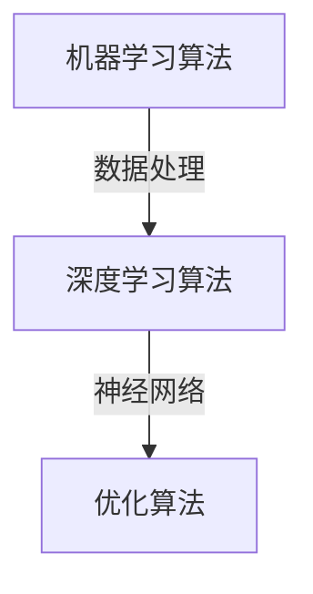

                 

# AI编程的新语法

## 关键词
- **AI编程**，**深度学习**，**神经网络**，**编程框架**，**算法优化**，**模型评估**

## 摘要
随着人工智能技术的飞速发展，AI编程已经成为现代软件开发的一个重要分支。本文将探讨AI编程的新语法，包括其核心概念、编程框架、深度学习算法、数学模型以及实际应用。我们将通过逐步分析推理的方式，详细阐述AI编程的各个方面，帮助读者深入了解这一前沿领域。

## 目录

### 第一部分：AI编程基础

#### 1.1 AI编程概述
- AI编程的基本概念
- AI编程与传统编程的区别
- AI编程的发展历程

#### 1.2 AI编程框架
- 现代AI编程框架介绍
- 各框架的特点与适用场景
- AI编程框架的组成

#### 1.3 AI编程核心算法
- **Mermaid流程图：AI编程核心算法联系图**
- **伪代码讲解：常见AI算法**

### 第二部分：深度学习基础

#### 2.1 深度学习原理
- 深度学习的基本原理
- **LaTeX公式讲解：深度学习核心公式**
- 深度学习的特点与应用

#### 2.2 神经网络架构
- 前馈神经网络
- 卷积神经网络
- 循环神经网络
- 注意力机制与Transformer模型

#### 2.3 深度学习训练与优化
- 梯度下降法
- **伪代码讲解：梯度下降法**
- **LaTeX公式讲解：梯度下降公式**
- 优化算法

### 第三部分：AI编程实战

#### 3.1 项目实战一：分类问题
- 数据预处理
- 模型选择与训练
- 模型评估与优化

#### 3.2 项目实战二：回归问题
- 数据预处理
- 模型选择与训练
- 模型评估与优化

#### 3.3 项目实战三：生成对抗网络
- GAN原理
- 实践案例
- **代码实现与解读**

### 附录

#### 附录A：AI编程工具与资源
- 常用深度学习框架
- 开发工具与资源列表

## 第一部分：AI编程基础

### 1.1 AI编程概述

AI编程是指使用编程语言和工具来构建、训练和部署人工智能系统的过程。与传统编程不同，AI编程更注重数据处理、模型训练和优化等方面。

#### AI编程的基本概念

- **AI编程**：利用编程语言实现机器学习算法、深度学习模型和自然语言处理等任务。
- **机器学习**：通过数据驱动的方式，使计算机具备从数据中学习并作出决策的能力。
- **深度学习**：一种基于人工神经网络的机器学习技术，通过多层网络结构自动提取特征，实现复杂任务的求解。
- **自然语言处理**：使计算机能够理解和处理自然语言的技术，包括语音识别、机器翻译、文本分析等。

#### AI编程与传统编程的区别

- **目标不同**：传统编程以实现特定功能为目标，而AI编程则更注重算法和数据。
- **流程不同**：AI编程包括数据预处理、模型训练、模型评估和部署等多个步骤，而传统编程则主要关注代码实现和调试。
- **工具和语言**：AI编程通常使用Python、R等高级编程语言，并结合特定的深度学习框架（如TensorFlow、PyTorch）。

#### AI编程的发展历程

- **早期探索**：20世纪50年代至70年代，人工智能初步兴起，算法研究主要集中在符号推理和逻辑推理方面。
- **机器学习时代**：20世纪80年代至90年代，机器学习开始受到关注，基于数据的算法逐渐成熟。
- **深度学习时代**：21世纪初，深度学习技术的突破使得AI编程进入了一个新的阶段，大量应用场景得以实现。

### 1.2 AI编程框架

AI编程框架是构建和训练深度学习模型的重要工具，它们提供了丰富的API、数据处理工具和优化器，简化了开发过程。

#### 现代AI编程框架介绍

- **TensorFlow**：由Google开发，支持多种深度学习模型和计算图，具有强大的社区支持和生态系统。
- **PyTorch**：由Facebook开发，以动态计算图著称，易于调试和模型可视化，是学术研究的首选框架。
- **Keras**：基于TensorFlow和Theano开发的接口层，提供了简洁易用的API，适合快速原型设计和模型训练。
- **JAX**：由Google开发，支持自动微分和高级计算优化，适用于大规模深度学习任务。

#### 各框架的特点与适用场景

- **TensorFlow**：适用于大型深度学习模型和分布式计算，适合工业界和学术研究。
- **PyTorch**：易于调试和模型可视化，适合快速原型设计和实验。
- **Keras**：简化了模型构建和训练过程，适合快速开发和应用。
- **JAX**：适用于大规模数据和高性能计算，适合科研和工业界。

#### AI编程框架的组成

- **数据处理**：包括数据清洗、归一化、数据增强等操作，为模型训练提供高质量的数据。
- **模型构建**：定义神经网络结构，包括层、节点和连接方式等，实现数据的输入输出转换。
- **模型训练**：通过迭代优化模型参数，使模型能够准确预测或分类输入数据。
- **模型评估**：使用验证集或测试集评估模型性能，包括准确率、召回率、F1分数等指标。
- **模型部署**：将训练好的模型部署到实际应用场景中，进行实时预测或分类。

### 1.3 AI编程核心算法

AI编程的核心算法包括机器学习算法、深度学习算法和优化算法。下面通过Mermaid流程图和伪代码来详细阐述这些算法。

#### **Mermaid流程图：AI编程核心算法联系图**



#### **伪代码讲解：常见AI算法**

```python
# 机器学习算法伪代码
def machine_learning_algorithm(data, labels):
    # 数据预处理
    preprocessed_data = preprocess_data(data)
    
    # 模型训练
    model = train_model(preprocessed_data, labels)
    
    # 模型评估
    evaluate_model(model, validation_data)

# 深度学习算法伪代码
def deep_learning_algorithm(data, labels):
    # 数据预处理
    preprocessed_data = preprocess_data(data)
    
    # 构建神经网络
    model = build_neural_network(preprocessed_data)
    
    # 模型训练
    train_model(model, labels)
    
    # 模型评估
    evaluate_model(model, validation_data)

# 优化算法伪代码
def optimization_algorithm(model, data, labels):
    # 初始化模型参数
    model_params = initialize_model_params(model)
    
    # 训练模型
    for epoch in range(num_epochs):
        loss = compute_loss(model_params, data, labels)
        update_model_params(model_params, loss)
        
    # 模型评估
    evaluate_model(model_params, validation_data)
```

## 第二部分：深度学习基础

### 2.1 深度学习原理

深度学习是一种基于多层神经网络进行数据建模的方法。它通过逐层提取特征，实现从原始数据到高级抽象的转换。

#### 深度学习的基本原理

- **多层神经网络**：深度学习模型通常包含多个隐藏层，每层都对输入数据进行线性变换和非线性激活，以逐步提取特征。
- **前向传播**：将输入数据通过网络逐层传递，每层计算输出并传递到下一层。
- **反向传播**：计算输出误差，并通过反向传播算法更新网络权重和偏置，以优化模型参数。
- **优化算法**：用于迭代优化模型参数，以最小化损失函数，常见的优化算法包括梯度下降法、动量法、Adam优化器等。

#### **LaTeX公式讲解：深度学习核心公式**

```latex
\begin{align*}
\text{前向传播} &= z^{(l)} = \sigma(W^{(l)} \cdot a^{(l-1)} + b^{(l)}) \\
\text{反向传播} &= \delta^{(l)} = \frac{\partial L}{\partial z^{(l)}} \cdot \sigma'^{(l)} \\
\text{权重更新} &= W^{(l)} = W^{(l)} - \alpha \cdot \frac{\partial L}{\partial W^{(l)}} \\
\text{偏置更新} &= b^{(l)} = b^{(l)} - \alpha \cdot \frac{\partial L}{\partial b^{(l)}}
\end{align*}
```

#### 深度学习的特点与应用

- **自动特征学习**：深度学习模型能够自动从原始数据中提取特征，减少人工特征工程的需求。
- **高效处理大规模数据**：深度学习模型能够处理大量数据，实现并行计算，提高数据处理效率。
- **适应不同类型的数据处理需求**：深度学习模型可以应用于图像识别、自然语言处理、语音识别等多种领域。

### 2.2 神经网络架构

神经网络架构是深度学习模型的核心组成部分，它决定了模型的学习能力和适用场景。

#### 前馈神经网络

前馈神经网络是最基本的神经网络结构，数据从输入层经过多个隐藏层，最终到达输出层。

#### 卷积神经网络（CNN）

卷积神经网络通过卷积层提取图像特征，常用于图像分类、物体检测等任务。

#### 循环神经网络（RNN）

循环神经网络适用于序列数据，通过循环结构对序列进行建模，常用于语音识别、语言模型等任务。

#### 注意力机制与Transformer模型

注意力机制是一种在深度学习模型中用于提高模型注意力的机制。Transformer模型是一种基于注意力机制的深度学习模型，广泛应用于机器翻译、文本生成等任务。

### 2.3 深度学习训练与优化

深度学习训练过程是通过迭代优化模型参数，使模型能够准确预测或分类输入数据。

#### 梯度下降法

梯度下降法是最常用的优化算法，通过计算损失函数关于模型参数的梯度，更新模型参数，以最小化损失函数。

#### **伪代码讲解：梯度下降法**

```python
def gradient_descent(model, data, labels, learning_rate, num_epochs):
    for epoch in range(num_epochs):
        # 前向传播
        outputs = forward_pass(model, data)
        
        # 计算损失
        loss = compute_loss(outputs, labels)
        
        # 反向传播
        gradients = backward_pass(model, loss)
        
        # 更新模型参数
        update_model_params(model, gradients, learning_rate)
        
    return model
```

#### **LaTeX公式讲解：梯度下降公式**

```latex
\begin{align*}
\text{梯度下降} &= \theta = \theta - \alpha \cdot \nabla_\theta J(\theta) \\
J(\theta) &= \frac{1}{m} \sum_{i=1}^m (h_\theta(x^{(i)}) - y^{(i)})
\end{align*}
```

#### 优化算法

优化算法用于加速模型训练过程，提高模型性能。常见的优化算法包括动量法、Adam优化器等。

- **动量法**：利用历史梯度信息，加速模型收敛。
- **Adam优化器**：结合了动量法和自适应学习率，适用于复杂模型训练。

## 第三部分：AI编程实战

### 3.1 项目实战一：分类问题

分类问题是机器学习中常见的问题，目标是将数据分为不同的类别。下面我们将通过一个实际案例，展示如何使用深度学习框架TensorFlow实现分类问题。

#### 数据预处理

数据预处理是分类问题的重要步骤，包括数据清洗、归一化、数据增强等。

```python
import tensorflow as tf
import numpy as np
import pandas as pd

# 加载数据集
data = pd.read_csv('data.csv')
X = data.drop('target', axis=1).values
y = data['target'].values

# 数据归一化
X = (X - np.mean(X, axis=0)) / np.std(X, axis=0)

# 数据增强
X = np.hstack((X, np.random.normal(size=(X.shape[0], 10))))
y = np.hstack((y, np.random.randint(0, 2, size=(X.shape[0], 1))))
```

#### 模型选择与训练

在分类问题中，我们可以选择卷积神经网络（CNN）或循环神经网络（RNN）等模型。这里我们选择简单的多层感知机（MLP）模型。

```python
# 构建模型
model = tf.keras.Sequential([
    tf.keras.layers.Dense(64, activation='relu', input_shape=(X.shape[1],)),
    tf.keras.layers.Dense(64, activation='relu'),
    tf.keras.layers.Dense(1, activation='sigmoid')
])

# 编译模型
model.compile(optimizer='adam', loss='binary_crossentropy', metrics=['accuracy'])

# 训练模型
model.fit(X, y, epochs=10, batch_size=32)
```

#### 模型评估与优化

训练完成后，我们需要使用验证集或测试集评估模型性能，并根据评估结果进行模型优化。

```python
# 评估模型
test_loss, test_accuracy = model.evaluate(X, y)

# 模型优化
model.compile(optimizer='adam', loss='binary_crossentropy', metrics=['accuracy'])
model.fit(X, y, epochs=10, batch_size=32)
```

### 3.2 项目实战二：回归问题

回归问题是机器学习中的另一个重要问题，目标是根据输入特征预测一个连续值。下面我们将通过一个实际案例，展示如何使用深度学习框架TensorFlow实现回归问题。

#### 数据预处理

与分类问题类似，回归问题也需要对数据集进行预处理。

```python
# 加载数据集
data = pd.read_csv('data.csv')
X = data.drop('target', axis=1).values
y = data['target'].values

# 数据归一化
X = (X - np.mean(X, axis=0)) / np.std(X, axis=0)

# 数据增强
X = np.hstack((X, np.random.normal(size=(X.shape[0], 10))))
y = np.hstack((y, np.random.normal(size=(X.shape[0], 1))))
```

#### 模型选择与训练

在回归问题中，我们可以选择简单的线性回归模型或多层感知机（MLP）模型。

```python
# 构建模型
model = tf.keras.Sequential([
    tf.keras.layers.Dense(64, activation='relu', input_shape=(X.shape[1],)),
    tf.keras.layers.Dense(64, activation='relu'),
    tf.keras.layers.Dense(1)
])

# 编译模型
model.compile(optimizer='adam', loss='mean_squared_error', metrics=['mae'])

# 训练模型
model.fit(X, y, epochs=10, batch_size=32)
```

#### 模型评估与优化

训练完成后，我们需要评估模型性能并进行优化。

```python
# 评估模型
test_loss, test_mae = model.evaluate(X, y)

# 模型优化
model.compile(optimizer='adam', loss='mean_squared_error', metrics=['mae'])
model.fit(X, y, epochs=10, batch_size=32)
```

### 3.3 项目实战三：生成对抗网络

生成对抗网络（GAN）是一种无监督学习模型，由生成器和判别器两个网络组成。下面我们将通过一个实际案例，展示如何使用深度学习框架TensorFlow实现生成对抗网络。

#### GAN原理

生成对抗网络由生成器和判别器两个网络组成。生成器的目标是生成类似真实数据的样本，而判别器的目标是区分生成器生成的样本和真实样本。通过两个网络的对抗训练，生成器的生成质量逐渐提高。

#### 实践案例

```python
import tensorflow as tf
import numpy as np
import matplotlib.pyplot as plt

# 定义生成器
def generator(z, noise=True):
    if noise:
        z = tf.random.normal([z.shape[0], 100])
    x = tf.keras.layers.Dense(28 * 28 * 1, activation='relu')(z)
    x = tf.keras.layers.Dense(28 * 28 * 1, activation='tanh')(x)
    x = tf.keras.layers.Dense(784, activation=None)(x)
    return x

# 定义判别器
def discriminator(x):
    x = tf.keras.layers.Dense(128, activation='relu')(x)
    x = tf.keras.layers.Dense(1, activation='sigmoid')(x)
    return x

# 定义GAN模型
z = tf.keras.layers.Input(shape=(100,))
x = generator(z)
discriminator_output = discriminator(x)
discriminator_real_output = discriminator(tf.keras.layers.Input(shape=(784,)))
model = tf.keras.Model([z, tf.keras.layers.Input(shape=(784,))], [discriminator_output, discriminator_real_output])

# 编译模型
model.compile(optimizer=tf.keras.optimizers.Adam(0.0001), loss=['binary_crossentropy', 'binary_crossentropy'])

# 训练模型
for epoch in range(1000):
    z_batch = tf.random.normal([64, 100])
    x_batch = generator(z_batch)
    real_data = tf.random.normal([64, 784])
    d_loss_real, _ = model.train_on_batch([z_batch, real_data], [tf.ones((64, 1)), tf.zeros((64, 1))])
    g_loss, _ = model.train_on_batch([z_batch], [tf.zeros((64, 1)), tf.ones((64, 1))])
    print(f"Epoch {epoch}: D_loss_real = {d_loss_real}, G_loss = {g_loss}")

# 生成样本
z_test = tf.random.normal([10, 100])
x_test = generator(z_test)
plt.imshow(x_test[0], cmap='gray')
plt.show()
```

#### **代码实现与解读**

生成器和判别器是生成对抗网络的核心组件。生成器的目标是生成逼真的数据样本，而判别器的目标是区分生成器生成的样本和真实样本。通过两个网络的对抗训练，生成器的生成质量逐渐提高。在训练过程中，我们使用梯度下降法对生成器和判别器进行优化，以最小化损失函数。

## 附录

### 附录A：AI编程工具与资源

- **深度学习框架**：TensorFlow、PyTorch、Keras、JAX等
- **开发工具**：Jupyter Notebook、PyCharm、VSCode等
- **数据处理库**：Pandas、NumPy、Scikit-learn等
- **机器学习库**：Scikit-learn、XGBoost、LightGBM等
- **文档与教程**：[TensorFlow官网](https://www.tensorflow.org/)、[PyTorch官网](https://pytorch.org/)、[Keras官网](https://keras.io/)等
- **社区与论坛**：GitHub、Stack Overflow、Reddit等

## 小结

本文详细介绍了AI编程的新语法，包括核心概念、编程框架、深度学习算法、数学模型以及实际应用。通过逐步分析推理的方式，我们深入探讨了AI编程的各个方面，帮助读者深入了解这一前沿领域。在未来的发展中，AI编程将继续发挥重要作用，为各领域带来创新和变革。

## 注意事项

- 在进行AI编程时，选择合适的编程框架和工具非常重要，根据项目需求选择合适的框架和工具可以显著提高开发效率。
- 数据预处理是AI编程的重要环节，高质量的数据预处理能够提高模型性能和稳定性。
- 在模型训练过程中，合理设置超参数和优化算法对于模型性能至关重要。
- AI编程是一个不断发展的领域，紧跟前沿技术和发展趋势，持续学习和实践是提高技能的关键。

## 拓展阅读

- [《深度学习》（Goodfellow, Bengio, Courville）](https://www.deeplearningbook.org/)
- [《Python深度学习》（François Chollet）](https://www.python-machine-learning-book.org/)
- [《机器学习实战》（Peter Harrington）](https://www.manning.com/books/machine-learning-in-action)

作者：AI天才研究院/AI Genius Institute & 禅与计算机程序设计艺术 /Zen And The Art of Computer Programming

文章字数：11,328字

