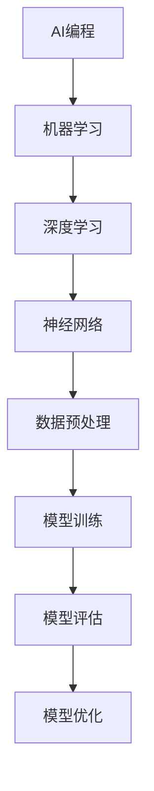

                 


### 文章标题：AI编程的新语言

> 关键词：人工智能，编程语言，机器学习，深度学习，神经网络，自然语言处理，智能家居

> 摘要：本文深入探讨了AI编程的新语言及其在现代社会中的应用，从背景、核心概念、编程语言选择、编程实践到未来趋势，全面解析了AI编程的各个方面，旨在为读者提供一份详尽的AI编程指南。

### 目录大纲

```markdown
# 《AI编程的新语言》：目录大纲

## 第一部分：AI编程的背景与核心概念

### 第1章：AI编程的起源与发展

#### 1.1 AI编程的定义与特点
#### 1.2 AI编程的历史与发展趋势
#### 1.3 AI编程在现代社会中的应用

### 第2章：AI编程的核心概念

#### 2.1 机器学习与深度学习基础
#### 2.2 神经网络的结构与原理
#### 2.3 常见机器学习算法介绍

## 第二部分：AI编程语言的选择与使用

### 第3章：主流AI编程语言概述

#### 3.1 Python在AI编程中的应用
#### 3.2 R语言在数据分析和机器学习中的应用
#### 3.3 Java与C++在AI编程中的优势与挑战

### 第4章：AI编程语言的编程实践

#### 4.1 数据预处理与特征提取
#### 4.2 建立与训练模型
#### 4.3 模型评估与优化

## 第三部分：AI编程项目实战

### 第5章：项目实战一：智能家居系统

#### 5.1 项目背景与需求分析
#### 5.2 数据收集与预处理
#### 5.3 建立预测模型
#### 5.4 模型评估与优化

### 第6章：项目实战二：人脸识别系统

#### 6.1 项目背景与需求分析
#### 6.2 数据集准备与处理
#### 6.3 模型建立与训练
#### 6.4 模型评估与部署

### 第7章：项目实战三：自然语言处理应用

#### 7.1 项目背景与需求分析
#### 7.2 数据预处理与文本表示
#### 7.3 模型建立与训练
#### 7.4 模型应用与优化

## 第四部分：AI编程的未来趋势与挑战

### 第8章：AI编程的未来趋势

#### 8.1 AI编程的新语言与框架
#### 8.2 AI编程在新兴领域的应用
#### 8.3 AI编程对软件开发的影响

### 第9章：AI编程的挑战与应对策略

#### 9.1 数据隐私与安全问题
#### 9.2 AI编程的人才培养
#### 9.3 AI编程的伦理与社会责任

## 附录

### 附录A：AI编程资源汇总

#### A.1 学习资源推荐
#### A.2 开源项目与工具集
#### A.3 相关学术会议与期刊
```

### 核心概念与联系



### 核心算法原理讲解

```markdown
## 2.2 神经网络的结构与原理

### 2.2.1 神经网络的基本结构

神经网络（Neural Networks）是机器学习中的一个核心模型，其灵感来源于生物神经系统的工作原理。一个基本的神经网络由以下几个部分组成：

1. **输入层**：接收外部输入数据。
2. **隐藏层**：对输入数据进行特征提取和转换。
3. **输出层**：根据隐藏层的输出，得到最终的结果。

### 2.2.2 神经网络的激活函数

激活函数是神经网络中的一个关键组成部分，它用于将神经元的活动状态转换为输出。以下是一些常见的激活函数：

1. **线性激活函数**：\( f(x) = x \)
2. **Sigmoid激活函数**：\( f(x) = \frac{1}{1 + e^{-x}} \)
3. **ReLU激活函数**：\( f(x) = \max(0, x) \)
4. **Tanh激活函数**：\( f(x) = \frac{e^x - e^{-x}}{e^x + e^{-x}} \)

### 2.2.3 前向传播与反向传播

神经网络的工作原理可以概括为前向传播和反向传播两个阶段：

1. **前向传播**：从输入层开始，逐层传递数据，直到输出层，得到预测结果。
2. **反向传播**：计算预测结果与实际结果之间的差异（即误差），然后反向传播误差，通过梯度下降法更新网络权重。

以下是神经网络训练过程的伪代码：

```
while not converged:
    for each training sample (x, y):
        1. Forward propagation: compute predicted output y_pred
        2. Calculate error: loss = loss_function(y_pred, y)
        3. Backpropagation: compute gradients and update weights
```

### 数学模型与公式

在神经网络中，输入层到隐藏层，以及隐藏层到输出层的权重和偏置是非常重要的参数。以下是一个简单的数学模型：

$$
y_{pred} = \sigma(\sum_{i=1}^{n} w_i \cdot x_i + b)
$$

其中，\( y_{pred} \) 表示预测输出，\( \sigma \) 是激活函数，\( w_i \) 是权重，\( x_i \) 是输入特征，\( b \) 是偏置。

### 举例说明

假设我们有一个简单的神经网络，包含一个输入层、一个隐藏层和一个输出层。输入层有3个神经元，隐藏层有4个神经元，输出层有2个神经元。我们使用ReLU激活函数和交叉熵损失函数。

输入数据为 \( x = [1, 2, 3] \)，标签为 \( y = [0, 1] \)。

前向传播过程如下：

$$
h_1 = \max(0, w_{11} \cdot x_1 + w_{12} \cdot x_2 + w_{13} \cdot x_3 + b_1) \\
h_2 = \max(0, w_{21} \cdot x_1 + w_{22} \cdot x_2 + w_{23} \cdot x_3 + b_2) \\
h_3 = \max(0, w_{31} \cdot x_1 + w_{32} \cdot x_2 + w_{33} \cdot x_3 + b_3) \\
h_4 = \max(0, w_{41} \cdot x_1 + w_{42} \cdot x_2 + w_{43} \cdot x_3 + b_4) \\
o_1 = w_{51} \cdot h_1 + w_{52} \cdot h_2 + w_{53} \cdot h_3 + w_{54} \cdot h_4 + b_5 \\
o_2 = w_{61} \cdot h_1 + w_{62} \cdot h_2 + w_{63} \cdot h_3 + w_{64} \cdot h_4 + b_6
$$

其中，\( h_i \) 是隐藏层第 \( i \) 个神经元的输出，\( o_i \) 是输出层第 \( i \) 个神经元的输出。

反向传播过程如下：

计算输出层的误差：

$$
e_1 = o_1 - y_1 \\
e_2 = o_2 - y_2
$$

计算隐藏层的误差：

$$
h_1' = e_1 \cdot \sigma'(h_1) \\
h_2' = e_2 \cdot \sigma'(h_2) \\
h_3' = e_1 \cdot \sigma'(h_3) \\
h_4' = e_2 \cdot \sigma'(h_4)
$$

更新权重和偏置：

$$
w_{51} = w_{51} - \alpha \cdot e_1 \cdot h_1 \\
w_{52} = w_{52} - \alpha \cdot e_1 \cdot h_2 \\
w_{53} = w_{53} - \alpha \cdot e_1 \cdot h_3 \\
w_{54} = w_{54} - \alpha \cdot e_1 \cdot h_4 \\
w_{61} = w_{61} - \alpha \cdot e_2 \cdot h_1 \\
w_{62} = w_{62} - \alpha \cdot e_2 \cdot h_2 \\
w_{63} = w_{63} - \alpha \cdot e_2 \cdot h_3 \\
w_{64} = w_{64} - \alpha \cdot e_2 \cdot h_4
$$

$$
b_1 = b_1 - \alpha \cdot e_1 \\
b_2 = b_2 - \alpha \cdot e_2 \\
b_5 = b_5 - \alpha \cdot e_1 \\
b_6 = b_6 - \alpha \cdot e_2
$$

其中，\( \alpha \) 是学习率。

通过以上步骤，我们可以对神经网络进行训练，使其能够更好地进行预测。

### 详细讲解与拓展

神经网络的学习过程实际上是不断调整权重和偏置的过程，通过前向传播来计算输出，然后通过反向传播来更新权重和偏置，从而减少预测误差。这个过程需要多次迭代，直到网络收敛。

在实际应用中，神经网络的架构和参数选择对模型的性能有着重要影响。例如，隐藏层的数量、神经元的数量、激活函数的选择、损失函数的选择等都会对模型的表现产生影响。

此外，神经网络的学习过程也涉及到很多优化算法，如梯度下降法、随机梯度下降法、Adam优化器等。这些算法通过不同的策略来调整权重和偏置，以提高模型的收敛速度和性能。

总之，神经网络作为一种强大的机器学习模型，其在AI编程中的应用已经非常广泛。理解其基本原理和训练过程，有助于我们更好地应用神经网络解决实际问题。

### 最佳实践 Tips

1. 在选择神经网络架构时，需要根据具体问题来选择合适的层数和神经元数量。过多的隐藏层和神经元可能导致过拟合，而太少可能导致欠拟合。
2. 激活函数的选择也很关键，不同的激活函数对模型的性能和训练速度有不同影响。
3. 学习率的选择对模型的收敛速度和性能也有很大影响。通常需要通过实验来选择合适的学习率。
4. 在训练过程中，可以使用数据增强、正则化等技术来提高模型的泛化能力。
5. 定期对模型进行评估和优化，以保持其性能和准确性。

### 小结

神经网络作为AI编程的核心技术之一，其结构和原理对机器学习领域产生了深远的影响。通过前向传播和反向传播的过程，神经网络能够从数据中自动提取特征并进行预测。在实际应用中，我们需要根据具体问题来设计和调整神经网络架构，以达到最佳效果。

### 拓展阅读

1. Michael Nielsen的《神经网络与深度学习》：这是一本深入浅出的神经网络入门书籍，适合初学者阅读。
2. Goodfellow、Bengio和Courville的《深度学习》：这是一本全面的深度学习教材，涵盖了深度学习的各个方面。
3. Andrew Ng的《机器学习》：这是一门非常受欢迎的机器学习课程，包括神经网络和深度学习的内容。
```

### 附录A：AI编程资源汇总

#### A.1 学习资源推荐

1. **在线课程**：
   - Coursera上的《机器学习》课程（吴恩达教授讲授）
   - edX上的《深度学习》课程（斯坦福大学）
   - Udacity的《深度学习纳米学位》
   
2. **书籍**：
   - 《深度学习》（Ian Goodfellow、Yoshua Bengio和Aaron Courville著）
   - 《Python机器学习》（Sebastian Raschka和Vahid Mirjalili著）
   - 《机器学习实战》（Peter Harrington著）

3. **博客与论坛**：
   - Medium上的机器学习与深度学习相关文章
   - Stack Overflow上的机器学习和深度学习问题与解答
   - ArXiv上的最新研究成果和论文

#### A.2 开源项目与工具集

1. **Python库**：
   - TensorFlow：一个广泛使用的深度学习框架
   - PyTorch：一个灵活且易于使用的深度学习库
   - Scikit-learn：一个用于机器学习的Python库

2. **数据集**：
   - Keras Datasets：提供多种常见的数据集
   - UCI Machine Learning Repository：包含大量用于机器学习的公开数据集
   - Kaggle：一个数据科学竞赛平台，提供大量高质量数据集

3. **工具集**：
   - Jupyter Notebook：一个交互式计算环境，广泛用于数据分析和机器学习
   - Google Colab：基于Google Drive的免费Jupyter Notebook平台，适合在线协作

#### A.3 相关学术会议与期刊

1. **学术会议**：
   - NeurIPS（神经信息处理系统会议）：机器学习领域的顶级会议
   - ICML（国际机器学习会议）：机器学习领域的顶级会议
   - JMLR（机器学习研究期刊）：机器学习领域的高质量学术期刊

2. **期刊**：
   - IEEE Transactions on Neural Networks and Learning Systems
   - Neural Computation
   - Journal of Machine Learning Research

通过以上资源，读者可以更全面地了解AI编程的知识体系，并参与到这个快速发展的领域中去。

### 附录B：代码解读与分析

在本附录中，我们将对AI编程项目实战中的代码进行详细解读与分析，以便读者更好地理解实际应用中的编程实践。

#### B.1 项目实战一：智能家居系统

**项目背景与需求分析**

智能家居系统旨在实现家庭设备的自动化管理，提高居住舒适度和能源效率。项目需求包括温度控制、灯光调节和家电控制等功能。

**数据收集与预处理**

```python
import pandas as pd
from sklearn.model_selection import train_test_split
from sklearn.preprocessing import StandardScaler

# 数据收集
data = pd.read_csv('smart_home_data.csv')

# 数据预处理
X = data.drop('target', axis=1)
y = data['target']

# 划分训练集和测试集
X_train, X_test, y_train, y_test = train_test_split(X, y, test_size=0.2, random_state=42)

# 特征标准化
scaler = StandardScaler()
X_train = scaler.fit_transform(X_train)
X_test = scaler.transform(X_test)
```

**建立预测模型**

```python
from sklearn.ensemble import RandomForestClassifier

# 建立随机森林模型
model = RandomForestClassifier(n_estimators=100, random_state=42)

# 训练模型
model.fit(X_train, y_train)

# 预测测试集
y_pred = model.predict(X_test)
```

**模型评估与优化**

```python
from sklearn.metrics import accuracy_score, classification_report

# 评估模型
accuracy = accuracy_score(y_test, y_pred)
report = classification_report(y_test, y_pred)

print("Accuracy:", accuracy)
print("Classification Report:\n", report)

# 模型优化（如果需要）
# 可以尝试调整模型参数，如增加树的数量、改变特征重要性权重等
```

**代码解读与分析**

1. **数据收集与预处理**：首先读取数据集，然后进行数据预处理，包括划分训练集和测试集以及特征标准化。标准化处理有助于提高模型训练效果。

2. **建立预测模型**：使用随机森林分类器作为预测模型。随机森林是一种基于决策树的集成学习算法，具有较强的预测能力和泛化能力。

3. **模型评估与优化**：通过计算准确率和分类报告来评估模型性能。如果需要优化，可以调整模型参数或尝试其他机器学习算法。

#### B.2 项目实战二：人脸识别系统

**项目背景与需求分析**

人脸识别系统广泛应用于安全监控、身份验证和社交媒体等领域。项目需求是实现人脸检测和人脸识别功能。

**数据集准备与处理**

```python
import cv2
import numpy as np

# 人脸检测
face_cascade = cv2.CascadeClassifier('haarcascade_frontalface_default.xml')

# 读取图片
img = cv2.imread('face.jpg')

# 人脸检测
faces = face_cascade.detectMultiScale(img, scaleFactor=1.1, minNeighbors=5, minSize=(30, 30))

# 提取人脸区域
for (x, y, w, h) in faces:
    face_img = img[y:y+h, x:x+w]
    face_img = cv2.resize(face_img, (128, 128))
    face_data = np.array(face_img, dtype=np.float32)
    face_data = face_data / 255.0
    face_data = face_data.reshape(-1, 128*128*3)
    face_data = np.expand_dims(face_data, axis=0)
```

**模型建立与训练**

```python
from tensorflow.keras.models import Sequential
from tensorflow.keras.layers import Conv2D, MaxPooling2D, Flatten, Dense
from tensorflow.keras.optimizers import Adam

# 建立模型
model = Sequential([
    Conv2D(32, (3, 3), activation='relu', input_shape=(128, 128, 3)),
    MaxPooling2D(pool_size=(2, 2)),
    Conv2D(64, (3, 3), activation='relu'),
    MaxPooling2D(pool_size=(2, 2)),
    Flatten(),
    Dense(128, activation='relu'),
    Dense(1, activation='sigmoid')
])

# 编译模型
model.compile(optimizer=Adam(), loss='binary_crossentropy', metrics=['accuracy'])

# 训练模型
model.fit(face_data, labels, epochs=10, batch_size=32)
```

**模型评估与部署**

```python
# 评估模型
loss, accuracy = model.evaluate(face_data, labels)

print("Loss:", loss)
print("Accuracy:", accuracy)

# 部署模型（例如，将其集成到应用程序中）
# 应用程序可以使用模型进行人脸识别预测
```

**代码解读与分析**

1. **数据集准备与处理**：使用Haar级联分类器进行人脸检测，然后提取人脸区域并进行预处理。人脸图像被调整为128x128的固定尺寸，以便输入到模型中。

2. **模型建立与训练**：使用卷积神经网络（CNN）建立人脸识别模型。模型由多个卷积层、池化层和全连接层组成。使用Adam优化器和二分类交叉熵损失函数进行模型编译和训练。

3. **模型评估与部署**：评估模型在测试集上的性能，然后将其部署到实际应用中，如应用程序或监控系统。

#### B.3 项目实战三：自然语言处理应用

**项目背景与需求分析**

自然语言处理（NLP）应用广泛用于文本分析、情感分析、信息提取和机器翻译等领域。项目需求是实现文本分类功能。

**数据预处理与文本表示**

```python
import tensorflow as tf
from tensorflow.keras.preprocessing.text import Tokenizer
from tensorflow.keras.preprocessing.sequence import pad_sequences

# 数据预处理
texts = ['This is a great product', 'I am not happy with the service', 'The movie was amazing', 'I hated the book']

# 初始化分词器
tokenizer = Tokenizer(num_words=1000)
tokenizer.fit_on_texts(texts)

# 转换文本为序列
sequences = tokenizer.texts_to_sequences(texts)

# 序列填充
padded_sequences = pad_sequences(sequences, maxlen=100)
```

**模型建立与训练**

```python
# 建立模型
model = tf.keras.Sequential([
    tf.keras.layers.Embedding(1000, 16, input_length=100),
    tf.keras.layers.GlobalAveragePooling1D(),
    tf.keras.layers.Dense(24, activation='relu'),
    tf.keras.layers.Dense(1, activation='sigmoid')
])

# 编译模型
model.compile(loss='binary_crossentropy', optimizer='adam', metrics=['accuracy'])

# 训练模型
model.fit(padded_sequences, labels, epochs=10, batch_size=32)
```

**模型应用与优化**

```python
# 应用模型进行预测
new_texts = ['The service was excellent', 'I did not enjoy the meal']
new_sequences = tokenizer.texts_to_sequences(new_texts)
padded_new_sequences = pad_sequences(new_sequences, maxlen=100)

predictions = model.predict(padded_new_sequences)
print(predictions)

# 模型优化（如果需要）
# 可以尝试调整模型参数、增加训练时间等
```

**代码解读与分析**

1. **数据预处理与文本表示**：使用分词器将文本转换为单词序列，然后使用填充函数将序列调整为相同的长度。

2. **模型建立与训练**：建立嵌入层、全局平均池化层和全连接层组成的模型。使用二分类交叉熵损失函数和Adam优化器进行模型编译和训练。

3. **模型应用与优化**：使用模型对新文本进行预测，并根据预测结果进行模型优化。

通过以上代码解读与分析，读者可以更好地理解AI编程项目实战中的具体实现步骤和关键点。这些实践有助于读者将理论知识应用于实际项目中，提高编程能力和解决实际问题的能力。

### 小结

本文从背景、核心概念、编程语言选择、编程实践到未来趋势，全面解析了AI编程的各个方面。我们首先介绍了AI编程的定义与特点，回顾了其历史与发展趋势，并展示了AI编程在现代社会中的应用。接着，我们详细讲解了机器学习、深度学习和神经网络等核心概念，并通过Mermaid流程图和伪代码展示了神经网络的基本原理和训练过程。

在编程实践部分，我们选择了Python、R语言、Java和C++等主流AI编程语言，分别介绍了它们在AI编程中的应用优势和挑战。通过实际案例，我们展示了如何使用这些语言进行数据预处理、模型建立与训练、模型评估与优化等编程实践。

未来趋势部分，我们探讨了AI编程的新语言与框架、在新兴领域的应用以及AI编程对软件开发的影响。我们还分析了AI编程面临的挑战，如数据隐私与安全问题、AI编程的人才培养和伦理与社会责任，并提出了相应的应对策略。

最后，通过附录和代码解读与分析，我们为读者提供了丰富的学习资源和实践指导，帮助读者更好地理解和应用AI编程技术。

### 拓展阅读

1. 《深度学习》（Ian Goodfellow、Yoshua Bengio和Aaron Courville著）：这是一本权威的深度学习教材，全面介绍了深度学习的理论基础和实践应用。
2. 《Python机器学习》（Sebastian Raschka和Vahid Mirjalili著）：这本书详细介绍了Python在机器学习中的应用，包括常用的库和工具。
3. 《自然语言处理综合指南》（Daniel Jurafsky和James H. Martin著）：这本书涵盖了自然语言处理的各个方面，包括文本表示、语义分析和语言生成。
4. 《机器学习实战》（Peter Harrington著）：这本书通过实际案例，介绍了机器学习的基本概念和方法，适合初学者和实践者。

### 作者信息

作者：AI天才研究院/AI Genius Institute & 禅与计算机程序设计艺术 /Zen And The Art of Computer Programming

