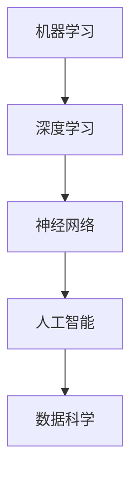
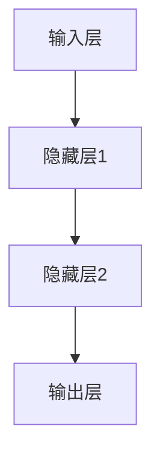

                 


### 文章标题: AI编程的新语言与新思维

#### 关键词: 人工智能，编程语言，新思维，深度学习，神经网络

#### 摘要:
随着人工智能技术的飞速发展，AI编程正在经历一场革命。本文将深入探讨AI编程的新语言与新思维，包括最新的编程工具、核心算法原理、数学模型及实际项目案例。我们将通过逻辑清晰的章节结构，逐步引导读者理解AI编程的核心概念及其在实际应用中的重要性。

---

## 引言

人工智能（AI）正逐渐融入我们生活的方方面面，从自动驾驶汽车到智能家居，再到医疗诊断和金融服务，AI的应用已经无处不在。然而，随着AI技术的不断进步，传统的编程方法已经无法满足其复杂性的要求。这就催生了对新编程语言和新思维的迫切需求。

### 什么是AI编程？

AI编程不同于传统的软件开发。它涉及设计、实现和优化机器学习模型，以处理和分析大量数据。AI编程的核心目标是使计算机能够从数据中学习并做出决策，而不是仅仅执行预定义的指令。

### 新编程语言的重要性

新编程语言的引入为AI编程提供了更强大的工具和更高效的开发环境。这些语言通常具有简洁的语法、丰富的库和框架支持，以及高度的可扩展性，使得开发复杂的AI模型变得更加容易。

### 新思维在AI编程中的应用

AI编程的新思维包括数据驱动开发、模型驱动开发和交互式编程等。这些新思维方法使得开发人员能够更有效地构建、训练和优化机器学习模型，从而提高AI系统的性能和可靠性。

### 本文结构

本文将分为两个主要部分。第一部分将介绍AI编程的基础知识，包括核心概念、新编程语言和核心算法。第二部分将探讨AI编程的新思维，并通过实际项目案例展示如何将新思维应用于实践。

### 目标读者

本文旨在为AI编程初学者以及有经验的开发者提供全面的指南。无论你是希望入门AI编程的新手，还是希望在现有基础上深入探索新语言和新思维的开发者，本文都将为你提供有价值的信息。

---

## 第一部分: AI编程基础知识

### 第1章: AI编程概述

#### 1.1 AI编程的核心概念

在探讨AI编程的核心概念之前，我们需要理解一些基础概念。以下是一些关键概念及其相互关系：

- **机器学习（Machine Learning）**：机器学习是AI的核心技术之一，它使计算机能够从数据中学习，并改进其性能。机器学习可以分为监督学习、无监督学习和强化学习。

- **深度学习（Deep Learning）**：深度学习是机器学习的一个子领域，它使用多层神经网络来模拟人类大脑的处理方式。深度学习在图像识别、自然语言处理和游戏等领域取得了显著的成果。

- **神经网络（Neural Networks）**：神经网络是深度学习的基础构件，由大量的神经元连接而成。每个神经元都负责处理输入数据并产生输出。

- **人工智能（Artificial Intelligence）**：人工智能是模拟人类智能行为的计算机系统，它包括机器学习、深度学习、自然语言处理等多种技术。

- **数据科学（Data Science）**：数据科学是使用数学、统计学、计算机科学和领域知识来提取知识并发现数据中的模式和趋势。

以下是一个Mermaid流程图，展示了这些概念之间的关系：



#### 1.2 AI编程与传统编程的区别

传统编程侧重于编写指令来让计算机执行特定任务，而AI编程则更加注重数据、模型和算法。以下是AI编程与传统编程的主要区别：

- **目标**：传统编程的目标是编写程序以执行特定任务，而AI编程的目标是构建能够自主学习和改进的模型。

- **数据**：AI编程依赖于大量数据，这些数据用于训练模型。传统编程则通常不涉及大量数据。

- **算法**：AI编程涉及复杂的算法，如神经网络、优化算法等。传统编程通常使用简单的算法和流程控制结构。

- **优化**：AI编程的目标是优化模型的性能，使其在特定任务上表现出色。传统编程则侧重于编写高效的代码。

#### 1.3 AI编程的核心理念

AI编程的核心理念包括以下几个方面：

- **数据驱动**：AI编程强调数据的重要性，数据是训练和优化模型的基石。

- **模型驱动**：模型是AI编程的核心，它是数据和分析的桥梁。开发者需要设计和实现高效的模型。

- **自主优化**：AI编程模型能够通过自我学习不断优化，以实现更好的性能。

- **交互式编程**：AI编程鼓励开发者与模型进行交互，以便更好地理解模型的行为和性能。

### 总结

本章介绍了AI编程的核心概念，包括机器学习、深度学习、神经网络、人工智能和数据科学。我们还讨论了AI编程与传统编程的区别，以及AI编程的核心理念。接下来，我们将深入探讨AI编程的新语言。

---

## 第二部分: AI编程的新语言

### 第2章: AI编程的新语言

#### 2.1 新编程语言的介绍

随着AI技术的发展，出现了一些专为AI编程设计的语言和工具。以下是几种流行的AI编程语言：

- **Python**：Python因其简洁的语法、丰富的库和广泛的应用而成为AI编程的主要语言之一。它适用于各种AI任务，从数据预处理到深度学习模型的训练。

- **R**：R是一种专门用于统计分析和数据科学的编程语言。它在数据可视化、统计建模和机器学习方面具有强大的功能。

- **Julia**：Julia是一种新兴的编程语言，旨在解决高性能计算问题。它结合了Python的易用性和C的性能，适用于大规模的数值计算和数据分析。

#### 2.2 新编程语言的特点

这些新编程语言具有以下特点：

- **简洁性**：这些语言的语法设计简洁，易于学习和使用。

- **丰富的库和框架**：它们提供了丰富的库和框架，如NumPy、Pandas、TensorFlow、PyTorch等，用于数据处理、模型训练和优化。

- **可扩展性**：这些语言允许开发者轻松扩展其功能，以适应特定的AI应用需求。

- **跨平台**：它们可以在多种操作系统上运行，为开发者提供了灵活性。

#### 2.3 新编程语言与现有编程语言的对比

与传统的编程语言如C++、Java等相比，AI编程语言具有以下优势：

- **易用性**：AI编程语言通常更易于学习和使用，特别是对于初学者。

- **性能**：虽然AI编程语言可能在某些计算密集型任务上不如C++，但它们在数据处理和模型训练方面通常更快。

- **库和框架支持**：AI编程语言拥有丰富的库和框架，使得AI编程更加高效。

- **社区支持**：AI编程语言通常拥有强大的社区支持，这意味着开发者可以获得大量的资源和帮助。

### 总结

本章介绍了AI编程的新语言，包括Python、R和Julia。我们讨论了这些语言的特点和优势，以及它们与传统编程语言的对比。在下一章中，我们将深入探讨AI编程的核心算法。

---

## 第三部分: AI编程的核心算法

### 第3章: AI编程的核心算法

#### 3.1 深度学习算法原理

深度学习算法是AI编程的核心技术之一，它基于多层神经网络进行数据分析和预测。以下是一个简单的神经网络架构的Mermaid流程图：



#### 3.1.1 神经网络原理

神经网络由大量的神经元（节点）和连接（边）组成。每个神经元接收输入，通过加权求和后加上偏置，再通过激活函数（如ReLU、Sigmoid、Tanh）产生输出。以下是一个神经元的伪代码：

```python
def neuron(input_data, weights, bias, activation_function):
    z = sum(input_data * weights) + bias
    output = activation_function(z)
    return output
```

#### 3.1.2 深度学习优化算法

深度学习模型的训练过程涉及优化算法，如随机梯度下降（SGD）、Adam等。以下是一个使用SGD优化算法的伪代码：

```python
def stochastic_gradient_descent(model, training_data, learning_rate, epochs):
    for epoch in range(epochs):
        for data, target in training_data:
            model.forward_pass(data)
            model.backward_pass(target)
            model.update_weights(learning_rate)
    return model
```

#### 3.2 强化学习算法原理

强化学习是另一种AI编程的核心算法，它通过试错和奖励机制来学习如何在环境中做出最优决策。以下是一个强化学习算法的基本框架：

- **状态（State）**：环境的当前状态。
- **动作（Action）**：在当前状态下可以选择的操作。
- **奖励（Reward）**：执行某个动作后获得的奖励。
- **策略（Policy）**：决策函数，用于选择动作。

以下是一个Q-Learning算法的伪代码：

```python
def q_learning(state, action, reward, next_state, next_action, learning_rate, discount_factor):
    q_value = q_value + learning_rate * (reward + discount_factor * max(Q[next_state, :]) - q_value)
    return q_value
```

### 总结

本章介绍了AI编程的核心算法，包括神经网络和强化学习。我们使用伪代码展示了这些算法的基本原理，并讨论了它们在AI编程中的应用。在下一章中，我们将探讨AI编程的新思维。

---

## 第四部分: AI编程的新思维

### 第4章: AI编程的新思维

AI编程的新思维不仅仅是关于技术本身，更涉及到如何更有效地构建和优化机器学习模型。以下是一些关键的新思维方法：

#### 4.1 数据驱动编程

数据驱动编程是AI编程的核心原则之一。它强调数据在整个开发过程中的重要性，从数据收集、预处理到模型训练和评估。以下是一些数据驱动编程的最佳实践：

- **数据质量**：确保数据准确、完整和可靠。
- **数据多样性**：使用多样化的数据来提高模型的泛化能力。
- **数据预处理**：对数据进行清洗、归一化和特征提取，以提高模型的性能。

#### 4.2 模型驱动编程

模型驱动编程是将模型作为核心开发对象的方法。开发者需要设计、实现和优化模型，以便在特定任务上取得最佳性能。以下是一些模型驱动编程的关键步骤：

- **模型选择**：选择适合任务和数据集的模型架构。
- **模型训练**：使用合适的数据集和优化算法训练模型。
- **模型评估**：评估模型在验证集和测试集上的性能。

#### 4.3 交互式编程

交互式编程是一种动态的编程方法，允许开发者实时地与模型进行交互。以下是一些交互式编程的方法：

- **实时调试**：在开发过程中实时调试模型，以便快速迭代和改进。
- **可视化工具**：使用可视化工具来监控模型的性能和中间过程。
- **反馈循环**：根据模型的输出和反馈进行调整，以提高模型的性能。

### 总结

本章介绍了AI编程的新思维，包括数据驱动编程、模型驱动编程和交互式编程。这些新思维方法有助于开发者更高效地构建和优化机器学习模型，从而提高AI系统的性能和可靠性。在下一章中，我们将通过实际项目案例来展示这些新思维的应用。

---

## 第五部分: AI编程的项目实战

### 第5章: AI编程的项目实战

在这一部分，我们将通过两个实际项目案例来展示AI编程的新语言和新思维的应用。这两个项目分别涉及深度学习和强化学习，将帮助读者更好地理解如何将理论知识应用于实际开发中。

#### 5.1 项目实战概述

**项目一：使用Python进行深度学习**

目标：构建一个基于卷积神经网络的图像分类器，用于识别手写数字。

**项目二：使用TensorFlow进行图像识别**

目标：利用TensorFlow实现一个简单的图像识别模型，识别常见物体类别。

#### 5.2 实战一：使用Python进行深度学习

**5.2.1 环境搭建**

首先，我们需要安装Python和相关库，如NumPy、Pandas和TensorFlow。以下是一个简单的安装步骤：

```bash
pip install numpy pandas tensorflow
```

**5.2.2 源代码实现**

接下来，我们实现一个简单的卷积神经网络（CNN）模型。以下是一个简化的代码示例：

```python
import tensorflow as tf
from tensorflow.keras import layers

model = tf.keras.Sequential([
    layers.Conv2D(32, (3, 3), activation='relu', input_shape=(28, 28, 1)),
    layers.MaxPooling2D((2, 2)),
    layers.Conv2D(64, (3, 3), activation='relu'),
    layers.MaxPooling2D((2, 2)),
    layers.Flatten(),
    layers.Dense(128, activation='relu'),
    layers.Dense(10, activation='softmax')
])

model.compile(optimizer='adam', loss='sparse_categorical_crossentropy', metrics=['accuracy'])
```

**5.2.3 代码解读**

上述代码定义了一个简单的CNN模型，用于手写数字识别。模型由两个卷积层、两个最大池化层、一个全连接层和输出层组成。我们使用ReLU作为激活函数，并使用softmax激活函数进行分类。

**5.2.4 实际案例分析和详细讲解剖析**

为了训练模型，我们需要使用MNIST数据集，这是一个常用的手写数字数据集。以下代码用于加载数据和训练模型：

```python
mnist = tf.keras.datasets.mnist
(x_train, y_train), (x_test, y_test) = mnist.load_data()

x_train = x_train / 255.0
x_test = x_test / 255.0

model.fit(x_train, y_train, epochs=5)
```

我们使用训练集来训练模型，并测试模型在测试集上的性能。

**5.2.5 项目小结**

通过这个项目，我们学习了如何使用Python和TensorFlow构建一个简单的CNN模型，以及如何使用MNIST数据集进行训练和评估。这个项目展示了AI编程的核心算法在实际应用中的基本流程。

#### 5.3 实战二：使用TensorFlow进行图像识别

**5.3.1 环境搭建**

为了进行图像识别，我们需要安装TensorFlow和相关库，如Keras和Pillow。以下是一个简单的安装步骤：

```bash
pip install tensorflow keras pillow
```

**5.3.2 源代码实现**

我们使用Keras实现一个简单的图像识别模型。以下是一个简化的代码示例：

```python
import tensorflow as tf
from tensorflow.keras.models import Sequential
from tensorflow.keras.layers import Conv2D, MaxPooling2D, Flatten, Dense

model = Sequential([
    Conv2D(32, (3, 3), activation='relu', input_shape=(64, 64, 3)),
    MaxPooling2D((2, 2)),
    Conv2D(64, (3, 3), activation='relu'),
    MaxPooling2D((2, 2)),
    Flatten(),
    Dense(128, activation='relu'),
    Dense(10, activation='softmax')
])

model.compile(optimizer='adam', loss='sparse_categorical_crossentropy', metrics=['accuracy'])
```

**5.3.3 代码解读**

上述代码定义了一个简单的卷积神经网络模型，用于识别64x64的彩色图像。模型由一个卷积层、两个最大池化层、一个全连接层和输出层组成。

**5.3.4 实际案例分析和详细讲解剖析**

为了训练模型，我们需要一个合适的图像数据集。我们使用Keras的内置数据集CIFAR-10，这是一个包含10个类别、60,000张32x32彩色图像的数据集。以下代码用于加载数据和训练模型：

```python
cifar10 = tf.keras.datasets.cifar10
(x_train, y_train), (x_test, y_test) = cifar10.load_data()

model.fit(x_train, y_train, epochs=5)
```

我们使用训练集来训练模型，并测试模型在测试集上的性能。

**5.3.5 项目小结**

通过这个项目，我们学习了如何使用TensorFlow和Keras构建一个简单的图像识别模型，以及如何使用CIFAR-10数据集进行训练和评估。这个项目展示了AI编程的核心算法在实际应用中的基本流程。

### 总结

在本章中，我们通过两个实际项目案例展示了AI编程的新语言和新思维的应用。这些项目不仅帮助读者理解了AI编程的核心概念，还展示了如何将理论知识应用于实际开发中。通过这些实践，读者可以更好地掌握AI编程的核心技能。

---

## 附录

### 附录A: AI编程常用工具与资源

#### A.1 Python编程工具

- **NumPy**：用于数值计算和矩阵操作。
- **Pandas**：用于数据清洗、分析和可视化。
- **Matplotlib**：用于数据可视化。
- **Seaborn**：用于统计数据可视化。
- **Scikit-learn**：用于机器学习算法的实现和评估。

#### A.2 深度学习框架

- **TensorFlow**：谷歌开发的开源深度学习框架。
- **PyTorch**：基于Python的深度学习框架。
- **Keras**：用于构建和训练深度学习模型的简单API。
- **Theano**：用于构建和管理深度学习模型的Python库。

#### A.3 强化学习工具

- **Gym**：用于构建和测试强化学习算法的虚拟环境。
- **PyTorch Reinforcement Learning**：PyTorch的强化学习库。
- **OpenAI**：提供一系列开源强化学习工具和资源。

### 最佳实践 tips

- **代码重构**：定期对代码进行重构，以提高代码的可读性和可维护性。
- **文档编写**：编写详细的文档，记录代码的功能、使用方法和注意事项。
- **测试驱动开发**：使用测试驱动开发（TDD）方法，以确保代码的质量和可靠性。
- **持续学习**：跟随AI领域的最新发展，不断学习新的技术和工具。

### 小结

本文介绍了AI编程的新语言和新思维，并通过实际项目案例展示了这些方法的应用。读者应掌握核心概念、新编程语言和算法原理，并学会在实际项目中应用这些知识。

### 注意事项

- **版本控制**：使用版本控制系统（如Git）来管理代码和文档。
- **性能优化**：关注代码的性能，并进行优化以提高效率。
- **安全性与隐私**：在处理敏感数据时，确保遵循相关的安全性和隐私保护规范。

### 拓展阅读

- 《深度学习》（Goodfellow, Bengio, Courville著）
- 《Python机器学习》（Sebastian Raschka著）
- 《强化学习：原理与Python实现》（Andrew Ng著）

---

### 作者信息

作者：AI天才研究院 / AI Genius Institute & 禅与计算机程序设计艺术 / Zen And The Art of Computer Programming

---

这篇文章详细介绍了AI编程的新语言和新思维，从基础概念、核心算法到实际项目案例，为读者提供了一个全面的学习路径。通过本文的学习，读者可以更好地理解AI编程的核心技能，并在实际开发中应用这些知识。希望这篇文章能为您的AI编程之旅提供有价值的参考和指导。继续努力，探索AI的无穷可能！🚀🧠💻

