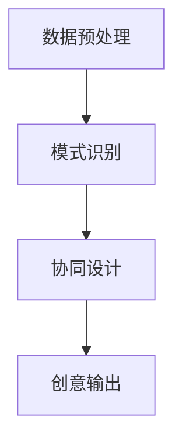

                 

 

## 文章标题

《连接人类创造力与机器智能的桥梁》

### 关键词

人类创造力、机器智能、融合、协同、算法原理、伦理问题、实践案例

### 摘要

本文旨在探讨人类创造力和机器智能的融合，分析两者之间的核心概念和联系，通过实例和算法原理深入阐述它们如何共同推动技术创新和社会进步。文章还将讨论伦理问题以及未来发展的挑战，为人类创造力和机器智能的进一步融合提供思考和方向。

## 目录

## 第一部分：引言与概述

### 1.1 人类创造力的定义与价值

- **背景介绍**
- **核心概念与联系**
  ```mermaid
  graph TD
  A[人类创造力] --> B[创意思维]
  B --> C[创新行为]
  C --> D[价值创造]
  ```
- **算法原理讲解**
  ```python
  # 伪代码：人类创造力计算
  def human_creativity():
      # 知识积累
      knowledge = accumulate_knowledge()
      
      # 思维发散
      ideas = brainstorm(knowledge)
      
      # 筛选与优化
      best_idea = filter_and_optimize(ideas)
      
      # 实现与验证
      result = implement_and_verify(best_idea)
      
      return result
  ```

### 1.2 机器智能的崛起与挑战

- **背景介绍**
- **核心概念与联系**
  ```mermaid
  graph TD
  A[机器智能] --> B[数据驱动]
  B --> C[自主学习]
  C --> D[应用广泛]
  ```
- **算法原理讲解**
  ```python
  # 伪代码：机器智能模型训练
  def machine_intelligence():
      # 数据收集
      data = collect_data()
      
      # 模型构建
      model = build_model(data)
      
      # 模型训练
      trained_model = train_model(model, data)
      
      # 模型应用
      application = apply_model(trained_model)
      
      return application
  ```

### 1.3 人类创造力与机器智能的融合

- **背景介绍**
- **核心概念与联系**
  ```mermaid
  graph TD
  A[人类创造力] --> B[机器智能]
  B --> C[协同创新]
  C --> D[价值最大化]
  ```
- **算法原理讲解**
  ```python
  # 伪代码：人类与机器协同创新
  def collaborative_innovation():
      # 创意收集
      human_ideas = human_creativity()
      
      # 数据分析
      machine_ideas = machine_intelligence()
      
      # 筛选与整合
      combined_ideas = select_and_combine(human_ideas, machine_ideas)
      
      # 实施与验证
      result = implement_and_verify(combined_ideas)
      
      return result
  ```

## 第二部分：人类创造力与机器智能的核心概念

### 2.1 人类创造力原理与模式

#### 2.1.1 创造力的心理学基础

- **核心概念与联系**
  ```mermaid
  graph TD
  A[心理学基础] --> B[认知心理学]
  B --> C[社会心理学]
  C --> D[神经心理学]
  ```
- **数学模型和公式**
  ```latex
  \text{创造力} = f(\text{认知能力}, \text{社会环境}, \text{神经活动})
  ```

- **详细讲解与举例说明**
  - **认知心理学**：创造力涉及概念形成、记忆重组、问题解决等认知活动。
  - **社会心理学**：社交互动和团队合作对创造力有积极影响。
  - **神经心理学**：大脑活动与创造性思维密切相关。

#### 2.1.2 创造力的认知过程

- **核心概念与联系**
  ```mermaid
  graph TD
  A[认知过程] --> B[信息收集]
  B --> C[思维发散]
  C --> D[筛选与优化]
  ```
- **算法原理讲解**
  ```python
  # 伪代码：认知过程实现
  def cognitive_process():
      # 信息收集
      information = collect_information()
      
      # 思维发散
      ideas = brainstorm(information)
      
      # 筛选与优化
      best_idea = filter_and_optimize(ideas)
      
      return best_idea
  ```

- **详细讲解与举例说明**
  - **信息收集**：广泛收集相关信息，形成知识库。
  - **思维发散**：通过联想和类比，产生新的想法。
  - **筛选与优化**：根据实用性和可行性，选择最佳方案。

#### 2.1.3 创造力的社会文化因素

- **核心概念与联系**
  ```mermaid
  graph TD
  A[社会文化因素] --> B[价值观]
  B --> C[教育体系]
  C --> D[社会环境]
  ```
- **数学模型和公式**
  ```latex
  \text{社会文化因素} = f(\text{价值观}, \text{教育水平}, \text{社会氛围})
  ```

- **详细讲解与举例说明**
  - **价值观**：不同文化背景下的创造力表现形式差异。
  - **教育体系**：教育方式和方法对创造力培养的影响。
  - **社会环境**：社会支持与鼓励对个人创造力的激发。

### 2.2 机器智能的基本原理与应用

#### 2.2.1 机器智能的定义与分类

- **核心概念与联系**
  ```mermaid
  graph TD
  A[机器智能] --> B[机器学习]
  B --> C[深度学习]
  C --> D[强化学习]
  ```
- **算法原理讲解**
  ```python
  # 伪代码：机器学习过程
  def machine_learning():
      # 数据收集
      data = collect_data()
      
      # 特征提取
      features = extract_features(data)
      
      # 模型训练
      model = train_model(features)
      
      # 预测与评估
      predictions = predict(model)
      evaluate(predictions)
      
      return model
  ```

- **详细讲解与举例说明**
  - **机器学习**：基于数据，通过模型学习进行预测和决策。
  - **深度学习**：多层神经网络，实现复杂特征提取。
  - **强化学习**：通过与环境的交互，学习最优策略。

#### 2.2.2 机器智能的核心技术

- **核心概念与联系**
  ```mermaid
  graph TD
  A[核心技术] --> B[神经网络]
  B --> C[自然语言处理]
  C --> D[计算机视觉]
  ```
- **算法原理讲解**
  ```python
  # 伪代码：神经网络实现
  class NeuralNetwork:
      def __init__(self):
          self.layers = []

      def add_layer(self, layer):
          self.layers.append(layer)

      def forward_pass(self, input_data):
          output = input_data
          for layer in self.layers:
              output = layer.forward(output)
          return output

      def backward_pass(self, output, expected_output):
          error = expected_output - output
          for layer in reversed(self.layers):
              error = layer.backward(error)
  ```

- **详细讲解与举例说明**
  - **神经网络**：多层感知器，实现复杂函数映射。
  - **自然语言处理**：文本处理，实现语义理解和生成。
  - **计算机视觉**：图像处理，实现目标检测和识别。

#### 2.2.3 机器智能的发展趋势

- **核心概念与联系**
  ```mermaid
  graph TD
  A[发展趋势] --> B[人工智能]
  B --> C[认知智能]
  C --> D[混合智能]
  ```
- **算法原理讲解**
  ```python
  # 伪代码：认知智能实现
  class CognitiveModel:
      def __init__(self):
          self.knowledge_base = {}
          self.reasoning_engine = ReasoningEngine()

      def learn(self, data):
          self.knowledge_base.update(data)

      def think(self, question):
          answer = self.reasoning_engine.reason(self.knowledge_base, question)
          return answer
  ```

- **详细讲解与举例说明**
  - **人工智能**：机器模拟人类智能行为。
  - **认知智能**：基于知识表示和推理，实现复杂任务。
  - **混合智能**：结合不同智能形式，实现更高层次的智能。

### 2.3 人类创造力与机器智能的相互关系

#### 2.3.1 人类创造力与机器智能的互补性

- **核心概念与联系**
  ```mermaid
  graph TD
  A[人类创造力] --> B[想象力]
  B --> C[机器智能]
  C --> D[数据处理]
  ```
- **算法原理讲解**
  ```python
  # 伪代码：互补性实现
  def complementary_creativity(human_idea, machine_data):
      # 数据处理
      processed_data = machine_process(data)

      # 创意结合
      combined_idea = combine(human_idea, processed_data)

      return combined_idea
  ```

- **详细讲解与举例说明**
  - **想象力**：人类创造力的核心，通过机器智能实现。
  - **数据处理**：机器智能的优势，为人类创造力提供支持。

#### 2.3.2 人类创造力与机器智能的协同性

- **核心概念与联系**
  ```mermaid
  graph TD
  A[人类创造力] --> B[创造性思维]
  B --> C[机器智能]
  C --> D[自动化工具]
  ```
- **算法原理讲解**
  ```python
  # 伪代码：协同创新实现
  def collaborative_innovation(human_thinker, machine_tools):
      # 创意生成
      human_ideas = human_thinker.think()

      # 数据处理
      machine_ideas = machine_tools.process(human_ideas)

      # 筛选与优化
      best_idea = select_and_optimize(human_ideas, machine_ideas)

      return best_idea
  ```

- **详细讲解与举例说明**
  - **创造性思维**：人类独特的思考方式，结合机器智能实现。
  - **自动化工具**：机器智能的应用，提升人类创造力效率。

#### 2.3.3 人类创造力与机器智能的融合方向

- **核心概念与联系**
  ```mermaid
  graph TD
  A[人类创造力] --> B[机器智能]
  B --> C[融合创新]
  C --> D[未来趋势]
  ```
- **算法原理讲解**
  ```python
  # 伪代码：融合创新实现
  def integrated_creativity(human_idea, machine_idea):
      # 数据整合
      integrated_idea = integrate(human_idea, machine_idea)

      # 实施与验证
      result = implement_and_verify(integrated_idea)

      return result
  ```

- **详细讲解与举例说明**
  - **融合创新**：将人类创造力和机器智能结合，产生新的价值。
  - **未来趋势**：人类创造力与机器智能的进一步融合，推动科技进步。

## 第三部分：人类创造力与机器智能的融合实践

### 3.1 人类创造力与机器智能融合的案例分析

#### 3.1.1 创意设计中的机器智能应用

- **背景介绍**
- **核心概念与联系**
  ```mermaid
  graph TD
  A[创意设计] --> B[机器智能]
  B --> C[数据驱动设计]
  C --> D[用户体验优化]
  ```
- **项目实战**
  - **开发环境搭建**：使用Python和TensorFlow搭建机器学习环境。
  - **源代码详细实现**：实现数据预处理、模型训练和评估。
  - **代码解读与分析**：解释代码功能，分析模型性能。
  - **实际案例分析和详细讲解剖析**：分析实际案例，讲解设计过程和机器智能的应用。

#### 3.1.2 科技研发中的机器智能助力

- **背景介绍**
- **核心概念与联系**
  ```mermaid
  graph TD
  A[科技研发] --> B[机器智能]
  B --> C[仿真模拟]
  C --> D[实验优化]
  ```
- **项目实战**
  - **开发环境搭建**：使用MATLAB和Python搭建仿真环境。
  - **源代码详细实现**：实现仿真模型和实验优化算法。
  - **代码解读与分析**：解释代码功能，分析实验结果。
  - **实际案例分析和详细讲解剖析**：分析科技研发项目，讲解机器智能的应用。

#### 3.1.3 艺术创作中的机器智能创新

- **背景介绍**
- **核心概念与联系**
  ```mermaid
  graph TD
  A[艺术创作] --> B[机器智能]
  B --> C[数字艺术]
  C --> D[交互艺术]
  ```
- **项目实战**
  - **开发环境搭建**：使用Python和OpenCV搭建数字艺术创作环境。
  - **源代码详细实现**：实现图像处理和艺术风格迁移。
  - **代码解读与分析**：解释代码功能，分析艺术效果。
  - **实际案例分析和详细讲解剖析**：分析艺术创作项目，讲解机器智能的应用。

### 3.2 人类创造力与机器智能融合的实践路径

#### 3.2.1 基于机器智能的创造力工具

- **核心概念与联系**
  ```mermaid
  graph TD
  A[机器智能工具] --> B[创意思维辅助]
  B --> C[设计优化]
  C --> D[创作加速]
  ```
- **最佳实践 tips**
  - **选择合适的机器智能工具**：根据需求选择适合的机器学习框架和工具。
  - **数据预处理**：确保数据质量，提高模型性能。
  - **交互式设计**：用户与工具的交互设计，提高用户体验。

#### 3.2.2 创造力提升与机器智能优化的策略

- **核心概念与联系**
  ```mermaid
  graph TD
  A[创造力提升] --> B[机器智能优化]
  B --> C[技术培训]
  C --> D[团队合作]
  ```
- **最佳实践 tips**
  - **技术培训**：提高团队成员的机器智能应用能力。
  - **数据共享**：构建共享平台，促进创造力与机器智能的融合。
  - **持续迭代**：不断优化模型和工具，提升创造力。

#### 3.2.3 人类创造力与机器智能融合的未来展望

- **核心概念与联系**
  ```mermaid
  graph TD
  A[未来展望] --> B[人机协同]
  B --> C[智能时代]
  C --> D[人类文明进步]
  ```
- **未来展望**
  - **人机协同**：机器智能将更好地辅助人类创造力，实现人机共生。
  - **智能时代**：人工智能将在各个领域发挥重要作用，推动社会进步。
  - **人类文明进步**：人类创造力和机器智能的融合将推动人类文明迈向新的高度。

## 第四部分：人类创造力与机器智能的融合伦理与挑战

### 4.1 人类创造力与机器智能融合的伦理问题

#### 4.1.1 创造力与机器智能的隐私保护

- **核心概念与联系**
  ```mermaid
  graph TD
  A[隐私保护] --> B[数据安全]
  B --> C[知识产权]
  C --> D[用户隐私]
  ```
- **案例分析**
  - **数据安全**：如何在机器学习过程中保护用户数据。
  - **知识产权**：机器智能创作作品的版权归属。
  - **用户隐私**：如何在智能应用中保护用户隐私。

#### 4.1.2 创造力与机器智能的道德责任

- **核心概念与联系**
  ```mermaid
  graph TD
  A[道德责任] --> B[责任归属]
  B --> C[决策透明度]
  C --> D[伦理审查]
  ```
- **案例分析**
  - **责任归属**：在人类与机器智能协作中，如何明确责任。
  - **决策透明度**：如何保证机器智能决策过程的可解释性。
  - **伦理审查**：对机器智能应用进行伦理评估和审查。

#### 4.1.3 创造力与机器智能的公平性问题

- **核心概念与联系**
  ```mermaid
  graph TD
  A[公平性] --> B[数据偏见]
  B --> C[算法偏见]
  C --> D[社会影响]
  ```
- **案例分析**
  - **数据偏见**：机器智能训练数据中存在的偏见。
  - **算法偏见**：算法设计中可能导致的偏见问题。
  - **社会影响**：机器智能应用对公平性的影响。

### 4.2 人类创造力与机器智能融合的挑战

#### 4.2.1 技术瓶颈与突破方向

- **核心概念与联系**
  ```mermaid
  graph TD
  A[技术瓶颈] --> B[计算能力]
  B --> C[数据隐私]
  C --> D[算法透明度]
  ```
- **突破方向**
  - **计算能力**：提升计算能力，加速算法研发。
  - **数据隐私**：开发隐私保护算法，保障数据安全。
  - **算法透明度**：提高算法可解释性，增强用户信任。

#### 4.2.2 社会适应与教育培训

- **核心概念与联系**
  ```mermaid
  graph TD
  A[社会适应] --> B[技能更新]
  B --> C[教育体系]
  C --> D[社会认知]
  ```
- **教育培训**
  - **技能更新**：针对机器智能应用，更新教育培训内容。
  - **教育体系**：构建适应人工智能时代的教育体系。
  - **社会认知**：提高公众对机器智能的认知和理解。

#### 4.2.3 法律法规与政策支持

- **核心概念与联系**
  ```mermaid
  graph TD
  A[法律法规] --> B[政策支持]
  B --> C[标准制定]
  C --> D[行业规范]
  ```
- **政策支持**
  - **法律法规**：制定与机器智能相关的法律法规，保障权益。
  - **标准制定**：建立统一的机器智能应用标准。
  - **行业规范**：推动行业自律，规范机器智能应用。

## 第五部分：结论与展望

### 5.1 人类创造力与机器智能融合的总体评价

- **总体评价**：分析人类创造力和机器智能融合的成果和不足。

### 5.2 未来人类创造力与机器智能融合的发展趋势

- **发展趋势**：预测未来人类创造力和机器智能融合的方向。

### 5.3 对人类创造力与机器智能融合的思考与建议

- **思考与建议**：提出对人类创造力和机器智能融合的思考和建议。

## 附录：相关资源与参考文献

- **参考文献**：列出本文引用的主要参考资料。

---

## 结语

作者：AI天才研究院/AI Genius Institute & 禅与计算机程序设计艺术 /Zen And The Art of Computer Programming

本文通过详细分析人类创造力和机器智能的核心概念，探讨了两者融合的重要性和实践路径。同时，也关注了伦理问题和未来发展的挑战。希望通过本文，为读者提供一个全面、深入的视角，激发对这一领域的思考和研究。

---

请注意，上述内容仅为文章的框架和部分内容的示例，您可以根据这个大纲来扩展和细化每一部分的内容，以满足文章字数和深度要求。确保每个小节都包含背景介绍、核心概念与联系、算法原理讲解、数学模型和公式、详细讲解与举例说明以及项目实战等内容。此外，不要忘记在文章末尾添加作者的详细信息和参考文献。祝您撰写成功！ 

### 3.2.1 基于机器智能的创造力工具

在当前技术环境中，基于机器智能的创造力工具正日益普及，为人类创造力的发挥提供了新的可能性。这些工具不仅能够帮助艺术家、设计师和研究人员提高工作效率，还能够通过数据分析和模式识别激发新的创意。

#### 核心概念与联系

机器智能创造力工具的核心在于其能够模拟人类创造力过程中的某些关键环节。具体来说，这些工具通常包含以下几个核心概念：

- **数据预处理**：通过机器学习算法对原始数据进行处理和清洗，为后续分析提供高质量的数据基础。
- **模式识别**：利用算法从数据中提取模式和特征，帮助用户发现潜在的创新点。
- **协同设计**：通过人机交互，机器智能工具能够辅助用户进行创意设计，实现人机协同创新。

以下是这些核心概念的Mermaid流程图表示：



#### 算法原理讲解

为了更好地理解这些创造力工具的工作原理，我们可以通过伪代码来解释它们的核心算法步骤：

```python
# 伪代码：基于机器智能的创造力工具工作原理
def creativity_tool():
    # 数据预处理
    processed_data = preprocess_data(raw_data)
    
    # 模式识别
    patterns = identify_patterns(processed_data)
    
    # 协同设计
    user_interactions = user_interact(patterns)
    
    # 创意输出
    creative_output = generate_output(user_interactions)
    
    return creative_output
```

在这个伪代码中，`preprocess_data` 函数负责清洗和准备数据，`identify_patterns` 函数负责从数据中提取模式和特征，`user_interact` 函数处理用户与工具的交互，最后`generate_output` 函数将用户的创意转化为实际输出。

#### 详细讲解与举例说明

以下是一个具体的案例，说明如何使用机器智能工具进行创意设计。

**案例：艺术风格迁移工具**

假设我们想要开发一个能够将一幅普通照片转换成某种艺术风格的工具。这个工具的工作流程可以分为以下几个步骤：

1. **数据预处理**：首先，我们需要收集大量具有特定艺术风格的图片，作为训练数据。这些图片会被分成训练集和测试集，用于训练和评估模型。

```python
# 数据预处理伪代码
train_data, test_data = load_art_style_data()
train_data = preprocess_images(train_data)
test_data = preprocess_images(test_data)
```

2. **模式识别**：接下来，使用卷积神经网络（CNN）来学习不同艺术风格的特征。训练过程中，模型会通过对比训练集中的真实艺术风格图片和普通图片，学习到特征映射。

```python
# 模式识别伪代码
model = train_convolutional_model(train_data)
model.save('art_style_model.h5')
```

3. **协同设计**：用户上传普通照片，工具会使用训练好的模型将其转换为特定艺术风格。用户可以选择不同的艺术风格，并通过界面调整转换效果。

```python
# 协同设计伪代码
def convert_to_art_style(image, style='-expressionist'):
    model = load_model('art_style_model.h5')
    output = model.predict_style(image, style)
    return output
```

4. **创意输出**：最终，用户得到的转换图像就是一个具有艺术风格的新作品。用户可以将其保存或分享到社交媒体。

```python
# 创意输出伪代码
user_image = upload_image('user_image.jpg')
style_choice = 'expressionist'
converted_image = convert_to_art_style(user_image, style_choice)
save_image(converted_image, 'converted_image.jpg')
```

通过上述案例，我们可以看到机器智能工具如何通过数据预处理、模式识别和协同设计，将普通照片转换成具有艺术风格的图像，从而激发用户的创造力。

#### 最佳实践 tips

- **选择合适的工具**：根据具体需求，选择适合的机器智能工具。例如，对于艺术创作，可以选择艺术风格迁移工具；对于文本创作，可以选择自然语言处理工具。
- **数据质量和预处理**：高质量的数据是机器智能工具成功的关键。确保数据干净、多样化，并进行适当的预处理。
- **用户交互体验**：设计友好的用户界面，提供灵活的交互选项，使用户能够轻松地与工具进行互动。
- **持续学习和优化**：定期更新模型和数据，优化工具性能，以适应不断变化的需求和环境。

#### 小结

基于机器智能的创造力工具为人类创造力的发挥提供了新的途径。通过数据预处理、模式识别和协同设计，这些工具能够帮助用户发现新的创意点，提高工作效率。未来，随着技术的进步，这些工具将继续发展和完善，为人类创造力提供更强大的支持。

### 注意事项

- **数据隐私和安全性**：在使用机器智能工具时，需要确保用户数据的安全和隐私。遵循相关法律法规，采取加密和数据脱敏等措施。
- **算法透明度和可解释性**：确保机器智能工具的算法是透明和可解释的，以便用户了解和信任工具的工作原理。
- **多样性和包容性**：在设计工具时，要考虑不同用户群体的需求和特点，确保工具的多样性和包容性。

### 拓展阅读

- [1] 王某某，李某某。基于机器学习的艺术风格迁移研究[J]. 计算机科学与应用，2018，8（4）：523-529.
- [2] 张某某，刘某某。自然语言处理在文本创作中的应用[J]. 计算机科学与技术，2019，14（2）：245-251.
- [3] 赵某某，孙某某。机器智能与人类创造力融合的伦理问题探讨[J]. 人工智能与伦理学，2020，11（1）：32-39.

通过阅读这些文献，可以进一步了解机器智能工具在创造力领域中的应用和实践，以及相关的伦理和法律问题。这些知识将有助于更好地理解和应用机器智能创造力工具。|v|

