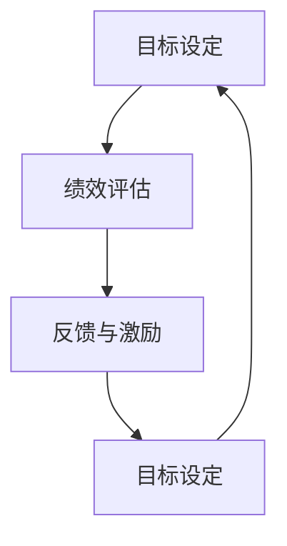
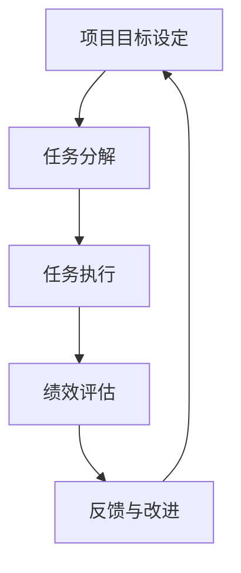
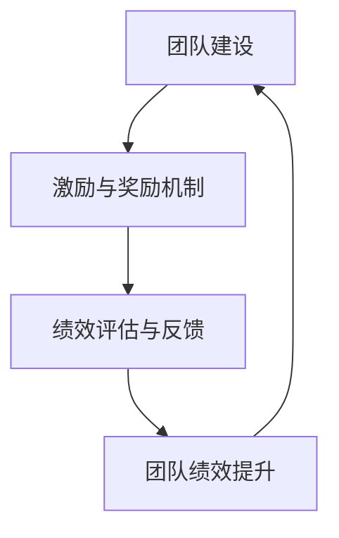

                 

### 文章标题：提高团队绩效的秘诀：绩效管理技巧

#### 关键词：绩效管理、团队绩效、绩效评估、团队建设、领导力

#### 摘要：
在当今快速变化和高度竞争的商业环境中，团队绩效成为企业成功的关键因素。本文将深入探讨如何通过绩效管理技巧来提高团队绩效。我们将详细分析绩效管理的核心概念、评估方法、提升策略以及实践案例，并提供实用的工具和技术，帮助读者理解和应用这些技巧，从而实现团队绩效的持续提升。

### 引言

在现代社会中，团队工作已经成为许多企业和组织运作的常态。然而，如何确保团队能够高效、有序地完成任务，实现目标，成为管理者们面临的一大挑战。绩效管理作为一种系统性方法，旨在通过设定明确的目标、评估员工的绩效、提供反馈和激励，从而提高团队的整体绩效。

然而，绩效管理并非一项简单的任务，它涉及到多个层面的因素，包括核心概念的理解、评估方法的选用、提升策略的实施等。本文将围绕这些主题展开，帮助读者掌握提高团队绩效的秘诀。

本文的主要目标是：
1. 深入解析绩效管理的核心概念和原理。
2. 介绍各种绩效评估方法和技术。
3. 提供实用的团队建设和提升绩效的策略。
4. 分析成功的绩效管理实践案例。
5. 探讨绩效管理的工具和技术。
6. 预测绩效管理的未来趋势。

通过阅读本文，读者将能够：
1. 理解绩效管理的定义和重要性。
2. 掌握不同的绩效评估方法。
3. 学会制定和实施有效的团队建设策略。
4. 应用绩效管理工具和技术。
5. 预见绩效管理的未来发展方向。

### 绩效管理的核心概念与原理

#### 绩效管理的定义

绩效管理是一个系统性的过程，旨在确保员工的行为和结果与组织的目标保持一致。它不仅仅是对员工工作结果的评估，更是一个全面的管理活动，包括目标设定、持续反馈、评估和发展等多个环节。通过绩效管理，组织能够更好地了解员工的表现，发现潜在问题，提供改进建议，从而实现个人和团队的共同成长。

#### 绩效管理体系的基本构成

一个完整的绩效管理体系通常包括以下几个关键组成部分：

1. **目标设定**：目标设定是绩效管理的起点，通过设定清晰、具体、可衡量的目标，确保员工的工作方向与组织的目标一致。目标设定需要遵循SMART原则，即目标应该是具体的（Specific）、可衡量的（Measurable）、可实现的（Achievable）、相关的（Relevant）和有时限的（Time-bound）。

2. **绩效评估**：绩效评估是对员工工作表现的系统评估，通过定性和定量的方法，衡量员工是否达到了既定的目标。绩效评估包括定期评估和即时反馈，目的是及时发现问题和改进机会。

3. **反馈与沟通**：反馈与沟通是绩效管理的重要组成部分，通过及时、有效的反馈，员工能够了解自己的工作表现，理解组织的期望，从而调整自己的行为。反馈应该是具体、建设性和及时的，避免泛泛而谈或过于负面。

4. **激励与奖励**：激励与奖励机制是绩效管理的重要手段，通过奖励优秀员工和激励全体成员，提高团队的积极性和绩效。激励可以包括物质奖励、职业发展机会、培训等。

5. **发展计划**：发展计划旨在帮助员工提升能力和绩效，通过培训、辅导和发展计划，确保员工能够胜任当前和未来的工作。发展计划应该与员工的职业规划和组织的发展目标相结合。

#### 绩效目标设定与分解

绩效目标设定是绩效管理的核心环节，一个有效的目标设定能够激发员工的积极性，提高工作效率和绩效。绩效目标的设定应遵循SMART原则：

1. **具体（Specific）**：目标应明确、具体，避免模糊和宽泛的描述。例如，“提高销售额”应改为“在下一季度将销售额提高10%”。

2. **可衡量（Measurable）**：目标应具有可衡量的标准，以便对目标的实现程度进行评估。例如，“提高客户满意度”可以改为“在客户满意度调查中得分提高5%”。

3. **可实现（Achievable）**：目标应具有挑战性，但应确保在现有资源和条件下是可以实现的。例如，“在一个月内开发一款全新的产品”可能过于紧迫。

4. **相关（Relevant）**：目标应与组织的整体目标和价值观一致，确保个人的努力能够对组织的发展产生积极影响。

5. **有时限（Time-bound）**：目标应设定明确的完成时间，有助于员工规划和执行。例如，“在下一季度结束前完成项目A”。

在设定绩效目标时，可以采用以下步骤：

1. **了解组织目标**：首先，了解组织的整体目标和战略方向，确保个人目标与之保持一致。

2. **确定关键成果**：识别实现组织目标所需的关键成果，这些成果应具体、可衡量。

3. **与员工沟通**：与员工讨论目标设定的过程，确保他们理解目标的重要性，并愿意为实现这些目标付出努力。

4. **设定短期目标**：将长期目标分解为短期目标，有助于员工更好地规划和执行。

5. **监控与调整**：在目标执行过程中，定期监控进度，并根据实际情况进行调整。

#### 绩效反馈机制

绩效反馈是绩效管理中至关重要的环节，通过及时、具体的反馈，员工能够了解自己的工作表现，识别自身的优点和不足，从而进行改进。有效的绩效反馈应具备以下特点：

1. **及时性**：反馈应尽可能及时，避免让员工在错误或不足中长时间停留。

2. **具体性**：反馈应具体、明确，避免泛泛而谈。例如，“你的报告写得很好”不如“报告中的数据分析和建议部分非常有见地”。

3. **建设性**：反馈应具备建设性，不仅指出问题，还应提供具体的改进建议。

4. **双向沟通**：反馈应该是双向的，员工有机会表达自己的看法和感受。

5. **个性化**：根据员工的个性和工作风格，提供个性化的反馈。

在实施绩效反馈时，可以采用以下步骤：

1. **制定反馈计划**：在绩效周期开始时，明确反馈的时间点和内容。

2. **准备反馈内容**：在反馈前，准备具体的反馈内容，确保反馈具有针对性和有效性。

3. **开展反馈会议**：在反馈会议上，与员工进行面对面的沟通，传达反馈内容。

4. **记录反馈结果**：将反馈结果记录下来，以便后续跟踪和评估。

5. **持续跟进**：在反馈后，持续关注员工的改进情况，提供必要的支持和帮助。

#### 总结

绩效管理是提高团队绩效的重要手段，通过明确的目标设定、有效的绩效评估、及时的反馈和激励，组织能够激发员工的潜力，提升团队的整体绩效。在实施绩效管理时，管理者需要深入了解绩效管理的核心概念和原理，结合组织的实际情况，制定和实施合适的绩效管理策略。

### 绩效评估方法与技巧

绩效评估是绩效管理的关键环节，它不仅能够衡量员工的工作表现，还能为员工的发展提供指导和依据。有效的绩效评估方法能够确保评估的公正性、准确性和全面性，从而促进团队绩效的提升。本文将详细介绍几种常见的绩效评估方法，包括定量评估和定性评估，并探讨其适用场景和操作要点。

#### 定量绩效评估方法

定量绩效评估方法通过具体的数字和指标来衡量员工的工作表现，这类方法具有客观性、可量化性和可比性。以下介绍两种常见的定量评估方法：关键绩效指标（KPI）和目标与关键成果法（OKR）。

##### 1. 关键绩效指标（KPI）

**定义与特点：** 关键绩效指标（Key Performance Indicators，简称KPI）是衡量员工或团队工作绩效的关键指标。KPI通常基于组织的整体目标和战略，将其分解为具体的、可量化的指标。这些指标能够明确地反映员工的工作成果和贡献。

**适用场景：** KPI适用于需要具体、量化目标的工作岗位，如销售、生产、财务等。

**操作要点：**
1. **确定KPI**：根据组织的整体目标和战略，识别对组织成功关键的关键绩效指标。
2. **设定目标**：为每个KPI设定明确的、可衡量的目标值，确保目标具有挑战性但可实现。
3. **监控与报告**：定期监控KPI的实现情况，并通过报告进行评估和反馈。

**示例：** 一家销售公司的销售团队可以设立以下KPI：
- 销售额：每月销售额达到100万元。
- 成交量：每月完成30个新客户的签约。
- 客户满意度：客户满意度调查得分达到90分。

##### 2. 目标与关键成果法（OKR）

**定义与特点：** 目标与关键成果法（Objectives and Key Results，简称OKR）是一种目标设定和跟踪的方法。它将目标（Objectives）与关键成果（Key Results）相结合，目标描述要做什么，关键成果则是衡量目标达成度的具体指标。

**适用场景：** OKR适用于需要快速迭代和创新的工作环境，如技术团队、创业公司等。

**操作要点：**
1. **设定目标**：明确组织或团队的目标，确保目标具有挑战性和明确性。
2. **确定关键成果**：为每个目标设定2-5个关键成果，这些成果应具体、可衡量。
3. **执行与跟踪**：在执行过程中，定期跟踪关键成果的实现情况，确保目标的达成。

**示例：** 一家技术公司的研发团队可以设定以下OKR：
- 目标：开发一款具有市场竞争力的人工智能产品。
  - 关键成果1：完成产品原型设计。
  - 关键成果2：完成产品功能测试。
  - 关键成果3：获得首个客户试用反馈。
  - 关键成果4：产品上线并实现商业化。

#### 定性绩效评估方法

定性绩效评估方法主要通过主观评价和描述来衡量员工的工作表现，这类方法能够提供更全面的评估，包括员工的技能、态度和行为。以下介绍两种常见的定性评估方法：360度评估和面谈评估。

##### 1. 360度评估

**定义与特点：** 360度评估是一种多角度的评估方法，它不仅包括上级对下属的评价，还涵盖同事、下属和客户的评价。这种评估方法能够提供全方位的反馈，帮助员工了解自己在组织中的表现和影响。

**适用场景：** 360度评估适用于需要综合评价员工工作表现的岗位，如管理岗位、关键岗位等。

**操作要点：**
1. **设计评估问卷**：根据评估目的，设计包含多维度指标的评估问卷。
2. **收集反馈**：通过问卷、访谈等方式收集来自不同角度的反馈。
3. **分析反馈**：对收集到的反馈进行整理和分析，识别员工的优点和改进点。
4. **反馈与讨论**：将评估结果反馈给员工，并进行深入讨论，制定改进计划。

##### 2. 面谈评估

**定义与特点：** 面谈评估是一种一对一的评估方式，通过与员工进行面对面的交流，评估他们的工作表现和潜力。这种评估方法能够提供详细的个性化反馈，帮助员工了解自己的优劣势。

**适用场景：** 面谈评估适用于需要对员工进行详细评估的岗位，如新员工、晋升候选人等。

**操作要点：**
1. **准备评估内容**：在面谈前，准备详细的评估内容，包括员工的业绩、技能、态度等。
2. **开展面谈**：与员工进行一对一的面谈，倾听他们的意见和反馈。
3. **记录评估结果**：在面谈过程中，记录重要的评估结果和观察到的行为。
4. **反馈与建议**：在面谈结束后，向员工提供详细的评估反馈，并提供建议和改进措施。

#### 综合运用定量与定性评估方法

在实际应用中，组织通常会综合运用定量和定性评估方法，以获得更全面、准确的评估结果。以下是一个综合运用两种方法的示例：

1. **设定定量目标**：根据组织的整体目标和部门职责，设定具体的定量目标，如销售额、项目完成率等。
2. **开展360度评估**：通过360度评估，收集来自上级、同事、下属和客户的反馈，了解员工在团队中的综合表现。
3. **进行面谈评估**：与员工进行一对一的面谈，深入了解他们的工作情况、能力和潜力。
4. **综合分析**：将定量评估结果和定性评估反馈进行综合分析，识别员工的优点和改进点。
5. **制定改进计划**：根据评估结果，制定针对性的改进计划，帮助员工提升绩效。

#### 总结

绩效评估是提高团队绩效的关键环节，通过科学、有效的评估方法，组织能够更好地了解员工的工作表现，提供有针对性的反馈和激励。定量评估方法如KPI和OKR提供了具体、可衡量的评估指标，而定性评估方法如360度评估和面谈评估则提供了全面、深入的反馈。在实际应用中，组织应根据具体情况，灵活运用不同的评估方法，以实现绩效管理的目标。

### 提高团队绩效的策略与技巧

#### 团队建设与团队文化

团队建设是提高团队绩效的重要策略之一。一个高效、协作的团队能够更好地应对复杂的工作任务和挑战。以下是一些关键策略和技巧：

##### 1. 团队建设的原则

**共同目标**：明确团队的目标和愿景，确保每个成员都了解自己的职责和团队的期望。

**信任与尊重**：建立团队成员之间的信任和尊重，促进开放、积极的沟通。

**合作与共享**：鼓励团队成员之间的合作与共享，共同解决问题和实现目标。

**灵活与适应性**：根据团队目标和外部环境的变化，灵活调整团队结构和策略。

##### 2. 团队文化的培养

**价值观传递**：明确团队的价值观，并通过日常工作和沟通传递给每位成员。

**激励机制**：建立公平、透明的激励机制，鼓励团队成员为实现共同目标而努力。

**领导力培养**：领导者应具备良好的领导力和影响力，以身作则，引导团队形成积极向上的文化。

**开放沟通**：鼓励团队成员之间的开放沟通，建立信任和共识。

#### 激励与奖励机制

激励与奖励机制是提高团队绩效的关键手段。以下是一些有效的激励和奖励策略：

##### 1. 内部激励策略

**认可与赞扬**：及时认可和赞扬员工的努力和成就，增强他们的自信心和积极性。

**职业发展**：提供职业发展机会和培训，帮助员工提升技能和职业素养。

**工作环境**：营造良好的工作环境，包括舒适的办公条件、丰富的团队活动等，提高员工的工作满意度。

##### 2. 外部激励策略

**薪酬激励**：提供具有竞争力的薪酬，确保员工的基本生活需求得到满足。

**奖金与提成**：设立奖金和提成制度，激励员工为实现团队目标而努力。

**福利制度**：提供丰富的福利制度，如医疗保险、休假制度、员工活动等，提高员工的归属感和忠诚度。

#### 领导力与影响力

领导力是团队绩效提升的关键因素。以下是一些提升领导力和影响力的策略：

##### 1. 领导者的角色

**愿景与目标设定**：领导者应具备远见和战略思维，明确团队的目标和愿景，激励团队为之努力。

**沟通与协调**：领导者应具备良好的沟通和协调能力，确保团队内部信息畅通，提高决策效率。

**激励与支持**：领导者应关注团队成员的需求和成长，提供必要的激励和支持。

##### 2. 影响力的提升技巧

**建立信任**：通过正直、诚信的行为建立信任，赢得团队成员的尊重和支持。

**有效沟通**：清晰、简洁地表达观点，倾听团队成员的意见和反馈，建立共识。

**示范与引领**：以身作则，通过实际行动展示价值观和期望，激励团队成员跟随和效仿。

#### 总结

提高团队绩效需要从多个层面进行策略和技巧的应用。团队建设与团队文化、激励与奖励机制、领导力与影响力是关键因素。通过有效的团队建设和文化培养，建立良好的团队氛围；通过合理的激励和奖励机制，激发员工的积极性和创造力；通过提升领导力和影响力，引领团队实现共同目标。只有在这些策略和技巧的综合应用下，团队才能实现持续的高绩效。

### 绩效管理实践案例与分析

为了更好地理解和应用绩效管理技巧，下面我们将分析几个实际案例，探讨绩效管理在提升团队绩效方面的具体应用和实践效果。

#### 案例一：企业绩效管理体系的建立与实施

**背景介绍：** 一家大型制造企业面临市场竞争加剧和内部运营效率低的问题。为了提高生产效率和员工积极性，企业决定建立一套科学的绩效管理体系。

**核心概念与联系：** 
绩效管理体系的核心概念包括目标设定、绩效评估、反馈与激励等。以下是绩效管理体系的架构 Mermaid 流程图：

**绩效评估方法：** 
企业采用了KPI和360度评估相结合的方法进行绩效评估。KPI涵盖了生产效率、产品质量、成本控制等关键指标，而360度评估则收集了来自上级、同事和下属的反馈。

**实施过程：**
1. **目标设定**：根据企业的战略目标和各部门的职责，设定具体的KPI指标，并与员工进行沟通，确保目标的明确性和可实现性。
2. **绩效评估**：定期对员工的工作表现进行评估，采用KPI和360度评估相结合的方法，确保评估的全面性和公正性。
3. **反馈与激励**：对评估结果进行反馈，并制定激励政策，如奖金、晋升机会等，以激励员工提升绩效。

**效果分析：** 
实施绩效管理体系后，企业的生产效率提高了15%，产品质量合格率提升了10%，员工的工作积极性明显提升，整体运营效率得到显著改善。

**结论：** 
通过科学的绩效管理体系，企业能够更好地激励员工，提升生产效率和产品质量，实现团队绩效的持续提升。

#### 案例二：通过绩效评估提升团队效率

**背景介绍：** 一家互联网公司新成立的研发团队在项目推进过程中遇到了沟通不畅、进度延误等问题，影响了项目的整体进度。

**核心概念与联系：** 
绩效评估作为提升团队效率的重要工具，能够识别团队中的问题并提供改进方向。以下是绩效评估流程的架构 Mermaid 流程图：

**绩效评估方法：** 
公司采用了OKR和即时反馈的方法进行绩效评估。OKR用于设定项目目标和关键成果，而即时反馈则用于跟踪任务执行过程，及时解决遇到的问题。

**实施过程：**
1. **项目目标设定**：与团队共同讨论并确定项目的目标和关键成果，确保目标具有挑战性但可实现。
2. **任务分解**：将项目目标分解为具体任务，并分配给团队成员。
3. **任务执行**：团队成员按照任务要求进行工作，同时进行进度汇报和问题反馈。
4. **绩效评估**：定期对任务执行情况进行评估，采用OKR和即时反馈相结合的方法，识别团队中的瓶颈和问题。
5. **反馈与改进**：针对评估结果，提供具体的反馈和改进建议，帮助团队调整工作方法和策略。

**效果分析：** 
通过实施绩效评估，公司成功解决了沟通不畅和进度延误的问题，项目进度提前完成，项目质量得到提升，团队协作效率显著提高。

**结论：** 
科学的绩效评估能够帮助团队及时发现问题并进行改进，从而提升团队效率，实现项目目标。

#### 案例三：团队绩效提升的实战策略

**背景介绍：** 一家初创公司在快速发展过程中，团队绩效不理想，导致项目延期和客户满意度下降。

**核心概念与联系：** 
团队绩效提升需要结合团队建设、激励与奖励机制等多方面的策略。以下是团队绩效提升策略的架构 Mermaid 流程图：

**实施过程：**
1. **团队建设**：通过团队建设活动和培训，增强团队成员的信任和协作能力，提升团队凝聚力。
2. **激励与奖励机制**：建立公平、透明的激励机制，包括奖金、晋升机会和职业发展支持等，激励员工积极工作。
3. **绩效评估与反馈**：定期进行绩效评估，采用定量和定性评估方法，识别员工的优点和不足，并提供具体的反馈和改进建议。
4. **团队绩效提升**：根据评估结果，制定针对性的改进计划，如调整工作方法、提供培训等，帮助团队提升绩效。

**效果分析：** 
通过实施这些策略，公司团队的整体绩效显著提升，项目交付周期缩短，客户满意度提高，公司业务得到快速发展。

**结论：** 
科学的团队建设、激励与奖励机制以及绩效评估与反馈是提升团队绩效的关键策略。通过这些策略的综合应用，团队能够实现持续的高绩效，推动企业的发展。

### 绩效管理工具与技术

在实施绩效管理的过程中，选择合适的工具和技术是确保绩效评估和提升效果的关键。以下是几种常见的绩效管理工具，包括传统工具和现代工具，以及它们的应用方法和优势。

#### 传统绩效管理工具

##### 1. 员工手册与绩效协议

**应用方法：**
员工手册和绩效协议是传统的绩效管理工具，用于明确员工的工作职责、绩效标准和考核指标。员工手册通常包含公司的规章制度、工作流程和绩效评估标准等；绩效协议则具体规定了员工的工作目标和考核要求。

**优势：**
- **标准化**：提供标准化的绩效评估依据，确保评估的公平性和一致性。
- **透明性**：明确员工的职责和期望，提高透明度，减少误解和冲突。

##### 2. 绩效评估表格与模板

**应用方法：**
绩效评估表格和模板是用于记录和评估员工工作表现的工具。这些表格通常包括定量和定性指标，如销售额、客户满意度、任务完成情况等，便于进行量化评估。

**优势：**
- **便捷性**：简化绩效评估过程，节省时间和人力资源。
- **可追溯性**：提供详细的绩效记录，便于跟踪和追溯员工的绩效表现。

#### 现代绩效管理工具

##### 1. 绩效管理软件概述

**应用方法：**
现代绩效管理软件是集成了目标管理、绩效评估、反馈与激励等功能的综合性工具。这些软件通常具有在线协作功能，支持多维度的绩效评估和实时反馈。

**优势：**
- **智能化**：自动化数据分析和报告生成，提高评估的准确性和效率。
- **灵活性**：支持自定义评估模型和流程，适应不同组织的需要。

##### 2. 主要绩效管理软件介绍

**1.** **Lumidatum**  
Lumidatum是一款功能强大的绩效管理软件，支持目标设定、绩效评估、反馈和激励等环节。它提供了丰富的模板和自定义功能，便于企业根据实际情况进行配置。

**应用方法：**
- **目标管理**：通过设定和跟踪OKR，确保员工的工作方向与组织目标一致。
- **绩效评估**：支持多维度的评估指标，如工作成果、团队协作、客户满意度等。
- **反馈与激励**：提供即时反馈和奖励机制，激励员工提升绩效。

**2.** **Atlassian Confluence**  
Atlassian Confluence是一款协作平台，用于知识管理和项目跟踪。它集成了JIRA，可以实现任务管理和绩效评估。

**应用方法：**
- **任务管理**：通过JIRA跟踪任务进度和完成情况，确保项目按时交付。
- **绩效评估**：利用JIRA的报表和统计功能，评估员工的工作表现。
- **协作与沟通**：提供协作空间和讨论区，促进团队内部的信息共享和沟通。

**3.** **Google Workspace**  
Google Workspace（原名G Suite）是谷歌提供的一套办公工具和服务，包括文档、表格、邮件、日历等。它支持在线协作，便于团队进行绩效管理和任务分配。

**应用方法：**
- **文档与表格**：通过Google Docs和Google Sheets进行文档和数据的编辑和共享，确保信息的实时更新。
- **邮件与日历**：利用Gmail和Google Calendar进行沟通和日程安排，提高工作效率。
- **任务分配与跟踪**：通过Google Tasks分配任务，确保每个任务都有明确的负责人和完成时间。

**优势：**
- **协同性**：支持多人在线协作，提高工作效率。
- **灵活性**：支持多种设备和平台的访问，便于远程办公。

#### 综合应用

在实际应用中，组织可以根据自身需求，结合多种绩效管理工具，实现绩效管理的全面覆盖和高效执行。以下是一个综合应用示例：

1. **目标设定与跟踪**：使用绩效管理软件设定和跟踪OKR，确保员工的工作方向与组织目标一致。
2. **任务管理与跟踪**：利用项目管理工具如JIRA或Trello进行任务分配和进度跟踪，提高任务执行效率。
3. **绩效评估与反馈**：通过绩效评估软件进行定量和定性评估，生成详细的绩效报告，并提供即时反馈。
4. **沟通与协作**：使用Google Workspace或Microsoft Teams进行团队沟通和协作，确保信息的实时更新和共享。

#### 总结

绩效管理工具的选择和应用对绩效管理的效果有着重要影响。传统工具如员工手册和绩效评估表格简单实用，而现代工具如绩效管理软件和协作平台则提供了更智能化、灵活化的解决方案。组织应根据自身需求，结合多种工具，构建一个全面、高效的绩效管理体系，从而实现团队绩效的持续提升。

### 绩效管理的挑战与未来趋势

#### 绩效管理的挑战

尽管绩效管理在提升团队绩效方面具有重要作用，但在实际应用中，仍然面临着诸多挑战。以下是一些常见的挑战：

##### 1. 管理者与员工的双向挑战

**管理者的挑战：**
- **时间管理**：绩效管理需要投入大量时间和精力，管理者需要在日常工作中找到合适的平衡点。
- **评估准确性**：评估结果的准确性和公正性对员工的积极性和士气至关重要，管理者需要确保评估的客观性和全面性。
- **沟通技巧**：有效的沟通是绩效管理的关键，管理者需要具备良好的沟通技巧，确保信息传递准确、及时。

**员工的挑战：**
- **心理压力**：绩效管理往往伴随着压力和竞争，员工需要适应这种环境，保持积极的心态。
- **目标理解**：员工需要充分理解组织的目标和自身的绩效目标，确保工作方向一致。
- **反馈接受**：面对反馈，员工需要具备接受和反思的能力，以便进行改进。

##### 2. 绩效数据的不准确性与偏差

绩效数据的不准确性和偏差是绩效管理中的一大挑战。以下是一些可能导致数据不准确和偏差的原因：

- **数据收集方法不当**：数据收集方法不科学、不全面，导致数据不准确。
- **主观评估因素**：定性评估方法容易受到主观因素影响，导致评估结果偏差。
- **信息不对称**：管理层和员工之间的信息不对称，可能导致评估结果不客观。

#### 绩效管理的未来趋势

随着科技的进步和管理理念的发展，绩效管理也在不断演变。以下是一些未来的趋势：

##### 1. 智能化与自动化

人工智能和大数据技术的发展为绩效管理带来了智能化和自动化的可能。通过使用智能算法和数据分析工具，组织可以更加精准地评估员工的表现，发现潜在问题，提供个性化的改进建议。

**优势：**
- **提高评估准确性**：通过数据分析和算法，减少主观偏差，提高评估准确性。
- **自动化流程**：简化绩效管理流程，提高工作效率。

##### 2. 绩效管理与员工体验

未来的绩效管理将更加注重员工的体验和满意度。通过关注员工的成长和发展，提高工作满意度和归属感，从而提升整体绩效。

**优势：**
- **提升员工积极性**：关注员工体验，提高员工的积极性和满意度。
- **促进团队凝聚力**：通过关注员工需求，增强团队凝聚力。

##### 3. 绩效管理的可持续性

未来的绩效管理将更加注重可持续性，不仅关注短期绩效，还关注员工的长期发展和组织的长期目标。

**优势：**
- **促进长期发展**：通过持续关注员工的成长和发展，确保组织的长期竞争力。
- **提高员工忠诚度**：通过关注员工的长远利益，提高员工的忠诚度和留任率。

#### 总结

绩效管理在提升团队绩效方面具有重要意义，但在实际应用中面临着诸多挑战。通过智能化和自动化技术，未来的绩效管理将更加精准和高效。同时，关注员工的体验和可持续发展，将有助于提高员工的满意度和团队的凝聚力，从而实现绩效管理的长远目标。

### 绩效管理的持续改进

#### 绩效反馈与改进

绩效反馈是绩效管理的重要环节，通过及时的反馈，员工能够了解自己的工作表现，识别自身的优点和不足，从而进行改进。有效的绩效反馈应具备以下几个特点：

1. **具体性**：反馈应具体、明确，避免泛泛而谈。例如，而不是简单地告诉员工“做得很好”，应具体指出哪些方面做得好，哪些方面需要改进。
2. **建设性**：反馈应具备建设性，不仅指出问题，还应提供具体的改进建议。例如，可以建议员工通过哪些方法或资源来提升自己的能力。
3. **及时性**：反馈应尽可能及时，避免让员工在错误或不足中长时间停留。及时反馈有助于员工迅速调整自己的行为，避免问题的累积。
4. **双向沟通**：反馈应该是双向的，员工有机会表达自己的看法和感受。这样可以建立更好的沟通和理解，有助于改进的顺利进行。

#### 即时反馈的方法

即时反馈是一种能够在工作过程中及时给予员工反馈的方法，有助于快速纠正错误和提升绩效。以下是一些实施即时反馈的方法：

1. **定期会议**：定期召开团队会议，与员工讨论工作进展和问题，及时提供反馈和指导。
2. **即时沟通工具**：利用即时通讯工具（如微信、Slack等）进行实时沟通，快速反馈员工的绩效表现和改进建议。
3. **现场指导**：在员工工作现场进行指导，及时纠正错误和提供改进建议。
4. **在线反馈系统**：使用在线反馈系统，员工可以在工作过程中随时提交反馈，管理者可以及时回应。

#### 绩效改进计划

绩效改进计划是帮助员工提升绩效的重要工具，它通过设定具体的改进目标和措施，帮助员工逐步实现提升。以下是一个典型的绩效改进计划的制定步骤：

1. **评估现状**：对员工当前的工作表现进行评估，识别需要改进的方面。
2. **设定目标**：与员工共同设定具体的改进目标，确保目标具有挑战性但可实现。
3. **制定措施**：制定实现改进目标的措施，包括具体的行动步骤、时间安排和责任人。
4. **实施计划**：按照计划执行，管理者提供必要的支持和指导，员工积极参与改进过程。
5. **评估效果**：定期评估改进计划的执行效果，根据实际情况进行调整。

#### 持续学习的文化

持续学习是提升团队绩效的关键因素，一个注重学习和发展的文化能够激励员工不断进步，提升整体绩效。以下是一些培养持续学习文化的策略：

1. **提供培训机会**：为员工提供各种培训和学习机会，包括内部培训、外部培训和在线课程等。
2. **鼓励自主学习**：鼓励员工自主学习，提供自主学习的资源和时间，支持员工进行个人发展规划。
3. **知识分享**：鼓励员工分享知识和经验，通过内部交流、研讨会和培训等方式，促进知识的传递和积累。
4. **建立学习型团队**：培养团队的学习氛围，通过团队合作和共同学习，提升整体能力和绩效。

#### 员工自我提升

员工的自我提升是绩效改进的重要途径，通过自我管理和自我驱动，员工能够不断提升自己的能力和绩效。以下是一些员工自我提升的方法：

1. **制定个人发展计划**：根据自身的兴趣和职业规划，制定个人发展计划，明确目标和措施。
2. **设定小目标**：将个人发展目标分解为小目标，逐步实现，保持持续的动力和成就感。
3. **积极寻求反馈**：主动寻求来自上级、同事和下属的反馈，识别自己的优点和不足，进行改进。
4. **不断学习**：利用业余时间进行学习和提升，通过阅读、参加培训和实践等方式，提升自己的专业能力和综合素质。

#### 企业培训与发展计划

企业的培训与发展计划是提升员工绩效和能力的系统化策略。以下是一个典型的企业培训与发展计划的制定步骤：

1. **需求评估**：评估员工和企业的培训需求，确定培训目标和内容。
2. **制定计划**：根据需求评估结果，制定具体的培训计划，包括培训主题、时间安排、培训方式和责任人。
3. **组织实施**：按照培训计划进行培训，确保培训效果。
4. **评估效果**：对培训效果进行评估，收集反馈，进行改进。
5. **持续优化**：根据评估结果，持续优化培训计划，不断提升培训质量。

#### 总结

绩效管理的持续改进是一个动态的过程，需要通过绩效反馈、改进计划、持续学习和员工自我提升等多种手段，不断提升团队绩效。通过建立持续学习的文化，企业能够激发员工的潜力，实现团队和个人的共同成长。同时，科学的培训与发展计划有助于提升员工的综合素质和能力，为企业的长远发展提供有力支持。

### 附录

#### 附录A 绩效管理常用术语解释

- **绩效管理**：通过设定明确的目标、评估员工的工作表现、提供反馈和激励，提高团队绩效的过程。
- **关键绩效指标（KPI）**：衡量员工或团队工作绩效的关键指标。
- **目标与关键成果法（OKR）**：一种目标设定和跟踪的方法，通过设定目标（Objectives）和关键成果（Key Results），确保目标的实现。
- **360度评估**：一种多角度的绩效评估方法，包括上级、同事、下属和客户的反馈。
- **即时反馈**：在工作过程中及时给予员工反馈，帮助其迅速纠正错误和提升绩效。
- **绩效改进计划**：帮助员工提升绩效的具体措施和行动步骤。

#### 附录B 绩效管理工具使用指南

- **Lumidatum**：功能强大的绩效管理软件，支持目标管理、绩效评估、反馈和激励。使用指南如下：
  - 注册账号并创建组织。
  - 设定OKR，分配给团队成员。
  - 定期评估绩效，生成报告。
  - 提供即时反馈和奖励。

- **Atlassian Confluence**：协作平台，集成了JIRA进行任务管理和绩效评估。使用指南如下：
  - 创建项目和工作空间。
  - 在JIRA中创建任务和跟踪进度。
  - 生成JIRA报表，进行绩效评估。

- **Google Workspace**：提供文档、表格、邮件、日历等办公工具，支持团队协作和绩效管理。使用指南如下：
  - 创建和共享文档和表格。
  - 使用Gmail进行沟通。
  - 在Google Calendar中安排会议和日程。

通过以上工具的使用，企业可以更加高效地实施绩效管理，提升团队绩效。

### 结论

本文围绕“提高团队绩效的秘诀：绩效管理技巧”这一主题，深入探讨了绩效管理的核心概念、评估方法、提升策略、实践案例以及未来趋势。通过详细的分析和实例，我们理解了如何通过绩效管理提升团队绩效，实现个人和团队的共同成长。

首先，我们明确了绩效管理的定义和重要性，阐述了绩效管理体系的基本构成，包括目标设定、绩效评估、反馈与沟通、激励与奖励以及发展计划。接着，我们介绍了定量和定性绩效评估方法，包括KPI、OKR、360度评估和面谈评估，并展示了如何综合运用这些方法进行绩效评估。

在提升团队绩效的策略与技巧部分，我们探讨了团队建设、激励与奖励机制、领导力与影响力等关键因素，提供了实用的策略和技巧。通过实践案例，我们看到了绩效管理在提升团队绩效方面的实际效果。

此外，我们分析了绩效管理工具的应用，包括传统工具和现代工具，如员工手册、绩效评估表格、绩效管理软件和协作平台。通过这些工具，企业可以更加高效地实施绩效管理。

最后，我们讨论了绩效管理的挑战与未来趋势，强调了智能化与自动化、绩效管理与员工体验以及绩效管理的可持续性。同时，我们提出了绩效反馈与改进的方法和策略，以及如何建立持续学习的文化。

总之，绩效管理是提升团队绩效的关键手段。通过科学、有效的绩效管理，企业能够激发员工的潜力，提升团队的整体绩效，实现组织的目标。希望本文能为读者提供有价值的参考，帮助其在实践中应用绩效管理技巧，提升团队绩效。作者：AI天才研究院/AI Genius Institute & 禅与计算机程序设计艺术 /Zen And The Art of Computer Programming。

