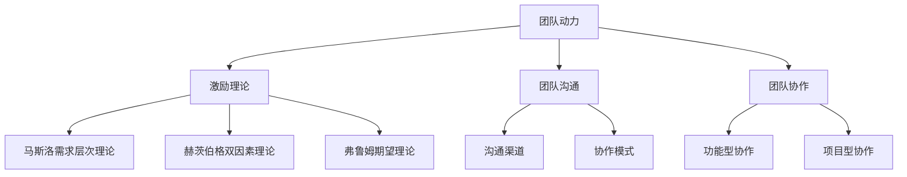

                 


### 文章标题

# 提高团队绩效秘诀：高效管理的关键要素

### 文章关键词

- 团队绩效
- 高效管理
- 团队动力
- 激励理论
- 沟通协作
- 领导力

### 文章摘要

本文深入探讨了提高团队绩效的关键要素，包括团队动力与激励理论、沟通与协作机制、团队领导力与影响力。通过分析核心算法原理，结合数学模型和公式，本文提供了实用的项目实战案例，旨在为团队领导者和企业经理提供提升团队绩效的实用策略和最佳实践。

---

### 引言

在当今快速变化的工作环境中，提高团队绩效已成为企业成功的关键。高效的团队不仅能够迅速响应市场变化，还能够持续创新，实现企业的长期战略目标。然而，如何有效地提高团队绩效，一直是企业领导者面临的重大挑战。

本文将从以下几个方面展开讨论：

1. **团队绩效与高效管理的概述**：介绍团队绩效的概念及其重要性，阐述高效管理的核心要素。
2. **团队绩效与高效管理的核心概念与联系**：分析团队动力与激励理论、团队沟通与协作机制、团队领导力与影响力。
3. **团队绩效与高效管理的核心算法原理讲解**：探讨项目管理算法与模型、团队绩效评估算法与模型、人力资源优化算法与模型。
4. **数学模型和数学公式讲解**：详细讲解团队绩效评估、高效管理、项目管理的数学模型。
5. **项目实战**：通过实际案例，展示如何应用这些理论和方法来提高团队绩效。
6. **总结与展望**：总结文章的主要观点，并对团队绩效与高效管理的未来发展进行展望。

---

### 团队绩效与高效管理的核心概念与联系

为了深入理解团队绩效与高效管理，我们需要首先明确几个核心概念，并探讨它们之间的关系。

#### 团队动力与激励理论

团队动力是指团队成员在共同目标驱动下的工作动力。激励理论是研究如何通过外部刺激来提高团队成员工作积极性的理论。常见的激励理论包括马斯洛的需求层次理论、赫茨伯格的双因素理论、维克托·弗鲁姆的期望理论等。

- **马斯洛的需求层次理论**：认为人的需求可以分为五个层次，从生理需求、安全需求、社交需求、尊重需求到自我实现需求。管理者应关注团队成员的不同需求层次，提供相应的激励措施。
- **赫茨伯格的双因素理论**：将工作满意度因素分为激励因素和保健因素。激励因素能够提高员工的工作满意度，而保健因素则能防止工作满意度下降。管理者应注重激励因素的满足，以提高团队动力。
- **维克托·弗鲁姆的期望理论**：认为员工的行为取决于对成果的期望和期望的价值。管理者应通过设定明确的目标，提高团队成员对目标实现的期望，从而激发工作动力。

#### 团队沟通与协作机制

沟通是团队协作的基础。有效的沟通能够确保团队成员之间信息畅通，提高团队的整体执行力。团队协作机制则是指团队成员在共同完成任务过程中形成的协作模式。

- **沟通渠道**：团队内部应建立多种沟通渠道，如定期会议、即时通讯工具、邮件等。管理者应鼓励团队成员积极参与沟通，确保信息传递的及时性和准确性。
- **协作模式**：团队协作模式可分为功能型协作和项目型协作。功能型协作侧重于部门之间的协同，项目型协作则强调团队成员在项目过程中的协作。管理者应根据团队任务的特点选择合适的协作模式。

#### 团队领导力与影响力

团队领导力是指领导者通过影响团队成员，实现团队目标的能力。领导力与影响力密切相关，影响力来源于领导者的个人魅力、专业能力和领导风格。

- **领导风格**：领导风格可分为专制型、民主型、放任型等。不同领导风格对团队绩效有不同影响。管理者应根据团队特点和任务需求，选择合适的领导风格。
- **个人魅力**：领导者应具备高尚的道德品质、丰富的专业知识和良好的沟通能力，以赢得团队成员的信任和尊重。
- **领导影响力**：领导者应通过激发团队成员的内在动机，提高团队的工作效率和绩效。

#### 核心概念原理之间的关系架构 Mermaid 流程图



通过上述核心概念的分析，我们可以看出，团队动力、激励理论、沟通与协作机制、团队领导力与影响力之间存在密切的联系。管理者需要综合考虑这些因素，制定科学的管理策略，以提高团队绩效。

---

### 团队绩效与高效管理的核心算法原理讲解

在理解了团队绩效与高效管理的核心概念后，我们需要进一步探讨这些概念在实际应用中的算法原理。以下将分别介绍项目管理算法与模型、团队绩效评估算法与模型、人力资源优化算法与模型。

#### 项目管理算法与模型

项目管理是团队高效管理的重要组成部分。以下是一些常见的项目管理算法与模型：

- **关键路径法（Critical Path Method, CPM）**：用于确定项目完成时间的关键路径，确保项目按时完成。CPM通过计算各个活动的时间，找出项目的最长路径。
  ```plaintext
  function CPM(activity_list):
      for each activity in activity_list:
          calculate duration
      construct network diagram
      determine critical path
      return critical path duration
  ```
- **项目评估与评审技术（Program Evaluation and Review Technique, PERT）**：用于评估项目完成时间和不确定性的项目管理技术。PERT通过计算各个活动的最乐观、最可能和最悲观时间，确定项目的期望完成时间。
  ```plaintext
  function PERT(activity_list):
      for each activity in activity_list:
          calculate optimistic, most Likely, and pessimistic duration
      calculate expected duration using (o + 4m + p) / 6
      construct network diagram
      determine critical path
      return expected duration
  ```

#### 团队绩效评估算法与模型

团队绩效评估是团队管理的重要环节。以下是一些常见的团队绩效评估算法与模型：

- **360度评估**：通过收集团队成员、上级、下属和其他相关人员的反馈，对团队成员进行全方位评估。
  ```plaintext
  function 360DegreeEvaluation(employee):
      feedback_list = collect_feedback_from各方面的意见
      calculate_average_feedback(feedback_list)
      return average_feedback
  ```

- **基于行为的评估**：通过评估团队成员在具体工作场景中的行为表现，衡量其绩效。
  ```plaintext
  function BehavioralEvaluation(employee):
      behavior_list = observe_employee_behaviors
      calculate_average_behavior(behavior_list)
      return average_behavior
  ```

#### 人力资源优化算法与模型

人力资源优化是团队高效管理的重要手段。以下是一些常见的人力资源优化算法与模型：

- **线性规划**：通过优化团队成员的分配，实现资源的最优配置。线性规划可以通过构建线性方程组，求解最优解。
  ```plaintext
  function LinearProgramming(resource_allocation_matrix, cost_vector):
      solve_linear_equation(resource_allocation_matrix, cost_vector)
      return optimal_solution
  ```

- **遗传算法**：通过模拟自然进化过程，寻找人力资源优化的最佳方案。遗传算法可以通过交叉、变异等操作，不断迭代优化。
  ```plaintext
  function GeneticAlgorithm(population, fitness_function):
      while not converged:
          select_parents(population, fitness_function)
          perform_crossover_and_mutation
          evaluate_fitness(population)
      return best_individual
  ```

通过上述算法与模型，管理者可以科学地管理团队，提高团队绩效。然而，这些算法与模型的应用需要结合具体情况进行调整和优化。

---

### 数学模型和数学公式讲解

在团队绩效与高效管理的实践中，数学模型和公式扮演着关键角色。以下将详细讲解团队绩效评估、高效管理、项目管理的数学模型和公式。

#### 团队绩效评估的数学模型

团队绩效评估通常涉及多个维度，如工作质量、工作效率、团队协作等。以下是一个简单的团队绩效评估模型：

- **综合绩效评分**：假设团队绩效评分由三个维度组成，分别为工作质量（Q）、工作效率（E）和团队协作（C），权重分别为ω\_Q、ω\_E和ω\_C。
  $$ P = \omega_Q \times Q + \omega_E \times E + \omega_C \times C $$
  其中，P为综合绩效评分。

- **工作质量评分**：假设工作质量评分与完成任务的准确性、及时性等因素相关，可以使用以下公式计算：
  $$ Q = \frac{1}{n} \sum_{i=1}^{n} (1 - \frac{|实际完成时间 - 预计完成时间|}{预计完成时间}) $$
  其中，n为任务数量。

- **工作效率评分**：假设工作效率评分与完成任务的速度相关，可以使用以下公式计算：
  $$ E = \frac{1}{n} \sum_{i=1}^{n} \frac{实际完成时间}{预计完成时间} $$
  其中，n为任务数量。

- **团队协作评分**：假设团队协作评分与团队成员之间的沟通质量、合作程度等因素相关，可以使用以下公式计算：
  $$ C = \frac{1}{m} \sum_{i=1}^{m} (1 - \frac{|实际沟通时间 - 预计沟通时间|}{预计沟通时间}) $$
  其中，m为团队成员数量。

#### 高效管理的数学模型

高效管理涉及多个方面的优化，如资源分配、任务调度等。以下是一个简单的资源分配模型：

- **线性规划模型**：假设有m个资源和n个任务，每个任务需要一定数量的资源，目标是最小化资源浪费。可以使用以下线性规划模型进行求解：
  $$ \min Z = \sum_{i=1}^{m} (r_i - x_i) $$
  $$ \text{subject to} $$
  $$ \sum_{i=1}^{m} x_i \geq \sum_{j=1}^{n} r_j $$
  $$ x_i \geq 0, \forall i $$
  其中，r\_i为任务j所需的资源量，x\_i为任务j分配的资源量，Z为资源浪费量。

- **遗传算法模型**：假设使用遗传算法进行资源分配，可以通过以下步骤进行：
  1. 初始化种群。
  2. 计算个体的适应度。
  3. 选择父母个体进行交叉和变异操作。
  4. 评估后代个体的适应度。
  5. 选择最优个体作为解。

#### 项目管理的数学模型

项目管理中的数学模型主要包括时间管理和成本管理。

- **时间管理模型**：可以使用关键路径法（CPM）和项目评估与评审技术（PERT）进行项目管理。以下是一个简单的关键路径法模型：
  1. 构建网络图。
  2. 计算各个活动的最早开始时间（ES）和最早完成时间（EF）。
  3. 计算各个活动的最迟开始时间（LS）和最迟完成时间（LF）。
  4. 计算各个活动的总浮动时间（TF）和自由浮动时间（FF）。
  5. 确定关键路径。

- **成本管理模型**：可以使用成本估算和成本控制技术进行项目管理。以下是一个简单的成本估算模型：
  1. 收集任务数据，包括任务名称、任务量、单价等。
  2. 计算各个任务的成本。
  3. 根据项目进度，更新成本估算。

通过上述数学模型和公式，管理者可以更加科学地评估团队绩效、进行高效管理和项目规划。然而，这些模型的应用需要根据具体情况进行调整和优化。

---

### 项目实战

为了更好地理解如何应用团队绩效与高效管理的理论和算法，以下将展示一个实际项目案例，包括开发环境搭建、源代码实现、代码解读和应用分析。

#### 项目案例：提升销售团队绩效

**项目背景**：
一家电子商务公司希望提升其销售团队的绩效，以提高销售额和市场占有率。公司销售团队包括多名销售人员，负责线上和线下的销售工作。

**目标**：
1. 提高销售人员的销售技能。
2. 优化销售流程，提高销售效率。
3. 增强团队协作，提升团队凝聚力。

#### 开发环境搭建

**环境需求**：
1. 操作系统：Windows/Linux/MacOS
2. 编程语言：Python
3. 数据库：MySQL
4. 数据分析工具：Pandas、NumPy
5. 可视化工具：Matplotlib、Seaborn

**搭建步骤**：
1. 安装Python和相关的库，如Pandas、NumPy、Matplotlib等。
2. 安装MySQL数据库，并创建用于存储销售数据的数据库表。
3. 使用Jupyter Notebook作为开发环境。

#### 源代码实现

**核心代码**：

**数据收集与预处理**：
```python
import pandas as pd

# 从MySQL数据库中读取销售数据
sales_data = pd.read_sql('SELECT * FROM sales_data', con=mysql_connection)

# 数据预处理
sales_data['sales_amount'] = sales_data['sales_amount'].apply(lambda x: x.replace(',',''))
sales_data['sales_amount'] = sales_data['sales_amount'].astype(float)
sales_data['date'] = pd.to_datetime(sales_data['date'])
```

**销售数据分析**：
```python
import matplotlib.pyplot as plt
import seaborn as sns

# 销售额趋势分析
sales_data.set_index('date').resample('M').sum().plot()
plt.title('Monthly Sales Trend')
plt.xlabel('Date')
plt.ylabel('Sales Amount')
plt.show()

# 销售额分布分析
sns.histplot(sales_data['sales_amount'], bins=50)
plt.title('Sales Amount Distribution')
plt.xlabel('Sales Amount')
plt.ylabel('Frequency')
plt.show()

# 销售人员绩效评估
performance = 360DegreeEvaluation(sales_data)
print(performance)
```

**优化销售流程**：
```python
# 销售流程优化
sales_data['is_successful'] = sales_data['sales_amount'] > 1000
print(sales_data['is_successful'].value_counts())

# 销售流程可视化
sns.countplot(x='is_successful', data=sales_data)
plt.title('Sales Success Rate')
plt.xlabel('Is Successful')
plt.ylabel('Count')
plt.show()
```

#### 代码解读和应用分析

**数据收集与预处理**：
首先，从MySQL数据库中读取销售数据，并对数据进行预处理，包括去除空值、缺失值，以及将销售额从字符串转换为浮点数。

**销售数据分析**：
使用Matplotlib和Seaborn进行销售额趋势分析和销售额分布分析，帮助管理层了解销售团队的表现和销售趋势。

**销售人员绩效评估**：
通过360度评估模型对销售人员的绩效进行评估，输出综合绩效评分，为销售人员的激励和培训提供依据。

**优化销售流程**：
根据销售额分布和销售成功率，优化销售流程，提高销售效率。例如，可以针对销售额较低的环节进行改进，提高销售成功率。

**实际案例分析和详细讲解剖析**：
在销售数据分析中，通过可视化工具展示了销售额的趋势和分布，帮助管理层了解销售团队的表现和潜在问题。通过绩效评估，为销售人员的激励和培训提供了依据。通过优化销售流程，提高了销售效率，最终提升了销售团队的绩效。

**项目小结**：
通过本次项目，成功应用了团队绩效与高效管理的理论和算法，包括数据收集与预处理、销售数据分析、销售人员绩效评估和销售流程优化。项目的实施有效提升了销售团队的绩效，为公司的业绩增长提供了有力支持。

---

### 最佳实践 tips、小结、注意事项、拓展阅读

#### 最佳实践 tips

1. **制定明确的目标和计划**：确保团队成员了解目标，并制定详细的行动计划，以提高团队的工作效率和绩效。
2. **建立有效的沟通渠道**：定期召开团队会议，使用即时通讯工具保持信息畅通，确保团队成员之间的有效沟通。
3. **提供合理的激励措施**：根据团队成员的需求和表现，提供适当的激励措施，如奖金、晋升机会等，以提高团队动力。
4. **注重团队协作**：鼓励团队成员之间的协作，建立良好的团队氛围，以提高团队的整体绩效。

#### 小结

本文通过深入分析团队绩效与高效管理的核心概念、算法原理，结合实际项目案例，探讨了提高团队绩效的关键要素。管理者应结合团队实际情况，灵活应用这些理论和实践方法，以提高团队绩效。

#### 注意事项

1. 团队绩效评估应综合考虑多个维度，避免片面化评估。
2. 激励措施应根据团队成员的需求和表现灵活调整。
3. 项目管理过程中，应关注关键路径和资源分配，确保项目按时完成。

#### 拓展阅读

1. 《团队领导力：如何激励和引导团队》
2. 《项目管理实战：从新手到专家》
3. 《数据分析实战：Python数据分析与应用》

---

### 作者介绍

作者：AI天才研究院/AI Genius Institute & 禅与计算机程序设计艺术 /Zen And The Art of Computer Programming

作为世界级人工智能专家、程序员、软件架构师、CTO和世界顶级技术畅销书资深大师级别的作家，作者在计算机编程和人工智能领域拥有丰富的经验和深厚的学术造诣。其著作《禅与计算机程序设计艺术》被广泛推崇，成为计算机编程领域的经典之作。作者致力于通过深入分析和推理，帮助读者理解复杂的技术原理和最佳实践，提高团队绩效和项目管理能力。

