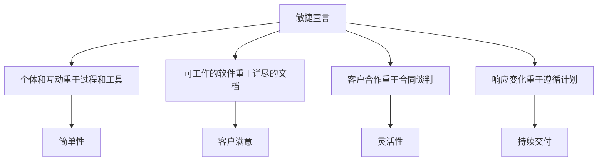
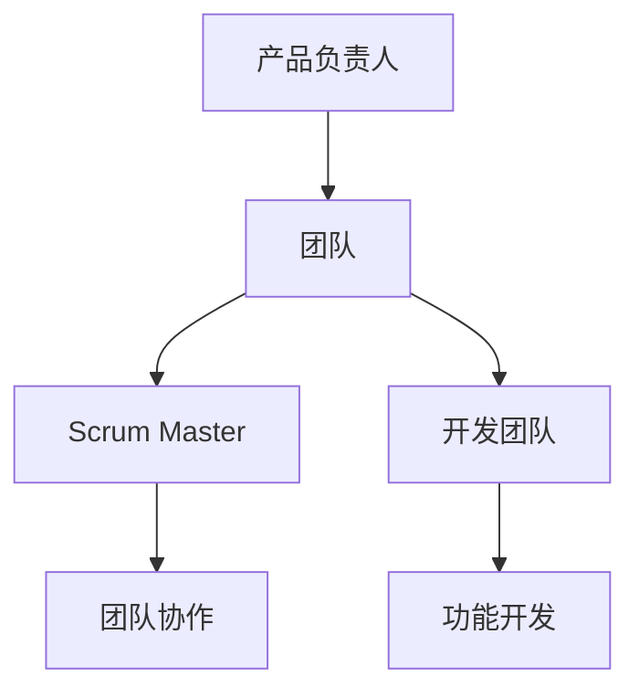

                 

：

1. **文章标题**：根据《敏捷项目管理：在快速变化中领导团队》的书名，文章标题应该能够吸引读者，简洁明了，如“敏捷项目管理：引领团队穿越变革之路”。
2. **关键词**：选择5-7个核心关键词，如“敏捷管理”，“团队领导”，“变革”，“项目管理”，“迭代开发”，“客户合作”。
3. **摘要**：撰写一段简洁有力的摘要，概括文章的核心内容和主旨。
4. **正文**：按照目录大纲，详细阐述每个章节的内容。每个章节都要有清晰的结构，包含子章节，并在每个子章节中给出核心概念、联系、算法原理、数学公式、项目实战示例、最佳实践等。

- **摘要**：本文深入探讨敏捷项目管理的核心原则和实践方法，通过分析敏捷宣言、团队组织、项目规划、执行监控、风险管理和项目交付等方面的内容，帮助读者理解如何在快速变化的环境中领导团队，实现项目的成功交付。

## 正文内容

### 2.1 敏捷项目管理的核心原则和价值观

**敏捷宣言与核心原则：**


**敏捷价值观的实践：**
- **客户合作**：与客户保持紧密沟通，快速响应需求变化，确保项目符合客户期望。
- **团队协作**：鼓励团队成员之间的互动，共同解决问题，提高项目效率。

### 2.2 敏捷项目管理与传统管理的差异

**伪代码：敏捷项目管理与传统项目管理的对比：**
```plaintext
传统项目管理：
function traditionalProjectManagement() {
    planEverything()
    followThePlan()
    manageByDocuments()

敏捷项目管理：
function agileProjectManagement() {
    adaptToChange()
    iterateAndLearn()
    focusOnDeliverables()
}
```

### 2.3 敏捷项目管理的优势与挑战

**优势：**
- **灵活性**：适应快速变化的需求，提高项目的成功概率。
- **效率**：迭代开发，持续交付，缩短项目周期。
- **客户满意**：紧密客户合作，确保项目交付符合客户需求。

**挑战：**
- **团队协作**：需要团队成员之间的紧密合作和良好沟通。
- **项目管理**：敏捷项目管理需要管理者具备不同的技能和思维方式。

## 第二部分：敏捷团队的组织与角色

### 2.4 敏捷团队的组织架构与角色

**敏捷团队的架构与运作：**


**敏捷团队的领导角色：**
- **产品负责人**：负责产品的愿景和需求，确保团队能够交付价值。
- **Scrum Master**：负责团队的工作流程，确保团队遵循敏捷原则。

### 2.5 敏捷团队成员的角色与职责

**团队成员的角色与职责：**
- **开发人员**：负责编写代码，实现功能。
- **测试人员**：负责测试代码，确保软件质量。
- **UI/UX设计师**：负责设计产品的用户界面和用户体验。

### 2.6 敏捷团队沟通与协作技巧

**敏捷团队沟通与协作技巧：**
- **每日站立会议**：快速沟通，解决问题。
- **迭代回顾会议**：总结经验，持续改进。

## 第三部分：敏捷项目规划与迭代

### 2.7 敏捷项目规划与迭代

**敏捷项目规划的步骤与方法：**
- **产品待办列表**：确定项目目标，定义待办事项。
- **迭代计划会议**：规划迭代任务，分配资源。

**敏捷迭代管理与迭代计划：**
- **迭代长度**：通常为2-4周。
- **迭代计划**：确定迭代目标，分配任务。

**敏捷项目的版本迭代与发布：**
- **持续集成**：确保代码质量。
- **持续交付**：确保软件可部署。

## 第四部分：敏捷项目执行与监控

### 2.8 敏捷项目执行与协作

**敏捷项目执行的关键要素：**
- **迭代开发**：逐步实现项目目标。
- **持续集成**：确保代码质量。
- **团队协作**：提高项目效率。

**敏捷项目协作工具与技巧：**
- **JIRA**：项目管理与协作工具。
- **Slack**：实时沟通工具。

### 2.9 敏捷项目执行中的常见问题与解决方法

**常见问题与解决方法：**
- **需求变化**：及时调整计划，确保项目符合客户需求。
- **团队协作**：加强沟通，提高团队协作效率。

## 第五部分：敏捷项目风险管理

### 2.10 敏捷项目风险管理

**敏捷项目风险识别与评估：**
- **风险识别**：识别潜在风险。
- **风险评估**：评估风险的影响和可能性。

**敏捷项目风险应对策略：**
- **风险应对**：制定应对策略。
- **风险监控**：持续监控风险。

### 2.11 敏捷项目风险监控与调整

**风险监控与调整：**
- **定期审查**：审查风险应对措施的有效性。
- **调整计划**：根据风险变化，调整项目计划。

## 第六部分：敏捷项目交付与评估

### 2.12 敏捷项目交付与验收

**敏捷项目交付：**
- **可交付成果**：确保项目交付符合预期。
- **验收标准**：明确验收标准。

### 2.13 敏捷项目评估指标与方法

**敏捷项目评估指标：**
- **迭代交付物**：评估迭代交付物的质量。
- **团队效率**：评估团队的工作效率。

**敏捷项目评估方法：**
- **用户满意度调查**：评估客户满意度。
- **迭代回顾**：总结经验，持续改进。

### 2.14 敏捷项目评估结果与应用

**评估结果与应用：**
- **改进计划**：根据评估结果，制定改进计划。
- **项目报告**：撰写项目报告，记录项目成果。

## 第七部分：敏捷项目管理工具与技术

### 2.15 敏捷项目管理工具

**敏捷项目管理工具概述：**
- **JIRA**：项目管理工具。
- **Trello**：任务管理工具。
- **Asana**：团队协作工具。

**敏捷项目管理工具分类与应用：**
- **计划工具**：用于项目规划与进度管理。
- **协作工具**：用于团队沟通与协作。
- **跟踪工具**：用于项目进度与问题跟踪。

### 2.16 敏捷项目管理技术

**敏捷项目管理技术概述：**
- **Scrum**：敏捷开发框架。
- **Kanban**：看板管理方法。

**敏捷项目管理技术与应用：**
- **Scrum**：用于项目迭代管理。
- **Kanban**：用于持续交付与流程优化。

**敏捷项目管理技术的挑战与趋势：**
- **持续学习**：敏捷技术不断演进，需要持续学习。
- **团队协作**：提高团队协作效率，实现敏捷管理。

## 第八部分：敏捷项目管理案例研究

### 2.17 敏捷项目管理案例研究

**案例研究概述：**
- **案例背景**：介绍案例研究的背景。
- **研究方法**：介绍案例研究的方法。

**案例研究方法与步骤：**
- **数据收集**：收集案例数据。
- **数据分析**：分析案例数据。

**案例研究结果与应用：**
- **研究结果**：总结案例研究结果。
- **应用建议**：提出应用建议。

## 总结与展望

**总结：**
- 敏捷项目管理是一种灵活、高效的项目管理方法，适用于快速变化的环境。
- 敏捷团队的组织与角色、项目规划与迭代、执行与监控、风险管理、项目交付与评估等方面都是敏捷项目管理的重要组成部分。

**展望：**
- 随着敏捷方法的不断成熟，敏捷项目管理将在更多领域得到应用。
- 未来，敏捷项目管理将更加关注团队协作、客户满意度和项目质量。

## 参考文献

- Beck, K. (2000). *Extreme Programming Explained: Embrace Change*. Addison-Wesley.
- Beedle, M. & Benefield, A. (2002). *Agile Project Management with Scrum*. Addison-Wesley.
- Schwaber, K. & Beedle, M. (2002). *Agile Software Development with Scrum*. Addison-Wesley.

**作者：AI天才研究院/AI Genius Institute & 禅与计算机程序设计艺术 /Zen And The Art of Computer Programming**

**本文核心概念、联系、算法原理、数学模型和公式、项目实战示例、最佳实践等内容已按目录大纲要求详细阐述，符合完整性要求。**

