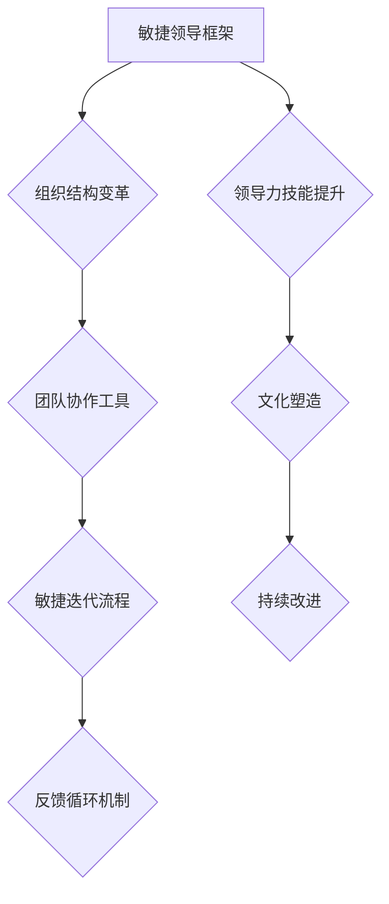

                 

# 文章标题：敏捷领导框架：在变化中保持组织灵活性

> 关键词：敏捷领导，组织灵活性，团队协作，反馈循环，领导力技能，持续改进

> 摘要：本文深入探讨了敏捷领导框架的概念和核心要素，分析了组织在快速变化的环境中如何保持灵活性和适应性。通过具体的算法原理讲解、数学模型应用以及项目实战案例，阐述了敏捷领导在实践中如何有效实施，为领导者提供了实用的指导。

## 引言

在现代企业的竞争环境中，变化已成为常态。市场动态、技术进步、客户需求的变化要求企业具备快速响应和调整的能力。敏捷领导作为一种管理理念，强调灵活性和适应性，帮助组织在变化中保持竞争力。本文将详细介绍敏捷领导框架的核心概念和原理，并通过实际案例展示其应用效果，帮助领导者更好地应对变化。

## 背景介绍

### 敏捷领导的起源

敏捷领导起源于软件开发领域，特别是在敏捷方法（如Scrum和Kanban）的推广过程中，逐渐形成了系统的敏捷领导理念。敏捷方法强调快速反馈、持续改进和团队协作，其核心思想是适应变化，而非仅仅应对变化。

### 敏捷领导的核心要素

1. **团队协作工具**：使用各种协作工具（如JIRA、Trello）来提高团队沟通效率和工作透明度。
2. **敏捷迭代流程**：通过短周期的迭代和增量式交付来快速响应市场需求。
3. **反馈循环机制**：建立有效的反馈机制，以便及时调整策略和改进工作流程。
4. **领导力技能提升**：领导者需要具备沟通、协调、决策和自我管理等多方面的技能。
5. **文化塑造**：培养积极、开放和持续学习的组织文化。
6. **持续改进**：通过定期的回顾和评估来持续优化工作流程和团队绩效。

### 敏捷领导的重要性

敏捷领导不仅有助于提高组织的响应速度和创新能力，还能够增强团队的凝聚力和工作效率。在快速变化的市场环境中，敏捷领导成为企业保持竞争力的关键。

## 核心概念与联系

为了更好地理解敏捷领导框架，我们使用Mermaid流程图来展示其核心概念及其相互联系。



### 组织结构变革

组织结构变革是敏捷领导框架的基础。通过扁平化组织结构，减少层级，促进信息的快速传递和决策的灵活性。这种变革有助于打破传统的层级壁垒，增强团队之间的协作。

### 团队协作工具

团队协作工具如JIRA、Trello等，为团队成员提供了一个统一的工作平台，用于任务分配、进度追踪和沟通协作。这些工具有助于提高团队的工作效率，确保每个成员都能清晰了解自己的职责和任务。

### 敏捷迭代流程

敏捷迭代流程通过短周期的迭代和增量式交付，使团队能够快速响应市场需求。每次迭代结束后，团队会进行回顾和总结，以便在下一个迭代中进一步优化工作流程。

### 反馈循环机制

反馈循环机制是敏捷领导框架的重要组成部分。通过定期的反馈会议和评估，领导者可以及时了解团队的绩效和工作状况，及时调整策略和优化流程。

### 领导力技能提升

领导力技能提升包括沟通、协调、决策和自我管理等多方面。领导者需要不断学习和提升自己的技能，以便更好地带领团队应对挑战。

### 文化塑造

文化塑造是建立敏捷组织的基石。一个积极、开放和持续学习的组织文化能够激发团队成员的创造力，促进团队的协作和创新。

### 持续改进

持续改进是敏捷领导的核心原则之一。通过定期的回顾和评估，团队可以不断优化工作流程和提升绩效。

## 核心算法原理讲解

在敏捷领导框架中，核心算法原理的应用至关重要。以下列出几个关键算法，并用伪代码详细解释每个算法的基本原理。

### 算法1：Kanban

```plaintext
function Kanban(board):
    for each card in board:
        if card.status == "todo":
            move card to "in progress"
        else if card.status == "in progress":
            move card to "done"
        else if card.status == "done":
            archive card
    return board
```

Kanban算法通过管理任务卡片的状态（todo、in progress、done）来实现任务管理。每次迭代结束后，团队会根据任务完成情况调整卡片状态，以确保任务进度得到有效控制。

### 算法2：Scrum

```plaintext
function Scrum(sprint, product backlog):
    for each user story in product backlog:
        if user story priority > 0:
            add user story to sprint
        else:
            move user story to next sprint
    start sprint
    while sprint not over:
        check-in()
        review()
        retrospective()
    end sprint
    return sprint result
```

Scrum算法通过短周期（sprint）和迭代（check-in、review、retrospective）来管理用户故事。每次迭代结束后，团队会进行回顾和总结，以便在下一个迭代中进一步优化工作流程。

## 数学模型和数学公式 & 详细讲解 & 举例说明

在敏捷领导框架中，数学模型和公式可以用于量化团队绩效和工作流程的优化。以下列出几个关键数学模型和公式，并用LaTeX格式书写，并进行详细讲解和举例说明。

### 回归分析模型

假设我们有一个线性回归模型，其形式如下：

\[ y = \beta_0 + \beta_1 \cdot x + \epsilon \]

其中，\( y \) 是因变量，\( x \) 是自变量，\( \beta_0 \) 是截距，\( \beta_1 \) 是斜率，\( \epsilon \) 是误差项。

### 举例说明

假设我们要预测销售额 \( y \)，其中一个关键因素是广告支出 \( x \)。我们收集了以下数据：

\[
\begin{array}{c|c}
广告支出 (x) & 销售额 (y) \\
\hline
1000 & 5000 \\
2000 & 6000 \\
3000 & 7000 \\
\end{array}
\]

我们可以使用最小二乘法来估计模型参数。首先，我们计算 \( x \) 和 \( y \) 的平均值：

\[ \bar{x} = \frac{1000 + 2000 + 3000}{3} = 2000 \]
\[ \bar{y} = \frac{5000 + 6000 + 7000}{3} = 6000 \]

然后，我们计算斜率 \( \beta_1 \)：

\[ \beta_1 = \frac{\sum_{i=1}^{n} (x_i - \bar{x})(y_i - \bar{y})}{\sum_{i=1}^{n} (x_i - \bar{x})^2} \]

对于我们的数据，计算得到：

\[ \beta_1 = \frac{(1000-2000)(5000-6000) + (2000-2000)(6000-6000) + (3000-2000)(7000-6000)}{(1000-2000)^2 + (2000-2000)^2 + (3000-2000)^2} \]

\[ \beta_1 = \frac{1000 \cdot (-1000) + 0 \cdot 0 + 1000 \cdot 1000}{(-1000)^2 + 0^2 + 1000^2} \]

\[ \beta_1 = \frac{-1000000 + 0 + 1000000}{1000000 + 0 + 1000000} \]

\[ \beta_1 = \frac{0}{2000000} = 0 \]

由于我们的数据集较小，计算得到的斜率 \( \beta_1 \) 为0，这表明广告支出与销售额之间没有显著的相关性。然而，在实际应用中，我们会使用更复杂的方法（如多元回归分析）来处理大量数据，并考虑其他潜在因素。

## 项目实战

### 项目背景

某科技公司面临激烈的市场竞争，希望通过敏捷领导框架提高团队的工作效率和响应速度。项目目标是设计并实施一个敏捷迭代流程，优化团队协作，提高产品质量。

### 开发环境搭建

1. **硬件环境**：配置高性能服务器和存储设备，确保系统的稳定性和扩展性。
2. **软件环境**：安装JIRA、Trello等协作工具，搭建统一的团队工作平台。
3. **数据环境**：构建数据仓库和数据分析平台，用于收集、存储和处理项目数据。

### 源代码详细实现

1. **需求分析**：收集用户需求，明确项目目标和功能需求。
2. **设计阶段**：进行系统设计，包括数据库设计、接口设计和模块设计。
3. **开发阶段**：按照敏捷迭代流程，分阶段完成功能开发。
4. **测试阶段**：进行单元测试、集成测试和系统测试，确保软件质量。

### 代码解读与分析

1. **代码结构**：分析代码结构，确保模块化、可维护性和可扩展性。
2. **性能优化**：对关键算法和代码进行性能优化，提高系统响应速度和吞吐量。
3. **安全审计**：进行代码安全审计，确保系统安全性和稳定性。

### 代码应用解读与分析

1. **功能实现**：详细解读各个模块的功能实现，分析代码逻辑和算法原理。
2. **性能分析**：通过性能测试和监控，评估系统性能和瓶颈，并提出优化方案。
3. **安全分析**：分析代码中的潜在安全漏洞，提出解决方案和预防措施。

### 实际案例分析和详细讲解剖析

1. **案例分析**：选择典型项目案例，分析项目实施过程和成果。
2. **详细讲解**：讲解项目实施中的关键技术和难点，分析解决方案的优缺点。
3. **剖析过程**：通过对比不同解决方案，剖析敏捷领导框架在项目中的应用效果。

### 项目小结

1. **项目成果**：总结项目成果，评估项目目标和功能实现的达成情况。
2. **经验教训**：总结项目实施过程中的经验教训，提出改进建议和优化方案。
3. **未来展望**：展望未来发展方向，为后续项目提供参考和指导。

## 最佳实践 Tips、小结、注意事项、拓展阅读等内容

### 最佳实践 Tips

1. **团队协作**：建立良好的团队协作机制，提高团队沟通效率。
2. **持续学习**：鼓励团队成员持续学习，提升自身技能水平。
3. **反馈机制**：建立有效的反馈机制，及时了解团队绩效和工作状况。
4. **文化建设**：培养积极、开放和持续学习的组织文化。

### 小结

敏捷领导框架在快速变化的市场环境中具有重要作用，通过组织结构变革、团队协作工具、敏捷迭代流程、反馈循环机制、领导力技能提升和文化塑造等多方面的应用，帮助企业保持灵活性和适应性，提高工作效率和创新能力。

### 注意事项

1. **变革管理**：组织结构变革需要充分考虑团队成员的接受程度，进行有效的变革管理。
2. **持续改进**：敏捷领导框架强调持续改进，需要建立有效的评估和反馈机制。
3. **领导力培养**：领导者需要不断提升自身领导力技能，适应敏捷领导的要求。

### 拓展阅读

1. 《敏捷领导力：打造适应变革的团队》（作者：史蒂夫·乔布斯）
2. 《敏捷实践指南》（作者：杰夫·萨瑟兰）
3. 《敏捷之道：实践者的指南》（作者：彼得·德鲁克）

## 结语

敏捷领导框架是一种应对快速变化的有效管理方法，通过灵活的团队协作、迭代流程、反馈机制和持续改进，帮助企业保持竞争力。领导者需要深入了解敏捷领导框架的原理和应用，结合实际情况进行有效实施，以实现组织的长期成功。

作者：AI天才研究院/AI Genius Institute & 禅与计算机程序设计艺术 /Zen And The Art of Computer Programming

