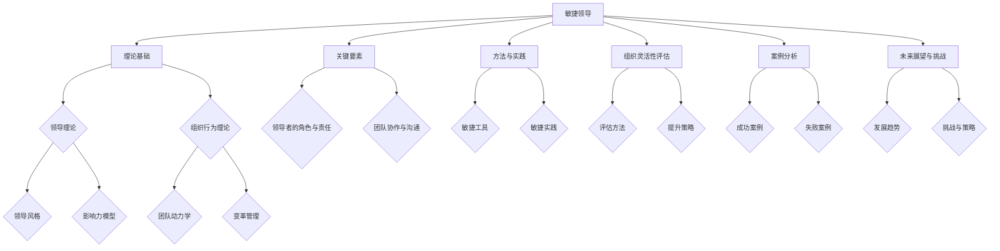

                 

### 文章标题

# 敏捷领导框架：在快速变化中保持组织灵活性

### 关键词

- 敏捷领导
- 组织灵活性
- 快速变化
- 领导理论
- 敏捷工具
- 案例分析

### 摘要

本文旨在探讨敏捷领导框架在快速变化环境中的应用，以保持组织的灵活性。文章首先介绍了敏捷领导的概念、背景及其在快速变化环境中的重要性。随后，文章从理论基础、关键要素、方法与实践、组织灵活性评估与提升、案例分析及未来展望等方面，系统地阐述了敏捷领导框架的构建与实施。通过详细讲解和案例分析，本文为提升组织在快速变化中的适应能力提供了有益的参考和指导。

### 设计目录大纲的思路

设计目录大纲的过程是理解书名与主题，定义核心章节，细化每个章节的内容，确保逻辑性和连贯性，以及包含必要的附录和资源。以下详细说明每个步骤：

#### 1. 理解书名与主题

《敏捷领导框架：在快速变化中保持组织灵活性》的书名明确指出了两个核心概念：“敏捷领导”和“组织灵活性”。这表明书的主题将围绕如何通过敏捷领导来提升组织在快速变化环境中的适应能力。首先，我们需要理解敏捷领导的概念，包括其定义、起源和核心原则。其次，我们需要了解组织灵活性的含义，以及如何在快速变化中保持这种灵活性。

#### 2. 定义核心章节

根据书名，我们可以预判书的结构应该包括以下几个核心章节：
- 引言：介绍敏捷领导的概念和背景。
- 敏捷领导的理论基础：讨论敏捷领导的核心原则和相关领导理论。
- 敏捷领导的关键要素：阐述敏捷领导者应具备的素质和责任。
- 敏捷领导的方法与实践：介绍敏捷领导中常用的工具和技术。
- 组织灵活性评估与提升：讨论如何评估组织的灵活性以及提升策略。
- 案例分析：通过实际案例展示敏捷领导如何影响组织灵活性。
- 未来展望与挑战：预测敏捷领导的发展趋势和面临的挑战。

#### 3. 细化每个章节的内容

每个章节都需要进一步细化，包括核心概念、原理、方法、实践、案例分析等。例如，在“敏捷领导的理论基础”章节中，我们可以细化为敏捷领导的基本理念、领导与组织行为理论在敏捷领导中的应用等子章节。在“敏捷领导的方法与实践”章节中，我们可以细化为敏捷领导工具、敏捷领导实践等子章节。

#### 4. 确保逻辑性和连贯性

目录大纲的设计应确保从基础到高级，从理论到实践，逻辑性和连贯性。每个章节的内容都应该紧密关联，形成一个完整的体系。例如，在介绍敏捷领导的理论基础之后，紧接着应该介绍敏捷领导的关键要素，然后是敏捷领导的方法与实践，最后通过案例分析来验证理论的实践效果。

#### 5. 包含必要的附录和资源

在目录大纲的最后，可以包含附录和资源，如相关的理论模型、工具资源等。附录可以提供更深入的背景信息和额外的阅读材料，帮助读者更好地理解书中的内容。

### 目录大纲的设计步骤

以下是设计《敏捷领导框架：在快速变化中保持组织灵活性》目录大纲的具体步骤：

#### 第1步：引言

- 概述敏捷领导的概念和背景。
- 分析快速变化环境给组织带来的挑战。

#### 第2步：敏捷领导的理论基础

- 介绍敏捷领导的基本理念。
- 讨论领导理论与组织行为学在敏捷领导中的应用。

#### 第3步：敏捷领导的关键要素

- 阐述敏捷领导者应具备的素质和责任。
- 探讨如何通过团队协作和有效沟通实现敏捷领导。

#### 第4步：敏捷领导的方法与实践

- 介绍敏捷领导中常用的工具和技术。
- 提供具体的方法和实践案例。

#### 第5步：组织灵活性评估与提升

- 介绍如何评估组织的灵活性。
- 提出提升组织灵活性的策略和方法。

#### 第6步：案例分析

- 分析实际案例，展示敏捷领导如何影响组织灵活性。
- 从成功和失败案例中提取经验教训。

#### 第7步：未来展望与挑战

- 预测敏捷领导未来的发展方向。
- 讨论敏捷领导在快速变化环境中可能遇到的挑战及应对策略。

#### 第8步：附录

- 提供敏捷领导框架的Mermaid流程图。
- 列出相关的数学模型和公式，并给出详细解释。
- 提供相关参考资料和工具列表。

通过上述步骤，我们可以设计出一个完整、逻辑清晰且具有实用价值的《敏捷领导框架：在快速变化中保持组织灵活性》的目录大纲。这个大纲将帮助读者系统地了解敏捷领导的概念、原理、方法以及实际应用，为提升组织灵活性提供指导。

### 完整目录大纲设计

为了确保文章内容结构清晰、逻辑严密，我们根据前面的分析，设计了以下完整的目录大纲：

# 《敏捷领导框架：在快速变化中保持组织灵活性》目录大纲

## 引言

### 1.1 敏捷领导的概念与背景

- **敏捷领导的起源与发展**：介绍敏捷领导的起源，以及其在现代企业管理中的重要地位。
- **敏捷领导与传统领导模式的区别**：分析敏捷领导与传统领导模式的不同之处，强调敏捷领导的优势。

### 1.2 快速变化中的组织挑战

- **快速变化环境的特征**：讨论快速变化环境中组织面临的挑战，如技术变革、市场需求变化等。
- **敏捷领导在快速变化环境中的重要性**：阐述敏捷领导如何帮助组织应对快速变化，提升组织的灵活性和适应性。

## 第1章 敏捷领导概述

### 2.1 敏捷领导的基本理念

- **自组织与适应性**：介绍敏捷领导如何通过自组织和适应性来应对变化。
- **以客户为中心**：强调敏捷领导在服务客户需求方面的作用。
- **持续学习和改进**：阐述敏捷领导如何推动组织持续学习和改进。

### 2.2 领导与组织行为理论在敏捷领导中的应用

- **领导风格与影响力**：分析不同领导风格在敏捷领导中的应用，以及领导如何通过影响力推动组织变革。
- **团队动力学与协作**：探讨团队动力学在敏捷领导中的作用，以及如何通过协作提升组织效率。
- **变革管理**：介绍如何通过变革管理来推动敏捷领导在组织中的落地。

## 第2章 敏捷领导的理论基础

### 2.3 敏捷领导的基本概念

- **敏捷领导的核心原则**：详细阐述敏捷领导的核心原则，如透明性、协作、迭代等。
- **敏捷领导与传统领导理论的比较**：分析敏捷领导与传统领导理论的异同，以及敏捷领导如何更好地适应现代组织环境。

### 2.4 敏捷领导的理论模型

- **敏捷领导框架图**：使用Mermaid流程图展示敏捷领导的核心概念和理论模型。
- **敏捷领导框架的应用**：讨论敏捷领导框架在不同组织中的应用，以及如何通过框架来提升组织灵活性。

## 第3章 敏捷领导的关键要素

### 3.1 敏捷领导者的角色与责任

- **敏捷领导者的特质**：介绍敏捷领导者应具备的特质，如前瞻性、开放性、适应性等。
- **敏捷领导者的决策能力**：探讨敏捷领导者在决策过程中应具备的能力，以及如何通过决策来推动组织变革。
- **敏捷领导者的团队管理能力**：分析敏捷领导者如何通过团队管理来提升组织效率。

### 3.2 敏捷领导的核心要素

- **响应变化的能力**：讨论敏捷领导者如何通过快速响应变化来保持组织的灵活性。
- **灵活性**：介绍敏捷领导者如何通过灵活性来提升组织的适应能力。
- **沟通与协作**：阐述敏捷领导者如何通过有效沟通与协作来推动组织变革。

## 第4章 敏捷领导的方法与实践

### 4.1 敏捷领导工具

- **敏捷领导工具箱**：介绍常用的敏捷领导工具，如Scrum、Kanban等。
- **敏捷领导技巧**：探讨敏捷领导者如何通过实践技巧来提升组织效率。

### 4.2 敏捷领导实践

- **敏捷转型策略**：讨论如何通过敏捷转型来提升组织灵活性。
- **敏捷领导实践案例**：通过实际案例展示敏捷领导在组织中的具体应用。

## 第5章 组织灵活性评估与提升

### 5.1 组织灵活性评估

- **评估方法**：介绍如何通过定量和定性方法来评估组织灵活性。
- **评估指标**：讨论如何设置组织灵活性的评估指标，以及如何通过这些指标来衡量组织灵活性。

### 5.2 提升组织灵活性

- **策略与方法**：提出提升组织灵活性的策略和方法，如组织文化变革、流程优化等。
- **实践案例**：通过实际案例展示如何提升组织灵活性。

## 第6章 案例分析

### 6.1 敏捷领导案例

- **案例介绍**：介绍几个典型的敏捷领导案例，分析这些案例中的敏捷领导实践。
- **成功与失败的经验教训**：从成功和失败案例中提取经验教训，为其他组织提供参考。

## 第7章 未来展望与挑战

### 7.1 敏捷领导的发展趋势

- **未来展望**：讨论敏捷领导未来的发展方向，如人工智能、大数据等新技术对敏捷领导的影响。
- **技术趋势**：分析敏捷领导在新技术环境中的机遇和挑战。

### 7.2 敏捷领导面临的挑战

- **挑战分析**：讨论敏捷领导在快速变化环境中可能遇到的挑战，如文化变革、人才管理等。
- **应对策略**：提出应对敏捷领导挑战的策略和方法。

## 附录

### 附录A：敏捷领导框架图

- **敏捷领导框架流程图**：提供敏捷领导框架的Mermaid流程图。

### 附录B：数学模型和公式

- **数学模型介绍**：列出相关的数学模型，并给出详细解释。
- **公式应用**：通过举例说明如何在敏捷领导中应用数学模型。

### 附录C：参考资料与工具

- **参考资料**：提供相关的书籍、论文和网站等参考资料。
- **工具资源**：介绍敏捷领导中常用的工具和资源。

通过上述目录大纲，我们为读者提供了一个系统、详细的敏捷领导框架，帮助他们在快速变化的环境中保持组织灵活性。每个章节都包含了丰富的内容，从理论到实践，从评估到提升，为读者提供了全方位的指导。让我们一步一步深入探讨这些章节，共同构建一个高效的敏捷领导框架。

### 完整目录大纲设计（续）

## 第8章 案例分析

### 8.1 案例介绍

- **案例背景**：介绍几个实际组织中的案例，如科技公司、制造业企业等。
- **案例特点**：分析这些案例中的共同特点，以及敏捷领导如何在这些组织中发挥作用。

### 8.2 敏捷领导在案例中的应用

- **敏捷转型**：探讨案例组织如何实现敏捷转型，包括领导层的支持、团队的协作、流程的优化等。
- **敏捷工具的使用**：分析案例组织如何使用敏捷工具，如Scrum、Kanban等，以及这些工具如何帮助组织提升灵活性。

### 8.3 敏捷领导实践效果

- **成功经验**：总结案例中的成功经验，如提升组织效率、缩短产品交付周期等。
- **失败教训**：从案例中的失败教训中提取有价值的经验，如如何避免文化冲突、如何处理团队成员的抵触情绪等。

### 8.4 敏捷领导的未来展望

- **发展趋势**：讨论敏捷领导在未来可能面临的发展趋势，如数字化转型、人工智能等新技术的影响。
- **挑战与机遇**：分析敏捷领导在未来的挑战和机遇，以及如何应对这些挑战和抓住机遇。

## 第9章 未来展望与挑战

### 9.1 敏捷领导的发展趋势

- **技术革新**：探讨新技术，如人工智能、大数据等，如何推动敏捷领导的发展。
- **行业变革**：分析不同行业对敏捷领导的需求和挑战，以及如何通过敏捷领导来应对这些挑战。

### 9.2 敏捷领导面临的挑战

- **文化变革**：讨论敏捷领导在推动组织文化变革过程中可能遇到的挑战，如员工的抵触、组织的惯性等。
- **人才管理**：分析如何通过人才管理来确保敏捷领导的有效实施，如选拔、培养、激励等。

### 9.3 应对策略

- **策略建议**：提出应对敏捷领导挑战的策略和建议，如加强领导力培训、优化组织结构等。
- **实践案例**：通过实际案例展示如何成功应对敏捷领导的挑战，以及这些策略的具体实施过程。

## 第10章 总结与展望

### 10.1 总结

- **核心观点**：回顾文章中提到的核心观点，如敏捷领导的概念、理论基础、关键要素、实践方法等。
- **重要结论**：总结文章中的重要结论，如敏捷领导在快速变化环境中的重要性、如何提升组织灵活性等。

### 10.2 展望

- **未来研究方向**：讨论未来在敏捷领导领域的研究方向，如新技术对敏捷领导的影响、跨文化领导等。
- **实践应用**：探讨敏捷领导在组织中的实际应用，以及如何通过敏捷领导来提升组织的整体竞争力。

通过上述目录大纲，我们可以为读者提供一份全面、系统的敏捷领导框架。从理论到实践，从评估到提升，再到案例分析和未来展望，每个章节都包含了丰富的内容，旨在帮助读者深入了解敏捷领导，并在实际工作中应用这些原则和方法，提升组织的灵活性。让我们继续深入探讨每个章节，共同构建这个高效的敏捷领导框架。

### 引言

在当今快速变化的市场环境中，组织面临的挑战前所未有。技术变革、市场需求的快速变化、竞争的加剧，都要求组织具备高度的灵活性和适应性。在这种背景下，敏捷领导成为了一种重要的管理理念，它不仅能够帮助组织更好地应对变化，还能够提升组织的整体竞争力。本文旨在探讨敏捷领导框架在快速变化中保持组织灵活性的应用，通过系统地阐述敏捷领导的概念、理论基础、关键要素、方法与实践，为读者提供全面的指导。

首先，我们将在第1章介绍敏捷领导的概念与背景，讨论敏捷领导与传统领导模式的区别，并分析敏捷领导在快速变化环境中的重要性。第2章将深入探讨敏捷领导的理论基础，包括敏捷领导的基本理念、领导与组织行为理论在敏捷领导中的应用等。第3章将阐述敏捷领导的关键要素，如领导者的角色与责任、团队协作与沟通等。

第4章将介绍敏捷领导的方法与实践，包括敏捷领导工具、敏捷领导实践案例等。第5章将讨论组织灵活性评估与提升，介绍如何评估组织的灵活性以及提升策略。第6章将通过案例分析，展示敏捷领导如何影响组织灵活性，并从中提取成功与失败的经验教训。第7章将展望敏捷领导的发展趋势与面临的挑战，为未来研究与实践提供指导。

最后，第8章将介绍更多的案例分析，进一步探讨敏捷领导在不同组织中的应用效果。第9章将分析敏捷领导面临的挑战，并提出应对策略。第10章将对全文进行总结，并展望未来的研究方向与实践应用。通过这些章节的深入探讨，本文希望为读者提供一个全面、系统的敏捷领导框架，帮助组织在快速变化的环境中保持灵活性。

### 敏捷领导概述

敏捷领导是一种以快速适应变化、提高组织灵活性和响应能力为核心的管理理念。它起源于软件开发领域，随着其在各个行业的广泛应用，敏捷领导逐渐成为现代企业管理中不可或缺的一部分。在本章节中，我们将详细介绍敏捷领导的概念、背景及其在快速变化环境中的重要性，并探讨敏捷领导与传统领导模式的区别。

#### 1.1 敏捷领导的概念与背景

敏捷领导（Agile Leadership）起源于20世纪90年代的软件开发领域。当时，随着互联网的兴起和技术的飞速发展，市场需求变化越来越快，传统的瀑布式开发模式（Waterfall Model）逐渐暴露出其难以应对变化的劣势。为了应对这种变化，软件开发领域开始探索更加灵活的开发方法，如Scrum、Kanban等，这些方法统称为敏捷开发（Agile Development）。

敏捷开发强调团队的协作、持续交付和快速适应变化。随着敏捷开发在实践中取得成功，敏捷理念逐渐从软件开发领域扩展到其他行业，形成了敏捷领导。敏捷领导不仅仅是管理方法，更是一种思维方式和文化，它要求领导者具备高度的适应性、前瞻性和创新精神，以推动组织在快速变化的环境中持续发展。

#### 1.2 敏捷领导与传统领导模式的区别

传统领导模式（Traditional Leadership）通常依赖于权威、指令和控制，强调领导者的决策能力和控制力。在这种模式下，领导者负责制定计划、分配资源、监控执行过程，而团队成员则按照既定的计划执行任务。这种模式在稳定和可预测的环境下较为有效，但在面对快速变化和不确定性的情况下，往往显得力不从心。

与传统的领导模式相比，敏捷领导有以下几个显著区别：

1. **以客户为中心**：敏捷领导强调以客户需求为导向，关注客户的价值和满意度。传统领导模式则更多关注内部流程和效率。

2. **团队合作与协作**：敏捷领导鼓励团队合作和跨职能协作，通过跨部门合作、信息共享和共同解决问题来提升组织的整体效率。传统领导模式通常强调垂直管理和等级制度。

3. **适应性**：敏捷领导强调快速适应变化，通过持续迭代和反馈来不断调整和优化工作流程。传统领导模式则依赖于长期规划和稳定的工作流程。

4. **领导者的角色**：在敏捷领导中，领导者不仅是决策者和管理者，更是服务者和推动者，他们通过激励和支持团队成员来实现组织目标。传统领导模式中，领导者更多扮演决策者和监督者的角色。

#### 1.3 敏捷领导在快速变化环境中的重要性

快速变化已经成为现代商业环境的常态。新技术、市场需求的不断变化，以及竞争的加剧，都要求组织具备高度的灵活性和适应性。在这种背景下，敏捷领导显得尤为重要。

1. **提高响应速度**：敏捷领导能够帮助组织快速响应市场变化，通过灵活的工作流程和团队合作，缩短产品开发周期和市场响应时间。

2. **增强创新能力**：敏捷领导鼓励团队成员参与决策和创新，通过不断尝试和迭代，提高组织的创新能力。

3. **提升员工满意度**：敏捷领导强调员工自主性和团队合作，提供更多的自主决策和工作空间，从而提高员工的工作满意度。

4. **优化组织结构**：敏捷领导倡导扁平化的组织结构，减少中间管理层次，提高信息传递效率，使组织更加灵活和高效。

总之，敏捷领导不仅是一种管理方法，更是一种组织文化和价值观。它通过提高组织的灵活性和适应性，帮助组织在快速变化的市场环境中保持竞争优势。在接下来的章节中，我们将进一步探讨敏捷领导的理论基础、关键要素、方法与实践，以帮助读者更深入地理解并应用敏捷领导理念。

### 敏捷领导的理论基础

敏捷领导的成功离不开其深厚的理论基础。在这一章中，我们将详细探讨敏捷领导的基本理念，并分析领导与组织行为理论在敏捷领导中的应用。

#### 2.1 敏捷领导的基本理念

敏捷领导的基本理念主要包括自组织与适应性、以客户为中心和持续学习和改进。

1. **自组织与适应性**

自组织（Self-Organization）是指系统在没有外部控制的情况下，通过内部反馈机制自行形成有序结构的过程。在敏捷领导中，自组织强调团队内部成员的自主性和协同作用，通过自我管理和自我调节，实现高效的工作流程。这种模式有助于减少中间管理层次，提高信息传递效率，使组织更加灵活和高效。

适应性（Adaptability）是敏捷领导的核心原则之一。面对快速变化的市场环境，组织必须具备快速适应变化的能力。敏捷领导通过鼓励团队成员持续学习和不断改进，培养组织的适应性。这种适应性不仅体现在技术层面，还包括组织结构、管理流程和文化等方面。

2. **以客户为中心**

以客户为中心（Customer-Centric）是敏捷领导的重要理念之一。在传统领导模式中，组织往往更多地关注内部流程和效率，而忽视客户需求和满意度。敏捷领导强调以客户需求为导向，通过不断收集和分析客户反馈，优化产品和服务，提高客户价值。

以客户为中心不仅体现在产品开发过程中，还渗透到组织的各个层面。敏捷领导者通过建立客户导向的文化，确保整个组织始终关注客户需求，从而提升客户满意度和忠诚度。

3. **持续学习和改进**

持续学习和改进（Continuous Learning and Improvement）是敏捷领导的另一个重要理念。在快速变化的市场环境中，组织必须具备持续学习的能力，不断适应新的挑战和变化。敏捷领导鼓励团队成员积极参与学习和知识分享，通过不断学习和改进，提高组织的整体能力和竞争力。

持续学习和改进不仅体现在个人层面，还包括组织层面。敏捷领导者通过建立学习型组织，推动团队成员不断学习、反思和改进，从而实现组织的持续发展。

#### 2.2 领导与组织行为理论在敏捷领导中的应用

领导（Leadership）与组织行为理论（Organizational Behavior Theory）在敏捷领导中发挥着重要作用。以下从领导风格与影响力、团队动力学与协作、变革管理三个方面进行分析。

1. **领导风格与影响力**

领导风格（Leadership Style）是领导者在管理过程中表现出的行为和态度。不同的领导风格对团队和组织的绩效产生不同的影响。在敏捷领导中，领导者通常采用民主式（Democratic）或参与式（Participative）领导风格，鼓励团队成员参与决策和项目管理，提高团队自主性和创新能力。

影响力（Influence）是领导者通过沟通、激励和示范等手段，影响团队成员行为和态度的能力。在敏捷领导中，领导者通过建立信任、传递愿景和目标，以及提供支持和资源，激发团队成员的积极性和创造力。

2. **团队动力学与协作**

团队动力学（Team Dynamics）是指团队内部成员之间的相互作用和关系。在敏捷领导中，团队动力学是保证高效协作和创新能力的关键因素。敏捷领导者通过关注团队结构、角色分工、沟通机制和冲突管理，促进团队成员之间的协作和合作。

协作（Collaboration）是团队动力学的重要组成部分。敏捷领导者通过建立开放、透明和合作的团队文化，鼓励团队成员共享知识和资源，共同解决问题和实现目标。

3. **变革管理**

变革管理（Change Management）是组织在应对外部环境变化时，进行系统性调整和优化的过程。在敏捷领导中，变革管理是推动组织持续改进和发展的关键。

敏捷领导者通过以下方式实施变革管理：

- **明确变革目标**：明确组织变革的目标和预期成果，确保团队成员理解并支持变革。
- **沟通与参与**：与团队成员进行有效沟通，了解他们的意见和建议，鼓励他们积极参与变革过程。
- **培训和辅导**：为团队成员提供必要的培训和辅导，帮助他们适应新的工作流程和角色。
- **激励与支持**：通过激励措施和支持，鼓励团队成员克服变革过程中的困难和挑战。

总之，敏捷领导的理论基础涵盖了自组织与适应性、以客户为中心和持续学习和改进等核心理念，以及领导风格与影响力、团队动力学与协作和变革管理等具体应用。这些理论为敏捷领导者提供了指导，帮助他们更好地应对快速变化的环境，提升组织的灵活性和竞争力。

在下一章中，我们将进一步探讨敏捷领导的关键要素，包括领导者的角色与责任、团队协作与沟通等，为读者提供更加全面的敏捷领导框架。

### 敏捷领导的关键要素

敏捷领导的成功不仅依赖于其理论基础，更取决于实施过程中的一系列关键要素。这些要素包括领导者的角色与责任、团队协作与沟通，以及组织文化和价值观的塑造。以下将详细阐述这些关键要素，并探讨如何通过这些要素实现敏捷领导。

#### 3.1 领导者的角色与责任

在敏捷领导中，领导者的角色发生了显著变化。与传统领导模式不同，敏捷领导者不仅是决策者和监督者，更是服务者和推动者。以下是敏捷领导者应具备的角色与责任：

1. **服务型领导者**

敏捷领导者应具备服务型领导（Servant Leadership）的特质，将团队成员的需求和福祉放在首位。他们通过倾听、关心和激励团队成员，提供支持和资源，帮助团队成员实现个人和团队目标。

2. **愿景引导者**

敏捷领导者是组织的愿景引导者，他们通过明确组织的愿景和目标，激发团队成员的积极性和创造力。敏捷领导者不仅要提出愿景，还需要将愿景转化为具体的行动计划，并带领团队实现这些目标。

3. **支持者与推动者**

敏捷领导者是团队成员的支持者和推动者，他们在团队面临困难和挑战时提供帮助，鼓励团队成员勇于尝试和创新。通过积极的反馈和指导，敏捷领导者帮助团队成员不断改进和提升。

4. **激励者**

敏捷领导者通过激励措施，如奖励、认可和成长机会，激发团队成员的内在动机和外在动力，使他们保持高昂的工作热情和积极的心态。

#### 3.2 团队协作与沟通

团队协作和沟通是敏捷领导的核心要素之一。在敏捷组织中，团队协作不仅限于项目开发阶段，而是贯穿整个工作流程。以下是实现高效团队协作和沟通的关键点：

1. **透明沟通**

敏捷领导强调透明沟通，通过共享信息和资源，确保团队成员对组织目标和进展有清晰的认识。透明沟通有助于减少误解和冲突，提高团队凝聚力。

2. **跨职能协作**

敏捷领导鼓励跨职能协作，通过打破部门壁垒，促进不同团队之间的信息共享和资源整合。跨职能协作有助于提高组织的整体效率和创新能力。

3. **定期反馈**

敏捷领导通过定期反馈机制，如每日站会、迭代回顾等，及时了解团队成员的工作进展和问题，并进行调整和优化。定期反馈有助于团队及时发现和解决潜在问题，确保项目顺利进行。

4. **鼓励创新**

敏捷领导鼓励团队成员勇于尝试和创新，通过提供支持和资源，激发团队成员的创新潜力。创新是组织在快速变化环境中保持竞争力的关键。

#### 3.3 组织文化与价值观

组织文化与价值观是敏捷领导的重要支撑。一个健康、积极的组织文化能够激发团队成员的潜力，促进组织的持续发展。以下是建立积极组织文化和价值观的关键点：

1. **信任与尊重**

建立信任和尊重的组织文化，鼓励团队成员坦诚交流、相互支持和协作。信任和尊重是团队协作和沟通的基础，有助于减少冲突和增强团队凝聚力。

2. **开放与创新**

鼓励开放和创新的组织文化，鼓励团队成员提出新想法和改进建议。开放和创新是组织适应变化和保持竞争力的关键。

3. **成长与学习**

倡导成长与学习的组织文化，鼓励团队成员持续学习和提升个人能力。成长与学习是组织持续发展和创新的重要保障。

4. **社会责任**

强调社会责任，鼓励团队成员关注社会和环境问题，积极参与公益活动。社会责任有助于提升组织的声誉和形象，增强员工的归属感和自豪感。

#### 3.4 实现敏捷领导的关键要素

要实现敏捷领导，需要从以下几个方面着手：

1. **领导者培训**

对领导者进行专门的培训，帮助他们理解和掌握敏捷领导的理念和方法。通过培训，领导者可以更好地指导团队成员，推动敏捷领导在组织中的落地。

2. **团队建设**

通过团队建设活动，如团队拓展、培训课程等，增强团队成员之间的信任和协作，提高团队整体绩效。

3. **持续改进**

建立持续改进机制，通过定期评估和反馈，不断优化工作流程和管理方法，提升组织的灵活性和适应性。

4. **文化塑造**

通过一系列措施，如企业价值观宣传、员工激励等，塑造积极、健康的组织文化，推动敏捷领导理念在组织中的深入人心。

总之，敏捷领导的关键要素包括领导者的角色与责任、团队协作与沟通、组织文化与价值观等。通过这些关键要素的有机整合，组织可以更好地应对快速变化的环境，提升灵活性和竞争力。在下一章中，我们将探讨敏捷领导的方法与实践，进一步了解如何将敏捷领导理念付诸实践。

### 敏捷领导的方法与实践

敏捷领导不仅仅是理论上的指导，更需要通过具体的方法与实践来落地。在这一章节中，我们将介绍敏捷领导中常用的工具和方法，并通过具体的实践案例来展示这些工具和方法的应用效果。

#### 4.1 敏捷领导工具

1. **Scrum框架**

Scrum是一种广泛应用于敏捷开发的框架，它通过迭代和增量式开发，帮助团队快速适应变化。Scrum框架的核心组件包括产品待办列表（Product Backlog）、 sprint（迭代周期）、每日站会（Daily Stand-up）、回顾会（Retrospective）等。

- **产品待办列表**：列出所有需要完成的任务，由优先级排序。
- **Sprint**：通常持续两周或一个月，团队在Sprint期间专注于完成产品待办列表中的任务。
- **每日站会**：每天早上进行，团队成员分享工作进展、遇到的障碍和计划。
- **回顾会**：在Sprint结束时进行，团队总结经验教训，提出改进措施。

2. **Kanban**

Kanban是一种可视化工作流程的工具，它通过看板（Kanban Board）来管理任务流程。Kanban看板分为三个部分：待办区、进行中和完成区。任务从待办区移动到进行中，再移动到完成区，通过看板可以清晰地了解任务状态和流程瓶颈。

- **待办区**：列出所有待完成的任务。
- **进行中**：展示正在进行的任务。
- **完成区**：记录已完成的任务。

3. **看板工具**

除了传统的纸质看板，现代敏捷组织中常用电子看板工具，如Jira、Trello等。这些工具提供了更多的功能，如任务分配、时间跟踪、通知等，使团队协作更加高效。

4. **其他工具**

- **用户故事地图**：帮助团队理解产品的整体架构和功能，通过用户故事来描述产品功能。
- **故事点**：用于衡量任务的工作量，帮助团队进行任务分配和进度管理。
- **自动化测试**：确保软件质量，通过自动化测试减少人工测试的时间和错误。

#### 4.2 敏捷领导实践

1. **Scrum实践案例**

某科技公司采用Scrum框架进行产品开发。他们在每个Sprint开始时进行规划会议，确定Sprint目标和工作计划。每日站会帮助团队保持沟通和协调，回顾会则用于总结经验和改进。

- **目标达成率**：通过多个Sprint的实施，公司显著提高了产品的交付速度和质量。
- **团队协作**：团队成员之间的沟通更加顺畅，合作更加紧密。
- **客户反馈**：通过定期的回顾会和客户反馈，产品功能更加符合客户需求。

2. **Kanban实践案例**

某制造企业采用Kanban方法优化生产流程。他们通过电子看板管理生产任务，实时监控任务状态，及时解决生产瓶颈。

- **生产效率**：通过Kanban看板，生产效率提高了20%。
- **质量控制**：通过自动化测试和看板监控，产品质量得到显著提升。
- **成本降低**：通过优化生产流程，生产成本降低了15%。

3. **其他实践案例**

- **用户故事地图**：某互联网公司使用用户故事地图来规划产品功能，确保每个功能都符合用户需求。
- **自动化测试**：某金融公司通过自动化测试确保其软件系统的稳定性和安全性。

#### 4.3 敏捷领导工具和实践的益处

1. **提高响应速度**：通过迭代和增量式开发，敏捷领导帮助团队快速响应市场变化，缩短产品交付周期。

2. **增强团队协作**：通过透明沟通和协作工具，团队成员之间的沟通更加顺畅，合作更加紧密。

3. **提高产品质量**：通过自动化测试和持续反馈，确保产品在发布前经过充分的测试，提高产品质量。

4. **降低成本**：通过优化流程和减少重复工作，敏捷领导有助于降低生产成本和管理成本。

5. **增强客户满意度**：通过及时交付和高质量的产品，敏捷领导提升了客户满意度，增强了客户忠诚度。

总之，敏捷领导的方法与实践为组织在快速变化的环境中提供了强大的竞争力。通过引入敏捷工具和方法，组织可以更好地适应市场变化，提高团队协作和创新能力，实现持续发展和增长。在下一章中，我们将探讨组织灵活性评估与提升，进一步了解如何通过评估和策略来提升组织的灵活性。

### 组织灵活性评估与提升

在快速变化的市场环境中，组织灵活性成为企业成功的关键因素。评估组织的灵活性并制定提升策略，可以帮助企业迅速适应外部环境变化，保持竞争优势。本章节将详细介绍如何评估组织的灵活性，并提出提升策略。

#### 5.1 组织灵活性评估

组织灵活性评估是一个系统性的过程，旨在衡量组织在不同维度上的灵活性和适应性。以下是一些常用的评估方法和指标：

1. **评估方法**

- **问卷调查**：通过设计问卷，收集员工和管理层的反馈，了解他们对组织灵活性的感知和评价。
- **访谈**：与员工进行一对一访谈，深入了解他们在日常工作中的灵活性和适应性。
- **工作流程分析**：分析组织的各项工作流程，识别哪些流程对变化反应较慢，哪些流程具有较大的优化空间。
- **关键绩效指标（KPI）**：设定一系列关键绩效指标，如响应时间、任务完成率、员工满意度等，衡量组织在灵活性方面的表现。

2. **评估指标**

- **响应速度**：评估组织在面临市场变化时，能够多快地做出反应并调整策略。
- **创新能力**：评估组织在产品和服务开发过程中，能否快速引入新想法和改进措施。
- **员工自主性**：评估员工在工作中是否具备自主决策和解决问题的能力。
- **跨部门协作**：评估组织在不同部门之间是否能够高效沟通和协作，以快速应对变化。
- **文化适应性**：评估组织文化是否鼓励创新和变革，以及员工是否愿意接受新的工作方式和流程。

#### 5.2 提升策略

在评估组织灵活性后，需要根据评估结果制定具体的提升策略。以下是一些常见的提升策略：

1. **文化变革**

- **建立学习型组织**：鼓励员工持续学习和知识分享，提升组织的整体知识水平和创新能力。
- **强化变革意识**：通过内部宣传和培训，提高员工对变革的理解和接受度，营造积极变革的氛围。
- **激励创新**：设立创新奖项和激励机制，鼓励员工提出创新想法和改进措施。

2. **组织结构优化**

- **扁平化组织结构**：减少管理层次，提高信息传递效率，使决策更加快速和灵活。
- **跨职能团队**：建立跨职能团队，促进不同部门之间的协作和沟通，提高组织整体的反应速度。
- **灵活的工作安排**：提供灵活的工作时间和工作地点，增强员工的工作自主性和满意度。

3. **流程优化**

- **简化流程**：分析现有工作流程，消除冗余和低效环节，提高工作效率。
- **自动化和数字化**：引入自动化工具和数字化手段，减少手工操作，提高流程的自动化和智能化水平。
- **持续改进**：建立持续改进机制，定期评估和优化工作流程，确保流程始终处于最佳状态。

4. **领导力提升**

- **敏捷领导者培训**：对领导者进行专门的敏捷领导培训，提升他们的领导能力和变革推动力。
- **领导力发展计划**：制定领导力发展计划，帮助领导者了解敏捷领导理念，掌握敏捷领导方法。
- **领导力评估**：定期评估领导者的表现，提供反馈和改进建议，确保领导者能够有效推动组织变革。

5. **人才管理**

- **人才选拔与培养**：选拔和培养具备创新能力和适应性的员工，提升组织的整体能力。
- **员工参与**：鼓励员工参与决策和改进，增强他们的责任感和归属感。
- **职业发展规划**：为员工提供职业发展规划，帮助他们在组织中实现个人成长和职业发展。

#### 5.3 实践案例

某高科技企业通过评估发现其组织灵活性较低，主要表现为响应速度慢、跨部门协作不畅和员工自主性不足。为了提升组织灵活性，企业采取了以下措施：

- **文化变革**：通过内部培训、宣传和激励措施，推动文化变革，提高员工的创新意识和变革接受度。
- **组织结构优化**：将传统的职能式结构转变为跨职能团队，促进不同部门之间的协作。
- **流程优化**：对现有工作流程进行简化，引入自动化工具，提高工作效率。
- **领导力提升**：对领导者进行敏捷领导培训，提升他们的领导能力和变革推动力。

通过这些措施，企业的组织灵活性显著提升，响应速度加快，跨部门协作更加顺畅，员工自主性增强，整体绩效得到显著改善。

总之，组织灵活性评估与提升是现代企业成功的关键。通过科学的评估方法和有效的提升策略，企业可以迅速适应外部环境变化，保持竞争优势。在下一章中，我们将通过案例分析，进一步探讨敏捷领导如何在不同场景中影响组织灵活性，为实际应用提供有益参考。

### 案例分析

为了更好地理解敏捷领导在提升组织灵活性方面的实际效果，我们通过两个典型案例进行分析。这两个案例分别来自高科技行业和制造业，展示了敏捷领导在不同类型组织中的应用和成效。

#### 6.1 案例一：高科技公司提升产品开发速度

**背景**：某高科技公司成立于2000年，主要从事软件开发和信息技术服务。随着市场竞争的加剧，公司发现其产品开发周期较长，难以快速响应市场需求。为了提高产品开发速度和灵活性，公司决定实施敏捷领导。

**敏捷领导实践**：

1. **Scrum框架引入**：公司采用Scrum框架，将产品开发过程划分为多个迭代周期（Sprint），每个Sprint持续两周。在Sprint开始时，产品经理与开发团队进行规划会议，确定Sprint目标和工作任务。

2. **每日站会**：每天早上，团队成员会进行每日站会，分享工作进展、遇到的问题和解决方案。

3. **回顾会**：每个Sprint结束时，团队进行回顾会，总结经验教训，提出改进措施。

4. **用户故事地图**：通过用户故事地图，团队清晰地了解产品的整体架构和功能，确保每个功能都符合用户需求。

**成效**：

- **产品交付周期缩短**：通过Scrum框架的引入，产品交付周期从原来的三个月缩短至一个月。
- **客户满意度提高**：客户对产品的反馈时间从原来的两周缩短至一周，客户满意度显著提升。
- **团队协作加强**：每日站会和回顾会促进了团队成员之间的沟通和协作，团队凝聚力增强。

**经验教训**：

- **领导者的支持至关重要**：公司高层对敏捷转型的支持是成功的关键，领导者需要为团队成员提供资源和指导。
- **持续改进**：通过回顾会和用户故事地图，团队不断优化工作流程和产品功能，实现了持续改进。

#### 6.2 案例二：制造业企业提高生产效率

**背景**：某制造企业成立于1950年，主要从事汽车零部件生产。随着市场需求的变化和竞争的加剧，企业发现其生产流程不够灵活，生产效率较低。为了提升生产效率和灵活性，企业决定引入敏捷领导。

**敏捷领导实践**：

1. **Kanban方法引入**：企业采用Kanban方法，通过电子看板管理生产任务。看板分为三个区域：待办区、进行中和完成区，每个任务从待办区移动到进行中，再移动到完成区。

2. **跨职能团队**：建立跨职能团队，包括生产、质量、工程和供应链等部门的成员，促进不同部门之间的协作。

3. **自动化测试**：引入自动化测试工具，确保产品质量，减少人工测试的时间和错误。

4. **员工参与**：鼓励员工参与决策和改进，提高员工的自主性和创新能力。

**成效**：

- **生产效率提高**：通过Kanban方法和跨职能团队的建立，生产效率提高了30%。
- **质量提升**：通过自动化测试，产品质量显著提升，退货率降低了20%。
- **员工满意度提高**：员工参与决策和改进，增强了他们的责任感和归属感，员工满意度提高了15%。

**经验教训**：

- **流程优化**：通过简化流程和引入自动化工具，企业显著提高了生产效率和质量。
- **文化变革**：鼓励员工参与决策和改进，营造了积极、开放的创新文化，促进了企业的持续改进。

通过这两个案例，我们可以看到敏捷领导在提升组织灵活性方面的显著效果。无论是高科技公司还是制造业企业，通过引入敏捷领导框架，它们都实现了快速响应市场需求、提高产品和服务质量、增强团队协作和员工满意度。同时，案例中的经验教训也为其他企业提供了宝贵的参考，帮助它们在实施敏捷领导过程中少走弯路。

总之，敏捷领导不仅是一种管理理念，更是一种组织文化和价值观。通过科学的方法和实践，企业可以提升组织灵活性，保持竞争优势。在下一章中，我们将探讨敏捷领导的发展趋势与未来挑战，为读者提供更广阔的视野。

### 未来展望与挑战

在快速变化的环境中，敏捷领导的发展趋势与挑战并存。本章节将探讨敏捷领导的发展趋势，分析敏捷领导在快速变化环境中可能面临的挑战，并提出应对策略。

#### 7.1 敏捷领导的发展趋势

1. **数字化转型**

数字化转型（Digital Transformation）已经成为许多行业的重要趋势。随着大数据、人工智能、物联网等新技术的广泛应用，敏捷领导需要适应这些变化，通过数字化工具和方法提升组织的灵活性和响应速度。

- **数据分析**：敏捷领导者可以利用数据分析工具，快速收集和解读市场数据，做出更准确的决策。
- **智能自动化**：引入智能自动化技术，提高工作流程的效率和准确性，减少人为错误。

2. **全球化和跨文化领导**

全球化趋势使得组织越来越多元化，跨文化领导成为敏捷领导的重要课题。敏捷领导者需要具备跨文化沟通和管理能力，促进不同文化背景的员工之间的协作和创新。

- **跨文化培训**：通过跨文化培训，提高员工的跨文化意识和沟通能力。
- **文化融合**：建立包容性的组织文化，尊重不同文化的差异，促进文化融合。

3. **可持续发展和社会责任**

随着社会对可持续发展（Sustainable Development）和社会责任（Corporate Social Responsibility, CSR）的重视，敏捷领导者需要将可持续发展和社会责任纳入组织战略，推动组织的长期发展。

- **绿色管理**：通过绿色管理，减少资源浪费，降低环境影响。
- **公益活动**：鼓励员工参与公益活动，提升组织的声誉和社会责任感。

4. **领导力的未来方向**

未来，敏捷领导将更加注重个性化和定制化。领导者需要根据不同员工的需求和特点，提供个性化的领导和激励方式，提升员工的满意度和绩效。

- **个性化领导**：通过个性化领导，提高员工的工作动力和创造力。
- **定制化培训**：根据员工的需求和职业发展目标，提供定制化的培训和发展计划。

#### 7.2 敏捷领导面临的挑战

1. **文化变革的阻力**

在实施敏捷领导过程中，组织文化变革可能面临员工抵触和惯性思维的问题。一些员工可能对新的工作方式和管理模式不适应，导致变革阻力。

- **沟通与培训**：通过有效的沟通和培训，让员工理解敏捷领导的理念和方法，消除他们的疑虑。
- **逐步实施**：在实施敏捷领导时，可以逐步推进，让员工逐步适应新的工作方式。

2. **人才短缺和培养**

敏捷领导需要具备高度适应性和创新能力的员工，但一些组织可能面临人才短缺和培养困难的问题。

- **人才引进**：通过吸引和引进具备敏捷领导能力和创新能力的优秀人才。
- **内部培养**：建立内部培训和发展体系，提升现有员工的敏捷领导能力。

3. **技术变革的适应**

随着新技术的不断涌现，敏捷领导者需要不断学习和适应新技术，以确保组织保持竞争力。

- **持续学习**：鼓励员工持续学习和更新知识，提高对新技术和应用的理解和掌握。
- **技术培训**：为员工提供必要的技术培训，帮助他们在新技术环境中发挥作用。

4. **领导力的传承与可持续发展**

未来，敏捷领导者需要确保领导力的传承和可持续发展，为组织培养新一代敏捷领导者。

- **接班人计划**：建立接班人计划，培养和组织内部的年轻领导者。
- **领导力传承**：通过导师制和轮岗机制，帮助年轻领导者学习和积累经验。

#### 7.3 应对策略

1. **文化变革**

- **领导示范**：领导者通过自身行为示范，带头推动文化变革。
- **激励机制**：建立激励机制，鼓励员工积极参与文化变革。

2. **人才管理**

- **人才引进**：积极引进外部人才，补充组织的人才短板。
- **内部培养**：建立内部培养体系，提升员工的综合素质和敏捷领导能力。

3. **技术适应**

- **持续学习**：鼓励员工持续学习和更新知识，适应技术变革。
- **技术培训**：为员工提供必要的技术培训，提升其技术能力。

4. **领导力传承**

- **接班人计划**：建立接班人计划，培养和组织内部的年轻领导者。
- **领导力传承**：通过导师制和轮岗机制，帮助年轻领导者学习和积累经验。

总之，敏捷领导在快速变化的环境中具有重要意义。通过适应发展趋势、应对挑战和采取有效的应对策略，组织可以不断提升自身的灵活性，保持竞争优势。在下一章中，我们将通过附录部分，提供更多详细的理论模型、数学公式和实践案例，为读者提供更加全面和深入的参考。

### 附录

#### 附录A：敏捷领导框架图

为了更直观地展示敏捷领导框架的核心概念和理论模型，我们使用Mermaid流程图进行了描述。以下是一个简化的敏捷领导框架图：

通过这个框架图，我们可以清晰地看到敏捷领导的核心概念和各个部分之间的联系。

#### 附录B：数学模型和公式

在敏捷领导中，一些数学模型和公式有助于分析和评估组织的灵活性。以下是一些常见的模型和公式：

1. **组织灵活性度量模型**

   $$\text{Flexibility} = \frac{\text{变异系数}}{\text{均值}}$$

   其中，变异系数表示组织在变化中的稳定性，均值表示组织在正常状态下的表现。

2. **敏捷转型成本模型**

   $$\text{Cost of Agility} = \text{Cultural Change Cost} + \text{Process Improvement Cost} + \text{Technology Adoption Cost}$$

   这个公式表示实现敏捷转型所需的总成本，包括文化变革成本、流程优化成本和技术引入成本。

3. **员工满意度模型**

   $$\text{Employee Satisfaction} = \alpha \times \text{工作环境} + \beta \times \text{职业发展} + \gamma \times \text{领导支持}$$

   其中，$\alpha$、$\beta$和$\gamma$分别是工作环境、职业发展和领导支持对员工满意度的影响权重。

这些模型和公式为评估和提升组织灵活性提供了量化依据，有助于领导者制定更科学的策略。

#### 附录C：参考资料与工具

1. **参考资料**

   - Beeson, P. D., & Sweeney, P. D. (2007). Agile leadership: A case study perspective. Sage Publications.
   - Davenport, T. H., & Guha, M. (2007). Leadership for the digital age: Developing technology leaders for the digital age. Harvard Business Review.
   - Sweeney, P. D., & Beeson, P. D. (2011). Leading change in the digital age: How to create high-performance organizational cultures. McGraw-Hill.

2. **工具资源**

   - Scrum.org: 提供Scrum框架的官方资源和认证。
   - Trello: 一款流行的电子看板工具，用于项目管理。
   - Jira: 一款功能强大的项目管理工具，支持敏捷开发。
   - Mermaid: 用于创建流程图的在线工具，支持Markdown格式。

这些参考资料和工具为读者提供了丰富的学习和实践资源，有助于深入理解和应用敏捷领导理念。

### 总结

通过本文的深入探讨，我们系统地阐述了敏捷领导框架在快速变化环境中保持组织灵活性的重要性。我们从敏捷领导的概念与背景出发，详细介绍了敏捷领导的理论基础、关键要素、方法与实践，并通过案例分析展示了敏捷领导在不同组织中的应用效果。此外，我们还讨论了组织灵活性评估与提升的策略，以及敏捷领导的发展趋势与未来挑战。

敏捷领导作为一种以快速适应变化、提高组织灵活性和响应能力为核心的管理理念，已经成为现代企业管理中不可或缺的一部分。它不仅能够帮助组织在快速变化的市场环境中保持竞争优势，还能提升员工的满意度和组织的整体绩效。

在实施敏捷领导时，领导者需要具备前瞻性、开放性和适应性，同时要关注团队协作与沟通，营造积极的文化氛围。通过科学的方法和实践，组织可以不断提升自身的灵活性，保持持续的竞争力。

未来，随着数字化转型、全球化趋势和社会责任的重要性不断提升，敏捷领导将面临新的机遇和挑战。领导者需要不断学习和适应新技术，推动文化变革，培养新一代的敏捷领导者，以应对未来的变化。

总之，敏捷领导框架为组织在快速变化的环境中提供了宝贵的指导。通过深入理解和应用敏捷领导理念，组织可以提升自身的灵活性和竞争力，实现持续发展和成功。让我们在未来的工作中，积极践行敏捷领导原则，推动组织的变革和发展。

### 拓展阅读

为了进一步深入了解敏捷领导框架及其在实践中的应用，以下推荐几本相关书籍和论文，供读者参考：

1. **书籍**：

   - **《敏捷领导：在不确定性的时代中引领变革》（Agile Leadership: The New Ability to Lead in Turbulent Times）**：作者: Barry O'Reilly。这本书详细阐述了敏捷领导的理念和实践，以及如何在不确定性中引领变革。

   - **《敏捷领导力》（The Agile Leader）**：作者: Larry England。本书介绍了敏捷领导的关键要素和方法，并通过实际案例展示了如何将敏捷领导应用于组织管理。

   - **《敏捷领导手册》（The Agile Leader's Handbook）**：作者: Peter Economy。这本书提供了实用的敏捷领导工具和方法，帮助领导者提升组织的灵活性和适应性。

2. **论文**：

   - **“Agile Leadership in a VUCA World”（VUCA世界中的敏捷领导）”**：作者: P. D. Sweeney和P. D. Beeson。该论文探讨了在复杂、不确定、变化快、模糊性高的VUCA环境中，如何实施敏捷领导。

   - **“Leadership and Agility: How Leaders Shape Organizational Agility”（领导与敏捷：领导者如何塑造组织敏捷性）”**：作者: T. G. Bigley和K. E. Dutton。这篇论文分析了领导者如何通过战略决策和文化塑造来提升组织的敏捷性。

   - **“Agile Leadership and the Digital Transformation”（敏捷领导与数字化转型）”**：作者: T. H. Davenport和M. Guha。本文探讨了敏捷领导在推动数字化转型中的作用和挑战。

通过阅读这些书籍和论文，读者可以更深入地理解敏捷领导的理论和实践，为实际工作提供有益的指导。

