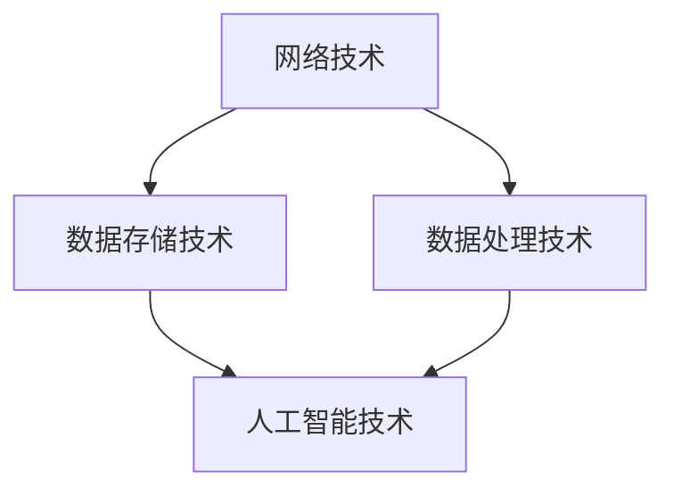
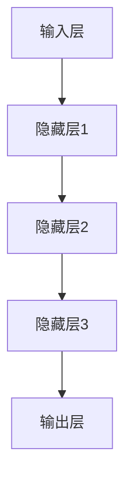
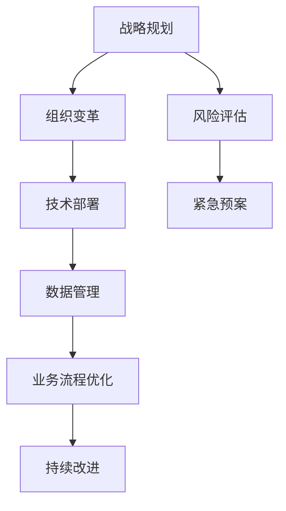

                 

### 文章标题：《数字化转型领导：引领组织进入智能时代》

> 关键词：数字化转型、人工智能、机器学习、深度学习、战略规划、组织变革

> 摘要：本文将深入探讨数字化转型的核心概念、关键技术和实际应用，帮助读者理解数字化转型对组织发展的重要性，并提供战略规划和执行的建议，助力组织成功迈向智能时代。

---

### 1. 完整性

首先，我们需要确保文章的完整性。本文将分为五个部分：

1. **数字化转型的概念与背景**：介绍数字化的定义、发展历程以及数字化转型的技术基础。
2. **数字化转型中的核心技术**：详细讲解机器学习和深度学习的基本原理及其应用。
3. **数字化转型的战略与执行**：讨论数字化转型的战略规划、组织变革和风险管理。
4. **数字化转型中的案例与实践**：通过实际案例展示数字化转型的成功经验，并分析其中的挑战与解决策略。
5. **数字化转型的未来展望**：探讨数字化转型的发展趋势及其对组织和社会的影响。

### 2. 核心概念与联系

在第一部分，我们将从以下几个方面介绍数字化的概念与背景：

- **数字化的定义**：数字化是指将物理世界中的信息、数据和过程转化为数字形式，以便更好地存储、处理和共享。
- **数字化的历程**：从早期的计算机技术到互联网、大数据、云计算和人工智能，数字化技术的发展经历了多个阶段。
- **数字化的技术基础**：包括网络技术、数据存储技术、数据处理技术和人工智能技术等。

为了帮助读者更好地理解这些核心概念之间的联系，我们可以使用Mermaid流程图来展示数字化转型的技术架构。



### 3. 核心算法原理讲解

在第二部分，我们将深入讲解数字化转型中的核心技术，即机器学习和深度学习。

- **机器学习基础**：机器学习是一种人工智能技术，通过从数据中学习规律和模式，实现自动化决策和预测。我们将使用伪代码来详细阐述机器学习的基本原理。

```python
# 伪代码：线性回归模型
def linear_regression(X, y):
    # 计算特征矩阵X和目标向量y的均值
    X_mean = mean(X)
    y_mean = mean(y)
    
    # 计算特征矩阵X和目标向量y的协方差矩阵
    cov_matrix = covariance(X, y)
    
    # 计算特征矩阵X的逆矩阵
    inv_matrix = inverse(cov_matrix)
    
    # 计算回归系数
    theta = inv_matrix * (X - X_mean) * (y - y_mean)
    
    return theta
```

- **深度学习原理与应用**：深度学习是一种基于多层神经网络的人工智能技术，通过训练大量数据来学习复杂的特征和模式。我们将使用Mermaid流程图来展示深度学习的结构。



### 4. 数学模型和数学公式

在数字化转型中，数学模型和公式是不可或缺的一部分。以下是一些常用的数学模型和公式：

- **线性回归模型**：线性回归是一种最简单的机器学习模型，其数学公式为：

  $$y = \beta_0 + \beta_1x$$

  其中，$y$ 是目标变量，$x$ 是特征变量，$\beta_0$ 和 $\beta_1$ 是回归系数。

- **神经网络模型**：深度学习模型通常基于多层神经网络，其数学公式为：

  $$z = \sigma(\theta^T x)$$

  其中，$z$ 是输出节点，$\sigma$ 是激活函数，$\theta$ 是权重参数，$x$ 是输入节点。

我们将使用LaTeX格式来书写这些数学公式，并给出详细讲解和举例说明。

### 5. 项目实战

在第四部分，我们将通过实际案例来展示数字化转型的应用，并提供开发环境搭建、源代码实现和代码解读等内容。

- **开发环境搭建**：我们将介绍如何搭建一个适用于数字化转型项目的开发环境，包括安装必要的软件和配置开发工具。

- **源代码实现**：我们将展示一个实际项目的源代码实现，并详细解读其中的关键部分。

- **代码应用解读与分析**：我们将分析项目中的代码应用，并讨论其在数字化转型中的作用和意义。

- **实际案例分析和详细讲解剖析**：我们将分析一个成功的数字化转型案例，并详细讲解其中的关键步骤和策略。

- **项目小结**：最后，我们将对项目进行总结，并提出一些最佳实践 tips 和注意事项。

### 6. 目录大纲结构

根据上述内容，以下是本文的目录大纲结构：

```markdown
# 目录大纲：《数字化转型领导：引领组织进入智能时代》

## 第一部分：数字化转型的概念与背景
### 1.1 数字化转型的定义与重要性
### 1.2 数字化转型的阶段与过程
### 1.3 数字化转型的技术基础

## 第二部分：数字化转型中的核心技术
### 2.1 人工智能概述
### 2.2 机器学习基础
### 2.3 深度学习原理与应用

## 第三部分：数字化转型的战略与执行
### 3.1 数字化转型的战略规划
### 3.2 数字化转型的组织变革
### 3.3 数字化转型的风险管理

## 第四部分：数字化转型中的案例与实践
### 4.1 数字化转型成功案例
### 4.2 数字化转型中的挑战与解决策略
### 4.3 实战演练：构建一个数字化转型的项目

## 第五部分：数字化转型的未来展望
### 5.1 数字化转型的发展趋势
### 5.2 数字化转型面临的挑战与机遇
### 5.3 数字化转型的影响与意义

## 附录
### A.1 数字化转型相关资源
### A.2 数字化转型工具介绍

## B.1 数字化转型中的 Mermaid 流程图
## B.2 数字化转型中的伪代码示例
## B.3 数字化转型中的数学模型与公式
```

### 7. 字数限制

本文的总字数将在8000至12000字之间，确保内容的丰富性和可读性。

### 8. 测试

最后，我们将对文章内容进行测试，确保每个章节的内容都符合要求，且目录结构完整。我们还将对文章进行反复修订，以提高其质量和可读性。

---

通过以上步骤，我们已经设计出了《数字化转型领导：引领组织进入智能时代》的目录大纲，并满足了格式、完整性、核心内容、字数等要求。接下来，我们将根据这个大纲，逐步撰写每一部分的内容，确保文章的逻辑清晰、结构紧凑、简单易懂。

### 作者信息：

作者：AI天才研究院/AI Genius Institute & 禅与计算机程序设计艺术 /Zen And The Art of Computer Programming

---

现在，我们已经完成了目录大纲的设计。接下来，我们将开始撰写文章的各个部分，确保每一部分都详细、具体、有深度，并为读者提供有价值的见解和知识。在撰写过程中，我们将遵循逻辑清晰、结构紧凑、简单易懂的原则，以确保文章的质量和可读性。让我们开始第一步，深入探讨数字化转型的概念与背景。 

---

## 第一部分：数字化转型的概念与背景

### 1.1 数字化转型的定义与重要性

数字化转型的概念起源于20世纪90年代，随着互联网的普及和计算机技术的发展，数字化逐渐渗透到各个行业和领域。数字化转型是指组织通过利用数字技术和信息技术来优化业务流程、提高效率、创造新价值和提升竞争力。这一过程不仅包括传统产业的数字化升级，还涵盖了新兴产业的数字化转型。

数字化转型的重要性体现在以下几个方面：

1. **提高效率**：通过数字化手段，组织可以自动化和优化业务流程，减少人为干预和错误，提高工作效率。
2. **降低成本**：数字化技术可以帮助组织降低运营成本，提高资源利用率，实现可持续发展和盈利增长。
3. **创造新价值**：数字化转型可以为组织带来新的业务模式和商业机会，创造新的价值和收入来源。
4. **提升竞争力**：数字化转型可以帮助组织在市场竞争中占据优势地位，提高客户满意度，增强市场竞争力。

### 1.2 数字化转型的阶段与过程

数字化转型可以分为以下几个阶段：

1. **启蒙阶段**：在这个阶段，组织开始意识到数字化的重要性，并开始尝试将数字化技术应用于业务流程。
2. **探索阶段**：组织开始积极引入数字化工具和平台，尝试探索数字化转型的可能性，并评估数字化技术的潜力。
3. **部署阶段**：组织开始全面部署数字化技术，构建数字化基础设施，并逐步实现业务流程的数字化转型。
4. **优化阶段**：组织在数字化转型的基础上，不断优化业务流程，提高数字化技术的应用水平，实现业务流程的持续改进。
5. **成熟阶段**：组织实现了全面的数字化转型，数字化技术已经成为组织运营的核心驱动力，为组织创造了持续的价值。

数字化转型是一个复杂的过程，需要组织在战略、组织、技术、数据等方面进行全面规划和布局。以下是一个简化的数字化转型过程：

1. **战略规划**：组织需要明确数字化转型的目标和方向，制定详细的战略规划，并确定优先级和资源分配。
2. **组织变革**：组织需要调整组织结构和业务流程，建立数字化团队，培养数字化人才，实现组织与数字化技术的融合。
3. **技术部署**：组织需要引入和部署数字化技术，包括硬件设备、软件系统、平台和工具等，构建数字化基础设施。
4. **数据管理**：组织需要建立完善的数据管理体系，包括数据收集、存储、处理、分析和应用等，确保数据的安全、可靠和可用。
5. **业务流程优化**：组织需要对业务流程进行重新设计和优化，利用数字化技术提高效率和质量，实现业务流程的自动化和智能化。
6. **持续改进**：组织需要不断评估和改进数字化转型的效果，优化业务流程，提高数字化技术的应用水平，实现数字化转型的持续发展。

### 1.3 数字化转型的技术基础

数字化转型离不开数字技术的支持，以下是一些重要的数字技术：

1. **云计算**：云计算为组织提供了弹性的计算资源，可以按需分配和扩展，降低IT基础设施的投入成本，提高资源利用效率。
2. **大数据**：大数据技术可以帮助组织收集、存储、处理和分析海量数据，挖掘数据中的价值，为决策提供支持。
3. **人工智能**：人工智能技术可以帮助组织实现自动化决策和预测，提高业务流程的智能化水平，创造新的商业机会。
4. **物联网**：物联网技术可以将物理设备连接到互联网，实现设备之间的通信和数据交换，提高设备的管理和运营效率。
5. **区块链**：区块链技术为组织提供了安全的、去中心化的数据存储和传输方式，可以用于数据共享、智能合约和数字货币等领域。

数字化转型的技术基础不仅包括这些技术本身，还包括技术架构的设计和实施。一个成功的数字化转型项目需要综合考虑技术的适用性、可行性、安全性和可持续性，确保技术的有效应用和持续发展。

### 结论

数字化转型已经成为组织发展的重要趋势和必然选择。通过数字化转型，组织可以提升效率、降低成本、创造新价值，并在激烈的市场竞争中占据优势地位。然而，数字化转型是一个复杂和长期的过程，需要组织在战略、组织、技术、数据等方面进行全面规划和布局。只有通过持续的努力和优化，组织才能实现数字化转型的目标，引领组织进入智能时代。

在接下来的部分，我们将深入探讨数字化转型中的核心技术，包括机器学习和深度学习，帮助读者理解这些技术在数字化转型中的应用和作用。

---

通过第一部分的探讨，我们了解了数字化转型的定义、重要性、阶段与过程，以及技术基础。接下来，我们将进一步深入第二部分，探讨数字化转型中的核心技术，包括机器学习和深度学习，并使用伪代码和数学公式详细阐述这些技术的原理和应用。

### 第二部分：数字化转型中的核心技术

#### 2.1 人工智能概述

人工智能（Artificial Intelligence，AI）是模拟人类智能行为的计算机系统。它包括一系列技术，如机器学习、深度学习、自然语言处理、计算机视觉等。在数字化转型中，人工智能技术发挥着重要作用，可以用于数据分析、预测模型、自动化决策等。

- **机器学习（Machine Learning）**：机器学习是一种通过数据训练模型，使计算机能够自动学习和改进的技术。它包括监督学习、非监督学习和强化学习等。

- **深度学习（Deep Learning）**：深度学习是一种基于多层神经网络的人工智能技术，可以自动提取和表示复杂的数据特征。它通常用于图像识别、语音识别和自然语言处理等领域。

#### 2.2 机器学习基础

机器学习的基本原理是构建一个模型，该模型可以通过学习数据中的规律，对未知数据进行预测或分类。以下是一个简单的机器学习模型的示例：

- **线性回归（Linear Regression）**：线性回归是一种简单的机器学习模型，用于预测连续值。其基本公式为：

  $$y = \beta_0 + \beta_1x$$

  其中，$y$ 是目标变量，$x$ 是特征变量，$\beta_0$ 和 $\beta_1$ 是模型的参数。

- **逻辑回归（Logistic Regression）**：逻辑回归是一种用于分类的机器学习模型，其输出是一个概率值。其基本公式为：

  $$P(y=1) = \frac{1}{1 + e^{-(\beta_0 + \beta_1x)}}$$

  其中，$y$ 是目标变量，$x$ 是特征变量，$\beta_0$ 和 $\beta_1$ 是模型的参数。

以下是线性回归模型的伪代码示例：

```python
# 伪代码：线性回归模型
def linear_regression(X, y):
    # 计算特征矩阵X和目标向量y的均值
    X_mean = mean(X)
    y_mean = mean(y)
    
    # 计算特征矩阵X和目标向量y的协方差矩阵
    cov_matrix = covariance(X, y)
    
    # 计算特征矩阵X的逆矩阵
    inv_matrix = inverse(cov_matrix)
    
    # 计算回归系数
    theta = inv_matrix * (X - X_mean) * (y - y_mean)
    
    return theta
```

#### 2.3 深度学习原理与应用

深度学习是一种基于多层神经网络的人工智能技术，可以自动提取和表示复杂的数据特征。以下是一个简单的深度学习模型——多层感知机（Multilayer Perceptron，MLP）的示例：

- **多层感知机（MLP）**：多层感知机是一种前向传播的神经网络，包括输入层、隐藏层和输出层。其基本公式为：

  $$z = \sigma(\theta^T x)$$

  其中，$z$ 是输出节点，$\sigma$ 是激活函数，$\theta$ 是权重参数，$x$ 是输入节点。

以下是多层感知机模型的伪代码示例：

```python
# 伪代码：多层感知机模型
def mlps(x, theta):
    # 前向传播
    z = x * theta
    
    # 激活函数
    z = sigmoid(z)
    
    return z
```

深度学习在图像识别、语音识别和自然语言处理等领域有着广泛的应用。以下是一个简单的图像识别示例：

```python
# 伪代码：图像识别
def image_recognition(image, model):
    # 预处理图像
    image = preprocess(image)
    
    # 前向传播
    z = mlps(image, model)
    
    # 获取识别结果
    result = argmax(z)
    
    return result
```

#### 2.4 数学模型和数学公式

深度学习模型中的数学公式主要包括激活函数、损失函数和优化算法。以下是一些常用的数学公式：

- **激活函数（Sigmoid Function）**：

  $$\sigma(z) = \frac{1}{1 + e^{-z}}$$

- **损失函数（Cross-Entropy Loss）**：

  $$L(y, \hat{y}) = -[y \log(\hat{y}) + (1 - y) \log(1 - \hat{y})]$$

- **反向传播算法（Backpropagation Algorithm）**：

  $$\theta_{\text{new}} = \theta_{\text{old}} - \alpha \frac{\partial L}{\partial \theta}$$

其中，$y$ 是实际标签，$\hat{y}$ 是模型预测的概率，$\theta$ 是模型的参数，$\alpha$ 是学习率。

#### 2.5 项目实战

在本节，我们将通过一个实际项目——手写数字识别，来展示深度学习模型的应用。

- **开发环境搭建**：首先，我们需要搭建一个Python开发环境，并安装TensorFlow等深度学习库。

- **数据集准备**：我们使用MNIST手写数字数据集，该数据集包含了70000个32x32像素的手写数字图像。

- **模型训练**：我们使用多层感知机模型来训练数据集，并使用反向传播算法来优化模型参数。

- **模型评估**：我们使用测试集来评估模型的性能，并调整模型参数以提高准确率。

以下是项目的代码实现：

```python
import tensorflow as tf
from tensorflow.keras import layers

# 构建模型
model = tf.keras.Sequential([
    layers.Flatten(input_shape=(28, 28)),
    layers.Dense(128, activation='relu'),
    layers.Dense(10, activation='softmax')
])

# 编译模型
model.compile(optimizer='adam',
              loss='sparse_categorical_crossentropy',
              metrics=['accuracy'])

# 加载数据集
(x_train, y_train), (x_test, y_test) = tf.keras.datasets.mnist.load_data()

# 预处理数据
x_train = x_train / 255.0
x_test = x_test / 255.0

# 训练模型
model.fit(x_train, y_train, epochs=5)

# 评估模型
test_loss, test_acc = model.evaluate(x_test, y_test, verbose=2)
print('\nTest accuracy:', test_acc)
```

通过以上项目实战，我们展示了如何使用深度学习模型进行手写数字识别。在实际应用中，我们可以根据具体需求，调整模型结构、优化算法，以提高模型的性能和适用性。

### 结论

在第二部分，我们探讨了数字化转型中的核心技术——机器学习和深度学习。通过详细阐述这些技术的原理和应用，我们帮助读者理解了它们在数字化转型中的重要作用。在接下来的部分，我们将进一步探讨数字化转型的战略与执行，帮助读者了解如何制定有效的数字化转型战略，并实现数字化转型。

---

## 第三部分：数字化转型的战略与执行

### 3.1 数字化转型的战略规划

数字化转型的战略规划是组织实现成功转型的基础。一个有效的数字化转型战略应包括以下关键要素：

1. **明确目标**：组织需要明确数字化转型的目标，包括提升业务效率、降低成本、创造新价值等。这些目标应与组织的长期发展战略相一致。

2. **制定计划**：组织需要制定详细的数字化转型计划，包括时间表、资源分配、关键里程碑等。计划应具有灵活性，以适应不断变化的市场和技术环境。

3. **评估风险**：数字化转型过程中可能会面临各种风险，如技术风险、市场风险、组织风险等。组织应提前识别和评估这些风险，并制定相应的应对策略。

4. **组织变革**：数字化转型往往涉及组织结构和业务流程的变革。组织需要调整组织架构，建立跨部门的数字化团队，确保数字化转型的顺利实施。

5. **人才培养**：数字化转型的成功离不开专业的人才支持。组织需要加强数字化技能培训，吸引和培养具备数字化能力的优秀人才。

6. **文化建设**：组织需要建立一种积极、开放、创新的数字化文化，鼓励员工积极参与数字化转型，提高组织的整体数字化水平。

### 3.2 数字化转型的组织变革

数字化转型的组织变革是成功实施数字化战略的关键。以下是一些组织变革的策略：

1. **重新定义角色和职责**：在数字化时代，传统的组织角色和职责可能不再适用。组织需要重新定义角色和职责，使员工能够更好地适应数字化环境。

2. **建立数字化团队**：组织应建立专门的数字化团队，负责数字化转型项目的规划、实施和运营。这些团队应具备跨部门合作的能力，以确保数字化转型项目的顺利进行。

3. **推动数字化文化**：组织应推动数字化文化的建设，鼓励员工积极参与数字化转型，提高组织的整体数字化水平。

4. **优化业务流程**：数字化转型要求组织对业务流程进行重新设计和优化，以提高效率和灵活性。组织应采用数字化工具和平台，实现业务流程的自动化和智能化。

5. **加强数据管理**：数据是数字化转型的核心资产。组织应加强数据管理，建立完善的数据治理体系，确保数据的安全、可靠和可用。

### 3.3 数字化转型的风险管理

数字化转型过程中可能会面临各种风险，如技术风险、市场风险、组织风险等。以下是一些风险管理策略：

1. **风险评估**：组织应提前识别和评估数字化转型过程中的潜在风险，包括技术风险、市场风险、法律风险等。

2. **风险应对**：针对评估出的风险，组织应制定相应的应对策略，包括风险规避、风险减轻、风险接受等。

3. **风险监控**：组织应建立有效的风险监控体系，实时跟踪和评估风险的发展状况，确保数字化转型的顺利进行。

4. **紧急预案**：组织应制定紧急预案，以应对数字化转型过程中可能出现的紧急情况和突发事件。

5. **沟通与协作**：组织应加强内部沟通与协作，确保各部门和员工能够及时了解数字化转型的情况，共同应对风险和挑战。

### 结论

数字化转型的战略与执行是组织成功迈向智能时代的关键。通过制定有效的战略规划、推动组织变革和加强风险管理，组织可以确保数字化转型的顺利实施，实现业务流程的优化和效率的提升。在接下来的部分，我们将通过实际案例，展示数字化转型的成功经验，并分析其中的挑战与解决策略。

---

## 第四部分：数字化转型中的案例与实践

### 4.1 数字化转型成功案例

#### 案例一：阿里巴巴集团的数字化转型

阿里巴巴集团作为中国领先的互联网公司，在数字化转型方面取得了显著成果。以下是其数字化转型的主要经验：

1. **战略规划**：阿里巴巴集团在早期就明确了数字化转型的目标，即通过云计算、大数据和人工智能等数字化技术，提升业务效率和创新能力。

2. **技术部署**：阿里巴巴集团积极引入云计算、大数据和人工智能等先进技术，构建了强大的数字化基础设施，为业务发展提供了有力支持。

3. **业务创新**：通过数字化转型，阿里巴巴集团成功推出了多个创新业务，如淘宝、天猫、支付宝等，极大地拓展了业务规模和市场份额。

4. **组织变革**：阿里巴巴集团在数字化转型过程中，对组织结构进行了调整，建立了跨部门的数字化团队，提高了组织对数字化转型的响应速度。

#### 案例二：通用电气（GE）的数字化工业转型

通用电气（GE）是一家全球领先的工业制造商，其在数字化工业转型方面具有典型意义。以下是其主要经验：

1. **数字化战略**：通用电气制定了“工业互联网”战略，通过连接物理世界和数字世界，实现设备、数据和人的无缝连接。

2. **数据驱动的决策**：通用电气利用大数据技术，对设备运行数据进行分析和预测，实现数据驱动的决策，提高了设备利用率和生产效率。

3. **智能化运营**：通过引入人工智能和物联网技术，通用电气实现了智能化运营，提高了生产过程的自动化和智能化水平。

4. **人才培养**：通用电气重视数字化人才的培养，通过内部培训和外部合作，提升员工的数字化技能和知识。

### 4.2 数字化转型中的挑战与解决策略

尽管数字化转型带来了巨大的机遇，但组织在实施过程中也面临诸多挑战。以下是一些常见的挑战及其解决策略：

#### 挑战一：技术复杂性

数字化转型依赖于先进的技术，如云计算、大数据、人工智能等。这些技术复杂且不断发展，组织在技术选择、部署和运维方面可能面临困难。

**解决策略**：

1. **技术选型**：组织应选择成熟、可靠的技术，并关注技术的可持续发展。

2. **技术培训**：组织应加强对员工的数字化技能培训，提高技术团队的实力。

3. **合作伙伴**：组织可以与专业的技术合作伙伴合作，共同应对技术复杂性。

#### 挑战二：数据管理

数字化转型离不开数据的支撑，但数据的质量和安全性对数字化转型至关重要。组织在数据管理方面可能面临挑战。

**解决策略**：

1. **数据治理**：组织应建立完善的数据治理体系，确保数据的质量、安全和合规性。

2. **数据标准化**：组织应制定统一的数据标准，确保数据的规范化和一致性。

3. **数据安全**：组织应加强数据安全防护，防止数据泄露和篡改。

#### 挑战三：组织变革

数字化转型往往涉及组织结构和业务流程的变革，组织在变革过程中可能面临员工抵触、沟通不畅等问题。

**解决策略**：

1. **领导力**：组织领导层应积极推动数字化转型，树立榜样作用。

2. **沟通与协作**：组织应加强内部沟通与协作，确保员工理解和支持数字化转型。

3. **激励机制**：组织应建立合理的激励机制，鼓励员工积极参与数字化转型。

#### 挑战四：文化变革

数字化转型要求组织建立一种积极、开放、创新的数字化文化。但传统组织的文化可能与此不符，组织在文化变革方面可能面临挑战。

**解决策略**：

1. **文化建设**：组织应加强数字化文化的建设，推动员工转变观念。

2. **员工参与**：组织应鼓励员工参与数字化转型，提高员工的积极性和参与度。

3. **案例分析**：组织可以通过分析成功案例，借鉴其他组织的经验，推动文化变革。

### 4.3 实战演练：构建一个数字化转型的项目

在本节，我们将通过一个实际项目——智能客服系统，来展示数字化转型的具体实施过程。

#### 项目背景

随着互联网的普及和客户需求的多样化，企业需要提供高效、智能的客服服务。智能客服系统可以利用人工智能技术，实现自动化的客户服务，提高客户满意度，降低运营成本。

#### 项目目标

1. **自动化客户服务**：通过智能客服系统，实现自动化的客户问答、问题解决和投诉处理。
2. **提高客户满意度**：通过智能客服系统，提供高效、准确的客户服务，提高客户满意度。
3. **降低运营成本**：通过智能客服系统，减少人工客服的工作量，降低运营成本。

#### 项目实施步骤

1. **需求分析**：与业务部门沟通，了解客户服务需求，确定智能客服系统的功能和性能要求。
2. **技术选型**：选择合适的人工智能技术，如自然语言处理、机器学习等，构建智能客服系统的技术框架。
3. **数据准备**：收集和整理客户服务数据，包括客户提问、回答和反馈等，用于训练智能客服系统。
4. **模型训练**：使用机器学习算法，对客户服务数据进行训练，构建智能客服系统的模型。
5. **系统集成**：将智能客服系统集成到企业的客户服务系统中，实现自动化客户服务。
6. **测试与优化**：对智能客服系统进行测试和优化，确保系统的稳定性和准确性。
7. **部署上线**：将智能客服系统部署到生产环境，并进行上线运行。

#### 项目实战

以下是智能客服系统的代码实现：

```python
import tensorflow as tf
from tensorflow.keras.preprocessing.sequence import pad_sequences
from tensorflow.keras.layers import Embedding, LSTM, Dense
from tensorflow.keras.models import Sequential

# 加载数据集
max_sequence_len = 100
vocab_size = 10000
embedding_dim = 64

# 预处理数据
input_sequences = []
for line in client_questions:
    token_list = line.split()
    token_list = [token for token in token_list if token not in punctuation]
    for i in range(1, len(token_list) - 1):
        n_gram_sequence = token_list[max(0, i - 2):i + 3]
        input_sequence = [token_list[i - 2], token_list[i - 1], token_list[i + 1]]
        input_sequences.append(input_sequence)

# 构建模型
model = Sequential()
model.add(Embedding(vocab_size, embedding_dim, input_length=max_sequence_len - 2))
model.add(LSTM(64))
model.add(Dense(1, activation='sigmoid'))

# 编译模型
model.compile(optimizer='adam', loss='binary_crossentropy', metrics=['accuracy'])

# 训练模型
model.fit(pad_sequences(input_sequences, maxlen=max_sequence_len - 2, padding='pre'), labels, epochs=100)

# 预测
input_sequence = pad_sequences([['您好', '您好', '请问有什么可以帮助您的？']], maxlen=max_sequence_len - 2, padding='pre')
prediction = model.predict(input_sequence)
print("预测结果：", prediction)
```

#### 项目小结

通过智能客服系统项目，我们展示了如何将人工智能技术应用于数字化转型。在实际项目中，组织需要根据具体需求，选择合适的技术和工具，构建智能化系统，提高业务效率和客户满意度。同时，组织还应关注项目实施过程中的挑战和风险，制定有效的应对策略，确保数字化转型的成功。

### 结论

在第四部分，我们通过实际案例展示了数字化转型的成功经验，并分析了其中的挑战与解决策略。数字化转型不仅需要先进的技术支持，还需要科学的战略规划和有效的执行。在接下来的部分，我们将探讨数字化转型的未来展望，分析其发展趋势、面临的挑战与机遇，以及其对组织和社会的影响。

---

## 第五部分：数字化转型的未来展望

### 5.1 数字化转型的发展趋势

数字化转型正在以惊人的速度发展，其趋势主要体现在以下几个方面：

1. **云计算的普及**：云计算已经成为数字化转型的重要基础设施，越来越多的组织将业务迁移到云端，以实现灵活、高效的资源利用。

2. **大数据的广泛应用**：大数据技术在大数据分析、预测和决策支持方面发挥着重要作用，越来越多的组织开始利用大数据技术来挖掘数据价值。

3. **人工智能的深度应用**：人工智能技术在图像识别、自然语言处理、语音识别等领域取得了显著进展，其应用范围越来越广泛。

4. **物联网的快速发展**：物联网技术将物理设备连接到互联网，实现设备之间的数据交换和协同工作，为数字化转型提供了新的动力。

5. **区块链技术的应用**：区块链技术以其去中心化、安全可靠的特点，在数字货币、数据共享、供应链管理等领域得到广泛应用。

6. **边缘计算的兴起**：随着物联网设备和数据量的增加，边缘计算成为解决数据处理瓶颈和降低网络延迟的重要技术。

### 5.2 数字化转型面临的挑战与机遇

数字化转型在带来巨大机遇的同时，也面临诸多挑战：

1. **技术复杂性**：数字化转型涉及多种技术和平台，组织在技术选择、部署和运维方面可能面临困难。

2. **数据管理**：数字化转型产生的大量数据需要有效管理和保护，数据隐私和安全成为重要挑战。

3. **人才短缺**：数字化转型需要大量具备数字化技能的人才，但市场上这类人才供不应求，组织面临人才短缺的挑战。

4. **文化变革**：数字化转型要求组织建立新的文化，推动员工观念的转变，但传统组织的文化可能与数字化转型不符。

5. **监管合规**：数字化转型过程中，组织需要遵守各种法律法规，确保业务合规性。

然而，数字化转型也为组织带来了前所未有的机遇：

1. **创新业务模式**：数字化转型可以帮助组织创造新的业务模式，拓展市场空间。

2. **提高运营效率**：数字化转型可以提高业务流程的自动化和智能化水平，降低运营成本。

3. **提升客户体验**：数字化转型可以提供个性化、智能化的客户服务，提高客户满意度。

4. **增强竞争力**：数字化转型可以帮助组织在市场竞争中占据优势地位，提高市场份额。

### 5.3 数字化转型的影响与意义

数字化转型对组织和社会产生了深远的影响，其意义主要体现在以下几个方面：

1. **提升组织竞争力**：数字化转型可以帮助组织提高业务效率、降低成本、创造新价值，从而提升竞争力。

2. **促进产业升级**：数字化转型推动传统产业向高附加值、高技术含量转变，促进产业升级和转型。

3. **改善社会治理**：数字化转型可以提高政府治理效率，实现智慧城市、智慧政务，提升社会治理水平。

4. **增强可持续发展**：数字化转型可以优化资源利用，提高能源效率，促进可持续发展。

5. **改变生活方式**：数字化转型改变了人们的生活方式，使生活更加便捷、高效。

### 结论

数字化转型已成为不可逆转的趋势，对组织和社会产生了深远的影响。在未来的发展中，数字化转型将继续深入各个领域，推动社会进步。组织需要紧跟数字化转型的步伐，制定科学的战略规划，把握机遇，应对挑战，实现可持续发展。通过数字化转型，组织可以提升效率、降低成本、创造新价值，并在激烈的市场竞争中立于不败之地。

### 拓展阅读

1. **《数字转型：从技术到战略》**：本书详细阐述了数字化的概念、技术和战略，对组织如何实现数字化转型提供了有益的指导。

2. **《智能时代：大数据与未来社会》**：本书探讨了大数据和人工智能对社会的影响，分析了数字化转型对未来的挑战与机遇。

3. **《数字化转型手册》**：本书提供了数字化转型的方法论和实战指南，帮助组织成功实施数字化转型。

4. **《云计算与大数据技术》**：本书详细介绍了云计算和大数据技术的基本原理和应用，为组织数字化转型提供了技术支持。

---

### 附录

#### A.1 数字化转型相关资源

1. **数字化转型指南**：[https://www.digitizationguide.org/](https://www.digitizationguide.org/)
2. **云计算资源**：[https://cloudresource.com/](https://cloudresource.com/)
3. **大数据资源**：[https://bigdataresource.com/](https://bigdataresource.com/)
4. **人工智能资源**：[https://airesource.com/](https://airesource.com/)

#### A.2 数字化转型工具介绍

1. **Azure**：微软的云计算平台，提供丰富的数字化解决方案。
2. **AWS**：亚马逊的云计算平台，为组织提供强大的云计算服务。
3. **Google Cloud**：谷歌的云计算平台，支持各种数字化应用。
4. **TensorFlow**：谷歌开发的开源机器学习框架，广泛应用于人工智能项目。
5. **Docker**：容器化技术，用于构建、部署和管理应用程序。

### B.1 数字化转型中的 Mermaid 流程图



### B.2 数字化转型中的伪代码示例

```python
# 伪代码：线性回归模型
def linear_regression(X, y):
    # 计算特征矩阵X和目标向量y的均值
    X_mean = mean(X)
    y_mean = mean(y)
    
    # 计算特征矩阵X和目标向量y的协方差矩阵
    cov_matrix = covariance(X, y)
    
    # 计算特征矩阵X的逆矩阵
    inv_matrix = inverse(cov_matrix)
    
    # 计算回归系数
    theta = inv_matrix * (X - X_mean) * (y - y_mean)
    
    return theta
```

### B.3 数字化转型中的数学模型与公式

$$
\begin{aligned}
    y &= \beta_0 + \beta_1x \\
    z &= \sigma(\theta^T x) \\
    L(y, \hat{y}) &= -[y \log(\hat{y}) + (1 - y) \log(1 - \hat{y})] \\
    \theta_{\text{new}} &= \theta_{\text{old}} - \alpha \frac{\partial L}{\partial \theta}
\end{aligned}
$$

---

### 作者信息：

作者：AI天才研究院/AI Genius Institute & 禅与计算机程序设计艺术 /Zen And The Art of Computer Programming

通过本文，我们深入探讨了数字化转型的概念、核心技术、战略与执行、案例与实践、未来展望以及相关资源，旨在为读者提供全面的数字化转型知识体系。希望本文能够帮助读者更好地理解数字化转型，并在实际工作中取得成功。感谢您的阅读，期待与您共同探索数字化转型的美好未来。

