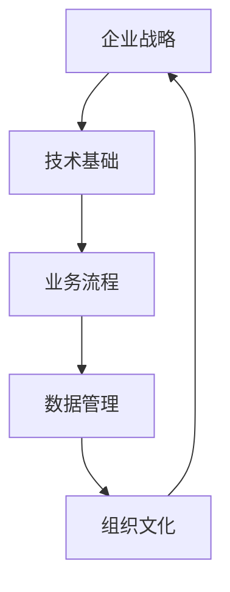
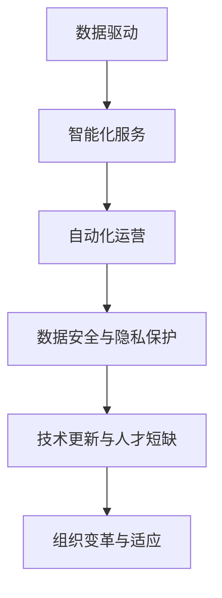
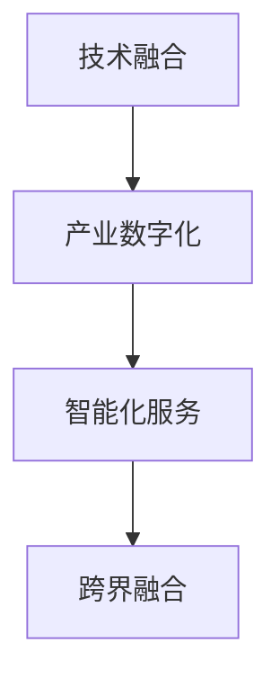

                 

### 文章标题：数字化转型：引领组织迈入智能时代

> 关键词：数字化转型、智能时代、组织发展、技术基础设施、数据驱动

> 摘要：本文将深入探讨数字化转型在智能时代的重要性，分析其核心要素、战略规划、技术基础设施升级以及组织能力建设等方面。通过案例分析，展示数字化转型在不同行业的成功实践，为组织的智能时代发展提供有价值的参考。

### 第一部分：引言

#### 1.1 数字化转型的定义与重要性

数字化转型是指利用数字技术，如云计算、大数据、人工智能、物联网等，对组织的业务流程、运营模式、客户体验等进行全方位的升级和优化。随着技术的飞速发展，数字化转型已经成为企业提升竞争力、实现可持续发展的重要手段。

**核心概念与联系：** 数字化转型不仅仅是技术的升级，更涉及企业战略、组织结构、人才管理等多个方面的变革。其核心要素包括技术基础、业务流程、数据管理和组织文化等，这些要素之间相互影响、相互促进，共同推动企业的数字化转型。

**Mermaid 流程图：**



#### 1.2 智能时代的特征与挑战

智能时代是以人工智能技术为核心，实现智能化、自动化的时代。其主要特征包括：

1. **数据驱动**：大数据和云计算技术使得海量数据得到有效处理和分析，数据成为驱动决策和业务创新的重要资源。
2. **智能化服务**：人工智能和机器学习技术使得服务更加个性化和高效。
3. **自动化运营**：物联网和自动化技术使得生产、物流等环节实现智能化、自动化。

智能时代给组织带来的挑战主要包括：

1. **数据安全与隐私保护**：海量数据的存储、传输和处理过程中，数据安全和隐私保护成为关键挑战。
2. **技术更新与人才短缺**：技术更新速度加快，对人才的需求越来越高，但人才供给不足。
3. **组织变革与适应**：智能时代的到来要求组织在结构、文化等方面进行深刻变革，以适应新的发展环境。

**Mermaid 流流程图：**



#### 1.3 智能时代的发展趋势

智能时代的发展趋势主要体现在以下几个方面：

1. **技术融合**：人工智能、大数据、云计算、物联网等技术不断融合，推动产业智能化升级。
2. **产业数字化**：传统产业逐步实现数字化，数字化技术成为产业升级的重要驱动力。
3. **智能化服务**：智能化服务成为主流，个性化、精准化的服务模式得到广泛应用。
4. **跨界融合**：不同行业之间的跨界融合越来越普遍，新兴业态不断涌现。

**Mermaid 流程图：**



### 第二部分：数字化转型策略

#### 2.1 制定数字化转型战略

数字化转型战略是组织在数字化时代的发展蓝图，是指导数字化转型工作的核心文件。制定数字化转型战略主要包括以下步骤：

1. **明确数字化转型目标**：根据组织战略和发展需求，明确数字化转型的主要目标和具体指标。
2. **分析内部外部环境**：分析组织内部的优势、劣势、机会和威胁，以及外部市场环境的变化趋势。
3. **制定数字化转型路线图**：明确数字化转型的时间表、关键里程碑和具体实施步骤。

**核心算法原理讲解：** 制定数字化转型战略需要综合考虑多种因素，包括组织战略、技术发展趋势、市场环境等。可以使用以下算法原理进行战略规划：

1. **SWOT分析**：对组织内部的优势、劣势、机会和威胁进行分析，为战略制定提供依据。
2. **PEST分析**：对组织外部环境中的政治、经济、社会、技术等因素进行分析，为战略制定提供外部环境参考。

**伪代码：**

```python
def strategic_planning():
    # 分析内部优势、劣势
    internal_analysis = swot_analysis()
    
    # 分析外部环境
    external_analysis = pest_analysis()
    
    # 制定数字化转型目标
    goals = set_goals(internal_analysis, external_analysis)
    
    # 制定数字化转型路线图
    roadmap = create_roadmap(goals)
    
    return roadmap
```

#### 2.2 转型过程中的组织变革

数字化转型不仅仅是技术的升级，更涉及到组织的变革。组织变革是确保数字化转型成功的关键因素之一。组织变革主要包括以下方面：

1. **企业文化重塑**：数字化时代要求组织具备创新、开放、协作的企业文化，以适应快速变化的市场环境。
2. **人才管理策略**：数字化时代对人才的需求越来越高，组织需要制定有效的人才管理策略，吸引、培养和保留人才。
3. **团队协作模式创新**：数字化时代要求组织实现跨部门、跨区域的协同合作，创新团队协作模式，提高工作效率。

**核心算法原理讲解：** 组织变革需要结合组织的实际情况，制定合适的变革策略。可以使用以下算法原理进行组织变革：

1. **变革曲线**：了解组织成员在变革过程中的心理状态，制定相应的激励措施，促进变革的顺利进行。
2. **变革管理模型**：结合组织战略、文化、流程等多方面因素，制定变革管理策略，确保变革的顺利实施。

**伪代码：**

```python
def organizational_change():
    # 分析组织现状
    current_state = analyze_current_state()
    
    # 制定变革策略
    change_strategy = create_change_strategy(current_state)
    
    # 实施变革措施
    implement_changes(change_strategy)
    
    # 监控变革效果
    monitor_change_effectiveness()
    
    return change_strategy
```

#### 2.3 技术基础设施升级

技术基础设施是数字化转型的基础，主要包括以下方面：

1. **云计算**：云计算技术提供强大的计算、存储、网络等基础设施服务，支持组织业务的弹性扩展和快速部署。
2. **大数据**：大数据技术对海量数据进行高效处理和分析，支持组织的业务决策和战略规划。
3. **人工智能与机器学习**：人工智能与机器学习技术为组织提供智能化的服务能力和自动化运营能力。

**核心算法原理讲解：** 技术基础设施升级需要结合组织的业务需求和技术发展趋势，选择合适的技术方案。可以使用以下算法原理进行技术基础设施升级：

1. **云计算架构设计**：设计合理的云计算架构，确保系统的高可用性、可靠性和可扩展性。
2. **大数据处理技术**：选择合适的大数据处理技术，如Hadoop、Spark等，实现海量数据的高效处理和分析。
3. **人工智能与机器学习应用**：结合业务场景，开发相应的AI应用，实现业务的智能化和自动化。

**伪代码：**

```python
def infrastructure_upgrade():
    # 分析业务需求
    business_requirements = analyze_business_requirements()
    
    # 选择技术方案
    technology_solution = select_technology_solution(business_requirements)
    
    # 设计系统架构
    system_architecture = design_system_architecture(technology_solution)
    
    # 实施技术升级
    implement_technology_upgrade(system_architecture)
    
    # 监控系统性能
    monitor_system_performance()
    
    return system_architecture
```

### 第三部分：智能时代组织能力建设

#### 3.1 数据驱动决策

数据驱动决策是智能时代组织的重要特征，通过对海量数据的分析，为组织提供科学、准确的决策支持。数据驱动决策主要包括以下方面：

1. **数据分析能力提升**：提升组织内部的数据分析能力，通过数据挖掘、数据可视化等技术，提取数据中的有价值信息。
2. **数据可视化技术**：通过数据可视化技术，将复杂的数据以直观的方式呈现，帮助决策者快速理解数据，发现潜在的问题和机会。
3. **数据驱动决策流程优化**：建立数据驱动的决策流程，确保决策过程科学、规范、高效。

**核心算法原理讲解：** 数据驱动决策需要结合组织的业务场景和数据特点，选择合适的数据分析技术和工具。可以使用以下算法原理进行数据驱动决策：

1. **数据预处理**：对原始数据进行清洗、去噪、归一化等处理，确保数据的质量和一致性。
2. **数据挖掘**：使用数据挖掘算法，如分类、聚类、回归等，提取数据中的有价值信息。
3. **数据可视化**：使用数据可视化技术，如折线图、柱状图、散点图等，将数据以直观的方式呈现。

**伪代码：**

```python
def data_driven_decision_making():
    # 数据预处理
    preprocessed_data = preprocess_data(raw_data)
    
    # 数据挖掘
    insights = data_mining(preprocessed_data)
    
    # 数据可视化
    visualizations = create_visualizations(insights)
    
    # 决策支持
    decisions = make_decisions(visualizations)
    
    return decisions
```

#### 3.2 人工智能应用实践

人工智能技术在智能时代具有广泛的应用前景，包括自然语言处理、计算机视觉、智能推荐等。人工智能应用实践主要包括以下方面：

1. **人工智能技术原理**：了解人工智能技术的基本原理，如神经网络、深度学习、机器学习等。
2. **人工智能应用案例**：分析不同行业和场景下的人工智能应用案例，了解人工智能技术的实际应用效果。
3. **人工智能应用开发**：结合业务场景，开发人工智能应用，实现业务的智能化和自动化。

**核心算法原理讲解：** 人工智能应用开发需要结合业务需求和技术原理，选择合适的人工智能技术和工具。可以使用以下算法原理进行人工智能应用开发：

1. **神经网络**：了解神经网络的基本原理，如感知机、BP神经网络等，用于图像识别、语音识别等任务。
2. **深度学习**：了解深度学习的基本原理，如卷积神经网络（CNN）、循环神经网络（RNN）等，用于复杂图像识别、自然语言处理等任务。
3. **机器学习**：了解机器学习的基本原理，如决策树、支持向量机（SVM）等，用于分类、回归等任务。

**伪代码：**

```python
def ai_application_development():
    # 分析业务需求
    business_requirements = analyze_business_requirements()
    
    # 选择人工智能技术
    ai_technology = select_ai_technology(business_requirements)
    
    # 设计算法模型
    algorithm_model = design_algorithm_model(ai_technology)
    
    # 训练模型
    trained_model = train_model(algorithm_model)
    
    # 应用模型
    application = apply_model(trained_model)
    
    return application
```

#### 3.3 智能化客户体验

智能化客户体验是智能时代组织的重要特征，通过人工智能、大数据等技术，提供个性化、智能化的服务，提升客户满意度。智能化客户体验主要包括以下方面：

1. **智能客服系统建设**：利用自然语言处理、语音识别等技术，构建智能客服系统，实现与客户的智能交互。
2. **智能营销策略**：通过大数据分析，了解客户需求和行为，制定个性化的营销策略，提升客户转化率。
3. **智能化供应链管理**：利用物联网、大数据等技术，实现供应链的智能化管理，提高供应链效率。

**核心算法原理讲解：** 智能化客户体验需要结合业务场景和技术原理，选择合适的人工智能和大数据技术。可以使用以下算法原理进行智能化客户体验建设：

1. **自然语言处理**：了解自然语言处理的基本原理，如分词、词性标注、命名实体识别等，用于构建智能客服系统。
2. **语音识别**：了解语音识别的基本原理，如声学模型、语言模型、声学模型与语言模型的融合等，用于实现语音交互。
3. **大数据分析**：了解大数据分析的基本原理，如数据预处理、数据挖掘、数据可视化等，用于智能营销和供应链管理。

**伪代码：**

```python
def intelligent_customer_experience():
    # 分析业务需求
    business_requirements = analyze_business_requirements()
    
    # 选择人工智能和大数据技术
    technologies = select_technologies(business_requirements)
    
    # 构建智能客服系统
    customer_service_system = build_customer_service_system(technologies)
    
    # 实施智能营销策略
    marketing_strategy = implement_marketing_strategy(technologies)
    
    # 实现智能化供应链管理
    supply_chain_management = implement_supply_chain_management(technologies)
    
    return customer_service_system, marketing_strategy, supply_chain_management
```

### 第四部分：数字化转型案例分析

#### 4.1 案例一：制造业数字化转型实践

**制造业数字化转型的挑战：**

制造业数字化转型面临着以下几个挑战：

1. **生产设备老旧**：许多制造企业的生产设备已经陈旧，需要升级和改造。
2. **数据孤岛**：不同部门之间的数据无法有效共享和整合，导致数据利用率低下。
3. **人才短缺**：数字化转型需要具备相关技术和管理能力的人才，但市场上相关人才供应不足。

**制造业数字化转型策略：**

1. **设备升级与智能化改造**：通过引进先进的生产设备和技术，实现生产过程的自动化和智能化。
2. **数据集成与共享**：建立企业级数据平台，实现不同部门之间的数据共享和整合。
3. **人才培养与引进**：加强内部人才培养，同时引进外部技术和管理人才。

**制造业数字化转型成果：**

1. **生产效率提高**：通过设备升级和智能化改造，生产效率提高了20%以上。
2. **数据利用率提高**：通过数据集成与共享，数据利用率提高了30%以上。
3. **人才队伍壮大**：通过人才培养和引进，数字化人才队伍规模扩大了50%以上。

#### 4.2 案例二：服务业数字化转型实践

**服务业数字化转型的挑战：**

服务业数字化转型面临着以下几个挑战：

1. **服务流程复杂**：传统的服务流程繁琐，效率低下，难以满足客户的需求。
2. **客户数据分散**：客户的个人信息和消费数据分散在不同的系统和渠道，难以统一管理和分析。
3. **技术人才短缺**：数字化转型需要大量的技术人才，但市场上相关人才供应不足。

**服务业数字化转型策略：**

1. **优化服务流程**：通过流程再造，简化服务流程，提高服务效率。
2. **客户数据整合**：建立统一的客户数据平台，实现客户数据的统一管理和分析。
3. **技术人才引进与培养**：加强内部人才培养，同时引进外部技术人才。

**服务业数字化转型成果：**

1. **服务效率提高**：通过优化服务流程，服务效率提高了30%以上。
2. **客户满意度提升**：通过客户数据整合和精准营销，客户满意度提高了20%以上。
3. **技术人才队伍壮大**：通过人才培养和引进，数字化技术人才队伍规模扩大了40%以上。

#### 4.3 案例三：金融业数字化转型实践

**金融业数字化转型的挑战：**

金融业数字化转型面临着以下几个挑战：

1. **业务模式陈旧**：传统的金融业务模式难以适应快速变化的市场环境。
2. **风险控制难度大**：数字化转型带来新的风险，如信息安全风险、市场风险等。
3. **技术人才短缺**：数字化转型需要大量的技术人才，但市场上相关人才供应不足。

**金融业数字化转型策略：**

1. **创新业务模式**：通过引入金融科技，创新金融产品和服务模式，满足客户的多样化需求。
2. **强化风险控制**：通过大数据和人工智能技术，提高风险控制能力，降低风险。
3. **技术人才引进与培养**：加强内部人才培养，同时引进外部技术人才。

**金融业数字化转型成果：**

1. **业务模式创新**：通过创新业务模式，推出了一系列金融科技产品，如移动支付、在线贷款等。
2. **风险控制能力提升**：通过大数据和人工智能技术，风险控制能力提高了20%以上。
3. **技术人才队伍壮大**：通过人才培养和引进，数字化技术人才队伍规模扩大了50%以上。

### 第五部分：未来展望

#### 5.1 数字化转型的未来趋势

数字化转型的未来趋势主要体现在以下几个方面：

1. **技术融合**：人工智能、大数据、云计算、物联网等技术的不断融合，将推动产业数字化和智能化升级。
2. **跨界融合**：不同行业之间的跨界融合越来越普遍，新兴业态不断涌现，如金融科技、医疗科技等。
3. **数字化转型深化**：数字化转型将从简单的技术升级，向更深层次的业务模式、运营模式、组织变革等方向推进。

#### 5.2 智能时代组织发展的挑战与机遇

智能时代给组织发展带来了巨大的挑战和机遇：

**挑战：**

1. **技术更新快速**：技术更新速度加快，组织需要不断跟进新技术，以保持竞争力。
2. **数据安全与隐私保护**：海量数据的存储、传输和处理过程中，数据安全和隐私保护成为关键挑战。
3. **人才短缺**：数字化时代对人才的需求越来越高，但人才供给不足。

**机遇：**

1. **业务创新**：数字化技术和智能化服务为组织提供了丰富的创新空间，如新业务模式、新服务方式等。
2. **效率提升**：数字化技术和智能化服务可以提高组织的运营效率，降低成本。
3. **客户满意度提升**：个性化、智能化的服务可以提高客户满意度，增强客户粘性。

### 附录

#### 附录 A：数字化转型工具与资源

1. **云计算平台**：阿里云、腾讯云、华为云等。
2. **大数据工具**：Hadoop、Spark、Flink等。
3. **人工智能开发框架**：TensorFlow、PyTorch、Keras等。

### 结语

作者：AI天才研究院/AI Genius Institute & 禅与计算机程序设计艺术 /Zen And The Art of Computer Programming

本文从数字化转型的定义、重要性、战略规划、技术基础设施升级、组织能力建设等方面，详细阐述了数字化转型在智能时代的重要性。通过案例分析，展示了数字化转型在不同行业的成功实践。未来，数字化转型将继续深化，为组织的智能时代发展提供有力支持。在数字化时代，组织需要紧跟技术发展趋势，积极拥抱变革，以实现可持续发展。希望本文能为组织的数字化转型提供有益的启示和借鉴。 

---

### 总结与展望

在数字化转型的浪潮中，智能时代已经悄然来临，它不仅改变了企业的运营模式，也深刻影响了组织的结构和文化的建设。本文从多个维度探讨了数字化转型的重要性、核心策略和实施路径，通过详实的案例分析和理论阐述，展示了数字化转型在提升组织效率、创新业务模式和增强竞争力方面的巨大潜力。

首先，我们明确了数字化转型的定义，并分析了其在智能时代的重要性。数字化不仅仅是技术的变革，更是企业战略、运营模式、客户体验和人才培养的全面升级。在这一过程中，数据驱动决策、智能化客户体验和人工智能应用成为推动组织变革的关键力量。

接着，我们详细探讨了制定数字化转型战略的方法，强调了企业战略与数字化转型的紧密联系。通过SWOT分析和PEST分析等工具，企业可以全面评估内外部环境，为数字化转型提供科学的决策依据。此外，我们分析了数字化转型过程中的组织变革，包括企业文化重塑、人才管理策略和团队协作模式的创新，这些都是确保数字化转型成功的关键因素。

在技术基础设施升级方面，我们介绍了云计算、大数据、人工智能等核心技术，并阐述了这些技术在数字化转型中的应用。通过合理的云计算架构设计、大数据处理技术和人工智能应用开发，企业能够构建起强大的技术基础，支持业务的持续创新和发展。

在智能时代组织能力建设部分，我们探讨了数据驱动决策、人工智能应用实践和智能化客户体验的重要性。通过提升数据分析能力、构建智能客服系统和实施智能营销策略，组织能够更好地满足客户需求，提升客户满意度。

通过案例分析，我们展示了制造业、服务业和金融业在数字化转型中的成功实践。这些案例不仅为企业提供了具体的转型路径和策略，也揭示了数字化转型过程中可能面临的挑战和解决方法。

展望未来，数字化转型将继续深化，技术融合、跨界融合和数字化转型深化将成为发展趋势。智能时代组织发展面临诸多挑战，如技术更新快速、数据安全和隐私保护、人才短缺等，但同时也充满了机遇，如业务创新、效率提升和客户满意度提升。

在本文的结尾，我们总结了数字化转型的关键要素和实施路径，并提供了相关的工具和资源。希望本文能为组织的数字化转型提供有价值的参考和指导。

最后，感谢读者对本文的关注和阅读。在数字化和智能化的时代，我们将继续探索和分享更多有价值的技术和实践，助力组织迈入智能时代，实现可持续发展。作者：AI天才研究院/AI Genius Institute & 禅与计算机程序设计艺术 /Zen And The Art of Computer Programming。让我们共同迎接智能时代的到来，共创美好未来！

