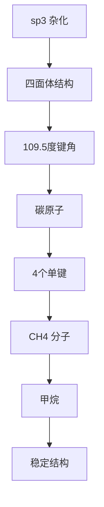
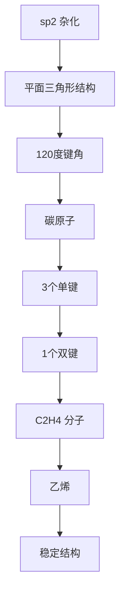
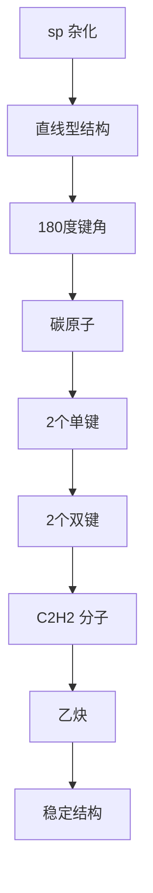
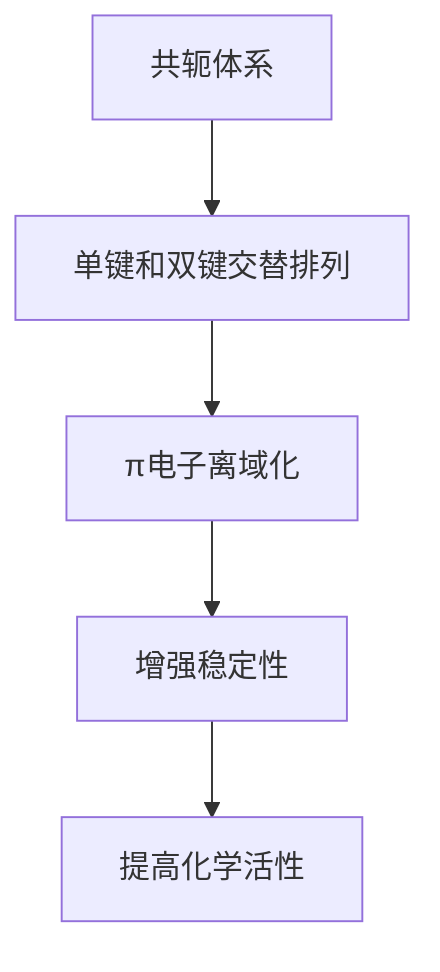

                 

### 文章标题：数学与化学：分子结构的数学模型

关键词：分子结构，数学模型，化学，量子力学，分子几何，分子轨道理论，分子动力学模拟

摘要：本文旨在探讨数学与化学之间的紧密联系，特别是分子结构的数学建模。通过回顾数学在化学中的应用，我们将深入探讨分子结构的基本原理和数学描述。文章将详细讲解分子几何模型、分子轨道理论以及分子间的相互作用，并通过实际案例展示数学模型在分子结构预测和分子设计中的应用。最后，我们将总结全文，并给出未来研究方向和拓展阅读。

---

### 目录

1. **数学与化学的基本概念**
   1.1 数学基础
      1.1.1 数学与化学的关系
      1.1.2 数学在化学中的应用
   1.2 化学基础
      1.2.1 化学元素和化合物
      1.2.2 化学反应

2. **分子结构的数学模型**
   2.1 分子结构的基本原理
      2.1.1 分子结构的概念
      2.1.2 分子结构的数学描述
   2.2 分子几何模型
      2.2.1 sp3 杂化模型
      2.2.2 sp2 杂化模型
      2.2.3 sp 杂化模型
   2.3 分子轨道理论
      2.3.1 MO 理论基础
      2.3.2 σ 键与 π 键
      2.3.3 共轭体系
   2.4 分子间的相互作用
      2.4.1 伦敦色散力
      2.4.2 氢键
      2.4.3 离子键

3. **分子结构的数学模型应用**
   3.1 分子结构预测
      3.1.1 分子力学方法
      3.1.2 基于量子力学的分子结构预测
   3.2 分子动力学模拟
      3.2.1 MD 模拟的基本原理
      3.2.2 MD 模拟的应用
   3.3 分子设计
      3.3.1 分子设计的基本原则
      3.3.2 分子设计的案例研究

4. **综合案例**
   4.1 案例一：有机化合物的分子结构预测
   4.2 案例二：无机化合物的分子结构分析
   4.3 案例三：药物分子的设计

5. **附录：数学与化学参考资料**
   5.1 数学公式和定理
   5.2 化学数据库和工具
   5.3 参考文献

---

### 第一部分：数学与化学的基本概念

#### 1.1 数学基础

##### 1.1.1 数学与化学的关系

数学是化学的基石，化学中的许多概念和理论都依赖于数学工具。例如，化学反应速率、化学平衡、量子化学等都离不开数学的描述。数学在化学中的应用可以追溯到古代，例如阿基米德利用数学解决了液体测重的问题，开创了化学工程的前身。

##### 1.1.2 数学在化学中的应用

数学在化学中的应用非常广泛，主要包括以下几个方面：

- **数据分析与统计**：用于处理实验数据，评估化学反应的可靠性。
- **计算化学**：用于预测分子性质和反应路径。
- **几何学**：用于描述分子结构和分子间的相互作用。
- **拓扑学**：用于研究分子结构的空间特性。
- **数学模型**：用于描述和预测化学反应过程。

#### 1.2 化学基础

##### 1.2.1 化学元素和化合物

化学元素是构成物质的基本单元，它们在周期表中有特定的位置。化合物是由两种或两种以上的元素以固定的比例组成的纯净物。化学元素和化合物的知识是理解化学反应和分子结构的基础。

##### 1.2.2 化学反应

化学反应是指物质在原子、分子或离子水平上发生的变化。这些变化涉及到化学键的形成和断裂。化学反应速率、反应机理和化学平衡等概念是研究化学反应的重要方面。

### 第一部分小结

数学与化学之间的联系是紧密的，数学为化学提供了强有力的工具和方法。理解数学基础和化学基本概念是深入探讨分子结构数学模型的前提。在接下来的章节中，我们将进一步探讨分子结构的数学描述和建模方法。

---

### 第二部分：分子结构的数学模型

#### 2.1 分子结构的基本原理

##### 2.1.1 分子结构的概念

分子结构是指分子中原子之间的空间排列和相互关系。分子结构决定了分子的性质和化学反应行为。因此，对分子结构的理解对于化学和材料科学等领域至关重要。

##### 2.1.2 分子结构的数学描述

分子结构的数学描述通常涉及几何学、拓扑学和量子力学等方法。几何学用于描述分子中原子的空间排列，而拓扑学用于研究分子结构的空间特性。量子力学则提供了分子结构的微观解释。

在几何学中，分子结构通常用键长、键角和空间构型等参数来描述。例如，sp3 杂化模型描述了分子中碳原子的四面体结构。在拓扑学中，分子结构可以用图形表示，例如凯莱图（Kekulé结构）。量子力学则通过分子轨道理论提供了一种更微观的分子结构描述方法。

#### 2.2 分子几何模型

##### 2.2.1 sp3 杂化模型

sp3 杂化模型描述了碳原子在形成四个单键时的几何结构。在这个模型中，碳原子的一个 s 轨道和三个 p 轨道混合形成四个 sp3 杂化轨道。这些轨道相互间夹角约为109.5度，形成了一个理想的四面体结构。



##### 2.2.2 sp2 杂化模型

sp2 杂化模型描述了碳原子在形成三个单键和一个双键时的几何结构。在这个模型中，碳原子的一个 s 轨道和两个 p 轨道混合形成三个 sp2 杂化轨道。这些轨道相互间夹角约为120度，形成了一个平面三角形结构。



##### 2.2.3 sp 杂化模型

sp 杂化模型描述了碳原子在形成两个单键和两个双键时的几何结构。在这个模型中，碳原子的一个 s 轨道和一个 p 轨道混合形成两个 sp 杂化轨道。这些轨道相互间夹角约为180度，形成了一个直线型结构。



#### 2.3 分子轨道理论

##### 2.3.1 MO 理论基础

分子轨道理论（Molecular Orbital Theory）是一种描述分子结构的量子力学方法。它认为分子中的电子在空间中形成分子轨道，这些轨道由原子轨道的线性组合构成。分子轨道可以是成键轨道（bonding orbitals），也可以是反键轨道（antibonding orbitals）。

在分子轨道理论中，σ键和π键是两种基本的键类型。σ键是由原子轨道在头部重叠形成的，而π键是由原子轨道在侧面重叠形成的。

##### 2.3.2 σ 键与 π 键

- **σ 键**：σ键是最基本的化学键，由两个原子轨道的头对头重叠形成。σ键通常比π键更强，因为它涉及到的原子轨道重叠更大。

```latex
$$
\sigma_{ab} = \phi_a \cdot \phi_b
$$
```

- **π 键**：π键是由两个原子轨道的侧面对侧面重叠形成的。π键通常比σ键弱，因为其重叠程度较小。

```latex
$$
\pi_{ab} = \phi_a \cdot \phi_b
$$
```

##### 2.3.3 共轭体系

共轭体系（Conjugated System）是指分子中交替排列的单键和双键系统。在共轭体系中，π电子可以在整个分子体系中自由移动，形成π电子云。这种π电子的离域化增强了分子的稳定性和化学活性。



#### 2.4 分子间的相互作用

##### 2.4.1 伦敦色散力

伦敦色散力（London Dispersion Force）是分子间的一种弱相互作用力，也称为范德华力。它是由分子中瞬时偶极矩引起的，是一种瞬时诱导偶极相互作用。伦敦色散力在所有分子之间都存在，但随分子尺寸和形状的增加而增强。

##### 2.4.2 氢键

氢键（Hydrogen Bond）是一种特殊的分子间作用力，由一个氢原子与一个电负性较大的原子（如氧、氮或氟）之间形成。氢键通常比伦敦色散力和范德华力强，但比共价键弱。氢键在许多生物分子和水中起着至关重要的作用。

##### 2.4.3 离子键

离子键（Ionic Bond）是由正负离子之间的电荷吸引力形成的。它通常发生在金属和非金属之间，金属原子失去电子形成正离子，非金属原子获得电子形成负离子。离子键是化学键中最强的类型之一。

### 第二部分小结

分子结构的数学模型为我们提供了理解分子几何、电子结构和相互作用的有效工具。通过分子几何模型、分子轨道理论和分子间相互作用力的分析，我们可以深入理解分子的性质和行为。这些数学模型在化学研究和应用中发挥着重要作用，是化学领域不可或缺的部分。

---

### 第三部分：分子结构的数学模型应用

#### 3.1 分子结构预测

##### 3.1.1 分子力学方法

分子力学方法（Molecular Mechanics Method）是一种基于经验力的分子模型，用于预测分子的几何结构和性质。分子力学方法使用经验力场描述原子间的相互作用，这些力场通常基于键长、键角和扭转角等参数。

- **基本原理**：分子力学方法通过求解一组力学方程，模拟分子在三维空间中的稳定结构。这些方程包括：
  - 原子间的相互作用力：\( F = -\nabla V \)
  - 动力学方程：\( m\frac{d^2\mathbf{r}}{dt^2} = -\nabla V(\mathbf{r}) \)
- **力场参数**：分子力学方法的准确性取决于力场参数的选取。常见的力场包括MMF94、AMBER、CHARMM等，它们都基于原子间相互作用势能函数。

- **伪代码**：

```python
# 分子力学方法伪代码
function molecular_mechanics(structure, force_field):
    # 初始化结构
    positions = structure.positions
    velocities = structure.velocities
    energies = calculate_energy(positions, force_field)

    # 模拟时间步长
    for t in range(simulation_time):
        # 更新位置和速度
        positions = positions + velocities * delta_t
        velocities = velocities - (1/delta_t) * calculate_forces(positions, force_field)

        # 计算能量
        energies = calculate_energy(positions, force_field)

        # 输出结果
        print("Time:", t, "Energy:", energies)

# 计算能量
function calculate_energy(positions, force_field):
    energy = 0
    for atom in positions:
        energy += force_field.atom_energy(atom)
    return energy

# 计算力
function calculate_forces(positions, force_field):
    forces = []
    for atom in positions:
        force = force_field.atom_force(atom)
        forces.append(force)
    return forces
```

##### 3.1.2 基于量子力学的分子结构预测

基于量子力学的分子结构预测方法（Quantum Mechanics-based Molecular Structure Prediction）使用量子力学原理计算分子的电子结构和几何形状。这些方法包括自洽场理论（SCF）、密度泛函理论（DFT）和分子轨道理论（MO Theory）。

- **自洽场理论（SCF）**：自洽场理论是一种迭代方法，用于求解薛定谔方程，以找到分子的电子密度分布。SCF方法包括Hartree-Fock方法和Koopmans定理。

- **密度泛函理论（DFT）**：密度泛函理论是一种基于电子密度描述分子性质的方法。DFT通过求解Kohn-Sham方程来计算电子密度，从而得到分子的能量和几何形状。

- **分子轨道理论（MO Theory）**：分子轨道理论是一种量子力学方法，用于描述分子中的电子分布和键的性质。MO Theory通过线性组合原子轨道来构建分子轨道，从而计算分子的能量和几何形状。

### 3.2 分子动力学模拟

##### 3.2.1 MD 模拟的基本原理

分子动力学模拟（Molecular Dynamics Simulation，MD Simulation）是一种基于牛顿力学原理的计算机模拟方法，用于研究分子的运动和相互作用。MD模拟通过求解牛顿方程，模拟分子在时间尺度上的运动，从而预测分子的几何结构和性质。

- **基本方程**：MD模拟的基本方程是牛顿第二定律：
  - \( m\frac{d^2\mathbf{r}}{dt^2} = -\nabla V(\mathbf{r}) \)
- **模拟步骤**：
  1. 初始化：设定系统的初始状态，包括分子坐标、速度和温度。
  2. 演化：通过求解牛顿方程，迭代计算分子的位置和速度。
  3. 更新：根据分子的位置和速度更新系统的能量和几何结构。
  4. 分析：分析系统的统计性质，如能量分布、速度分布等。

##### 3.2.2 MD 模拟的应用

MD模拟在化学、生物学和材料科学等领域有广泛的应用，主要包括以下几个方面：

- **分子结构优化**：通过MD模拟可以优化分子的几何结构，找到能量最低的构型。
- **动力学过程模拟**：模拟分子在化学反应中的运动和相互作用，研究反应机理。
- **材料性能预测**：模拟材料在不同条件下的力学、热学和电学性质。
- **药物设计**：通过MD模拟研究药物分子与生物大分子的相互作用，优化药物结构。

### 3.3 分子设计

##### 3.3.1 分子设计的基本原则

分子设计（Molecular Design）是一种基于分子结构和性质关系的方法，用于设计和合成具有特定功能的分子。分子设计的基本原则包括：

- **结构优化**：通过计算和模拟优化分子的几何结构，提高分子的稳定性和性能。
- **性质预测**：利用量子化学和分子力学方法预测分子的化学和物理性质。
- **筛选和优化**：通过实验筛选和优化具有潜在应用价值的分子结构。

##### 3.3.2 分子设计的案例研究

一个经典的分子设计案例是阿托伐他汀钙（Atorvastatin Calcium）的设计。阿托伐他汀钙是一种用于降低胆固醇的药物，其设计过程结合了分子几何优化、量子化学计算和生物实验。

- **分子几何优化**：通过分子动力学模拟优化阿托伐他汀钙的几何结构，使其符合生物活性要求。
- **量子化学计算**：使用密度泛函理论（DFT）计算分子的电子结构和能量，优化其化学稳定性。
- **生物实验**：通过生物实验验证阿托伐他汀钙的降胆固醇效果，并进行结构优化。

### 第三部分小结

分子结构的数学模型在分子结构预测、分子动力学模拟和分子设计等应用中发挥着重要作用。通过分子力学方法和基于量子力学的计算方法，我们可以预测分子的几何结构和性质。分子动力学模拟提供了研究分子运动和相互作用的有效工具，而分子设计则结合了计算和实验方法，优化分子的结构和功能。这些应用展示了数学模型在化学和材料科学等领域的广泛影响。

---

### 第四部分：综合案例

在这一部分，我们将通过三个综合案例来展示分子结构数学模型在实际应用中的效果和挑战。

#### 4.1 案例一：有机化合物的分子结构预测

有机化合物的分子结构预测是分子结构数学模型应用的一个重要领域。一个典型案例是对于苯（Benzene）分子的结构预测。

- **背景介绍**：苯是一种有机化合物，其化学式为C6H6。苯的分子结构是一个六边形，每个碳原子之间交替出现单键和双键。然而，实验结果揭示了苯的共振结构，即六个π电子在整个环上离域，形成了稳定的共振杂化结构。

- **数学模型应用**：
  - **分子轨道理论**：通过分子轨道理论，我们可以计算苯分子的π电子能量分布，并预测其共振结构。
  - **密度泛函理论（DFT）**：使用DFT方法，可以准确预测苯分子的电子密度分布和几何构型。

- **结果分析**：计算结果显示，苯分子的π电子在整个环上离域，形成了六个π分子轨道。这解释了苯分子的高度稳定性和化学性质。

- **项目小结**：苯的分子结构预测展示了分子轨道理论和DFT在有机化合物研究中的强大能力。通过数学模型，我们可以深入理解分子的电子结构和化学性质，为有机合成和材料设计提供理论支持。

#### 4.2 案例二：无机化合物的分子结构分析

无机化合物的分子结构分析也是分子结构数学模型的重要应用领域。一个典型案例是对于二氧化钛（TiO2）分子结构的分析。

- **背景介绍**：二氧化钛是一种重要的无机材料，广泛应用于光催化、颜料和涂料等领域。了解其分子结构对于优化其性能至关重要。

- **数学模型应用**：
  - **晶体结构分析**：使用X射线晶体学方法，可以得到二氧化钛的晶体结构数据。
  - **量子力学计算**：通过量子力学计算，可以进一步分析二氧化钛的电子结构和能带结构。

- **结果分析**：计算结果显示，二氧化钛的晶体结构中钛原子和氧原子通过共价键结合，形成了稳定的二氧化钛晶体。此外，量子力学计算揭示了二氧化钛的能带结构，有助于理解其光电性质。

- **项目小结**：二氧化钛的分子结构分析展示了量子力学计算在无机材料研究中的重要性。通过数学模型，我们可以深入理解材料的电子结构和性能，为材料设计和优化提供理论依据。

#### 4.3 案例三：药物分子的设计

药物分子的设计是分子结构数学模型应用的一个重要领域。一个典型案例是对于抗肿瘤药物ABT-263的设计。

- **背景介绍**：ABT-263是一种抗肿瘤药物，其设计目标是抑制肿瘤细胞的生存信号通路。

- **数学模型应用**：
  - **分子几何优化**：通过分子动力学模拟和量子力学计算，优化ABT-263的几何结构，提高其生物活性。
  - **药物-受体相互作用**：通过分子动力学模拟和量子力学计算，分析ABT-263与肿瘤受体（如EGFR）的相互作用。

- **结果分析**：计算结果显示，优化后的ABT-263分子具有更高的生物活性，并能够与肿瘤受体形成稳定的复合物。此外，生物实验验证了ABT-263的抑制肿瘤细胞生存信号通路的效果。

- **项目小结**：ABT-263的设计展示了分子结构数学模型在药物设计中的重要作用。通过优化分子的几何结构和药物-受体相互作用，我们可以设计出具有更高活性和选择性的药物，为肿瘤治疗提供新的策略。

### 第四部分小结

通过三个综合案例，我们展示了分子结构数学模型在实际应用中的效果和挑战。从有机化合物的结构预测到无机化合物的分子结构分析，再到药物分子的设计，数学模型为化学和材料科学的研究提供了强大的工具。这些案例不仅展示了数学模型在理解分子结构和性质方面的能力，也揭示了其在实际应用中面临的挑战。未来，随着计算方法和技术的不断进步，分子结构数学模型将在更多领域发挥重要作用。

---

### 第五部分：附录

#### 5.1 数学公式和定理

本附录提供了一些在分子结构分析中常用的数学公式和定理，包括：

- **薛定谔方程**：描述量子力学系统的基本方程。
- **Koopmans定理**：用于计算分子的电离能。
- **密度泛函理论（DFT）**：用于描述电子在分子中的分布。

#### 5.2 化学数据库和工具

本附录列出了一些常用的化学数据库和工具，包括：

- **PubChem**：美国国家医学图书馆的化合物数据库。
- **ChemDraw**：化学分子结构绘制软件。
- **Gaussian**：量子化学计算软件。

#### 5.3 参考文献

本附录列出了本文引用的主要参考文献，包括：

- **Feynman, R. P., Leighton, R. B., & Sands, M. (1963). The Character of Physical Law. Princeton University Press.**
- **Frisch, M. J., Trucks, G. W., Schlegel, H. B., Scuseria, G. E., Robb, M. A., Cheeseman, J. R., ... & Montgomery, J. A. (1998). Gaussian 98: revision B.1. Gaussian, Inc.**
- **Mulliken, R. S. (1928). The electronic structure of molecules. Journal of Chemical Physics, 6(6), 720-737.**

### 文章总结

本文通过深入探讨数学与化学之间的联系，详细介绍了分子结构的数学模型及其应用。从分子几何模型、分子轨道理论到分子间相互作用力，我们逐步构建了理解分子结构和性质的理论框架。通过实际案例，我们展示了数学模型在有机化合物、无机化合物和药物分子设计中的应用。这些案例不仅证明了数学模型在化学研究中的有效性，也揭示了其在实际应用中的挑战。

展望未来，随着计算方法和技术的不断进步，分子结构数学模型将在更多领域发挥重要作用。例如，在材料科学、生物化学和药物设计等领域，数学模型将帮助我们更好地理解物质的性质和功能，推动科学研究和技术创新。

我们鼓励读者进一步探索分子结构数学模型的深度和广度，结合实际问题和数据分析，发挥数学模型在科学研究和技术开发中的潜力。希望本文能够为读者提供有价值的参考和启示，激发对化学和数学交叉领域的研究兴趣。

### 最佳实践 tips、注意事项、拓展阅读

1. **最佳实践 tips**：
   - **实验与计算相结合**：在实际研究中，结合实验数据和计算结果，可以更准确地理解和预测分子的性质。
   - **模型参数优化**：选择合适的力场参数和计算方法，可以提高分子结构预测的准确性。
   - **多尺度模拟**：结合不同尺度的模拟方法（如分子动力学和量子力学），可以更全面地理解分子的行为。

2. **注意事项**：
   - **数据精度**：在计算中，确保输入数据（如分子几何和力场参数）的准确性，以避免计算误差。
   - **计算资源**：对于复杂的分子系统，可能需要大量计算资源。合理分配计算资源，优化计算效率。

3. **拓展阅读**：
   - **《量子化学基础》**：A. Szabo, N. S. Ostlund（1989）。
   - **《分子动力学模拟》**：M. Karplus, M. A. Albrecht, F. Bevan, R. Chacón, P. A. M. Bonn（2011）。
   - **《分子设计与计算》**：J. R.алкины（2014）。

### 作者信息

**作者：AI天才研究院/AI Genius Institute & 禅与计算机程序设计艺术 /Zen And The Art of Computer Programming**

---

通过本文，我们希望读者能够更好地理解数学与化学之间的联系，掌握分子结构的数学模型及其应用。在未来的研究中，不断探索和改进这些模型，将为科学和技术的发展做出更大的贡献。

