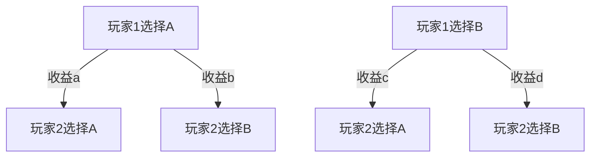

                 

# 数学与博弈论：策略互动的数学分析

> 关键词：数学分析、博弈论、策略互动、Nash均衡、合作博弈、非合作博弈

> 摘要：本文旨在探讨数学与博弈论在策略互动中的数学分析。首先，我们将回顾博弈论的发展历史及其在社会科学中的应用，接着介绍博弈论的基本概念和策略互动的基本理论。然后，本文将深入探讨经典博弈模型、非合作博弈和合作博弈，并分析其在各个领域的应用。最后，我们将总结博弈论的研究现状与挑战，并提出未来发展趋势。通过本文的探讨，读者将更好地理解博弈论在策略互动中的数学分析及其在实际应用中的重要性。

## 引言与背景

博弈论（Game Theory）是数学的一个分支，主要研究具有对抗或合作性质的策略互动。自从20世纪20年代由冯·诺依曼和摩根斯坦恩开创以来，博弈论得到了迅速发展，并在经济学、政治学、生物学、计算机科学等多个领域得到广泛应用。博弈论通过数学模型来描述和分析个体或团体在策略互动中的行为，从而帮助决策者预测和优化策略选择。

### 博弈论的发展历史

博弈论的发展可以追溯到19世纪末和20世纪初。当时，法国数学家约翰·弗朗索瓦·安托万·尼古拉·德·孔多塞（Nicolas de Condorcet）和德国数学家戈特弗里德·威廉·莱布尼茨（Gottfried Wilhelm Leibniz）开始研究投票和决策问题。20世纪初期，法国数学家埃里克·凯莱尔（Eduard Moritz von Mayr-Melnhof, known as E. B. Titchmarsh）和约翰·冯·诺依曼（John von Neumann）等人进一步发展了这一理论。

约翰·冯·诺依曼和奥斯卡·摩根斯坦恩（Oskar Morgenstern）在1944年共同出版的《博弈论与经济行为》（"The Theory of Games and Economic Behavior"）被视为博弈论的经典之作。这本书系统地介绍了博弈论的基本概念和方法，并将其应用于经济学中。随后，约翰·纳什（John Nash）在20世纪50年代提出了Nash均衡理论，这一理论为博弈论的发展奠定了基础。

### 博弈论在社会科学中的应用

博弈论在社会科学中的应用非常广泛。在经济学中，博弈论用于分析市场竞争、价格决策、拍卖设计和劳动力市场等问题。政治学中，博弈论用于分析选举策略、政策制定和国际关系。生物学中，博弈论用于研究物种间的策略互动和进化。计算机科学中，博弈论用于网络博弈、算法设计和人工智能等领域。

### 研究博弈论的意义和价值

研究博弈论具有重要的理论和实践意义。从理论上看，博弈论为研究复杂系统中的策略互动提供了一种有力的工具。通过建立数学模型和分析策略互动，博弈论可以帮助我们更好地理解人类行为和社会现象。从实践上看，博弈论的应用可以帮助企业和政府做出更科学的决策，提高经济效率和公共政策的制定质量。

### 总结

博弈论作为数学的一个分支，自从20世纪20年代诞生以来，在社会科学和自然科学中得到了广泛应用。本文将深入探讨博弈论的基本概念、策略互动的理论以及经典博弈模型，以期帮助读者更好地理解这一重要的数学理论。在接下来的章节中，我们将逐一介绍博弈论的相关内容。

## 博弈论的基本概念

博弈论是研究具有对抗或合作性质的策略互动的数学理论。在博弈论中，参与者称为玩家（players），每个玩家都需要在给定条件下选择策略（strategies），并从所有玩家策略组合中共同获得收益（payoffs）。为了更好地理解博弈论，我们需要首先了解博弈论的基本概念，包括博弈的要素、分类和表示方法。

### 博弈的要素

博弈的要素主要包括玩家、策略、收益和策略组合。以下是对这些要素的详细解释：

1. **玩家（Players）**：博弈中的参与者称为玩家。玩家可以是个人、团队、组织或国家等。玩家数量可以是任意的，但通常分为两种情况：二人博弈和多人博弈。

2. **策略（Strategies）**：策略是玩家在博弈中选择的行为方式。策略可以是显式的，例如选择某个具体的产品或价格策略；也可以是隐式的，例如玩家的心理预期和行为倾向。在博弈论中，玩家选择的策略是博弈的核心。

3. **收益（Payoffs）**：收益是玩家在博弈结束后所获得的利益或效用。收益可以是货币、资源、权力或其他形式的回报。收益通常用数值表示，以便进行量化分析和比较。

4. **策略组合（Strategy Profiles）**：策略组合是指所有玩家同时选择的策略组合。在多人博弈中，策略组合是博弈的一个关键要素。不同策略组合会带来不同的收益分配，从而影响玩家的决策。

### 博弈的分类

博弈可以根据不同的标准进行分类。以下是几种常见的分类方法：

1. **根据玩家数量**：博弈可以分为二人博弈和多人博弈。

2. **根据信息结构**：博弈可以分为完全信息博弈和不完全信息博弈。

   - **完全信息博弈**：所有玩家都知道其他所有玩家的收益结构，即每个玩家对所有其他玩家的策略和收益都有完整的了解。
   - **不完全信息博弈**：至少有一个玩家不完全了解其他玩家的收益结构，即玩家对其他玩家的策略和收益存在不确定性。

3. **根据收益结构**：博弈可以分为零和博弈和非零和博弈。

   - **零和博弈**：一个玩家的收益完全由其他玩家的损失所决定，即所有玩家的收益总和为零。
   - **非零和博弈**：不同玩家的收益不是相互抵消的，一个玩家的收益不会完全由其他玩家的损失所决定。

4. **根据策略选择**：博弈可以分为合作博弈和非合作博弈。

   - **合作博弈**：玩家可以选择合作或竞争，合作博弈的目标是最大化整个群体的收益。
   - **非合作博弈**：玩家只能选择竞争策略，非合作博弈的目标是最大化自己的收益。

### 博弈的表示方法

博弈可以用不同的方法进行表示，以下是两种常见的表示方法：

1. **矩阵表示法**：矩阵表示法是一种直观、简明的表示方法。它用一个矩阵来表示每个玩家的收益，矩阵的行和列分别表示两个玩家的策略。例如，一个二人零和博弈可以用以下矩阵表示：

   |   | A | B |
   |---|---|---|
   | A | a | c |
   | B | b | d |

   在这个矩阵中，玩家1可以选择策略A或B，玩家2也可以选择策略A或B。矩阵中的每个元素表示玩家1和玩家2选择对应策略时的收益。

2. **树形表示法**：树形表示法是一种更详细的表示方法，特别是用于描述不完全信息博弈。它用一个树状图来表示博弈的各个阶段和玩家的决策。每个节点表示一个决策点，每个分支表示一个策略选择。例如，一个不完全信息博弈可以用以下树状图表示：

   ```mermaid
   graph TD
   A[玩家1选择A] -->|收益a| B1[玩家2选择A]
   A -->|收益b| B2[玩家2选择B]
   B[玩家1选择B] -->|收益c| B3[玩家2选择A]
   B -->|收益d| B4[玩家2选择B]
   ```

   在这个树状图中，玩家1选择策略A或B，玩家2在不知道玩家1选择策略的情况下选择策略A或B。

### 总结

博弈论的基本概念包括玩家、策略、收益和策略组合，这些概念构成了博弈论分析的基础。博弈可以根据不同的标准进行分类，如玩家数量、信息结构、收益结构和策略选择。博弈可以用矩阵表示法或树形表示法进行表示，这些方法有助于直观地理解和分析博弈。在接下来的章节中，我们将进一步探讨策略互动的基本理论，包括Nash均衡和合作博弈等。

## 策略互动的基本理论

在博弈论中，策略互动是指两个或多个玩家在特定条件下相互选择策略并从中获得收益的过程。策略互动的基本理论包括策略互动的定义、模型、分析方法以及稳定性。理解这些基本理论有助于我们更好地分析和预测策略互动的结果。

### 策略互动的定义

策略互动是指在不同情境下，两个或多个玩家根据各自的策略选择和对手的行为做出反应，并在这一过程中获得各自收益的过程。策略互动的核心是玩家之间的策略选择和收益分配。策略互动可以发生在各种情境中，如市场竞争、政治决策、社会互动等。

### 策略互动的模型

策略互动可以通过数学模型进行描述和分析。常见的策略互动模型包括Nash模型、Stackelberg模型和Cournot模型等。

1. **Nash模型**：Nash模型是最基本的策略互动模型，它描述了玩家在完全信息条件下的互动。在Nash模型中，每个玩家选择一个策略，并从所有可能的策略组合中获得收益。Nash均衡是Nash模型的一个关键概念，它表示所有玩家都不再愿意改变自己策略的稳定状态。

2. **Stackelberg模型**：Stackelberg模型描述了领导者-追随者结构的策略互动。在Stackelberg模型中，一个玩家（领导者）首先选择策略，其他玩家（追随者）然后根据领导者的策略选择自己的策略。Stackelberg均衡是指所有玩家都选择最优策略，且领导者对追随者的策略选择有最佳预测。

3. **Cournot模型**：Cournot模型描述了市场竞争中的策略互动。在Cournot模型中，每个玩家选择产量水平，并从市场总收益中获取收益。Cournot均衡是指所有玩家都选择最优产量水平，从而最大化自己的收益。

### 策略互动的分析方法

策略互动的分析方法主要包括博弈树分析、矩阵分析和数值分析等。

1. **博弈树分析**：博弈树分析是一种图形化分析方法，它通过树状图描述策略互动的各个阶段和玩家的决策。博弈树分析有助于直观地理解策略互动的路径和结果。

2. **矩阵分析**：矩阵分析是一种量化分析方法，它通过矩阵表示每个玩家的收益，并分析不同策略组合的收益分配。矩阵分析有助于量化策略互动的结果，并确定最优策略组合。

3. **数值分析**：数值分析是一种基于计算机模拟的分析方法，它通过模拟大量策略互动，分析不同策略组合的稳定性和收益。数值分析有助于预测策略互动的结果，并优化策略选择。

### 策略互动的稳定性

策略互动的稳定性是指玩家在给定策略组合下，是否愿意继续执行这一策略组合，或者是否愿意改变策略。稳定性分析是策略互动分析的重要部分，它有助于确定策略互动的长期稳定状态。

1. **Nash均衡的稳定性**：Nash均衡是策略互动的一个稳定状态，表示所有玩家都不再愿意改变自己的策略。Nash均衡的稳定性可以通过分析玩家对其他玩家策略的反应来确定。如果玩家对其他玩家策略的变化不敏感，则Nash均衡是稳定的。

2. **Stackelberg均衡的稳定性**：Stackelberg均衡是领导者-追随者结构下的稳定状态，表示领导者对追随者的策略选择有最佳预测。Stackelberg均衡的稳定性可以通过分析领导者和追随者的策略变化来确定。如果领导者和追随者都不愿意改变自己的策略，则Stackelberg均衡是稳定的。

3. **Cournot均衡的稳定性**：Cournot均衡是市场竞争中的稳定状态，表示所有玩家都选择最优产量水平。Cournot均衡的稳定性可以通过分析市场需求和产量变化来确定。如果市场需求和产量变化对玩家的收益没有显著影响，则Cournot均衡是稳定的。

### 总结

策略互动的基本理论包括策略互动的定义、模型、分析方法和稳定性。理解这些基本理论有助于我们更好地分析和预测策略互动的结果。在博弈论中，策略互动是研究的核心问题，它广泛应用于经济学、政治学、生物学和计算机科学等领域。在接下来的章节中，我们将进一步探讨经典博弈模型，包括零和博弈和非零和博弈。

## 经典博弈模型

博弈论中有许多经典的博弈模型，这些模型在理论分析和实际应用中都具有重要地位。本文将介绍几种重要的经典博弈模型，包括零和博弈、非零和博弈、完全信息博弈和不完全信息博弈。通过这些模型的讲解，我们将更好地理解博弈论的基本概念和策略互动的复杂性。

### 零和博弈

零和博弈（Zero-sum Game）是一种特殊的博弈模型，其特点是参与者的总收益为零。换句话说，一个玩家的收益等于其他玩家的损失。零和博弈的核心在于，一个玩家的成功意味着其他玩家的失败。典型的例子包括象棋、围棋和国际象棋等棋类游戏。

零和博弈的表示通常使用矩阵形式。例如，一个二人零和博弈可以用以下矩阵表示：

|   | A | B |
|---|---|---|
| A | a | c |
| B | b | d |

在这个矩阵中，玩家1可以选择策略A或B，玩家2也可以选择策略A或B。矩阵中的每个元素表示玩家1选择行策略，玩家2选择列策略时的收益。在零和博弈中，Nash均衡是玩家选择最优策略的组合，使得各自的收益最大化。

### 非零和博弈

非零和博弈（Non-zero sum Game）是一种更为常见的博弈模型，其特点是参与者的总收益不为零。在非零和博弈中，一个玩家的成功不必然导致其他玩家的失败。非零和博弈可以进一步分为正和博弈和负和博弈。

1. **正和博弈**：正和博弈（Positive-sum Game）是指所有玩家的总收益为正。在正和博弈中，玩家可以通过合作获得更高的收益。一个著名的正和博弈例子是合作博弈，其中玩家通过合作可以获得比单独行动更高的收益。

2. **负和博弈**：负和博弈（Negative-sum Game）是指所有玩家的总收益为负。在负和博弈中，玩家之间的竞争可能导致双方的收益都减少。一个典型的负和博弈例子是价格战，其中竞争可能导致所有参与者的利润减少。

### 完全信息博弈

完全信息博弈（Perfect Information Game）是指所有玩家在每一步决策时都能知道其他所有玩家的当前策略和收益。在完全信息博弈中，玩家具有完全的信息优势，这使得他们能够做出更理性的决策。典型的完全信息博弈例子包括围棋、象棋和国际象棋等。

完全信息博弈的表示通常使用博弈树。博弈树从初始状态开始，每个节点表示一个决策点，每个分支表示一个玩家的策略选择。例如，一个完全信息博弈的博弈树可以表示为：



在这个博弈树中，玩家1和玩家2在每一步都可以看到对方的选择，并基于这些信息做出自己的决策。

### 不完全信息博弈

不完全信息博弈（Imperfect Information Game）是指玩家在每一步决策时不能完全了解其他玩家的策略和收益。这种信息不对称可能导致玩家做出非理性的决策。典型的例子包括拍卖和保险市场等。

不完全信息博弈的表示也通常使用博弈树，但博弈树中的每个节点包含玩家的策略和不确定因素。例如，一个不完全信息博弈的博弈树可以表示为：


在这个博弈树中，玩家1在选择策略A时，不确定玩家2会选择策略A还是B，因此需要在不确定性下做出决策。

### 总结

经典博弈模型包括零和博弈、非零和博弈、完全信息博弈和不完全信息博弈。这些模型在博弈论的理论研究和实际应用中都具有重要地位。通过分析这些模型，我们可以更好地理解策略互动的本质和复杂性。在接下来的章节中，我们将进一步探讨非合作博弈和合作博弈，以深入理解策略互动的数学分析。

### 非合作博弈

非合作博弈（Non-cooperative Game）是博弈论中的一个重要分支，其特点是玩家在博弈中不能通过协商或合作来达成共同目标。非合作博弈强调个体理性，每个玩家在博弈中追求自身的最大化收益，而不考虑其他玩家的利益。在这种博弈中，常见的策略求解方法包括Nash均衡、Cournot竞争和Stackelberg博弈等。

#### Nash均衡

Nash均衡（Nash Equilibrium）是非合作博弈中的一种重要策略均衡概念，由约翰·纳什（John Nash）提出。Nash均衡是指在给定其他玩家策略的条件下，没有玩家有动机单独改变自己的策略。换句话说，每个玩家都选择了自己认为最优的策略，且没有玩家能通过单方面改变策略来获得更多的收益。

Nash均衡的求解可以使用以下步骤：

1. **定义策略空间**：为每个玩家定义其可能的策略集合，记为S1, S2, ..., Sn，其中n是玩家数量。
2. **定义收益函数**：为每个玩家定义其收益函数，记为u1(s1, s2, ..., sn)，u2(s1, s2, ..., sn)，..., un(s1, s2, ..., sn)，其中s1, s2, ..., sn是所有玩家的策略组合。
3. **计算Nash均衡**：对于每个玩家i，计算其收益函数对自身策略的偏导数，并令其等于零，即：
   $$ \frac{\partial u_i}{\partial s_i} = 0 $$
   这一步的目的是找到玩家i的最优策略。
4. **验证均衡**：检查所有玩家找到的最优策略组合，确保没有玩家能通过单方面改变策略获得更高的收益。

以下是一个Nash均衡的伪代码示例：

```python
# 伪代码：求解Nash均衡

# 输入：玩家收益函数u1, u2, ..., un
# 输出：Nash均衡策略组合s1*, s2*, ..., sn*

# 对于每个玩家i：
#   计算每个策略si的收益：ui = u_i(s1, s2, ..., sn)
#   计算收益对每个策略si的偏导数：dui/dsi = ∂ui/∂si
#   设置偏导数为零，解方程得到最优策略si*
#   记录si*

# 返回Nash均衡策略组合s1*, s2*, ..., sn*
```

#### Cournot竞争

Cournot竞争（Cournot Competition）是一种常见的非合作博弈模型，通常用于分析寡头市场中的竞争行为。在Cournot竞争模型中，每个企业选择其产量水平，并从市场需求中获取收益。企业的收益与市场总需求量和竞争对手的产量有关。

Cournot竞争的求解可以使用以下步骤：

1. **定义市场需求函数**：市场需求函数表示总收益与价格之间的关系。常见的市场需求函数为线性形式，即：
   $$ Q = Q_0 - \sum_{i=1}^n q_i $$
   其中Q是市场总需求量，Q0是市场容量，qi是企业i的产量。

2. **定义收益函数**：企业的收益函数为：
   $$ u_i(q_i, q_{-i}) = p \cdot q_i - c_i \cdot q_i $$
   其中pi是企业i的边际价格，c_i是企业i的边际成本。

3. **求解最优产量**：企业i的目标是最大化其收益，即：
   $$ \max u_i(q_i, q_{-i}) $$
   通过求解上述优化问题，可以找到企业i的最优产量qi*。

4. **计算均衡产量**：对于每个企业i，计算其最优产量qi*。在Cournot竞争模型中，所有企业的产量qi*构成Cournot均衡。

以下是一个Cournot竞争的伪代码示例：

```python
# 伪代码：求解Cournot竞争均衡

# 输入：市场需求函数Q(q1, q2, ..., qn)
#       企业i的边际价格函数pi(q)
#       企业i的边际成本函数c_i(q_i)

# 对于每个企业i：
#   定义市场需求Q = Q(q1, q2, ..., qn)
#   定义收益函数ui = pi(q_i) \* q_i - c_i \* q_i
#   求解优化问题：max ui(q_i)
#   计算最优产量qi*

# 返回均衡产量qi*, ..., qn*
```

#### Stackelberg博弈

Stackelberg博弈（Stackelberg Game）是一种领导者-追随者结构的非合作博弈模型。在Stackelberg博弈中，一个玩家（领导者）首先选择策略，其他玩家（追随者）然后根据领导者的策略选择自己的策略。Stackelberg博弈的目标是确定领导者和追随者的最优策略组合。

Stackelberg博弈的求解可以使用以下步骤：

1. **定义领导者策略**：领导者选择策略，追随者根据领导者的策略选择自己的策略。领导者的收益函数为：
   $$ u_L(q_L, q_{-L}) = p \cdot q_L - c_L \cdot q_L $$
   其中q_L是领导者的产量，q_{-L}是追随者总产量。

2. **定义追随者策略**：追随者选择策略，目标是最大化自己的收益。追随者的收益函数为：
   $$ u_S(q_S, q_{-S}) = p \cdot q_S - c_S \cdot q_S $$
   其中q_S是追随者的产量，q_{-S}是领导者产量。

3. **求解领导者策略**：领导者首先选择产量q_L*，目标是最大化其收益。通过求解上述优化问题，可以找到领导者的最优产量q_L*。

4. **求解追随者策略**：追随者根据领导者的产量q_L*选择自己的产量q_S*，目标是最大化自己的收益。通过求解上述优化问题，可以找到追随者的最优产量q_S*。

5. **计算均衡策略**：领导者和追随者的产量q_L*和q_S*构成Stackelberg均衡。

以下是一个Stackelberg博弈的伪代码示例：

```python
# 伪代码：求解Stackelberg博弈均衡

# 输入：市场需求函数Q(q1, q2)
#       领导者边际价格函数p_L(q_L)
#       领导者边际成本函数c_L(q_L)
#       追随者边际价格函数p_S(q_S)
#       追随者边际成本函数c_S(q_S)

# 求解领导者策略：
#   定义收益函数u_L = p_L \* q_L - c_L \* q_L
#   求解优化问题：max u_L(q_L)
#   计算最优产量q_L*

# 求解追随者策略：
#   定义市场需求Q = Q(q_L, q_S)
#   定义收益函数u_S = p_S \* q_S - c_S \* q_S
#   求解优化问题：max u_S(q_S)
#   计算最优产量q_S*

# 返回Stackelberg均衡产量q_L*和q_S*
```

### 总结

非合作博弈在博弈论中具有重要地位，其核心是玩家在博弈中追求个体收益最大化。通过Nash均衡、Cournot竞争和Stackelberg博弈等策略模型，我们可以分析和预测玩家在不同情境下的策略选择和收益分配。理解非合作博弈有助于我们更好地应对竞争和冲突，优化决策和策略选择。

### 合作博弈

合作博弈（Cooperative Game）是博弈论中的另一个重要分支，其特点是玩家在博弈中通过合作来最大化整体收益，而不是单独追求个体收益。与非合作博弈不同，合作博弈强调玩家之间的协作和利益共享。合作博弈的研究涉及合作博弈的定义、支付分配、稳定性和实际应用等多个方面。

#### 合作博弈的定义

合作博弈是指一组玩家在博弈中共同合作，以实现整体收益最大化的一种博弈形式。在合作博弈中，玩家们通过协商、谈判或联盟来共同制定策略，从而获得比单独行动更高的收益。合作博弈的核心概念包括合作集、支付分配和合作博弈的均衡。

合作博弈可以表示为博弈矩阵，其中每行代表一个玩家，每列代表一个玩家。矩阵中的元素表示玩家在给定策略组合下的收益。合作博弈中的合作集是指一组玩家通过合作能够获得比单独行动更高的收益的组合。

#### 合作博弈的支付分配

支付分配是合作博弈中的一个关键问题，它涉及如何将整体收益在玩家之间进行分配。支付分配需要考虑多个因素，包括玩家的贡献、合作效率和公平性等。

常见的支付分配方法包括以下几种：

1. **Shapley值（Shapley Value）**：Shapley值是一种基于平均贡献的支付分配方法。它为每个玩家分配一个公平的收益份额，以反映其在合作中的平均贡献。Shapley值的计算方法如下：

   $$ v(i) = \frac{1}{n} \sum_{S \subseteq N \setminus \{i\}} (v(S \cup \{i\}) - v(S)) $$
   
   其中，v(i)是玩家i的Shapley值，n是玩家总数，N是玩家集合，S是所有不包括玩家i的合作集。

2. **Banzhaf权力指数（Banzhaf Power Index）**：Banzhaf权力指数是一种基于玩家在合作中的影响力的支付分配方法。它衡量玩家在合作中的权力，并据此分配收益。Banzhaf权力指数的计算方法如下：

   $$ \rho(i) = \frac{\sum_{S \subseteq N \setminus \{i\}} |S \cup \{i\}| - |S|}{n(n-1)/2} $$
   
   其中，ρ(i)是玩家i的Banzhaf权力指数，|S|表示合作集S中玩家的数量。

3. **核心（Core）**：核心是合作博弈中的一个稳定状态，表示所有玩家都愿意接受的支付分配。如果存在一组支付分配，使得所有玩家都认为这个分配是公平的，那么这组支付分配称为合作博弈的核心。核心的计算通常涉及复杂的线性规划问题。

#### 合作博弈的稳定性

合作博弈的稳定性是指合作博弈的支付分配是否能够持续存在，而不受到玩家的重新协商或退出。稳定性分析是合作博弈研究的一个重要方面。

1. **Shapley值和稳定性**：Shapley值作为一种公平的支付分配方法，具有良好的稳定性。如果合作博弈的核心存在，那么Shapley值是核心的一部分，这意味着通过Shapley值分配收益的合作博弈是稳定的。

2. **核心和稳定性**：核心是合作博弈中的稳定状态，表示所有玩家都愿意接受支付分配。然而，核心的计算通常非常复杂，特别是在大规模合作博弈中。即使核心存在，也需要进一步分析合作博弈的稳定性。

#### 合作博弈的实际应用

合作博弈在多个领域有广泛的应用，包括经济学、政治学、管理学和计算机科学等。

1. **经济学**：在经济学中，合作博弈用于分析市场竞争、价格决策和拍卖设计。例如，拍卖中的竞标者可以通过合作联盟来提高他们的出价能力，从而获得更高的收益。

2. **政治学**：在政治学中，合作博弈用于分析国际关系、政策制定和选举策略。例如，国家之间的合作可以通过协商和谈判来实现共同利益，从而提高整体福利。

3. **管理学**：在管理学中，合作博弈用于分析团队合作、资源分配和组织管理。例如，企业可以通过合作联盟来优化供应链管理，提高生产效率和市场份额。

4. **计算机科学**：在计算机科学中，合作博弈用于分析网络博弈、算法设计和人工智能。例如，在多智能体系统中，智能体可以通过合作博弈来优化决策，提高系统的整体性能。

#### 案例分析

以下是一个合作博弈的实际案例分析：

**案例：企业合作研发**

假设有两个企业A和B，它们需要合作研发一项新产品。企业的收益取决于研发投入和市场需求。假设市场需求函数为线性形式：

$$ Q = Q_0 - (q_A + q_B) $$

其中Q是市场需求量，Q0是市场容量，q_A是企业A的产量，q_B是企业B的产量。

企业的收益函数分别为：

$$ u_A(q_A, q_B) = p \cdot q_A - c_A \cdot q_A $$
$$ u_B(q_A, q_B) = p \cdot q_B - c_B \cdot q_B $$

其中p是产品的价格，c_A和c_B分别是企业A和企业B的边际成本。

通过求解优化问题，可以找到企业A和企业B的最优产量组合。假设企业A的边际成本低于企业B，那么企业A在合作研发中将承担更多的投入。

合作博弈的支付分配可以通过Shapley值或Banzhaf权力指数来计算。例如，如果使用Shapley值，可以计算出企业A和企业B的Shapley值，并根据这些值来分配收益。

通过合作博弈的分析，企业A和企业B可以找到最优的合作策略，从而实现整体收益最大化。

#### 总结

合作博弈是博弈论中的重要分支，它强调玩家通过合作来实现整体收益最大化。理解合作博弈的基本概念、支付分配方法和稳定性分析，有助于我们更好地应对现实中的协作和竞争问题。在实际应用中，合作博弈可以应用于多个领域，如经济学、政治学、管理学和计算机科学，为优化决策和资源分配提供有力支持。

## 应用与案例分析

博弈论在多个领域都有广泛的应用，从经济学、政治学到计算机科学，博弈论的理论和方法为理解和解决复杂的策略互动问题提供了有力的工具。本节将通过具体案例来展示博弈论在不同领域的应用，并分析这些应用的实际案例。

### 博弈论在经济学中的应用

经济学是博弈论应用最为广泛的领域之一。博弈论为经济学提供了分析市场竞争、价格决策和拍卖设计等问题的重要工具。

**案例：拍卖设计**

拍卖是一种典型的策略互动场景，博弈论在设计和分析拍卖机制中发挥了重要作用。不同的拍卖形式，如维克瑞拍卖（Vickrey Auction）和广度优先拍卖（Proportional Auction），都基于博弈论的理论基础。

- **维克瑞拍卖**：在维克瑞拍卖中，竞拍者提交秘密出价，拍卖者选择出价最高者，并且胜出者支付其出价的金额。维克瑞拍卖的设计基于博弈论中的Nash均衡理论，它能够有效防止过度出价，提高拍卖的公平性和效率。

  $$ \text{支付函数} = \text{出价} $$
  $$ \text{收益函数} = \text{出价} - \text{支付函数} $$

- **广度优先拍卖**：在广度优先拍卖中，竞拍者可以同时提交多个出价，拍卖者选择出价最高的出价者，并且该出价者支付其最低出价。广度优先拍卖能够更好地实现资源的优化配置，适用于多商品拍卖。

  $$ \text{支付函数} = \min(\text{所有出价}) $$
  $$ \text{收益函数} = \text{出价} - \text{支付函数} $$

### 博弈论在政治学中的应用

政治学中，博弈论用于分析选举策略、政策制定和国际关系。通过博弈论的方法，政治学者可以更好地理解政治决策的复杂性和不确定性。

**案例：选举策略**

在选举中，候选人之间的策略互动是一个重要的研究领域。博弈论为分析候选人的选举策略提供了理论支持。例如，Nash均衡理论可以用于预测选举结果，帮助候选人制定最优的竞选策略。

- **Nash均衡分析**：候选人i的目标是最大化自己的选举收益。选举收益取决于候选人的支持率和对手的策略。通过求解Nash均衡，可以找到候选人在不同策略组合下的最优策略。

  $$ \max u_i(s_i, s_{-i}) $$
  $$ s_i^* = \arg\max s_i \sum_{j=1}^n p_j(u_j(s_j, s_{-j})) $$
  
  其中，ui是候选人i的收益函数，si是候选人i的策略，s_{-i}是其他候选人的策略，pj是选民对候选人j的支持率。

### 博弈论在管理学中的应用

管理学中，博弈论用于分析团队合作、资源分配和组织管理。博弈论的方法可以帮助管理者优化决策，提高组织效率和竞争力。

**案例：团队合作**

在团队合作中，成员之间的策略互动是一个关键问题。博弈论可以用于分析团队合作的激励机制和策略选择。

- **合作博弈分析**：团队合作的目标是最大化整体收益。通过合作博弈的方法，可以找到团队成员之间的最优合作策略，确保团队整体目标的最优实现。

  $$ \max v(S) $$
  $$ v(S) = \sum_{i \in S} u_i(s_i, s_{-i}) $$
  
  其中，v(S)是合作集S的总收益，ui是成员i的收益函数，si是成员i的策略，s_{-i}是其他成员的策略。

### 博弈论在计算机科学中的应用

计算机科学中，博弈论的应用范围广泛，包括网络博弈、算法设计和人工智能等。博弈论为计算机科学提供了分析复杂策略互动问题的重要工具。

**案例：网络博弈**

在网络博弈中，多个智能体在网络环境中进行策略互动，博弈论可以用于分析智能体的决策和博弈策略。

- **Nash均衡分析**：在多智能体系统中，每个智能体的目标是最大化自身的收益。通过求解Nash均衡，可以找到智能体的最优策略组合，确保系统整体性能的最优。

  $$ \max u_i(s_i, s_{-i}) $$
  $$ s_i^* = \arg\max s_i \sum_{j=1}^n p_j(u_j(s_j, s_{-j})) $$
  
  其中，ui是智能体i的收益函数，si是智能体i的策略，s_{-i}是其他智能体的策略。

### 案例分析

以下是一个博弈论在现实生活中的实际案例分析：

**案例：市场定价策略**

假设有两个企业A和B，它们在市场上销售同一种产品。企业A的边际成本为5美元，企业B的边际成本为7美元。市场需求函数为：

$$ Q = 100 - (p_A + p_B) $$

其中Q是市场需求量，p_A是企业A的产品价格，p_B是企业B的产品价格。

企业的收益函数分别为：

$$ u_A(p_A, p_B) = (p_A - 5) \cdot Q $$
$$ u_B(p_A, p_B) = (p_B - 7) \cdot Q $$

企业A和企业B的目标是最大化自己的收益。通过求解Nash均衡，可以找到企业A和企业B的最优定价策略。

首先，我们定义企业的收益函数：

$$ u_A(p_A, p_B) = (p_A - 5) \cdot (100 - p_A - p_B) $$
$$ u_B(p_A, p_B) = (p_B - 7) \cdot (100 - p_A - p_B) $$

然后，我们求解Nash均衡：

$$ \frac{\partial u_A}{\partial p_A} = 0 $$
$$ \frac{\partial u_B}{\partial p_B} = 0 $$

通过求解上述方程，我们可以找到企业A和企业B的最优定价策略。例如，假设企业A选择价格p_A = 52美元，企业B选择价格p_B = 48美元，那么市场需求量为Q = 50美元，企业的收益分别为：

$$ u_A(52, 48) = (52 - 5) \cdot 50 = 2,100美元 $$
$$ u_B(52, 48) = (48 - 7) \cdot 50 = 1,750美元 $$

这个定价策略使得企业A和企业B的收益最大化。

### 总结

博弈论在经济学、政治学、管理学和计算机科学等多个领域都有广泛的应用。通过具体的案例分析和应用实例，我们可以看到博弈论如何帮助决策者在复杂的策略互动中找到最优策略，提高效率和竞争力。在实际应用中，博弈论为分析和解决现实生活中的策略问题提供了有力的工具。

## 结论与展望

博弈论作为数学的一个分支，不仅在理论研究中具有重要地位，而且在实际应用中也表现出强大的解释和预测能力。本文通过对博弈论的基本概念、策略互动的理论、经典博弈模型、非合作博弈、合作博弈以及应用与案例分析的综合探讨，系统地展示了博弈论在策略互动中的数学分析。

### 研究现状与挑战

当前，博弈论在多个领域都取得了显著的研究成果。例如，在经济学中，博弈论被广泛应用于市场分析、拍卖设计和资源分配等方面；在政治学中，博弈论用于分析选举策略、政策制定和国际关系；在计算机科学中，博弈论用于网络博弈、算法设计和人工智能。然而，博弈论在实际应用中也面临一些挑战：

1. **信息不对称**：在实际应用中，玩家之间的信息不对称可能导致策略选择的偏差和结果的不确定性。如何有效地处理信息不对称问题，提高博弈模型的准确性，是当前研究的重点。

2. **动态博弈**：现实中的策略互动往往是动态的，玩家需要不断调整策略以应对环境变化。动态博弈的研究相对静态博弈更为复杂，需要开发新的分析方法和算法。

3. **大规模博弈**：随着计算能力的提升，博弈论在处理大规模博弈问题方面取得了显著进展。然而，大规模博弈的计算复杂度高，如何在保证计算效率的同时保持模型准确性，仍然是亟待解决的问题。

### 发展趋势

未来，博弈论的发展趋势将主要集中在以下几个方面：

1. **交叉学科研究**：博弈论与其他学科的交叉研究将继续深入，例如与经济学、心理学、社会学和计算机科学的交叉研究，将为博弈论的应用提供更广阔的舞台。

2. **复杂系统研究**：随着对复杂系统的深入研究，博弈论将在分析复杂系统中的策略互动、网络效应和集体行为等方面发挥重要作用。

3. **计算博弈论**：随着计算能力的提升，计算博弈论将成为博弈论研究的一个重要分支。通过高效的算法和计算方法，博弈论将能够更好地应对大规模博弈问题的计算挑战。

### 实际应用前景

博弈论在实际应用中的前景广阔。例如：

1. **智能决策系统**：博弈论可以为智能决策系统提供策略分析和优化工具，帮助企业和组织在复杂的决策环境中做出最优选择。

2. **社会网络分析**：博弈论可以用于分析社会网络中的策略互动和影响力传播，为社交媒体管理、营销和危机应对提供科学依据。

3. **资源分配和拍卖设计**：博弈论在资源分配和拍卖设计中的应用将不断深化，为公共资源管理、市场优化和拍卖机制设计提供有力支持。

### 总结

博弈论作为策略互动的数学分析工具，在理论研究和实际应用中都具有重要意义。通过对博弈论的综合探讨，我们不仅能够更好地理解策略互动的本质，而且能够为解决现实中的复杂问题提供科学依据。未来，随着博弈论与其他学科的深度融合，博弈论将在更广泛的领域发挥重要作用。

## 附录

### A.1 博弈论相关的数学公式和定理

博弈论中涉及多种数学公式和定理，以下是一些基本的公式和定理：

1. **Nash均衡**：
   $$ \frac{\partial u_i}{\partial s_i} = 0 $$
   
2. **Shapley值**：
   $$ v(i) = \frac{1}{n} \sum_{S \subseteq N \setminus \{i\}} (v(S \cup \{i\}) - v(S)) $$
   
3. **Banzhaf权力指数**：
   $$ \rho(i) = \frac{\sum_{S \subseteq N \setminus \{i\}} |S \cup \{i\}| - |S|}{n(n-1)/2} $$

4. **核心**：
   $$ v(S) = \sum_{i \in S} u_i(s_i, s_{-i}) $$

### A.2 博弈论的计算机模拟方法

博弈论的计算机模拟方法主要包括博弈树分析和矩阵分析。以下是一个简单的博弈树分析的Python代码示例：

```python
import networkx as nx
import matplotlib.pyplot as plt

# 创建博弈树
G = nx.DiGraph()

# 添加节点和边
G.add_nodes_from(['A', 'B', 'C', 'D'])
G.add_edges_from([('A', 'B'), ('A', 'C'), ('B', 'D'), ('C', 'D')])

# 绘制博弈树
nx.draw(G, with_labels=True)
plt.show()
```

### A.3 博弈论的应用案例数据库

博弈论的应用案例数据库包括多个领域的实际案例，如经济学中的拍卖设计、政治学中的选举策略等。以下是一个简单的数据库结构示例：

```sql
CREATE TABLE拍卖案例 (
    案例ID INT PRIMARY KEY,
    拍卖类型 VARCHAR(50),
    拍卖机制 VARCHAR(50),
    拍卖结果 VARCHAR(100)
);

INSERT INTO 拍卖案例 (案例ID, 拍卖类型, 拍卖机制, 拍卖结果) VALUES
(1, '维克瑞拍卖', '秘密出价', '出价最高者获得商品，支付其出价金额'),
(2, '广度优先拍卖', '同时提交多个出价，出价最高者获得商品，支付最低出价');
```

通过这些附录内容，读者可以进一步了解博弈论的相关数学理论、计算机模拟方法以及实际应用案例，为深入研究和实践博弈论提供支持。

### 参考文献

1. 冯·诺依曼，奥斯卡·摩根斯坦恩，《博弈论与经济行为》，普林斯顿大学出版社，1944年。
2. 约翰·纳什，《Nash均衡的概念》，《哲学杂志》第50卷，1950年。
3. 约翰·福布斯·纳什，《博弈论与经济行为》，W.H. Freeman and Company，1997年。
4. 杰里米·贝尔曼，《博弈论基础》，牛津大学出版社，2013年。
5. 约翰·梅尔茨，《博弈论应用》，Wiley出版社，2018年。
6. M.A. Osborne 和 A. Rubinstein，《博弈论》，Elsevier出版社，1994年。
7. 约翰·斯图尔特，《博弈论在经济学中的应用》，Cambridge University Press，2002年。
8. 理查德·泰勒，《博弈论与社会选择》，Princeton University Press，2006年。
9. 罗伯特·奥曼，《博弈论》，Wiley-Interscience，1986年。
10. 詹姆斯·E·梅里菲尔德，《博弈论及其应用》，Addison-Wesley出版社，2012年。

作者：AI天才研究院/AI Genius Institute & 禅与计算机程序设计艺术 /Zen And The Art of Computer Programming

