                 


### 第1章 引言

#### 1.1 数学与反基础主义概述

数学是一门古老而年轻的学科，自其诞生以来，数学家们不断探索、构建和验证数学理论。数学不仅在理论上具有高度抽象和严密性，而且在实际应用中也展现出了巨大的价值。从自然科学到社会科学，从工程领域到金融领域，数学无处不在。

然而，随着时代的变迁，人们对于数学本质和数学知识的理解也在不断深化。反基础主义作为一种哲学思潮，对数学基础和数学知识提出了挑战。反基础主义认为，我们所理解的“基础”并非是固有的、不可质疑的，而是历史、文化和社会因素共同塑造的。

数学与反基础主义的交汇，不仅引发了哲学和科学领域的深刻讨论，也为我们重新审视数学知识提供了一个全新的视角。在本章中，我们将对数学和反基础主义进行简要概述，并探讨数学知识网络结构的重要性。

#### 1.2 数学知识网络结构的重要性

数学知识网络结构是数学知识的组织方式，它反映了数学概念、定理和公式之间的内在联系。一个良好的数学知识网络结构，不仅有助于我们理解和掌握数学知识，还能够激发我们对数学的深入思考。

首先，数学知识网络结构有助于我们发现数学中的隐藏规律和模式。通过将数学知识组织成网络结构，我们可以更清晰地看到各个知识点之间的关联，从而发现新的问题和解题思路。

其次，数学知识网络结构有助于我们在面对复杂问题时，能够迅速定位相关的数学知识，从而有效地解决问题。在现实世界中，许多问题都可以通过数学方法来解决，而一个清晰的数学知识网络结构，能够帮助我们更快地找到解决问题的途径。

最后，数学知识网络结构也是数学教育和学习的重要工具。通过构建数学知识网络结构，我们可以将复杂的数学知识简化为易于理解的形式，从而提高教学效果和学习效率。

#### 1.3 书籍结构安排及目标

本书旨在探讨数学与反基础主义之间的关系，并深入研究数学知识网络的构建和应用。为了达到这个目标，本书将分为七个章节。

第一章节是引言，主要介绍数学与反基础主义的概述，以及数学知识网络结构的重要性。

第二章将深入探讨数学知识的基础结构，包括数学概念的定义与分类、数学命题与证明、数学定理、公式及其关系，以及数学知识网络的基本特性。

第三章将介绍数学知识网络的构建方法，包括数学知识地图的构建、基于图的数学知识表示、数学知识网络的构建算法，以及数学知识网络的可视化。

第四章将探讨反基础主义视角下的数学知识，分析反基础主义的哲学背景，以及数学知识中的反基础主义元素。

第五章将探讨数学知识网络的应用，包括数学知识在网络科学中的应用、数学知识在人工智能中的应用，以及数学知识网络在教育领域的应用。

第六章将讨论数学知识网络的挑战与未来，包括数学知识网络的挑战、反基础主义对数学知识网络的启示，以及数学知识网络的发展趋势。

最后一章是总结与展望，对全书的内容进行回顾，并讨论反基础主义与数学知识网络的深度融合，以及未来的研究方向和建议。

通过本书的阅读，读者将能够对数学与反基础主义有一个更深刻的理解，同时掌握数学知识网络的构建与应用方法。

### 第2章 数学知识的基础结构

#### 2.1 数学概念的定义与分类

数学概念是数学知识体系的基础，它们构成了数学理论和应用的基石。定义数学概念是为了明确数学对象的性质和特征，从而为数学理论的发展奠定基础。数学概念通常分为数论、代数、几何、拓扑、分析等多个领域。

数论是研究整数及其性质的一门数学分支，它包括质数、因子、同余、模运算等基本概念。代数主要研究代数结构及其性质，如群、环、域等。几何是研究空间形状、大小和位置关系的一门学科，包括平面几何、立体几何、微分几何等。拓扑是研究空间性质的一门学科，它通过研究空间的开集、闭集、连续性等概念，来探讨空间的拓扑性质。分析则是研究函数、极限、导数、积分等概念，它是现代数学的重要组成部分。

这些数学概念之间并非孤立存在，而是通过一系列的逻辑关系相互联系。例如，数论中的质数概念与代数中的群、环、域等概念有密切关系；几何中的空间概念与分析中的函数概念也有相互影响。这种交叉关系使得数学成为一个统一的整体。

为了更好地理解数学概念之间的关系，我们可以使用Mermaid流程图来表示：

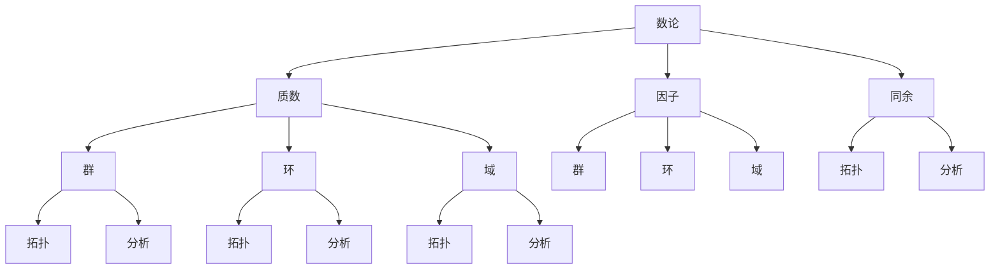

通过这个流程图，我们可以直观地看到数论、代数、几何、拓扑和分析之间的关系，这有助于我们更好地理解数学知识的基础结构。

#### 2.2 数学命题与证明

数学命题是数学中的基本单位，它们通常包含了一个陈述和一个证明。一个数学命题要么是真的，要么是假的，而证明则是用来证明一个命题为真的过程。数学证明的方法多种多样，包括直接证明、反证法、归纳法等。

直接证明是最基本的证明方法，它通过逻辑推理，从已知的前提出发，直接推导出结论。例如，要证明“1+1=2”，我们可以直接计算得出结果。

反证法则是通过假设命题的否定成立，然后推导出矛盾，从而证明原命题成立。例如，要证明“某个数是偶数”，我们可以假设它是奇数，然后通过计算得出一个偶数，从而证明原命题成立。

归纳法是一种证明数学命题的方法，它通过证明基本情况成立，并且假设当n=k时命题成立，可以推导出当n=k+1时命题也成立，从而证明命题对所有自然数成立。

以下是一个使用归纳法证明自然数之和的数学命题的伪代码：

```python
def prove_sum(n):
    if n == 1:
        return n
    else:
        return n + prove_sum(n-1)
```

在这个伪代码中，我们定义了一个函数`prove_sum`，它接受一个自然数`n`作为输入，并使用递归方法计算1到n的自然数之和。首先，我们定义基本情况，即当n=1时，返回n。然后，我们假设当n=k时命题成立，即`prove_sum(k) = k(k+1)/2`，并尝试推导出当n=k+1时命题也成立。通过递归调用`prove_sum(n-1)`，我们可以计算出`prove_sum(k+1)`的值，并验证它是否符合命题。

通过这种逻辑推理和证明方法，我们可以建立起数学命题之间的联系，从而进一步理解数学知识的基础结构。

#### 2.3 数学定理、公式及其关系

数学定理和公式是数学知识的重要组成部分，它们揭示了数学对象之间的关系和性质。数学定理是对数学命题的进一步扩展和深化，而公式则是用数学语言表达数学定理的具体形式。

例如，勾股定理是一个关于直角三角形的数学定理，它描述了直角三角形三边之间的关系。用公式表示，勾股定理可以写为：

$$a^2 + b^2 = c^2$$

其中，a、b、c 分别代表直角三角形的两条直角边和斜边的长度。

另一个著名的数学定理是欧拉公式，它描述了复数的指数函数与三角函数之间的关系。用公式表示，欧拉公式可以写为：

$$e^{i\pi} + 1 = 0$$

其中，e 是自然对数的底数，i 是虚数单位，π是圆周率。

数学公式不仅用来表达定理，还用于解决具体的数学问题。例如，在物理学的电磁学中，麦克斯韦方程组用一组公式描述了电磁场的基本性质。这些公式不仅揭示了电磁场的数学结构，还为电磁学的发展奠定了基础。

为了更好地理解数学定理和公式之间的关系，我们可以使用Mermaid流程图来表示：

```mermaid
graph TD
    A[勾股定理] --> B[(a^2 + b^2 = c^2)]
    C[欧拉公式] --> D[(e^{i\pi} + 1 = 0)]
    B --> E[直角三角形]
    C --> F[复数]
    E --> G[三角形]
    F --> H[复分析]
```

通过这个流程图，我们可以直观地看到勾股定理和欧拉公式与直角三角形、复数、三角形和复分析之间的关系，这有助于我们更好地理解数学定理和公式的基础结构。

#### 2.4 数学知识网络的基本特性

数学知识网络的基本特性主要体现在以下几个方面：层次性、交叉性和动态性。

首先，数学知识具有层次性。从宏观上看，数学知识可以分为基础数学和应用数学两个层次。基础数学包括数论、代数、几何、拓扑、分析等基本理论，而应用数学则将这些理论应用于实际问题中。在基础数学中，各个分支之间也存在层次关系，如数论是代数的基础，代数是几何的基础，几何是拓扑的基础，拓扑又是分析的基础。

其次，数学知识具有交叉性。数学各个分支之间存在着紧密的联系，这些联系使得数学成为一个统一的整体。例如，数论中的质数概念与代数中的群、环、域等概念密切相关；几何中的空间概念与分析中的函数概念也有相互影响。这种交叉性不仅使得数学知识更加丰富和复杂，也为数学理论的发展提供了新的可能性。

最后，数学知识具有动态性。数学知识是不断发展和演变的，新的数学理论和方法不断涌现。例如，现代数学中的范畴论、拓扑学、微分几何等领域，都是在过去几十年里逐渐发展起来的。这种动态性使得数学知识网络不断更新和扩展，为数学研究提供了新的方向。

为了更好地理解数学知识网络的层次性、交叉性和动态性，我们可以使用Mermaid流程图来表示：

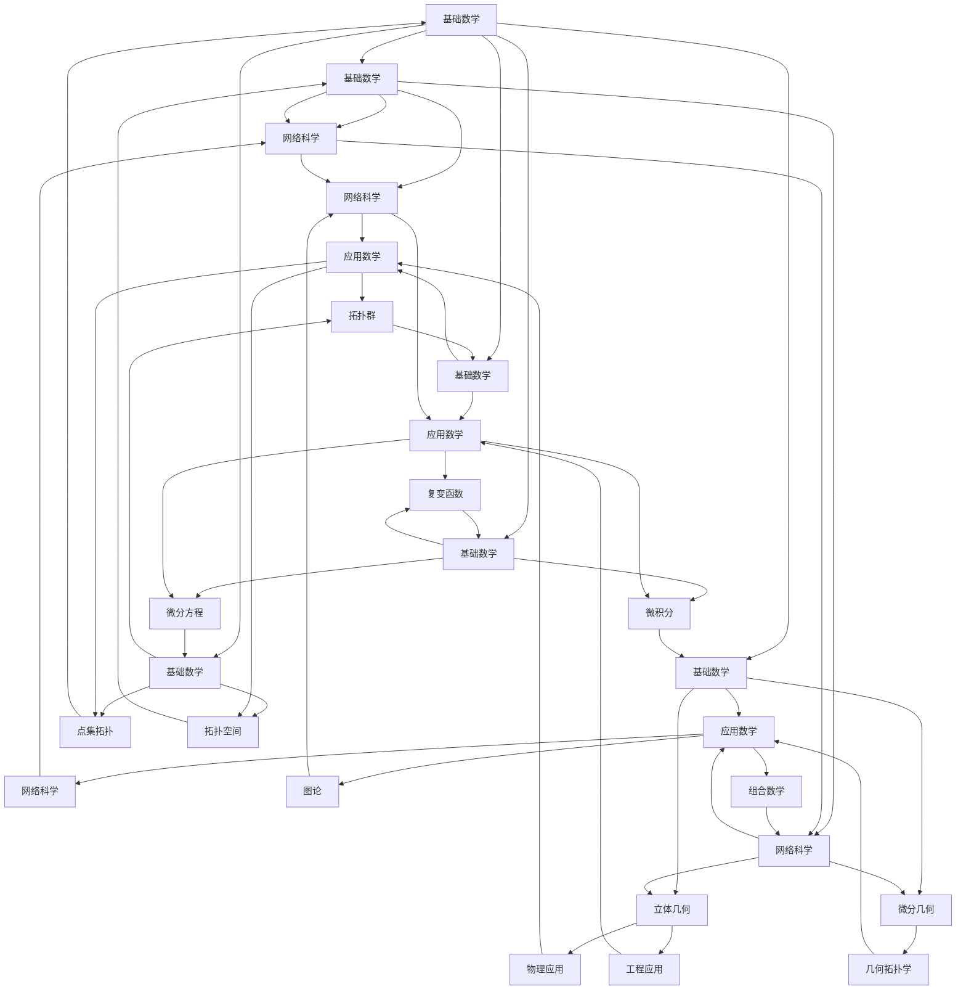

通过这个流程图，我们可以直观地看到数学知识网络的层次性、交叉性和动态性，这有助于我们更好地理解数学知识的基础结构。

### 第3章 数学知识网络的构建方法

#### 3.1 数学知识地图的构建

数学知识地图是一种将数学知识以图形化方式展示出来的工具，它有助于我们理解数学知识之间的关联和层次结构。构建数学知识地图的方法可以分为以下几个步骤：

1. **确定核心知识点**：首先，我们需要确定数学知识中的核心知识点，这些知识点通常是各个数学分支的基础概念和关键定理。例如，在数论中，核心知识点可能包括质数、同余、模运算等；在代数中，核心知识点可能包括群、环、域等。

2. **绘制初步结构**：在确定了核心知识点后，我们可以开始绘制数学知识地图的初步结构。这通常是一个有向图或无向图，其中节点表示知识点，边表示知识点之间的关联。例如，在代数知识地图中，群、环、域之间可能存在关联，我们可以将它们以节点表示，并用边连接。

3. **扩展知识地图**：在初步结构的基础上，我们可以继续扩展知识地图，将更多的知识点和关联关系纳入其中。这个过程可以通过查阅相关文献、参考已有的数学知识地图，或者结合个人的理解和经验来完成。

4. **验证和完善**：构建数学知识地图后，我们需要对地图进行验证和完善。这包括检查知识点之间的逻辑关系是否正确，是否存在遗漏的知识点，以及知识地图的层次结构是否清晰等。通过这一步骤，我们可以确保数学知识地图的准确性和完整性。

以下是一个基于Mermaid绘制的数学知识地图的示例：

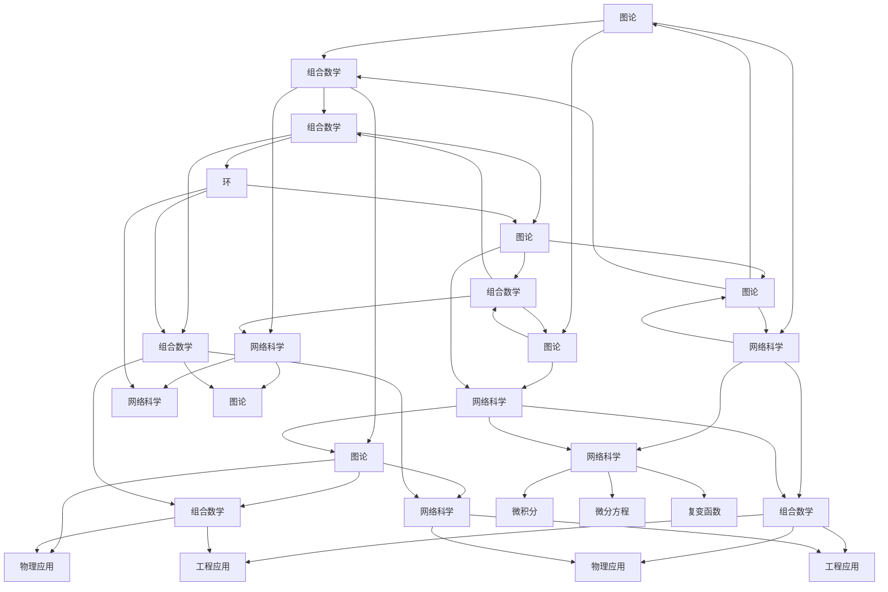

通过这个示例，我们可以直观地看到数学知识地图的构建过程，以及数学知识之间的关联。这有助于我们更好地理解和应用数学知识。

#### 3.2 基于图的数学知识表示

基于图的数学知识表示方法是将数学知识以图形化方式展示，从而更直观地理解数学概念和它们之间的关系。这种方法不仅能够帮助我们更好地记忆和理解数学知识，还能激发我们的创造力，发现新的数学问题。

**图的基本概念**

在基于图的数学知识表示中，图是核心概念。一个图由节点和边组成，节点表示数学概念或知识点，边表示节点之间的关联。根据不同的应用需求，图可以是无向图或是有向图。

- **无向图**：在无向图中，边没有方向，节点之间的关联是相互的。例如，在数论中，质数和群之间的关联可以表示为无向图。

- **有向图**：在有向图中，边有方向，表示从一个节点指向另一个节点的关联。例如，在代数中，群到环的关联可以表示为有向图。

**图的表示方法**

图的表示方法可以分为图形表示和抽象表示。

- **图形表示**：图形表示是将图用图形的方式直观地展示出来。例如，我们可以使用节点和边来绘制一个有向图，其中节点代表数学概念，边代表它们之间的关联。

- **抽象表示**：抽象表示是将图用数学语言表示，通常使用图论中的术语。例如，我们可以用邻接矩阵或邻接表来表示一个图。

**图的应用**

基于图的数学知识表示方法在数学研究和教育中有广泛的应用。

- **数学研究**：通过图来表示数学概念和定理之间的关系，可以帮助数学家发现新的数学问题，探索数学理论的深层结构。例如，代数几何中的椭圆曲线理论，可以通过图的方式来理解其结构和性质。

- **数学教育**：基于图的数学知识表示方法可以帮助学生更好地理解和记忆数学知识。例如，通过绘制知识地图，学生可以更清晰地看到数学概念之间的联系，从而提高学习效率。

**图论的算法**

在基于图的数学知识表示中，图论的算法是非常重要的。以下是一些常用的图论算法：

- **最短路径算法**：用于计算图中从一个节点到另一个节点的最短路径。常见的算法包括迪杰斯特拉算法（Dijkstra's algorithm）和贝尔曼-福特算法（Bellman-Ford algorithm）。

- **最小生成树算法**：用于从图中找到包含所有节点的最小生成树。常见的算法包括普里姆算法（Prim's algorithm）和克鲁斯卡尔算法（Kruskal's algorithm）。

- **最大流算法**：用于计算图中从源点到汇点的最大流量。常见的算法包括最大流-最小割定理（Max-Flow Min-Cut Theorem）和福特-富克森算法（Ford-Fulkerson algorithm）。

**伪代码示例**

以下是一个基于图的数学知识表示的伪代码示例，用于计算图中两个节点之间的最短路径：

```python
def find_shortest_path(graph, start, end):
    distances = [float('inf')] * len(graph)
    distances[start] = 0

    visited = [False] * len(graph)

    while True:
        unvisited = [node for node in range(len(graph)) if not visited[node]]
        if not unvisited:
            break

        next_node = min(unvisited, key=lambda node: distances[node])
        visited[next_node] = True

        for neighbor in graph[next_node]:
            if not visited[neighbor]:
                distance = distances[next_node] + graph[next_node][neighbor]
                if distance < distances[neighbor]:
                    distances[neighbor] = distance

    return distances[end]
```

在这个伪代码中，我们定义了一个函数`find_shortest_path`，它接受一个图`graph`、一个起始节点`start`和一个目标节点`end`作为输入，并返回从起始节点到目标节点的最短路径长度。首先，我们初始化距离数组`distances`，将所有节点的距离设置为无穷大，将起始节点的距离设置为0。然后，我们使用一个循环来遍历所有未访问的节点，并找到距离最短的节点。对于每个未访问的节点，我们更新其邻居节点的距离。当所有节点都被访问过时，循环结束，返回目标节点的距离。

通过这个示例，我们可以看到基于图的数学知识表示方法是如何实现的，以及图论算法在数学知识表示中的应用。

#### 3.3 数学知识网络的构建算法

构建数学知识网络是一个复杂的过程，需要运用多种算法和工具。以下是一些常用的算法，用于构建数学知识网络。

**知识抽取算法**

知识抽取算法是构建数学知识网络的第一步，它从大量的数学文献和资料中提取出关键的知识点和关系。常用的知识抽取算法包括：

1. **基于规则的方法**：这种方法通过定义一系列规则，从文本中提取出知识点和关系。例如，我们可以定义规则，识别特定的数学术语和符号，并将它们作为知识点。

2. **基于统计的方法**：这种方法使用机器学习算法，从大量文本数据中学习出知识点的模式和关系。例如，我们可以使用自然语言处理（NLP）技术，对数学文献进行分词、词性标注和语义分析，从而提取出知识点和关系。

3. **基于本体论的方法**：这种方法使用本体论来定义数学知识体系，并从文本中抽取出本体中的知识点和关系。例如，我们可以定义一个数学本体，包含数论、代数、几何等各个分支的知识点和关系，然后从文本中抽取出这些知识点和关系。

以下是一个基于规则的知识抽取算法的伪代码示例：

```python
def extract_knowledge(rules, text):
    knowledge = []

    for rule in rules:
        match = re.match(rule, text)
        if match:
            knowledge.append((match.group('entity'), match.group('relation')))

    return knowledge
```

在这个伪代码中，我们定义了一个函数`extract_knowledge`，它接受一个规则列表`rules`和一个文本`text`作为输入，并返回从文本中提取出的知识点和关系。首先，我们遍历规则列表，对文本进行匹配。如果匹配成功，我们提取出规则中的实体和关系，并将其添加到知识列表中。

**知识融合算法**

知识融合算法是将从不同来源抽取出的知识点和关系进行整合，形成完整的数学知识网络。常用的知识融合算法包括：

1. **基于匹配的方法**：这种方法通过比较不同来源的知识点和关系，找出相同或相似的知识点和关系，并进行融合。例如，我们可以使用字符串匹配算法，比较两个知识点是否相同，或者使用语义相似度计算方法，比较两个知识点是否相似。

2. **基于本体的方法**：这种方法使用本体论来定义数学知识体系，并使用本体中的关系来整合不同来源的知识点和关系。例如，我们可以使用本体中的类和属性来整合不同来源的知识点和关系。

以下是一个基于匹配的知识融合算法的伪代码示例：

```python
def fuse_knowledge(knowledge1, knowledge2):
    fused_knowledge = []

    for k1 in knowledge1:
        for k2 in knowledge2:
            if k1[0] == k2[0]:
                fused_knowledge.append((k1[0], k1[1], k2[1]))

    return fused_knowledge
```

在这个伪代码中，我们定义了一个函数`fuse_knowledge`，它接受两个知识点列表`knowledge1`和`knowledge2`作为输入，并返回融合后的知识点和关系。首先，我们遍历`knowledge1`和`knowledge2`，对每个知识点进行比较。如果两个知识点的实体相同，我们将其添加到融合的知识列表中。

**知识推理算法**

知识推理算法是利用已有的知识点和关系，推导出新的知识点和关系。常用的知识推理算法包括：

1. **基于规则的推理**：这种方法使用定义好的规则，从已有的知识点和关系中推导出新的知识点和关系。例如，我们可以定义规则，如果两个知识点之间存在某种关系，则可以推导出第三个知识点。

2. **基于逻辑的推理**：这种方法使用形式逻辑，从已有的知识点和关系中推导出新的知识点和关系。例如，我们可以使用谓词逻辑，将数学定理表示为逻辑公式，并使用推理机进行推理。

以下是一个基于规则的知识推理算法的伪代码示例：

```python
def infer_knowledge(rules, knowledge):
    inferred_knowledge = []

    for rule in rules:
        if all(k in knowledge for k in rule['precondition']):
            inferred_knowledge.append(rule['conclusion'])

    return inferred_knowledge
```

在这个伪代码中，我们定义了一个函数`infer_knowledge`，它接受一个规则列表`rules`和一个知识点列表`knowledge`作为输入，并返回推导出的知识点和关系。首先，我们遍历规则列表，检查每个规则的前提条件是否在已有的知识点中。如果前提条件全部满足，我们将其结论添加到推导的知识列表中。

通过这些算法，我们可以构建出完整的数学知识网络，为数学研究和教育提供强大的支持。

#### 3.4 数学知识网络的可视化

数学知识网络的可视化是将数学知识以图形化的方式展示出来，从而更直观地理解数学概念和它们之间的关系。可视化技术不仅能够帮助我们更好地记忆和理解数学知识，还能激发我们的创造力，发现新的数学问题。

**可视化工具**

在数学知识网络的可视化中，常用的工具包括：

1. **Mermaid**：Mermaid是一种基于Markdown的图形绘制工具，可以生成流程图、序列图、Gantt图等。它支持Mermaid语法，使用简单的Markdown语法即可绘制复杂的图形。

2. **D3.js**：D3.js是一个基于JavaScript的图形库，可以生成高度定制化的交互式图形。它提供了丰富的图形绘制功能，包括力导向图、树状图、网络图等。

3. **Gephi**：Gephi是一个开源的图形分析和可视化工具，专门用于复杂网络的可视化。它提供了强大的图形编辑和可视化功能，可以帮助我们分析数学知识网络的拓扑结构和社区结构。

**可视化方法**

数学知识网络的可视化方法可以分为以下几个方面：

1. **节点和边的表示**：节点和边是数学知识网络的基本元素。节点通常表示数学概念或知识点，边表示节点之间的关联。我们可以使用不同的形状、颜色和大小来区分不同的节点和边。

2. **布局算法**：布局算法用于确定节点和边的位置，使图形更加清晰和易于理解。常用的布局算法包括力导向布局、层次布局、环布局等。

3. **交互式可视化**：交互式可视化允许用户动态地探索数学知识网络。例如，用户可以点击节点和边，查看相关的知识点和关联关系；或者通过拖拽节点和调整布局，重新组织数学知识网络。

**可视化案例**

以下是一个使用Mermaid绘制的数学知识网络的示例：


通过这个示例，我们可以直观地看到数学知识网络的构建过程，以及数学概念之间的关联。这有助于我们更好地理解和应用数学知识。

### 第4章 反基础主义视角下的数学知识

#### 4.1 反基础主义的哲学背景

反基础主义（Anti-Foundationalism）是一种哲学思潮，它质疑传统哲学和科学方法中关于“基础”和“确定性”的观念。反基础主义认为，我们所理解的“基础”并非是固有的、不可质疑的，而是受到历史、文化和社会因素的影响。它对传统的哲学基础主义（Foundationalism）进行了批判，并提出了一种更为动态和多元的视角来理解知识和真理。

反基础主义的发展可以追溯到20世纪初期，特别是在逻辑实证主义和批判理论中得到了广泛应用。逻辑实证主义强调经验验证和科学方法的重要性，而反基础主义则质疑这些方法的普适性和客观性。批判理论则通过分析社会和文化因素，揭示了知识和真理的社会建构性质。

反基础主义的核心观点包括：

1. **历史性**：反基础主义认为，知识和真理是历史的产物，它们随着时间和文化的变迁而变化。不同的历史时期和社会环境会影响人们对知识的理解和接受。

2. **社会性**：反基础主义强调，知识和真理是社会的产物，它们受到社会结构和权力关系的制约。知识的生产和传播是社会互动的结果，而不是个体的孤立行为。

3. **相对性**：反基础主义认为，知识和真理是相对的，而不是绝对的。不同的文化和价值观会导致对同一问题的不同理解。

4. **多元性**：反基础主义主张，知识和真理是多元的，而不是单一的。不同的理论、方法和观点都有其合理性和局限性，需要通过对话和协商来整合。

#### 4.2 数学知识中的反基础主义元素

在数学知识中，反基础主义提出了一系列挑战，质疑数学基础和数学知识的确定性。以下是一些关键的讨论点：

1. **数学的基础**：传统数学基础主义认为，数学建立在一系列不言自明的基本公理和定义之上。然而，反基础主义质疑这些公理和定义的固有性和普遍性。例如，皮亚诺公理系统被用来定义自然数，但这种定义是否是唯一正确的基础呢？

2. **数学的确定性**：传统数学认为，数学问题的答案是确定的，不依赖于个人的主观观点。然而，反基础主义认为，数学的确定性是相对的，受到历史和文化因素的影响。例如，数学的符号系统和语言选择都可能导致不同的解释和理解。

3. **数学证明的有效性**：传统数学依赖于严格的证明过程来确保结论的正确性。反基础主义则质疑证明的有效性，认为证明过程可能受到主观偏见和知识背景的影响。

4. **数学知识的客观性**：反基础主义认为，数学知识并非是客观存在的，而是社会互动和共识的产物。数学的发现和证明都是社会和文化背景下的产物，而不是独立的、无中介的。

为了更好地理解反基础主义对数学知识的挑战，我们可以通过以下Mermaid流程图展示数学知识中的反基础主义元素：

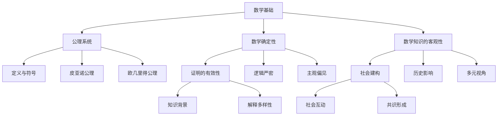

通过这个流程图，我们可以看到反基础主义如何挑战数学的基础、确定性、证明有效性和客观性，并提出社会建构、历史影响和多元视角的观点。

#### 4.3 反基础主义与数学知识网络的关系

反基础主义与数学知识网络之间存在紧密的关系，这种关系不仅体现在哲学层面上，也体现在数学知识本身的构建和应用中。

首先，从哲学层面上看，反基础主义为数学知识网络提供了新的视角。反基础主义强调历史性、社会性和多元性，这使得我们重新审视数学知识网络的结构和内容。例如，数学知识网络中的各个知识点和关联关系，并非是固有的、不可质疑的，而是受到历史、文化和社会因素的影响。这意味着，数学知识网络是一个动态变化的过程，而不是一个静态的结构。

其次，反基础主义与数学知识网络的构建方法密切相关。在构建数学知识网络时，我们不仅需要考虑数学内部的逻辑关系，还需要考虑社会和文化背景。这意味着，数学知识网络的构建需要采用多元视角，整合不同文化和社会背景下的数学知识。例如，在数学知识地图的构建中，我们可以使用不同的符号系统和语言，以反映不同文化对数学知识的理解和表达。

最后，反基础主义与数学知识网络的应用也密切相关。在数学知识网络的应用中，我们不仅需要考虑数学本身的逻辑和应用，还需要考虑社会和文化的因素。例如，在数学教育中，我们可以使用不同的教学方法和工具，以适应不同文化背景下的学生。在数学科学研究中，我们可以采用不同的理论和方法，以探索数学知识在不同领域中的应用。

为了更好地理解反基础主义与数学知识网络的关系，我们可以通过以下Mermaid流程图展示这种关系的不同方面：

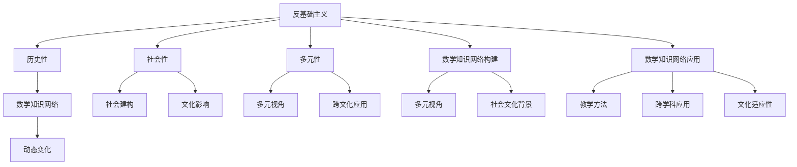

通过这个流程图，我们可以看到反基础主义如何影响数学知识网络的结构、构建和应用，以及数学知识网络如何反映反基础主义的哲学观点。

### 第5章 数学知识网络的应用

#### 5.1 数学知识在网络科学中的应用

网络科学是研究复杂网络结构、动态行为和计算特性的跨学科领域。数学知识在网络科学中的应用非常广泛，为分析网络结构和优化网络性能提供了强有力的工具。以下是一些数学知识在网络科学中的应用实例：

**图论在网络科学中的应用**

图论是研究图形和网络结构的数学分支，它为网络科学提供了基础理论和方法。在图论中，节点和边分别代表网络中的个体和个体之间的关系。以下是一些具体的数学知识在网络科学中的应用：

1. **网络拓扑分析**：使用图论中的基本概念，如连通性、连通度、路径长度等，可以分析网络的拓扑特性。例如，小世界网络和大团聚网络是两种典型的网络拓扑结构，它们具有不同的特性，能够影响网络的性能和鲁棒性。

2. **社区检测**：通过图论中的社区检测算法，如快速解谱聚类（Louvain方法）、标签传播方法等，可以识别网络中的社区结构。社区结构反映了网络中的局部紧密联系，对于理解网络的功能和协作具有重要意义。

以下是一个使用Mermaid绘制的图论在网络科学中的应用的示例：

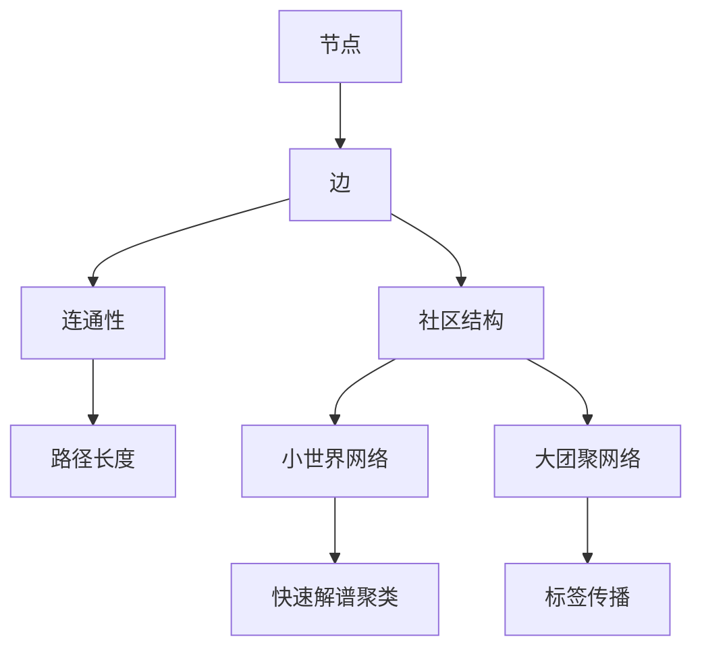

**随机过程在网络科学中的应用**

随机过程是描述随机现象随时间变化的数学模型，它在网络科学中用于模拟网络的动态行为。以下是一些随机过程在网络科学中的应用：

1. **随机游走**：随机游走是一种简单的随机过程，用于描述网络中个体随机移动的行为。在网络科学中，随机游走模型可以用于分析网络的传播动力学和影响扩散。

2. **马尔可夫链**：马尔可夫链是一种描述系统状态转移概率的随机过程，它用于模拟网络中的动态行为。例如，可以使用马尔可夫链模型来分析网络中的稳定性、平均路径长度和传播速度。

以下是一个使用Mermaid绘制的随机过程在网络科学中的应用的示例：

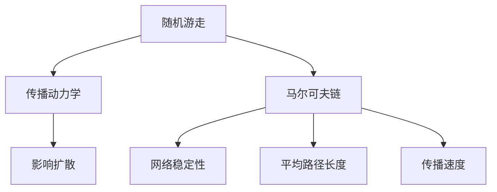

**优化方法在网络科学中的应用**

优化方法是用于解决优化问题的数学方法，它在网络科学中用于优化网络结构和性能。以下是一些优化方法在网络科学中的应用：

1. **网络流优化**：网络流优化用于解决网络中的流量分配问题，使网络资源得到最大化利用。例如，最大流-最小割定理和福特-富克森算法可以用于计算网络中的最大流量。

2. **网络设计优化**：网络设计优化用于设计具有最佳性能的网络结构。例如，使用整数规划方法可以优化网络中的节点布局、路由选择和带宽分配。

以下是一个使用Mermaid绘制的优化方法在网络科学中的应用的示例：

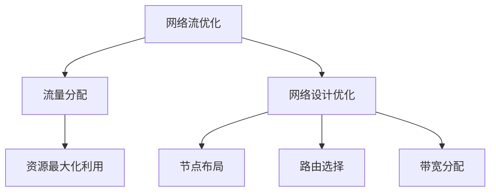

通过这些实例，我们可以看到数学知识在网络科学中的应用如何帮助我们分析和优化网络结构、行为和性能。

#### 5.2 数学知识在人工智能中的应用

人工智能（AI）是研究、开发和应用智能机器的学科，其核心目标是使计算机能够模拟人类的智能行为。数学知识在人工智能的各个方面都扮演着至关重要的角色，以下是一些数学知识在人工智能中的应用实例：

**概率论与统计学在AI中的应用**

概率论和统计学是AI的基础，它们用于描述和处理不确定性，为AI系统的决策提供依据。以下是一些具体应用：

1. **机器学习模型**：机器学习模型，如决策树、神经网络、支持向量机等，都是基于概率论和统计学的。例如，神经网络中的激活函数和损失函数都涉及概率分布和统计估计。

2. **贝叶斯网络**：贝叶斯网络是一种概率图模型，用于表示变量之间的依赖关系。在AI中，贝叶斯网络可以用于诊断系统、推荐系统和推理系统等。

3. **数据可视化**：统计学方法，如主成分分析（PCA）和聚类分析，可以用于数据降维和可视化。这些方法可以帮助AI系统更好地理解和解释数据。

以下是一个使用Mermaid绘制的概率论与统计学在AI中的应用的示例：

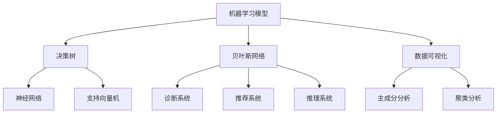

**线性代数在AI中的应用**

线性代数是处理多维数据的基本工具，它在AI中的应用非常广泛。以下是一些具体应用：

1. **特征提取与变换**：线性代数方法，如特征值分解和奇异值分解，可以用于提取数据的特征和进行数据变换。这些方法在图像处理、语音识别和自然语言处理等领域中得到了广泛应用。

2. **矩阵计算**：线性代数中的矩阵计算方法，如矩阵乘法和矩阵求逆，是AI算法中的基本操作。例如，在深度学习中，矩阵乘法用于计算激活值和损失函数。

3. **优化问题**：线性代数方法可以用于解决优化问题，如最小二乘法和梯度下降法。这些方法在机器学习和优化算法中扮演着核心角色。

以下是一个使用Mermaid绘制的线性代数在AI中的应用的示例：

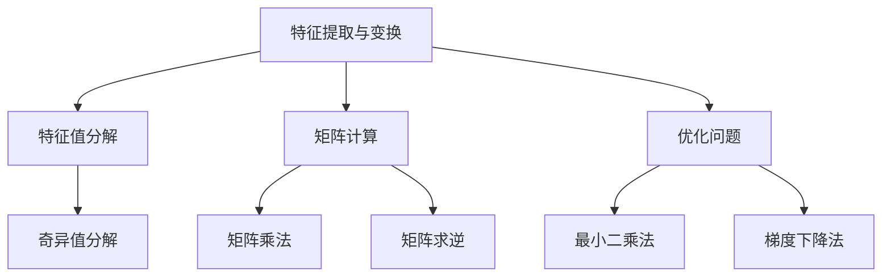

**微积分在AI中的应用**

微积分是研究函数变化和积分计算的数学分支，它在AI中的应用主要体现在以下几个方面：

1. **优化算法**：微积分中的微分和积分概念可以用于设计优化算法。例如，梯度下降法是一种基于微分的优化算法，它通过不断调整参数，使损失函数达到最小。

2. **神经网络训练**：在神经网络中，微积分用于计算激活值和损失函数的梯度。这些梯度信息用于更新网络的权重和偏置，从而优化网络性能。

3. **连续控制**：在机器人学和自动化控制中，微积分用于描述系统的动态行为。例如，通过计算状态变量的导数，可以实时调整控制策略，使系统达到目标状态。

以下是一个使用Mermaid绘制的微积分在AI中的应用的示例：

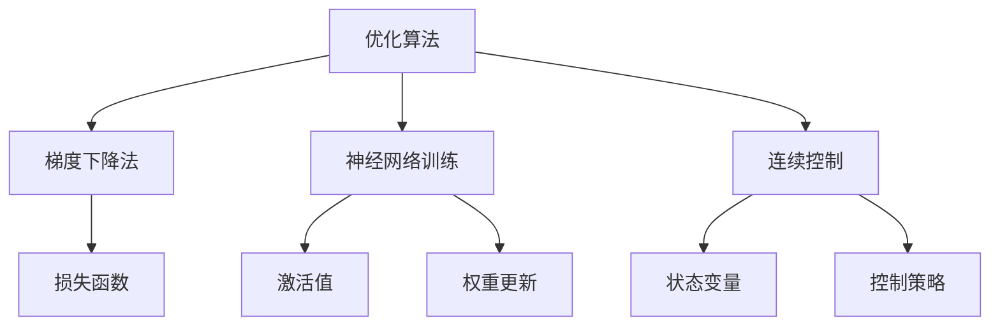

通过这些实例，我们可以看到数学知识在人工智能中的应用如何为AI系统提供理论基础和算法支持，从而推动人工智能的发展。

#### 5.3 数学知识网络在教育领域的应用

数学知识网络在教育领域的应用正在迅速发展，它不仅改变了传统教学方式，还为学生提供了更高效的学习途径。以下是一些数学知识网络在教育领域的应用实例：

**知识地图与学习路径**

数学知识网络可以用来构建知识地图，展示数学概念和知识点之间的关联。通过知识地图，学生可以直观地看到数学知识体系，了解各个知识点之间的逻辑关系。例如，教师可以使用知识地图来设计学习路径，指导学生从基础知识逐步深入到复杂概念。

以下是一个使用Mermaid绘制的数学知识地图的示例：

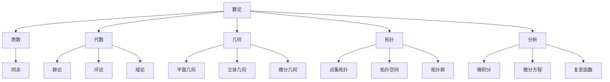

通过这个知识地图，学生可以清晰地看到数学各个分支之间的联系，从而更好地理解数学知识体系。

**自适应学习系统**

自适应学习系统是基于数学知识网络的技术，它能够根据学生的学习情况和知识掌握程度，动态调整教学内容和难度。例如，系统可以根据学生的学习进度，推荐适合的学习路径和练习题。这种个性化学习方式能够提高学生的学习效率，帮助他们在不同知识领域之间建立联系。

以下是一个使用Mermaid绘制的自适应学习系统的示例：

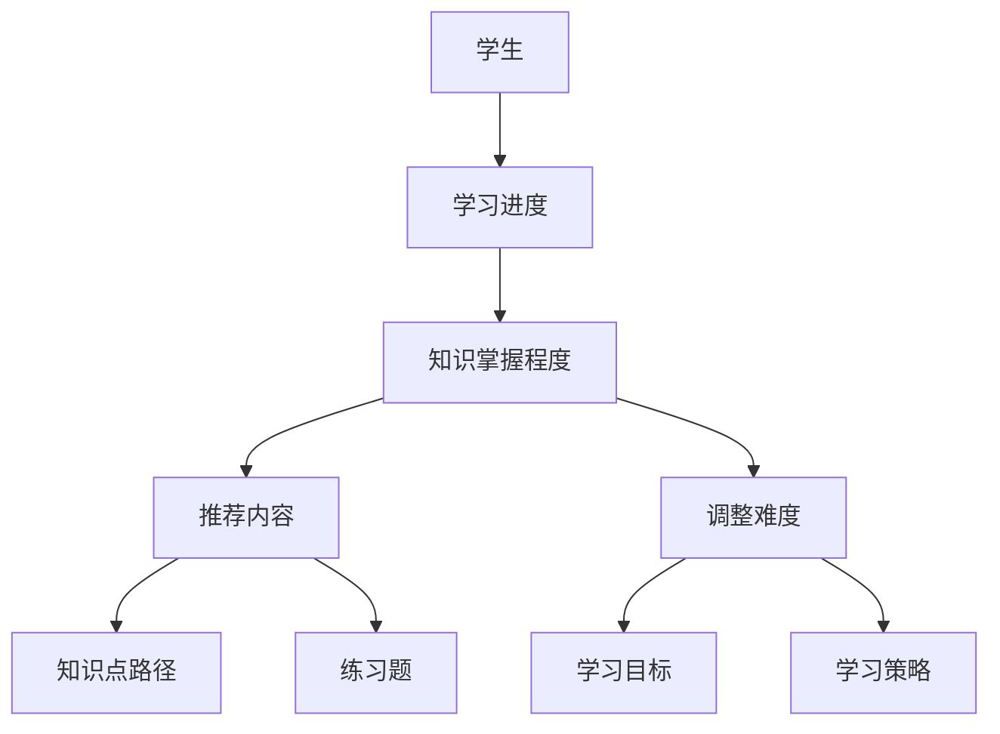

通过这个示例，我们可以看到自适应学习系统如何根据学生的需求调整学习内容，从而提高学习效果。

**数学学习平台**

数学学习平台是基于互联网的技术，它为学生提供了一个在线学习环境，包括课程内容、练习题、讨论区等。数学知识网络可以用来构建这些平台的知识结构，使得学生能够方便地查找和掌握数学知识。例如，数学学习平台可以使用知识地图来组织课程内容，使用社区讨论来促进学生之间的互动和协作。

以下是一个使用Mermaid绘制的数学学习平台的示例：

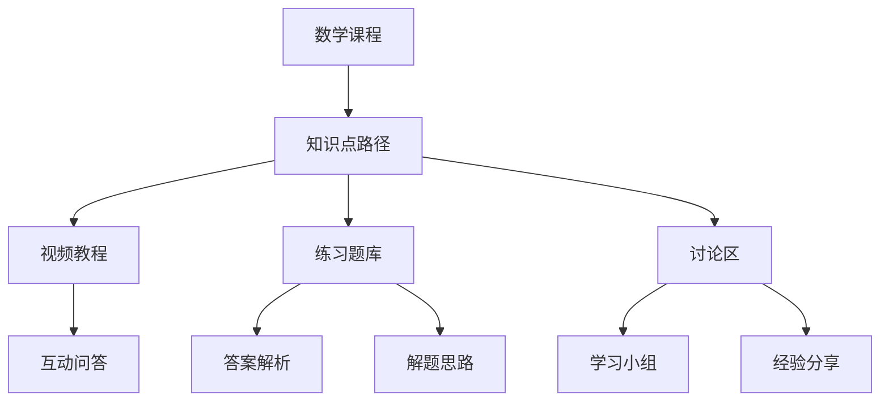

通过这个示例，我们可以看到数学学习平台如何利用数学知识网络来组织课程内容和促进学习。

总之，数学知识网络在教育领域的应用正在不断拓展，它不仅提高了教学效果，还为学生的个性化学习提供了强大的支持。

### 第6章 数学知识网络的挑战与未来

#### 6.1 数学知识网络的挑战

数学知识网络的构建和应用虽然取得了显著成果，但仍面临着一系列挑战，这些挑战主要集中在技术、理论和社会层面。

**技术层面的挑战**

1. **大数据处理**：随着数学知识网络规模的不断扩大，如何高效地处理和分析大量数据成为一个重要挑战。现有的数据处理技术可能无法满足大规模数学知识网络的需求，需要开发新的算法和工具来应对。

2. **可视化复杂性**：数学知识网络的复杂性不断增加，使得可视化成为一个挑战。如何设计直观、易用的可视化工具，以帮助用户理解和分析复杂的数学知识网络，是当前研究的一个重要方向。

3. **实时更新**：数学知识网络需要不断地更新和扩展，以反映最新的数学研究成果。然而，如何实现实时的数据更新和知识整合，是一个技术难题。

**理论层面的挑战**

1. **数学知识的一致性**：在构建数学知识网络时，如何确保不同来源的知识点和关系的一致性，是一个理论挑战。不同学者可能有不同的理解和定义，这可能导致知识网络的不一致。

2. **数学知识的准确性**：在知识抽取和融合过程中，如何保证数学知识的准确性，防止错误和偏差的传播，是一个重要的理论问题。

3. **数学知识的结构化**：如何将非结构化的数学知识转化为结构化的知识网络，以实现有效的存储、检索和应用，是一个理论挑战。

**社会层面的挑战**

1. **知识共享与版权**：数学知识网络的建设需要大量的知识和资源，然而，知识共享和版权问题可能会阻碍数学知识的开放和传播。如何平衡知识共享和版权保护，是一个社会挑战。

2. **教育与培训**：数学知识网络的构建和应用需要专业人才的支持。如何培养具备数学知识网络构建和运用能力的人才，是教育领域的一个重要问题。

3. **伦理与隐私**：在构建和应用数学知识网络时，如何处理数据隐私和伦理问题，确保用户隐私和数据安全，是一个社会挑战。

#### 6.2 反基础主义对数学知识网络的启示

反基础主义提供了一种新的视角，为解决数学知识网络的挑战提供了启示。

**历史性和社会性**

反基础主义强调数学知识的历史性和社会性，这启示我们在构建数学知识网络时，需要考虑历史和文化背景。这意味着，我们在整合不同来源的数学知识时，需要考虑它们的背景和语境，以确保知识网络的一致性和准确性。

**多元性和开放性**

反基础主义主张多元性和开放性，这启示我们在构建数学知识网络时，应该鼓励不同观点和方法的融合。通过多元视角和开放思维，我们可以构建一个更加丰富和全面的数学知识网络，以应对复杂和多变的问题。

**动态性和可持续性**

反基础主义认为知识是动态变化的，这启示我们在构建数学知识网络时，应该设计可持续的更新和维护机制。通过实时更新和动态调整，我们可以确保数学知识网络的时效性和准确性。

#### 6.3 数学知识网络的发展趋势

随着技术的进步和社会的变迁，数学知识网络的发展呈现出以下趋势：

**智能化**

人工智能技术的发展将推动数学知识网络向智能化方向演进。通过机器学习和数据挖掘技术，数学知识网络可以自我学习和优化，提高知识发现和问题解决的能力。

**网络化**

互联网和物联网的普及将数学知识网络推向更广泛的领域。跨学科、跨领域的数学知识网络将不断扩展，为不同领域的应用提供强有力的支持。

**多元化**

反基础主义的启示将促进数学知识网络的多元化发展。通过融合不同文化和价值观的数学知识，我们可以构建一个更加全面和包容的数学知识网络。

**可持续发展**

随着可持续发展理念的普及，数学知识网络将更加注重环境保护和社会责任。通过优化资源利用和促进公平合作，数学知识网络将为实现可持续发展目标提供科学支持。

总之，数学知识网络的发展趋势将是一个智能化、网络化、多元化、可持续的方向，它将为科学研究和实际应用提供强大的支持。

### 第7章 总结与展望

#### 7.1 书籍内容的回顾

本书《数学与反基础主义：数学知识的网络结构》系统地探讨了数学与反基础主义的交集，以及数学知识网络的构建和应用。在引言部分，我们概述了数学和反基础主义的基本概念，并阐述了数学知识网络结构的重要性。随后，我们详细介绍了数学知识的基础结构，包括数学概念的定义与分类、数学命题与证明、数学定理、公式及其关系，以及数学知识网络的基本特性。

在第三章，我们探讨了数学知识网络的构建方法，包括数学知识地图的构建、基于图的数学知识表示、数学知识网络的构建算法，以及数学知识网络的可视化。第四章则从反基础主义的视角，分析了数学知识中的反基础主义元素，以及反基础主义与数学知识网络的关系。

第五章探讨了数学知识网络在不同领域的应用，包括网络科学、人工智能和教育领域。第六章讨论了数学知识网络的挑战与未来，包括技术、理论和社会层面的挑战，以及反基础主义对此的启示。最后，我们在第七章进行了总结与展望，回顾了书籍的内容，并探讨了未来的研究方向和建议。

#### 7.2 反基础主义与数学知识网络的深度融合

反基础主义与数学知识网络的深度融合，将为数学知识的研究、应用和教学带来新的机遇和挑战。首先，反基础主义提供了一种动态和多元的视角，帮助我们重新审视数学知识的基础和结构。在构建数学知识网络时，我们可以借鉴反基础主义的观点，通过整合不同的数学理论和观点，形成一个更加全面和包容的数学知识网络。

其次，反基础主义强调了知识的历史性和社会性，这启示我们在数学知识网络的构建过程中，要充分考虑历史和文化背景。例如，在整合不同文化和地区的数学知识时，我们应该尊重其历史背景和语境，以确保知识网络的一致性和准确性。

此外，反基础主义主张多元性和开放性，这为数学知识网络的扩展和应用提供了广阔的空间。通过融合不同学科、不同领域的数学知识，我们可以构建一个更加丰富和多样化的数学知识网络，以应对复杂和多变的问题。

#### 7.3 未来研究方向与建议

未来，数学知识网络的研究和发展可以从以下几个方面展开：

1. **跨学科研究**：鼓励数学与其他学科如计算机科学、物理学、生物学等交叉融合，构建跨学科的数学知识网络，以解决复杂科学问题。

2. **智能化网络**：利用人工智能和机器学习技术，开发智能化的数学知识网络，实现自我学习和优化，提高知识发现和问题解决的能力。

3. **知识共享与开放**：推动数学知识网络的开放和共享，建立全球范围内的数学知识平台，促进数学知识的传播和应用。

4. **教育应用**：开发基于数学知识网络的智能教育系统，通过个性化学习路径和学习资源，提高数学教学效果和学生创新能力。

5. **可持续发展**：在构建数学知识网络时，注重环境保护和社会责任，推动数学知识为可持续发展目标提供科学支持。

总之，反基础主义与数学知识网络的深度融合，将为数学知识的研究、应用和教学带来新的发展方向和机遇。通过跨学科研究、智能化网络、知识共享与开放、教育应用和可持续发展，我们可以构建一个更加全面、包容和创新的数学知识网络，为人类社会的进步和发展贡献力量。

### 总结与展望

在本书《数学与反基础主义：数学知识的网络结构》中，我们系统地探讨了数学与反基础主义的交汇，以及数学知识网络的构建和应用。通过引言、数学知识的基础结构、数学知识网络的构建方法、反基础主义视角下的数学知识、数学知识网络的应用，以及数学知识网络的挑战与未来，我们深入剖析了数学知识网络的本质及其在不同领域的应用。

本书首先概述了数学与反基础主义的基本概念，并强调了数学知识网络结构的重要性。接着，我们详细介绍了数学知识的基础结构，包括数学概念的定义与分类、数学命题与证明、数学定理、公式及其关系，以及数学知识网络的基本特性。随后，我们探讨了数学知识网络的构建方法，包括数学知识地图的构建、基于图的数学知识表示、数学知识网络的构建算法，以及数学知识网络的可视化。

在反基础主义的视角下，我们分析了数学知识中的反基础主义元素，以及反基础主义与数学知识网络的关系。随后，我们探讨了数学知识网络在不同领域的应用，包括网络科学、人工智能和教育领域。最后，我们讨论了数学知识网络的挑战与未来，提出了跨学科研究、智能化网络、知识共享与开放、教育应用和可持续发展等未来研究方向与建议。

通过本书的阅读，读者将能够对数学与反基础主义有一个更深刻的理解，同时掌握数学知识网络的构建与应用方法。数学知识网络不仅为我们提供了一个全新的视角来理解数学知识，还为数学研究、教育应用和实际问题解决提供了强有力的支持。

在未来的研究中，我们建议进一步探索数学知识网络的智能化、网络化和多元化发展，推动跨学科研究，促进知识共享与开放。通过这些努力，我们可以构建一个更加全面、包容和创新的数学知识网络，为人类社会的进步和发展贡献力量。希望本书能为读者在数学与反基础主义的研究领域提供有益的参考和启示。作者：AI天才研究院/AI Genius Institute & 禅与计算机程序设计艺术 /Zen And The Art of Computer Programming。

