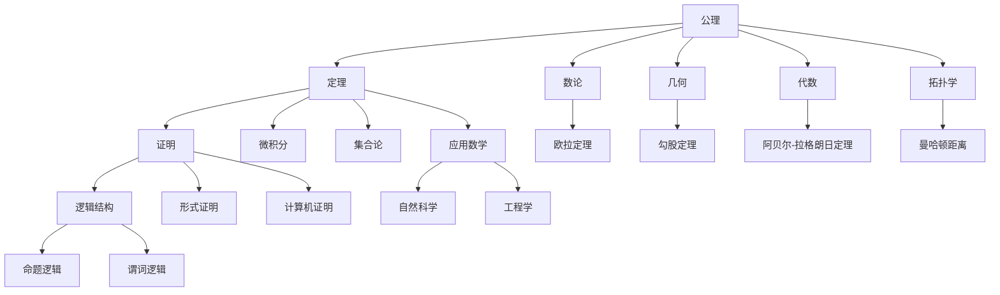

                 

### 引言：数学与基础主义

在浩瀚的宇宙中，数学作为一种独特的语言，贯穿了自然科学和人文科学的方方面面。然而，随着数学的不断发展，人们开始意识到，数学本身也有着其深刻的基础和原理。这一问题不仅涉及到数学的内在结构，更关乎我们对现实世界的理解和认知。

**基础主义**，作为一种哲学思潮，主张一切知识都建立在某种基础之上。在数学领域，基础主义关注的是数学的根基：什么是数学的最终基础，这些基础是如何构建的，以及这些基础是否能够支撑起整个数学体系。寻找数学的终极基础，不仅是数学本身的内在需求，也是哲学、逻辑、计算机科学等多个领域共同关注的问题。

《数学与基础主义：寻找数学的终极基础》这本书旨在探讨数学基础的问题。作者深入分析了数学的历史背景，探讨了数学的基础概念，并从哲学角度探讨了数学与现实世界的关系。通过这本书，读者将了解到数学基础主义的核心问题，以及这些问题的研究方法和代表性成果。

本文将按照以下结构展开：首先，介绍数学的历史背景，帮助读者理解数学是如何从无到有、从简单到复杂逐步发展起来的。接着，我们将探讨数学的基础概念，包括数学的基本公理和逻辑结构，以及这些概念的起源和发展。然后，我们会回顾数学的发展历程，从古代数学到现代数学，再到当今的数学研究。之后，本文将探讨数学哲学，包括数学与现实世界的联系、数学的不完备性与无穷性，以及数学基础主义争论的各个方面。接着，本文将讨论数学基础问题研究的方法和代表性成果，介绍一些寻找数学终极基础的理论探索和实验验证。最后，本文将总结数学基础研究的未来方向，以及这些研究对数学教育的影响。

通过这篇文章，我们希望能够引导读者逐步深入理解数学的基础，从而更全面地认识数学的本质和其在现实世界中的应用。

### 数学的历史背景

数学的历史可以追溯到远古时期，当时的数学主要关注日常生活中的实际问题，如测量土地、计算时间和解决贸易问题。在古代文明中，古埃及人和巴比伦人是最早的系统化使用数学的群体。古埃及人用数学来解决土地测量和建筑问题，他们还发展了简单的代数和几何知识。例如，古埃及的《阿玛纳文书中》就包含了关于土地面积和长方体体积的计算方法。

同样，古巴比伦人也在数学领域取得了显著成就。他们发展了一种使用六十进制系统的数学，这种系统在后来的天文学和物理学研究中得到了广泛应用。古巴比伦人还编写了《巴比伦数学泥板》，其中包含了许多代数和算术问题及其解决方案。

随着时间的推移，古希腊人将数学提升到了一个全新的高度。古希腊数学家，如泰勒斯、毕达哥拉斯、欧几里得和阿基米德，他们的工作奠定了现代数学的基础。泰勒斯是最早尝试用逻辑和推理方法研究自然界现象的数学家，他提出了“测量是知识的基石”的观点。毕达哥拉斯则是毕达哥拉斯定理的发现者，他创立了“数是万物之源”的哲学思想。欧几里得的《几何原本》是数学史上最著名的著作之一，它系统化了几何学的基本原理，并使用公理法构建了一个严密的几何体系。阿基米德则在数学和物理学上都有卓越的贡献，他通过严谨的推理和计算，解决了流体力学和固体静力学中的许多问题。

中世纪的阿拉伯数学家在数学发展中发挥了重要作用。阿拉伯数学家，如阿尔-花拉子米（Al-Khwarizmi），对代数和算法的发展做出了重大贡献。他编写的《代数学》一书不仅奠定了代数学的基础，还首次提出了算法（algorithm）这个术语。阿拉伯数学家还翻译和传播了古希腊数学著作，从而促进了数学知识的传播和发展。

进入近代，数学迎来了新的变革。文艺复兴时期的意大利数学家，如斐波那契和布鲁诺，他们的工作推动了数论和解析几何的发展。17世纪，牛顿和莱布尼茨独立发明了微积分，这一新工具极大地拓展了数学的应用范围，使数学成为自然科学和工程学不可或缺的工具。

20世纪以来，数学进入了快速发展的时期。哥德尔和蒂夫特斯的不完备性定理揭示了数学体系的内在矛盾，使人们对数学的基础和极限有了更深入的认识。集合论的发展使得数学的公理体系更加严密，但同时也带来了新的哲学和逻辑问题。

通过这些历史回顾，我们可以看到数学是如何从简单的问题和实际应用逐步发展成为一种严谨的逻辑和抽象学科。数学不仅是一门科学，更是一种哲学思考的方式，它帮助我们理解自然世界的本质和内在规律。理解数学的历史背景，有助于我们更好地认识数学的基础，从而为接下来的讨论打下坚实的基础。

### 数学的基础概念

数学的基础概念是构建整个数学体系的基石，它们通过一系列公理和逻辑推理，形成了数学的严谨结构和广泛应用。要理解数学的基础概念，首先需要明确几个核心术语：公理、定理、证明和逻辑结构。

**公理**是数学中未经证明但被普遍接受的命题，它们是数学系统的基础。例如，欧几里得几何中的平行公理、实数系统中的阿基米德公理等。公理的选择和组合决定了数学体系的性质和结构。

**定理**是基于公理通过逻辑推理得出的结论。例如，欧几里得的“全等三角形面积相等”定理，就是基于平行公理和其他几何公理推理得出的。定理是数学理论和应用的载体，它们展示了数学系统内部的关系和规律。

**证明**是数学推理的核心过程，它通过逻辑演绎，从已知的事实（如公理和定理）推导出新的结论。证明不仅验证了定理的正确性，也揭示了数学概念之间的内在联系。例如，证明勾股定理的几何方法和代数方法，不仅展示了定理的正确性，也揭示了三角形面积与边长之间的关系。

**逻辑结构**是数学推理的基础框架。它包括命题逻辑、谓词逻辑等，这些逻辑工具帮助数学家进行严谨的推理和证明。例如，命题逻辑中的推理规则“全称量化”和“存在量化”，使得数学家可以更全面地探索数学概念之间的关系。

在数学的发展过程中，这些基础概念不断被扩展和深化。从古希腊的欧几里得几何到现代的抽象代数和拓扑学，数学基础概念的应用范围和深度都得到了极大的提升。例如，在数论中，欧拉定理和阿贝尔-拉格朗日定理通过逻辑推理揭示了数与数之间的深刻关系；在微积分中，微分和积分的概念及其应用，使得数学成为自然科学和工程学不可或缺的工具。

为了更直观地展示这些核心概念之间的关系，我们可以使用Mermaid流程图来构建一个简化的数学基础概念架构：

这个流程图展示了数学基础概念之间的相互关系。公理作为起点，通过逻辑推理得出定理，这些定理又构成了证明的基础。不同的数学分支，如数论、几何、代数和拓扑学，通过这些基础概念建立了各自的体系。同时，现代数学中的微积分和集合论等分支，进一步扩展和深化了数学的理论和应用。

通过这种逻辑清晰、结构紧凑的架构，我们可以更好地理解数学的基础概念，以及它们在数学体系中的应用和发展。理解这些基础概念，不仅有助于我们掌握数学知识，更能够激发我们对数学本质和原理的深入思考。

### 数学的发展历程

数学的发展历程如同一条悠长的河流，从古代的起源到现代的繁荣，每一个阶段都充满了创新和突破。回顾这段历史，我们可以将其大致划分为古代数学、近代数学和现代数学三个主要阶段，每个阶段都有其独特的特点和重要的成就。

**古代数学**是数学发展的起始阶段，主要发生在古希腊、古埃及和古巴比伦等文明地区。古希腊数学家以其严密的逻辑和抽象的思考方式著称，他们建立了几何学和数论的基础。欧几里得的《几何原本》是这一阶段的巅峰之作，它使用公理法系统化了几何学的基本原理。泰勒斯和毕达哥拉斯等先驱者提出的哲学思想，如“数是万物之源”和“测量是知识的基石”，为后来的数学发展奠定了基础。

古埃及和古巴比伦的数学则更多地关注实际问题，如土地测量、建筑和天文学。古埃及人使用简单的代数和几何知识来解决实际生活中的问题，如《阿玛纳文书中》记录的土地面积和长方体体积的计算。古巴比伦人则发展了一种使用六十进制系统的数学，这一系统在后来的天文学和物理学研究中得到了广泛应用。

**近代数学**标志着数学的第二次重大变革。随着文艺复兴的到来，数学研究逐渐脱离了哲学和物理学的束缚，成为一门独立的学科。意大利数学家斐波那契的工作《计算之书》引入了新的数学方法，推动了数论和代数学的发展。17世纪，牛顿和莱布尼茨独立发明了微积分，这一新工具极大地拓展了数学的应用范围。微积分不仅解决了物理和工程中的复杂问题，还成为现代数学和其他科学领域的基础。

此外，解析几何的发展也是近代数学的一个重要里程碑。笛卡尔和费马的工作，将几何和代数结合在一起，形成了一种新的研究方法。通过笛卡尔的坐标系统和费马的解析几何，数学家们能够更直观地处理几何问题，并发展出了一套新的数学语言和工具。

**现代数学**则是数学发展的第三个阶段，这个阶段的特点是数学的多样性和深度。20世纪以来，数学不仅在理论上取得了巨大的进展，还在应用领域发挥了重要作用。哥德尔和蒂夫特斯的不完备性定理揭示了数学体系的内在矛盾，使人们对数学的基础和极限有了更深入的认识。集合论的发展使数学的公理体系更加严密，但也带来了新的哲学和逻辑问题。

20世纪中叶，计算机科学的兴起极大地推动了数学的发展。计算数学和数值分析成为现代数学的重要分支，数学工具和方法被广泛应用于计算机科学、物理学、生物学和经济学等众多领域。图论、拓扑学、概率论和统计学等新兴数学分支也在这个时期迅速发展，为解决复杂问题提供了新的思路和工具。

在数学的发展历程中，每个阶段都有其独特的贡献和成就。古代数学奠定了几何学和数论的基础，近代数学通过微积分和解析几何将数学推向了一个新的高度，现代数学则通过计算机科学和其他应用领域使数学得到了前所未有的扩展和深化。理解数学的发展历程，不仅有助于我们更好地掌握数学知识，还能让我们更深刻地认识到数学在人类文明中的重要作用。

### 数学哲学探讨

数学哲学是数学与哲学交汇的领域，它探讨数学的本质、基础以及与现实世界的联系。数学哲学中的核心问题包括数学与现实的关系、数学的不完备性和无穷性，以及数学基础主义争论。

首先，**数学与现实世界的联系**是数学哲学探讨的一个重要问题。传统的观点认为，数学是现实世界的抽象和符号化表达。比如，欧几里得的几何被广泛认为是现实世界空间结构的精确描述。然而，现代数学家则对这一观点提出了质疑。康托尔的集合论表明，数学中的无穷是超越现实世界的。集合论中的无穷集合，如自然数集、实数集等，与现实世界的无穷对象并不完全对应。这引发了关于数学与现实世界关系的深刻思考：数学是否仅仅是一种抽象符号系统，还是与现实世界有某种更为深层次的联系？

其次，**数学的不完备性和无穷性**是数学哲学探讨的另一个重要问题。哥德尔的不完备性定理表明，在数学中存在一些命题是无法证明的，这使得数学体系不再是完全自洽的。这一发现对数学哲学产生了深远的影响。一方面，它挑战了形式主义和逻辑主义对数学基础的看法；另一方面，它也推动了计算机科学和人工智能领域的发展，因为不完备性定理揭示了计算机无法完全模拟人类思维的局限性。同时，无穷性作为数学的核心概念，不仅丰富了数学的理论体系，也带来了新的哲学思考：无穷集合的存在是否与现实世界相符？无穷的概念是如何被逻辑和数学体系接受的？

最后，**数学基础主义争论**是数学哲学中的一个关键议题。基础主义主张所有数学知识都建立在某些基础概念之上，这些基础概念是无需证明的。然而，基础主义面临诸多挑战。形式主义认为数学的基础是逻辑符号和公理，通过形式化证明可以建立所有数学定理。直觉主义则强调数学的证明过程，认为只有能够构造性证明的命题才是有效的。集合论则提出了一种更为复杂的观点，认为数学的基础是集合和集合的运算。这些不同的基础主义观点引发了激烈的哲学争论，也推动了数学和逻辑学的进一步发展。

在数学哲学的探讨中，我们不仅要理解数学的内在逻辑和结构，还要将其置于更为广泛的认识论和哲学背景中。数学哲学帮助我们反思数学的本质和意义，进一步揭示了数学在人类认识世界中的独特地位。通过这些哲学思考，我们能够更深刻地理解数学的基础，从而为未来的数学研究指明方向。

### 数学基础问题研究

数学基础问题研究是探索数学体系根基的深层次问题。这类研究不仅关注数学内部的逻辑结构，还涉及哲学、逻辑和计算机科学等多个领域。研究数学基础问题的方法多种多样，包括形式化方法、逻辑推理、哲学思考和计算机验证等。以下是这些方法的详细探讨。

**1. 形式化方法**

形式化方法是数学基础问题研究的重要手段之一。它通过将数学命题和证明转化为符号化的形式语言，使得数学推理更加严谨和可靠。形式化方法的一个典型例子是公理化方法，如欧几里得的《几何原本》。在这本书中，欧几里得通过一组公理和公理之间的推理，系统化了几何学的基本原理。现代数学中，形式化方法得到了进一步的发展，集合论和类型论等都是形式化方法的重要应用。通过形式化方法，数学家可以更清晰地理解数学体系的结构和内在联系，从而为数学提供坚实的基础。

**2. 逻辑推理**

逻辑推理是数学证明的核心。它通过一系列逻辑规则，将已知的事实（如公理和定理）推导出新的结论。哥德尔的不完备性定理和蒂夫特斯相对论的不完备性定理都是逻辑推理的重要成果。这些定理揭示了数学系统中的内在矛盾和不完备性，从而推动了数学哲学和逻辑学的发展。逻辑推理不仅帮助数学家证明数学命题的正确性，也揭示了数学体系中的深层结构和规律。

**3. 哲学思考**

哲学思考在数学基础问题的研究中也扮演着重要角色。哲学家通过反思数学的本质和意义，探讨了数学与现实世界的联系，以及数学的基础和极限。例如，康托尔的集合论引发了关于无穷集合和现实世界关系的哲学讨论。这些哲学思考不仅丰富了数学的理论体系，也促使数学家更加深入地思考数学的本质和目标。

**4. 计算机验证**

随着计算机科学的兴起，计算机验证成为数学基础问题研究的一种新方法。计算机验证通过计算机程序验证数学命题的正确性，从而大大提高了数学推理的可靠性和效率。例如，计算机证明了一些复杂的数学定理，如费马大定理和庞加莱猜想。计算机验证不仅提高了数学证明的精度和速度，也为数学家提供了一种新的研究工具，使得数学证明更加形式化和系统化。

**代表性成果**

在数学基础问题的研究中，许多重要的成果推动了数学的发展。例如，哥德尔的完备性定理和不可完备性定理揭示了数学系统的内在矛盾，使人们对数学的完备性和一致性有了更深刻的认识。集合论的发展，特别是康托尔的集合论，为数学提供了一种形式化的基础，从而解决了许多基础性问题。此外，现代计算机科学的发展，如计算几何、数论和算法理论等，也极大地扩展了数学的应用范围和深度。

总之，数学基础问题的研究方法多样，涵盖逻辑推理、哲学思考和计算机验证等多个方面。这些方法不仅帮助我们更深入地理解数学的基础，也为数学的发展提供了新的动力和方向。通过这些研究，我们能够更好地掌握数学的本质，从而为未来的数学研究奠定坚实的基础。

### 寻找数学终极基础的理论探索

在数学发展的历程中，人们不断探索数学的终极基础，试图找到支撑整个数学体系的坚实基础。这一过程不仅充满了逻辑推理和哲学思考，也包含了许多理论探索和实验验证。以下是几种具有代表性的寻找数学终极基础的理论和方法。

**1. 集合论基础**

集合论是现代数学的基础之一，由康托尔等人创立。集合论通过定义集合、元素和集合之间的操作，构建了一个形式化的数学体系。康托尔提出了无穷集合的概念，并通过无穷序数和无穷基数的研究，揭示了数学中无穷的深刻性质。集合论的一个重要贡献是，它提供了一种形式化的方法来研究数学的基本概念和命题，从而使得数学推理更加严谨和可靠。然而，集合论也面临一些哲学和逻辑问题，如罗素悖论和无穷集合的悖论，这些问题促使数学家进一步探讨集合论的基础。

**2. 构造主义**

构造主义是一种哲学思潮，认为所有数学命题都必须通过构造性的证明来确立其正确性。构造主义强调数学证明中的构造性步骤，即证明过程中必须能够实际构造出某个对象或过程。构造主义的一个代表是荷兰数学家布劳威尔，他提出了直觉主义数学。布劳威尔认为，数学的终极基础在于人的直觉和逻辑推理，而不是形式化的符号操作。直觉主义通过强调构造性证明，避免了集合论中的某些悖论，并提出了新的数学方法论。

**3. 形式系统**

形式系统是一种通过形式化的公理和推理规则来构建数学体系的方法。哥德尔和蒂夫特斯的不完备性定理表明，任何足够强的形式系统都存在无法证明的命题。这一发现促使数学家研究形式系统的性质，并试图找到一种自洽且完备的形式系统作为数学的基础。形式系统的一个典型例子是皮亚诺公理系统，它通过一组简单的公理，定义了自然数及其基本运算。皮亚诺公理系统不仅为自然数的数学理论提供了基础，也为形式化数学推理提供了框架。

**4. 计算机验证**

随着计算机科学的发展，计算机验证成为寻找数学终极基础的一种新方法。计算机验证通过计算机程序验证数学命题的正确性，从而提高了数学推理的可靠性和效率。计算机验证的一个成功案例是费马大定理的证明。安德鲁·怀尔斯使用计算机辅助证明，证明了费马大定理。这一证明不仅验证了费马大定理的正确性，也展示了计算机在数学证明中的潜力。计算机验证通过形式化的证明过程，使得数学证明更加系统化和可重复性。

**实验验证**

除了理论探索，实验验证也是寻找数学终极基础的重要方法之一。实验验证通过数学模型和实际数据来验证数学理论。例如，在物理学中，数学模型被用来描述物理现象，并通过实验数据验证这些模型的准确性。在生物学和经济学等领域，数学模型同样被广泛使用，以研究复杂的系统和过程。通过实验验证，数学理论不仅得到了实际应用，也得到了进一步的验证和改进。

总之，寻找数学终极基础的理论探索包括集合论、构造主义、形式系统和计算机验证等多个方面。这些理论和方法不仅为数学提供了坚实的基础，也为数学的发展提供了新的动力和方向。通过这些探索，我们能够更好地理解数学的本质，从而为未来的数学研究奠定坚实的基础。

### 总结与展望

综上所述，数学与基础主义的研究为我们揭示了数学体系的深度和广度。从数学的历史背景、基础概念、发展历程、哲学探讨到基础问题研究，我们不仅看到了数学内部结构的严谨性，也感受到了数学与现实世界紧密的联系。寻找数学的终极基础，不仅是一个逻辑和哲学的问题，也是一个涉及数学应用和计算机科学的实践问题。

在数学教育中，这些研究成果具有重要的启示。首先，理解数学基础有助于学生建立正确的数学观念，认识到数学不仅仅是公式和定理的堆砌，而是一种逻辑严谨、应用广泛的科学。其次，强调数学的构造性和证明过程，可以培养学生的逻辑思维能力和解决问题的能力。此外，计算机科学的发展使得数学教育的工具更加多样，计算机验证和形式化证明等方法可以帮助学生更直观地理解数学概念和理论。

未来的数学研究，将继续在基础主义领域进行深入探索。例如，随着人工智能和大数据技术的发展，数学模型和算法将更加复杂和多样化，这要求我们对数学基础有更深入的理解。此外，数学与其他学科的交叉融合也将是未来的重要方向，如数学与物理、生物学、经济学的结合，将带来新的理论和方法。

总之，数学与基础主义的研究不仅丰富了数学的理论体系，也为数学教育和发展指明了方向。通过不断探索和深化，我们有望找到更坚实的数学基础，推动数学在各个领域的应用和发展。作者：AI天才研究院/AI Genius Institute & 禅与计算机程序设计艺术 /Zen And The Art of Computer Programming。

