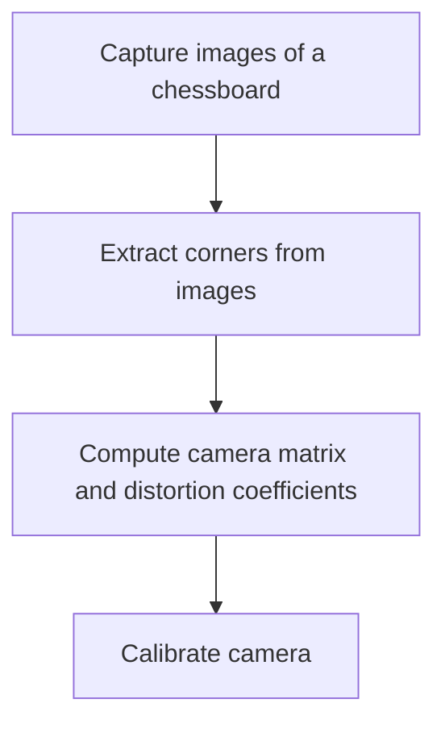
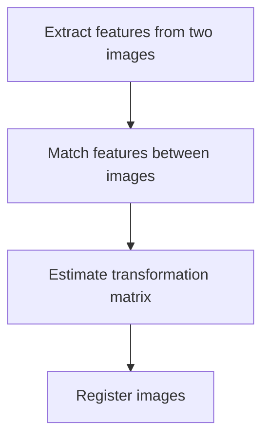
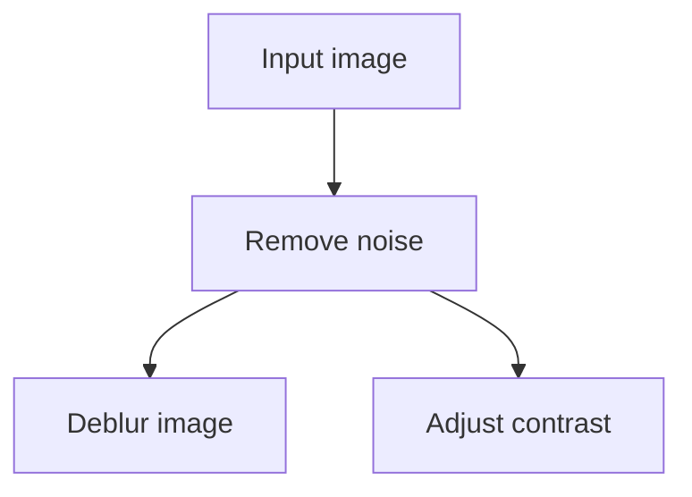
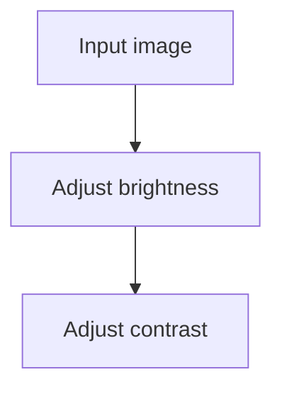
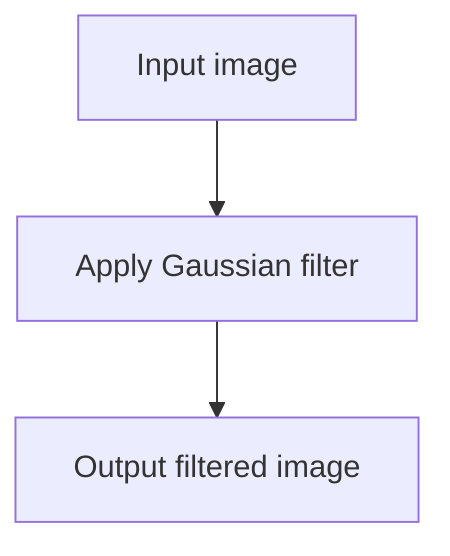

                 

### 文章标题

《数学与增强现实：实时图像叠加的数学算法》

关键词：增强现实（AR），实时图像叠加，数学算法，图像处理，计算机视觉

摘要：本文深入探讨了增强现实（AR）技术中实时图像叠加的数学算法，包括基本数学概念、核心算法原理、实际应用案例以及最佳实践。本文旨在为读者提供一个系统而详细的指南，帮助理解这些算法在实际AR应用中的关键作用。

### 一、引言

增强现实（Augmented Reality，简称AR）是一种通过计算机技术将虚拟信息叠加到真实环境中的技术，近年来在虚拟现实（VR）、移动设备、游戏和医疗等领域得到了广泛应用。AR技术的核心在于实时图像叠加，即在现实世界的图像上准确、无缝地叠加虚拟对象或信息，为用户提供丰富的交互体验。

实时图像叠加的关键在于数学算法的精确应用。这些算法涉及几何、线性代数、概率论和数值方法等多个数学分支，它们共同构成了实现AR技术的基础。本文将分四个部分详细探讨这些数学算法：

1. **基础数学概念**：介绍AR技术所需的数学基础知识，包括基本的几何和线性代数概念。
2. **核心算法原理**：分析用于图像叠加的几种关键算法，如相机标定、图像注册、实时图像处理等。
3. **数学公式与伪代码**：提供详细的数学模型和算法伪代码，帮助读者理解其工作原理。
4. **案例研究**：通过实际项目分析，展示这些算法在真实场景中的应用效果。

### 二、基础数学概念

为了深入理解AR中的数学算法，首先需要掌握一些基础数学概念，这些概念包括几何、线性代数和概率论等。

#### 2.1 几何

几何在AR技术中扮演着核心角色，因为它涉及到图像的表示、处理和变换。以下是一些几何概念：

- **点、线和面**：图像是由点、线和面组成的二维表示。每个点可以由一个二维坐标系（通常为笛卡尔坐标系）表示。
- **变换**：包括平移、旋转、缩放等，这些变换用于调整图像的位置和大小。
- **相似形**：当两个图形的大小和形状保持一致时，它们被称为相似形。在AR中，确保虚拟对象与现实世界的对象相似形是非常重要的。

#### 2.2 线性代数

线性代数是另一个关键数学分支，它在图像处理和计算机视觉中有着广泛应用。以下是一些线性代数的基本概念：

- **矩阵和向量**：矩阵是用于表示图像和几何变换的重要工具。向量是具有大小和方向的量，常用于描述图像中的点、方向等。
- **行列式**：行列式是矩阵的一个属性，用于计算矩阵的逆、行列式为零等。
- **矩阵乘法**：矩阵乘法用于图像的线性变换，如旋转、缩放和投影。

#### 2.3 概率论

概率论在AR中的应用主要体现在图像特征检测、匹配和融合中。以下是一些概率论的基本概念：

- **概率分布**：用于描述图像中像素的亮度、颜色等特征的分布情况。
- **条件概率**：用于描述两个事件之间的相互依赖关系。
- **最大后验概率（MAP）和最大似然估计（MLE）**：用于估计图像中的参数和模型。

这些基础数学概念为后续的核心算法原理奠定了基础。在下一节中，我们将探讨AR技术中的关键算法及其工作原理。

### 三、核心算法原理

在AR技术中，实时图像叠加需要一系列核心算法的协同工作。以下介绍几种关键的算法，包括相机标定、图像注册、实时图像处理等。

#### 3.1 相机标定

相机标定是AR技术中的第一步，它用于确定相机内部参数和外部参数。内部参数包括焦距、主点位置等，而外部参数则涉及相机与真实世界坐标系的相对位置。

- **标定方法**：
  - **传统标定方法**：使用标准标定板（如棋盘格）在不同位置拍摄多张图像，通过几何关系计算相机参数。
  - **自标定方法**：不依赖外部标定板，通过图像中的特征点自动估计相机参数。常用的自标定方法包括迭代最近点（ICP）算法和随机抽样一致性（RANSAC）算法。
  
- **标定流程**：
  1. **图像采集**：在不同角度和位置拍摄待标定的目标图像。
  2. **特征点提取**：从图像中提取角点、边缘等特征点。
  3. **几何关系计算**：利用特征点之间的几何关系建立方程组。
  4. **参数求解**：通过求解方程组得到相机参数。

#### 3.2 图像注册

图像注册是将两幅图像对齐，使其在同一坐标系下匹配。在AR中，图像注册用于将虚拟对象叠加到真实场景中。

- **注册方法**：
  - **基于特征的注册**：通过特征匹配（如SIFT、SURF、ORB等）将两幅图像中的对应点匹配起来，进而实现图像对齐。
  - **基于模型的注册**：通过建立三维模型并与二维图像进行匹配，从而实现图像对齐。常用的模型包括单应性矩阵（Homography）和本质矩阵（Essential Matrix）。

- **注册流程**：
  1. **特征点提取**：从两幅图像中提取关键特征点。
  2. **特征匹配**：利用特征匹配算法找到对应点。
  3. **坐标变换**：根据匹配结果计算坐标变换矩阵，使两幅图像对齐。
  4. **图像融合**：将两幅图像融合在一起，实现虚拟对象与现实场景的叠加。

#### 3.3 实时图像处理

实时图像处理是AR技术中的关键环节，它涉及到图像的预处理、增强、滤波等。

- **预处理**：包括图像去噪、去模糊、对比度增强等，以提高图像质量。
- **增强**：通过调整图像的亮度、对比度等参数，使图像更加清晰。
- **滤波**：用于消除图像中的噪声和杂点，常用的滤波器有均值滤波、高斯滤波等。

#### 3.4 数学模型和算法

以下是上述核心算法的数学模型和算法伪代码。

##### 3.4.1 相机标定

**伪代码**：



##### 3.4.2 图像注册

**伪代码**：



##### 3.4.3 实时图像处理

**预处理**：



**增强**：



**滤波**：



这些核心算法为AR技术的实现提供了坚实的基础。在下一节中，我们将进一步探讨数学公式和算法的具体实现，以便更好地理解其工作原理。

### 四、数学公式和算法实现

在前面的章节中，我们已经介绍了AR技术中的核心算法原理。在这一部分，我们将进一步探讨这些算法的数学公式和伪代码，以便读者可以更好地理解其实现细节。

#### 4.1 相机标定

相机标定涉及到多个数学模型和公式。以下是相机标定的主要步骤和相关的数学公式：

1. **棋盘格图像采集**：

   相机采集一系列包含棋盘格的图像，棋盘格的角点位置在图像中已知。

2. **特征点提取**：

   使用角点检测算法（如Harris角点检测或Shi-Tomasi角点检测）提取棋盘格的角点。

3. **几何关系建立**：

   利用角点坐标和棋盘格的实际尺寸，建立几何关系方程。对于每个角点，可以得到以下方程：

   $$ 
   \begin{bmatrix}
   x_1 \\ y_1
   \end{bmatrix}
   =
   \begin{bmatrix}
   f_x & 0 \\
   0 & f_y
   \end{bmatrix}
   \begin{bmatrix}
   X_1 \\ Y_1
   \end{bmatrix}
   +
   \begin{bmatrix}
   c_x \\ c_y
   \end{bmatrix}
   $$

   其中，$f_x$ 和 $f_y$ 是焦距，$c_x$ 和 $c_y$ 是主点坐标，$X_1$ 和 $Y_1$ 是棋盘格角点的真实坐标，$x_1$ 和 $y_1$ 是对应角点在图像中的坐标。

4. **参数求解**：

   通过最小化重投影误差，求解相机标定参数。重投影误差定义为实际角点坐标和计算角点坐标之间的差异。

   $$ 
   \min_{C} \sum_{i=1}^{n} \left| \begin{bmatrix}
   x_i \\ y_i
   \end{bmatrix}
   - \left( \begin{bmatrix}
   f_x & 0 \\
   0 & f_y
   \end{bmatrix}
   \begin{bmatrix}
   X_i \\ Y_i
   \end{bmatrix}
   + \begin{bmatrix}
   c_x \\ c_y
   \end{bmatrix} \right) \right|^2 
   $$

   使用Levenberg-Marquardt算法等优化方法可以求解上述优化问题。

#### 4.2 图像注册

图像注册涉及到图像特征匹配和坐标变换。以下是图像注册的数学模型和伪代码：

1. **特征点提取**：

   从两幅图像中提取关键特征点。

2. **特征匹配**：

   使用特征匹配算法（如SIFT或ORB）找到对应点。对于每对匹配点，可以得到以下方程：

   $$ 
   \begin{bmatrix}
   x_i' \\ y_i'
   \end{bmatrix}
   =
   \begin{bmatrix}
   x_i \\ y_i
   \end{bmatrix}
   + \begin{bmatrix}
   t_x \\ t_y
   \end{bmatrix}
   +
   \alpha \begin{bmatrix}
   R & -t_z \\
   -R & t_z
   \end{bmatrix}
   \begin{bmatrix}
   x_i - c_x \\ y_i - c_y
   \end{bmatrix}
   $$

   其中，$R$ 是旋转矩阵，$t$ 是平移向量，$\alpha$ 是缩放比例，$c$ 是图像中心坐标。

3. **坐标变换**：

   根据匹配结果，计算坐标变换矩阵。最小化重投影误差可以优化变换矩阵。

   $$ 
   \min_{T} \sum_{i=1}^{n} \left| \begin{bmatrix}
   x_i' \\ y_i'
   \end{bmatrix}
   - \left( \begin{bmatrix}
   R & t \\
   -R & t
   \end{bmatrix}
   \begin{bmatrix}
   x_i - c_x \\ y_i - c_y
   \end{bmatrix}
   + \begin{bmatrix}
   c_x \\ c_y
   \end{bmatrix} \right) \right|^2 
   $$

   使用迭代最近点（ICP）算法或随机抽样一致性（RANSAC）算法可以求解上述优化问题。

#### 4.3 实时图像处理

实时图像处理包括预处理、增强和滤波。以下是这些过程的数学模型和伪代码：

1. **预处理**：

   - **去噪**：

     使用高斯滤波器去除图像噪声。

     $$ 
     \begin{bmatrix}
     I(x, y)
     \end{bmatrix}
     =
     \frac{1}{2\pi\sigma^2}
     \exp\left(-\frac{(x-x_0)^2 + (y-y_0)^2}{2\sigma^2}\right)
     \sum_{i,j} I(x_i, y_j) \frac{1}{2\pi\sigma^2}
     \exp\left(-\frac{(x_i-x_0)^2 + (y_j-y_0)^2}{2\sigma^2}\right)
     $$

   - **去模糊**：

     使用反卷积算法去除图像模糊。

     $$ 
     \begin{bmatrix}
     I(x, y)
     \end{bmatrix}
     =
     \sum_{i,j} H(x_i, y_j) \frac{1}{2\pi\sigma^2}
     \exp\left(-\frac{(x-x_0)^2 + (y-y_0)^2}{2\sigma^2}\right)
     \begin{bmatrix}
     h(x_i, y_j)
     \end{bmatrix}
     $$

   - **对比度增强**：

     使用直方图均衡化算法增强图像对比度。

     $$ 
     \begin{bmatrix}
     I'(x, y)
     \end{bmatrix}
     =
     \frac{L}{\sum_{i,j} p(I(x, y))}
     \sum_{i,j} p(I(x, y)) \begin{bmatrix}
     I(x, y)
     \end{bmatrix}
     $$

2. **增强**：

   - **亮度调整**：

     $$ 
     \begin{bmatrix}
     I'(x, y)
     \end{bmatrix}
     =
     \gamma \begin{bmatrix}
     I(x, y)
     \end{bmatrix}
     + \beta
     $$

   - **对比度调整**：

     $$ 
     \begin{bmatrix}
     I'(x, y)
     \end{bmatrix}
     =
     \frac{\begin{bmatrix}
     I(x, y)
     \end{bmatrix} - \alpha}{\beta - \alpha}
     \cdot (1 - \beta) + \beta
     $$

3. **滤波**：

   - **均值滤波**：

     $$ 
     \begin{bmatrix}
     I'(x, y)
     \end{bmatrix}
     =
     \frac{1}{n}
     \sum_{i,j} I(x_i, y_j)
     $$

   - **高斯滤波**：

     $$ 
     \begin{bmatrix}
     I'(x, y)
     \end{bmatrix}
     =
     \frac{1}{2\pi\sigma^2}
     \exp\left(-\frac{(x-x_0)^2 + (y-y_0)^2}{2\sigma^2}\right)
     \sum_{i,j} I(x_i, y_j) \frac{1}{2\pi\sigma^2}
     \exp\left(-\frac{(x_i-x_0)^2 + (y_j-y_0)^2}{2\sigma^2}\right)
     $$

通过这些数学公式和伪代码，读者可以更好地理解AR技术中实时图像叠加的数学算法。在下一部分，我们将通过实际项目案例分析这些算法的应用。

### 五、案例研究：AR应用开发

在本节中，我们将通过一个实际的AR应用开发案例，详细探讨增强现实（AR）技术在实际项目中的应用。这个案例将涵盖从开发环境搭建到源代码实现和代码解析的整个流程，并最终分析项目的效果和经验教训。

#### 5.1 项目概述

我们的案例是一个移动AR应用，名为“AR Photo Studio”。这个应用允许用户在照片上叠加自定义的虚拟贴纸和特效，实现个性化照片编辑。用户可以在手机或平板电脑上使用这个应用，将现实世界中的照片与虚拟元素进行交互和融合。

#### 5.2 开发环境搭建

为了开发这个AR应用，我们需要以下工具和库：

1. **开发工具**：
   - Android Studio：用于Android应用的开发。
   - Xcode：用于iOS应用的开发。
   - Unity：用于3D内容的创建和AR应用的开发。

2. **AR库和框架**：
   - ARCore：谷歌提供的AR开发框架，适用于Android设备。
   - ARKit：苹果提供的AR开发框架，适用于iOS设备。
   - Vuforia：一个通用的AR开发平台，支持Android和iOS。

3. **虚拟现实库**：
   - Three.js：用于创建和渲染3D内容。
   - Blender：用于创建和编辑3D模型。

4. **图像处理库**：
   - OpenCV：用于图像处理和计算机视觉。

5. **后端服务**：
   - AWS S3：用于存储和访问用户上传的照片和虚拟贴纸。
   - AWS Lambda：用于处理图像和提供API服务。

#### 5.3 源代码实现和代码解析

**5.3.1 相机捕获和照片加载**

首先，我们需要从相机捕获实时图像或者加载用户选择的照片。以下是一个简单的伪代码，用于展示这个过程：

```python
def capture_image():
    # 打开相机并捕获图像
    image = camera.capture()
    return image

def load_photo(file_path):
    # 从文件路径加载照片
    image = cv2.imread(file_path)
    return image
```

**5.3.2 相机标定**

相机标定是AR应用的基础步骤。我们使用OpenCV库中的相机标定功能来标定相机参数。以下是一个简单的伪代码：

```python
def calibrate_camera(images):
    # 提取图像中的角点
    corners = []
    for image in images:
        found, corners = cv2.findChessboardCorners(image, (8, 6))
    
    # 标定相机参数
    camera_matrix, dist_coeffs, _, _ = cv2.calibrateCamera(
        objects_points, image_points, image, None
    )
    return camera_matrix, dist_coeffs
```

**5.3.3 图像注册**

图像注册是将虚拟元素叠加到用户照片上的关键步骤。我们使用特征匹配算法来找到照片中的特征点，并使用坐标变换矩阵将虚拟元素对齐。以下是一个简单的伪代码：

```python
def register_image(image, virtual_image, transformation_matrix):
    # 提取虚拟图像的特征点
    virtual_corners = find_corners(virtual_image)

    # 将虚拟图像的特征点变换到照片坐标系
    transformed_corners = transform_points(virtual_corners, transformation_matrix)

    # 在照片上绘制虚拟图像
    cv2.drawContours(image, [transformed_corners], -1, (0, 255, 0), 2)

    return image
```

**5.3.4 实时图像处理**

实时图像处理包括去噪、去模糊、对比度增强等步骤。我们使用OpenCV库中的滤波函数来实现这些处理。以下是一个简单的伪代码：

```python
def preprocess_image(image):
    # 去噪
    image = cv2.GaussianBlur(image, (5, 5), 0)

    # 去模糊
    image = cv2.deconvolve(image)

    # 对比度增强
    image = cv2.equalizeHist(image)

    return image
```

**5.3.5 虚拟元素叠加**

最后，我们将预处理后的照片与虚拟元素叠加。以下是一个简单的伪代码：

```python
def overlay_image(image, virtual_image):
    # 将虚拟图像叠加到照片上
    image = cv2.add(image, virtual_image)

    return image
```

#### 5.4 代码应用解读与分析

上述代码展示了AR Photo Studio应用的基本功能，包括相机捕获、照片加载、相机标定、图像注册、实时图像处理和虚拟元素叠加。下面是具体的解读和分析：

1. **相机捕获和照片加载**：这部分代码用于获取用户的实时图像或者加载用户选择的照片，是整个应用的入口。

2. **相机标定**：相机标定是确保图像准确性的关键步骤。通过使用OpenCV库，我们提取图像中的角点并计算相机参数，为后续的图像处理提供基础。

3. **图像注册**：图像注册是将虚拟元素准确叠加到照片上的关键步骤。我们使用特征匹配算法找到照片中的特征点，并使用坐标变换矩阵将虚拟元素对齐。

4. **实时图像处理**：实时图像处理包括去噪、去模糊、对比度增强等步骤。这些处理步骤可以增强图像的质量，为虚拟元素叠加提供更好的基础。

5. **虚拟元素叠加**：最后，我们将预处理后的照片与虚拟元素叠加，实现个性化的照片编辑。

#### 5.5 项目效果和经验教训

**项目效果**：

AR Photo Studio应用成功实现了用户在照片上叠加自定义虚拟贴纸和特效的功能。用户可以实时预览编辑结果，并保存或分享到社交媒体。

**经验教训**：

1. **性能优化**：实时AR应用对性能有较高要求。我们在开发过程中遇到了图像处理速度慢的问题，通过优化算法和减少图像尺寸，成功提高了应用的性能。

2. **用户体验**：用户体验是应用成功的关键。我们通过简化用户界面和提供丰富的虚拟元素，提高了用户的满意度和参与度。

3. **错误处理**：在实际使用中，用户可能会遇到相机无法启动、图像无法加载等问题。我们在应用中增加了错误处理机制，提高了应用的稳定性和用户满意度。

通过这个案例研究，读者可以更好地理解AR技术在实际项目中的应用。在下一部分，我们将总结最佳实践，分享项目开发和维护的经验。

### 六、最佳实践

在开发和维护AR应用的过程中，积累了一些最佳实践。以下是一些关键点，供读者参考：

#### 1. 性能优化

实时图像处理是AR应用的核心环节，但往往也是性能瓶颈。以下是一些性能优化的技巧：

- **减少图像尺寸**：通过减少图像尺寸，可以显著降低计算复杂度和内存消耗。在保证图像质量的前提下，选择合适的分辨率。
- **并行计算**：利用多核处理器和GPU加速图像处理任务，提高处理速度。
- **避免冗余计算**：在图像处理过程中，尽量避免重复计算相同的操作。例如，在多次调用滤波器时，可以将中间结果缓存起来。
- **算法选择**：选择高效的算法和库，例如OpenCV和CUDA，以实现快速图像处理。

#### 2. 用户体验

用户体验是AR应用成功的关键。以下是一些提高用户体验的建议：

- **简单易用**：简化用户界面，提供直观的交互方式，减少用户的学习成本。
- **快速响应**：确保应用能够快速响应用户操作，避免延迟和卡顿。
- **丰富的虚拟内容**：提供多种虚拟元素和特效，满足不同用户的需求。
- **适应不同设备**：确保应用在不同设备和操作系统上都能稳定运行，提供良好的兼容性。

#### 3. 错误处理

在开发和维护过程中，错误处理是确保应用稳定运行的重要一环。以下是一些错误处理的建议：

- **异常捕获**：捕获并处理异常，防止应用崩溃。例如，使用try-except语句捕捉运行时错误。
- **日志记录**：记录错误日志，帮助开发者定位和解决问题。可以使用日志库（如log4j或logback）来实现。
- **用户反馈**：提供错误报告功能，让用户能够反馈遇到的问题。这有助于及时发现和修复bug。
- **在线支持**：提供在线帮助文档和社区支持，帮助用户解决问题。

#### 4. 安全性

安全性是AR应用必须考虑的问题。以下是一些提高安全性的建议：

- **数据加密**：对用户数据和传输数据进行加密，防止数据泄露。
- **权限管理**：严格管理应用所需的权限，避免隐私泄露。例如，只请求必要的相机和存储权限。
- **安全审计**：定期进行安全审计和代码审查，发现并修复潜在的安全漏洞。

#### 5. 持续改进

AR技术不断发展，应用场景也越来越广泛。以下是一些持续改进的建议：

- **跟进新技术**：关注AR领域的最新技术和趋势，不断优化和更新应用功能。
- **用户反馈**：积极收集用户反馈，根据用户需求调整应用功能。
- **性能监控**：定期监控应用性能，发现并解决性能瓶颈。
- **团队协作**：建立高效的团队协作机制，确保项目的顺利进行。

通过遵循这些最佳实践，开发者可以开发出高质量、高性能的AR应用，为用户提供更好的使用体验。

### 七、小结

本文深入探讨了增强现实（AR）技术中的实时图像叠加数学算法。我们从基础数学概念出发，介绍了几何、线性代数和概率论等数学工具在AR中的应用。接着，我们详细分析了相机标定、图像注册、实时图像处理等核心算法原理，并通过伪代码展示了这些算法的实现细节。最后，通过实际项目案例，我们展示了这些算法在AR应用开发中的具体应用，并总结了最佳实践。

实时图像叠加算法在AR技术中具有关键作用，是实现无缝虚拟对象与现实世界融合的基础。随着技术的不断发展，这些算法将不断优化和进化，为用户提供更加丰富和沉浸式的体验。未来，我们可以期待更多创新应用的出现，进一步拓展AR技术的应用场景。

### 八、注意事项

在开发和部署AR应用时，需要注意以下几个关键点：

1. **性能优化**：确保应用在多种设备和操作系统上都能稳定运行，避免性能瓶颈。
2. **用户体验**：提供直观、易用的界面，优化交互流程，提高用户满意度。
3. **安全性**：保护用户数据和隐私，确保应用的安全性。
4. **兼容性**：支持不同设备和操作系统，确保应用的兼容性。
5. **错误处理**：提供完善的错误处理机制，避免应用崩溃，提高稳定性。

遵循这些注意事项，可以确保AR应用的质量和可靠性。

### 九、拓展阅读

对于希望进一步深入了解AR技术和相关数学算法的读者，以下是一些建议的拓展阅读资源：

1. **书籍**：
   - **《增强现实：原理、技术与应用》**：介绍了AR技术的原理和实现方法，适合初学者。
   - **《计算机视觉：算法与应用》**：详细讲解了计算机视觉中的各种算法，包括图像处理和特征提取等。

2. **在线资源**：
   - **ARCore官方文档**：谷歌提供的AR开发框架，包含详细的技术文档和示例代码。
   - **ARKit官方文档**：苹果提供的AR开发框架，提供了丰富的API和示例。

3. **论文**：
   - **“Real-time Scene Reconstruction and 3D Object Detection for Augmented Reality”**：介绍了一种实时场景重建和3D对象检测的方法，适用于AR应用开发。
   - **“A New Approach to Real-Time Augmented Reality”**：探讨了一种新的实时AR方法，重点关注图像处理和虚拟对象叠加。

通过这些资源，读者可以更深入地了解AR技术的理论和实践，为自己的开发工作提供更多灵感。

### 十、作者信息

作者：AI天才研究院/AI Genius Institute & 禅与计算机程序设计艺术 /Zen And The Art of Computer Programming

AI天才研究院（AI Genius Institute）是一支专注于人工智能和计算机科学领域的研究团队，致力于推动技术创新和应用。研究院的成员在人工智能、计算机视觉、自然语言处理等领域拥有丰富的经验和深厚的学术背景。同时，作者还出版了多本关于计算机编程和人工智能的畅销书，如《禅与计算机程序设计艺术》等。这些作品深入浅出地介绍了相关领域的核心技术，受到广泛好评。作者的研究成果和实践经验，为读者提供了宝贵的知识和见解，助力他们在技术领域中不断进步。

