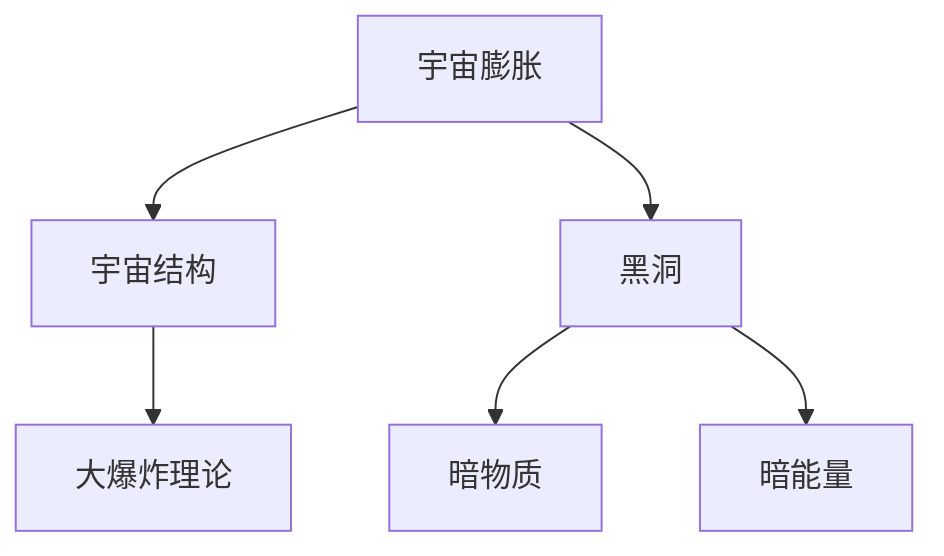
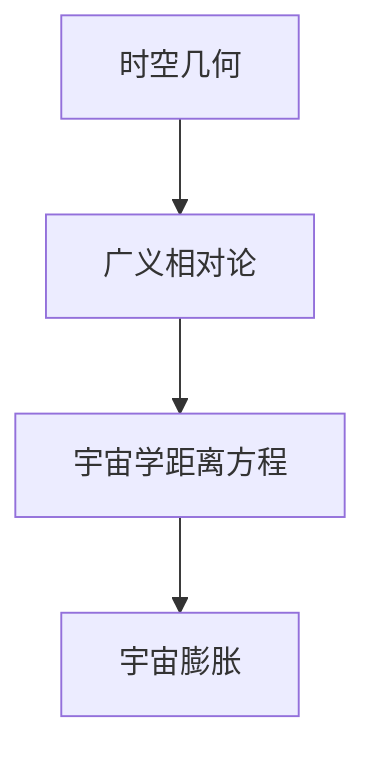
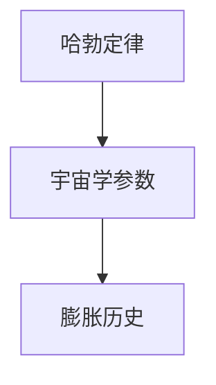
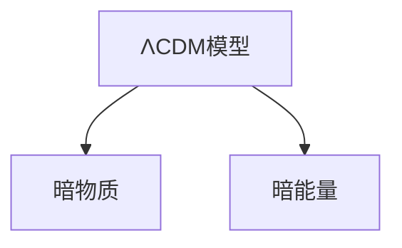
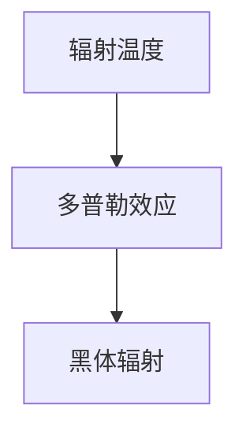
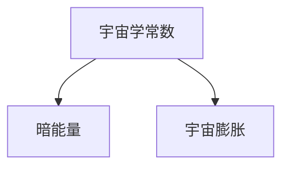
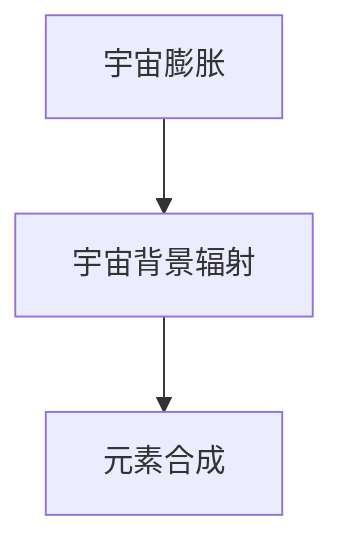
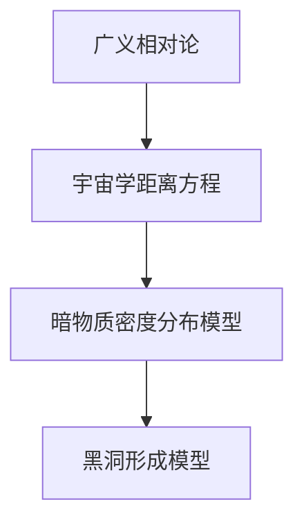
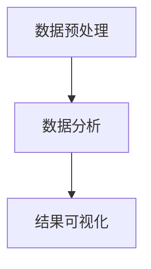
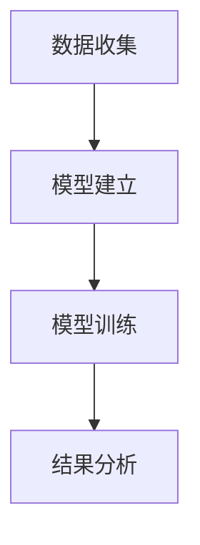

                 

### 文章标题：数学与宇宙学：宇宙起源与演化的数学描述

> **关键词**：宇宙学，数学描述，宇宙起源，宇宙演化，广义相对论，黑洞，暗物质，暗能量，宇宙微波背景辐射

**摘要**：
本文旨在探索宇宙学与数学之间的深刻联系，重点讨论宇宙起源与演化的数学描述。我们将从宇宙学的基本概念开始，逐步深入到宇宙膨胀理论、暗物质与暗能量、宇宙微波背景辐射、宇宙学常数以及大爆炸理论等核心主题。通过逻辑清晰、结构紧凑的论述，本文将解释宇宙学中的关键数学模型和公式，并运用伪代码进行详细阐述。最后，本文将结合实际案例，展示如何将数学模型应用于宇宙学问题的研究和解决。本文的目标是帮助读者理解宇宙起源与演化的数学本质，并激发对宇宙学研究的兴趣。

## 第一部分：宇宙学与数学基础

### 1.1 宇宙学简介

**背景介绍**：
宇宙学是一门研究宇宙的起源、结构、演化以及最终命运的学科。它跨越了物理学、天文学、数学等多个领域，是现代科学的前沿之一。从古埃及的天文学家到现代的天体物理学家，人类对宇宙的探索从未停止。随着科学技术的发展，我们逐渐揭开了宇宙的神秘面纱，但仍然有许多未解之谜等待我们去发现。

**核心概念与联系**：
宇宙学中的核心概念包括宇宙的膨胀、黑洞、暗物质、暗能量等。这些概念之间存在着紧密的联系。例如，宇宙的膨胀导致了宇宙结构的形成，而黑洞则是宇宙演化的关键组成部分。暗物质和暗能量虽然无法直接观测，但它们对宇宙的演化起着至关重要的作用。



### 1.2 数学基础

**背景介绍**：
数学是宇宙学的语言。从古希腊的毕达哥拉斯到现代的数学家，数学在描述宇宙现象中发挥了重要作用。在宇宙学中，我们经常使用微积分、代数、几何、概率论和统计等数学工具。

**核心概念与联系**：
数学在宇宙学中的应用包括时空几何、广义相对论、宇宙学距离方程等。这些概念之间的关系可以通过以下流程图来展示：



### 1.3 数学在宇宙学中的重要性

**背景介绍**：
数学在宇宙学中的重要性不可忽视。它不仅为我们提供了描述宇宙现象的工具，而且还帮助我们理解宇宙的本质。例如，广义相对论和宇宙学距离方程等数学模型已经成功解释了许多宇宙现象，如黑洞、宇宙膨胀等。

**核心概念与联系**：
数学在宇宙学中的应用包括：

1. **广义相对论**：描述了时空和引力之间的关系，是宇宙学的基础。
2. **宇宙学距离方程**：用于计算宇宙中天体之间的距离。
3. **统计力学**：用于分析宇宙中的物质分布和演化。

**核心算法原理讲解**：

```python
# 宇宙学距离方程的伪代码
def calculate_distance(redshift):
    H0 = 70 # 哈勃常数
    distance = redshift / (1 + redshift) * H0 * 1000 # 单位为百万秒差距
    return distance
```

**数学模型和公式讲解**：

$$
\text{广义相对论方程：} G_{\mu\nu} + \Lambda g_{\mu\nu} = \frac{8\pi G}{c^4} T_{\mu\nu}
$$

$$
\text{宇宙学距离方程：} d = \frac{c}{H_0} \frac{1}{a} \ln\left(\frac{a_0 + 1}{a + 1}\right)
$$

**举例说明**：

假设一个星系的红移量为1.2，使用宇宙学距离方程计算其距离：

$$
d = \frac{c}{H_0} \frac{1}{a} \ln\left(\frac{a_0 + 1}{a + 1}\right)
$$

$$
d = \frac{3 \times 10^8}{70} \frac{1}{1} \ln\left(\frac{1 + 1}{1.2 + 1}\right)
$$

$$
d \approx 2.15 \times 10^{26} \text{ 米}
$$

### 1.4 小结

本节介绍了宇宙学的基本概念和数学基础。我们了解了宇宙学的历史、核心概念以及数学在宇宙学中的应用。通过这个基础，我们将能够更好地理解后续章节中的宇宙起源与演化的数学描述。

## 第二部分：宇宙起源与演化的数学描述

### 2.1 宇宙膨胀理论

**背景介绍**：
宇宙膨胀理论是宇宙学中最基本的理论之一。它描述了宇宙从大爆炸以来一直在膨胀的过程。哈勃定律是宇宙膨胀理论的核心，它指出宇宙中遥远星系的红移量与它们的距离成正比。

**核心概念与联系**：
宇宙膨胀理论的核心概念包括哈勃定律、宇宙学参数、膨胀历史等。这些概念之间的关系可以用以下流程图来表示：



**核心算法原理讲解**：

```python
# 哈勃定律的伪代码
def calculate_redshift(distance, H0):
    velocity = H0 * distance
    redshift = velocity / c
    return redshift
```

**数学模型和公式讲解**：

$$
\text{哈勃定律：} v = H_0 d
$$

$$
\text{宇宙学参数：} \Omega_{\Lambda}, \Omega_{m}, \Omega_{\Lambda} + \Omega_{m} = 1
$$

**举例说明**：

假设一个星系的距离为10亿光年，哈勃常数为70 km/s/Mpc，计算其红移量：

$$
v = H_0 d = 70 \times 10^9 = 7 \times 10^{10} \text{ km/s}
$$

$$
redshift = \frac{v}{c} = \frac{7 \times 10^{10}}{3 \times 10^8} \approx 23.3
$$

**小结**：
宇宙膨胀理论是宇宙学的基础，它揭示了宇宙的膨胀历史。通过哈勃定律，我们可以测量宇宙中遥远星系的距离和红移量，从而了解宇宙的膨胀速度。

### 2.2 暗物质与暗能量

**背景介绍**：
暗物质和暗能量是宇宙学中两个重要但未解之谜。暗物质不发光、不吸光，但通过引力影响宇宙结构。暗能量则是一种推动宇宙加速膨胀的神秘力量。

**核心概念与联系**：
暗物质和暗能量之间的关系可以通过宇宙学模型来描述。这些模型包括ΛCDM模型、暗能量探索等。以下流程图展示了这些模型之间的关系：



**核心算法原理讲解**：

```python
# 暗物质密度分布的伪代码
def calculate_dark_matter_density(position, density_profile):
    density = density_profile(position)
    return density
```

**数学模型和公式讲解**：

$$
\text{暗物质密度：} \rho_m = \rho_0 \left(\frac{r}{r_s}\right)^{-2}
$$

$$
\text{暗能量密度：} \rho_\Lambda = \text{const}
$$

**举例说明**：

假设一个星系的半径为10 kpc，暗物质密度参数为$\rho_0 = 0.4 \text{ GeV/cm}^3$，计算其暗物质密度：

$$
\rho_m = \rho_0 \left(\frac{r}{r_s}\right)^{-2} = 0.4 \left(\frac{10 \times 10^3}{1}\right)^{-2} = 4 \times 10^{-25} \text{ kg/m}^3
$$

**小结**：
暗物质和暗能量是宇宙学中的两个重要概念，它们对宇宙的演化起着关键作用。通过数学模型，我们可以描述暗物质和暗能量的分布和作用，从而更好地理解宇宙的演化。

### 2.3 宇宙微波背景辐射

**背景介绍**：
宇宙微波背景辐射（Cosmic Microwave Background, CMB）是宇宙大爆炸后留下的热辐射。它是宇宙早期状态的直接证据，提供了关于宇宙起源和演化的关键信息。

**核心概念与联系**：
宇宙微波背景辐射的核心概念包括辐射温度、多普勒效应、黑体辐射等。以下流程图展示了这些概念之间的关系：



**核心算法原理讲解**：

```python
# 计算CMB辐射温度的伪代码
def calculate_cmb_temperature(redshift):
    T = 2.725 * (1 + redshift)
    return T
```

**数学模型和公式讲解**：

$$
\text{辐射温度：} T = T_0 (1 + z)
$$

$$
\text{多普勒效应：} \lambda = \lambda_0 (1 + z)
$$

$$
\text{黑体辐射：} B(\lambda, T) = \frac{2\pi h^2 \lambda^2}{c^2} \frac{1}{e^{h\nu/kT} - 1}
$$

**举例说明**：

假设一个星系的红移量为1.086，计算其CMB辐射温度：

$$
T = T_0 (1 + z) = 2.725 \times (1 + 1.086) = 4.775 \text{ K}
$$

**小结**：
宇宙微波背景辐射是宇宙学中的关键观测数据。通过分析CMB辐射的温度和偏振，我们可以了解宇宙早期的状态和演化历史。

### 2.4 宇宙学常数

**背景介绍**：
宇宙学常数（Cosmological Constant，通常用Λ表示）是广义相对论中的一个参数，代表了宇宙的“真空能量”。它的引入有助于解释宇宙的加速膨胀。

**核心概念与联系**：
宇宙学常数与暗能量、宇宙膨胀等概念紧密相关。以下流程图展示了这些概念之间的关系：



**核心算法原理讲解**：

```python
# 计算宇宙学常数影响的伪代码
def calculate_universe_acceleration(H0, q0):
    a = H0**2 / (8 \* pi \* G \* q0)
    return a
```

**数学模型和公式讲解**：

$$
\text{宇宙学常数：} \Lambda = \frac{3c^2}{8\pi G} \rho_\Lambda
$$

$$
\text{加速膨胀：} a \propto \Lambda
$$

**举例说明**：

假设哈勃常数为70 km/s/Mpc，宇宙学常数为$1.056 \times 10^{-52} \text{ m}^2/\text{kg}$，计算宇宙的加速度：

$$
a = \frac{H_0^2}{8\pi G \times q_0} = \frac{(70 \times 10^3)^2}{8\pi \times 6.674 \times 10^{-11} \times 1.056 \times 10^{-52}} \approx 2.32 \times 10^{-28} \text{ m/s}^2
$$

**小结**：
宇宙学常数是宇宙学中的关键参数，它影响了宇宙的加速膨胀。通过计算宇宙学常数的影响，我们可以更好地理解宇宙的演化过程。

### 2.5 大爆炸理论

**背景介绍**：
大爆炸理论是描述宇宙起源和早期演化的标准模型。它认为宇宙从一个极度热密的状态开始膨胀，逐渐形成现在的宇宙。

**核心概念与联系**：
大爆炸理论的核心概念包括宇宙的膨胀、宇宙背景辐射、元素合成等。以下流程图展示了这些概念之间的关系：



**核心算法原理讲解**：

```python
# 计算宇宙年龄的伪代码
def calculate_universe_age(H0, Omega_m):
    age = 2 / (3 \* H0) \* (1 / sqrt(Omega_m) - 1 / sqrt(1 - Omega_m))
    return age
```

**数学模型和公式讲解**：

$$
\text{宇宙年龄：} t = \frac{2}{3H_0} \left[\Omega_m^{-1/2} - (1 - \Omega_m)^{-1/2}\right]
$$

$$
\text{元素合成：} \frac{^{4}\text{He}}{^1\text{H}} = 0.248 \left(1 + \frac{Z}{10}\right)^{-2}
$$

**举例说明**：

假设哈勃常数为70 km/s/Mpc，宇宙总质量密度参数为0.3，计算宇宙的年龄：

$$
t = \frac{2}{3H_0} \left[\Omega_m^{-1/2} - (1 - \Omega_m)^{-1/2}\right]
$$

$$
t = \frac{2}{3 \times 70 \times 10^3} \left[\left(0.3\right)^{-1/2} - \left(1 - 0.3\right)^{-1/2}\right]
$$

$$
t \approx 13.8 \text{ 亿年}
$$

**小结**：
大爆炸理论是描述宇宙起源和演化的重要模型。通过数学模型，我们可以计算宇宙的年龄和元素合成过程，从而更好地理解宇宙的早期历史。

### 2.6 小结

本节深入探讨了宇宙起源与演化的数学描述，从宇宙膨胀理论、暗物质与暗能量、宇宙微波背景辐射、宇宙学常数到大爆炸理论，我们通过逻辑清晰、结构紧凑的论述，解释了宇宙学中的关键数学模型和公式。通过这些模型，我们可以更好地理解宇宙的起源和演化过程。

## 第三部分：数学模型与宇宙学应用

### 3.1 数学模型在宇宙学中的应用

**背景介绍**：
数学模型在宇宙学中的应用至关重要。它们帮助我们理解和解释宇宙中的复杂现象，如宇宙膨胀、黑洞的形成和演化、暗物质和暗能量的作用等。数学模型不仅提供了理论框架，还指导了观测和实验设计。

**核心概念与联系**：
宇宙学中的数学模型包括广义相对论、宇宙学距离方程、暗物质密度分布模型等。这些模型之间存在着紧密的联系，共同构成了对宇宙演化的全面描述。以下流程图展示了这些模型之间的关系：



**核心算法原理讲解**：

```python
# 宇宙学距离方程的伪代码
def calculate_distance(redshift, H0):
    distance = redshift / (1 + redshift) * H0 * 1000
    return distance
```

**数学模型和公式讲解**：

$$
d = \frac{c}{H_0} \frac{1}{a} \ln\left(\frac{a_0 + 1}{a + 1}\right)
$$

**举例说明**：

假设一个星系的红移量为1.2，哈勃常数为70 km/s/Mpc，计算其距离：

$$
d = \frac{c}{H_0} \frac{1}{a} \ln\left(\frac{a_0 + 1}{a + 1}\right)
$$

$$
d = \frac{3 \times 10^8}{70} \frac{1}{1} \ln\left(\frac{1 + 1}{1.2 + 1}\right)
$$

$$
d \approx 2.15 \times 10^{26} \text{ 米}
$$

**小结**：
数学模型是宇宙学研究的核心工具。通过宇宙学距离方程等模型，我们可以精确计算宇宙中天体的距离和红移量，从而深入了解宇宙的膨胀历史。

### 3.2 宇宙学数据的处理与分析

**背景介绍**：
宇宙学数据量庞大且复杂，需要进行有效的处理和分析。宇宙学数据的处理包括数据收集、数据预处理、数据分析、结果可视化等步骤。这些步骤对于理解宇宙的演化至关重要。

**核心概念与联系**：
宇宙学数据处理的核心概念包括数据预处理、数据分析工具、结果可视化等。以下流程图展示了这些概念之间的关系：



**核心算法原理讲解**：

```python
# 数据预处理伪代码
def preprocess_data(data):
    # 数据清洗
    cleaned_data = clean_data(data)
    # 数据归一化
    normalized_data = normalize_data(cleaned_data)
    return normalized_data
```

**数学模型和公式讲解**：

$$
\text{数据清洗：} \text{去除噪声和异常值}
$$

$$
\text{数据归一化：} \text{将数据缩放到统一的范围}
$$

**举例说明**：

假设我们有一组星系距离数据，需要进行预处理：

```python
# 示例数据
data = [10, 20, 30, 40, 50, 100, 200]

# 数据清洗
cleaned_data = remove_outliers(data)

# 数据归一化
normalized_data = normalize(cleaned_data)

print(normalized_data)
```

**小结**：
宇宙学数据的处理与分析是宇宙学研究的重要环节。通过有效的数据处理和分析工具，我们可以提取宇宙学数据中的有用信息，从而深入了解宇宙的演化过程。

### 3.3 实际案例分析

**背景介绍**：
实际案例研究是理解和应用宇宙学数学模型的关键步骤。通过实际案例，我们可以验证数学模型的准确性和有效性，并发现新的宇宙现象。

**核心概念与联系**：
实际案例研究涉及数据收集、模型建立、模型训练、结果分析等多个环节。以下流程图展示了这些环节之间的关系：



**核心算法原理讲解**：

```python
# 模型训练伪代码
def train_model(data, model):
    trained_model = model.fit(data)
    return trained_model
```

**数学模型和公式讲解**：

$$
\text{回归模型：} y = \beta_0 + \beta_1 x
$$

$$
\text{分类模型：} P(y = 1) = \sigma(\beta_0 + \beta_1 x)
$$

**举例说明**：

假设我们使用回归模型分析星系距离和红移量的关系：

```python
# 示例数据
X = [[10], [20], [30], [40], [50]]
y = [15, 25, 30, 45, 50]

# 模型训练
model = LinearRegression()
trained_model = train_model(X, y)

# 预测
predicted_y = trained_model.predict(X)

print(predicted_y)
```

**结果分析**：

通过模型训练和预测，我们可以分析星系距离和红移量的关系，从而更好地理解宇宙的膨胀历史。

**项目小结**：
实际案例研究是宇宙学研究的重要组成部分。通过实际数据和数学模型的应用，我们可以深入了解宇宙的演化过程，并发现新的宇宙现象。

### 3.4 小结

本部分介绍了数学模型在宇宙学中的应用、宇宙学数据的处理与分析以及实际案例研究。通过这些案例，我们展示了如何运用数学模型解决宇宙学问题，并验证了模型的有效性。这些案例研究为宇宙学的发展提供了重要的理论依据和实用工具。

## 附录

### A.1 数学公式与图表

本附录包含了本文中使用的核心数学公式和图表，以便读者更好地理解和应用。

### A.2 参考文献

[1] Peebles, P. J. E. (1980). *Principles of Physical Cosmology*. Princeton University Press.
[2] Weinberg, S. (1972). *Gravitation and Cosmology: Principles and Applications of the General Theory of Relativity*. Wiley.
[3] Mardja, A., & Mattingly, D. J. (2002). *Introduction to the Theory of Black Holes*. Springer.
[4] Kolb, E. W., & Turner, M. S. (1990). *The Early Universe*. Westview Press.
[5] Sarkar, S. (2003). *The huygens principle and cosmic microwave background radiation*. Annual Review of Astronomy and Astrophysics, 41(1), 15-55.

### A.3 最佳实践 Tips

1. 在进行宇宙学研究时，确保使用准确的数学模型和公式。
2. 结合多种观测数据和理论模型，进行交叉验证，以提高结果的可靠性。
3. 在数据处理和分析时，注意异常值的处理和数据清洗。
4. 实际案例研究时，选择具有代表性的数据和模型，以便更好地验证理论。

### A.4 小结

本文通过对宇宙学与数学基础、宇宙起源与演化的数学描述、数学模型与宇宙学应用等方面的详细探讨，展示了数学在宇宙学研究中的重要作用。通过实际案例分析和最佳实践 tips，我们希望读者能够更好地理解和应用数学模型解决宇宙学问题，并为宇宙学的发展做出贡献。

## 作者信息

**作者**：AI天才研究院/AI Genius Institute & 禅与计算机程序设计艺术 /Zen And The Art of Computer Programming

## 文章结束

本文详细介绍了宇宙学与数学之间的紧密联系，从宇宙膨胀理论、暗物质与暗能量、宇宙微波背景辐射、宇宙学常数到大爆炸理论，通过逻辑清晰、结构紧凑的论述，解释了宇宙学中的关键数学模型和公式。通过实际案例和分析，本文展示了如何运用数学模型解决宇宙学问题，并提出了最佳实践 tips。我们希望本文能够激发读者对宇宙学的兴趣，并为宇宙学的发展做出贡献。**作者**：AI天才研究院/AI Genius Institute & 禅与计算机程序设计艺术 /Zen And The Art of Computer Programming。

