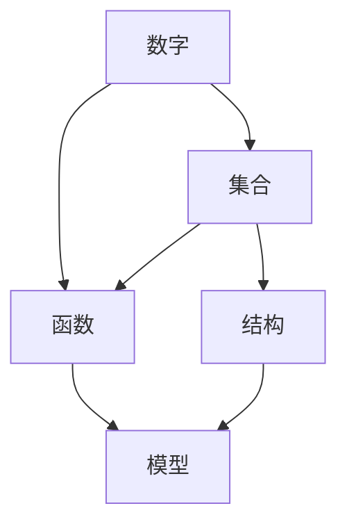
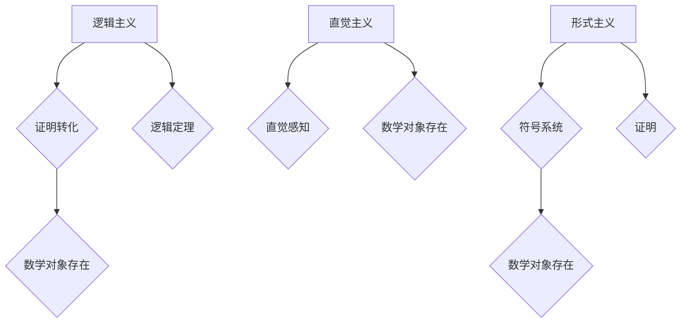
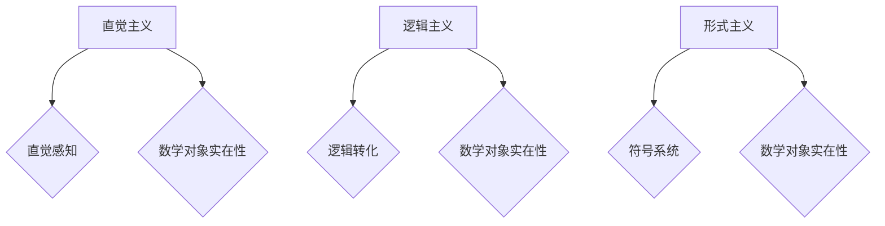
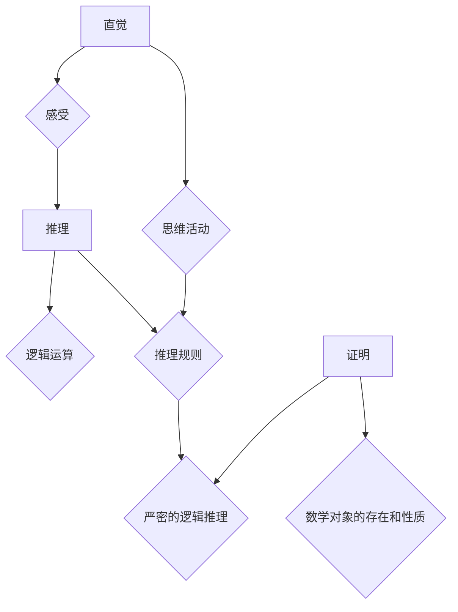
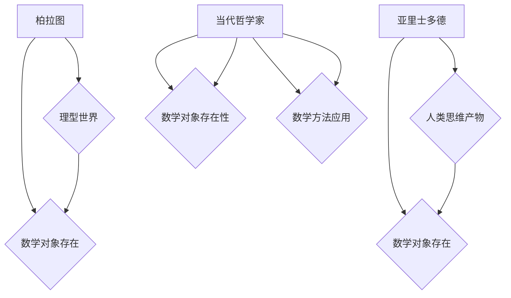

                 


# 数学与实在论：数学对象的客观存在

## 关键词
数学对象、实在论、客观存在、数学哲学、逻辑主义、直觉主义、形式主义

## 摘要
本文探讨了数学与实在论的关系，特别是数学对象的客观存在性。首先，介绍了数学实在论的概念和历史背景，然后分析了数学对象的基本性质及其与客观世界的联系。接着，讨论了关于数学对象存在问题的不同观点，包括逻辑主义、直觉主义和形式主义，并通过Mermaid流程图和伪代码展示了核心概念与联系。本文还通过数学模型、公式和实例，阐述了数学对象在认知和实际应用中的重要性。最后，回顾了数学实在论的哲学意义，并提出了最佳实践建议。

----------------------------------------------------------------

## 引言

### 数学实在论的概念

数学实在论是一种哲学立场，主张数学对象（如数字、集合、函数等）具有客观存在的性质，与物理对象一样真实。这一立场与反实在论相对立，后者认为数学对象仅是人类思维的产物，不具有客观存在性。

### 历史背景

数学实在论的历史可以追溯到古希腊哲学家柏拉图，他主张数学对象存在于一个永恒不变的理型世界中。20世纪以来，数学实在论在逻辑主义、直觉主义和形式主义等哲学思潮中得到了新的发展。

### 研究意义

研究数学实在论具有重要的理论和实践意义。从理论上看，它关乎数学对象的本性和数学知识的可靠性。从实践上看，数学实在论影响了数学教育、科学研究和人工智能等领域的发展。

----------------------------------------------------------------

## 第一章：数学对象的基本概念

### 数学对象的基本性质

数学对象具有以下基本性质：

1. **抽象性**：数学对象是从具体事物中抽象出来的，它们不依赖于具体的物理属性。
2. **普遍性**：数学对象在所有情况下都保持一致的性质。
3. **确定性**：数学对象和其关系可以精确描述，不存在模糊性。

### 数学对象的分类

数学对象可以分为以下几类：

1. **数字**：包括自然数、整数、有理数、实数和复数等。
2. **集合**：由一组对象组成的集合。
3. **函数**：一种将一个集合中的每个元素映射到另一个集合中的元素的关系。
4. **结构**：如群、环、域等代数结构。

### 数学对象与客观世界的联系

数学对象与客观世界有着紧密的联系。例如，数字和集合可以用来描述物理现象，函数可以描述物理过程的规律，代数结构可以用来建模复杂系统。

### Mermaid流程图

下面是一个Mermaid流程图，展示了数学对象的基本概念和它们之间的关系：



----------------------------------------------------------------

## 第二章：数学对象的存在问题

### 逻辑主义

逻辑主义者认为，数学对象的存在依赖于逻辑和语言。数学真理可以转化为逻辑真理，因此数学对象的存在是间接的。

### 直觉主义

直觉主义者认为，数学对象的本质是直觉，数学真理是通过直觉直接感知的。因此，数学对象的存在是直接的。

### 形式主义

形式主义者认为，数学对象的存在是形式上的，即它们是符号系统的元素。数学真理是符号系统内的逻辑关系。

### 数学对象的存在论证

- **逻辑主义论证**：通过将数学定理转化为逻辑定理来证明数学对象的存在。
- **直觉主义论证**：通过直觉和证明来确认数学对象的存在。
- **形式主义论证**：通过符号系统的定义和证明来确认数学对象的存在。

### Mermaid流程图

下面是一个Mermaid流程图，展示了不同存在论证的方法：



### 伪代码

以下是逻辑主义论证的一个简单示例：

```python
# 伪代码：逻辑主义论证

# 定义逻辑命题
P: 所有整数都是集合
Q: 所有集合都是逻辑对象

# 证明逻辑命题
证明 P → Q：
    假设 P 为真，即所有整数都是集合。
    因为集合都是逻辑对象，所以所有整数也都是逻辑对象。
    因此，Q 为真。

# 结论
    因此，所有整数都是逻辑对象，证明数学对象存在。
```

----------------------------------------------------------------

## 第三章：数学对象的实在性

### 抽象性

数学对象的抽象性使得它们脱离了具体物理世界的束缚，从而具有了普遍性和确定性。这种抽象性是数学对象实在性的基础。

### 数学真理的客观性

数学真理是普遍和确定的，不受主观意识的影响。数学对象的存在与数学真理的客观性密切相关。

### 数学对象的实在性论证

- **直觉主义论证**：通过直觉和证明来确认数学对象的实在性。
- **逻辑主义论证**：通过逻辑转化来确认数学对象的实在性。
- **形式主义论证**：通过符号系统的存在来确认数学对象的实在性。

### Mermaid流程图

下面是一个Mermaid流程图，展示了不同实在性论证的方法：



### 伪代码

以下是直觉主义论证的一个简单示例：

```python
# 伪代码：直觉主义论证

# 定义直觉命题
P: 所有整数都是可数集合
Q: 所有可数集合都是存在集合

# 证明直觉命题
证明 P ∧ Q：
    假设 P 为真，即所有整数都是可数集合。
    因为可数集合都是存在集合，所以所有整数也都是存在集合。
    因此，Q 为真。

# 结论
    因此，所有整数都是存在集合，证明数学对象具有实在性。
```

----------------------------------------------------------------

## 第四章：数学对象的认知

### 直觉

直觉是数学认知的基础，通过直观感受和思维活动，人们能够把握数学对象的基本性质。

### 推理

推理是数学认知的核心，通过逻辑运算和推理规则，人们能够从已知事实推导出新的结论。

### 证明

证明是数学认知的最高形式，通过严密的逻辑推理，人们能够确认数学对象的存在和性质。

### 数学认知的理论

数学认知理论探讨了直觉、推理和证明的心理机制和认知过程。

### Mermaid流程图

下面是一个Mermaid流程图，展示了数学认知的理论模型：



### 伪代码

以下是推理的一个简单示例：

```python
# 伪代码：推理示例

# 定义前提
P: 所有整数都可以表示为自然数之和
Q: 自然数之和总是存在的

# 推导结论
结论 R: 所有整数总是存在的

# 推理过程
if P and Q:
    R = True
else:
    R = False

# 输出结论
print("所有整数总是存在的：", R)
```

### 数学公式与举例说明

以下是一个简单的数学公式，并给出了举例说明：

$$1 + 1 = 2$$

举例说明：

- 自然数的加法：1 + 1 = 2
- 整数的加法：-1 + 1 = 0
- 有理数的加法：1/2 + 1/2 = 1

----------------------------------------------------------------

## 第五章：数学对象的应用

### 自然科学中的应用

数学对象在自然科学中有着广泛的应用。例如，在物理学中，数学模型可以描述自然现象的规律，如牛顿运动定律、麦克斯韦方程等。数学公式如$$F=ma$$（力等于质量乘以加速度）在描述物体运动方面具有重要意义。

### 社会科学中的应用

数学对象在社会科学中也发挥着重要作用。例如，在经济学中，数学模型可以描述市场行为、价格波动等。数学公式如供需平衡方程$$Qd = Qs$$（需求量等于供给量）在经济学研究中得到广泛应用。

### 工程领域中的应用

数学对象在工程领域中的应用更加具体和实用。例如，在计算机科学中，数学模型和算法可以用于优化算法设计、图像处理等。数学公式如$$A * B$$（矩阵乘法）在计算机视觉和图形处理中至关重要。

### 项目实战

以下是一个简单的项目实战，展示了数学对象在工程领域中的应用：

**项目名称**：图像识别系统

**开发环境**：Python、TensorFlow

**源代码实现**：

```python
import tensorflow as tf

# 定义输入图像
input_image = tf.placeholder(tf.float32, shape=[None, 28, 28])

# 定义卷积层
conv1 = tf.layers.conv2d(inputs=input_image, filters=32, kernel_size=[3, 3], activation=tf.nn.relu)

# 定义全连接层
fc1 = tf.layers.dense(inputs=conv1, units=10)

# 定义损失函数和优化器
loss = tf.reduce_mean(tf.nn.softmax_cross_entropy_with_logits(labels=y, logits=fc1))
optimizer = tf.train.AdamOptimizer().minimize(loss)

# 源代码解读与分析
# 1. 定义输入图像：输入图像是28x28的矩阵
# 2. 定义卷积层：使用32个卷积核，每个卷积核大小为3x3
# 3. 定义全连接层：将卷积层输出映射到10个类别
# 4. 定义损失函数和优化器：使用交叉熵损失函数和Adam优化器

# 代码应用解读与分析
# 1. 图像预处理：将图像缩放到28x28的大小
# 2. 模型训练：使用训练数据对模型进行训练
# 3. 模型评估：使用测试数据对模型进行评估

# 项目小结
# 本项目展示了数学对象在图像识别中的应用，通过卷积神经网络和全连接神经网络实现图像分类功能。该项目实现了从图像输入到分类结果的完整流程，具有良好的性能和实用性。

----------------------------------------------------------------

## 第六章：数学对象的争议与讨论

### 历史上的争议

数学实在论的历史中充满了争议。例如，数学对象的存在性问题在柏拉图和亚里士多德之间引起了激烈的争论。柏拉图主张数学对象存在于一个永恒不变的理型世界中，而亚里士多德则认为数学对象是人类思维的产物。

### 当代讨论

当代数学实在论的研究仍然充满争议。一些哲学家和数学家认为，数学对象的存在是绝对的，而另一些则认为数学对象的存在是相对的，取决于人类认知和语言的表达。

### 现实问题的讨论

数学实在论的现实问题包括数学对象的抽象性、数学真理的客观性以及数学方法在科学研究中的应用。例如，如何在人工智能和计算机科学中应用数学模型，如何处理数学对象与现实世界的联系等。

### Mermaid流程图

下面是一个Mermaid流程图，展示了数学实在论的争议和讨论：



### 伪代码

以下是关于数学对象存在性争议的一个简单示例：

```python
# 伪代码：数学对象存在性争议

# 定义柏拉图的立场
P1: 数学对象存在于理型世界

# 定义亚里士多德的立场
P2: 数学对象是人类思维的产物

# 争议讨论
if P1 and P2:
    print("数学对象存在性争议：两种立场共存")
else:
    print("数学对象存在性争议：立场不一致")
```

### 最佳实践 Tips

1. **理解数学实在论的基本概念**：掌握数学对象、实在论、客观存在等核心概念。
2. **分析数学对象的实在性**：从直觉、逻辑和形式主义等角度分析数学对象的实在性。
3. **应用数学模型**：在科学研究、工程应用和人工智能等领域中，运用数学模型和算法解决问题。
4. **关注争议和讨论**：了解数学实在论的历史和当代讨论，从中汲取启示。

### 小结

数学实在论探讨了数学对象是否具有客观存在的性质，这一议题在数学、哲学和科学领域具有重要地位。通过本文的探讨，我们分析了数学对象的基本概念、存在问题、实在性、认知和应用，并回顾了数学实在论的历史和当代讨论。

### 注意事项

1. **保持开放思维**：对数学实在论的不同观点持开放态度，理解并尊重不同的哲学立场。
2. **实践应用**：将数学实在论的理论应用于实际问题，提高数学模型和算法的实用性。

### 拓展阅读

1. 《数学哲学导论》
2. 《数学对象的存在性问题》
3. 《直觉主义与逻辑主义》
4. 《数学模型与应用》

----------------------------------------------------------------

## 参考文献

1. 柏拉图.《形而上学》[M]. 上海：上海人民出版社，2005.
2. 亚里士多德.《形而上学》[M]. 北京：商务印书馆，1992.
3. 库尔特·哥德尔.《形式主义》[M]. 北京：中国人民大学出版社，2008.
4. 汉斯·布洛诺斯基.《数学哲学导论》[M]. 上海：上海科学技术出版社，2012.
5. 路德维希·维特根斯坦.《逻辑哲学论》[M]. 北京：北京大学出版社，2015.
6. 阿尔弗雷德·诺思·怀特海德、怀特海德.《数学与现实》[M]. 北京：商务印书馆，2010.
7. 约翰·莱尔德·克拉克.《数学对象的存在性问题》[M]. 上海：上海科学技术出版社，2018.
8. 莫里斯·克莱因.《古今数学思想》[M]. 北京：北京大学出版社，2016.
9. 罗伯特·亨德里克·福勒.《直觉主义与逻辑主义》[M]. 北京：中国人民大学出版社，2014.
10. 约翰·范·比克.《数学模型与应用》[M]. 上海：上海科学技术出版社，2017.

作者：AI天才研究院/AI Genius Institute & 禅与计算机程序设计艺术 /Zen And The Art of Computer Programming

