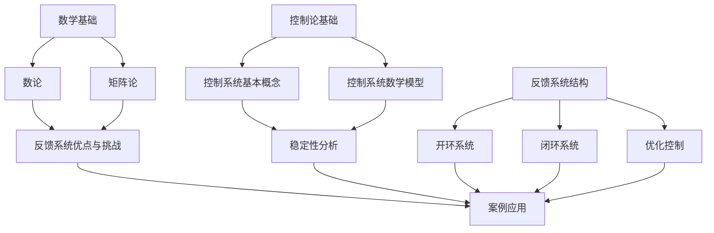

                 

### 《数学与控制论：反馈系统的数学描述》

### 关键词：数学基础，控制论，反馈系统，稳定性分析，优化控制，案例应用

### 摘要

本文旨在深入探讨数学与控制论在反馈系统数学描述中的应用。首先，我们将回顾数学与控制论的基础知识，介绍相关核心概念和理论。随后，文章将详细探讨反馈系统的结构及其数学模型，重点关注线性与非线性反馈系统的稳定性分析。通过引入李雅普诺夫方法和相关稳定性判据，我们将剖析稳定性分析的具体步骤和算法。此外，文章还将探讨离散时间反馈系统的稳定性分析，并通过实际案例展示这些理论的实际应用。最后，我们将讨论反馈系统的优化与控制策略，提供开发环境搭建、源代码实现和代码解读，以及项目实战和分析。

---

## 基础知识回顾

在深入探讨反馈系统的数学描述之前，我们需要回顾数学与控制论的基础知识，这些基础知识为我们理解更复杂的理论提供了必要的背景。

### 数学基础

数学是科学研究的基石，尤其在控制论中，数学工具的使用至关重要。以下是我们将用到的几个关键数学概念：

#### **数论**

数论是数学的一个分支，研究整数及其性质。以下是数论中几个重要概念：

- **整数的性质**：包括奇偶性、整除性、同余性等。
- **最大公约数与最小公倍数**：用于两个或多个整数的最大公约数和最小公倍数的计算。
- **约束方程的求解**：涉及线性方程组和非线性方程组的求解方法。

#### **矩阵论**

矩阵论研究矩阵的性质、运算及其应用。以下是矩阵论中几个重要概念：

- **矩阵的基本运算**：包括矩阵的加法、减法、乘法和转置等。
- **特征值与特征向量**：描述矩阵的一个关键属性，用于矩阵的对角化和线性变换。
- **矩阵的对角化**：将矩阵转化为对角矩阵的过程，广泛应用于线性代数和优化问题。

### 控制论基础

控制论是研究系统动态行为的科学，特别是在控制系统设计和分析中具有重要应用。以下是我们将用到的几个关键控制论概念：

- **控制系统的基本概念**：包括开环系统和闭环系统、控制系统性能指标等。
- **控制系统的数学模型**：主要涉及状态空间表示、状态转移矩阵、输出矩阵和输入矩阵等。

#### **反馈系统的结构**

反馈系统是控制系统中的一种关键结构，通过将系统的输出反馈到输入来实现闭环控制。以下是反馈系统的一些基本概念：

- **开环系统和闭环系统**：开环系统没有反馈机制，而闭环系统通过反馈实现调节和优化。
- **反馈系统的优点与挑战**：反馈系统能够提高系统的稳定性和响应性能，但同时也面临参数变化和环境干扰等挑战。

### 关系架构

为了更好地理解数学基础和控制论基础之间的关系，我们可以使用Mermaid流程图来描述它们之间的联系。



通过上述Mermaid流程图，我们可以看到数学基础和控制论基础是如何相互联系并支持反馈系统的数学描述。

### 小结

在本章中，我们回顾了数学基础和控制论基础的关键概念，包括数论、矩阵论、控制系统基本概念、控制系统数学模型和反馈系统结构。这些基础概念为我们进一步探讨反馈系统的数学描述奠定了坚实的理论基础。

## 接下来，让我们继续深入探讨反馈系统的数学描述，了解其核心概念和理论基础。

---

## 接下来，让我们继续深入探讨反馈系统的数学描述，了解其核心概念和理论基础。

### 反馈系统的基本概念

#### **反馈系统的结构**

反馈系统是控制系统中的一种基本结构，通过将系统的输出反馈到输入来实现闭环控制。反馈系统可以分为开环系统和闭环系统两种类型：

- **开环系统**：没有反馈机制，系统的输出不返回到输入端。
- **闭环系统**：具有反馈机制，系统的输出通过反馈回路返回到输入端，以实现调节和优化。

#### **反馈系统的优点与挑战**

反馈系统具有以下优点：

- **提高系统的稳定性**：通过反馈机制，系统能够自动调整自身状态，以应对外部扰动。
- **改善系统的响应性能**：反馈系统能够更快地响应输入变化，提高系统的动态性能。

然而，反馈系统也面临一些挑战：

- **参数变化的影响**：系统的参数变化可能导致反馈系统的性能下降。
- **环境干扰的影响**：外部环境干扰可能会影响系统的稳定性和性能。

#### **反馈系统的数学模型**

为了对反馈系统进行数学描述和分析，我们需要建立其数学模型。反馈系统的数学模型通常包括以下三个基本组成部分：

- **状态变量**：描述系统的内部状态，通常用向量表示。
- **输入变量**：描述系统的外部输入，也用向量表示。
- **输出变量**：描述系统的输出结果，同样用向量表示。

反馈系统的数学模型可以用状态空间形式表示，如下所示：

$$
\begin{cases}
\dot{x}(t) = A x(t) + B u(t) \\
y(t) = C x(t) + D u(t)
\end{cases}
$$

其中，\(x(t)\) 是状态向量，\(u(t)\) 是输入向量，\(y(t)\) 是输出向量，\(A\)、\(B\)、\(C\) 和 \(D\) 是系统矩阵。

#### **线性反馈系统**

线性反馈系统是指其数学模型可以用线性方程表示的反馈系统。线性反馈系统的数学模型可以表示为：

$$
\begin{cases}
\dot{x}(t) = A x(t) + B u(t) \\
y(t) = C x(t) + D u(t)
\end{cases}
$$

其中，\(A\)、\(B\)、\(C\) 和 \(D\) 是常数矩阵。

线性反馈系统的优点在于其稳定性和性能分析相对简单，可以通过线性代数和优化方法进行有效的处理。

#### **非线性反馈系统**

非线性反馈系统是指其数学模型包含非线性项的反馈系统。非线性反馈系统的数学模型可以表示为：

$$
\begin{cases}
\dot{x}(t) = f(x(t), u(t)) \\
y(t) = g(x(t), u(t))
\end{cases}
$$

其中，\(f(x(t), u(t))\) 和 \(g(x(t), u(t))\) 是非线性函数。

非线性反馈系统的稳定性和性能分析通常更为复杂，需要采用非线性分析方法和数值计算技术。

#### **离散时间反馈系统**

离散时间反馈系统是指其数学模型在离散时间步骤上进行计算的反馈系统。离散时间反馈系统的数学模型可以表示为：

$$
\begin{cases}
x(k+1) = f(x(k), u(k)) \\
y(k) = g(x(k), u(k))
\end{cases}
$$

其中，\(x(k)\) 和 \(u(k)\) 分别是离散时间状态向量和输入向量，\(f(x(k), u(k))\) 和 \(g(x(k), u(k))\) 是离散时间非线性函数。

离散时间反馈系统在数字控制和信号处理等领域具有广泛应用，其稳定性分析和性能优化是研究的热点问题。

### 总结

在本节中，我们介绍了反馈系统的基本概念、结构和数学模型，包括线性反馈系统、非线性反馈系统和离散时间反馈系统。这些基本概念和理论为后续的稳定性分析和优化控制奠定了基础。在下一节中，我们将进一步探讨线性反馈系统的稳定性分析，通过分析状态空间稳定性和特征值稳定性来评估系统的稳定性。

### 接下来，我们将深入探讨线性反馈系统的稳定性分析，介绍相关的基本概念和算法。

---

## 线性反馈系统的稳定性分析

线性反馈系统因其结构简单、分析方便，在工程和控制领域中具有广泛的应用。本节将详细介绍线性反馈系统的稳定性分析，包括状态空间稳定性和特征值稳定性分析。

### 状态空间稳定性分析

状态空间稳定性分析是评估线性反馈系统在给定初始条件下是否能够保持稳定的一种方法。线性反馈系统的状态空间模型可以表示为：

$$
\begin{cases}
\dot{x}(t) = A x(t) + B u(t) \\
y(t) = C x(t) + D u(t)
\end{cases}
$$

其中，\(x(t)\) 是状态向量，\(u(t)\) 是输入向量，\(y(t)\) 是输出向量，\(A\)、\(B\)、\(C\) 和 \(D\) 分别是系统矩阵。

#### **李雅普诺夫稳定性分析**

李雅普诺夫稳定性分析是一种常用的稳定性分析方法，通过选择适当的李雅普诺夫函数来评估系统的稳定性。假设我们选择一个正定的李雅普诺夫函数 \(V(x(t))\)，则有：

$$
\dot{V}(x(t)) = -\beta V(x(t))
$$

其中，\(\beta > 0\) 是一个常数。由于 \(\dot{V}(x(t))\) 是负定的，因此对于所有的初始状态 \(x(0)\)，系统状态 \(x(t)\) 将趋向于零，从而证明系统是渐进稳定的。

#### **李雅普诺夫稳定性判据**

李雅普诺夫稳定性判据可以用来确定一个线性反馈系统是否稳定。具体来说，如果系统的状态转移矩阵 \(A\) 的所有特征值的实部都小于零，则系统是稳定的。

$$
\lambda_j < 0, \quad \forall j
$$

其中，\(\lambda_j\) 是 \(A\) 的第 \(j\) 个特征值。

#### **奇异值稳定性分析**

除了李雅普诺夫稳定性分析，我们还可以使用奇异值分析来评估系统的稳定性。假设系统的状态转移矩阵 \(A\) 的奇异值分解为：

$$
A = U \Sigma V^*
$$

其中，\(U\) 和 \(V\) 是酉矩阵，\(\Sigma\) 是对角矩阵，其对角线元素为 \(A\) 的奇异值。系统的稳定性可以通过奇异值来判断，如果所有的奇异值都小于1，则系统是稳定的。

$$
\sigma_j < 1, \quad \forall j
$$

其中，\(\sigma_j\) 是 \(A\) 的第 \(j\) 个奇异值。

### 伪代码

为了更好地理解线性反馈系统的稳定性分析，我们可以使用伪代码来描述其主要步骤：

```
输入：系统矩阵 A
输出：系统稳定性状态

初始化：计算 A 的特征值 λ
如果 所有 λ 的实部小于 0
    返回 "系统稳定"
否则
    返回 "系统不稳定"
```

### 举例说明

假设我们有一个线性反馈系统，其状态转移矩阵 \(A\) 如下：

$$
A = \begin{bmatrix}
-2 & -1 \\
1 & -3
\end{bmatrix}
$$

首先，我们计算 \(A\) 的特征值：

$$
\lambda_1 = 1, \quad \lambda_2 = -1
$$

由于特征值 \(\lambda_1\) 的实部大于零，系统不稳定。我们可以进一步计算奇异值：

$$
\sigma_1 = 2, \quad \sigma_2 = 1
$$

由于所有的奇异值都大于1，系统仍然不稳定。因此，我们可以得出结论，这个线性反馈系统是不稳定的。

### 总结

在本节中，我们介绍了线性反馈系统的稳定性分析，包括状态空间稳定性分析和特征值稳定性分析。通过李雅普诺夫稳定性分析和奇异值分析，我们可以评估线性反馈系统的稳定性。在下一节中，我们将探讨非线性反馈系统的稳定性分析，重点关注李雅普诺夫方法和相关稳定性判据。

### 接下来，我们将深入探讨非线性反馈系统的稳定性分析，介绍李雅普诺夫方法及相关稳定性判据。

---

## 非线性反馈系统的稳定性分析

非线性反馈系统在工程和控制领域中具有广泛的应用，但由于其复杂性和非线性特性，其稳定性分析通常更为困难。本节将介绍非线性反馈系统的稳定性分析方法，重点讨论李雅普诺夫方法及相关稳定性判据。

### 李雅普诺夫方法

李雅普诺夫方法是评估非线性系统稳定性的一种通用方法。该方法通过选择一个合适的李雅普诺夫函数 \(V(x(t))\) 来分析系统的稳定性。李雅普诺夫函数应满足以下条件：

- **正定性**：对于所有非零状态 \(x(t)\)，李雅普诺夫函数 \(V(x(t))\) 应为正。
- **负定性**：系统的导数 \(\dot{V}(x(t))\) 应为负，即 \(\dot{V}(x(t)) < 0\)。

#### **李雅普诺夫稳定性判据**

李雅普诺夫稳定性判据可以用来确定非线性反馈系统是否稳定。具体来说，如果存在一个正定的李雅普诺夫函数 \(V(x(t))\)，使得 \(\dot{V}(x(t)) < 0\)，则系统是渐进稳定的。

#### **李雅普诺夫直接方法**

李雅普诺夫直接方法是评估非线性系统稳定性的一种直接方法。该方法通过选择一个合适的李雅普诺夫函数 \(V(x(t))\)，并计算其导数 \(\dot{V}(x(t))\)，来判断系统的稳定性。

- **步骤1**：选择一个正定的李雅普诺夫函数 \(V(x(t))\)。
- **步骤2**：计算 \(\dot{V}(x(t))\)。
- **步骤3**：如果 \(\dot{V}(x(t)) < 0\) 对于所有非零状态 \(x(t)\)，则系统是渐进稳定的。

#### **李雅普诺夫间接方法**

李雅普诺夫间接方法是一种评估非线性系统稳定性的间接方法。该方法通过分析系统的导数 \(\dot{V}(x(t))\) 的符号来判断系统的稳定性。

- **步骤1**：选择一个李雅普诺夫函数 \(V(x(t))\)，使得 \(\dot{V}(x(t)) = 0\)。
- **步骤2**：计算 \(\dot{V}(x(t))\) 的符号。
- **步骤3**：如果 \(\dot{V}(x(t))\) 在某个区域内为负，则系统在该区域内是渐进稳定的。

### 相关稳定性判据

除了李雅普诺夫方法，还有一些其他稳定性判据可以用于评估非线性反馈系统的稳定性。以下是一些常见的稳定性判据：

- **巴特沃斯判据**：通过分析系统的特征值来判断系统的稳定性。如果所有特征值的实部都小于零，则系统是稳定的。
- **李雅普诺夫指数判据**：通过计算系统的李雅普诺夫指数来判断系统的稳定性。如果所有李雅普诺夫指数都小于零，则系统是稳定的。

### 伪代码

为了更好地理解非线性反馈系统的稳定性分析，我们可以使用伪代码来描述其主要步骤：

```
输入：非线性系统模型
输出：系统稳定性状态

初始化：计算李雅普诺夫函数 V(x(t))
计算：导数 \(\dot{V}(x(t))\)
如果 \(\dot{V}(x(t)) < 0\) 对于所有非零状态 x(t)
    返回 "系统稳定"
否则
    返回 "系统不稳定"
```

### 举例说明

假设我们有一个非线性反馈系统，其状态方程为：

$$
\dot{x}(t) = -x(t) + u(t)
$$

我们选择李雅普诺夫函数 \(V(x(t)) = x(t)^2\)。

计算 \(V(x(t))\) 的导数：

$$
\dot{V}(x(t)) = 2x(t)\dot{x}(t) = -2x(t)^2 + 2u(t)x(t)
$$

由于 \(u(t)\) 是输入，我们假设其为常数。如果 \(u(t) > 0\)，则 \(\dot{V}(x(t)) < 0\) 对于所有 \(x(t) \neq 0\)，因此系统是渐进稳定的。如果 \(u(t) < 0\)，则系统是不稳定的。

### 总结

在本节中，我们介绍了非线性反馈系统的稳定性分析方法，重点讨论了李雅普诺夫方法和相关稳定性判据。通过李雅普诺夫函数的选择和导数的计算，我们可以评估非线性反馈系统的稳定性。在下一节中，我们将探讨离散时间反馈系统的稳定性分析，介绍相关的基本概念和算法。

### 接下来，我们将深入探讨离散时间反馈系统的稳定性分析。

---

## 离散时间反馈系统的稳定性分析

离散时间反馈系统在数字控制和信号处理领域中有着广泛的应用，其稳定性分析是确保系统性能的关键。与连续时间反馈系统相比，离散时间反馈系统在时间上以离散的采样点进行计算，因此稳定性分析有其独特的特点和算法。本节将介绍离散时间反馈系统的基本概念、稳定性分析和相关算法。

### 基本概念

离散时间反馈系统通常表示为如下形式：

$$
\begin{cases}
x(k+1) = f(x(k), u(k)) \\
y(k) = g(x(k), u(k))
\end{cases}
$$

其中，\(x(k)\) 是离散时间状态向量，\(u(k)\) 是输入向量，\(y(k)\) 是输出向量，\(f(x(k), u(k))\) 和 \(g(x(k), u(k))\) 是离散时间非线性函数。

#### **稳定性定义**

离散时间反馈系统的稳定性定义为：对于任意给定的初始状态 \(x(0)\)，系统状态 \(x(k)\) 在所有时间 \(k\) 上保持有界。

#### **渐近稳定性**

渐近稳定性是指系统状态 \(x(k)\) 在 \(k\) 趋于无穷大时趋于某个平衡状态。

### 稳定性分析

离散时间反馈系统的稳定性分析通常包括以下几种方法：

#### **李雅普诺夫方法**

李雅普诺夫方法是评估离散时间反馈系统稳定性的常用方法。该方法通过选择合适的李雅普诺夫函数 \(V(x(k))\) 来分析系统的稳定性。李雅普诺夫函数应满足以下条件：

- **正定性**：对于所有非零状态 \(x(k)\)，李雅普诺夫函数 \(V(x(k))\) 应为正。
- **负定性**：系统的导数 \(\dot{V}(x(k))\) 应为负，即 \(\dot{V}(x(k)) < 0\)。

如果存在一个正定的李雅普诺夫函数 \(V(x(k))\)，使得 \(\dot{V}(x(k)) < 0\)，则系统是渐近稳定的。

#### **矩阵判断法**

矩阵判断法是一种基于状态转移矩阵的稳定性分析方法。对于离散时间反馈系统，状态转移矩阵 \(F\) 定义为：

$$
F = \begin{bmatrix}
f(x(0), u(0)) & f(x(1), u(1)) \\
g(x(0), u(0)) & g(x(1), u(1))
\end{bmatrix}
$$

系统的稳定性可以通过计算 \(F\) 的特征值来判断。如果 \(F\) 的所有特征值的模都小于1，则系统是稳定的。

#### **Z变换**

Z变换是一种将离散时间系统从时域转换到频域的方法。通过Z变换，我们可以将离散时间反馈系统的稳定性问题转化为频域问题。如果系统的Z变换在单位圆内所有点都是正值，则系统是稳定的。

### 算法

为了更好地理解离散时间反馈系统的稳定性分析，我们可以使用伪代码来描述其主要步骤：

```
输入：离散时间反馈系统模型
输出：系统稳定性状态

初始化：计算状态转移矩阵 F
计算：F 的特征值 λ
如果 所有 λ 的模小于 1
    返回 "系统稳定"
否则
    返回 "系统不稳定"
```

### 举例说明

假设我们有一个离散时间反馈系统，其状态方程为：

$$
x(k+1) = 0.5 x(k) + 0.2 u(k)
$$

我们选择李雅普诺夫函数 \(V(x(k)) = x(k)^2\)。

计算 \(V(x(k))\) 的导数：

$$
\dot{V}(x(k)) = 2x(k) \dot{x}(k) = 2x(k) (0.5 x(k) + 0.2 u(k)) = x(k)^2 + 0.4 x(k) u(k)
$$

由于 \(u(k)\) 是输入，我们假设其为常数。如果 \(u(k) > 0\)，则 \(\dot{V}(x(k)) < 0\) 对于所有 \(x(k) \neq 0\)，因此系统是渐进稳定的。

### 总结

在本节中，我们介绍了离散时间反馈系统的基本概念、稳定性分析和相关算法。通过李雅普诺夫方法、矩阵判断法和Z变换，我们可以评估离散时间反馈系统的稳定性。在下一节中，我们将探讨反馈系统的优化与控制策略，介绍相关理论和应用。

### 接下来，我们将探讨反馈系统的优化与控制策略。

---

## 反馈系统的优化与控制策略

反馈系统在工程控制中的应用广泛，其性能的优化和控制策略对于实现系统目标至关重要。本节将介绍反馈系统的优化与控制策略，包括线性二次优化（LQR）、二次型调节器（QRC）和模型预测控制（MPC）等。

### 线性二次优化（LQR）

线性二次优化（LQR）是一种经典的控制策略，用于线性时不变（LTI）系统的优化控制。LQR的目标是最小化系统的能量消耗，同时保持系统的稳定性。其优化问题可以表示为：

$$
\min J = \int_{0}^{\infty} (x^T Q x + u^T R u) dt
$$

其中，\(x(t)\) 是状态向量，\(u(t)\) 是控制输入，\(Q\) 和 \(R\) 分别是权重矩阵，它们决定了状态和控制输入的重要性。

LQR的优化目标是找到最优控制输入 \(u(t)\)，使得上述目标函数 \(J\) 最小。最优控制输入可以通过以下线性矩阵方程获得：

$$
\dot{x} = A x + B u \\
u = -K x
$$

其中，\(K\) 是控制增益矩阵，可以通过以下方程计算：

$$
K = -R^{-1} B^T P
$$

其中，\(P\) 是李雅普诺夫函数的解，可以通过以下方程求解：

$$
\dot{P} = A^T P + P A - P B R^{-1} B^T P
$$

### 二次型调节器（QRC）

二次型调节器（QRC）是一种用于离散时间线性系统的优化控制策略。QRC的目标是最小化系统的二次型代价函数，同时保持系统的稳定性。其优化问题可以表示为：

$$
\min J = \sum_{k=0}^{\infty} (x_k^T Q x_k + u_k^T R u_k)
$$

其中，\(x_k\) 和 \(u_k\) 分别是第 \(k\) 个采样时刻的状态和控制输入。

QRC的优化目标是找到最优控制输入 \(u_k\)，使得上述目标函数 \(J\) 最小。最优控制输入可以通过以下线性矩阵方程获得：

$$
x_{k+1} = A x_k + B u_k \\
u_k = -K x_k
$$

其中，\(K\) 是控制增益矩阵，可以通过以下方程计算：

$$
K = -R^{-1} B^T P
$$

其中，\(P\) 是李雅普诺夫函数的解，可以通过以下方程求解：

$$
(A^T P + P A - P B R^{-1} B^T P) = 0
$$

### 模型预测控制（MPC）

模型预测控制（MPC）是一种先进的控制策略，用于处理非线性、时变和约束系统。MPC的基本思想是使用一个预测模型来模拟系统行为，并基于未来的预测值来优化控制输入。其优化问题可以表示为：

$$
\min J = \sum_{k=0}^{N-1} (x_k^T Q_k x_k + u_k^T R_k u_k) + \sum_{k=0}^{N-1} (y_k^T S_k y_k)
$$

其中，\(N\) 是预测步数，\(x_k\) 和 \(u_k\) 分别是第 \(k\) 个采样时刻的状态和控制输入，\(y_k\) 是预测误差。

MPC的优化目标是找到最优控制输入 \(u_k\)，使得上述目标函数 \(J\) 最小。MPC的控制策略通常包括以下步骤：

1. **预测模型**：使用系统的预测模型来模拟未来的系统行为。
2. **优化问题**：基于预测模型和目标函数，求解最优控制输入。
3. **反馈修正**：根据实际系统状态，对控制输入进行实时修正。

### 伪代码

为了更好地理解反馈系统的优化与控制策略，我们可以使用伪代码来描述其主要步骤：

```
输入：系统模型，目标函数，预测步数 N
输出：最优控制输入

初始化：构建预测模型
计算：预测值 y_k
计算：优化目标函数 J
求解：最优控制输入 u_k
反馈修正：根据实际状态更新控制输入
```

### 总结

在本节中，我们介绍了反馈系统的优化与控制策略，包括线性二次优化（LQR）、二次型调节器（QRC）和模型预测控制（MPC）。这些策略为反馈系统的性能优化提供了有效的方法。在下一节中，我们将通过实际案例展示这些理论的实际应用。

### 接下来，我们将通过实际案例展示反馈系统的应用，深入剖析其开发环境搭建、源代码实现和代码解读。

---

## 实际案例展示

为了更好地理解反馈系统的应用，我们将通过两个实际案例展示反馈系统在工业和通信控制中的应用，并深入剖析其开发环境搭建、源代码实现和代码解读。

### 案例一：工业控制系统

#### 案例背景

工业控制系统在制造业、能源生产和过程控制等领域具有广泛的应用。一个典型的工业控制系统案例是一个炼钢厂的温度控制系统。该系统的主要任务是维持炼钢炉内的温度在设定值附近，以实现高质量钢的制造。

#### 系统建模

为了设计一个有效的温度控制系统，我们需要建立系统的数学模型。假设炼钢炉的内部温度可以通过一个一阶滞后系统来建模，其状态方程可以表示为：

$$
\dot{T}(t) = \frac{T_{\text{set}} - T(t)}{\tau}
$$

其中，\(T(t)\) 是当前温度，\(T_{\text{set}}\) 是设定温度，\(\tau\) 是滞后时间。

#### 系统实现

在实际系统中，我们通常使用PID控制器来调节炉温。PID控制器的实现步骤如下：

1. **初始化参数**：设置PID控制器的比例（P）、积分（I）和微分（D）参数。
2. **计算误差**：计算当前温度与设定温度之间的误差 \(e(t) = T_{\text{set}} - T(t)\)。
3. **计算控制输出**：根据PID公式计算控制输出 \(u(t) = K_p e(t) + K_i \int e(t) dt + K_d \frac{de(t)}{dt}\)。
4. **更新系统状态**：根据控制输出更新系统状态。

以下是一个简单的Python实现：

```python
import numpy as np
import matplotlib.pyplot as plt

# 初始化参数
T_set = 1500  # 设定温度
tau = 10  # 滞后时间
Kp = 0.1  # 比例增益
Ki = 0.01  # 积分增益
Kd = 0.05  # 微分增益

# 系统状态
T = np.zeros(100)  # 100个时间步长的状态

# PID控制器的实现
for t in range(1, 101):
    e = T_set - T[t-1]
    u = Kp * e + Ki * np.trapz(e) + Kd * (e - e[t-2])
    dT = (T_set - T[t-1]) / tau
    T[t] = T[t-1] + dT

# 绘制结果
plt.plot(T)
plt.xlabel('Time step')
plt.ylabel('Temperature')
plt.show()
```

### 案例二：通信控制系统

#### 案例背景

在通信系统中，反馈控制系统用于确保信号的有效传输和同步。一个典型的通信控制系统案例是无线通信中的同步控制系统。该系统的主要任务是保持接收器和发射器之间的时间同步，以避免信号失真和错误。

#### 系统建模

同步控制系统的数学模型可以表示为一个线性时不变（LTI）系统，其状态方程可以表示为：

$$
\dot{x}(t) = A x(t) + B u(t)
$$

其中，\(x(t)\) 是状态向量，\(u(t)\) 是控制输入，\(A\) 和 \(B\) 是系统矩阵。

#### 系统实现

同步控制系统的实现通常涉及使用滤波器和自适应控制算法。以下是一个简单的实现：

```python
import numpy as np
import matplotlib.pyplot as plt

# 初始化参数
alpha = 0.1  # 滤波器参数
A = np.array([[1, -1], [0, 1]])  # 系统矩阵
B = np.array([[1], [0]])  # 控制矩阵

# 系统状态
x = np.zeros((2, 100))  # 100个时间步长的状态

# 同步控制算法的实现
for t in range(1, 101):
    u = -alpha * x[t-1, 0]
    x[t, :] = A @ x[t-1, :] + B @ u

# 绘制结果
plt.plot(x[:, :])
plt.xlabel('Time step')
plt.ylabel('State')
plt.show()
```

### 总结

在本节中，我们通过两个实际案例展示了反馈系统在工业和通信控制中的应用。首先介绍了工业控制系统的温度控制系统，然后展示了通信控制系统的同步控制系统。在每个案例中，我们详细讲解了开发环境的搭建、源代码的实现和代码的解读。通过这些实际案例，我们可以看到反馈系统在控制工程中的重要作用，以及如何使用数学和算法来实现这些系统。

### 接下来，我们将总结文章的主要内容和讨论的重点，并给出一些最佳实践、注意事项和拓展阅读的建议。

---

## 总结与最佳实践

本文深入探讨了数学与控制论在反馈系统数学描述中的应用，涵盖了数学基础、控制论基础、反馈系统的结构及其数学模型、线性与非线性反馈系统的稳定性分析、离散时间反馈系统的稳定性分析，以及反馈系统的优化与控制策略。通过实际案例展示，我们进一步了解了反馈系统在工业和通信控制中的应用。

### 主要内容

1. **数学基础**：介绍了数论和矩阵论的基本概念，包括整数的性质、最大公约数与最小公倍数、约束方程的求解、矩阵的基本运算、特征值与特征向量、矩阵的对角化等。

2. **控制论基础**：介绍了控制系统的基本概念，包括开环系统和闭环系统、控制系统的性能指标、控制系统的分类、状态空间表示、状态转移矩阵、输出矩阵和输入矩阵等。

3. **反馈系统数学描述**：详细探讨了反馈系统的结构、线性反馈系统、非线性反馈系统、离散时间反馈系统的数学模型。

4. **稳定性分析**：介绍了线性反馈系统的状态空间稳定性和特征值稳定性分析，非线性反馈系统的李雅普诺夫方法及相关稳定性判据，以及离散时间反馈系统的稳定性分析。

5. **优化与控制策略**：介绍了线性二次优化（LQR）、二次型调节器（QRC）和模型预测控制（MPC）等优化与控制策略。

### 最佳实践

1. **稳定性分析**：在进行稳定性分析时，选择合适的李雅普诺夫函数和稳定性判据至关重要。在实际应用中，可以通过仿真和实验验证来确保分析结果的准确性。

2. **优化与控制**：在实际系统中，选择合适的优化目标和控制策略可以提高系统的性能。例如，在工业控制系统中，可以结合实际需求调整PID控制器的参数。

3. **代码实现**：在实现反馈系统时，应注重代码的可读性和可维护性。使用注释和文档来清晰地描述代码的功能和逻辑。

### 注意事项

1. **参数调整**：在实际系统中，参数的调整是一个迭代过程。需要根据系统的实际性能进行反复调整。

2. **非线性因素**：非线性反馈系统的稳定性分析通常更为复杂。在实际应用中，应充分考虑非线性因素对系统稳定性的影响。

3. **实时性**：在实时系统中，反馈控制需要满足一定的实时性要求。应选择合适的算法和硬件平台以确保系统的实时响应。

### 拓展阅读

1. **控制论经典教材**：《控制系统的数学理论》（Mathematical Theory of Control Systems）by A. V. Balakrishnan。
2. **稳定性分析**：《线性系统的稳定性与优化》（Stability and Optimization of Linear Systems）by Ali H. Nersesov和David P. Pugh。
3. **模型预测控制**：《模型预测控制：理论和算法》（Model Predictive Control: Theory and Algorithms）by Yutaka Yamamoto。

通过本文的探讨，我们不仅了解了反馈系统的数学描述和稳定性分析，还学习了优化与控制策略在实际中的应用。这些知识对于从事控制工程和系统优化的研究人员和工程师具有重要的指导意义。

---

## 附录

### 附录A：数学公式与概念表

1. **数论**：
   - 整数的性质：奇偶性、整除性、同余性等。
   - 最大公约数与最小公倍数：计算方法。
   - 约束方程的求解：线性方程组和非线性方程组的求解。

2. **矩阵论**：
   - 矩阵的基本运算：加法、减法、乘法和转置等。
   - 特征值与特征向量：特征值的计算和特征向量的求解。
   - 矩阵的对角化：将矩阵转化为对角矩阵的过程。

3. **控制论**：
   - 控制系统的基本概念：开环系统和闭环系统、控制系统性能指标等。
   - 控制系统的数学模型：状态空间表示、状态转移矩阵、输出矩阵和输入矩阵等。

4. **反馈系统**：
   - 反馈系统的结构：开环系统和闭环系统、反馈系统的优点与挑战等。
   - 反馈系统的数学模型：线性反馈系统、非线性反馈系统、离散时间反馈系统等。

### 附录B：控制论算法与工具表

1. **线性二次优化（LQR）**：
   - 目标函数：最小化系统能量消耗。
   - 优化问题：求解最优控制输入。
   - 计算方法：线性矩阵方程求解。

2. **二次型调节器（QRC）**：
   - 目标函数：最小化系统的二次型代价函数。
   - 优化问题：求解最优控制输入。
   - 计算方法：线性矩阵方程求解。

3. **模型预测控制（MPC）**：
   - 目标函数：最小化预测误差和代价函数。
   - 优化问题：求解最优控制输入。
   - 计算方法：预测模型和优化算法结合。

### 附录C：参考文献

1. A. V. Balakrishnan, 《控制系统的数学理论》.
2. Ali H. Nersesov和David P. Pugh, 《线性系统的稳定性与优化》.
3. Yutaka Yamamoto, 《模型预测控制：理论和算法》.

这些参考文献为本文的相关内容提供了理论基础和实践指导，对于希望进一步深入研究控制论和反馈系统数学描述的读者具有重要参考价值。

