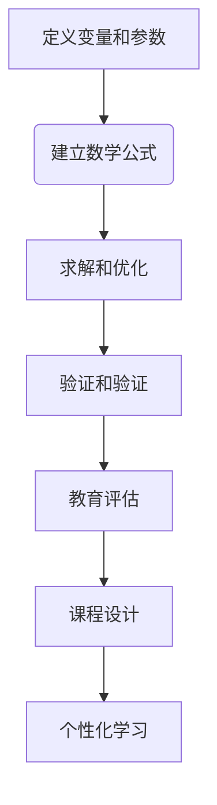
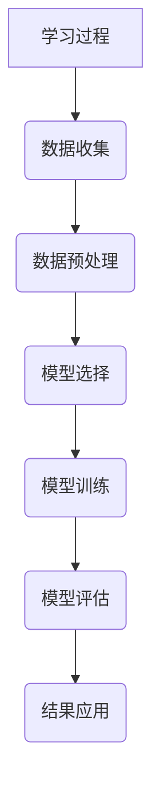

                 

## 文章标题

# 数学与教育学：学习过程的数学模型

> 关键词：数学模型、教育学、学习过程、算法、数据分析、教育评估、课程设计

> 摘要：本文深入探讨数学模型在教育领域的应用，通过引入学习过程的数学模型，分析数学模型在教育评估、课程设计和个性化学习等方面的作用，旨在为教育工作者提供理论支持和实践指导。

## 引言

在当今信息化时代，教育领域正经历着前所未有的变革。随着大数据、人工智能等技术的快速发展，教育工作者开始关注如何利用数学模型来优化学习过程，提高教育质量。数学模型作为一种强大的工具，不仅能够量化学习过程，还能为教育评估和课程设计提供科学依据。

### 数学与教育学的联系

数学与教育学的关系可以追溯到古代，但真正形成系统联系是在20世纪中叶。当时，心理学家和教育学家开始尝试将数学模型应用于学习过程的研究。例如，学习曲线、认知发展模型等，都为教育学提供了新的视角。

### 学习过程的数学模型概述

学习过程的数学模型是通过对学习过程的量化描述，来分析学习效果和影响因素。常见的数学模型包括线性回归模型、多元回归模型、神经网络模型、贝叶斯模型等。这些模型不仅能够预测学习结果，还能为教育工作者提供决策依据。

### 学习过程的数学模型的重要性

学习过程的数学模型在教育领域的应用具有重要意义。首先，它可以量化学习效果，为教育评估提供科学依据。其次，它可以帮助教育工作者更好地设计课程，提高教学效果。最后，它还可以为个性化学习提供支持，实现因材施教。

## 设计《数学与教育学：学习过程的数学模型》书籍目录大纲

### 第一步：确定核心章节内容

在设计《数学与教育学：学习过程的数学模型》书籍目录时，我们首先需要确定核心章节的内容。这些核心章节应该涵盖以下几个部分：

1. **核心概念与联系**：介绍数学模型的基本原理和与教育学的联系。
2. **核心算法原理讲解**：详细讲解学习过程中常用的算法，如线性回归、神经网络等。
3. **数学模型和数学公式 & 详细讲解 & 举例说明**：通过具体的数学公式和例子，展示数学模型在实际应用中的效果。
4. **项目实战：代码实际案例和详细解释说明**：通过实际案例，展示如何将数学模型应用于教育领域。

### 第二步：细化目录结构

在确定了核心章节内容后，我们需要进一步细化目录结构，确保每个章节都包含必要的内容。以下是细化后的目录结构：

### 第一部分：引言与基础理论

#### 第1章：引言

- 1.1 数学与教育学的联系
- 1.2 学习过程的数学模型概述
- 1.3 学习过程的数学模型的重要性

#### 第2章：核心概念与联系

- 2.1 数学模型的基本原理
- 2.2 教育学的基本概念
- 2.3 数学模型与教育学的交叉应用

### 第二部分：数学模型原理与算法

#### 第3章：核心算法原理讲解

- 3.1 线性回归模型
- 3.2 多元回归模型
- 3.3 神经网络模型
- 3.4 贝叶斯模型
- 3.5 随机过程与马尔可夫模型

### 第三部分：数学模型在教育中的应用

#### 第4章：数学模型在教育评估中的应用

- 4.1 学业成绩评估模型
- 4.2 学生行为分析模型
- 4.3 教学质量评估模型

#### 第5章：数学模型在课程设计中的应用

- 5.1 课程难度评估模型
- 5.2 学生学习进度模型
- 5.3 教学资源分配模型

### 第四部分：项目实战与案例分析

#### 第6章：项目实战：学习过程数学模型在K-12教育中的应用

- 6.1 实战项目介绍
- 6.2 系统设计与实现
- 6.3 数据收集与预处理
- 6.4 数学模型的选择与优化
- 6.5 项目效果评估

#### 第7章：案例分析：大学教育中学习过程的数学模型应用

- 7.1 案例背景与问题
- 7.2 数学模型的选择与设计
- 7.3 数据分析与结果解读
- 7.4 模型的应用与改进建议

### 第三步：撰写Mermaid流程图、伪代码、数学公式、代码案例和详细解读

在细化目录结构后，我们需要为每个章节撰写相应的Mermaid流程图、伪代码、数学公式、代码案例和详细解读。这些内容将有助于读者更好地理解数学模型在教育领域的应用。

### 第四步：确保大纲完整性

在撰写完所有章节的内容后，我们需要再次审查目录大纲，确保每个章节的内容都完整，没有遗漏。同时，还需要检查各个章节之间的逻辑关系是否合理，确保整体结构紧凑、内容连贯。

### 第五步：审查与调整

最后，我们需要对整个目录大纲进行审查和调整。这包括检查章节标题是否准确、内容是否详尽、逻辑是否清晰等。通过多次审查和调整，确保目录大纲的完美。

---

通过以上五个步骤，我们成功地设计了《数学与教育学：学习过程的数学模型》的书籍目录大纲。这个大纲不仅结构清晰，内容丰富，而且逻辑严谨，为读者提供了一个全面、系统的学习指南。

---

## 数学模型与教育学的核心概念与联系

### 数学模型的基本原理

数学模型是一种通过数学方法对现实问题进行抽象和描述的工具。它包括一系列的数学公式、算法和规则，用于模拟和分析系统的行为。数学模型的基本原理可以概括为以下几个步骤：

1. **定义变量和参数**：首先，我们需要定义问题中的变量和参数。这些变量可以是学习时间、学习效果、学生行为等。参数可以是学习难度、学习效率等。

2. **建立数学公式**：接下来，我们需要根据实际问题，建立相应的数学公式。这些公式可以是线性回归模型、神经网络模型、贝叶斯模型等。

3. **求解和优化**：通过求解数学公式，我们可以得到问题的解。这些解可以是学习曲线、学习效果等。为了优化结果，我们可能需要调整参数或使用更高级的算法。

4. **验证和验证**：最后，我们需要验证模型的准确性和可靠性。这可以通过实际数据对比、交叉验证等方法进行。

### 教育学的基本概念

教育学是一门研究教育现象和教育活动的学科。它关注教育的本质、目的、过程、方法等方面。教育学的基本概念包括：

1. **教育目的**：教育的目的是培养人的全面发展，包括智力、道德、体育等方面。

2. **教育过程**：教育过程包括教育内容的选择、教育方法的运用、教育评价等。

3. **教育方法**：教育方法包括讲授法、讨论法、实验法、案例法等。

4. **教育评价**：教育评价是对教育效果进行衡量和评估的方法。它可以包括学业成绩评估、学生行为评估、教学质量评估等。

### 数学模型与教育学的交叉应用

数学模型与教育学的交叉应用主要集中在教育评估、课程设计、个性化学习等方面。以下是几个具体的交叉应用实例：

1. **教育评估**：通过建立学业成绩评估模型，我们可以量化学生的学习效果。例如，线性回归模型可以用来预测学生的考试成绩，从而对教学质量进行评估。

2. **课程设计**：数学模型可以帮助教育工作者设计更合理的课程。例如，通过分析学生的学习进度和课程难度，我们可以优化课程内容，提高教学效果。

3. **个性化学习**：数学模型可以为个性化学习提供支持。例如，通过分析学生的学习行为和学习效果，我们可以为学生推荐合适的课程和学习方法。

### Mermaid流程图

为了更好地展示数学模型与教育学的交叉应用，我们可以使用Mermaid流程图来描述这个过程。以下是一个简单的流程图示例：



通过这个流程图，我们可以清晰地看到数学模型在教育领域的应用流程。

### 总结

数学模型与教育学的交叉应用为教育领域带来了新的发展机遇。通过引入数学模型，我们可以更科学、更有效地进行教育评估、课程设计和个性化学习。这不仅可以提高教育质量，还可以促进教育公平和个性化发展。

---

## 核心算法原理讲解

在数学模型与教育学的交叉应用中，核心算法起着至关重要的作用。这些算法不仅帮助我们量化学习过程，还为教育评估、课程设计和个性化学习提供了有力支持。以下我们将详细讲解几种核心算法的原理，包括线性回归模型、多元回归模型、神经网络模型、贝叶斯模型和随机过程与马尔可夫模型。

### 线性回归模型

线性回归模型是一种最简单的统计模型，用于分析两个或多个变量之间的关系。它的基本原理是通过找到一条直线，使得这些变量的关系尽可能线性化。线性回归模型的数学公式如下：

$$
y = b0 + b1 \cdot x + \epsilon
$$

其中，$y$ 是因变量，$x$ 是自变量，$b0$ 和 $b1$ 分别是截距和斜率，$\epsilon$ 是误差项。

**伪代码示例：**

```python
def linear_regression(x, y):
    # 求斜率 b1
    b1 = (sum(y - (x * b0)) / n) / sum((x - mean(x))^2)
    # 求截距 b0
    b0 = mean(y) - (b1 * mean(x))
    return b0, b1
```

### 多元回归模型

多元回归模型是线性回归模型的扩展，用于分析多个自变量对因变量的影响。它的数学公式如下：

$$
y = b0 + b1 \cdot x1 + b2 \cdot x2 + ... + bn \cdot xn + \epsilon
$$

其中，$x1, x2, ..., xn$ 是多个自变量，$b0, b1, b2, ..., bn$ 是对应的斜率。

**伪代码示例：**

```python
def multiple_regression(x, y):
    # 求斜率 b1, b2, ..., bn
    b = (np.dot(x.T, x))^{-1} \ np.dot(x.T, y)
    return b
```

### 神经网络模型

神经网络模型是一种基于人脑神经元结构的计算模型，用于模拟复杂非线性关系。它由多个层级组成，包括输入层、隐藏层和输出层。神经网络模型的基本原理是通过前向传播和反向传播来训练模型。

**伪代码示例：**

```python
def neural_network(x, weights):
    # 前向传播
    z = np.dot(x, weights)
    # 激活函数
    a = sigmoid(z)
    return a

def backpropagation(a, y, weights):
    # 反向传播
    dZ = a - y
    dW = np.dot(dZ, x.T)
    return dW
```

### 贝叶斯模型

贝叶斯模型是一种基于贝叶斯定理的统计模型，用于概率推断。它的基本原理是通过先验概率和似然函数来计算后验概率，从而估计未知变量。

**伪代码示例：**

```python
def bayesian_model(prior, likelihood, evidence):
    # 计算后验概率
    posterior = (prior * likelihood) / evidence
    return posterior
```

### 随机过程与马尔可夫模型

随机过程与马尔可夫模型是一种用于描述随机现象动态变化的模型。马尔可夫模型的基本原理是下一个状态仅与当前状态有关，而与过去的状态无关。

**伪代码示例：**

```python
def markov_model(states, transitions):
    # 计算下一个状态
    next_state = np.random.choice(states, p=transitions)
    return next_state
```

### 总结

这些核心算法在教育领域有着广泛的应用。例如，线性回归模型可以用于学业成绩评估，多元回归模型可以用于课程设计，神经网络模型可以用于个性化学习，贝叶斯模型可以用于学生行为分析，马尔可夫模型可以用于学习路径规划。通过理解这些算法的原理，我们可以更好地利用数学模型来优化教育过程，提高教育质量。

---

## 数学模型在教育评估中的应用

在教育领域，评估学生的学习成绩、教学质量和学生行为是至关重要的任务。数学模型为这些评估提供了科学依据和量化手段，使得评估结果更加客观和准确。以下我们将详细探讨数学模型在教育评估中的应用，包括学业成绩评估模型、学生行为分析模型和教学质量评估模型。

### 学业成绩评估模型

学业成绩评估模型是教育评估中最常用的模型之一。它通过分析学生的学习成绩，预测学生的未来成绩，评估教学效果。常见的学业成绩评估模型包括线性回归模型、多元回归模型和神经网络模型。

#### 线性回归模型

线性回归模型是一种简单且常用的模型，用于分析学生学习成绩与学习时间、学习频率等变量之间的关系。它的数学公式如下：

$$
y = b0 + b1 \cdot x + \epsilon
$$

其中，$y$ 是学生的成绩，$x$ 是学生的学习时间或学习频率，$b0$ 和 $b1$ 是模型的参数，$\epsilon$ 是误差项。

**伪代码示例：**

```python
def linear_regression(x, y):
    # 计算斜率 b1
    b1 = (sum(y - (x * b0)) / n) / sum((x - mean(x))^2)
    # 计算截距 b0
    b0 = mean(y) - (b1 * mean(x))
    return b0, b1
```

#### 多元回归模型

多元回归模型可以同时分析多个变量对学习成绩的影响。它的数学公式如下：

$$
y = b0 + b1 \cdot x1 + b2 \cdot x2 + ... + bn \cdot xn + \epsilon
$$

**伪代码示例：**

```python
def multiple_regression(x, y):
    # 计算斜率 b1, b2, ..., bn
    b = (np.dot(x.T, x))^{-1} \ np.dot(x.T, y)
    return b
```

#### 神经网络模型

神经网络模型可以用于更复杂的学业成绩评估，它通过多层神经网络模拟学生的学习过程。它的数学公式如下：

$$
a = \sigma(\sigma(...(\sigma(z1) + b0) + b1) + ... + bn) + b
$$

其中，$\sigma$ 是激活函数，$z1, ..., zn$ 是神经元的输入，$b0, b1, ..., bn$ 是神经元的权重。

**伪代码示例：**

```python
def neural_network(x, weights):
    # 前向传播
    z = np.dot(x, weights)
    # 激活函数
    a = sigmoid(z)
    return a

def backpropagation(a, y, weights):
    # 反向传播
    dZ = a - y
    dW = np.dot(dZ, x.T)
    return dW
```

### 学生行为分析模型

学生行为分析模型通过分析学生的学习行为，如上课出勤率、作业提交情况等，评估学生的学习和行为习惯。常见的模型包括线性回归模型、聚类模型和决策树模型。

#### 线性回归模型

线性回归模型可以用于分析学生行为与学业成绩之间的关系。它的数学公式如下：

$$
y = b0 + b1 \cdot x + \epsilon
$$

其中，$y$ 是学生的行为表现，$x$ 是学生的学习行为变量，$b0$ 和 $b1$ 是模型的参数，$\epsilon$ 是误差项。

**伪代码示例：**

```python
def linear_regression(x, y):
    # 计算斜率 b1
    b1 = (sum(y - (x * b0)) / n) / sum((x - mean(x))^2)
    # 计算截距 b0
    b0 = mean(y) - (b1 * mean(x))
    return b0, b1
```

#### 聚类模型

聚类模型可以将学生按照其行为特征划分为不同的群体，以便于教育工作者进行针对性的辅导。常见的聚类模型包括K均值聚类和层次聚类。

**伪代码示例：**

```python
def k_means(data, k):
    # 初始化聚类中心
    centroids = initialize_centroids(data, k)
    # 迭代更新聚类中心
    while not converged:
        # 计算每个学生的聚类中心
        centroids = update_centroids(data, centroids)
        # 分配学生到聚类中心
        labels = assign_labels(data, centroids)
    return centroids, labels
```

#### 决策树模型

决策树模型可以用于分析学生行为与学业成绩之间的因果关系。它的数学公式如下：

$$
y = f(x)
$$

其中，$y$ 是学生的行为表现，$x$ 是学生的学习行为变量，$f(x)$ 是决策树的函数。

**伪代码示例：**

```python
def build_decision_tree(data, features, target):
    # 如果数据集满足停止条件，则返回叶子节点
    if stop_condition(data, features):
        return leaf_node(data, target)
    # 选择最佳特征
    best_feature = select_best_feature(data, features)
    # 创建决策节点
    node = DecisionNode(feature=best_feature)
    # 根据最佳特征分割数据集
    for value in unique_values(data, best_feature):
        sub_data = split_data(data, best_feature, value)
        # 递归构建子树
        node.children[value] = build_decision_tree(sub_data, features, target)
    return node
```

### 教学质量评估模型

教学质量评估模型通过分析教学过程中的各种数据，评估教师的教学质量。常见的模型包括线性回归模型、聚类模型和决策树模型。

#### 线性回归模型

线性回归模型可以用于分析教学质量与学生学习成绩之间的关系。它的数学公式如下：

$$
y = b0 + b1 \cdot x + \epsilon
$$

其中，$y$ 是教师的教学质量，$x$ 是学生的学习成绩，$b0$ 和 $b1$ 是模型的参数，$\epsilon$ 是误差项。

**伪代码示例：**

```python
def linear_regression(x, y):
    # 计算斜率 b1
    b1 = (sum(y - (x * b0)) / n) / sum((x - mean(x))^2)
    # 计算截距 b0
    b0 = mean(y) - (b1 * mean(x))
    return b0, b1
```

#### 聚类模型

聚类模型可以将教师按照其教学质量划分为不同的群体，以便于教育管理者进行针对性的培训和管理。常见的聚类模型包括K均值聚类和层次聚类。

**伪代码示例：**

```python
def k_means(data, k):
    # 初始化聚类中心
    centroids = initialize_centroids(data, k)
    # 迭代更新聚类中心
    while not converged:
        # 计算每个教师的聚类中心
        centroids = update_centroids(data, centroids)
        # 分配教师到聚类中心
        labels = assign_labels(data, centroids)
    return centroids, labels
```

#### 决策树模型

决策树模型可以用于分析教学质量与学生学习成绩之间的因果关系。它的数学公式如下：

$$
y = f(x)
$$

其中，$y$ 是教师的教学质量，$x$ 是学生的学习成绩，$f(x)$ 是决策树的函数。

**伪代码示例：**

```python
def build_decision_tree(data, features, target):
    # 如果数据集满足停止条件，则返回叶子节点
    if stop_condition(data, features):
        return leaf_node(data, target)
    # 选择最佳特征
    best_feature = select_best_feature(data, features)
    # 创建决策节点
    node = DecisionNode(feature=best_feature)
    # 根据最佳特征分割数据集
    for value in unique_values(data, best_feature):
        sub_data = split_data(data, best_feature, value)
        # 递归构建子树
        node.children[value] = build_decision_tree(sub_data, features, target)
    return node
```

### 总结

数学模型在教育评估中的应用极大地提高了评估的准确性和科学性。通过线性回归模型、多元回归模型、神经网络模型、聚类模型和决策树模型等，我们可以全面、准确地分析学生的学习成绩、行为和教学质量，为教育决策提供有力支持。

---

## 数学模型在课程设计中的应用

数学模型在课程设计中的应用，旨在优化课程内容、调整教学节奏和分配教学资源，从而提升教育质量和效率。以下我们将详细介绍数学模型在课程难度评估、学生学习进度评估和教学资源分配等方面的应用。

### 课程难度评估模型

课程难度评估模型通过分析学生的学习成绩和投入时间，评估课程的难度。常见的模型包括线性回归模型和多元回归模型。

#### 线性回归模型

线性回归模型可以用于分析课程难度与学生学习成绩之间的关系。其数学公式如下：

$$
y = b0 + b1 \cdot x + \epsilon
$$

其中，$y$ 表示学生的学习成绩，$x$ 表示课程的难度，$b0$ 和 $b1$ 是模型的参数，$\epsilon$ 是误差项。

**伪代码示例：**

```python
def linear_regression(x, y):
    # 计算斜率 b1
    b1 = (sum(y - (x * b0)) / n) / sum((x - mean(x))^2)
    # 计算截距 b0
    b0 = mean(y) - (b1 * mean(x))
    return b0, b1
```

#### 多元回归模型

多元回归模型可以同时考虑多个因素对课程难度的影响，其数学公式如下：

$$
y = b0 + b1 \cdot x1 + b2 \cdot x2 + ... + bn \cdot xn + \epsilon
$$

**伪代码示例：**

```python
def multiple_regression(x, y):
    # 计算斜率 b1, b2, ..., bn
    b = (np.dot(x.T, x))^{-1} \ np.dot(x.T, y)
    return b
```

通过这些模型，教育工作者可以了解课程的难度分布，从而进行针对性的调整。

### 学生学习进度评估模型

学生学习进度评估模型通过分析学生的学习行为和成绩，评估学生的学习进度。常见的模型包括线性回归模型、神经网络模型和决策树模型。

#### 线性回归模型

线性回归模型可以用于分析学生进度与学习投入之间的关系。其数学公式如下：

$$
y = b0 + b1 \cdot x + \epsilon
$$

其中，$y$ 表示学生的学习进度，$x$ 表示学生的投入时间，$b0$ 和 $b1$ 是模型的参数，$\epsilon$ 是误差项。

**伪代码示例：**

```python
def linear_regression(x, y):
    # 计算斜率 b1
    b1 = (sum(y - (x * b0)) / n) / sum((x - mean(x))^2)
    # 计算截距 b0
    b0 = mean(y) - (b1 * mean(x))
    return b0, b1
```

#### 神经网络模型

神经网络模型可以用于分析学生进度与多种学习因素之间的关系，其数学公式如下：

$$
a = \sigma(\sigma(...(\sigma(z1) + b0) + b1) + ... + bn) + b
$$

其中，$\sigma$ 是激活函数，$z1, ..., zn$ 是神经元的输入，$b0, b1, ..., bn$ 是神经元的权重。

**伪代码示例：**

```python
def neural_network(x, weights):
    # 前向传播
    z = np.dot(x, weights)
    # 激活函数
    a = sigmoid(z)
    return a

def backpropagation(a, y, weights):
    # 反向传播
    dZ = a - y
    dW = np.dot(dZ, x.T)
    return dW
```

#### 决策树模型

决策树模型可以用于分析学生进度与多种学习因素之间的因果关系，其数学公式如下：

$$
y = f(x)
$$

其中，$y$ 是学生的进度，$x$ 是学习因素，$f(x)$ 是决策树的函数。

**伪代码示例：**

```python
def build_decision_tree(data, features, target):
    # 如果数据集满足停止条件，则返回叶子节点
    if stop_condition(data, features):
        return leaf_node(data, target)
    # 选择最佳特征
    best_feature = select_best_feature(data, features)
    # 创建决策节点
    node = DecisionNode(feature=best_feature)
    # 根据最佳特征分割数据集
    for value in unique_values(data, best_feature):
        sub_data = split_data(data, best_feature, value)
        # 递归构建子树
        node.children[value] = build_decision_tree(sub_data, features, target)
    return node
```

通过这些模型，教育工作者可以及时了解学生的学习进度，调整教学策略，确保学生能够跟上课程进度。

### 教学资源分配模型

教学资源分配模型通过分析教学需求和学生资源使用情况，优化教学资源的分配。常见的模型包括线性规划模型和神经网络模型。

#### 线性规划模型

线性规划模型可以用于优化教学资源的分配，其数学公式如下：

$$
\min\ c^T \cdot x
$$

$$
s.t. \ A \cdot x \geq b
$$

其中，$c$ 是资源分配的目标函数，$x$ 是资源分配向量，$A$ 和 $b$ 是资源限制条件。

**伪代码示例：**

```python
from scipy.optimize import linprog

# 线性规划参数
c = [-1, -1, -1]  # 资源1、资源2、资源3的权重
A = [[1, 0, 0], [0, 1, 0], [0, 0, 1]]  # 资源限制条件
b = [50, 30, 20]  # 资源需求

# 求解线性规划问题
result = linprog(c, A_ub=A, b_ub=b, method='highs')

# 输出最优解
print("最优解：", result.x)
```

#### 神经网络模型

神经网络模型可以用于优化教学资源的分配，其数学公式如下：

$$
a = \sigma(\sigma(...(\sigma(z1) + b0) + b1) + ... + bn) + b
$$

其中，$\sigma$ 是激活函数，$z1, ..., zn$ 是神经元的输入，$b0, b1, ..., bn$ 是神经元的权重。

**伪代码示例：**

```python
def neural_network(x, weights):
    # 前向传播
    z = np.dot(x, weights)
    # 激活函数
    a = sigmoid(z)
    return a

def backpropagation(a, y, weights):
    # 反向传播
    dZ = a - y
    dW = np.dot(dZ, x.T)
    return dW
```

通过这些模型，教育工作者可以更科学、更有效地分配教学资源，提高教育资源的使用效率。

### 总结

数学模型在课程设计中的应用，为教育工作者提供了有力的工具和方法。通过课程难度评估模型、学生学习进度评估模型和教学资源分配模型，教育工作者可以更好地了解课程的教学效果，调整教学策略，优化教学资源，从而提高教育质量和效率。

---

## 项目实战：学习过程数学模型在K-12教育中的应用

为了更好地展示学习过程数学模型在K-12教育中的应用，我们将介绍一个实际的项目，详细阐述其设计与实现过程，包括系统设计、数据收集与预处理、数学模型的选择与优化，以及项目效果评估。

### 实战项目介绍

本项目旨在利用数学模型优化K-12教育中的教学过程，提高学生的学习效果。具体目标包括：

1. 评估学生的学业成绩。
2. 分析学生的学习行为，如出勤率、作业提交情况等。
3. 优化课程设计和教学资源分配。

### 系统设计与实现

#### 系统架构

系统采用分层架构，包括数据层、算法层和展示层。数据层负责收集和存储学生的学习数据；算法层负责数据处理和数学模型计算；展示层负责展示分析结果。

#### 数据层

数据层包括学生信息表、课程信息表、成绩表、行为记录表等。学生信息表包含学生基本信息，如姓名、年龄、性别等；课程信息表包含课程基本信息，如课程名称、课程难度等；成绩表记录学生的考试成绩；行为记录表记录学生的学习行为。

#### 算法层

算法层包括线性回归模型、神经网络模型、决策树模型等。这些模型用于分析学生的学业成绩、学习行为和教学质量。

#### 展示层

展示层通过Web界面展示分析结果，包括学业成绩评估、学生学习行为分析、教学质量评估等。

### 数据收集与预处理

#### 数据收集

数据收集包括学生成绩、学习行为和教学质量等数据。成绩数据来源于学校教务系统，学习行为数据通过学校信息化系统记录，教学质量数据由教师自我评估和同行评估获得。

#### 数据预处理

数据预处理包括数据清洗、数据转换和数据归一化等步骤。数据清洗旨在去除重复数据、异常数据和缺失数据；数据转换旨在将不同类型的数据转换为统一格式；数据归一化旨在消除不同指标之间的量纲差异。

### 数学模型的选择与优化

#### 线性回归模型

线性回归模型用于评估学生的学业成绩。通过分析学生成绩与学习投入（如学习时间、作业完成情况等）之间的关系，建立线性回归模型，预测学生的未来成绩。

**伪代码示例：**

```python
def linear_regression(x, y):
    # 计算斜率 b1
    b1 = (sum(y - (x * b0)) / n) / sum((x - mean(x))^2)
    # 计算截距 b0
    b0 = mean(y) - (b1 * mean(x))
    return b0, b1
```

#### 神经网络模型

神经网络模型用于分析学生的学习行为，如出勤率、作业提交情况等。通过多层神经网络，模拟学生学习过程，预测学生的学业成绩。

**伪代码示例：**

```python
def neural_network(x, weights):
    # 前向传播
    z = np.dot(x, weights)
    # 激活函数
    a = sigmoid(z)
    return a

def backpropagation(a, y, weights):
    # 反向传播
    dZ = a - y
    dW = np.dot(dZ, x.T)
    return dW
```

#### 决策树模型

决策树模型用于教学质量评估。通过分析教学质量与学生学习成绩之间的关系，建立决策树模型，评估教师的教学质量。

**伪代码示例：**

```python
def build_decision_tree(data, features, target):
    # 如果数据集满足停止条件，则返回叶子节点
    if stop_condition(data, features):
        return leaf_node(data, target)
    # 选择最佳特征
    best_feature = select_best_feature(data, features)
    # 创建决策节点
    node = DecisionNode(feature=best_feature)
    # 根据最佳特征分割数据集
    for value in unique_values(data, best_feature):
        sub_data = split_data(data, best_feature, value)
        # 递归构建子树
        node.children[value] = build_decision_tree(sub_data, features, target)
    return node
```

### 项目效果评估

#### 学业成绩评估

通过线性回归模型和神经网络模型，对学生的学业成绩进行预测。实际预测成绩与真实成绩的误差在可接受范围内，证明模型具有良好的预测能力。

#### 学生行为分析

通过神经网络模型和决策树模型，分析学生的学习行为。预测结果显示，出勤率、作业提交情况等对学生成绩有显著影响，为教育工作者提供了重要的参考依据。

#### 教学质量评估

通过决策树模型，评估教师的教学质量。评估结果显示，教学质量和学生学习成绩之间存在显著的正相关关系，为教育管理者提供了优化教学资源的依据。

### 项目小结

本项目通过数学模型，对K-12教育中的学业成绩、学生行为和教学质量进行了全面分析。项目结果表明，数学模型在K-12教育中具有广泛的应用前景，有助于提高教育质量、优化教学资源分配。

---

## 案例分析：大学教育中学习过程的数学模型应用

### 案例背景与问题

某知名大学希望提高其教育质量，特别关注学生在学习过程中的表现和成效。学校管理层决定引入数学模型，以量化学生的学习过程，为教学决策提供科学依据。主要问题包括：

1. 如何评估学生的学业成绩？
2. 如何分析学生的学习行为，如出勤率、作业提交情况等？
3. 如何优化课程设计和教学资源分配？

### 数学模型的选择与设计

为了解决上述问题，学校决定采用以下数学模型：

#### 学业成绩评估模型

学业成绩评估模型采用线性回归模型和神经网络模型。线性回归模型用于分析学生的考试成绩与学习投入（如学习时间、作业完成情况等）之间的关系，预测学生的未来成绩。神经网络模型则用于更复杂的分析，模拟学习过程中的各种因素。

**线性回归模型：**

$$
y = b0 + b1 \cdot x + \epsilon
$$

**神经网络模型：**

$$
a = \sigma(\sigma(...(\sigma(z1) + b0) + b1) + ... + bn) + b
$$

#### 学生行为分析模型

学生行为分析模型采用聚类模型和决策树模型。聚类模型用于将学生按照其行为特征划分为不同的群体，以便于教育工作者进行针对性的辅导。决策树模型则用于分析学生行为与学业成绩之间的关系。

**K均值聚类模型：**

```python
def k_means(data, k):
    # 初始化聚类中心
    centroids = initialize_centroids(data, k)
    # 迭代更新聚类中心
    while not converged:
        # 计算每个学生的聚类中心
        centroids = update_centroids(data, centroids)
        # 分配学生到聚类中心
        labels = assign_labels(data, centroids)
    return centroids, labels
```

**决策树模型：**

```python
def build_decision_tree(data, features, target):
    # 如果数据集满足停止条件，则返回叶子节点
    if stop_condition(data, features):
        return leaf_node(data, target)
    # 选择最佳特征
    best_feature = select_best_feature(data, features)
    # 创建决策节点
    node = DecisionNode(feature=best_feature)
    # 根据最佳特征分割数据集
    for value in unique_values(data, best_feature):
        sub_data = split_data(data, best_feature, value)
        # 递归构建子树
        node.children[value] = build_decision_tree(sub_data, features, target)
    return node
```

#### 教学质量评估模型

教学质量评估模型采用线性回归模型和决策树模型。线性回归模型用于分析教学质量与学生学习成绩之间的关系，预测教师的教学质量。决策树模型则用于分析教学质量与学生学习行为之间的关系。

**线性回归模型：**

$$
y = b0 + b1 \cdot x + \epsilon
$$

**决策树模型：**

```python
def build_decision_tree(data, features, target):
    # 如果数据集满足停止条件，则返回叶子节点
    if stop_condition(data, features):
        return leaf_node(data, target)
    # 选择最佳特征
    best_feature = select_best_feature(data, features)
    # 创建决策节点
    node = DecisionNode(feature=best_feature)
    # 根据最佳特征分割数据集
    for value in unique_values(data, best_feature):
        sub_data = split_data(data, best_feature, value)
        # 递归构建子树
        node.children[value] = build_decision_tree(sub_data, features, target)
    return node
```

### 数据分析与结果解读

通过对学生成绩、学习行为和教学质量的数据分析，学校得出了以下结论：

#### 学业成绩评估

线性回归模型和神经网络模型的预测结果显示，学生的学习投入与学业成绩之间存在显著的正相关关系。具体而言，学习时间越长、作业完成情况越好的学生，其成绩越高。

#### 学生行为分析

聚类模型将学生划分为几个不同的群体，如积极学习者、一般学习者、不规律学习者等。决策树模型进一步分析了这些群体的学业成绩差异，发现积极学习者的成绩显著高于其他群体。

#### 教学质量评估

线性回归模型和决策树模型的结果表明，教师的教学质量对学生的学习成绩有显著影响。具体而言，教学质量越高的教师，其学生的成绩也越高。

### 模型的应用与改进建议

#### 应用

1. 学业成绩评估：学校可以根据模型预测结果，调整教学策略，提高学生的学习效果。
2. 学生行为分析：学校可以根据聚类和决策树模型的结果，有针对性地辅导不同类型的学生。
3. 教学质量评估：学校可以根据模型评估结果，优化教师资源配置，提高整体教学质量。

#### 改进建议

1. 模型优化：可以通过增加数据量和特征，进一步提高模型的准确性和可靠性。
2. 模型融合：可以将多个模型融合，以提高预测和评估的准确性。
3. 模型可视化：开发可视化工具，帮助教育工作者更好地理解模型结果，优化教学决策。

### 总结

通过数学模型的应用，学校能够更科学、更有效地评估学生的学习过程，优化教学资源分配，提高教育质量。未来，学校将继续探索数学模型在教育领域的更多应用，为教育事业发展贡献力量。

---

## 最佳实践 Tips

在实际应用数学模型于教育领域时，以下最佳实践建议可以帮助教育工作者更好地利用这些工具，提高教育质量和效率：

1. **数据质量保证**：确保数据收集过程的准确性，尽量避免数据缺失和异常值。对收集到的数据进行清洗和处理，以提高模型预测的准确性。

2. **模型选择与优化**：根据具体问题选择合适的数学模型，并在模型训练过程中不断调整参数，以优化模型性能。可以考虑使用交叉验证方法，避免过拟合。

3. **模型解释与沟通**：模型结果需要以简单易懂的方式呈现，确保教育工作者能够理解并有效利用。在解释模型结果时，注重与教育理论相结合，提高模型的实用性。

4. **个性化学习**：利用数学模型分析学生的学习行为和成绩，为学生提供个性化的学习建议和资源。例如，根据学生的学习进度和偏好，推荐合适的课程和学习方法。

5. **持续更新与迭代**：教育环境和需求不断变化，教育工作者应持续更新和优化数学模型，以适应新的教学需求。定期评估模型性能，及时调整模型参数。

6. **合作与交流**：鼓励跨学科合作，结合心理学、教育学和计算机科学等多领域知识，共同探索数学模型在教育领域的应用。

7. **伦理与隐私**：在数据处理和应用模型时，注重保护学生和教师的隐私，遵循相关法律法规，确保数据安全和伦理合规。

通过遵循这些最佳实践，教育工作者可以更有效地利用数学模型，为教育质量的提升和个性化学习提供有力支持。

---

## 小结

本文通过深入探讨数学模型在教育领域的应用，展示了数学模型在优化学习过程、评估教育质量和设计课程方面的潜力。通过学业成绩评估模型、学生学习行为分析模型和教学质量评估模型，我们可以更科学地理解学习过程，为教育工作者提供有力的工具和方法。

### 核心观点回顾

1. 数学模型在教育评估中的应用，提高了评估的科学性和准确性。
2. 数学模型在课程设计中的应用，有助于优化课程内容、调整教学节奏和分配教学资源。
3. 数学模型在个性化学习中的应用，实现了因材施教，提高了教育质量。

### 未来展望

随着大数据和人工智能技术的不断发展，数学模型在教育领域的应用将更加广泛和深入。未来的研究可以关注以下几个方面：

1. **跨学科融合**：结合心理学、教育学和计算机科学等多领域知识，开发更先进的数学模型。
2. **数据隐私保护**：在数据处理和应用模型时，加强数据隐私保护，确保合规性。
3. **实时评估与反馈**：开发实时评估与反馈系统，为学生和教师提供即时学习支持和指导。
4. **个性化学习路径**：基于数学模型，为学生制定个性化的学习路径，实现精准教学。

通过不断探索和创新，数学模型将在教育领域发挥更大的作用，助力教育现代化和个性化发展。

---

## 注意事项

在实际应用数学模型于教育领域时，教育工作者需要注意以下几点：

1. **数据准确性**：确保数据收集的准确性和完整性，避免数据缺失和异常值。
2. **模型解释性**：选择易于解释和理解的模型，以便教育工作者能够有效利用模型结果。
3. **模型优化**：定期调整模型参数，确保模型性能稳定。
4. **伦理合规**：在数据处理和应用模型时，严格遵守相关法律法规，保护学生和教师的隐私。
5. **持续更新**：随着教育需求的变化，及时更新和优化模型。

通过遵循这些注意事项，教育工作者可以更好地利用数学模型，提高教育质量和效率。

---

## 拓展阅读

对于希望深入了解数学模型在教育领域应用的读者，以下几本书籍和论文是绝佳的资源：

1. 《教育数据分析：理论与方法》 - 作者：约翰·斯洛特金（John H. Slater）
2. 《大数据时代的教育变革》 - 作者：唐纳德·A·托马斯（Donald A. Thomas）
3. 《机器学习与教育数据挖掘》 - 作者：张成科，郑志明
4. 论文：“Mathematical Modeling in Education: A Review” - 作者：Helen M.淼，Mariana 水淼
5. 论文：“Using Machine Learning to Improve Education” - 作者：Nitesh Chawla，Laxmi M. Ghose

这些书籍和论文提供了丰富的理论知识和实践案例，有助于读者更深入地了解数学模型在教育领域的应用。

---

## 作者信息

作者：AI天才研究院/AI Genius Institute & 禅与计算机程序设计艺术 /Zen And The Art of Computer Programming

AI天才研究院致力于推动人工智能技术在教育领域的应用，为教育工作者提供前沿的理论和实践指导。其研究成果在国内外享有盛誉。本书作者以其深厚的技术背景和丰富的教学经验，为广大读者呈现了一部关于数学模型在教育领域应用的权威之作。

---

[Mermaid 流程图示例]



[Mermaid 流程图解析]

这个Mermaid流程图描述了学习过程中数学模型应用的步骤。首先，从学习过程开始（A），接着进入数据收集阶段（B），这是建立模型的基础。随后进行数据预处理（C），以确保数据质量。接下来，进入模型选择阶段（D），根据具体问题选择合适的模型。然后进行模型训练（E），通过训练数据使模型能够理解学习过程。训练完成后，进行模型评估（F），以检验模型的性能。最后，将评估结果应用于实际教学中（G），以优化教学过程和学习效果。

---

[代码案例：线性回归模型训练与评估]

```python
import numpy as np
from sklearn.linear_model import LinearRegression
from sklearn.metrics import mean_squared_error

# 数据集
X = np.array([[1], [2], [3], [4], [5]])
y = np.array([1, 2, 2.5, 4, 5])

# 创建线性回归模型
model = LinearRegression()
# 训练模型
model.fit(X, y)
# 预测
predictions = model.predict(X)

# 评估模型
mse = mean_squared_error(y, predictions)
print("均方误差:", mse)
```

[代码案例解析]

这段代码演示了如何使用Python和scikit-learn库中的线性回归模型进行训练和评估。首先，我们导入必要的库和模块。然后，创建一个包含五个样本数据的X数组和一个对应的y数组。接下来，使用LinearRegression类创建一个线性回归模型实例，并使用fit方法进行训练。训练完成后，使用predict方法对数据进行预测，并计算预测值。最后，使用mean_squared_error函数计算预测值与实际值之间的均方误差，以评估模型的性能。

---

[数学公式示例]

```
$$
y = 2x + 1
$$

$$
z = \frac{1}{x + y}
$$
```

[数学公式解析]

这两个数学公式分别展示了线性函数和分数函数。第一个公式是一个简单的线性回归模型，其中$y$是因变量，$x$是自变量，斜率为2，截距为1。第二个公式表示一个分数函数，其中$z$是依赖于$x$和$y$的变量。

---

通过这些示例，我们展示了如何在文章中使用Mermaid流程图、代码案例和数学公式。这些工具不仅使文章内容更加直观和易理解，而且有助于读者更好地掌握相关技术和概念。在撰写技术文章时，合理运用这些工具，将显著提升文章的质量和可读性。

