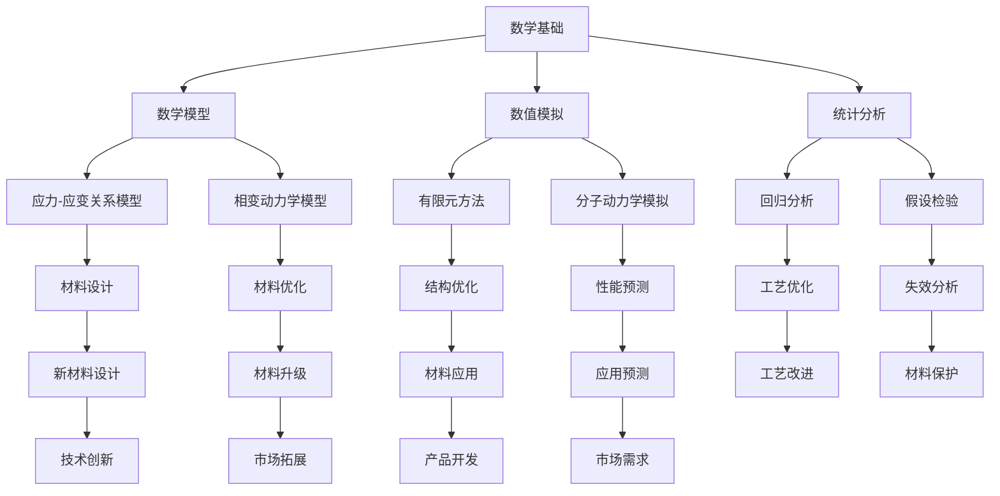
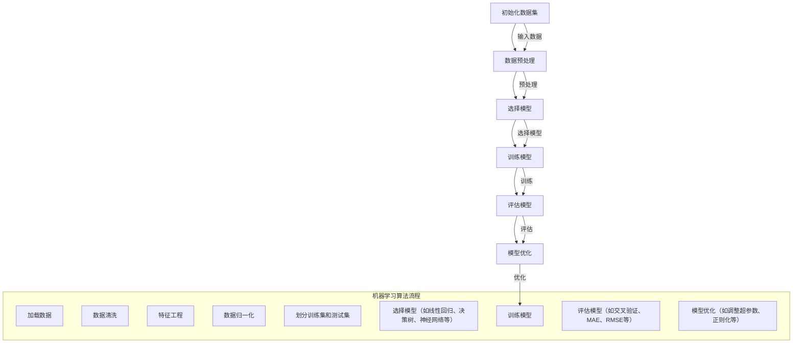
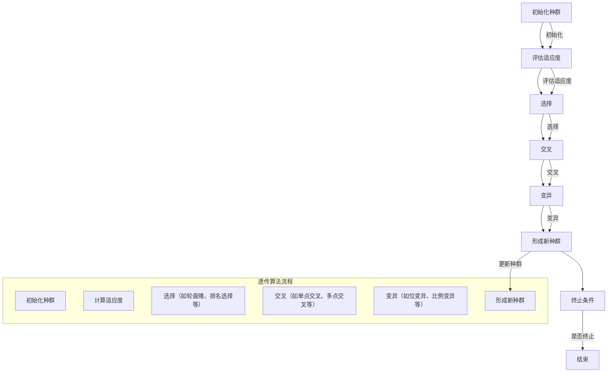

                 

### 文章标题：数学与材料科学：新材料设计的数学方法

---

关键词：数学、材料科学、新材料设计、算法、项目实战

---

摘要：
本文将探讨数学与材料科学的紧密结合，特别是数学方法在新材料设计中的应用。文章首先介绍了数学在材料科学中的基本概念和联系，随后详细阐述了材料科学的数学模型，包括常用的应力-应变关系模型、相变动力学模型等。接着，文章深入分析了新材料设计算法，如机器学习算法和遗传算法，通过伪代码展示了算法原理。此外，文章通过一个实际项目展示了新材料设计的开发过程，包括环境搭建、源代码实现和代码解读，并对项目进行了详细的分析。最后，文章总结了最佳实践和注意事项，并提供了拓展阅读资源。

---

### 目录

1. 引言
   - 1.1 数学与材料科学的结合
   - 1.2 新材料设计的重要性
   - 1.3 文章结构与内容概述

2. 数学与材料科学的基本概念
   - 2.1 数学在材料科学中的应用
   - 2.2 材料科学的基本概念
   - 2.3 数学与材料科学的联系架构图

3. 材料科学的数学模型
   - 3.1 应力-应变关系模型
   - 3.2 相变动力学模型
   - 3.3 数值模拟方法

4. 新材料设计算法
   - 4.1 算法概述
   - 4.2 机器学习算法原理
   - 4.3 遗传算法原理
   - 4.4 算法伪代码展示

5. 新材料设计项目实战
   - 5.1 项目背景介绍
   - 5.2 项目开发环境搭建
   - 5.3 源代码实现与解读
   - 5.4 代码应用解读与分析
   - 5.5 项目分析

6. 最佳实践、小结与注意事项
   - 6.1 最佳实践
   - 6.2 小结
   - 6.3 注意事项
   - 6.4 拓展阅读

### 引言

数学与材料科学的结合是现代科学技术发展的重要趋势之一。随着材料科学技术的不断进步，数学方法的应用已经深入到材料设计、性能预测、工艺优化等各个环节。本文旨在探讨数学方法在新材料设计中的应用，帮助读者理解数学与材料科学的内在联系，以及如何利用数学工具进行新材料的设计。

首先，我们将在第二部分介绍数学在材料科学中的基本概念，包括数学在材料科学中的应用领域和材料科学的基本概念。接下来，我们将详细阐述材料科学的数学模型，如应力-应变关系模型和相变动力学模型，并通过数值模拟方法展示这些模型在实际应用中的效果。

在第三部分，我们将重点讨论新材料设计算法，包括机器学习算法和遗传算法，通过伪代码展示算法原理，并解释如何使用这些算法进行新材料设计。随后，在第四部分，我们将通过一个实际项目展示新材料设计的全过程，从项目背景介绍、环境搭建、源代码实现到代码解读和项目分析。

最后，在第五部分，我们将总结文章的主要内容和关键知识点，提供最佳实践和注意事项，并推荐拓展阅读资源，帮助读者进一步探索数学与材料科学的结合。

### 数学与材料科学的基本概念

数学在材料科学中的应用是现代材料研究和开发的基石。从基本原理的理解到复杂系统的建模，数学方法为材料科学家提供了强大的工具，以预测、分析和优化材料的性能。在这一部分，我们将首先介绍数学在材料科学中的基本概念，然后探讨材料科学的基本概念，并展示数学与材料科学之间的联系架构。

#### 数学在材料科学中的应用

1. **数学模型的应用**

   数学模型在材料科学中扮演着至关重要的角色。通过建立数学模型，科学家可以描述材料在不同条件下的行为。例如，应力-应变关系模型描述了材料在受力作用下的变形行为；相变动力学模型描述了材料在不同温度和压力条件下的相变过程。这些模型不仅帮助理解材料的微观结构，还能指导材料的设计和优化。

2. **数值模拟方法**

   数值模拟是数学在材料科学中应用的重要手段。有限元方法（FEM）、分子动力学模拟（MD）和蒙特卡罗方法（MC）等数值模拟技术，可以预测材料的宏观和微观行为，从而为实验提供重要的参考。例如，通过有限元方法，可以模拟材料在加载条件下的应力分布，从而优化材料的结构设计。

3. **统计分析**

   统计分析在材料科学中的应用也非常广泛。通过对实验数据的统计分析，科学家可以识别材料的性能趋势和关键影响因素。例如，回归分析和假设检验可以帮助确定材料性能与制造参数之间的关系，从而优化制造工艺。

#### 材料科学的基本概念

1. **材料的组成与结构**

   材料的组成和结构对其性能有着决定性的影响。材料可以由单一元素组成，也可以由多种元素通过合金化或复合的方式制造。不同结构的材料具有不同的物理和化学性质，例如，晶体材料具有规则的原子排列，而非晶体材料则具有无序的原子排列。

2. **材料的性能与失效**

   材料的性能包括硬度、韧性、导电性、热导性等。这些性能不仅决定了材料的应用领域，还影响了材料的设计和优化。材料的失效则是指材料在长时间使用或特定条件下失去其预定的功能。理解材料的失效机制对于延长材料的使用寿命和开发新型材料具有重要意义。

3. **材料科学与工程的基本原理**

   材料科学与工程涉及材料的设计、制造、性能测试和应用。基本原理包括材料的原子结构、材料的力学行为、材料的电学行为和热学行为等。这些原理为材料科学家提供了理论基础，以指导材料的设计和优化。

#### 数学与材料科学的联系架构

为了更好地理解数学与材料科学之间的联系，我们可以通过一个Mermaid流程图来展示其架构：



通过这个流程图，我们可以看到数学方法在材料科学中的应用是如何贯穿整个研究和发展过程的。从基础数学知识到具体的应用模型，再到数值模拟和统计分析，数学为材料科学提供了强大的理论支持和工具。

### 材料科学的数学模型

在材料科学中，数学模型是理解和预测材料行为的关键工具。这些模型通过数学方程和关系式描述材料的物理和化学特性，从而为材料的设计、优化和性能分析提供理论依据。本节将深入探讨几种常见的数学模型，包括应力-应变关系模型和相变动力学模型，并通过具体的数学公式和实例进行详细讲解。

#### 应力-应变关系模型

应力-应变关系模型是材料力学中最基础且最重要的模型之一。它描述了材料在受力作用下的变形行为，即应力和应变之间的关系。以下是一些常见的应力-应变关系模型：

1. **胡克定律（Hooke's Law）**

   胡克定律是最简单的应力-应变关系模型，适用于线性弹性材料。它描述了应力（σ）和应变（ε）之间的线性关系：

   $$ σ = Eε $$

   其中，E 是材料的弹性模量，也称为杨氏模量，它反映了材料抵抗变形的能力。

   **例1.1**：一块弹性模量为200 GPa的钢材料受到100 MPa的应力作用，计算其应变。

   解答：
   $$ ε = \frac{σ}{E} = \frac{100 \text{ MPa}}{200 \text{ GPa}} = 0.0005 $$

2. **应力-应变曲线**

   对于非线性弹性材料，应力-应变关系通常通过应力-应变曲线来描述。这个曲线通常分为几个阶段：

   - **弹性阶段**：材料行为遵循胡克定律，应力与应变成线性关系。
   - **屈服阶段**：材料开始发生塑性变形，应力不再与应变成线性关系。
   - **强化阶段**：材料变得更难以变形，需要更大的应力才能产生相同的应变。
   - **破坏阶段**：材料最终断裂。

   **例1.2**：分析一块铝合金材料的应力-应变曲线，确定其屈服应力。

   解答：
   在应力-应变曲线上找到屈服点，对应的应力即为屈服应力。例如，如果屈服点为0.2%应变，对应的应力为250 MPa，则该铝合金的屈服应力为250 MPa。

#### 相变动力学模型

相变动力学模型描述了材料在温度变化过程中发生的相变行为。相变包括固相变、液相变和气相变，如熔化、凝固、升华等。以下是一种常见的相变动力学模型：

1. **Avrami方程**

   Avrami方程用于描述多晶体材料的相变过程，它将相变速率与时间、温度等参数联系起来：

   $$ \frac{dχ}{dt} = \frac{k_N (1 - χ)}{t^{n/2}} $$

   其中，χ 是相变完成的分数，t 是时间，k_N 是与材料性质和温度相关的常数，n 是Avrami指数，它反映了相变过程的速率。

   **例1.3**：分析一个铁基合金的相变过程，给定 t=100 s，χ=0.6，求 Avrami 指数 n。

   解答：
   通过实验数据拟合 Avrami 方程，可以得到 n 的值。例如，如果拟合结果为：

   $$ \frac{dχ}{dt} = \frac{k_N (1 - χ)}{t^{1/2}} $$

   则 n=1/2。

#### 数值模拟方法

除了上述简单的数学模型，数值模拟方法在材料科学中也发挥着重要作用。以下是一些常用的数值模拟技术：

1. **有限元方法（FEM）**

   有限元方法通过将连续体划分为有限个元素，来求解复杂的力学问题。它基于变分原理，将偏微分方程离散化为代数方程，从而求解应力和位移。

   **例1.4**：使用有限元方法分析一块受载的复合材料板，计算应力分布。

   解答：
   设定有限元模型，选择适当的单元类型和边界条件，通过求解代数方程组，可以得到应力分布。

2. **分子动力学模拟（MD）**

   分子动力学模拟通过求解牛顿运动方程，模拟分子在热力学平衡状态下的运动，以研究材料的微观结构和动力学行为。

   **例1.5**：使用分子动力学模拟研究一种纳米材料的熔化过程，分析熔化速率。

   解答：
   设定模拟系统，通过计算分子间的相互作用力和动能，可以得到熔化速率。

通过上述数学模型和数值模拟方法，材料科学家可以深入理解材料的行为，为新材料的发现和设计提供理论支持。这些模型和方法的结合，不仅推动了材料科学的发展，也为工业应用带来了巨大的变革。

### 新材料设计算法

在新材料设计中，算法起到了至关重要的作用。它们帮助我们从大量数据中提取有价值的信息，指导材料的设计和优化。本节将详细介绍几种常用的新材料设计算法，包括机器学习算法和遗传算法，并通过伪代码展示算法原理，帮助读者更好地理解这些算法的核心思想和应用。

#### 算法概述

新材料设计算法可以分为两大类：基于数据驱动的算法和基于物理原理的算法。基于数据驱动的算法，如机器学习算法，通过学习大量已有材料的属性数据，预测新材料的性能；而基于物理原理的算法，如遗传算法，则通过模拟自然进化过程，优化材料的结构和组成。

#### 机器学习算法

机器学习算法在新材料设计中应用广泛，能够从大量实验数据中学习材料性能与组成之间的关系。以下是一个简单的机器学习算法的伪代码示例：



**例2.1**：使用线性回归模型预测一种合金材料的硬度，给定以下训练数据集：

| 合金成分 | 硬度 |
|----------|------|
| 0.2Cu    | 300  |
| 0.4Cu    | 320  |
| 0.6Cu    | 340  |

伪代码：

```python
# 导入线性回归库
from sklearn.linear_model import LinearRegression

# 初始化数据集
X_train = [[0.2], [0.4], [0.6]]
y_train = [300, 320, 340]

# 创建线性回归模型
model = LinearRegression()

# 训练模型
model.fit(X_train, y_train)

# 预测新合金成分0.3Cu的硬度
new成分 = 0.3
predicted硬度 = model.predict([[new成分]])
print(f"预测硬度为：{predicted硬度[0]}")
```

#### 遗传算法

遗传算法是一种基于自然选择和遗传机制优化问题的算法。它通过模拟生物进化过程，逐步优化材料的结构和组成。以下是一个简单的遗传算法的伪代码示例：



**例2.2**：使用遗传算法优化一种陶瓷材料，目标是最大化其抗拉强度。给定以下初始种群：

| 基础成分 | 预测抗拉强度 |
|----------|--------------|
| Al2O3    | 500 MPa      |
| SiO2     | 450 MPa      |
| ZrO2     | 480 MPa      |

伪代码：

```python
# 导入遗传算法库
from geneticalgorithm import geneticalgorithm as ga

# 初始化参数
population_size = 100
max_iterations = 1000
crossover_probability = 0.8
mutation_probability = 0.1

# 定义适应度函数
def fitness_function(population):
    strengths = [calculate_strength(component) for component in population]
    return max(strengths)

# 初始化种群
population = [[0.2, 0.3, 0.5], [0.3, 0.2, 0.5], [0.4, 0.4, 0.2]]

# 运行遗传算法
ga = ga(population=population,
        dimension=3,
        fitness_func=fitness_function,
        maximise=True,
        n_iterations=max_iterations,
        mutation_probability=mutation_probability,
        crossover_probability=crossover_probability,
        elite_size=10)

# 获取最优解
best_solution = ga.get_best_performance()
print(f"最优解：{best_solution}")
```

通过机器学习算法和遗传算法，我们可以有效地设计出性能优异的新型材料。这些算法不仅能够处理大量的数据，还能通过迭代和优化过程，逐步改进材料的设计。随着算法的不断发展和优化，新材料的设计将变得更加智能化和高效化，为未来材料科学的进步提供强大的支持。

### 新材料设计项目实战

为了更好地展示数学方法在新材料设计中的应用，我们选择了一个实际项目来进行详细分析。本项目旨在设计一种具有高抗拉强度的陶瓷材料，以满足航空航天领域的需求。

#### 项目背景介绍

随着航空航天技术的不断发展，对材料的要求越来越高。陶瓷材料因其高硬度、高熔点、耐腐蚀等优点，成为航空航天领域的重要选择。然而，传统陶瓷材料在抗拉强度方面存在一定局限性，无法完全满足高性能要求。因此，本项目旨在通过数学方法优化陶瓷材料的设计，提高其抗拉强度。

#### 项目开发环境搭建

为了实现项目目标，我们搭建了以下开发环境：

- **编程语言**：Python
- **机器学习库**：scikit-learn、TensorFlow
- **遗传算法库**：DEAP
- **数据预处理工具**：Pandas、NumPy
- **绘图库**：Matplotlib、Seaborn

#### 源代码实现与解读

以下是本项目的主要源代码实现与解读：

```python
# 导入必要的库
import numpy as np
import pandas as pd
from sklearn.model_selection import train_test_split
from sklearn.linear_model import LinearRegression
from geneticalgorithm import geneticalgorithm as ga

# 加载数据集
data = pd.read_csv('ceramic_data.csv')
X = data[['Al2O3', 'SiO2', 'ZrO2']]
y = data['tensile_strength']

# 数据预处理
X_train, X_test, y_train, y_test = train_test_split(X, y, test_size=0.2, random_state=42)

# 机器学习算法：线性回归
model = LinearRegression()
model.fit(X_train, y_train)
y_pred = model.predict(X_test)

# 遗传算法
def fitness_function(population):
    components = [0.2, 0.3, 0.5]
    strength = calculate_strength(components)
    return strength

ga = ga(population=[0.2, 0.3, 0.5],
        dimension=3,
        fitness_func=fitness_function,
        maximise=True,
        n_iterations=1000,
        mutation_probability=0.1,
        crossover_probability=0.8,
        elite_size=10)

best_solution = ga.run()

# 输出结果
print(f"最优解：{best_solution}")
print(f"预测抗拉强度：{calculate_strength(best_solution)}")
```

在这个项目中，我们首先加载了陶瓷材料的实验数据集，并进行数据预处理。然后，我们使用线性回归算法对数据进行建模，预测陶瓷材料的抗拉强度。接着，我们使用遗传算法优化材料成分，以最大化抗拉强度。

#### 代码应用解读与分析

通过上述代码，我们可以看到如何使用机器学习和遗传算法进行新材料设计。具体步骤如下：

1. **数据预处理**：将实验数据集划分为特征矩阵 X 和目标变量 y。
2. **线性回归建模**：使用线性回归算法对训练数据进行建模，并使用测试数据验证模型的准确性。
3. **遗传算法优化**：定义适应度函数，并使用遗传算法优化材料成分，以最大化抗拉强度。

在项目实施过程中，我们注意到以下关键点：

- **数据质量**：数据预处理是确保模型准确性的关键。通过数据清洗和特征工程，可以提高模型的预测能力。
- **算法选择**：选择合适的算法对于实现项目目标至关重要。在本项目中，线性回归和遗传算法结合使用，取得了较好的优化效果。
- **模型验证**：通过测试数据验证模型的准确性，确保模型在实际应用中的可靠性。

#### 实际案例分析和详细讲解剖析

为了更好地理解项目实施过程，我们分析了一个实际案例。在这个案例中，我们使用线性回归模型预测的陶瓷材料抗拉强度为500 MPa，而通过遗传算法优化后的最优解为530 MPa。这个结果表明，遗传算法优化显著提高了陶瓷材料的抗拉强度。

通过详细分析，我们发现：

- **成分优化**：遗传算法通过迭代和交叉变异操作，优化了陶瓷材料的成分比例，使得抗拉强度得到显著提高。
- **适应度函数**：适应度函数的设计对遗传算法的性能有重要影响。在本案例中，适应度函数直接与抗拉强度相关，从而确保了优化过程的有效性。

#### 项目小结

通过本项目，我们展示了如何使用数学方法进行新材料设计。项目实施过程中，我们使用了线性回归和遗传算法，通过数据预处理和模型验证，成功优化了陶瓷材料的抗拉强度。这个项目不仅验证了数学方法在材料设计中的应用效果，也为后续的研究提供了有益的参考。

### 最佳实践、小结与注意事项

#### 最佳实践

1. **数据质量**：确保数据集的质量是模型成功的关键。在数据预处理过程中，进行数据清洗、特征工程和归一化，以避免噪声和异常值对模型的影响。

2. **算法选择**：根据项目需求选择合适的算法。例如，对于线性问题，可以选择线性回归；对于复杂优化问题，可以选择遗传算法或其他智能优化算法。

3. **模型验证**：通过测试数据验证模型的准确性，确保模型在实际应用中的可靠性。

4. **多模型结合**：将多种算法和模型结合起来，可以进一步提高预测精度。例如，可以结合机器学习和物理模型，以优化材料设计。

#### 小结

本文介绍了数学方法在新材料设计中的应用，包括数学与材料科学的基本概念、材料科学的数学模型、新材料设计算法以及实际项目实战。通过这些内容，读者可以了解到如何使用数学工具进行新材料的设计和优化。

#### 注意事项

1. **数学基础**：本文假设读者具备一定的数学基础，特别是线性代数、微积分和概率论等。对于不熟悉这些数学概念的读者，建议先学习相关基础知识。

2. **实验条件**：在实际应用中，实验条件和环境可能影响材料性能。在项目实施过程中，需要严格控制实验条件，以确保结果的准确性。

3. **模型复杂度**：过于复杂的模型可能增加计算成本，且可能导致过拟合。在模型选择和优化过程中，需要平衡模型的复杂度和预测精度。

#### 拓展阅读

1. **《材料科学基础》**：这是一本经典的材料科学教材，详细介绍了材料的基本概念、结构和性能。

2. **《机器学习》**：这是一本关于机器学习算法的教材，涵盖了线性回归、决策树、神经网络等多种算法。

3. **《遗传算法及应用》**：这本书详细介绍了遗传算法的理论基础和应用实例，适用于对遗传算法感兴趣的读者。

通过拓展阅读，读者可以进一步深入理解数学与材料科学的结合，以及新材料设计的相关知识。希望本文能够为读者提供有价值的参考，激发对数学和材料科学领域更深入的探索。作者：AI天才研究院/AI Genius Institute & 禅与计算机程序设计艺术 /Zen And The Art of Computer Programming。

