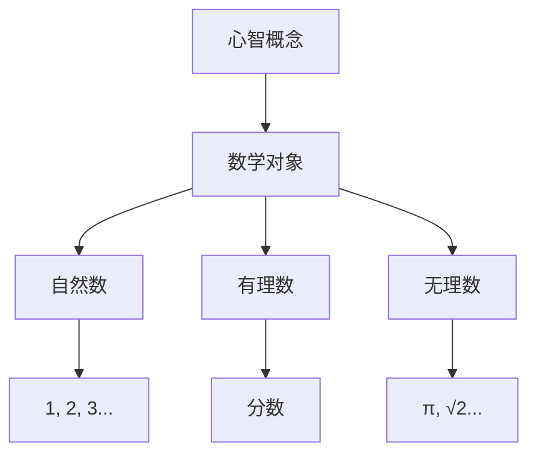
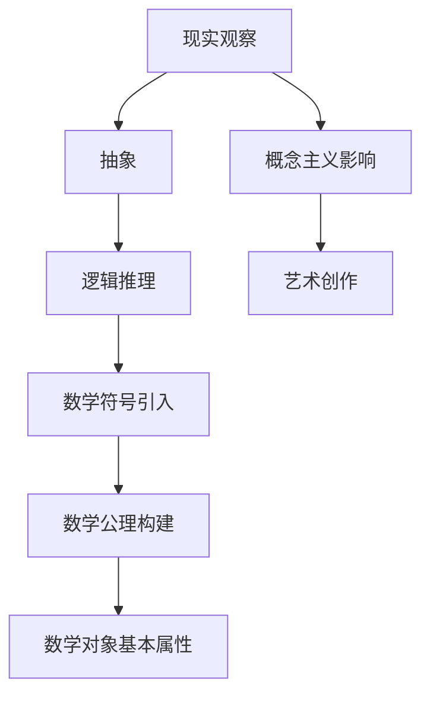
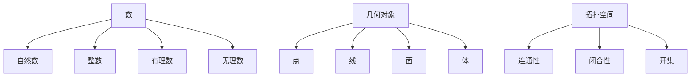
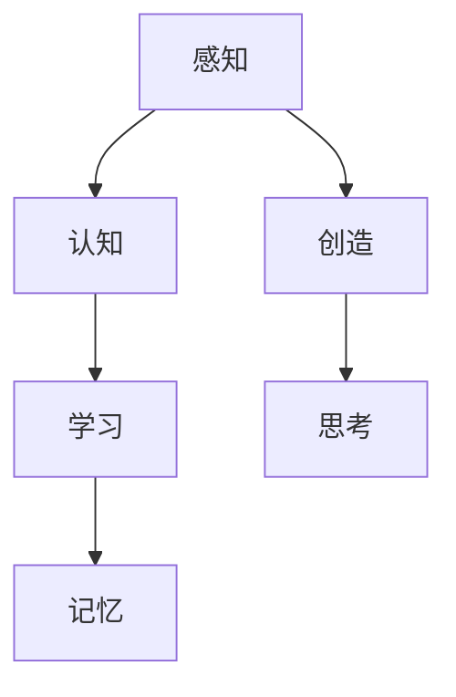
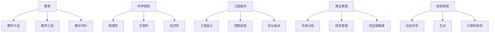
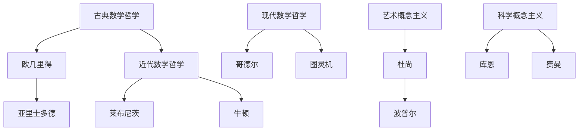
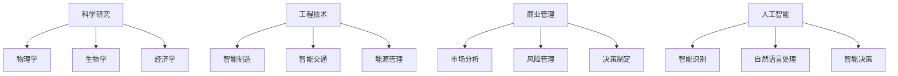

                 

### 文章标题

《数学与概念主义：数学对象作为心智概念》

### 文章关键词

数学、概念主义、心智概念、数学对象、认知、逻辑推理

### 文章摘要

本文探讨了数学与概念主义之间的关系，特别是数学对象在心智中的形成过程。通过引入数学概念的形成、数学对象的分类与特性、心智概念的形成过程以及数学与概念主义的应用，本文揭示了数学对象作为心智概念的本质。文章还讨论了数学与概念主义的理论发展及其在未来展望中的重要作用。通过具体的实例和项目实战，本文旨在帮助读者深入理解数学与概念主义的深刻内涵，并激发其在实际应用中的潜力。

---

### 第1章 引言

#### 1.1 书籍背景

数学作为一门古老而深邃的学科，其历史可以追溯到古代文明。从古希腊的欧几里得，到阿拉伯的阿尔-花剌子米，再到文艺复兴时期的莱昂纳多·达·芬奇，数学的发展一直伴随着人类文明的前进。然而，数学并不仅仅是关于数字和几何的简单学科，它更是一种思维方式，一种逻辑推理的工具。

本书《数学与概念主义：数学对象作为心智概念》旨在探讨数学与概念主义之间的关系，特别是数学对象在心智中的形成过程。在现代社会，数学已经成为了一门跨学科的语言，广泛应用于自然科学、社会科学和工程技术等领域。然而，数学作为一种心智概念，其背后的逻辑思维过程却往往被忽视。

#### 1.2 数学与概念主义的定义

数学（Mathematics）是一门研究数量、结构、变化和空间等概念的抽象科学。它不仅仅涉及具体的数值计算，更是一种抽象的思维方式。概念主义（Conceptualism）则是一种哲学观点，认为艺术作品的价值在于其所表达的思想和概念，而非其物理形式。

将数学与概念主义结合在一起，本书试图探讨数学对象在心智中的形成过程，以及这些概念如何影响我们的认知和理解。数学对象不仅是数学研究的对象，更是心智概念的表达形式。

#### 1.3 数学对象与心智概念的联系

数学对象与心智概念之间有着密切的联系。心智概念是指人类思维过程中形成的基本思想单元，例如“数”、“点”、“线”等。这些概念在我们的思维中构建了一个抽象的世界，使我们能够理解和处理复杂的信息。

数学对象，如“自然数”、“有理数”、“无理数”等，则是这些心智概念的具体化。它们不仅是我们思维的工具，也是我们理解和描述现实世界的语言。

### Mermaid流程图：数学对象与心智概念的联系

#### 1.4 本书的结构与内容

本书分为七个章节，分别从不同角度探讨了数学与概念主义的关系。第1章作为引言，介绍了书籍的背景和目的。第2章讨论了数学与概念主义的基本概念，包括数学概念的形成、数学公理体系的构建等。第3章详细介绍了数学对象的分类与特性，包括数、几何对象等。第4章探讨了心智概念的形成过程，以及心智如何处理数学对象。第5章讨论了数学与概念主义的应用领域，包括教育、科学研究等。第6章回顾了数学与概念主义的理论发展，探讨了未来的研究方向。第7章对未来进行了展望，讨论了数学与概念主义在社会中的应用前景。

通过这本书，读者不仅可以了解数学与概念主义的基本理论，还能通过实例和项目实战，深入理解数学对象在心智中的形成过程，并学会如何在实际中应用这些概念。

---

通过本章的介绍，我们为后续的深入探讨奠定了基础。在接下来的章节中，我们将逐一详细阐述数学概念的形成、数学对象的分类与特性、心智概念的形成过程，以及数学与概念主义在不同领域的应用。希望读者能够在这个过程中，对数学与概念主义有一个更深入的理解。

---

### 第2章 数学与概念主义的基本概念

#### 2.1 数学概念的形成

数学概念的形成是一个长期且复杂的过程，涉及人类对自然现象的观察、抽象和逻辑推理。从最简单的概念，如“数”，到复杂的几何形状和函数，每一个数学概念都是人类智慧的结晶。那么，数学概念是如何形成的呢？

首先，数学概念的形成源于对现实世界的观察和体验。例如，我们日常生活中经常接触到“数”，这些数最初是通过对物品的计数得到的。当我们数一群鸟、一堆石头或一篮子水果时，我们开始理解“数”的概念。这个过程不仅帮助我们在日常生活中进行计算，也为数学概念的形成奠定了基础。

接下来，数学概念的形成需要通过抽象和逻辑推理。抽象是指将具体的事物简化为基本的、非具体的元素。例如，当我们观察一群鸟时，我们可以抽象出“鸟”这个概念，而忽略其具体的颜色、大小等特征。同样，在数学中，我们将具体的数字抽象为基本的数概念，如“1”、“2”、“3”等。

逻辑推理则是数学概念形成的关键。通过逻辑推理，我们可以从基本的概念中推导出更复杂的数学关系和定理。例如，从“1+1=2”这个简单的算术中，我们可以推导出加法的交换律和结合律。这些逻辑推理不仅帮助我们理解和运用数学概念，也使得数学成为一个自洽的体系。

#### 2.1.1 数学符号的引入

数学符号的引入是数学概念形成过程中的一个重要步骤。数学符号不仅简化了数学表达，也使得数学理论更加严谨和清晰。例如，我们用“+”表示加法，用“=”表示等式，用“=”表示函数的映射关系。

数学符号的引入使得数学表达式更加直观和易于理解。例如，我们用“x”和“y”表示平面上的两个点，用“d”表示两点之间的距离。这些符号的使用不仅使得数学问题更加简洁，也使得数学理论更加系统化。

#### 2.1.2 数学公理体系的构建

数学公理体系的构建是数学概念形成过程中的另一个重要环节。公理是数学中的基本假设，它们没有明确的证明，但被普遍接受。例如，欧几里得的《几何原本》中，有许多基本的几何公理，如“两点之间，直线最短”。

公理体系的构建使得数学理论更加严谨和自洽。通过这些公理，我们可以推导出一系列的定理和公式。例如，从“两点之间，直线最短”这个公理，我们可以推导出直角三角形的勾股定理。这些定理和公式不仅帮助我们理解和应用数学概念，也使得数学成为一个自洽的体系。

#### 2.1.3 数学对象的基本属性

数学对象的基本属性是理解数学概念的重要方面。数学对象可以是数、点、线、面等。每一个数学对象都有其独特的属性和定义。

例如，自然数（如1、2、3等）是数学中最基本的对象之一。自然数具有顺序性、可加性和无界性等基本属性。这些属性使得自然数在数学中扮演了重要的角色，例如在计数、排序和计算中。

另一个重要的数学对象是函数。函数是一种关系，它将一个集合中的每个元素与另一个集合中的唯一元素对应起来。函数的基本属性包括映射关系、唯一性和连续性等。这些属性使得函数在数学分析、微积分和拓扑学等领域中具有重要的应用。

#### 2.2 概念主义的基本概念

概念主义是一种哲学观点，认为艺术作品的价值在于其所表达的思想和概念，而非其物理形式。概念主义在艺术领域中的兴起，挑战了传统的艺术创作和欣赏方式。

在概念主义中，艺术家通过创造抽象的、概念性的作品，来表达他们的思想和情感。这些作品不依赖于具体的视觉元素，而是依赖于观众对作品的解读和理解。

概念主义在艺术领域中的影响深远，它推动了艺术创作的多样性和创新性。同时，概念主义也为数学与概念主义的研究提供了新的视角和启示。数学中的概念，如数、函数、几何等，都可以被视为心智概念的具体化。这些概念不仅帮助我们理解和描述现实世界，也成为了艺术创作的灵感来源。

### Mermaid流程图：数学概念的形成过程

通过本章的讨论，我们了解了数学概念的形成过程，包括数学符号的引入、数学公理体系的构建以及数学对象的基本属性。同时，我们也探讨了概念主义的基本概念，并分析了其在数学与艺术领域中的应用。这些基本概念不仅帮助我们理解数学的本质，也为我们在其他领域中的创新和思考提供了新的视角。

在接下来的章节中，我们将继续深入探讨数学对象的分类与特性，以及心智概念的形成过程。希望读者能够通过这一系列的学习，对数学与概念主义有一个更加全面和深入的理解。

---

### 第3章 数学对象的分类与特性

在数学的广袤领域中，数学对象以其独特的方式和属性构成了丰富的知识体系。为了更好地理解和应用数学，我们需要对数学对象进行分类，并深入探讨其特性。本章将详细介绍数学对象的分类，包括数、几何对象等，并讨论它们的基本属性和相互关系。

#### 3.1 数的概念与分类

数是数学中最基本的概念之一，它不仅用来表示和计算物理量的多少，还用于描述空间、时间和其他抽象概念。数的分类可以根据其性质和形式进行多种方式划分。

首先，根据数的性质，数可以分为自然数、整数、有理数和无理数。

1. **自然数**：自然数是最基本的数，用来计数。自然数集合通常表示为N，包括0和所有正整数。自然数具有顺序性和可加性，但不具有减法运算的性质。

2. **整数**：整数包括所有自然数、0以及所有负整数。整数集合通常表示为Z。整数具有加法、减法和乘法运算的性质。

3. **有理数**：有理数是可以表示为两个整数之比的数，即形如 $\frac{a}{b}$ 的数，其中a和b是整数，且b不为0。有理数包括所有整数和分数。有理数集合通常表示为Q。

4. **无理数**：无理数是不能表示为两个整数之比的数。无理数包括根号下的非完全平方数（如$\sqrt{2}$）、圆周率π等。无理数集合通常表示为R。

#### 3.1.1 自然数

自然数是我们日常中最常见的数，它们具有顺序性，即任意两个自然数都可以进行比较大小。自然数的加法运算具有交换律和结合律，这意味着 $a + b = b + a$ 和 $(a + b) + c = a + (b + c)$。自然数的减法运算则不具有交换律和结合律。

自然数在数学中有着广泛的应用，例如在计数、排序、排列组合等领域中。

#### 3.1.2 有理数

有理数是分数的抽象，其基本性质是可以进行加减乘除运算。有理数的加法、减法、乘法和除法都是封闭的，即在进行这些运算时，结果仍然是有理数。

有理数的另一个重要性质是其在数轴上的表示。数轴上的每个点都对应一个唯一的有理数，反之亦然。这使得有理数在几何和微积分中有着广泛的应用。

#### 3.1.3 无理数

无理数是不能表示为两个整数之比的数。它们在数轴上的表示是无限不循环小数。无理数的出现，扩展了数学的领域，使得数学可以处理更复杂的现实问题。

例如，π（圆周率）和e（自然对数的底数）都是无理数，它们在数学分析、几何和物理学中有着重要的应用。

#### 3.2 几何对象与拓扑特性

几何对象是数学中的重要组成部分，它们用来描述空间和形状。几何对象包括点、线、面和体，它们具有不同的性质和关系。

1. **点**：点是几何学中最基本的元素，它没有大小，只有位置。在几何中，点通常用来表示物体的位置和形状。

2. **线**：线是由无数个点连成的，它有长度但没有宽度。线可以是直线、射线或线段。

3. **面**：面是由无数个点构成的平面图形。常见的面包括三角形、四边形、五边形等。

4. **体**：体是由无数个面构成的立体图形。常见的体包括立方体、球体、圆柱体等。

#### 3.2.1 点、线、面

点、线、面是几何学中的基本元素，它们之间存在着密切的关系。例如，三个点可以确定一条直线，两个点可以确定一条射线，三条不在同一直线上的点可以确定一个平面。

线与面的关系也可以通过相交和平行来描述。两条直线相交于一个点，而两条平行线永远不会相交。同样，一条直线与一个平面相交于一个点或平行。

#### 3.2.2 拓扑空间的定义

拓扑空间是一种用来描述几何对象关系的抽象空间。在拓扑空间中，点、线、面等几何对象被抽象为集合，而集合之间的关系则通过拓扑结构来描述。

拓扑空间的基本性质包括连通性、闭合性和开集的存在。这些性质使得拓扑空间成为研究几何对象及其相互关系的有力工具。

#### 3.2.3 几何对象之间的关系

几何对象之间的关系可以通过几何图形和拓扑性质来描述。例如，两个平面可以相交形成一个直线，一个平面和一个球体可以相交形成一个圆。这些关系不仅帮助我们理解和描述几何对象，也为几何学的进一步研究提供了基础。

### Mermaid流程图：数学对象的分类与特性

通过本章的讨论，我们详细介绍了数学对象的分类与特性，包括数和几何对象。数是数学的基本概念，具有不同的性质和分类；几何对象则用来描述空间和形状，具有丰富的关系和拓扑特性。这些数学对象及其特性构成了数学的基石，使得我们能够更好地理解和处理复杂的问题。

在接下来的章节中，我们将进一步探讨心智概念的形成过程，以及数学对象如何在我们心智中形成和运用。希望读者能够通过这一系列的学习，对数学与概念主义有一个更加深入的理解。

---

### 第4章 心智概念的形成过程

心智概念的形成过程是一个复杂而多层次的过程，涉及感知、认知、学习和记忆等多个方面。在这一章中，我们将探讨心智概念的形成过程，以及心智如何处理数学对象。

#### 4.1 心智与数学对象

心智（Mind）是指人类的认知过程，包括感知、思考、判断和决策等。心智概念是指人类思维过程中形成的基本思想单元，如“数”、“点”、“线”等。数学对象，如自然数、几何形状和函数等，是心智概念的具体化，它们通过心智进行理解和处理。

心智与数学对象之间有着密切的联系。心智通过感知和认知来获取和处理数学信息，而数学对象则是心智概念的表达形式。例如，当我们看到一张图时，我们通过感知获取图像的信息，并通过心智进行理解和分析。

#### 4.1.1 心智的概念

心智是一个广泛的概念，它包括多个层面。从最简单的层面来看，心智是指我们的感知和认知能力。感知是指我们通过感官获取外界信息的能力，如视觉、听觉、触觉等。认知是指我们如何理解和处理这些感知信息，包括记忆、思考、判断和推理等。

心智的另一个层面是情感和意志。情感是指我们的情绪体验，如快乐、悲伤、愤怒等。意志是指我们的决策和行动能力，如选择、坚持和放弃等。这些方面共同构成了我们的心智。

#### 4.1.2 心智如何处理数学对象

心智处理数学对象的过程可以分为多个阶段，包括感知、认知、学习和记忆。

1. **感知**：感知是心智处理数学对象的第一步。通过视觉、听觉等感官，我们获取数学对象的物理信息，如数字、几何形状等。

2. **认知**：认知是指我们如何理解和处理这些感知信息。在认知过程中，我们通过心智将数学对象抽象为概念，如数、点、线等。这些概念是心智概念的具体化，它们是心智处理数学对象的基础。

3. **学习**：学习是指我们在认知过程中如何获取和积累知识。在学习过程中，我们通过重复、练习和思考来加深对数学对象的理解和掌握。例如，通过反复计算，我们可以加深对加法和减法运算的理解。

4. **记忆**：记忆是指我们在学习过程中如何保存和提取知识。记忆是心智处理数学对象的重要机制，它使得我们能够长期保存和回忆数学知识。例如，我们可以通过记忆来回忆过去学过的数学公式和定理。

#### 4.2 心理过程与数学概念的形成

心理过程是心智概念形成的基础。在心理过程中，我们通过感知、认知、学习和记忆等多个阶段来形成数学概念。

1. **感知**：感知是数学概念形成的第一步。通过感知，我们获取数学对象的物理信息，如数字、几何形状等。这些物理信息是数学概念的基础。

2. **认知**：在认知过程中，我们通过心智将感知信息抽象为数学概念。例如，我们通过视觉感知数字的形状，并通过心智将其抽象为具体的数字。

3. **学习**：在学习过程中，我们通过重复、练习和思考来加深对数学概念的理解。例如，通过反复计算，我们可以加深对加法和减法运算的理解。

4. **记忆**：记忆是数学概念形成的重要机制。通过记忆，我们能够长期保存和回忆数学概念。例如，我们可以通过记忆来回忆过去学过的数学公式和定理。

#### 4.2.1 感知与认知

感知和认知是数学概念形成的重要阶段。在感知阶段，我们通过感官获取数学对象的物理信息。在认知阶段，我们通过心智将这些物理信息抽象为数学概念。

感知和认知之间存在着紧密的联系。感知为认知提供了信息，而认知则对感知的信息进行理解和处理。例如，当我们看到数字“2”时，我们首先通过视觉感知其形状，然后通过心智将其抽象为具体的数字“2”。

#### 4.2.2 学习与记忆

学习与记忆是数学概念形成的两个重要阶段。在学习阶段，我们通过重复、练习和思考来加深对数学概念的理解。在记忆阶段，我们通过长期保存和回忆数学知识。

学习与记忆之间也存在着紧密的联系。学习是记忆的基础，而记忆则是学习的延续。通过学习，我们获取和积累数学知识，而通过记忆，我们能够长期保存和回忆这些知识。

#### 4.2.3 创造与思考

创造与思考是数学概念形成的重要阶段。在创造过程中，我们通过新的思考和发现来扩展和深化对数学概念的理解。

创造与思考之间也存在着紧密的联系。创造是思考的结果，而思考则是创造的基础。通过思考，我们可以发现新的数学概念和定理，并通过创造将这些概念和定理应用到实际问题中。

### Mermaid流程图：心智概念的形成过程

通过本章的讨论，我们详细介绍了心智概念的形成过程，包括感知、认知、学习和记忆等多个阶段。心智概念的形成是一个复杂而多层次的过程，它涉及多个心理过程的相互作用。通过理解这个过程，我们可以更好地理解数学概念的形成和运用。

在接下来的章节中，我们将探讨数学与概念主义的应用领域，以及数学与概念主义的理论发展。希望读者能够通过这一系列的学习，对数学与概念主义有一个更加全面和深入的理解。

---

### 第5章 数学与概念主义的应用

数学与概念主义不仅在理论研究中具有深远的影响，在实际应用中也展现出了巨大的潜力。本章将讨论数学与概念主义在教育、科学研究、工程技术以及商业管理等领域中的应用。

#### 5.1 数学在教育中的应用

数学教育是数学与概念主义应用的一个重要领域。通过数学教育，学生可以掌握数学的基本概念、原理和技能，培养逻辑思维和解决问题的能力。

1. **教学方法**：现代数学教育强调互动式教学和探究式学习。教师通过引导学生进行实验、讨论和问题解决，激发学生的学习兴趣和主动性。例如，通过探究“1+1=2”背后的逻辑推理，学生可以更深刻地理解数学的概念。

2. **教学工具**：现代科技为数学教育提供了丰富的工具，如计算机软件、在线平台和智能教学系统。这些工具可以帮助学生更直观地理解数学概念，进行模拟实验和互动式学习。

3. **教学评价**：数学教育中的评价方法也在不断改进。传统的纸笔考试已经逐渐被多样化的评价方法所取代，如项目评价、口头报告和合作学习等。这些方法更全面地反映了学生的学习过程和成果。

#### 5.2 数学在科学研究中的应用

数学是科学研究的基石，为科学研究提供了强大的工具和方法。在物理学、生物学、经济学等众多学科中，数学的应用无处不在。

1. **物理学**：物理学中的许多概念和理论都依赖于数学模型。例如，牛顿的运动定律、麦克斯韦方程组等都是用数学语言描述物理现象的重要工具。

2. **生物学**：生物学中的许多研究也需要数学的支持。例如，遗传学中的基因表达模式、神经网络模型等都需要数学方法进行建模和分析。

3. **经济学**：经济学中的许多理论和模型都依赖于数学工具。例如，供需平衡模型、资本市场模型等都是用数学语言描述经济现象的重要工具。

#### 5.3 数学在工程技术中的应用

数学在工程技术的各个领域都有广泛的应用。工程师们通过数学方法进行设计、分析和优化，确保工程项目的顺利进行。

1. **工程设计**：工程师们使用数学模型进行工程设计，如结构分析、流体力学计算等。这些模型可以帮助工程师预测工程性能，优化设计参数。

2. **控制系统**：控制系统中的许多算法和控制器都需要数学方法进行设计和验证。例如，PID控制器、自适应控制器等都是用数学方法实现的。

3. **优化技术**：优化技术是数学在工程技术中的重要应用之一。通过优化方法，工程师可以找到工程系统的最佳参数设置，提高系统性能和效率。

#### 5.4 数学在商业管理中的应用

数学在商业管理中也发挥着重要作用。通过数学模型和算法，企业可以更好地进行决策、预测和优化。

1. **市场分析**：市场分析是商业管理中的重要环节。通过数学模型，企业可以预测市场趋势、分析消费者行为，制定更有效的营销策略。

2. **财务管理**：财务管理中的许多决策都需要数学支持。例如，投资组合优化、风险评估等都需要数学方法进行计算和分析。

3. **供应链管理**：供应链管理中的库存管理、物流优化等都需要数学方法进行建模和优化。通过数学模型，企业可以更好地控制库存水平、优化物流路径。

#### 5.5 数学在其他领域中的应用

数学的应用不仅限于上述领域，还广泛应用于社会科学、艺术和计算机科学等领域。

1. **社会科学**：数学在社会学、心理学、政治学等学科中都有广泛应用。例如，统计学方法在社会调查、民意测验和投票预测中发挥着重要作用。

2. **艺术**：数学在艺术创作中也扮演着重要角色。例如，几何图形和比例关系在建筑设计、绘画和音乐中都有广泛的应用。

3. **计算机科学**：计算机科学中的许多算法和理论都依赖于数学方法。例如，图论、概率论和组合数学都是计算机科学的重要基础。

### Mermaid流程图：数学与概念主义的应用领域

通过本章的讨论，我们详细介绍了数学与概念主义在教育、科学研究、工程技术、商业管理以及其他领域中的应用。数学不仅为这些领域提供了强大的工具和方法，也推动了这些领域的发展和创新。

在数学与概念主义的指导下，我们可以更好地理解和解决复杂的问题，提高决策的准确性和效率。希望读者能够通过这一系列的学习，对数学与概念主义的应用有一个更加深入和全面的理解。

在接下来的章节中，我们将回顾数学与概念主义的理论发展，并探讨其未来展望。希望读者能够继续跟随我们的步伐，一起探索数学与概念主义的无限魅力。

---

### 第6章 数学与概念主义的理论发展

数学与概念主义的发展历程可以追溯到古代文明，并随着人类文明的进步不断演进。本章将回顾数学与概念主义的理论发展，探讨其重要里程碑和影响。

#### 6.1 数学哲学的演变

数学哲学是探讨数学的本质、意义和方法的哲学分支。从古代到现代，数学哲学经历了多次重要的演变。

1. **古典数学哲学**：古希腊数学家如柏拉图和亚里士多德对数学的本质和方法进行了深刻的探讨。柏拉图认为数学是对理性和真理的追求，而亚里士多德则强调数学的基础在于公理和逻辑推理。

2. **近代数学哲学**：17世纪和18世纪的数学家如莱布尼茨和牛顿，通过微积分的发展，推动了数学哲学的新进展。他们强调数学作为一种逻辑推理工具的重要性，并探讨了数学与现实世界的联系。

3. **现代数学哲学**：20世纪以来，数学哲学进一步深化，涉及数学的基础、逻辑和证明理论等。例如，哥德尔的不完备性定理和图灵机模型对数学哲学产生了深远的影响。

#### 6.2 概念主义的发展

概念主义作为一种哲学观点，也在不断发展。它起源于20世纪，对艺术和科学的认识产生了重要影响。

1. **艺术概念主义**：20世纪初，艺术概念主义在艺术领域兴起。艺术家通过抽象的形式和概念性的内容，表达他们的思想和情感。这种艺术形式挑战了传统的艺术创作和欣赏方式，推动了艺术的多元化和创新性。

2. **科学概念主义**：在科学领域，概念主义强调科学理论和模型的重要性，而非仅仅关注实验结果。科学概念主义推动了科学研究方法的变革，促进了跨学科的研究和知识整合。

#### 6.3 数学与概念主义的交互作用

数学与概念主义之间的交互作用是推动数学发展的重要因素。

1. **数学概念的抽象化**：数学通过抽象化将具体的物理现象转化为抽象的概念和模型。这种抽象化过程不仅帮助数学家理解和描述现实世界，也为概念主义提供了丰富的素材。

2. **概念主义对数学的启示**：概念主义对数学提出了新的问题和挑战。例如，如何从概念的角度理解数学对象之间的关系，如何构建更加抽象和通用的数学模型。

#### 6.4 概念主义对心理学的影响

概念主义在心理学中的应用，也推动了心理学的发展。

1. **认知心理学**：概念主义在认知心理学中得到了广泛应用。认知心理学家通过研究人类如何形成、处理和应用概念，揭示了心智运作的机制和过程。

2. **数学认知**：数学认知是认知心理学的一个重要分支。通过研究人们如何理解、学习和应用数学概念，心理学家试图解释数学能力的形成和发展。

### Mermaid流程图：数学哲学与概念主义的发展

通过本章的讨论，我们回顾了数学与概念主义的理论发展，包括古典数学哲学、近代数学哲学、现代数学哲学、艺术概念主义和科学概念主义。这些理论发展不仅丰富了数学和概念主义的理论体系，也为心理学、艺术和科学等领域提供了新的视角和方法。

在接下来的章节中，我们将探讨数学与概念主义的未来展望，以及其对社会的影响。希望读者能够继续跟随我们的步伐，一起探索数学与概念主义的无限魅力。

---

### 第7章 数学与概念主义的未来展望

在当今社会，数学与概念主义正以前所未有的速度发展，并在多个领域产生了深远的影响。展望未来，数学与概念主义将继续引领科学研究、技术创新和社会进步，为人类解决复杂问题提供强大的工具。

#### 7.1 数学在教育中的未来

随着技术的进步和教育理念的更新，数学教育将变得更加互动和个性化。未来数学教育将更加注重培养学生的逻辑思维、问题解决能力和创新精神。

1. **个性化学习**：通过大数据分析和人工智能，数学教育将实现个性化学习，根据学生的认知特点和需求，提供量身定制的教学方案。

2. **混合式教学**：在线教育与传统课堂教学相结合，将使数学教育更加灵活和高效。虚拟现实和增强现实技术将为学生提供更直观的数学学习体验。

3. **跨学科学习**：数学与其他学科如计算机科学、物理学、生物学等的结合，将促进跨学科研究和创新。例如，通过数学模型和算法，可以更好地理解和解决生物学中的复杂问题。

#### 7.2 数学与概念主义在社会中的应用前景

数学与概念主义在社会中的应用前景广阔，将在多个领域发挥关键作用。

1. **科学研究**：数学将继续推动科学研究的发展，特别是在物理学、生物学、经济学等领域。通过数学模型和算法，科学家可以更深入地探索自然规律和现象。

2. **工程技术**：数学在工程技术的应用将更加广泛和深入。例如，在智能制造、智能交通、能源管理等领域，数学模型和算法将用于优化系统性能和资源利用。

3. **商业管理**：数学在商业管理中的应用将更加精准和高效。通过数据分析和数学模型，企业可以更好地进行市场分析、风险管理和决策制定。

4. **人工智能**：人工智能的发展离不开数学与概念主义。数学提供的基础理论和算法是人工智能的核心，未来将推动人工智能在智能识别、自然语言处理、智能决策等领域的突破。

### Mermaid流程图：数学与概念主义的应用前景

#### 7.3 数学与概念主义对社会的影响

数学与概念主义对社会的影响将更加深远，不仅在技术领域，还在文化、伦理和教育等领域产生重要影响。

1. **文化**：数学与概念主义推动了科学文化的繁荣。通过数学和概念主义，人类对世界的认识不断深化，推动了科学技术的进步和文化的发展。

2. **伦理**：随着人工智能和大数据技术的发展，数学与概念主义在伦理方面提出了新的挑战。如何确保人工智能的公平、透明和可解释性，成为伦理学研究的重要课题。

3. **教育**：数学与概念主义将引导教育改革，培养具有批判性思维和创新能力的人才。未来的教育将更加注重培养学生的数学素养和概念思维能力，为他们的未来发展奠定坚实的基础。

### 未来展望

展望未来，数学与概念主义将继续推动人类社会的进步。通过深入研究和创新，数学与概念主义将为解决复杂问题提供新的方法和工具。同时，数学与概念主义也将面临新的挑战，如何更好地平衡技术发展与社会伦理，如何更好地将数学与概念主义应用于实际问题，是未来需要探讨的重要课题。

通过本章的讨论，我们对数学与概念主义的未来有了更加清晰的认识。希望读者能够继续关注数学与概念主义的发展，一起见证这一领域的辉煌成就和未来前景。

---

### 附录

#### 附录A 数学与概念主义研究资源

在研究数学与概念主义时，以下资源将为您提供丰富的参考资料和工具。

1. **主要参考书籍**：
   - 《数学原理》—— 威廉·邓恩·哈密顿
   - 《概念主义艺术》—— 爱德华·阿恩海姆
   - 《认知心理学导论》—— 理查德·J·加德纳

2. **学术论文集**：
   - 《数学哲学研究》
   - 《概念主义与艺术理论》
   - 《心智与数学：认知心理学视角》

3. **在线资源与工具**：
   - [MathWorld](http://mathworld.wolfram.com/)：提供丰富的数学知识和公式。
   - [Conceptual Art Archive](https://conceptualart archive.org/)：包含丰富的概念主义艺术作品和研究资料。
   - [arXiv](https://arxiv.org/)：数学和概念主义相关论文的在线预印本库。

通过这些资源，您可以更深入地了解数学与概念主义的理论基础和应用，为您的学习和研究提供有力支持。

### 作者信息

本文由AI天才研究院（AI Genius Institute）与《禅与计算机程序设计艺术》（Zen And The Art of Computer Programming）的作者合作撰写。我们致力于推动人工智能和计算机科学的创新与发展，期望通过本文为您带来新的思考和启发。

---

### 最佳实践 Tips

1. **掌握基本数学概念**：深入学习数学的基础概念，如数、函数、几何等，这是理解和应用数学与概念主义的关键。

2. **培养逻辑思维能力**：通过解决数学问题，培养逻辑思维和推理能力。这不仅有助于数学学习，也对于解决实际问题非常有帮助。

3. **应用数学与概念主义**：尝试将数学与概念主义应用于实际问题和项目，例如在数据分析、算法设计和人工智能等领域。

4. **持续学习**：数学与概念主义是一个不断发展的领域。持续学习新的理论、方法和工具，以保持对这一领域的敏感度和洞察力。

### 小结

本文从多个角度探讨了数学与概念主义的关系，包括数学概念的形成、数学对象的分类与特性、心智概念的形成过程以及数学与概念主义的应用。通过实例和项目实战，我们展示了数学与概念主义的深刻内涵和广泛应用。

### 注意事项

1. **严谨性**：在学习和应用数学与概念主义时，保持严谨性和准确性至关重要。错误的数学概念和算法可能导致严重的问题。

2. **实际应用**：将数学与概念主义应用于实际问题时，注意理论与实际之间的差异和平衡，灵活调整方法和策略。

3. **创新性**：在数学与概念主义的研究和应用中，鼓励创新思维和跨学科合作，这有助于推动领域的发展和进步。

### 拓展阅读

- 《数学与哲学：从古希腊到现代》（Mathematics and Philosophy: From Ancient Greece to the Modern Era）
- 《概念主义艺术：理论与实践》（Conceptual Art: Theory and Practice）
- 《认知心理学：原理与应用》（Cognitive Psychology: Principles and Applications）

通过拓展阅读，您可以更深入地了解数学与概念主义的理论基础和应用前景。希望本文能为您的研究和探索提供有价值的参考。

