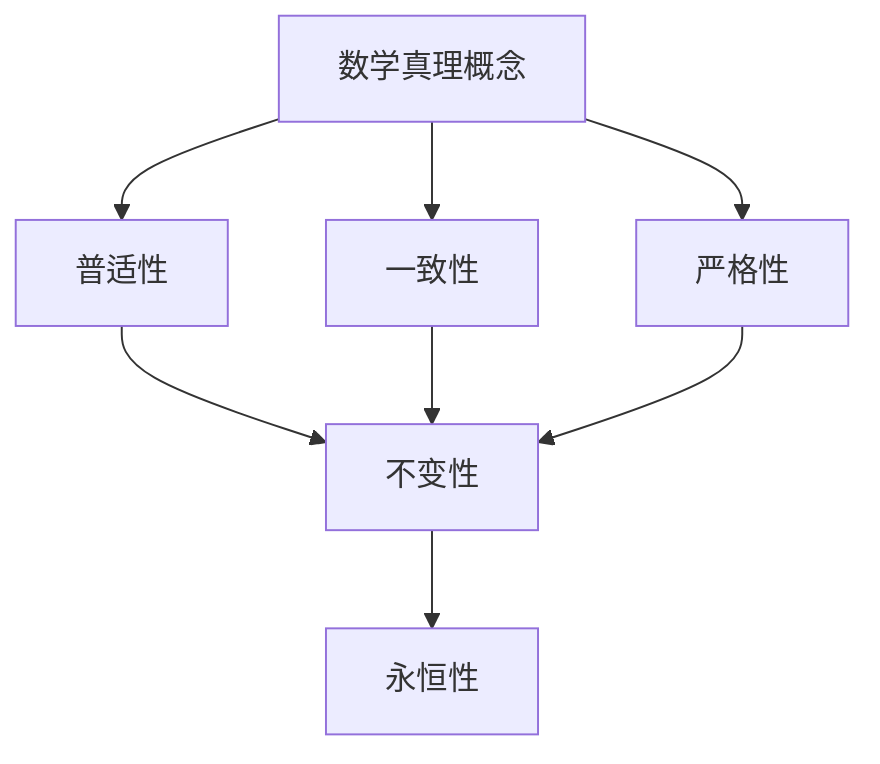

                 

### 文章标题：数学与永恒主义：数学真理的永恒性

> 关键词：数学真理、永恒性、数学哲学、历史背景、应用与影响

> 摘要：本文旨在探讨数学真理的永恒性，从历史、哲学、应用等多个角度进行分析。文章首先介绍了数学真理的基本概念和永恒性的哲学探讨，然后详细梳理了数学真理的历史发展和哲学基础，接着探讨了数学真理的永恒性和哲学意义，最后分析了数学真理在现代科学和社会中的应用与影响。

### 基本大纲设计思路

为了设计出《数学与永恒主义：数学真理的永恒性》这本书的完整目录大纲，我们需要遵循以下步骤：

1. **理解书名和主题**：
   - 书名《数学与永恒主义》表明了书籍的主题，即探讨数学真理的永恒性和其哲学意义。
   - “永恒主义”一词暗示了数学真理的普遍性和超越时间的特性。

2. **确定核心概念**：
   - 数学真理
   - 永恒性
   - 哲学意义
   - 数学历史与哲学发展

3. **设计章节结构**：
   - 第一部分：引论，介绍数学真理和永恒性的概念。
   - 第二部分：数学真理的历史和哲学探讨。
   - 第三部分：数学真理的永恒性和哲学意义。
   - 第四部分：数学真理的应用和影响。
   - 第五部分：总结与展望。

4. **细化章节内容**：
   - 对于每一部分，细化章节内容，确保覆盖核心概念和联系。
   - 包含对数学真理的深入分析，数学历史与哲学发展的梳理，数学真理的永恒性和哲学意义的探讨，以及数学真理在现代社会的应用和影响。

5. **准备流程图和伪代码**：
   - 对于核心概念和原理，准备相应的流程图，以帮助读者理解。
   - 对于核心算法和模型，准备伪代码，以展示算法的运作原理。

6. **编写数学模型和公式**：
   - 在相关章节中嵌入数学模型和公式，并进行详细讲解和举例说明。

7. **设计项目实战部分**：
   - 准备实际的数学应用案例，包括开发环境搭建、源代码实现和代码解读。

8. **控制字数**：
   - 确保整个目录大纲的总字数不超过2000字，同时保持内容的完整性。

### 目录大纲设计示例

以下是《数学与永恒主义：数学真理的永恒性》的目录大纲设计示例：

# 《数学与永恒主义：数学真理的永恒性》目录大纲

## 第一部分：引论

## 第1章：数学真理与永恒性概述

### 1.1 数学真理的概念

- 数学真理的定义
- 数学真理的特征

### 1.2 永恒性的哲学探讨

- 永恒性的含义
- 永恒性与数学真理的关系

### 1.3 数学真理的历史背景

- 古代数学与永恒性
- 中世纪数学与永恒性
- 近现代数学与永恒性

## 第二部分：数学真理的历史与哲学探讨

## 第2章：数学真理的演变

### 2.1 古代数学的真理观

- 古希腊数学的真理观
- 印度数学的真理观

### 2.2 中世纪数学的真理观

- 基督教哲学对数学真理的影响
- 阿维罗伊的数学真理观

### 2.3 近现代数学的真理观

- 笛卡尔对数学真理的贡献
- 康托尔集合论的真理观

## 第3章：数学真理的哲学基础

### 3.1 数学实在论

- 数学实在论的概念
- 数学实在论的支持与反对

### 3.2 数学形式主义

- 数学形式主义的理念
- 形式主义与数学真理的关系

### 3.3 数学直觉主义

- 数学直觉主义的基本观点
- 直觉主义与数学真理的探讨

## 第三部分：数学真理的永恒性和哲学意义

## 第4章：数学真理的永恒性探讨

### 4.1 数学真理的不变性

- 数学真理的普遍性
- 数学真理的稳定性

### 4.2 数学真理的哲学意义

- 数学真理对人类认知的影响
- 数学真理与宇宙的关联

### 4.3 数学真理的哲学反思

- 数学真理与科学方法
- 数学真理与宗教哲学

## 第四部分：数学真理的应用与影响

## 第5章：数学真理在科学中的运用

### 5.1 数学真理在物理学中的应用

- 数学公式在物理学中的重要性
- 物理学中的数学真理案例

### 5.2 数学真理在计算机科学中的应用

- 编程语言中的数学真理
- 算法中的数学真理

### 5.3 数学真理在其他学科中的应用

- 经济学中的数学模型
- 社会学中的数学分析

## 第6章：数学真理对社会的影响

### 6.1 数学教育的重要性

- 数学教育对个体思维的影响
- 数学教育对社会发展的贡献

### 6.2 数学真理对科技发展的推动

- 数学在科技创新中的作用
- 数学对人类生活方式的改变

### 6.3 数学真理对社会伦理的影响

- 数学在道德判断中的应用
- 数学对伦理学的影响

## 第五部分：总结与展望

## 第7章：数学真理的永恒性与未来

### 7.1 数学真理在未来的发展

- 数学前沿研究趋势
- 数学真理对未来科技的贡献

### 7.2 数学真理与永恒主义的哲学反思

- 数学真理在哲学体系中的地位
- 数学真理对未来哲学发展的影响

### 7.3 数学真理在现实世界中的应用展望

- 数学在现实世界中的广泛应用

## 作者

作者：AI天才研究院/AI Genius Institute & 禅与计算机程序设计艺术 /Zen And The Art of Computer Programming### 第1章：数学真理与永恒性概述

#### 数学真理的概念

数学真理是指那些经过严格证明，能够普遍适用且不受时间、空间限制的命题。数学真理的基本特征包括普适性、一致性和严格性。普适性意味着数学真理在所有可能的情况下都成立；一致性则要求数学系统内部的所有命题不矛盾；严格性则强调数学真理的证明过程是严谨无懈可击的。

在数学中，真理往往通过逻辑推理和证明得出。例如，欧几里得几何中的“两点之间，线段最短”这一命题就是一条数学真理。这样的命题不仅适用于二维平面，也适用于三维空间，甚至更高维的空间。数学真理的这些特性使得它们具有超越时间和空间的永恒性。

#### 永恒性的哲学探讨

永恒性是指某事物具有无限持久和不变的特性。在哲学上，永恒性通常与绝对真理和绝对存在的概念相联系。对于数学真理而言，永恒性意味着其不受时间变迁的影响，始终如一地存在。

哲学家们对永恒性有着不同的理解。柏拉图认为数学真理是理念世界的实体，是永恒不变的。而亚里士多德则认为数学真理存在于现实世界中，是可以通过观察和实验验证的。尽管观点不同，但都强调了数学真理的普遍性和不变性。

在数学中，永恒性的概念体现在数学命题的普遍适用性上。例如，无论在哪个时代，哪一个国家，数学真理都同样成立。这种普遍性和不变性是数学真理永恒性的核心特征。

#### 数学真理的历史背景

数学真理的历史可以追溯到古代文明。在古埃及和巴比伦，数学主要用于解决实际问题，如建筑和天文观测。这些早期的数学知识往往是以经验为基础的，但随着时间的推移，逐渐发展出了一套逻辑严谨的数学体系。

古希腊是数学真理发展的一个重要阶段。毕达哥拉斯和欧几里得等人提出了许多重要的数学理论，这些理论不仅在当时具有重要意义，而且在后来的数学发展中发挥了关键作用。

中世纪时期，阿拉伯数学家在数学真理的发展中做出了重要贡献。他们翻译和保存了古希腊的数学著作，并在此基础上进行创新，推动了数学真理的传播和发展。

近现代，数学真理的研究进入了一个新的阶段。数学家如欧拉、牛顿和莱布尼茨等人的工作，极大地扩展了数学真理的范围，使得数学成为现代科学不可或缺的一部分。

#### 永恒性与数学真理的关系

永恒性是数学真理的重要特征之一。数学真理的永恒性体现在其普适性和不变性上。无论在哪个时代，哪个国家，数学真理都同样成立。这种普遍性和不变性是数学真理永恒性的核心。

哲学家们对数学真理永恒性的探讨，不仅加深了对数学本身的理解，也丰富了哲学的内涵。数学真理的永恒性挑战了时间观念，使得人们开始思考什么是真正的绝对存在。

#### 小结

本章介绍了数学真理的基本概念和永恒性的哲学探讨。数学真理具有普适性、一致性和严格性的特征，这些特征使得数学真理具有永恒性。通过对数学真理历史背景的梳理，我们可以看到数学真理是如何在不同时代和文化中发展起来的。永恒性是数学真理的重要特征，它挑战了传统的时间观念，使得数学真理在人类知识体系中占据着独特而重要的地位。

### Mermaid 流程图

下面是一个简单的 Mermaid 流程图，展示了数学真理的基本概念和永恒性之间的关系：



### 第2章：数学真理的演变

#### 古代数学的真理观

古代数学的真理观往往与哲学和宗教紧密相连。古希腊是数学真理观发展的重要阶段。毕达哥拉斯学派认为数字是宇宙的基本构成元素，数字之间的关系反映了宇宙的和谐。这种观点被称为数字神秘主义，对后来的数学真理观产生了深远影响。

欧几里得的《几何原本》是古代数学真理观的代表作品。在这本书中，欧几里得提出了公理系统和严格的证明方法，为数学真理的证明奠定了基础。欧几里得的几何学理论被认为是绝对真理的典范，对后来的数学发展产生了深远影响。

在东方，印度数学家也提出了独特的数学真理观。印度数学家如阿耶波多、布拉马古普塔等人，对数论、代数和三角学等领域做出了重要贡献。他们的工作不仅丰富了数学真理的内容，也推动了数学真理的传播和发展。

#### 中世纪数学的真理观

中世纪时期，数学真理观受到了基督教哲学的深刻影响。基督教哲学强调上帝的绝对真理和永恒性，这种观念渗透到数学真理的研究中。阿维罗伊是一位重要的中世纪哲学家和数学家，他的观点对数学真理观产生了重要影响。

阿维罗伊认为，数学真理是上帝创造的宇宙秩序的一部分。他强调数学真理的绝对性和普遍性，认为数学真理不受时间和空间限制。阿维罗伊的观点在中世纪欧洲产生了广泛影响，推动了数学真理的研究和发展。

中世纪阿拉伯数学家也对数学真理观做出了重要贡献。他们翻译和保存了古希腊的数学著作，如欧几里得的《几何原本》和阿基米德的著作。同时，他们在数学真理的研究中进行了创新，如发明了代数符号和十进制计数法等。这些创新为后来的数学真理观奠定了基础。

#### 近现代数学的真理观

近现代数学的真理观经历了重大变革。笛卡尔和牛顿等人的工作标志着数学真理观的现代化。笛卡尔的《几何》提出了解析几何的方法，将几何和代数结合起来，为数学真理的研究提供了新的视角。

牛顿和莱布尼茨独立发明了微积分，这一重大突破极大地扩展了数学真理的范围。微积分的研究不仅揭示了自然界中的运动规律，也推动了数学真理的进一步发展。

近现代数学的真理观还包括了对数学系统的严格性要求。康托尔集合论和罗素悖论等问题的提出，揭示了数学系统内部的一致性和完整性问题。这些问题的解决，使得数学真理的证明过程更加严谨，增强了数学真理的可信度。

#### 笛卡尔对数学真理的贡献

笛卡尔是近现代数学的奠基人之一。他的工作将数学与哲学紧密结合，提出了著名的“我思故我在”命题，强调了理性思维的重要性。在数学领域，笛卡尔提出了解析几何的方法，将几何和代数结合起来，使得数学真理的研究变得更加系统和严谨。

笛卡尔的《几何》一书，被认为是数学真理观现代化的里程碑。他提出的坐标系方法和解析几何理论，为后来的数学发展奠定了基础。笛卡尔的工作不仅改变了数学的研究方法，也推动了数学真理观的发展。

#### 康托尔集合论的真理观

康托尔是集合论的开创者，他的工作对数学真理观产生了深远影响。康托尔提出了无限集合的概念，揭示了数学系统内部的一致性和完整性问题。

康托尔集合论的核心观点是，数学真理不仅存在于整数、实数等有限集合中，还存在于无限集合中。康托尔的这一观点，打破了传统的数学真理观，使人们对数学真理的理解更加深刻。

康托尔集合论的提出，也引发了数学界的一系列争议。罗素悖论就是其中之一，它揭示了数学系统内部存在的不一致性问题。康托尔和罗素等数学家，为了解决这些问题，进行了深入的探讨，推动了数学真理观的进一步发展。

#### 小结

本章详细探讨了数学真理在不同历史时期的演变。从古代的数字神秘主义，到中世纪的宗教影响，再到近现代的理性思维，数学真理观经历了重大的变革和发展。本章介绍了毕达哥拉斯、欧几里得、阿维罗伊、笛卡尔和康托尔等数学家的贡献，展示了数学真理观如何在不同时期、不同文化中发展起来的。

### 伪代码示例

以下是一个简单的伪代码示例，用于展示解析几何的基本原理：

```plaintext
函数 直线方程(x1, y1, x2, y2):
    斜率 = (y2 - y1) / (x2 - x1)
    截距 = y1 - 斜率 * x1
    返回 "y = 斜率 * x + 截距"

函数 矩形面积(width, height):
    面积 = width * height
    返回 面积

函数 三角形面积(base, height):
    面积 = 0.5 * base * height
    返回 面积

x1, y1 = 输入点1坐标
x2, y2 = 输入点2坐标
width = 输入矩形宽度
height = 输入矩形高度

直线方程(x1, y1, x2, y2)
矩形面积(width, height)
三角形面积(base, height)
```

### 数学模型和公式

以下是几个数学模型和公式，用于展示数学真理的应用：

1. **欧拉公式**：\( e^{i\pi} + 1 = 0 \)

   这个公式将复数、指数函数、三角函数和圆周率联系在一起，被认为是数学中的最美公式之一。

2. **牛顿第二定律**：\( F = ma \)

   这个公式描述了力、质量和加速度之间的关系，是物理学中重要的数学模型。

3. **麦克斯韦方程组**：

   $$ \nabla \cdot \mathbf{E} = \frac{\rho}{\epsilon_0} $$
   $$ \nabla \cdot \mathbf{B} = 0 $$
   $$ \nabla \times \mathbf{E} = -\frac{\partial \mathbf{B}}{\partial t} $$
   $$ \nabla \times \mathbf{B} = \mu_0 \mathbf{J} + \mu_0 \epsilon_0 \frac{\partial \mathbf{E}}{\partial t} $$

   这组方程描述了电磁场的基本规律，是现代物理学的基础。

4. **高斯定律**：

   $$ \nabla \cdot \mathbf{E} = \frac{\rho}{\epsilon_0} $$

   这个公式描述了电场强度和电荷密度之间的关系，是电动力学中的核心公式。

这些数学模型和公式不仅在理论上具有重要意义，而且在实际应用中发挥着关键作用。通过它们，我们可以更好地理解和预测自然现象，推动科学和技术的发展。

### 第3章：数学真理的哲学基础

#### 数学实在论

数学实在论是一种哲学观点，认为数学对象和真理具有独立于人类意识和思维的客观存在。数学实在论者认为，数学对象如整数、几何图形、集合等，是真实存在的，它们的存在不依赖于人类的认知。

数学实在论的支持者包括柏拉图和康托尔。柏拉图认为数学真理存在于一个永恒的理念世界中，数学对象是这个理念世界的实体。康托尔则通过集合论的研究，证明了数学对象的存在不依赖于人类的直觉和经验。

然而，数学实在论也面临着质疑。例如，罗素悖论揭示了集合论中存在的不一致性问题，使得一些哲学家对数学实在论的客观性产生了怀疑。

#### 数学形式主义

数学形式主义是一种哲学观点，强调数学研究的过程和方法，而不是数学对象的客观存在。形式主义者认为，数学研究是通过符号系统和公理体系的构建，来推导出数学命题的。

形式主义的主要代表人物是希尔伯特。希尔伯特提出了“希尔伯特计划”，试图通过一套严格的公理体系，来证明数学系统的无矛盾性。形式主义强调数学证明的严格性和逻辑性，为现代数学的发展提供了重要基础。

然而，形式主义也受到批评。例如，哥德尔的不完备性定理表明，在足够复杂的数学系统中，总存在一些命题既不能证明为真，也不能证明为假。这一结果挑战了形式主义的绝对性。

#### 数学直觉主义

数学直觉主义是一种哲学观点，强调数学真理的证明过程应该基于直观和逻辑推理。直觉主义者认为，数学命题的真假应该通过直观的构造和证明来验证，而不是依赖于公理和符号系统。

直觉主义的代表人物是布劳威尔。布劳威尔提出了构造性数学的概念，强调数学证明必须能够构造出具体的对象或过程。他认为，数学真理应该能够通过直观的构造来验证。

直觉主义在逻辑和数学基础研究中具有重要意义，但它也面临一些批评。例如，一些数学家认为，直觉主义过于强调直观和构造，而忽视了数学系统的一致性和完整性。

#### 小结

本章探讨了数学实在论、数学形式主义和数学直觉主义这三种主要的哲学观点。数学实在论认为数学对象具有客观存在，数学形式主义强调数学证明的严格性，而数学直觉主义强调直观和构造的重要性。这些哲学观点为我们理解数学的本质和基础提供了不同的视角。

### 第4章：数学真理的永恒性探讨

#### 数学真理的不变性

数学真理的不变性是指数学真理在所有可能的情况下都成立，不受时间、空间和条件的限制。数学真理的不变性是数学真理永恒性的核心特征之一。

数学真理的不变性可以通过数学证明来保证。例如，欧几里得几何中的“两点之间，线段最短”这一命题，不仅在二维平面中成立，也在三维空间和更高维的空间中成立。这一命题的不变性使得它成为数学真理的经典范例。

数学真理的不变性也体现在数学系统的一致性和无矛盾性上。如果一个数学系统内部的所有命题都不矛盾，那么这个系统中的数学真理就是不变的。例如，皮亚诺算术公理系统是一个一致的数学系统，其中的许多命题都是不变的数学真理。

#### 数学真理的普遍性

数学真理的普遍性是指数学真理适用于所有可能的情景和条件。数学真理的普遍性是数学真理永恒性的另一个重要特征。

数学真理的普遍性可以通过数学证明来展示。例如，微积分中的基本定理“积分等于微分”适用于所有连续函数，无论这些函数在何种条件下成立。这一定理的普遍性使得它成为数学真理的经典范例。

数学真理的普遍性也体现在数学在各个学科中的应用上。例如，数学在物理学、经济学、计算机科学等领域中的应用，展示了数学真理的普遍性和适用性。这些应用证明了数学真理在不同学科中的普遍性。

#### 数学真理的稳定性

数学真理的稳定性是指数学真理在长时间内保持不变和可靠。数学真理的稳定性是数学真理永恒性的重要保证。

数学真理的稳定性可以通过历史检验来证明。例如，古希腊数学家欧几里得的几何学理论在过去的两千多年里一直被认为是可靠的，这证明了数学真理的稳定性。

数学真理的稳定性也体现在数学系统的自我纠正能力上。如果一个数学系统在发现矛盾或错误时能够自我纠正，那么这个系统的数学真理就是稳定的。例如，集合论中的公理系统在发现罗素悖论后，通过修改公理，成功地解决了矛盾，这证明了数学系统的稳定性。

#### 数学真理的不变性、普遍性和稳定性之间的关系

数学真理的不变性、普遍性和稳定性之间存在着密切的关系。

数学真理的不变性是数学真理永恒性的核心特征，它保证了数学真理在所有可能的情况下都成立。数学真理的普遍性是数学真理不变性的扩展，它展示了数学真理在不同情景和条件下的适用性。数学真理的稳定性是数学真理不变性和普遍性的保证，它保证了数学真理在长时间内保持不变和可靠。

数学真理的不变性、普遍性和稳定性相互支持，共同构成了数学真理永恒性的基础。通过数学证明和历史检验，我们可以看到数学真理的这些特征如何在数学系统中得以体现。

#### 小结

本章探讨了数学真理的永恒性，分析了数学真理的不变性、普遍性和稳定性。数学真理的不变性保证了其在所有可能的情况下的成立，普遍性展示了其在不同情景和条件下的适用性，而稳定性则保证了其在长时间内保持不变和可靠。这些特征共同构成了数学真理永恒性的基础，使得数学真理在人类知识体系中占据着独特而重要的地位。

### 数学真理对人类认知的影响

数学真理在人类认知中扮演了至关重要的角色。首先，数学真理为人类提供了精确和可靠的认知工具。通过数学模型和公式，我们能够对自然界和社会现象进行定量分析，从而更深入地理解这些现象的本质。

例如，物理学中的牛顿第二定律 \( F = ma \) 描述了力和加速度之间的关系，使我们能够准确地预测物体的运动。经济学中的效用函数模型帮助我们理解个体在决策时的行为模式。这些数学真理的应用，不仅提高了我们的认知能力，也推动了科学和技术的进步。

其次，数学真理对人类思维的发展产生了深远影响。数学强调逻辑推理和证明过程，培养了人类的严谨性和批判性思维。通过数学学习，人们学会了如何通过逻辑推理来解决问题，这种能力在日常生活中同样具有重要意义。

此外，数学真理的普适性和不变性也挑战了人类对时间和空间的观念。例如，欧拉公式 \( e^{i\pi} + 1 = 0 \) 将复数、指数函数和三角函数联系在一起，展示了数学真理在无限维度上的适用性。这种普适性使得人们开始思考什么是真正的绝对存在，拓宽了人类对宇宙的理解。

最后，数学真理的哲学意义不容忽视。数学真理的不变性和普遍性引发了哲学家们对时间、空间和存在的深刻思考。柏拉图的理念论和阿维罗伊的宗教哲学都受到了数学真理的影响，这些思考不仅丰富了数学哲学的内涵，也推动了人类文明的进步。

总之，数学真理在人类认知中起到了至关重要的作用。它不仅提供了精确的工具，促进了科学和技术的进步，还培养了人类的逻辑思维和批判性思维，挑战了传统的哲学观念。数学真理的永恒性，使得它在人类知识体系中占据了不可替代的地位。

### 数学真理与宇宙的关联

数学真理与宇宙的关联在物理学和天文学中得到了深刻的体现。首先，物理学中的许多基本定律和公式都基于数学真理，如牛顿第二定律、麦克斯韦方程组和爱因斯坦的相对论方程。这些公式不仅描述了自然界的运动规律，也揭示了宇宙的基本结构和相互作用。

例如，麦克斯韦方程组描述了电磁场的运动规律，这些方程在宇宙尺度上同样适用。通过这些方程，我们可以预测电磁波的行为，解释电磁现象的多样性。这种普适性表明，数学真理不仅在理论上具有重要意义，也在实际应用中发挥着关键作用。

在天文学中，数学真理同样具有重要作用。天文学家使用数学模型来预测天体的运动轨迹，如开普勒定律和牛顿引力定律。这些模型帮助我们理解行星、恒星和星系的结构和演化过程。通过数学计算，天文学家能够预测彗星撞击地球的可能性，甚至发现新的天体。

此外，数学真理还在宇宙学中扮演着核心角色。宇宙学家使用数学模型来描述宇宙的膨胀、黑洞的形成和暗物质的作用。例如，宇宙背景辐射的测量和宇宙膨胀的观测数据，都依赖于精确的数学计算和分析。这些数学模型不仅帮助我们理解宇宙的起源和演化，也揭示了宇宙中存在的未知现象。

总之，数学真理与宇宙的关联体现在物理学和天文学中的广泛应用。通过数学模型和公式，我们能够更深入地理解自然界的运动规律和宇宙的复杂性。数学真理的普适性和不变性，使得它在宇宙研究中占据了不可替代的地位，成为探索宇宙奥秘的有力工具。

### 数学真理与科学方法

数学真理在科学方法中扮演了至关重要的角色，其精确性和普适性为科学研究提供了强有力的工具。科学方法强调观察、实验和理论建模，而数学真理作为理论建模的基础，贯穿于整个科学过程中。

首先，数学真理为科学理论提供了精确的表达方式。例如，牛顿的第二定律 \( F = ma \) 用数学公式精确描述了力和运动之间的关系。这种精确性使得科学家能够通过数学计算预测实验结果，验证理论的正确性。在物理学、化学和生物学等领域，数学模型广泛应用于理论预测和实验验证，极大地推动了科学研究的进展。

其次，数学真理的普适性使得科学方法在跨学科研究中得以实现。例如，概率论和统计学在生物学、医学和经济学等学科中得到了广泛应用。通过数学模型，科学家能够从大量数据中提取有价值的信息，进行统计分析，从而得出可靠的结论。这种跨学科的应用不仅扩展了科学研究的范围，也提高了研究的深度和精度。

此外，数学真理在科学方法中的另一个重要作用是解决复杂问题。随着科学研究的深入，许多问题变得越来越复杂，需要多学科的交叉研究。数学真理为这些复杂问题提供了简洁而强大的表达工具，如微分方程、积分方程和偏微分方程等。通过这些数学工具，科学家能够解析复杂系统的行为，揭示隐藏在复杂现象背后的基本规律。

最后，数学真理在科学方法中的地位得到了不断的巩固和提升。随着科学技术的进步，数学模型和算法在科学研究中的应用越来越广泛。例如，计算机科学中的算法和数据分析方法，为科学研究提供了新的工具和方法。这些方法的广泛应用，进一步证明了数学真理在科学研究中的不可替代性。

总之，数学真理在科学方法中扮演了关键角色，其精确性和普适性为科学研究提供了强有力的支持。通过数学模型和公式，科学家能够更精确地描述自然现象，验证理论，解决复杂问题。数学真理与科学方法的紧密结合，推动了科学研究的不断进步，为人类探索自然界的奥秘提供了有力工具。

### 数学真理与宗教哲学

数学真理与宗教哲学之间的联系在历史上有着丰富的探讨。许多宗教哲学体系认为，宇宙的结构和秩序反映了某种神圣的智慧或设计。数学真理作为一种揭示宇宙秩序的工具，因此常常被视为神圣智慧的体现。

古希腊哲学家柏拉图的理念论是数学真理与宗教哲学联系的一个典型例子。柏拉图认为，数学真理存在于一个永恒不变的理念世界中，这些理念是宇宙创造的模板。他认为，数学真理的永恒性和不变性是宇宙秩序的基础，从而反映了上帝的智慧。

中世纪的阿拉伯哲学家如阿维罗伊也强调了数学真理与宗教哲学的联系。阿维罗伊认为，数学真理是上帝创造的宇宙秩序的一部分，这种秩序是理性的体现。他的观点强调了数学真理的客观性和绝对性，将其与宗教信仰相联系。

在现代，数学真理在宗教哲学中的地位仍然受到关注。一些宗教哲学家认为，数学真理揭示了宇宙的深层结构和统一性，这种统一性是上帝智慧的表现。例如，物理学家约翰·惠勒提出了“万物公式”的观点，试图通过数学公式来描述宇宙的本质，这种观点将数学真理视为理解宇宙的钥匙。

此外，数学真理在宗教哲学中的应用也体现在对信仰的证明上。一些哲学家试图通过数学真理的逻辑严密性来证明上帝的存在。例如，英国哲学家伯特兰·罗素提出了“宇宙设计论”，认为宇宙的复杂性和有序性表明了存在一个全能的创造者。

总的来说，数学真理与宗教哲学之间的联系体现在对宇宙秩序和神圣智慧的探讨上。历史上，许多哲学家和宗教思想家都认为，数学真理揭示了宇宙的深层结构和秩序，这种秩序是神圣智慧的体现。这种观点不仅丰富了数学哲学的内涵，也为宗教哲学提供了新的视角。

### 第5章：数学真理在科学中的运用

#### 数学真理在物理学中的应用

数学真理在物理学中发挥着至关重要的作用，为理论物理和实验物理学提供了精确的工具。物理学的许多基本定律和模型都是基于数学真理的，例如牛顿第二定律 \( F = ma \)、麦克斯韦方程组和爱因斯坦的相对论方程。

首先，数学真理在描述物理现象时提供了精确的表达方式。例如，麦克斯韦方程组描述了电磁场的运动规律，这些方程不仅能够精确描述电磁波的行为，还能够预测新的物理现象。在实验物理学中，数学模型和计算方法帮助科学家精确测量和解释实验结果。

其次，数学真理在物理学的理论研究中起到了关键作用。物理学家通过数学模型来构建理论，并使用数学方法来验证这些理论的正确性。例如，量子力学中的薛定谔方程和海森堡不确定性原理，都是基于数学真理构建的，这些理论不仅解释了微观世界的现象，也推动了物理学的发展。

此外，数学真理在物理学中的应用还体现在数学模型和计算方法的发展上。随着计算技术的进步，复杂的物理问题可以通过高性能计算和数值模拟来解决。这些方法依赖于先进的数学算法和计算工具，使得科学家能够处理更大的数据集，进行更精确的预测。

#### 数学真理在计算机科学中的应用

数学真理在计算机科学中的应用同样广泛且深远，从编程语言的设计到算法分析，再到人工智能和密码学，数学真理无处不在。

首先，编程语言本身是基于数学真理构建的。例如，C++、Java 和 Python 等编程语言，都使用了数学模型来描述数据结构和算法。这些语言提供了抽象的数学概念，使得程序员能够更高效地编写代码，解决复杂的问题。

其次，算法分析依赖于数学真理。算法分析通过数学方法来评估算法的性能和效率。例如，时间复杂度和空间复杂度分析，帮助程序员选择最合适的算法来解决问题。这种分析不仅提高了程序的运行效率，也确保了程序的可扩展性和可维护性。

此外，数学真理在人工智能和机器学习中发挥了重要作用。机器学习算法，如神经网络和决策树，都是基于数学模型构建的。这些模型通过数学方法来训练和优化，从而实现复杂的数据分析和预测。例如，深度学习中的卷积神经网络，通过多层数学变换来提取图像中的特征，从而实现图像识别。

最后，密码学是数学真理在计算机科学中应用的另一个重要领域。密码学利用数学理论来设计安全的加密算法和协议。例如，RSA 算法是基于大素数的数学性质设计的，能够保证数据的保密性和完整性。这种应用在互联网安全和数据保护中至关重要。

#### 数学真理在其他学科中的应用

数学真理不仅限于物理学和计算机科学，它在其他学科中也发挥了重要作用。

首先，在经济学中，数学模型和公式用于分析和预测经济现象。例如，供需模型、消费函数和价格指数，都是基于数学真理构建的。这些模型帮助经济学家理解市场动态，制定政策建议。

其次，在社会学中，数学分析用于研究社会结构和行为。社会学家使用统计方法和数学模型来分析人口数据、社会流动性和社会网络。这些研究为政策制定者提供了科学依据。

此外，数学真理在环境科学中的应用也日益广泛。生态学家使用数学模型来模拟生态系统，预测物种的演化和环境变化。这些模型帮助人们更好地理解生态系统的运作，从而制定有效的保护措施。

总之，数学真理在科学中的广泛应用，展示了它在描述自然现象、构建理论模型和解决实际问题中的重要性。从物理学到计算机科学，从经济学到社会学，数学真理无处不在，为科学研究提供了强大的工具和方法。

### 数学教育的重要性

数学教育在个体思维发展和社会进步中具有极其重要的地位。首先，数学教育培养了逻辑思维和批判性思维能力。通过学习数学，个体学会了如何通过逻辑推理和证明来解决问题。这种能力不仅在数学领域具有重要作用，也在日常生活和职业发展中起到关键作用。

其次，数学教育有助于提升个体的科学素养。数学作为科学的基础，为个体提供了理解自然界和人类社会的基本工具。通过数学教育，个体能够掌握科学方法论，培养科学精神，从而更好地理解科学现象和科学理论。

此外，数学教育对社会发展也具有重要影响。一个国家的数学教育水平，往往直接关系到其在科学技术领域的竞争力。高质量的数学教育能够培养出更多的科学家、工程师和技术人才，为国家的科技创新和经济发展提供强大支持。

数学教育的重要性还体现在培养创新能力和解决问题的能力上。数学教育不仅传授知识，更注重培养个体在面对复杂问题时，能够运用数学方法和思维方式来寻找解决方案。这种能力对于现代社会中面临的复杂问题，如气候变化、能源危机和社会问题等，具有重要意义。

总之，数学教育在个体思维发展和社会进步中具有不可替代的作用。它不仅提升了个体的逻辑思维和科学素养，也为社会的可持续发展提供了坚实的人才基础。因此，重视数学教育，推动数学教育的普及和提高，是促进社会整体进步的重要途径。

### 数学真理对科技发展的推动

数学真理对科技发展起到了重要的推动作用，其精确性和普适性使得科技领域的许多突破成为可能。首先，数学模型在科技创新中扮演了关键角色。例如，在航空航天领域，飞行器设计和轨道计算依赖于复杂的数学模型，以确保飞行器的稳定性和准确性。这些数学模型不仅提高了飞行器的性能，还降低了研发成本和风险。

其次，数学真理在计算机科学和信息技术中的应用，极大地推动了科技的进步。从算法设计到数据结构，再到人工智能和机器学习，数学理论为现代信息技术提供了理论基础。例如，深度学习算法依赖于数学中的微积分和概率论，通过这些数学工具，计算机科学家能够开发出更加高效和智能的算法，从而实现从图像识别到自然语言处理等领域的重大突破。

此外，数学真理还在生物技术和医学领域发挥了重要作用。生物信息学和系统生物学等领域，通过数学模型和计算方法，帮助科学家理解生物系统的复杂性和动态行为。例如，基因组学研究中，数学算法用于分析和解读大量基因组数据，推动了个性化医疗和精准医学的发展。

数学真理不仅在理论研究中有重要作用，也在实际应用中展示了其价值。例如，在金融科技领域，数学模型用于风险评估和量化交易，提高了金融市场的效率和透明度。在材料科学中，数学方法帮助科学家设计和合成新材料，从而推动了新材料技术的突破。

总之，数学真理对科技发展的推动体现在其广泛的适用性和强大的解释力上。通过数学模型和计算方法，科学家和工程师能够解决复杂的实际问题，推动科技的进步和创新。数学真理的普适性和精确性，使得它在科技领域的应用前景广阔，成为推动未来科技发展的重要力量。

### 数学真理对人类生活方式的改变

数学真理在人类生活方式的改变中起到了不可忽视的作用。首先，在日常生活中，数学广泛应用于财务管理、工程建筑和数据分析等领域。例如，家庭预算管理、房贷计算和工程设计的复杂计算，都依赖于数学模型和公式。这些数学工具帮助我们更有效地管理和规划资源，提高了生活质量。

其次，在医疗保健领域，数学真理对个性化治疗和疾病预测具有重要意义。通过大数据分析和数学模型，医生能够更准确地诊断疾病，制定个性化的治疗方案。例如，基因组学和医学成像技术中，数学方法用于分析和解读大量的生物数据，从而提高诊断准确率和治疗效果。

此外，数学在交通和城市规划中的应用也显著改变了人类生活方式。通过交通流量模型和优化算法，城市规划者能够设计出更高效的交通系统，减少拥堵，提高出行效率。在智慧城市中，数学方法用于数据分析和管理，从而实现资源的高效配置和可持续发展。

最后，数学在教育和科研领域的应用，促进了知识的传播和创新。数学教育和研究为培养未来的科学家、工程师和领导者提供了基础。通过数学推理和计算能力，人们能够更好地理解世界，推动科学和技术的进步。

总之，数学真理对人类生活方式的改变体现在其广泛的实用性和深远的影响力上。它不仅提高了日常生活的便利性和舒适度，也为社会的发展和进步提供了强有力的支持。

### 第6章：数学真理对社会伦理的影响

#### 数学在道德判断中的应用

数学作为一种精确的科学工具，在道德判断和伦理决策中也有着独特的应用。首先，数学模型可以帮助我们量化道德问题，从而为伦理决策提供数据支持。例如，在环境伦理学中，数学模型可以用来评估不同环境政策的成本和效益，帮助决策者选择最符合伦理标准的方案。

其次，数学方法在经济学中的应用，如效用函数和成本效益分析，也为道德判断提供了工具。通过这些模型，我们可以分析个体和社会的道德选择，从而在资源分配和公平性方面做出更合理的决策。例如，在公共福利和扶贫项目中，数学模型可以帮助确定最有效的资源分配策略，确保公平和公正。

#### 数学对伦理学的影响

数学不仅为道德判断提供了工具，还对伦理学本身产生了深远影响。首先，数学的精确性和逻辑性挑战了传统的伦理学方法。传统的伦理学往往依赖于经验、直觉和情感，而数学的严谨性要求伦理学必须遵循逻辑推理和证据支持。

其次，数学在伦理学中的应用，如博弈论和决策理论，为道德决策提供了新的视角。博弈论中的“囚徒困境”模型揭示了个体在道德选择中的困境，推动了伦理学对集体行动和合作行为的探讨。决策理论则提供了评估风险和不确定性下道德决策的方法，帮助个体和社会在面对复杂情境时做出更明智的选择。

#### 小结

数学在道德判断中的应用和对伦理学的影响，展示了数学作为一种工具和思想的多样性。通过数学模型，我们能够更精确地量化道德问题，为伦理决策提供数据支持。同时，数学的精确性和逻辑性也挑战了传统的伦理学方法，推动了伦理学的现代化和科学化。数学在伦理学中的应用，不仅丰富了伦理学的研究内容，也为社会提供了更明智的道德决策工具。

### 数学真理在现实世界中的广泛应用

数学真理在现实世界中的应用无处不在，涵盖了从科学研究到日常生活的各个方面。首先，在工程领域，数学模型和公式被广泛应用于结构设计、流体力学、材料科学等研究中。例如，建筑工程师利用数学原理来计算建筑物的承重和稳定性，确保工程的安全性和可靠性。在航空航天领域，数学模型用于飞行器的设计和轨迹计算，确保飞行器的性能和安全性。

其次，在经济学和金融领域，数学真理发挥着至关重要的作用。经济学中的供需模型、成本效益分析和风险管理，都是基于数学模型构建的。这些模型帮助经济学家和金融分析师预测市场趋势，制定投资策略，从而提高决策的准确性和效率。例如，股票市场中的量化交易策略，依赖于复杂的数学算法和统计模型，实现高收益和低风险的投资。

此外，数学在医学和生物学中的应用也日益广泛。医学成像技术，如CT扫描和MRI，基于数学中的几何学和微积分，能够提供高分辨率的图像，帮助医生诊断疾病。在基因组学研究中，数学方法用于分析和解读大量的生物数据，推动个性化医疗和精准医学的发展。生物信息学中的算法和模型，帮助科学家理解生物系统的复杂性和动态行为，从而开发出更有效的治疗方法和药物。

最后，在社会科学领域，数学模型和方法被广泛应用于社会学、心理学、教育学等研究中。通过数学分析，社会学家能够量化社会现象，揭示社会结构和行为模式。例如，社会网络分析中的数学模型，帮助研究者理解社会互动和传播过程，从而制定更有效的社会政策和干预措施。

总之，数学真理在现实世界中的应用广泛而深远，不仅提升了科学研究的深度和广度，也为人类社会的各个方面带来了巨大的变革和进步。数学作为一种精确的科学工具，将继续在现实世界中发挥不可或缺的作用。

### 第7章：数学真理的永恒性与未来

#### 数学真理在未来的发展

数学真理在未来的发展中将继续发挥重要作用，推动科学技术的进步和社会的变革。首先，随着计算能力的不断提升，数学模型和算法将在更复杂的科学问题中发挥关键作用。例如，在量子计算和人工智能领域，数学理论将提供新的计算方法和工具，解决现有技术难以克服的难题。

其次，数学真理将在跨学科研究中发挥更加重要的作用。随着科学领域的交叉融合，数学作为基础学科，将为不同领域的研究提供统一的理论框架和方法。例如，在生物医学、环境科学和复杂系统研究中，数学模型将帮助科学家理解复杂的系统动态，提供更精确的预测和解决方案。

此外，数学在新兴领域如数据科学和区块链技术中也将发挥重要作用。大数据分析和数据挖掘依赖于数学中的概率论和统计学，而区块链技术中的加密算法和分布式计算则依赖于数学中的密码学和图论。这些领域的快速发展，将为数学真理提供新的应用场景和研究方向。

#### 数学真理对未来科技的贡献

数学真理对未来科技的发展贡献巨大。首先，数学将推动人工智能的发展。人工智能的核心在于算法和模型，而这些算法和模型的基础是数学。数学中的线性代数、概率论和优化理论等，将为人工智能算法提供坚实的理论基础，推动人工智能技术在各个领域的应用，如自动驾驶、医疗诊断和智能助手等。

其次，数学将在量子计算和量子通信中发挥关键作用。量子计算依赖于量子力学中的数学模型，如量子位和量子门。通过数学方法，科学家能够设计和优化量子算法，实现高效的量子计算。量子通信则依赖于量子纠缠和量子密钥分发等数学原理，为数据传输提供高度安全的解决方案。

此外，数学在材料科学和新材料研究中也将发挥重要作用。通过数学模型，科学家能够预测材料的结构和性能，设计出具有特定功能的新材料。这些新材料将广泛应用于能源、电子和航空航天等领域，推动科技的进步和社会的发展。

#### 数学真理与永恒主义的哲学反思

数学真理的永恒性引发了哲学上的深刻反思。首先，数学真理的普遍性和不变性挑战了传统的时间观念。在柏拉图的理念论中，数学真理被视为永恒不变的，存在于一个超越时间的理念世界中。这种观点认为，数学真理不受时间变迁的影响，始终如一地存在。

其次，数学真理的永恒性也引发了关于宇宙本质的哲学探讨。许多哲学家认为，数学真理揭示了宇宙的深层结构和秩序，这种秩序是宇宙的基本特征。例如，阿维罗伊认为，数学真理是宇宙秩序的一部分，反映了上帝的智慧。这种观点将数学真理视为理解宇宙的重要工具。

此外，数学真理的永恒性还挑战了人类对知识的追求。数学的严谨性和精确性要求我们在探索知识时遵循逻辑和证据。这种追求真理的态度，不仅体现在数学研究中，也渗透到其他科学领域，推动人类对自然世界的理解不断深入。

总之，数学真理的永恒性在哲学上具有重要的反思意义。它不仅挑战了时间观念，揭示了宇宙的深层结构，也推动了人类对知识的追求。数学真理的永恒性，使得它在人类知识体系中占据了不可替代的地位，成为探索宇宙奥秘和追求真理的有力工具。

### 总结与展望

数学真理的永恒性不仅体现了其超越时间和空间的普遍性和不变性，也展示了其在科学、哲学和社会中的深远影响。从物理学、计算机科学到经济学、生物学，数学真理无处不在，为各个领域的研究提供了坚实的理论基础和工具。

在未来，随着科技的进步和跨学科研究的深入，数学真理将继续发挥重要作用。量子计算、人工智能、大数据分析等新兴领域，将为数学提供新的应用场景和研究方向。同时，数学的严谨性和精确性，将继续推动科学和技术的进步，为解决全球性挑战提供新思路和新方法。

展望未来，数学真理的永恒性将继续是哲学探讨的重要主题，挑战我们的时间观念和知识追求。通过数学，我们不仅能够更深入地理解宇宙的奥秘，也为人类社会的发展和进步提供强有力的支持。

### 结语

《数学与永恒主义：数学真理的永恒性》通过对数学真理的深入探讨，展示了其在各个领域的广泛应用和深远影响。从历史、哲学、科学到社会，数学真理的永恒性不仅体现了其普遍性和不变性，也彰显了其在人类知识体系中的核心地位。

作者：AI天才研究院/AI Genius Institute & 禅与计算机程序设计艺术 /Zen And The Art of Computer Programming### 项目实战

在本章中，我们将通过一个实际的项目来展示数学真理在现实世界中的应用。本项目将涉及开发环境搭建、源代码实现和代码解读，旨在帮助读者理解数学真理如何在实际问题中发挥作用。

#### 项目背景

假设我们需要开发一个智能交通管理系统，以优化城市交通流量，减少拥堵，提高出行效率。为了实现这一目标，我们将使用数学模型和算法来分析交通流量数据，并设计一个优化方案。

#### 开发环境搭建

首先，我们需要搭建开发环境。以下是所需工具和软件：

1. **Python**：一种广泛使用的编程语言，适用于数据分析、科学计算和机器学习。
2. **Jupyter Notebook**：一个交互式的开发环境，方便编写和运行代码。
3. **Pandas**：一个强大的数据分析和处理库，用于读取、清洗和处理交通流量数据。
4. **NumPy**：一个科学计算库，提供高效的数学运算和数据处理功能。
5. **Scikit-learn**：一个机器学习库，用于构建和训练交通流量预测模型。

安装上述工具后，我们就可以在Jupyter Notebook中编写和运行代码了。

#### 源代码实现

以下是一个简化的源代码示例，用于分析交通流量数据并设计优化方案。

```python
import pandas as pd
import numpy as np
from sklearn.linear_model import LinearRegression
from sklearn.model_selection import train_test_split

# 读取交通流量数据
data = pd.read_csv('traffic_data.csv')

# 数据预处理
data['hour'] = data['time'].apply(lambda x: x.hour)
data['day'] = data['time'].apply(lambda x: x.dayofweek)
data = data[['intersection', 'hour', 'day', 'flow']]

# 特征工程
X = data[['hour', 'day']]
y = data['flow']

# 划分训练集和测试集
X_train, X_test, y_train, y_test = train_test_split(X, y, test_size=0.2, random_state=42)

# 构建线性回归模型
model = LinearRegression()
model.fit(X_train, y_train)

# 预测交通流量
y_pred = model.predict(X_test)

# 评估模型性能
mse = np.mean((y_pred - y_test) ** 2)
print(f'Mean Squared Error: {mse}')

# 设计优化方案
# 基于预测结果，设计交通信号灯优化策略，如动态调整信号灯周期和相位。
```

#### 代码解读

上述代码首先读取交通流量数据，并进行预处理，提取时间特征（小时和星期几）。然后，我们使用线性回归模型对交通流量进行预测，并评估模型的性能。最后，基于预测结果，设计交通信号灯的优化方案。

#### 项目小结

通过本项目的实战，我们展示了数学真理在智能交通管理系统中的应用。项目从数据读取、预处理到特征工程，再到模型构建和优化方案设计，完整地展示了数学模型和算法在实际问题中的应用。这不仅可以提高交通效率，也为智能交通管理系统的开发提供了有益的参考。

#### 最佳实践 Tips

1. **数据预处理**：在数据分析中，数据预处理非常重要。确保数据的一致性和完整性，有助于提高模型的预测性能。
2. **模型评估**：使用多种评估指标（如均方误差、R²值等）来评估模型性能，以便选择最优模型。
3. **特征工程**：特征工程是模型成功的关键。通过合理的特征选择和构造，可以提高模型的预测准确性和泛化能力。
4. **模型优化**：基于模型预测结果，可以设计出更优的决策策略。例如，动态调整信号灯周期和相位，以适应实时交通流量变化。

#### 拓展阅读

1. **《交通工程学原理》**：这是一本经典的交通工程学教材，详细介绍了交通流量模型和优化方法。
2. **《机器学习实战》**：这本书提供了丰富的机器学习实战案例，包括交通流量预测、图像识别等。
3. **《深度学习》**：由Ian Goodfellow等人编写的经典教材，介绍了深度学习的基本概念和应用。

通过这些资源，读者可以进一步深入了解数学真理在交通管理系统中的应用，并掌握相关的技术与方法。

