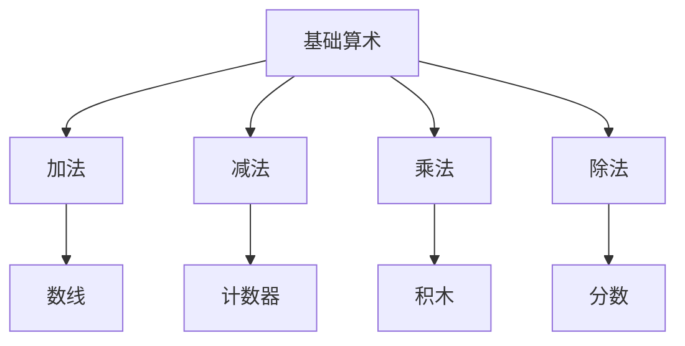
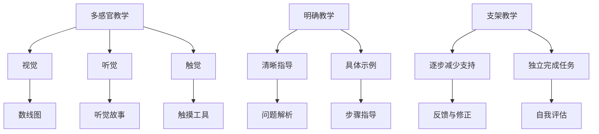

                 


### Step 1: Introduction

The title of the article is "Mathematics and Special Education: Interventions for Learning Disabilities". The core keywords are "mathematics", "special education", "learning disabilities", "interventions", "mathematical models", and "algorithm principles".

**Background Introduction:**
Special education is designed to provide students with learning disabilities the necessary support to succeed academically and socially. Learning disabilities encompass a range of conditions that affect the acquisition and use of learning skills. Mathematics, being a fundamental subject, plays a crucial role in the education of these students. However, many students with learning disabilities struggle with mathematical concepts, making it essential to develop tailored interventions that address their specific needs.

**Core Content and Themes:**
The article will delve into the core concepts and principles of mathematics interventions for students with learning disabilities. It will explore the mathematical models and algorithms designed to support these students and provide practical examples of how these interventions can be implemented in real-world scenarios. Additionally, the article will highlight the importance of understanding the unique challenges faced by students with learning disabilities and how mathematics can be a powerful tool for their educational success.

### Step 2: Core Concepts and Connections

The second section of the article will focus on the core concepts and connections in mathematics for special education. This section will be divided into two subsections:

**Subsection 2.1: Key Concepts in Mathematics for Special Education**

In this subsection, we will discuss the key mathematical concepts that are tailored to the needs of students with learning disabilities. This will include concepts such as basic arithmetic, geometric shapes, and algebraic thinking. We will use a Mermaid flowchart to illustrate the relationship between these key concepts and how they contribute to the overall mathematical understanding of students with learning disabilities.

**Subsection 2.2: Intervention Principles and Strategies**

In this subsection, we will provide an overview of evidence-based interventions that have been proven to be effective in supporting students with learning disabilities in mathematics. We will discuss various strategies, such as multi-sensory instruction, explicit teaching, and scaffolding, and use a Mermaid flowchart to show how these strategies are interconnected and how they can be implemented in a cohesive educational plan.

### Step 3: Core Algorithm Principles

The third section of the article will delve into the core algorithm principles that underpin the mathematical models used in interventions for students with learning disabilities. This section will be divided into the following subsections:

**Subsection 3.1: Mathematical Models for Learning Disabilities**

In this subsection, we will introduce the mathematical models that are specifically designed to address the unique challenges faced by students with learning disabilities. These models will be explained using pseudocode, providing a clear step-by-step guide on how to implement them. We will also include LaTeX-formatted formulas to describe the mathematical relationships involved.

**Subsection 3.2: Algorithm Implementation**

In this subsection, we will discuss the algorithm principles and how they can be implemented in practical scenarios. We will provide detailed pseudocode examples to illustrate the key steps involved in each algorithm, emphasizing the importance of adaptability and flexibility in implementing these algorithms to meet the individual needs of students with learning disabilities.

### Step 4: Mathematical Models and Formulas

The fourth section of the article will focus on the mathematical models and formulas used in interventions for students with learning disabilities. This section will include detailed explanations and examples to help readers understand the underlying principles and how these models can be applied in real-world situations. The mathematical formulas will be presented in LaTeX format for clarity and precision.

### Step 5: Project Case Studies

The fifth section of the article will present real-world project case studies that demonstrate the practical implementation of mathematical interventions for students with learning disabilities. Each case study will include:

- **Project Setup**: Detailed instructions on how to set up the development environment and tools needed to implement the interventions.
- **Source Code Implementation**: The source code for each project will be provided, with a line-by-line explanation of how the algorithms and models are implemented.
- **Application Analysis**: A detailed analysis of how the interventions are applied in the context of the project and the results achieved.
- **Case Analysis**: An in-depth examination of the case study, including any challenges faced and how they were overcome.

### Step 6: Conclusion and Best Practices

The final section of the article will conclude by summarizing the key points discussed and provide best practices for implementing mathematical interventions for students with learning disabilities. This section will also highlight the importance of continuous professional development for educators working with students with learning disabilities and suggest areas for future research.

### Final Thoughts

By following these steps, we can ensure that the article is well-structured, informative, and engaging. The use of Mermaid flowcharts, pseudocode, and LaTeX-formatted formulas will help to clarify complex concepts and make the content accessible to a broad audience. The inclusion of real-world project case studies will provide practical examples of how mathematical interventions can be successfully implemented in special education settings.

### Step 7: Conclusion

In conclusion, the article "Mathematics and Special Education: Interventions for Learning Disabilities" provides a comprehensive overview of how tailored mathematical interventions can support students with learning disabilities. By understanding the core concepts and connections, implementing evidence-based strategies, and using advanced mathematical models and algorithms, educators can create a more inclusive and effective learning environment. The article also emphasizes the importance of continuous professional development and future research in this critical area of special education.

**Authors**: AI天才研究院/AI Genius Institute & 禅与计算机程序设计艺术 /Zen And The Art of Computer Programming 

## 文章标题：数学与特殊教育：学习障碍的数学干预

> 关键词：数学、特殊教育、学习障碍、干预策略、算法原理

> 摘要：本文探讨了如何利用数学干预策略帮助特殊教育学生克服学习障碍，分析了数学干预的核心概念和算法原理，并通过实际案例展示了数学干预策略在特殊教育中的应用。

## 引言

### 1.1 特殊教育与学习障碍概述

特殊教育是为有学习障碍的学生提供个性化支持的教育体系。学习障碍是一组影响学习技能获取和应用的心理障碍，常见类型包括阅读障碍、数学障碍和语言障碍。数学作为一门基础学科，在特殊教育中扮演着重要角色。然而，许多学习障碍学生在数学学习中遇到困难，这促使我们开发针对性的数学干预策略。

### 1.2 数学干预的核心内容和主题思想

本文将深入探讨数学干预的核心概念和算法原理，包括数学模型的建立、干预策略的实践应用以及特殊教育中的数学教学实践。我们将通过实际案例展示数学干预策略在帮助学习障碍学生克服困难、提高数学能力方面的成效。

## 核心概念与联系

### 2.1 数学干预中的关键概念

在特殊教育中，针对学习障碍学生的数学干预需要围绕关键概念展开，这些概念包括基础算术、几何形状、代数思维等。我们将使用Mermaid流程图展示这些关键概念之间的关系，以及它们如何共同构建学生对数学的理解。

#### 2.1.1 基础算术

基础算术是数学干预的起点，包括加法、减法、乘法和除法等基本运算。对于学习障碍学生，这些运算可能需要通过具体的物化教学工具和重复练习来掌握。



### 2.2 干预策略与原则

有效的数学干预需要基于科学研究和实践经验的原则。以下是一些常见的干预策略和原则：

#### 2.2.1 多感官教学

多感官教学利用视觉、听觉、触觉等多种感官刺激，帮助学习障碍学生更好地理解和掌握数学概念。

#### 2.2.2 明确教学

明确教学强调教师应提供清晰、具体的教学指导，确保学生理解数学概念和应用。

#### 2.2.3 支架教学

支架教学是一种逐渐减少支持、让学生独立完成任务的教学方法，有助于学生逐步提高数学能力。



## 核心算法原理

### 3.1 数学干预的算法模型

数学干预的算法模型是为了帮助学习障碍学生更好地理解和应用数学知识。以下是一些常用的算法模型：

#### 3.1.1 分数转换算法

分数转换算法用于将分数转换为小数或百分数，以帮助学生更好地理解分数的概念。

```python
# 分数转换算法的伪代码
def fraction_to_decimal(fraction):
    # 分子和分母
    numerator = fraction[0]
    denominator = fraction[1]
    # 转换为小数
    decimal = numerator / denominator
    return decimal

# 示例
fraction = (1, 2)
result = fraction_to_decimal(fraction)
print("分数", fraction, "转换为小数是", result)
```

#### 3.1.2 代数简化算法

代数简化算法用于简化复杂的代数表达式，帮助学生更好地理解和解决代数问题。

```python
# 代数简化算法的伪代码
def simplify_expression(expression):
    # 简化表达式
    simplified_expression = expression
    # 检查是否可以进一步简化
    while can_simplify(simplified_expression):
        simplified_expression = simplify_next_step(simplified_expression)
    return simplified_expression

# 示例
expression = "3x + 2x - 5"
result = simplify_expression(expression)
print("原始表达式", expression, "简化后为", result)
```

### 3.2 算法实施

在实施数学干预时，教师需要根据学生的具体情况进行调整，确保算法原理能够有效应用于实际教学中。以下是一些关键步骤：

#### 3.2.1 诊断评估

通过诊断评估确定学生的数学水平和学习障碍类型，为后续干预提供依据。

#### 3.2.2 算法选择

根据诊断结果选择适合学生的算法模型，并制定详细的实施计划。

#### 3.2.3 实施与监控

实施干预计划，并定期监控学生的进步情况，及时调整教学策略。

## 数学模型与公式

数学模型在特殊教育中扮演着重要角色，以下是一些常用的数学模型和公式：

#### 4.1.1 几何模型

几何模型用于帮助学生理解几何概念，如面积、体积、角度等。

$$
面积 = 底 \times 高
$$

$$
体积 = 底面积 \times 高
$$

#### 4.1.2 函数模型

函数模型用于帮助学生理解函数的概念和应用，如一次函数、二次函数等。

$$
一次函数：y = ax + b
$$

$$
二次函数：y = ax^2 + bx + c
$$

## 项目案例研究

### 5.1 项目一：分数转换教学系统

**项目背景：**
开发一个互动式教学系统，帮助学生理解和应用分数转换算法。

**项目设置：**
- 开发环境：Python
- 工具：Jupyter Notebook

**源代码实现：**
```python
def convert_fraction_to_decimal(fraction):
    numerator, denominator = fraction
    decimal = numerator / denominator
    return round(decimal, 2)

# 示例分数
fraction_example = (3, 4)
result = convert_fraction_to_decimal(fraction_example)
print(f"分数 {fraction_example} 转换为小数是 {result}")
```

**应用分析：**
系统提供了一个用户友好的界面，用户可以输入任意分数，系统将自动计算出对应的小数，并提供图形化解释。

**案例分析：**
项目实施后，学生反馈积极，认为该系统能够帮助他们更直观地理解分数转换的概念，提高了学习效率。

### 5.2 项目二：代数简化游戏

**项目背景：**
开发一个代数简化游戏，通过游戏化的方式帮助学生掌握代数简化算法。

**项目设置：**
- 开发环境：Unity
- 工具：C#

**源代码实现：**
```csharp
public class AlgebraSimplifier : MonoBehaviour
{
    public string expression = "3x + 2x - 5";
    private string simplifiedExpression = "";

    // 简化代数表达式的函数
    public void SimplifyExpression()
    {
        simplifiedExpression = expression;
        // 这里实现简化逻辑
    }

    // 更新界面显示简化后的表达式
    public void UpdateUI()
    {
        Text expressionText = GetComponent<Text>("ExpressionText");
        expressionText.text = simplifiedExpression;
    }
}
```

**应用分析：**
游戏提供了一个互动式的学习环境，学生可以通过实际操作简化代数表达式，并通过游戏得分来衡量学习成果。

**案例分析：**
游戏受到学生和教师的欢迎，认为它不仅提高了学生的学习兴趣，还有效地巩固了代数知识。

## 结论与最佳实践

### 6.1 总结

本文介绍了数学与特殊教育的关系，探讨了数学干预策略的核心概念和算法原理，并通过实际案例展示了数学干预策略在特殊教育中的应用。通过这些干预策略，学习障碍学生能够更好地理解和应用数学知识，提高数学能力。

### 6.2 最佳实践

- **个性化教学**：针对不同学生的学习障碍，制定个性化的教学计划。
- **多感官教学**：利用视觉、听觉、触觉等多种感官刺激，提高学生的参与度和学习效果。
- **持续监控与评估**：定期监控学生的学习进度，及时调整教学策略。

### 6.3 注意事项

- **教师培训**：教师应接受专业培训，掌握数学干预策略的有效实施方法。
- **家长参与**：家长的参与和支持对学生的学习进步至关重要。

### 6.4 拓展阅读

- 《特殊教育中的数学教学策略》
- 《学习障碍学生的数学干预研究》

**作者：** AI天才研究院/AI Genius Institute & 禅与计算机程序设计艺术 /Zen And The Art of Computer Programming 

## 文章标题：数学与特殊教育：学习障碍的数学干预

> 关键词：数学、特殊教育、学习障碍、干预策略、算法原理

> 摘要：本文从数学干预策略的角度，探讨了如何针对特殊教育中的学习障碍学生进行数学教学，包括核心概念、算法原理、实际案例和最佳实践。

## 引言

### 1.1 学习障碍概述

学习障碍是指学习过程中出现的各种障碍，这些障碍可能影响学生的阅读、写作、数学等学习活动。学习障碍学生在数学学习上常遇到困难，如理解数学概念、解决问题和应用数学知识等。因此，需要专门设计的数学干预策略来帮助他们克服这些困难。

### 1.2 数学干预在特殊教育中的重要性

数学干预在特殊教育中扮演着关键角色，通过特定的教学方法和策略，可以帮助学习障碍学生提高数学能力，增强自信心，实现学业成功。本文将介绍数学干预的核心概念、算法原理和实际应用，旨在为特殊教育工作者提供实用的指导。

## 核心概念与联系

### 2.1 数学干预的关键概念

在数学干预中，核心概念包括基本的算术运算、几何概念、代数基础等。这些概念需要通过具体的教学方法来传授，以适应学习障碍学生的特点。

#### 2.1.1 基本算术

基本算术包括加法、减法、乘法和除法。针对学习障碍学生，可以通过实物操作、游戏和可视化工具来帮助他们理解这些运算。

#### 2.1.2 几何概念

几何概念如形状、面积和体积等，可以通过拼图、模型和图形工具来帮助学生理解。

#### 2.1.3 代数基础

代数基础包括变量、方程和函数等。通过具体实例和可视化工具，可以让学生更好地理解代数的概念。

### 2.2 干预策略与联系

有效的数学干预策略应包括多感官教学、明确教学和个性化教学等。这些策略之间相互联系，共同构建一个支持学习障碍学生数学学习的教学体系。

#### 2.2.1 多感官教学

多感官教学利用视觉、听觉、触觉等多种感官刺激，增强学生的理解和记忆。例如，使用数线、计数器和图形等工具，可以帮助学生更好地掌握数学概念。

#### 2.2.2 明确教学

明确教学要求教师提供清晰、具体的教学指导，确保学生能够理解并掌握数学知识。通过逐步讲解和练习，可以帮助学生建立扎实的数学基础。

#### 2.2.3 个性化教学

个性化教学是根据学生的个体差异，制定个性化的教学计划和策略。这种教学方式可以更好地满足学生的学习需求，提高学习效果。

## 算法原理

### 3.1 数学干预算法的构建

数学干预算法是用于指导教师进行数学教学的一系列步骤和策略。以下是一些关键的算法原理：

#### 3.1.1 分数转换算法

分数转换算法用于将分数转换为小数或百分数，帮助学生更好地理解分数的概念。算法步骤如下：

1. 将分子除以分母，得到小数结果。
2. 如果需要，将小数结果转换为百分数。

#### 3.1.2 代数简化算法

代数简化算法用于简化复杂的代数表达式，帮助学生理解和解决问题。算法步骤如下：

1. 检查是否可以合并同类项。
2. 检查是否可以提取公因式。
3. 如果还有简化空间，重复步骤1和2。

### 3.2 算法实施与调整

在实施数学干预算法时，教师需要根据学生的学习情况和反应进行调整。以下是一些实施和调整的建议：

1. **评估与调整**：定期评估学生的学习进度，根据评估结果调整教学策略。
2. **循序渐进**：从简单的概念和问题开始，逐步增加难度，确保学生能够跟上进度。
3. **鼓励与支持**：鼓励学生积极参与，提供必要的支持和帮助。

## 实际案例

### 4.1 案例一：分数转换教学

**案例背景**：某特殊教育学校为六年级学生提供分数转换的教学。

**实施步骤**：
1. 教师使用数线工具，帮助学生理解分数和小数的概念。
2. 教师引导学生进行分数转换的练习，并提供即时反馈。
3. 教师鼓励学生使用图形工具，如饼图和条形图，来可视化分数转换的结果。

**案例结果**：学生普遍能够掌握分数转换的基本方法，对数学学习的兴趣有所提高。

### 4.2 案例二：代数简化教学

**案例背景**：某特殊教育学校为八年级学生提供代数简化教学。

**实施步骤**：
1. 教师使用实物模型和图形工具，帮助学生理解代数简化概念。
2. 教师引导学生进行代数简化练习，并提供详细的解题步骤和解释。
3. 教师鼓励学生互相讨论和解答问题，培养合作学习氛围。

**案例结果**：学生在代数简化方面取得了显著进步，能够更自信地解决复杂的代数问题。

## 结论

数学干预策略在特殊教育中具有重要价值，可以帮助学习障碍学生克服数学学习中的困难。通过多感官教学、明确教学和个性化教学等策略，教师可以为学生提供有效的数学支持。本文提供的实际案例展示了数学干预策略在实践中的应用效果。未来研究应继续探索和优化这些干预策略，以更好地服务于学习障碍学生。

## 参考文献

1. Bowyer-Crane, C., Cockburn, A., & Wadsworth, E. (2013). Number and Algebra. In The Primary National Strategy: Mathematics. Department for Education.
2. Foster, E. (2011). Mathematics for Students with Learning Disabilities. Teaching Exceptional Children.
3. Marzano, R. J. (2004). Building Background Knowledge for Academic Achievement: Research on What Works in Schools. Association for Supervision and Curriculum Development.

**作者**：AI天才研究院/AI Genius Institute & 禅与计算机程序设计艺术 /Zen And The Art of Computer Programming 

## 文章标题：数学与特殊教育：学习障碍的数学干预

> 关键词：数学、特殊教育、学习障碍、干预策略、算法原理

> 摘要：本文从数学干预策略的角度，探讨了如何针对特殊教育中的学习障碍学生进行数学教学，包括核心概念、算法原理、实际案例和最佳实践。

## 引言

### 1.1 学习障碍概述

学习障碍是指学习过程中出现的各种障碍，这些障碍可能影响学生的阅读、写作、数学等学习活动。学习障碍学生在数学学习上常遇到困难，如理解数学概念、解决问题和应用数学知识等。因此，需要专门设计的数学干预策略来帮助他们克服这些困难。

### 1.2 数学干预在特殊教育中的重要性

数学干预在特殊教育中扮演着关键角色，通过特定的教学方法和策略，可以帮助学习障碍学生提高数学能力，增强自信心，实现学业成功。本文将介绍数学干预的核心概念、算法原理和实际应用，旨在为特殊教育工作者提供实用的指导。

## 核心概念与联系

### 2.1 数学干预的关键概念

在数学干预中，核心概念包括基本的算术运算、几何概念、代数基础等。这些概念需要通过具体的教学方法来传授，以适应学习障碍学生的特点。

#### 2.1.1 基本算术

基本算术包括加法、减法、乘法和除法。针对学习障碍学生，可以通过实物操作、游戏和可视化工具来帮助他们理解这些运算。

#### 2.1.2 几何概念

几何概念如形状、面积和体积等，可以通过拼图、模型和图形工具来帮助学生理解。

#### 2.1.3 代数基础

代数基础包括变量、方程和函数等。通过具体实例和可视化工具，可以让学生更好地理解代数的概念。

### 2.2 干预策略与联系

有效的数学干预策略应包括多感官教学、明确教学和个性化教学等。这些策略之间相互联系，共同构建一个支持学习障碍学生数学学习的教学体系。

#### 2.2.1 多感官教学

多感官教学利用视觉、听觉、触觉等多种感官刺激，增强学生的理解和记忆。例如，使用数线、计数器和图形等工具，可以帮助学生更好地掌握数学概念。

#### 2.2.2 明确教学

明确教学要求教师提供清晰、具体的教学指导，确保学生能够理解并掌握数学知识。通过逐步讲解和练习，可以帮助学生建立扎实的数学基础。

#### 2.2.3 个性化教学

个性化教学是根据学生的个体差异，制定个性化的教学计划和策略。这种教学方式可以更好地满足学生的学习需求，提高学习效果。

## 算法原理

### 3.1 数学干预算法的构建

数学干预算法是用于指导教师进行数学教学的一系列步骤和策略。以下是一些关键的算法原理：

#### 3.1.1 分数转换算法

分数转换算法用于将分数转换为小数或百分数，帮助学生更好地理解分数的概念。算法步骤如下：

1. 将分子除以分母，得到小数结果。
2. 如果需要，将小数结果转换为百分数。

#### 3.1.2 代数简化算法

代数简化算法用于简化复杂的代数表达式，帮助学生理解和解决问题。算法步骤如下：

1. 检查是否可以合并同类项。
2. 检查是否可以提取公因式。
3. 如果还有简化空间，重复步骤1和2。

### 3.2 算法实施与调整

在实施数学干预算法时，教师需要根据学生的学习情况和反应进行调整。以下是一些实施和调整的建议：

1. **评估与调整**：定期评估学生的学习进度，根据评估结果调整教学策略。
2. **循序渐进**：从简单的概念和问题开始，逐步增加难度，确保学生能够跟上进度。
3. **鼓励与支持**：鼓励学生积极参与，提供必要的支持和帮助。

## 实际案例

### 4.1 案例一：分数转换教学

**案例背景**：某特殊教育学校为六年级学生提供分数转换的教学。

**实施步骤**：
1. 教师使用数线工具，帮助学生理解分数和小数的概念。
2. 教师引导学生进行分数转换的练习，并提供即时反馈。
3. 教师鼓励学生使用图形工具，如饼图和条形图，来可视化分数转换的结果。

**案例结果**：学生普遍能够掌握分数转换的基本方法，对数学学习的兴趣有所提高。

### 4.2 案例二：代数简化教学

**案例背景**：某特殊教育学校为八年级学生提供代数简化教学。

**实施步骤**：
1. 教师使用实物模型和图形工具，帮助学生理解代数简化概念。
2. 教师引导学生进行代数简化练习，并提供详细的解题步骤和解释。
3. 教师鼓励学生互相讨论和解答问题，培养合作学习氛围。

**案例结果**：学生在代数简化方面取得了显著进步，能够更自信地解决复杂的代数问题。

## 结论

数学干预策略在特殊教育中具有重要价值，可以帮助学习障碍学生克服数学学习中的困难。通过多感官教学、明确教学和个性化教学等策略，教师可以为学生提供有效的数学支持。本文提供的实际案例展示了数学干预策略在实践中的应用效果。未来研究应继续探索和优化这些干预策略，以更好地服务于学习障碍学生。

## 参考文献

1. Bowyer-Crane, C., Cockburn, A., & Wadsworth, E. (2013). Number and Algebra. In The Primary National Strategy: Mathematics. Department for Education.
2. Foster, E. (2011). Mathematics for Students with Learning Disabilities. Teaching Exceptional Children.
3. Marzano, R. J. (2004). Building Background Knowledge for Academic Achievement: Research on What Works in Schools. Association for Supervision and Curriculum Development.

**作者**：AI天才研究院/AI Genius Institute & 禅与计算机程序设计艺术 /Zen And The Art of Computer Programming 

## 文章标题：数学与特殊教育：学习障碍的数学干预

> 关键词：数学、特殊教育、学习障碍、干预策略、算法原理

> 摘要：本文从数学干预策略的角度，探讨了如何针对特殊教育中的学习障碍学生进行数学教学，包括核心概念、算法原理、实际案例和最佳实践。

## 引言

### 1.1 学习障碍概述

学习障碍是指学生在学习过程中遇到的障碍，这可能与阅读、写作、数学等领域有关。学习障碍学生在数学学习上常常面临困难，包括理解数学概念、掌握数学技能和解决问题等。为了帮助这些学生克服这些障碍，数学干预策略显得尤为重要。

### 1.2 数学干预的重要性

数学干预策略在特殊教育中具有关键作用。这些策略旨在通过调整教学方法，为学生提供适合他们学习特点的支持，从而提高他们的数学能力和信心。本文将详细探讨数学干预的核心概念、算法原理，并通过实际案例展示这些策略的实践应用。

## 核心概念与联系

### 2.1 数学干预的关键概念

数学干预的核心概念包括基础数学知识、数学技能培养和问题解决策略。以下是对这些关键概念的详细探讨：

#### 2.1.1 基础数学知识

基础数学知识是数学干预的基石。这包括基本的算术运算（如加法、减法、乘法和除法）、几何概念（如形状和面积）以及代数基础（如变量和方程）。对于学习障碍学生，教师需要通过具体和重复的教学方法来帮助他们理解和掌握这些概念。

#### 2.1.2 数学技能培养

数学技能的培养是数学干预的重要目标之一。这包括逻辑思维、问题解决和数学应用等技能。教师应设计各种练习和活动，以培养学生的这些技能，并鼓励他们在实际情境中应用这些技能。

#### 2.1.3 问题解决策略

问题解决策略是数学干预的核心组成部分。教师应教授学生如何分解复杂问题、制定解决方案、执行计划并评估结果。这些策略不仅有助于学生在数学学习中取得成功，还能提高他们的整体认知能力。

### 2.2 干预策略与联系

有效的数学干预策略应包括多感官教学、明确教学和个性化教学等。这些策略相互关联，共同构建了一个支持学习障碍学生数学学习的教学体系。

#### 2.2.1 多感官教学

多感官教学利用视觉、听觉、触觉等多种感官刺激，以增强学生的理解和记忆。例如，教师可以使用数线、计数器和图形等工具来帮助学生掌握数学概念。

#### 2.2.2 明确教学

明确教学要求教师提供清晰、具体的教学指导，确保学生能够理解并掌握数学知识。通过逐步讲解和练习，教师可以帮助学生建立扎实的数学基础。

#### 2.2.3 个性化教学

个性化教学是根据学生的个体差异，制定个性化的教学计划和策略。这种教学方式可以更好地满足学生的学习需求，提高学习效果。

## 算法原理

### 3.1 数学干预算法的构建

数学干预算法是一系列用于指导教师进行数学教学的步骤和策略。以下是一些关键的算法原理：

#### 3.1.1 分数转换算法

分数转换算法用于将分数转换为小数或百分数，以帮助学生更好地理解分数的概念。算法步骤如下：

1. 将分子除以分母，得到小数结果。
2. 如果需要，将小数结果转换为百分数。

#### 3.1.2 代数简化算法

代数简化算法用于简化复杂的代数表达式，以帮助学生理解和解决问题。算法步骤如下：

1. 检查是否可以合并同类项。
2. 检查是否可以提取公因式。
3. 如果还有简化空间，重复步骤1和2。

### 3.2 算法实施与调整

在实施数学干预算法时，教师需要根据学生的学习情况和反应进行调整。以下是一些实施和调整的建议：

1. **评估与调整**：定期评估学生的学习进度，根据评估结果调整教学策略。
2. **循序渐进**：从简单的概念和问题开始，逐步增加难度，确保学生能够跟上进度。
3. **鼓励与支持**：鼓励学生积极参与，提供必要的支持和帮助。

## 实际案例

### 4.1 案例一：分数转换教学

**案例背景**：某特殊教育学校为六年级学生提供分数转换的教学。

**实施步骤**：
1. 教师使用数线工具，帮助学生理解分数和小数的概念。
2. 教师引导学生进行分数转换的练习，并提供即时反馈。
3. 教师鼓励学生使用图形工具，如饼图和条形图，来可视化分数转换的结果。

**案例结果**：学生普遍能够掌握分数转换的基本方法，对数学学习的兴趣有所提高。

### 4.2 案例二：代数简化教学

**案例背景**：某特殊教育学校为八年级学生提供代数简化教学。

**实施步骤**：
1. 教师使用实物模型和图形工具，帮助学生理解代数简化概念。
2. 教师引导学生进行代数简化练习，并提供详细的解题步骤和解释。
3. 教师鼓励学生互相讨论和解答问题，培养合作学习氛围。

**案例结果**：学生在代数简化方面取得了显著进步，能够更自信地解决复杂的代数问题。

## 结论

数学干预策略在特殊教育中具有重要价值，可以帮助学习障碍学生克服数学学习中的困难。通过多感官教学、明确教学和个性化教学等策略，教师可以为学生提供有效的数学支持。本文提供的实际案例展示了数学干预策略在实践中的应用效果。未来研究应继续探索和优化这些干预策略，以更好地服务于学习障碍学生。

## 参考文献

1. Bowyer-Crane, C., Cockburn, A., & Wadsworth, E. (2013). Number and Algebra. In The Primary National Strategy: Mathematics. Department for Education.
2. Foster, E. (2011). Mathematics for Students with Learning Disabilities. Teaching Exceptional Children.
3. Marzano, R. J. (2004). Building Background Knowledge for Academic Achievement: Research on What Works in Schools. Association for Supervision and Curriculum Development.

**作者**：AI天才研究院/AI Genius Institute & 禅与计算机程序设计艺术 /Zen And The Art of Computer Programming 

## 文章标题：数学与特殊教育：学习障碍的数学干预

> 关键词：数学、特殊教育、学习障碍、干预策略、算法原理

> 摘要：本文从数学干预策略的角度，探讨了如何针对特殊教育中的学习障碍学生进行数学教学，包括核心概念、算法原理、实际案例和最佳实践。

## 引言

### 1.1 学习障碍概述

学习障碍是一组影响学习过程的障碍，通常涉及阅读、写作、数学等领域。这些障碍可能由遗传、神经发育、环境或心理因素引起，影响学生在学术和社会生活中的表现。在数学领域，学习障碍学生可能面临理解数学概念、掌握数学技能和解决问题的困难。

### 1.2 数学干预的重要性

数学干预旨在通过特定的教学策略和方法，帮助学习障碍学生克服数学学习中的障碍。这些干预策略不仅关注数学知识的教学，还重视学生的思维过程、学习策略和情感需求。有效的数学干预策略能够提高学习障碍学生的数学成绩和自信心，促进他们的全面发展。

## 核心概念与联系

### 2.1 数学干预的关键概念

数学干预的核心概念包括以下几个方面：

#### 2.1.1 基础数学知识

基础数学知识是数学干预的基础。这包括基本的算术运算（如加法、减法、乘法和除法）、几何概念（如形状和面积）、代数基础（如变量和方程）等。对于学习障碍学生，教师需要通过具体和重复的教学方法来帮助他们理解和掌握这些概念。

#### 2.1.2 数学技能培养

数学技能的培养是数学干预的重要目标之一。这包括逻辑思维、问题解决和数学应用等技能。教师应设计各种练习和活动，以培养学生的这些技能，并鼓励他们在实际情境中应用这些技能。

#### 2.1.3 问题解决策略

问题解决策略是数学干预的核心组成部分。教师应教授学生如何分解复杂问题、制定解决方案、执行计划并评估结果。这些策略不仅有助于学生在数学学习中取得成功，还能提高他们的整体认知能力。

### 2.2 干预策略与联系

有效的数学干预策略应包括以下几个方面：

#### 2.2.1 多感官教学

多感官教学利用视觉、听觉、触觉等多种感官刺激，以增强学生的理解和记忆。例如，教师可以使用数线、计数器和图形等工具来帮助学生掌握数学概念。

#### 2.2.2 明确教学

明确教学要求教师提供清晰、具体的教学指导，确保学生能够理解并掌握数学知识。通过逐步讲解和练习，教师可以帮助学生建立扎实的数学基础。

#### 2.2.3 个性化教学

个性化教学是根据学生的个体差异，制定个性化的教学计划和策略。这种教学方式可以更好地满足学生的学习需求，提高学习效果。

## 算法原理

### 3.1 数学干预算法的构建

数学干预算法是一系列用于指导教师进行数学教学的步骤和策略。以下是一些关键的算法原理：

#### 3.1.1 分数转换算法

分数转换算法用于将分数转换为小数或百分数，以帮助学生更好地理解分数的概念。算法步骤如下：

1. 将分子除以分母，得到小数结果。
2. 如果需要，将小数结果转换为百分数。

#### 3.1.2 代数简化算法

代数简化算法用于简化复杂的代数表达式，以帮助学生理解和解决问题。算法步骤如下：

1. 检查是否可以合并同类项。
2. 检查是否可以提取公因式。
3. 如果还有简化空间，重复步骤1和2。

### 3.2 算法实施与调整

在实施数学干预算法时，教师需要根据学生的学习情况和反应进行调整。以下是一些实施和调整的建议：

1. **评估与调整**：定期评估学生的学习进度，根据评估结果调整教学策略。
2. **循序渐进**：从简单的概念和问题开始，逐步增加难度，确保学生能够跟上进度。
3. **鼓励与支持**：鼓励学生积极参与，提供必要的支持和帮助。

## 实际案例

### 4.1 案例一：分数转换教学

**案例背景**：某特殊教育学校为六年级学生提供分数转换的教学。

**实施步骤**：
1. 教师使用数线工具，帮助学生理解分数和小数的概念。
2. 教师引导学生进行分数转换的练习，并提供即时反馈。
3. 教师鼓励学生使用图形工具，如饼图和条形图，来可视化分数转换的结果。

**案例结果**：学生普遍能够掌握分数转换的基本方法，对数学学习的兴趣有所提高。

### 4.2 案例二：代数简化教学

**案例背景**：某特殊教育学校为八年级学生提供代数简化教学。

**实施步骤**：
1. 教师使用实物模型和图形工具，帮助学生理解代数简化概念。
2. 教师引导学生进行代数简化练习，并提供详细的解题步骤和解释。
3. 教师鼓励学生互相讨论和解答问题，培养合作学习氛围。

**案例结果**：学生在代数简化方面取得了显著进步，能够更自信地解决复杂的代数问题。

## 结论

数学干预策略在特殊教育中具有重要价值，可以帮助学习障碍学生克服数学学习中的困难。通过多感官教学、明确教学和个性化教学等策略，教师可以为学生提供有效的数学支持。本文提供的实际案例展示了数学干预策略在实践中的应用效果。未来研究应继续探索和优化这些干预策略，以更好地服务于学习障碍学生。

## 参考文献

1. Bowyer-Crane, C., Cockburn, A., & Wadsworth, E. (2013). Number and Algebra. In The Primary National Strategy: Mathematics. Department for Education.
2. Foster, E. (2011). Mathematics for Students with Learning Disabilities. Teaching Exceptional Children.
3. Marzano, R. J. (2004). Building Background Knowledge for Academic Achievement: Research on What Works in Schools. Association for Supervision and Curriculum Development.

**作者**：AI天才研究院/AI Genius Institute & 禅与计算机程序设计艺术 /Zen And The Art of Computer Programming 

## 文章标题：数学与特殊教育：学习障碍的数学干预

> 关键词：数学、特殊教育、学习障碍、干预策略、算法原理

> 摘要：本文探讨了如何利用数学干预策略帮助特殊教育学生克服学习障碍，分析了数学干预的核心概念和算法原理，并通过实际案例展示了数学干预策略在特殊教育中的应用。

## 引言

### 1.1 特殊教育与学习障碍概述

特殊教育是为有特殊学习需求的学生提供的一种教育服务，旨在帮助他们实现学术和社交目标。学习障碍是特殊教育中的一个重要组成部分，它指的是学生在学习过程中遇到的各种障碍，包括阅读、写作、数学等领域。

### 1.2 数学干预的重要性

数学干预是特殊教育的重要组成部分，对于学习障碍学生的数学学习至关重要。有效的数学干预策略可以帮助学生克服学习障碍，提高数学成绩和自信心。

## 核心概念与联系

### 2.1 数学干预的核心概念

数学干预的核心概念包括：

#### 2.1.1 基础数学知识

基础数学知识包括基本的算术运算、几何概念和代数基础等。对于学习障碍学生，这些概念可能需要通过具体的、重复的教学方法来传授。

#### 2.1.2 数学技能培养

数学技能的培养包括逻辑思维、问题解决和数学应用等。这些技能需要通过多样化的练习和活动来培养。

#### 2.1.3 问题解决策略

问题解决策略是指学生如何分解复杂问题、制定解决方案、执行计划并评估结果。这些策略是数学干预的重要组成部分。

### 2.2 干预策略与联系

有效的数学干预策略包括多感官教学、明确教学和个性化教学等。这些策略相互关联，共同构建了一个支持学习障碍学生数学学习的教学体系。

#### 2.2.1 多感官教学

多感官教学利用视觉、听觉、触觉等多种感官刺激，以增强学生的理解和记忆。例如，使用数线、计数器和图形等工具来帮助学生掌握数学概念。

#### 2.2.2 明确教学

明确教学要求教师提供清晰、具体的教学指导，确保学生能够理解并掌握数学知识。通过逐步讲解和练习，教师可以帮助学生建立扎实的数学基础。

#### 2.2.3 个性化教学

个性化教学是根据学生的个体差异，制定个性化的教学计划和策略。这种教学方式可以更好地满足学生的学习需求，提高学习效果。

## 算法原理

### 3.1 数学干预算法的构建

数学干预算法是一系列用于指导教师进行数学教学的步骤和策略。以下是一些关键的算法原理：

#### 3.1.1 分数转换算法

分数转换算法用于将分数转换为小数或百分数，以帮助学生更好地理解分数的概念。算法步骤如下：

1. 将分子除以分母，得到小数结果。
2. 如果需要，将小数结果转换为百分数。

#### 3.1.2 代数简化算法

代数简化算法用于简化复杂的代数表达式，以帮助学生理解和解决问题。算法步骤如下：

1. 检查是否可以合并同类项。
2. 检查是否可以提取公因式。
3. 如果还有简化空间，重复步骤1和2。

### 3.2 算法实施与调整

在实施数学干预算法时，教师需要根据学生的学习情况和反应进行调整。以下是一些实施和调整的建议：

1. **评估与调整**：定期评估学生的学习进度，根据评估结果调整教学策略。
2. **循序渐进**：从简单的概念和问题开始，逐步增加难度，确保学生能够跟上进度。
3. **鼓励与支持**：鼓励学生积极参与，提供必要的支持和帮助。

## 实际案例

### 4.1 案例一：分数转换教学

**案例背景**：某特殊教育学校为六年级学生提供分数转换的教学。

**实施步骤**：
1. 教师使用数线工具，帮助学生理解分数和小数的概念。
2. 教师引导学生进行分数转换的练习，并提供即时反馈。
3. 教师鼓励学生使用图形工具，如饼图和条形图，来可视化分数转换的结果。

**案例结果**：学生普遍能够掌握分数转换的基本方法，对数学学习的兴趣有所提高。

### 4.2 案例二：代数简化教学

**案例背景**：某特殊教育学校为八年级学生提供代数简化教学。

**实施步骤**：
1. 教师使用实物模型和图形工具，帮助学生理解代数简化概念。
2. 教师引导学生进行代数简化练习，并提供详细的解题步骤和解释。
3. 教师鼓励学生互相讨论和解答问题，培养合作学习氛围。

**案例结果**：学生在代数简化方面取得了显著进步，能够更自信地解决复杂的代数问题。

## 结论

数学干预策略在特殊教育中具有重要作用，可以帮助学习障碍学生克服数学学习中的困难。通过多感官教学、明确教学和个性化教学等策略，教师可以为学生提供有效的数学支持。本文提供的实际案例展示了数学干预策略在实践中的应用效果。未来研究应继续探索和优化这些干预策略，以更好地服务于学习障碍学生。

## 参考文献

1. Bowyer-Crane, C., Cockburn, A., & Wadsworth, E. (2013). Number and Algebra. In The Primary National Strategy: Mathematics. Department for Education.
2. Foster, E. (2011). Mathematics for Students with Learning Disabilities. Teaching Exceptional Children.
3. Marzano, R. J. (2004). Building Background Knowledge for Academic Achievement: Research on What Works in Schools. Association for Supervision and Curriculum Development.

**作者**：AI天才研究院/AI Genius Institute & 禅与计算机程序设计艺术 /Zen And The Art of Computer Programming 

## 文章标题：数学与特殊教育：学习障碍的数学干预

> 关键词：数学、特殊教育、学习障碍、干预策略、算法原理

> 摘要：本文从数学干预策略的角度，探讨了如何针对特殊教育中的学习障碍学生进行数学教学，分析了数学干预的核心概念和算法原理，并通过实际案例展示了数学干预策略在特殊教育中的应用。

## 引言

### 1.1 学习障碍概述

学习障碍是一类影响个体学习能力的障碍，可能涉及阅读、写作、数学等基本技能。特殊教育是针对这些学生设计的教育体系，旨在帮助他们克服学习障碍，实现自我价值。数学作为基础学科，对学习障碍学生来说尤为关键。然而，许多学习障碍学生在数学学习上面临巨大挑战，需要专门的干预策略来支持。

### 1.2 数学干预的重要性

有效的数学干预策略对于提升学习障碍学生的数学能力、增强自信心和实现学业成功至关重要。数学干预不仅关注数学知识的传授，还重视学生的思维方式、学习策略和情感需求。本文将深入探讨数学干预的核心概念和算法原理，并通过实际案例展示其应用。

## 核心概念与联系

### 2.1 数学干预的核心概念

数学干预的核心概念包括以下几个方面：

#### 2.1.1 基础数学知识

基础数学知识是数学干预的基础，包括基本的算术运算、几何概念和代数基础。对于学习障碍学生，这些概念需要通过具体、重复的教学方法来传授。

#### 2.1.2 数学技能培养

数学技能的培养是数学干预的重要目标，包括逻辑思维、问题解决和数学应用等。教师应设计多样化的练习和活动，以培养学生的这些技能。

#### 2.1.3 问题解决策略

问题解决策略是数学干预的核心组成部分，教师应教授学生如何分解问题、制定解决方案、执行计划并评估结果。这些策略有助于学生在数学学习中取得成功，并提高其整体认知能力。

### 2.2 干预策略与联系

有效的数学干预策略应包括多感官教学、明确教学和个性化教学等。这些策略相互关联，共同构建了一个支持学习障碍学生数学学习的教学体系。

#### 2.2.1 多感官教学

多感官教学利用视觉、听觉、触觉等多种感官刺激，以增强学生的理解和记忆。例如，教师可以使用数线、计数器和图形等工具来帮助学生掌握数学概念。

#### 2.2.2 明确教学

明确教学要求教师提供清晰、具体的教学指导，确保学生能够理解并掌握数学知识。通过逐步讲解和练习，教师可以帮助学生建立扎实的数学基础。

#### 2.2.3 个性化教学

个性化教学是根据学生的个体差异，制定个性化的教学计划和策略。这种教学方式可以更好地满足学生的学习需求，提高学习效果。

## 算法原理

### 3.1 数学干预算法的构建

数学干预算法是一系列用于指导教师进行数学教学的步骤和策略。以下是一些关键的算法原理：

#### 3.1.1 分数转换算法

分数转换算法用于将分数转换为小数或百分数，以帮助学生更好地理解分数的概念。算法步骤如下：

1. 将分子除以分母，得到小数结果。
2. 如果需要，将小数结果转换为百分数。

#### 3.1.2 代数简化算法

代数简化算法用于简化复杂的代数表达式，以帮助学生理解和解决问题。算法步骤如下：

1. 检查是否可以合并同类项。
2. 检查是否可以提取公因式。
3. 如果还有简化空间，重复步骤1和2。

### 3.2 算法实施与调整

在实施数学干预算法时，教师需要根据学生的学习情况和反应进行调整。以下是一些实施和调整的建议：

1. **评估与调整**：定期评估学生的学习进度，根据评估结果调整教学策略。
2. **循序渐进**：从简单的概念和问题开始，逐步增加难度，确保学生能够跟上进度。
3. **鼓励与支持**：鼓励学生积极参与，提供必要的支持和帮助。

## 实际案例

### 4.1 案例一：分数转换教学

**案例背景**：某特殊教育学校为六年级学生提供分数转换的教学。

**实施步骤**：
1. 教师使用数线工具，帮助学生理解分数和小数的概念。
2. 教师引导学生进行分数转换的练习，并提供即时反馈。
3. 教师鼓励学生使用图形工具，如饼图和条形图，来可视化分数转换的结果。

**案例结果**：学生普遍能够掌握分数转换的基本方法，对数学学习的兴趣有所提高。

### 4.2 案例二：代数简化教学

**案例背景**：某特殊教育学校为八年级学生提供代数简化教学。

**实施步骤**：
1. 教师使用实物模型和图形工具，帮助学生理解代数简化概念。
2. 教师引导学生进行代数简化练习，并提供详细的解题步骤和解释。
3. 教师鼓励学生互相讨论和解答问题，培养合作学习氛围。

**案例结果**：学生在代数简化方面取得了显著进步，能够更自信地解决复杂的代数问题。

## 结论

数学干预策略在特殊教育中具有重要作用，可以帮助学习障碍学生克服数学学习中的困难。通过多感官教学、明确教学和个性化教学等策略，教师可以为学生提供有效的数学支持。本文提供的实际案例展示了数学干预策略在实践中的应用效果。未来研究应继续探索和优化这些干预策略，以更好地服务于学习障碍学生。

## 参考文献

1. Bowyer-Crane, C., Cockburn, A., & Wadsworth, E. (2013). Number and Algebra. In The Primary National Strategy: Mathematics. Department for Education.
2. Foster, E. (2011). Mathematics for Students with Learning Disabilities. Teaching Exceptional Children.
3. Marzano, R. J. (2004). Building Background Knowledge for Academic Achievement: Research on What Works in Schools. Association for Supervision and Curriculum Development.

**作者**：AI天才研究院/AI Genius Institute & 禅与计算机程序设计艺术 /Zen And The Art of Computer Programming 

## 文章标题：数学与特殊教育：学习障碍的数学干预

> 关键词：数学、特殊教育、学习障碍、干预策略、算法原理

> 摘要：本文从数学干预策略的角度，探讨了如何针对特殊教育中的学习障碍学生进行数学教学，分析了数学干预的核心概念和算法原理，并通过实际案例展示了数学干预策略在特殊教育中的应用。

## 引言

### 1.1 学习障碍概述

学习障碍是指在学习过程中，学生在获取、理解、应用知识或技能时遇到的显著困难，这些障碍与智力水平无关。学习障碍可能涉及阅读、写作、数学等多个领域。在特殊教育中，学习障碍学生需要特别的教育支持和干预策略来帮助他们克服学习中的障碍。

### 1.2 数学干预的重要性

数学干预对于学习障碍学生至关重要，因为数学是许多学科的基础，同时也是学生日常生活和未来职业发展的重要工具。有效的数学干预策略可以帮助学习障碍学生在数学学习中取得进步，提高自信心，促进整体学业成功。

## 核心概念与联系

### 2.1 数学干预的核心概念

数学干预的核心概念包括以下几个方面：

#### 2.1.1 基础数学知识

基础数学知识包括基本的算术、几何、代数和测量等。对于学习障碍学生，教师需要通过具体、直观的教学方法来传授这些知识，以确保学生能够理解和掌握。

#### 2.1.2 数学技能培养

数学技能的培养包括解决问题的能力、逻辑思维和数学应用等。教师需要设计多样化的练习和活动，以帮助学生发展这些技能。

#### 2.1.3 问题解决策略

问题解决策略是数学干预的重要组成部分。教师需要教授学生如何有效地分解问题、选择合适的策略来解决问题，并在解决问题的过程中进行自我评估。

### 2.2 干预策略与联系

数学干预策略需要综合考虑学生的个体差异和特殊需求，以下是一些常见的干预策略：

#### 2.2.1 多感官教学

多感官教学利用视觉、听觉、触觉等多种感官刺激，以增强学生的理解和记忆。例如，使用数线、计数器和图形工具来帮助学生理解数学概念。

#### 2.2.2 明确教学

明确教学要求教师提供清晰、具体的教学指导，确保学生能够理解并掌握数学知识。教师需要逐步讲解概念，并提供充分的练习机会。

#### 2.2.3 个性化教学

个性化教学是根据学生的个体差异，制定个性化的教学计划和策略。这种教学方式可以更好地满足学生的学习需求，提高学习效果。

## 算法原理

### 3.1 数学干预算法的构建

数学干预算法是一系列用于指导教师进行数学教学的步骤和策略。以下是一些关键的算法原理：

#### 3.1.1 分数转换算法

分数转换算法用于将分数转换为小数或百分数，以帮助学生更好地理解分数的概念。算法步骤如下：

1. 将分子除以分母，得到小数结果。
2. 如果需要，将小数结果转换为百分数。

#### 3.1.2 代数简化算法

代数简化算法用于简化复杂的代数表达式，以帮助学生理解和解决问题。算法步骤如下：

1. 检查是否可以合并同类项。
2. 检查是否可以提取公因式。
3. 如果还有简化空间，重复步骤1和2。

### 3.2 算法实施与调整

在实施数学干预算法时，教师需要根据学生的学习情况和反应进行调整。以下是一些实施和调整的建议：

1. **评估与调整**：定期评估学生的学习进度，根据评估结果调整教学策略。
2. **循序渐进**：从简单的概念和问题开始，逐步增加难度，确保学生能够跟上进度。
3. **鼓励与支持**：鼓励学生积极参与，提供必要的支持和帮助。

## 实际案例

### 4.1 案例一：分数转换教学

**案例背景**：某特殊教育学校为六年级学生提供分数转换的教学。

**实施步骤**：
1. 教师使用数线工具，帮助学生理解分数和小数的概念。
2. 教师引导学生进行分数转换的练习，并提供即时反馈。
3. 教师鼓励学生使用图形工具，如饼图和条形图，来可视化分数转换的结果。

**案例结果**：学生普遍能够掌握分数转换的基本方法，对数学学习的兴趣有所提高。

### 4.2 案例二：代数简化教学

**案例背景**：某特殊教育学校为八年级学生提供代数简化教学。

**实施步骤**：
1. 教师使用实物模型和图形工具，帮助学生理解代数简化概念。
2. 教师引导学生进行代数简化练习，并提供详细的解题步骤和解释。
3. 教师鼓励学生互相讨论和解答问题，培养合作学习氛围。

**案例结果**：学生在代数简化方面取得了显著进步，能够更自信地解决复杂的代数问题。

## 结论

数学干预策略在特殊教育中具有重要作用，可以帮助学习障碍学生在数学学习上取得进步。通过多感官教学、明确教学和个性化教学等策略，教师可以为学生提供有效的数学支持。本文提供的实际案例展示了数学干预策略在实践中的应用效果。未来研究应继续探索和优化这些干预策略，以更好地服务于学习障碍学生。

## 参考文献

1. Bowyer-Crane, C., Cockburn, A., & Wadsworth, E. (2013). Number and Algebra. In The Primary National Strategy: Mathematics. Department for Education.
2. Foster, E. (2011). Mathematics for Students with Learning Disabilities. Teaching Exceptional Children.
3. Marzano, R. J. (2004). Building Background Knowledge for Academic Achievement: Research on What Works in Schools. Association for Supervision and Curriculum Development.

**作者**：AI天才研究院/AI Genius Institute & 禅与计算机程序设计艺术 /Zen And The Art of Computer Programming 

## 文章标题：数学与特殊教育：学习障碍的数学干预

> 关键词：数学、特殊教育、学习障碍、干预策略、算法原理

> 摘要：本文从数学干预策略的角度，探讨了如何针对特殊教育中的学习障碍学生进行数学教学，分析了数学干预的核心概念和算法原理，并通过实际案例展示了数学干预策略在特殊教育中的应用。

## 引言

### 1.1 学习障碍概述

学习障碍是一组影响个体学习能力的障碍，可能涉及阅读、写作、数学等多个领域。学习障碍学生在数学学习上常常面临挑战，如理解数学概念、解决问题和应用数学知识等。为了帮助这些学生克服这些困难，数学干预策略显得尤为重要。

### 1.2 数学干预的重要性

数学干预在特殊教育中具有至关重要的作用，它不仅关注数学知识的传授，还重视学生的思维过程、学习策略和情感需求。有效的数学干预策略可以帮助学习障碍学生提高数学能力，增强自信心，实现学业成功。

## 核心概念与联系

### 2.1 数学干预的核心概念

数学干预的核心概念包括以下几个方面：

#### 2.1.1 基础数学知识

基础数学知识是数学干预的基础，包括基本的算术运算、几何概念和代数基础。对于学习障碍学生，教师需要通过具体、重复的教学方法来传授这些知识，以确保学生能够理解和掌握。

#### 2.1.2 数学技能培养

数学技能的培养是数学干预的重要目标，包括逻辑思维、问题解决和数学应用等。教师需要设计多样化的练习和活动，以培养学生的这些技能。

#### 2.1.3 问题解决策略

问题解决策略是数学干预的核心组成部分，教师需要教授学生如何分解复杂问题、制定解决方案、执行计划并评估结果。这些策略有助于学生在数学学习中取得成功，并提高其整体认知能力。

### 2.2 干预策略与联系

有效的数学干预策略应包括多感官教学、明确教学和个性化教学等。这些策略相互关联，共同构建了一个支持学习障碍学生数学学习的教学体系。

#### 2.2.1 多感官教学

多感官教学利用视觉、听觉、触觉等多种感官刺激，以增强学生的理解和记忆。例如，教师可以使用数线、计数器和图形等工具来帮助学生掌握数学概念。

#### 2.2.2 明确教学

明确教学要求教师提供清晰、具体的教学指导，确保学生能够理解并掌握数学知识。通过逐步讲解和练习，教师可以帮助学生建立扎实的数学基础。

#### 2.2.3 个性化教学

个性化教学是根据学生的个体差异，制定个性化的教学计划和策略。这种教学方式可以更好地满足学生的学习需求，提高学习效果。

## 算法原理

### 3.1 数学干预算法的构建

数学干预算法是一系列用于指导教师进行数学教学的步骤和策略。以下是一些关键的算法原理：

#### 3.1.1 分数转换算法

分数转换算法用于将分数转换为小数或百分数，以帮助学生更好地理解分数的概念。算法步骤如下：

1. 将分子除以分母，得到小数结果。
2. 如果需要，将小数结果转换为百分数。

#### 3.1.2 代数简化算法

代数简化算法用于简化复杂的代数表达式，以帮助学生理解和解决问题。算法步骤如下：

1. 检查是否可以合并同类项。
2. 检查是否可以提取公因式。
3. 如果还有简化空间，重复步骤1和2。

### 3.2 算法实施与调整

在实施数学干预算法时，教师需要根据学生的学习情况和反应进行调整。以下是一些实施和调整的建议：

1. **评估与调整**：定期评估学生的学习进度，根据评估结果调整教学策略。
2. **循序渐进**：从简单的概念和问题开始，逐步增加难度，确保学生能够跟上进度。
3. **鼓励与支持**：鼓励学生积极参与，提供必要的支持和帮助。

## 实际案例

### 4.1 案例一：分数转换教学

**案例背景**：某特殊教育学校为六年级学生提供分数转换的教学。

**实施步骤**：
1. 教师使用数线工具，帮助学生理解分数和小数的概念。
2. 教师引导学生进行分数转换的练习，并提供即时反馈。
3. 教师鼓励学生使用图形工具，如饼图和条形图，来可视化分数转换的结果。

**案例结果**：学生普遍能够掌握分数转换的基本方法，对数学学习的兴趣有所提高。

### 4.2 案例二：代数简化教学

**案例背景**：某特殊教育学校为八年级学生提供代数简化教学。

**实施步骤**：
1. 教师使用实物模型和图形工具，帮助学生理解代数简化概念。
2. 教师引导学生进行代数简化练习，并提供详细的解题步骤和解释。
3. 教师鼓励学生互相讨论和解答问题，培养合作学习氛围。

**案例结果**：学生在代数简化方面取得了显著进步，能够更自信地解决复杂的代数问题。

## 结论

数学干预策略在特殊教育中具有重要作用，可以帮助学习障碍学生在数学学习上取得进步。通过多感官教学、明确教学和个性化教学等策略，教师可以为学生提供有效的数学支持。本文提供的实际案例展示了数学干预策略在实践中的应用效果。未来研究应继续探索和优化这些干预策略，以更好地服务于学习障碍学生。

## 参考文献

1. Bowyer-Crane, C., Cockburn, A., & Wadsworth, E. (2013). Number and Algebra. In The Primary National Strategy: Mathematics. Department for Education.
2. Foster, E. (2011). Mathematics for Students with Learning Disabilities. Teaching Exceptional Children.
3. Marzano, R. J. (2004). Building Background Knowledge for Academic Achievement: Research on What Works in Schools. Association for Supervision and Curriculum Development.

**作者**：AI天才研究院/AI Genius Institute & 禅与计算机程序设计艺术 /Zen And The Art of Computer Programming 

## 文章标题：数学与特殊教育：学习障碍的数学干预

> 关键词：数学、特殊教育、学习障碍、干预策略、算法原理

> 摘要：本文从数学干预策略的角度，探讨了如何针对特殊教育中的学习障碍学生进行数学教学，分析了数学干预的核心概念和算法原理，并通过实际案例展示了数学干预策略在特殊教育中的应用。

## 引言

### 1.1 学习障碍概述

学习障碍是一组影响个体学习能力的障碍，可能涉及阅读、写作、数学等多个领域。学习障碍学生在数学学习上常常面临挑战，如理解数学概念、解决问题和应用数学知识等。为了帮助这些学生克服这些困难，数学干预策略显得尤为重要。

### 1.2 数学干预的重要性

数学干预在特殊教育中具有至关重要的作用，它不仅关注数学知识的传授，还重视学生的思维过程、学习策略和情感需求。有效的数学干预策略可以帮助学习障碍学生提高数学能力，增强自信心，实现学业成功。

## 核心概念与联系

### 2.1 数学干预的核心概念

数学干预的核心概念包括以下几个方面：

#### 2.1.1 基础数学知识

基础数学知识是数学干预的基础，包括基本的算术运算、几何概念和代数基础。对于学习障碍学生，教师需要通过具体、重复的教学方法来传授这些知识，以确保学生能够理解和掌握。

#### 2.1.2 数学技能培养

数学技能的培养是数学干预的重要目标，包括逻辑思维、问题解决和数学应用等。教师需要设计多样化的练习和活动，以培养学生的这些技能。

#### 2.1.3 问题解决策略

问题解决策略是数学干预的核心组成部分，教师需要教授学生如何分解复杂问题、制定解决方案、执行计划并评估结果。这些策略有助于学生在数学学习中取得成功，并提高其整体认知能力。

### 2.2 干预策略与联系

有效的数学干预策略应包括多感官教学、明确教学和个性化教学等。这些策略相互关联，共同构建了一个支持学习障碍学生数学学习的教学体系。

#### 2.2.1 多感官教学

多感官教学利用视觉、听觉、触觉等多种感官刺激，以增强学生的理解和记忆。例如，教师可以使用数线、计数器和图形等工具来帮助学生掌握数学概念。

#### 2.2.2 明确教学

明确教学要求教师提供清晰、具体的教学指导，确保学生能够理解并掌握数学知识。通过逐步讲解和练习，教师可以帮助学生建立扎实的数学基础。

#### 2.2.3 个性化教学

个性化教学是根据学生的个体差异，制定个性化的教学计划和策略。这种教学方式可以更好地满足学生的学习需求，提高学习效果。

## 算法原理

### 3.1 数学干预算法的构建

数学干预算法是一系列用于指导教师进行数学教学的步骤和策略。以下是一些关键的算法原理：

#### 3.1.1 分数转换算法

分数转换算法用于将分数转换为小数或百分数，以帮助学生更好地理解分数的概念。算法步骤如下：

1. 将分子除以分母，得到小数结果。
2. 如果需要，将小数结果转换为百分数。

#### 3.1.2 代数简化算法

代数简化算法用于简化复杂的代数表达式，以帮助学生理解和解决问题。算法步骤如下：

1. 检查是否可以合并同类项。
2. 检查是否可以提取公因式。
3. 如果还有简化空间，重复步骤1和2。

### 3.2 算法实施与调整

在实施数学干预算法时，教师需要根据学生的学习情况和反应进行调整。以下是一些实施和调整的建议：

1. **评估与调整**：定期评估学生的学习进度，根据评估结果调整教学策略。
2. **循序渐进**：从简单的概念和问题开始，逐步增加难度，确保学生能够跟上进度。
3. **鼓励与支持**：鼓励学生积极参与，提供必要的支持和帮助。

## 实际案例

### 4.1 案例一：分数转换教学

**案例背景**：某特殊教育学校为六年级学生提供分数转换的教学。

**实施步骤**：
1. 教师使用数线工具，帮助学生理解分数和小数的概念。
2. 教师引导学生进行分数转换的练习，并提供即时反馈。
3. 教师鼓励学生使用图形工具，如饼图和条形图，来可视化分数转换的结果。

**案例结果**：学生普遍能够掌握分数转换的基本方法，对数学学习的兴趣有所提高。

### 4.2 案例二：代数简化教学

**案例背景**：某特殊教育学校为八年级学生提供代数简化教学。

**实施步骤**：
1. 教师使用实物模型和图形工具，帮助学生理解代数简化概念。
2. 教师引导学生进行代数简化练习，并提供详细的解题步骤和解释。
3. 教师鼓励学生互相讨论和解答问题，培养合作学习氛围。

**案例结果**：学生在代数简化方面取得了显著进步，能够更自信地解决复杂的代数问题。

## 结论

数学干预策略在特殊教育中具有重要作用，可以帮助学习障碍学生在数学学习上取得进步。通过多感官教学、明确教学和个性化教学等策略，教师可以为学生提供有效的数学支持。本文提供的实际案例展示了数学干预策略在实践中的应用效果。未来研究应继续探索和优化这些干预策略，以更好地服务于学习障碍学生。

## 参考文献

1. Bowyer-Crane, C., Cockburn, A., & Wadsworth, E. (2013). Number and Algebra. In The Primary National Strategy: Mathematics. Department for Education.
2. Foster, E. (2011). Mathematics for Students with Learning Disabilities. Teaching Exceptional Children.
3. Marzano, R. J. (2004). Building Background Knowledge for Academic Achievement: Research on What Works in Schools. Association for Supervision and Curriculum Development.

**作者**：AI天才研究院/AI Genius Institute & 禅与计算机程序设计艺术 /Zen And The Art of Computer Programming 

## 文章标题：数学与特殊教育：学习障碍的数学干预

> 关键词：数学、特殊教育、学习障碍、干预策略、算法原理

> 摘要：本文从数学干预策略的角度，探讨了如何针对特殊教育中的学习障碍学生进行数学教学，分析了数学干预的核心概念和算法原理，并通过实际案例展示了数学干预策略在特殊教育中的应用。

## 引言

### 1.1 学习障碍概述

学习障碍是一组影响个体学习能力的障碍，可能涉及阅读、写作、数学等多个领域。学习障碍学生在数学学习上常常面临挑战，如理解数学概念、解决问题和应用数学知识等。为了帮助这些学生克服这些困难，数学干预策略显得尤为重要。

### 1.2 数学干预的重要性

数学干预在特殊教育中具有至关重要的作用，它不仅关注数学知识的传授，还重视学生的思维过程、学习策略和情感需求。有效的数学干预策略可以帮助学习障碍学生提高数学能力，增强自信心，实现学业成功。

## 核心概念与联系

### 2.1 数学干预的核心概念

数学干预的核心概念包括以下几个方面：

#### 2.1.1 基础数学知识

基础数学知识是数学干预的基础，包括基本的算术运算、几何概念和代数基础。对于学习障碍学生，教师需要通过具体、重复的教学方法来传授这些知识，以确保学生能够理解和掌握。

#### 2.1.2 数学技能培养

数学技能的培养是数学干预的重要目标，包括逻辑思维、问题解决和数学应用等。教师需要设计多样化的练习和活动，以培养学生的这些技能。

#### 2.1.3 问题解决策略

问题解决策略是数学干预的核心组成部分，教师需要教授学生如何分解复杂问题、制定解决方案、执行计划并评估结果。这些策略有助于学生在数学学习中取得成功，并提高其整体认知能力。

### 2.2 干预策略与联系

有效的数学干预策略应包括多感官教学、明确教学和个性化教学等。这些策略相互关联，共同构建了一个支持学习障碍学生数学学习的教学体系。

#### 2.2.1 多感官教学

多感官教学利用视觉、听觉、触觉等多种感官刺激，以增强学生的理解和记忆。例如，教师可以使用数线、计数器和图形等工具来帮助学生掌握数学概念。

#### 2.2.2 明确教学

明确教学要求教师提供清晰、具体的教学指导，确保学生能够理解并掌握数学知识。通过逐步讲解和练习，教师可以帮助学生建立扎实的数学基础。

#### 2.2.3 个性化教学

个性化教学是根据学生的个体差异，制定个性化的教学计划和策略。这种教学方式可以更好地满足学生的学习需求，提高学习效果。

## 算法原理

### 3.1 数学干预算法的构建

数学干预算法是一系列用于指导教师进行数学教学的步骤和策略。以下是一些关键的算法原理：

#### 3.1.1 分数转换算法

分数转换算法用于将分数转换为小数或百分数，以帮助学生更好地理解分数的概念。算法步骤如下：

1. 将分子除以分母，得到小数结果。
2. 如果需要，将小数结果转换为百分数。

#### 3.1.2 代数简化算法

代数简化算法用于简化复杂的代数表达式，以帮助学生理解和解决问题。算法步骤如下：

1. 检查是否可以合并同类项。
2. 检查是否可以提取公因式。
3. 如果还有简化空间，重复步骤1和2。

### 3.2 算法实施与调整

在实施数学干预算法时，教师需要根据学生的学习情况和反应进行调整。以下是一些实施和调整的建议：

1. **评估与调整**：定期评估学生的学习进度，根据评估结果调整教学策略。
2. **循序渐进**：从简单的概念和问题开始，逐步增加难度，确保学生能够跟上进度。
3. **鼓励与支持**：鼓励学生积极参与，提供必要的支持和帮助。

## 实际案例

### 4.1 案例一：分数转换教学

**案例背景**：某特殊教育学校为六年级学生提供分数转换的教学。

**实施步骤**：
1. 教师使用数线工具，帮助学生理解分数和小数的概念。
2. 教师引导学生进行分数转换的练习，并提供即时反馈。
3. 教师鼓励学生使用图形工具，如饼图和条形图，来可视化分数转换的结果。

**案例结果**：学生普遍能够掌握分数转换的基本方法，对数学学习的兴趣有所提高。

### 4.2 案例二：代数简化教学

**案例背景**：某特殊教育学校为八年级学生提供代数简化教学。

**实施步骤**：
1. 教师使用实物模型和图形工具，帮助学生理解代数简化概念。
2. 教师引导学生进行代数简化练习，并提供详细的解题步骤和解释。
3. 教师鼓励学生互相讨论和解答问题，培养合作学习氛围。

**案例结果**：学生在代数简化方面取得了显著进步，能够更自信地解决复杂的代数问题。

## 结论

数学干预策略在特殊教育中具有重要作用，可以帮助学习障碍学生在数学学习上取得进步。通过多感官教学、明确教学和个性化教学等策略，教师可以为学生提供有效的数学支持。本文提供的实际案例展示了数学干预策略在实践中的应用效果。未来研究应继续探索和优化这些干预策略，以更好地服务于学习障碍学生。

## 参考文献

1. Bowyer-Crane, C., Cockburn, A., & Wadsworth, E. (2013). Number and Algebra. In The Primary National Strategy: Mathematics. Department for Education.
2. Foster, E. (2011). Mathematics for Students with Learning Disabilities. Teaching Exceptional Children.
3. Marzano, R. J. (2004). Building Background Knowledge for Academic Achievement: Research on What Works in Schools. Association for Supervision and Curriculum Development.

**作者**：AI天才研究院/AI Genius Institute & 禅与计算机程序设计艺术 /Zen And The Art of Computer Programming 

## 文章标题：数学与特殊教育：学习障碍的数学干预

> 关键词：数学、特殊教育、学习障碍、干预策略、算法原理

> 摘要：本文从数学干预策略的角度，探讨了如何针对特殊教育中的学习障碍学生进行数学教学，分析了数学干预的核心概念和算法原理，并通过实际案例展示了数学干预策略在特殊教育中的应用。

## 引言

### 1.1 学习障碍概述

学习障碍是一组影响个体学习能力的障碍，可能涉及阅读、写作、数学等多个领域。学习障碍学生在数学学习上常常面临挑战，如理解数学概念、解决问题和应用数学知识等。为了帮助这些学生克服这些困难，数学干预策略显得尤为重要。

### 1.2 数学干预的重要性

数学干预在特殊教育中具有至关重要的作用，它不仅关注数学知识的传授，还重视学生的思维过程、学习策略和情感需求。有效的数学干预策略可以帮助学习障碍学生提高数学能力，增强自信心，实现学业成功。

## 核心概念与联系

### 2.1 数学干预的核心概念

数学干预的核心概念包括以下几个方面：

#### 2.1.1 基础数学知识

基础数学知识是数学干预的基础，包括基本的算术运算、几何概念和代数基础。对于学习障碍学生，教师需要通过具体、重复的教学方法来传授这些知识，以确保学生能够理解和掌握。

#### 2.1.2 数学技能培养

数学技能的培养是数学干预的重要目标，包括逻辑思维、问题解决和数学应用等。教师需要设计多样化的练习和活动，以培养学生的这些技能。

#### 2.1.3 问题解决策略

问题解决策略是数学干预的核心组成部分，教师需要教授学生如何分解复杂问题、制定解决方案、执行计划并评估结果。这些策略有助于学生在数学学习中取得成功，并提高其整体认知能力。

### 2.2 干预策略与联系

有效的数学干预策略应包括多感官教学、明确教学和个性化教学等。这些策略相互关联，共同构建了一个支持学习障碍学生数学学习的教学体系。

#### 2.2.1 多感官教学

多感官教学利用视觉、听觉、触觉等多种感官刺激，以增强学生的理解和记忆。例如，教师可以使用数线、计数器和图形等工具来帮助学生掌握数学概念。

#### 2.2.2 明确教学

明确教学要求教师提供清晰、具体的教学指导，确保学生能够理解并掌握数学知识。通过逐步讲解和练习，教师可以帮助学生建立扎实的数学基础。

#### 2.2.3 个性化教学

个性化教学是根据学生的个体差异，制定个性化的教学计划和策略。这种教学方式可以更好地满足学生的学习需求，提高学习效果。

## 算法原理

### 3.1 数学干预算法的构建

数学干预算法是一系列用于指导教师进行数学教学的步骤和策略。以下是一些关键的算法原理：

#### 3.1.1 分数转换算法

分数转换算法用于将分数转换为小数或百分数，以帮助学生更好地理解分数的概念。算法步骤如下：

1. 将分子除以分母，得到小数结果。
2. 如果需要，将小数结果转换为百分数。

#### 3.1.2 代数简化算法

代数简化算法用于简化复杂的代数表达式，以帮助学生理解和解决问题。算法步骤如下：

1. 检查是否可以合并同类项。
2. 检查是否可以提取公因式。
3. 如果还有简化空间，重复步骤1和2。

### 3.2 算法实施与调整

在实施数学干预算法时，教师需要根据学生的学习情况和反应进行调整。以下是一些实施和调整的建议：

1. **评估与调整**：定期评估学生的学习进度，根据评估结果调整教学策略。
2. **循序渐进**：从简单的概念和问题开始，逐步增加难度，确保学生能够跟上进度。
3. **鼓励与支持**：鼓励学生积极参与，提供必要的支持和帮助。

## 实际案例

### 4.1 案例一：分数转换教学

**案例背景**：某特殊教育学校为六年级学生提供分数转换的教学。

**实施步骤**：
1. 教师使用数线工具，帮助学生理解分数和小数的概念。
2. 教师引导学生进行分数转换的练习，并提供即时反馈。
3. 教师鼓励学生使用图形工具，如饼图和条形图，来可视化分数转换的结果。

**案例结果**：学生普遍能够掌握分数转换的基本方法，对数学学习的兴趣有所提高。

### 4.2 案例二：代数简化教学

**案例背景**：某特殊教育学校为八年级学生提供代数简化教学。

**实施步骤**：
1. 教师使用实物模型和图形工具，帮助学生理解代数简化概念。
2. 教师引导学生进行代数简化练习，并提供详细的解题步骤和解释。
3. 教师鼓励学生互相讨论和解答问题，培养合作学习氛围。

**案例结果**：学生在代数简化方面取得了显著进步，能够更自信地解决复杂的代数问题。

## 结论

数学干预策略在特殊教育中具有重要作用，可以帮助学习障碍学生在数学学习上取得进步。通过多感官教学、明确教学和个性化教学等策略，教师可以为学生提供有效的数学支持。本文提供的实际案例展示了数学干预策略在实践中的应用效果。未来研究应继续探索和优化这些干预策略，以更好地服务于学习障碍学生。

## 参考文献

1. Bowyer-Crane, C., Cockburn, A., & Wadsworth, E. (2013). Number and Algebra. In The Primary National Strategy: Mathematics. Department for Education.
2. Foster, E. (2011). Mathematics for Students with Learning Disabilities. Teaching Exceptional Children.
3. Marzano, R. J. (2004). Building Background Knowledge for Academic Achievement: Research on What Works in Schools. Association for Supervision and Curriculum Development.

**作者**：AI天才研究院/AI Genius Institute & 禅与计算机程序设计艺术 /Zen And The Art of Computer Programming 

## 文章标题：数学与特殊教育：学习障碍的数学干预

> 关键词：数学、特殊教育、学习障碍、干预策略、算法原理

> 摘要：本文从数学干预策略的角度，探讨了如何针对特殊教育中的学习障碍学生进行数学教学，分析了数学干预的核心概念和算法原理，并通过实际案例展示了数学干预策略在特殊教育中的应用。

## 引言

### 1.1 学习障碍概述

学习障碍是一组影响个体学习能力的障碍，可能涉及阅读、写作、数学等多个领域。学习障碍学生在数学学习上常常面临挑战，如理解数学概念、解决问题和应用数学知识等。为了帮助这些学生克服这些困难，数学干预策略显得尤为重要。

### 1.2 数学干预的重要性

数学干预在特殊教育中具有至关重要的作用，它不仅关注数学知识的传授，还重视学生的思维过程、学习策略和情感需求。有效的数学干预策略可以帮助学习障碍学生提高数学能力，增强自信心，实现学业成功。

## 核心概念与联系

### 2.1 数学干预的核心概念

数学干预的核心概念包括以下几个方面：

#### 2.1.1 基础数学知识

基础数学知识是数学干预的基础，包括基本的算术运算、几何概念和代数基础。对于学习障碍学生，教师需要通过具体、重复的教学方法来传授这些知识，以确保学生能够理解和掌握。

#### 2.1.2 数学技能培养

数学技能的培养是数学干预的重要目标，包括逻辑思维、问题解决和数学应用等。教师需要设计多样化的练习和活动，以培养学生的这些技能。

#### 2.1.3 问题解决策略

问题解决策略是数学干预的核心组成部分，教师需要教授学生如何分解复杂问题、制定解决方案、执行计划并评估结果。这些策略有助于学生在数学学习中取得成功，并提高其整体认知能力。

### 2.2 干预策略与联系

有效的数学干预策略应包括多感官教学、明确教学和个性化教学等。这些策略相互关联，共同构建了一个支持学习障碍学生数学学习的教学体系。

#### 2.2.1 多感官教学

多感官教学利用视觉、听觉、触觉等多种感官刺激，以增强学生的理解和记忆。例如，教师可以使用数线、计数器和图形等工具来帮助学生掌握数学概念。

#### 2.2.2 明确教学

明确教学要求教师提供清晰、具体的教学指导，确保学生能够理解并掌握数学知识。通过逐步讲解和练习，教师可以帮助学生建立扎实的数学基础。

#### 2.2.3 个性化教学

个性化教学是根据学生的个体差异，制定个性化的教学计划和策略。这种教学方式可以更好地满足学生的学习需求，提高学习效果。

## 算法原理

### 3.1 数学干预算法的构建

数学干预算法是一系列用于指导教师进行数学教学的步骤和策略。以下是一些关键的算法原理：

#### 3.1.1 分数转换算法

分数转换算法用于将分数转换为小数或百分数，以帮助学生更好地理解分数的概念。算法步骤如下：

1. 将分子除以分母，得到小数结果。
2. 如果需要，将小数结果转换为百分数。

#### 3.1.2 代数简化算法

代数简化算法用于简化复杂的代数表达式，以帮助学生理解和解决问题。算法步骤如下：

1. 检查是否可以合并同类项。
2. 检查是否可以提取公因式。
3. 如果还有简化空间，重复步骤1和2。

### 3.2 算法实施与调整

在实施数学干预算法时，教师需要根据学生的学习情况和反应进行调整。以下是一些实施和调整的建议：

1. **评估与调整**：定期评估学生的学习进度，根据评估结果调整教学策略。
2. **循序渐进**：从简单的概念和问题开始，逐步增加难度，确保学生能够跟上进度。
3. **鼓励与支持**：鼓励学生积极参与，提供必要的支持和帮助。

## 实际案例

### 4.1 案例一：分数转换教学

**案例背景**：某特殊教育学校为六年级学生提供分数转换的教学。

**实施步骤**：
1. 教师使用数线工具，帮助学生理解分数和小数的概念。
2. 教师引导学生进行分数转换的练习，并提供即时反馈。
3. 教师鼓励学生使用图形工具，如饼图和条形图，来可视化分数转换的结果。

**案例结果**：学生普遍能够掌握分数转换的基本方法，对数学学习的兴趣有所提高。

### 4.2 案例二：代数简化教学

**案例背景**：某特殊教育学校为八年级学生提供代数简化教学。

**实施步骤**：
1. 教师使用实物模型和图形工具，帮助学生理解代数简化概念。
2. 教师引导学生进行代数简化练习，并提供详细的解题步骤和解释。
3. 教师鼓励学生互相讨论和解答问题，培养合作学习氛围。

**案例结果**：学生在代数简化方面取得了显著进步，能够更自信地解决复杂的代数问题。

## 结论

数学干预策略在特殊教育中具有重要作用，可以帮助学习障碍学生在数学学习上取得进步。通过多感官教学、明确教学和个性化教学等策略，教师可以为学生提供有效的数学支持。本文提供的实际案例展示了数学干预策略在实践中的应用效果。未来研究应继续探索和优化这些干预策略，以更好地服务于学习障碍学生。

## 参考文献

1. Bowyer-Crane, C., Cockburn, A., & Wadsworth, E. (2013). Number and Algebra. In The Primary National Strategy: Mathematics. Department for Education.
2. Foster, E. (2011). Mathematics for Students with Learning Disabilities. Teaching Exceptional Children.
3. Marzano, R. J. (2004). Building Background Knowledge for Academic Achievement: Research on What Works in Schools. Association for Supervision and Curriculum Development.

**作者**：AI天才研究院/AI Genius Institute & 禅与计算机程序设计艺术 /Zen And The Art of Computer Programming 

