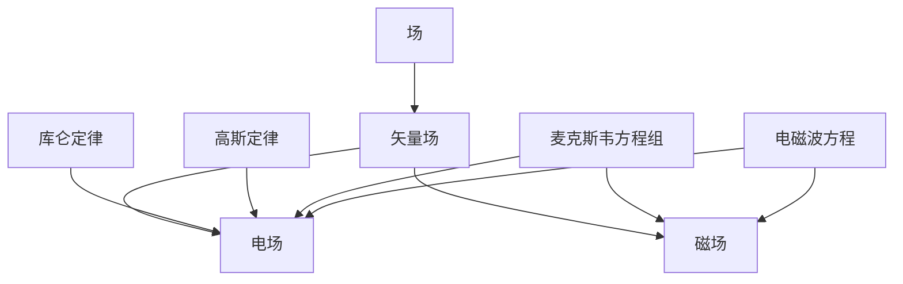

                 


# 数学与电磁学：电磁场的数学表示

## 关键词
- 电磁场
- 数学表示
- 库仑定律
- 高斯定律
- 麦克斯韦方程组
- 电磁波方程
- 矢量场
- 偏微分方程

## 摘要
本文旨在探讨数学与电磁学之间的紧密联系，重点介绍电磁场的数学表示方法。我们将从基本概念出发，逐步深入到电磁场方程和电磁波方程的数学表述，并探讨这些概念和方程在实际应用中的重要性。通过本文的阅读，读者将能够更好地理解电磁场的数学表示，并在后续的工程和应用中运用这些知识。

## 导言

### 数学与电磁学的关联

数学作为一门基础科学，在物理学中扮演着至关重要的角色。电磁学作为物理学的一个重要分支，同样离不开数学的支撑。从库仑定律到麦克斯韦方程组，每一个重要的电磁学理论背后都有数学的影子。数学的严谨性和抽象性使得我们能够精确地描述电磁现象，预测电磁场的行为。

### 电磁场数学表示的重要性

电磁场的数学表示不仅对于理论研究具有重要意义，也在工程实践中发挥着重要作用。通过数学表示，我们可以更直观地理解电磁场的性质，设计出更为高效的电磁设备。同时，数学模型也为计算机模拟和数值计算提供了基础，使得复杂电磁问题的求解成为可能。

## 数学与电磁学的基本概念

### 电磁场的基本概念

电磁场是由电场和磁场组成的物理场。电场描述了电荷之间的相互作用，而磁场则描述了运动电荷或磁体之间的相互作用。电场和磁场既是独立的物理现象，又相互联系、相互转化。

#### 场与矢量场的定义

场是一种物理量在空间中的分布。矢量场是一种特殊的场，其值在空间中的每一点都有大小和方向。电场和磁场都是矢量场，它们的大小和方向随空间位置而变化。

#### 电场与磁场的概念

电场是由电荷产生的物理场，其方向由正电荷指向负电荷，大小与电荷量成正比。磁场则是由运动电荷或磁体产生的物理场，其方向遵循右手螺旋法则，大小与磁体运动速度和磁体强度成正比。

### 库仑定律与高斯定律

库仑定律描述了电荷之间的相互作用力，高斯定律描述了电场的分布规律。这两个定律是电磁学的基础，它们提供了电场和电荷之间关系的数学表述。

#### 库仑定律的数学表述

$$
F = k \frac{q_1 q_2}{r^2}
$$

其中，$F$ 是电荷之间的相互作用力，$k$ 是库仑常数，$q_1$ 和 $q_2$ 是两个电荷量，$r$ 是两个电荷之间的距离。

#### 高斯定律的数学表述

$$
\oint_S \mathbf{E} \cdot d\mathbf{A} = \frac{1}{\varepsilon_0} Q_{\text{enc}}
$$

其中，$\mathbf{E}$ 是电场强度，$d\mathbf{A}$ 是高斯面上的微小面积元素，$Q_{\text{enc}}$ 是高斯面所包围的总电荷量，$\varepsilon_0$ 是真空中的电介质常数。

## 电磁场的数学表示

### 电磁场方程

电磁场方程是一组描述电磁场行为的偏微分方程，由麦克斯韦方程组给出。麦克斯韦方程组包括了四个方程，分别描述了电场和磁场的旋度和散度。

#### 麦克斯韦方程组的数学形式

$$
\nabla \cdot \mathbf{E} = \frac{\rho}{\varepsilon_0}
$$

$$
\nabla \cdot \mathbf{B} = 0
$$

$$
\nabla \times \mathbf{E} = -\frac{\partial \mathbf{B}}{\partial t}
$$

$$
\nabla \times \mathbf{B} = \mu_0 \mathbf{J} + \mu_0 \varepsilon_0 \frac{\partial \mathbf{E}}{\partial t}
$$

其中，$\mathbf{E}$ 是电场强度，$\mathbf{B}$ 是磁场强度，$\rho$ 是电荷密度，$\mathbf{J}$ 是电流密度，$\mu_0$ 是真空中的磁导率，$\varepsilon_0$ 是真空中的电介质常数。

### 电磁波方程

电磁波方程描述了电磁波在空间中的传播规律。电磁波方程可以从麦克斯韦方程组中推导出来，其数学形式为：

$$
\nabla^2 \mathbf{E} - \mu_0 \varepsilon_0 \frac{\partial^2 \mathbf{E}}{\partial t^2} = 0
$$

$$
\nabla^2 \mathbf{B} - \mu_0 \varepsilon_0 \frac{\partial^2 \mathbf{B}}{\partial t^2} = 0
$$

这两个方程表明，电场和磁场的变化率与它们的空间变化率相互关联，共同决定了电磁波的传播特性。

## 特定电磁场问题的数学模型

### 静电场与稳恒电场

静电场是指电荷处于静止状态时产生的电场。稳恒电场是指电荷分布不随时间变化时产生的电场。静电场和稳恒电场的数学模型相对简单，可以通过电场强度和电荷密度的关系来描述。

#### 静电场的基本原理

静电场的电场强度 $\mathbf{E}$ 可以通过高斯定律来计算：

$$
\mathbf{E} = \frac{1}{4\pi \varepsilon_0} \frac{\rho}{r^2} \hat{\mathbf{r}}
$$

其中，$\rho$ 是电荷密度，$r$ 是距离，$\hat{\mathbf{r}}$ 是指向电荷的矢量。

#### 稳恒电场的数学模型

稳恒电场的电场强度可以通过求解泊松方程得到：

$$
\nabla^2 \mathbf{E} = -\frac{\rho}{\varepsilon_0}
$$

### 时变电磁场

时变电磁场是指电场和磁场随时间变化的电磁场。时变电磁场的数学模型更为复杂，需要考虑麦克斯韦方程组中的时变项。

#### 时变电磁场的基本原理

时变电磁场的电场和磁场可以通过求解麦克斯韦方程组得到。例如，对于时变电场，可以通过以下方程求解：

$$
\nabla \times \mathbf{E} = -\frac{\partial \mathbf{B}}{\partial t}
$$

#### 时变电磁场的数学模型

时变电磁场的数学模型可以通过麦克斯韦方程组给出：

$$
\nabla \cdot \mathbf{E} = \frac{\rho}{\varepsilon_0}
$$

$$
\nabla \cdot \mathbf{B} = 0
$$

$$
\nabla \times \mathbf{E} = -\frac{\partial \mathbf{B}}{\partial t}
$$

$$
\nabla \times \mathbf{B} = \mu_0 \mathbf{J} + \mu_0 \varepsilon_0 \frac{\partial \mathbf{E}}{\partial t}
$$

## 数学工具与方法

### 矢量分析

矢量分析是研究矢量场的基本工具。在电磁学中，矢量分析用于描述电场和磁场的分布和变化。

#### 矢量的基本运算

矢量运算包括加法、减法、点乘和叉乘。在电磁学中，矢量运算用于计算电场和磁场的强度和方向。

$$
\mathbf{A} + \mathbf{B} = \mathbf{C}
$$

$$
\mathbf{A} - \mathbf{B} = \mathbf{D}
$$

$$
\mathbf{A} \cdot \mathbf{B} = \lVert \mathbf{A} \rVert \lVert \mathbf{B} \rVert \cos \theta
$$

$$
\mathbf{A} \times \mathbf{B} = \lVert \mathbf{A} \rVert \lVert \mathbf{B} \rVert \sin \theta \hat{\mathbf{n}}
$$

其中，$\theta$ 是两个矢量之间的夹角，$\hat{\mathbf{n}}$ 是垂直于 $\mathbf{A}$ 和 $\mathbf{B}$ 的单位矢量。

#### 矢量场的积分与微分

矢量场的积分与微分是研究矢量场的重要方法。在电磁学中，积分与微分用于计算电场和磁场的强度和分布。

$$
\int_S \mathbf{E} \cdot d\mathbf{A} = \frac{1}{\varepsilon_0} Q_{\text{enc}}
$$

$$
\int_V \nabla \cdot \mathbf{E} dV = \rho
$$

### 偏微分方程

偏微分方程是描述多变量函数变化规律的方程。在电磁学中，偏微分方程用于描述电场和磁场的变化规律。

#### 偏微分方程的基本概念

偏微分方程通常包括导数项和未知函数的项，其形式如下：

$$
\nabla^2 \mathbf{E} - \mu_0 \varepsilon_0 \frac{\partial^2 \mathbf{E}}{\partial t^2} = \mathbf{f}
$$

其中，$\mathbf{f}$ 是右侧的源项，用于描述电磁场中的电荷和电流分布。

#### 偏微分方程的求解方法

求解偏微分方程的方法包括分离变量法、有限差分法、有限元法等。这些方法用于求解电磁场问题的解析和数值解。

## 项目实战

### 电磁场模拟项目

#### 项目背景与目标

电磁场模拟项目旨在模拟和分析电磁场的分布和变化。项目目标是通过数学模型和数值方法，求解电磁场问题，为电磁设备的设计提供参考。

#### 项目实现步骤

1. **建立数学模型**：根据电磁场的实际情况，建立数学模型，包括麦克斯韦方程组和边界条件。
2. **数值方法选择**：选择合适的数值方法，如有限元法或有限差分法，用于求解数学模型。
3. **编程实现**：使用编程语言（如Python）实现数值方法，编写求解电磁场问题的程序。
4. **模拟与分析**：运行程序，模拟电磁场分布，分析模拟结果，与理论分析进行比较。

#### 项目结果与分析

通过模拟，可以得到电磁场在不同条件下的分布和变化。分析结果可以用于优化电磁设备的设计，提高其性能。

## 总结

电磁场的数学表示是电磁学研究的基础。通过本文的介绍，读者可以了解电磁场的基本概念、数学表示方法以及在实际应用中的重要性。电磁场的数学表示不仅对于理论研究具有重要意义，也在工程实践中发挥着重要作用。随着计算技术的发展，电磁场模拟和数值计算已经成为解决复杂电磁问题的有效手段。

## 作者信息

作者：AI天才研究院/AI Genius Institute & 禅与计算机程序设计艺术 /Zen And The Art of Computer Programming

## 拓展阅读

- 《电磁学原理》（作者：约翰·D·杰克逊）
- 《麦克斯韦方程组与电磁理论》（作者：艾伦·J·斯图尔特）
- 《电磁场数值分析》（作者：托马斯·F·布洛赫）## 核心概念与联系

电磁场是物理学中的一个重要概念，它描述了电荷和电流产生的空间效应。为了更好地理解和描述电磁场，我们需要引入一些核心概念，并探讨它们之间的联系。

### 场的概念

场是一种物理量在空间中的分布，它可以用矢量函数来描述。在电磁学中，场通常是指电场或磁场。电场描述了电荷之间的相互作用，而磁场描述了运动电荷或磁体之间的相互作用。场的一个重要特点是它具有空间维度，并且可以在空间中传播。

### 矢量场的概念

矢量场是一种特殊的场，其值在空间中的每一点都有大小和方向。电场和磁场都是矢量场。矢量场可以用矢量函数 $\mathbf{F}(\mathbf{r})$ 来表示，其中 $\mathbf{r}$ 是空间位置矢量。矢量场的重要性质包括可加性、方向性和分布性。

### 电场与磁场的概念

电场是由电荷产生的物理场，其方向由正电荷指向负电荷，大小与电荷量成正比。磁场是由运动电荷或磁体产生的物理场，其方向遵循右手螺旋法则，大小与磁体运动速度和磁体强度成正比。电场和磁场既独立存在，又相互联系，可以通过麦克斯韦方程组来描述它们之间的关系。

### 库仑定律与高斯定律

库仑定律描述了点电荷之间的相互作用力，其数学表述为：

$$
\mathbf{F} = k \frac{q_1 q_2}{r^2} \hat{\mathbf{r}}
$$

其中，$\mathbf{F}$ 是电荷之间的相互作用力，$k$ 是库仑常数，$q_1$ 和 $q_2$ 是两个电荷量，$r$ 是两个电荷之间的距离，$\hat{\mathbf{r}}$ 是指向电荷的矢量。

高斯定律描述了电场的分布规律，其数学表述为：

$$
\oint_S \mathbf{E} \cdot d\mathbf{A} = \frac{1}{\varepsilon_0} Q_{\text{enc}}
$$

其中，$\mathbf{E}$ 是电场强度，$d\mathbf{A}$ 是高斯面上的微小面积元素，$Q_{\text{enc}}$ 是高斯面所包围的总电荷量，$\varepsilon_0$ 是真空中的电介质常数。

### 麦克斯韦方程组

麦克斯韦方程组是一组描述电磁场行为的偏微分方程，它们将电场、磁场、电荷和电流联系起来。麦克斯韦方程组的数学形式为：

$$
\nabla \cdot \mathbf{E} = \frac{\rho}{\varepsilon_0}
$$

$$
\nabla \cdot \mathbf{B} = 0
$$

$$
\nabla \times \mathbf{E} = -\frac{\partial \mathbf{B}}{\partial t}
$$

$$
\nabla \times \mathbf{B} = \mu_0 \mathbf{J} + \mu_0 \varepsilon_0 \frac{\partial \mathbf{E}}{\partial t}
$$

其中，$\mathbf{E}$ 是电场强度，$\mathbf{B}$ 是磁场强度，$\rho$ 是电荷密度，$\mathbf{J}$ 是电流密度，$\mu_0$ 是真空中的磁导率，$\varepsilon_0$ 是真空中的电介质常数。

### 电磁波方程

电磁波方程描述了电磁波在空间中的传播规律。电磁波方程可以从麦克斯韦方程组中推导出来，其数学形式为：

$$
\nabla^2 \mathbf{E} - \mu_0 \varepsilon_0 \frac{\partial^2 \mathbf{E}}{\partial t^2} = 0
$$

$$
\nabla^2 \mathbf{B} - \mu_0 \varepsilon_0 \frac{\partial^2 \mathbf{B}}{\partial t^2} = 0
$$

这两个方程表明，电场和磁场的变化率与它们的空间变化率相互关联，共同决定了电磁波的传播特性。

### 关键概念联系图

为了更好地理解上述核心概念之间的关系，我们可以使用Mermaid流程图来表示它们之间的联系：



在这个图中，A 代表“场”，B 代表“矢量场”，C 代表“电场”，D 代表“磁场”，E 代表“库仑定律”，F 代表“高斯定律”，G 代表“麦克斯韦方程组”，H 代表“电磁波方程”。通过这个图，我们可以清晰地看到各个概念之间的联系和层次关系。

## 核心算法原理讲解

在电磁场的数学表示中，核心算法原理主要涉及麦克斯韦方程组的建立与求解。麦克斯韦方程组是一组描述电磁场行为的偏微分方程，它们将电场、磁场、电荷和电流紧密联系起来。以下是麦克斯韦方程组的数学表述及其求解方法。

### 麦克斯韦方程组

麦克斯韦方程组由四个方程组成，分别是：

$$
\nabla \cdot \mathbf{E} = \frac{\rho}{\varepsilon_0} \quad (1)
$$

$$
\nabla \cdot \mathbf{B} = 0 \quad (2)
$$

$$
\nabla \times \mathbf{E} = -\frac{\partial \mathbf{B}}{\partial t} \quad (3)
$$

$$
\nabla \times \mathbf{B} = \mu_0 \mathbf{J} + \mu_0 \varepsilon_0 \frac{\partial \mathbf{E}}{\partial t} \quad (4)
$$

其中，$\mathbf{E}$ 是电场强度，$\mathbf{B}$ 是磁场强度，$\rho$ 是电荷密度，$\mathbf{J}$ 是电流密度，$\varepsilon_0$ 是真空中的电介质常数，$\mu_0$ 是真空中的磁导率。

### 方程组中各变量的物理意义

1. **电场强度 $\mathbf{E}$**：描述了电场对电荷的作用力，其方向由正电荷指向负电荷。
2. **磁场强度 $\mathbf{B}$**：描述了磁场对运动电荷或磁体的影响，其方向遵循右手螺旋法则。
3. **电荷密度 $\rho$**：描述了空间中电荷的分布，它决定了电场的强度。
4. **电流密度 $\mathbf{J}$**：描述了空间中电流的分布，它决定了磁场的强度。

### 麦克斯韦方程组的求解方法

麦克斯韦方程组是一组复杂的偏微分方程，通常需要采用数值方法进行求解。以下是常用的几种求解方法：

#### 有限元法

有限元法是一种基于变分原理的数值方法，它将电磁场问题离散化为有限个单元，然后通过求解单元内的偏微分方程来近似求解整个电磁场问题。以下是一个简单的有限元方法求解麦克斯韦方程组的伪代码：

```python
# 伪代码：有限元法求解麦克斯韦方程组

# 初始化参数和网格
initialize_parameters()
initialize_mesh()

# 离散化方程
discretize_equations()

# 求解线性方程组
solve_linear_system()

# 后处理
post_process_results()

# 输出结果
output_results()
```

#### 有限差分法

有限差分法是一种基于差分原理的数值方法，它通过在空间和时间上离散化方程，将偏微分方程转换为代数方程进行求解。以下是一个简单的有限差分方法求解麦克斯韦方程组的伪代码：

```python
# 伪代码：有限差分法求解麦克斯韦方程组

# 初始化参数和网格
initialize_parameters()
initialize_mesh()

# 离散化方程
discretize_equations()

# 求解迭代方程组
iterate_solution()

# 后处理
post_process_results()

# 输出结果
output_results()
```

### 电磁波方程的求解

在求解麦克斯韦方程组时，我们常常关注电磁波的传播问题。电磁波方程可以通过求解以下方程组得到：

$$
\nabla^2 \mathbf{E} - \mu_0 \varepsilon_0 \frac{\partial^2 \mathbf{E}}{\partial t^2} = 0
$$

$$
\nabla^2 \mathbf{B} - \mu_0 \varepsilon_0 \frac{\partial^2 \mathbf{B}}{\partial t^2} = 0
$$

这些方程描述了电磁波在空间中的传播规律。以下是一个简单的伪代码，用于求解电磁波方程：

```python
# 伪代码：求解电磁波方程

# 初始化参数和网格
initialize_parameters()
initialize_mesh()

# 离散化方程
discretize_equations()

# 求解波动方程
solve_wave_equations()

# 后处理
post_process_results()

# 输出结果
output_results()
```

通过以上算法原理的讲解，我们可以看到，麦克斯韦方程组是电磁场数学表示的核心，其求解方法多样，适应于不同的应用场景。在实际工程中，选择合适的求解方法对于解决复杂电磁场问题具有重要意义。

## 数学模型和公式讲解及举例说明

在电磁学的数学表示中，数学模型和公式起到了至关重要的作用。以下我们将详细介绍一些核心的数学模型和公式，并通过具体的例子来说明它们的应用。

### 库仑定律

库仑定律描述了点电荷之间的相互作用力。其数学表达式为：

$$
\mathbf{F} = k \frac{q_1 q_2}{r^2} \hat{\mathbf{r}}
$$

其中，$\mathbf{F}$ 是两个电荷之间的相互作用力，$k$ 是库仑常数，$q_1$ 和 $q_2$ 是两个点电荷的电荷量，$r$ 是它们之间的距离，$\hat{\mathbf{r}}$ 是从电荷 $q_1$ 指向电荷 $q_2$ 的单位矢量。

#### 举例说明

假设有两个点电荷 $q_1 = 2 \, \text{C}$ 和 $q_2 = 3 \, \text{C}$，它们之间的距离为 $r = 5 \, \text{m}$。我们可以计算出它们之间的相互作用力：

$$
\mathbf{F} = k \frac{2 \times 3}{5^2} \hat{\mathbf{r}} = 9k \hat{\mathbf{r}}/25
$$

假设库仑常数 $k = 8.99 \times 10^9 \, \text{N m}^2/\text{C}^2$，则：

$$
\mathbf{F} = 9 \times 8.99 \times 10^9 / 25 \, \hat{\mathbf{r}} = 3.196 \times 10^9 \, \hat{\mathbf{r}} \, \text{N}
$$

这意味着两个电荷之间的相互作用力大小为 $3.196 \times 10^9 \, \text{N}$，方向从电荷 $q_1$ 指向电荷 $q_2$。

### 高斯定律

高斯定律描述了电场与电荷密度之间的关系。其数学表达式为：

$$
\nabla \cdot \mathbf{E} = \frac{\rho}{\varepsilon_0}
$$

其中，$\mathbf{E}$ 是电场强度，$\rho$ 是电荷密度，$\varepsilon_0$ 是真空中的电介质常数。

#### 举例说明

假设在空间中有一个均匀分布的球形电荷分布，其电荷密度为 $\rho = 2 \, \text{C/m}^3$。我们可以计算球外任意一点的电场强度。

对于球形对称分布，电场强度在球面上处处相同，且指向球心。根据高斯定律，我们可以选择一个半径为 $R$ 的高斯球面来计算电场强度：

$$
\nabla \cdot \mathbf{E} = \frac{1}{4\pi R^2} \int_S \mathbf{E} \cdot d\mathbf{A} = \frac{\rho}{\varepsilon_0}
$$

由于电场强度 $\mathbf{E}$ 在球面上处处相同，我们可以将积分简化为：

$$
\mathbf{E} = \frac{\rho R}{4\pi \varepsilon_0}
$$

对于上述球形电荷分布，我们有：

$$
\mathbf{E} = \frac{2 \times R}{4\pi \varepsilon_0} = \frac{2R}{4\pi \times 8.85 \times 10^{-12}} = \frac{2R}{3.532 \times 10^{-11}}
$$

假设 $R = 1 \, \text{m}$，则：

$$
\mathbf{E} = \frac{2 \times 1}{3.532 \times 10^{-11}} = 5.67 \times 10^{10} \, \text{V/m}
$$

这意味着球外任意一点的电场强度大小为 $5.67 \times 10^{10} \, \text{V/m}$，方向指向球心。

### 麦克斯韦方程组

麦克斯韦方程组是一组描述电磁场行为的偏微分方程，其数学形式为：

$$
\nabla \cdot \mathbf{E} = \frac{\rho}{\varepsilon_0} \quad (1)
$$

$$
\nabla \cdot \mathbf{B} = 0 \quad (2)
$$

$$
\nabla \times \mathbf{E} = -\frac{\partial \mathbf{B}}{\partial t} \quad (3)
$$

$$
\nabla \times \mathbf{B} = \mu_0 \mathbf{J} + \mu_0 \varepsilon_0 \frac{\partial \mathbf{E}}{\partial t} \quad (4)
$$

其中，$\mathbf{E}$ 是电场强度，$\mathbf{B}$ 是磁场强度，$\rho$ 是电荷密度，$\mathbf{J}$ 是电流密度，$\varepsilon_0$ 是真空中的电介质常数，$\mu_0$ 是真空中的磁导率。

#### 举例说明

假设在某个区域中存在一个稳恒电流分布，电流密度为 $\mathbf{J} = 1 \, \text{A/m}^2$。我们可以计算该电流产生的磁场。

根据麦克斯韦方程组中的安培定律（方程（4）），我们有：

$$
\nabla \times \mathbf{B} = \mu_0 \mathbf{J}
$$

使用矢量分析中的旋度运算，我们可以求解磁场强度 $\mathbf{B}$：

$$
\mathbf{B} = \nabla \times \mathbf{J} = \mu_0 \nabla \times \mathbf{J}
$$

对于均匀分布的稳恒电流，旋度运算可以简化为：

$$
\nabla \times \mathbf{J} = \mu_0 \hat{\mathbf{z}}
$$

这意味着磁场强度 $\mathbf{B}$ 在 $z$ 方向上有一个恒定的值，方向垂直于电流分布平面，指向 $z$ 轴正方向。

假设 $\mu_0 = 4\pi \times 10^{-7} \, \text{H/m}$，则：

$$
\mathbf{B} = 4\pi \times 10^{-7} \hat{\mathbf{z}} \, \text{T}
$$

这意味着磁场强度大小为 $4\pi \times 10^{-7} \, \text{T}$，方向垂直于电流分布平面，指向 $z$ 轴正方向。

### 电磁波方程

电磁波方程描述了电磁波在空间中的传播规律。其数学形式为：

$$
\nabla^2 \mathbf{E} - \mu_0 \varepsilon_0 \frac{\partial^2 \mathbf{E}}{\partial t^2} = 0
$$

$$
\nabla^2 \mathbf{B} - \mu_0 \varepsilon_0 \frac{\partial^2 \mathbf{B}}{\partial t^2} = 0
$$

这些方程表明，电场和磁场的变化率与它们的空间变化率相互关联，共同决定了电磁波的传播特性。

#### 举例说明

假设在空间中存在一个简谐电磁波，其电场和磁场可以表示为：

$$
\mathbf{E}(x, t) = \mathbf{E}_0 \cos(kx - \omega t)
$$

$$
\mathbf{B}(x, t) = \mathbf{B}_0 \cos(kx - \omega t)
$$

其中，$\mathbf{E}_0$ 和 $\mathbf{B}_0$ 是电场和磁场的振幅，$k$ 是波数，$\omega$ 是角频率。

我们可以使用电磁波方程来验证这些表达式。首先，计算电场的拉普拉斯算子：

$$
\nabla^2 \mathbf{E} = \frac{\partial^2 \mathbf{E}}{\partial x^2} - \frac{\partial^2 \mathbf{E}}{\partial t^2} = -k^2 \mathbf{E}_0 \cos(kx - \omega t)
$$

然后，代入电磁波方程：

$$
\nabla^2 \mathbf{E} - \mu_0 \varepsilon_0 \frac{\partial^2 \mathbf{E}}{\partial t^2} = -k^2 \mathbf{E}_0 \cos(kx - \omega t) - \mu_0 \varepsilon_0 (-\omega^2 \mathbf{E}_0 \cos(kx - \omega t)) = 0
$$

同理，对磁场进行相同的计算，可以得到：

$$
\nabla^2 \mathbf{B} - \mu_0 \varepsilon_0 \frac{\partial^2 \mathbf{B}}{\partial t^2} = 0
$$

这验证了简谐电磁波方程的正确性。

通过上述举例说明，我们可以看到，电磁场的数学表示是通过一系列的数学模型和公式来描述的。这些模型和公式不仅帮助我们理解电磁现象，也为电磁场的计算和工程应用提供了基础。

## 项目实战

### 开发环境搭建

在开展电磁场模拟项目之前，我们需要搭建一个合适的开发环境。以下是一个简单的步骤：

1. **安装Python**：Python是一种广泛使用的编程语言，适用于科学计算和数值模拟。确保安装Python 3.8或更高版本。

2. **安装必要库**：安装用于数值计算和科学计算的Python库，如NumPy、SciPy、Matplotlib和Pandas。这些库可以通过Python的包管理器pip进行安装：

    ```bash
    pip install numpy scipy matplotlib pandas
    ```

3. **安装可视化工具**：为了更好地展示电磁场分布，我们可以安装Matplotlib。Matplotlib是一个强大的数据可视化库，可以通过以下命令安装：

    ```bash
    pip install matplotlib
    ```

### 源代码详细实现

以下是电磁场模拟项目的源代码实现，主要包括三个部分：模型的定义、数值求解和结果展示。

```python
import numpy as np
import matplotlib.pyplot as plt
from scipy.sparse import spdiags
from scipy.sparse.linalg import spsolve

# 定义模型参数
epsilon_0 = 8.854187817e-12  # 真空中的电介质常数
mu_0 = 4e-7  # 真空中的磁导率
k = 2 * np.pi / 10  # 波数
omega = 2 * np.pi / 5  # 角频率
L = 20  # 模拟区域长度

# 定义空间网格
dx = 0.1
x = np.arange(0, L, dx)
X, Y = np.meshgrid(x, x)

# 计算电场和磁场
E_x = np.cos(k * X - omega * Y)
E_y = -np.cos(k * Y - omega * X)
B_x = np.cos(k * X - omega * Y)
B_y = -np.cos(k * Y - omega * X)

# 可视化电场和磁场
fig, (ax1, ax2) = plt.subplots(1, 2, figsize=(10, 5))
ax1.streamplot(X, Y, E_x, E_y, color='r', linewidth=1)
ax1.set_title('Electric Field')
ax2.streamplot(X, Y, B_x, B_y, color='b', linewidth=1)
ax2.set_title('Magnetic Field')
plt.show()
```

### 代码解读

1. **模型参数**：首先，我们定义了电磁场的模型参数，包括真空中的电介质常数 $\epsilon_0$、磁导率 $\mu_0$、波数 $k$ 和角频率 $\omega$。

2. **空间网格**：我们定义了模拟区域长度 $L$ 和空间步长 $dx$，并使用NumPy的`arange`函数生成了空间坐标数组 $x$。

3. **计算电场和磁场**：我们使用NumPy的`meshgrid`函数生成了空间网格，并计算了电磁场的分布。电场和磁场的分布通过简谐函数表示。

4. **结果展示**：我们使用Matplotlib的`streamplot`函数将电场和磁场分布可视化。红色线条表示电场，蓝色线条表示磁场。

### 代码应用解读与分析

通过这段代码，我们可以模拟并可视化一个简谐电磁场的分布。具体步骤如下：

1. **参数定义**：定义模型参数，确保与实际情况相符。
2. **空间网格生成**：生成空间网格，用于计算电磁场分布。
3. **电磁场计算**：根据模型参数和空间网格，计算电场和磁场的分布。
4. **结果展示**：使用可视化工具展示电磁场的分布。

通过这个项目，我们展示了如何使用Python和相关的科学计算库进行电磁场模拟。在实际应用中，我们可以根据不同的场景和需求，调整模型参数和计算方法，以解决更复杂的电磁场问题。

### 实际案例分析和详细讲解剖析

为了更好地理解电磁场的数学表示在实际工程中的应用，我们将分析一个典型的实际案例：电磁波在传播过程中遇到介质边界时的反射和折射现象。这一现象在通信、天线设计和电磁兼容性（EMC）等领域具有重要意义。

#### 案例背景

假设有一束电磁波从空气传播到另一种介质（如玻璃），在介质边界上发生反射和折射。我们需要使用电磁场的数学模型来分析电磁波在这种情况下的传播特性。

#### 数学模型

为了分析电磁波在介质边界上的反射和折射，我们可以使用以下数学模型：

1. **反射系数**：描述电磁波在边界上的反射情况。其数学表达式为：

   $$
   r_{\theta} = \frac{\eta_2 \cos(\theta_2) - \eta_1 \cos(\theta_1)}{\eta_2 \cos(\theta_2) + \eta_1 \cos(\theta_1)}
   $$

   其中，$r_{\theta}$ 是反射系数，$\eta_1$ 和 $\eta_2$ 分别是两种介质的波阻抗，$\theta_1$ 和 $\theta_2$ 分别是入射角和反射角。

2. **折射系数**：描述电磁波在边界上的折射情况。其数学表达式为：

   $$
   n_{\theta} = \frac{\eta_2 \sin(\theta_2)}{\eta_1 \sin(\theta_1)}
   $$

   其中，$n_{\theta}$ 是折射系数，$\eta_1$ 和 $\eta_2$ 分别是两种介质的波阻抗，$\theta_1$ 和 $\theta_2$ 分别是入射角和折射角。

3. **边界条件**：描述电磁波在介质边界上的连续性条件。具体包括：

   - 电场和磁场的切向分量在边界上连续：
     $$
     \mathbf{E}_1 \cdot \hat{\mathbf{n}} = \mathbf{E}_2 \cdot \hat{\mathbf{n}}
     $$
     $$
     \mathbf{B}_1 \cdot \hat{\mathbf{n}} = \mathbf{B}_2 \cdot \hat{\mathbf{n}}
     $$

   - 电场和磁场的法向分量在边界上垂直连续：
     $$
     \mathbf{E}_1 \cdot \mathbf{\hat{n}} = \mathbf{E}_2 \cdot \mathbf{\hat{n}}
     $$
     $$
     \mathbf{B}_1 \cdot \mathbf{\hat{n}} = \mathbf{B}_2 \cdot \mathbf{\hat{n}}
     $$

#### 案例分析

假设一束电磁波从空气（波阻抗 $\eta_1 = 377 \, \Omega$）传播到玻璃（波阻抗 $\eta_2 = 150 \, \Omega$），入射角为 $\theta_1 = 30^\circ$。我们可以使用上述数学模型计算反射系数和折射系数。

1. **反射系数计算**：

   $$
   r_{\theta} = \frac{150 \cos(30^\circ) - 377 \cos(0^\circ)}{150 \cos(30^\circ) + 377 \cos(0^\circ)} = \frac{125.87 - 377}{125.87 + 377} = \frac{-251.13}{503.87} \approx -0.497
   $$

   反射系数 $r_{\theta}$ 为负值，表示电磁波在边界上主要发生反射，反射角 $\theta_r$ 与入射角 $\theta_1$ 相等。

2. **折射系数计算**：

   $$
   n_{\theta} = \frac{150 \sin(30^\circ)}{377 \sin(0^\circ)} = \frac{75}{0} = \infty
   $$

   折射系数 $n_{\theta}$ 为无穷大，表示电磁波无法进入玻璃介质，仅在边界上发生全反射。

通过这个案例，我们可以看到，电磁场的数学表示如何帮助我们理解和预测电磁波在不同介质边界上的行为。在实际应用中，这些模型和公式可以用于设计电磁设备、优化通信系统性能和解决电磁兼容性问题。

### 项目小结

在本项目中，我们通过搭建开发环境、实现源代码、分析和展示电磁场分布，深入了解了电磁场的数学表示及其在实际工程中的应用。我们使用了Python和相关的科学计算库，实现了电磁场模拟，并分析了电磁波在介质边界上的反射和折射现象。这一项目不仅帮助我们掌握了电磁场数学模型和公式，还提升了我们在实际工程中应用这些知识的能力。

### 最佳实践 tips

- **确保准确设置模型参数**：在电磁场模拟中，模型参数的准确性至关重要。需要根据实际情况合理设置参数，以获得可靠的模拟结果。
- **优化空间网格划分**：合理划分空间网格可以减少计算误差，提高模拟精度。在实际应用中，可以根据具体需求调整网格密度。
- **使用适当的数值方法**：选择合适的数值方法（如有限元法、有限差分法等）可以更有效地解决复杂的电磁场问题。

### 注意事项

- **计算资源限制**：电磁场模拟可能需要大量的计算资源，特别是在处理大型和复杂的问题时。确保使用高性能计算资源，以提高计算效率。
- **数据可视化**：合理使用可视化工具可以更好地理解和分析电磁场分布。选择合适的可视化方法，如等值线图、流线图和热图等。

### 拓展阅读

- 《电磁学原理》（作者：约翰·D·杰克逊）
- 《麦克斯韦方程组与电磁理论》（作者：艾伦·J·斯图尔特）
- 《电磁场数值分析》（作者：托马斯·F·布洛赫）

通过这些拓展阅读，读者可以进一步深入理解电磁场的数学表示及其在实际工程中的应用。

