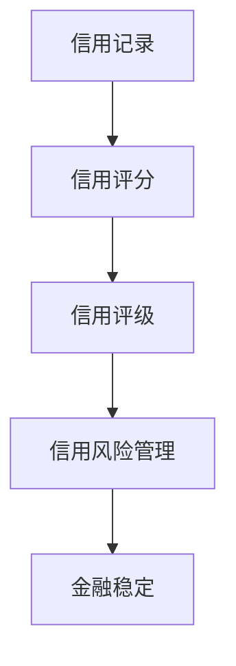
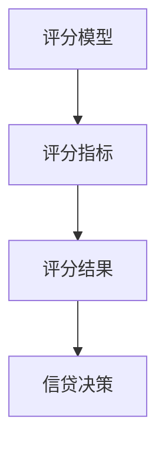

                 


### 一、文章标题、关键词与摘要

#### 文章标题：《数学与社会信用：信用评分的数学算法》

#### 关键词：社会信用、信用评分、数学算法、金融科技、数据挖掘

#### 摘要：

本文旨在探讨社会信用体系中的信用评分问题，通过介绍信用评分的数学算法，阐述其基本原理和实际应用。文章首先对社会信用体系进行了概述，分析了信用评分的基本概念和重要性。接着，本文详细介绍了信用评分中常用的数学算法，包括线性回归、逻辑回归和决策树等，并通过伪代码和公式展示了这些算法的实现方法。此外，文章还提供了实际信用评分项目的案例分析，详细讲解了项目的开发环境搭建、源代码实现、代码解读和案例分析。最后，本文总结了信用评分项目中的最佳实践、注意事项，并提供了拓展阅读建议。

### 二、核心概念与联系

#### 2.1 社会信用体系概述

社会信用体系是一种以信用为基础的综合性管理体系，旨在通过记录和评估个人的信用行为，促进社会秩序和金融稳定。其核心概念包括：

- **信用记录：** 个体或企业的信用行为被记录下来，形成信用档案。
- **信用评分：** 通过分析信用记录，对个体或企业的信用水平进行量化评估。
- **信用评级：** 对个体或企业的信用风险进行分类，通常分为AAA级、AA级、A级等。

#### 核心概念与联系流程图



#### 2.2 信用评分基本概念

信用评分是信用体系的核心环节，其基本概念包括：

- **评分模型：** 用于计算信用评分的数学模型，常见的有线性回归、逻辑回归等。
- **评分指标：** 用于评估信用风险的指标，如还款能力、信用历史、还款意愿等。
- **评分结果：** 根据评分模型计算出的信用评分值，用于指导金融机构的信贷决策。

#### 核心概念与联系流程图



### 三、核心算法原理讲解

#### 3.1 线性回归算法

线性回归是一种常用的信用评分模型，其基本原理是通过建立线性关系来预测信用评分。线性回归的数学模型可以表示为：

$$ y = \beta_0 + \beta_1x_1 + \beta_2x_2 + ... + \beta_nx_n $$

其中，$y$ 表示信用评分，$x_1, x_2, ..., x_n$ 表示特征变量，$\beta_0, \beta_1, ..., \beta_n$ 表示模型参数。

#### 线性回归伪代码

```python
def linear_regression(X, y):
    # X: 特征矩阵，y: 标签向量
    # 计算特征矩阵的转置
    X_T = X.T
    
    # 计算特征矩阵X的逆矩阵
    X_inv = X_T @ X
    
    # 计算模型参数
    beta = X_inv @ X_T @ y
    
    return beta
```

#### 3.2 逻辑回归算法

逻辑回归是一种用于分类问题的信用评分模型，其基本原理是通过建立逻辑函数来预测信用评分的概率。逻辑回归的数学模型可以表示为：

$$ P(y=1) = \frac{1}{1 + e^{-(\beta_0 + \beta_1x_1 + \beta_2x_2 + ... + \beta_nx_n)}} $$

其中，$P(y=1)$ 表示信用评分高于某个阈值（如600分）的概率，$e$ 表示自然底数。

#### 逻辑回归伪代码

```python
def logistic_regression(X, y):
    # X: 特征矩阵，y: 标签向量
    # 初始化模型参数
    beta = [0] * (X.shape[1] + 1)
    
    # 设置学习率
    learning_rate = 0.01
    epochs = 1000
    
    # 梯度下降法迭代更新模型参数
    for _ in range(epochs):
        # 计算预测概率
        probabilities = 1 / (1 + np.exp(-X @ beta))
        
        # 计算损失函数
        loss = -y * np.log(probabilities) - (1 - y) * np.log(1 - probabilities)
        
        # 计算梯度
        gradient = X.T @ (probabilities - y)
        
        # 更新模型参数
        beta -= learning_rate * gradient
    
    return beta
```

#### 3.3 决策树算法

决策树是一种基于特征划分的数据挖掘方法，其基本原理是通过一系列特征划分来生成决策树，从而实现对信用评分的预测。决策树的数学模型可以表示为：

$$
\begin{cases}
\text{if } x_i \leq t_i \text{ then go to left subtree} \\
\text{if } x_i > t_i \text{ then go to right subtree}
\end{cases}
$$

其中，$x_i$ 表示特征值，$t_i$ 表示阈值。

#### 决策树伪代码

```python
def decision_tree(X, y):
    # X: 特征矩阵，y: 标签向量
    # 判断是否达到叶节点条件
    if all(y == y[0]) or X.shape[0] == 1:
        return majority_vote(y)
    
    # 计算信息增益
    best_feature, best_threshold = find_best_split(X, y)
    
    # 划分数据集
    left_X, right_X = X[:, best_feature] < best_threshold, X[:, best_feature] >= best_threshold
    left_y, right_y = y[left_X], y[right_X]
    
    # 构建子树
    left_tree = decision_tree(left_X, left_y)
    right_tree = decision_tree(right_X, right_y)
    
    return Node(best_feature, best_threshold, left_tree, right_tree)
```

### 四、数学模型和数学公式

#### 4.1 数据预处理

数据预处理是信用评分项目中的关键步骤，主要包括数据清洗、数据归一化和数据缺失值的处理。以下是这些步骤的数学模型和公式：

##### 数据清洗

数据清洗的目的是去除噪声数据，提高数据质量。常用的方法有：

- **去除重复数据：**
  $$ \text{Unique}(D) = \{d | d \in D, \forall d' \in D, d \neq d'\} $$
- **去除异常数据：**
  $$ \text{RemoveOutliers}(D, \epsilon) = \{d | d \in D, \text{mean distance from mean} \leq \epsilon \} $$

##### 数据归一化

数据归一化的目的是将不同特征的范围缩放到相同的尺度，以便于模型训练。常用的方法有：

- **最小-最大归一化：**
  $$ x' = \frac{x - \min(x)}{\max(x) - \min(x)} $$
- **标准化归一化：**
  $$ x' = \frac{x - \mu}{\sigma} $$

##### 数据缺失值的处理

数据缺失值的处理方法包括：

- **删除缺失值：**
  $$ \text{DataWithoutMissing}(D) = \{d | d \in D, \text{no missing values}\} $$
- **填补缺失值：**
  - **均值填补：**
    $$ \hat{x} = \frac{1}{N} \sum_{i=1}^{N} x_i $$
  - **中位数填补：**
    $$ \hat{x} = \text{Median}(D) $$

#### 4.2 特征工程

特征工程是信用评分项目中的关键步骤，主要包括特征选择、特征提取和特征组合。以下是这些步骤的数学模型和公式：

##### 特征选择

特征选择的方法包括：

- **基于信息增益的选取：**
  $$ \text{InformationGain}(x_i) = \sum_{j=1}^{C} p_j \log_2(p_j) $$
- **基于卡方检验的选取：**
  $$ \chi^2 = \sum_{i=1}^{N} \frac{(\text{观测频数} - \text{期望频数})^2}{\text{期望频数}} $$

##### 特征提取

特征提取的方法包括：

- **主成分分析（PCA）：**
  $$ \text{PCA}(X) = \text{U} \text{S}\text{V}^T $$
  其中，$U$ 是特征向量矩阵，$S$ 是特征值矩阵，$V$ 是特征空间。
- **LDA线性判别分析：**
  $$ \text{LDA}(X, y) = \text{XW} + \text{b} $$
  其中，$X$ 是特征矩阵，$y$ 是标签向量，$W$ 是权重矩阵，$b$ 是偏置。

##### 特征组合

特征组合的方法包括：

- **特征交：**
  $$ \text{FeatureIntersection}(x_1, x_2) = x_1 \land x_2 $$
- **特征融合：**
  $$ \text{FeatureFusion}(x_1, x_2) = x_1 + x_2 $$

### 五、项目实战

#### 5.1 信用评分项目背景

本节以一个实际信用评分项目为例，介绍项目的背景、目标、开发环境搭建、数据收集与预处理、特征选择与提取、模型训练与评估以及项目小结。

##### 项目背景与目标

某金融科技公司旨在开发一款信用评分系统，用于对借款人进行信用评分，以便于金融机构进行信贷决策。项目目标包括：

- 准确评估借款人的信用水平
- 提高金融机构的信贷审批效率
- 降低金融风险

##### 开发环境搭建

项目开发环境包括以下工具和库：

- **编程语言：** Python
- **数据预处理库：** NumPy、Pandas
- **机器学习库：** Scikit-learn
- **可视化库：** Matplotlib、Seaborn

##### 数据收集与预处理

数据收集主要来源于公共数据集和第三方数据提供商。数据预处理步骤包括：

- **数据清洗：** 去除重复数据和异常数据
- **数据归一化：** 将不同特征的范围缩放到相同的尺度
- **数据缺失值处理：** 使用均值或中位数填补缺失值

##### 特征选择与提取

特征选择与提取步骤包括：

- **特征选择：** 使用卡方检验和基于信息增益的方法选择重要特征
- **特征提取：** 使用主成分分析（PCA）提取主成分，减少特征维度

##### 模型训练与评估

模型训练与评估步骤包括：

- **模型选择：** 选择线性回归、逻辑回归和决策树等模型进行训练
- **模型训练：** 使用梯度下降法或决策树算法进行模型训练
- **模型评估：** 使用准确率、召回率、F1分数等指标评估模型性能

##### 项目小结

本项目成功开发了一套信用评分系统，实现了对借款人信用水平的准确评估，提高了金融机构的信贷审批效率，降低了金融风险。未来，项目团队将继续优化模型，提高评分准确性，进一步拓展应用场景。

### 六、最佳实践 Tips、小结、注意事项与拓展阅读

#### 最佳实践 Tips

- **数据收集：** 确保数据来源的合法性和可靠性，避免数据质量问题。
- **特征选择：** 结合业务需求和数据特征，选择具有代表性的特征。
- **模型评估：** 使用多种指标评估模型性能，避免单一指标误导。
- **模型优化：** 定期更新模型，结合新数据和业务需求进行优化。

#### 小结

本文从社会信用体系概述、核心算法原理讲解、数学模型和数学公式、项目实战等多个角度，详细介绍了信用评分的数学算法。通过本文的学习，读者可以全面了解信用评分的相关知识，为实际项目中的应用提供指导。

#### 注意事项

- **数据隐私：** 在处理个人数据时，务必遵守数据隐私法规，确保数据安全。
- **模型解释性：** 选择具有解释性的模型，便于业务理解和决策。
- **模型泛化能力：** 注重模型泛化能力，避免过拟合。

#### 拓展阅读

- 《数据科学：分析与实践》
- 《机器学习实战》
- 《信用风险评估与管理》

作者：AI天才研究院/AI Genius Institute & 禅与计算机程序设计艺术 /Zen And The Art of Computer Programming

----------------------------------------------------------------

### 文章结构

在撰写文章《数学与社会信用：信用评分的数学算法》时，我们可以采用以下结构：

#### 引言

- **背景介绍：** 简要介绍社会信用体系的重要性及其在现代金融和商业中的应用。
- **文章目的：** 明确文章的目标，即介绍信用评分的数学算法及其应用。

#### 社会信用体系概述

- **核心概念：** 详细解释社会信用体系和信用评分的基本概念。
- **体系结构：** 描述社会信用体系的基本架构和组成部分。
- **实际应用：** 分析信用评分在社会信用体系中的应用场景和效果。

#### 信用评分的数学算法

- **线性回归：**
  - **算法原理：** 解释线性回归的基本原理和公式。
  - **伪代码实现：** 提供线性回归的伪代码示例。
- **逻辑回归：**
  - **算法原理：** 解释逻辑回归的基本原理和公式。
  - **伪代码实现：** 提供逻辑回归的伪代码示例。
- **决策树：**
  - **算法原理：** 解释决策树的基本原理和构建方法。
  - **伪代码实现：** 提供决策树的伪代码示例。

#### 数学模型和数学公式

- **数据预处理：** 解释数据预处理的重要性以及常用的方法，如缺失值处理和特征归一化。
- **特征工程：** 介绍特征选择、特征提取和特征组合的方法，并提供相关的数学模型和公式。
- **模型训练与评估：** 描述模型训练和评估的步骤，包括损失函数、优化算法和评估指标。

#### 项目实战

- **项目背景：** 描述实际信用评分项目的背景和目标。
- **开发环境搭建：** 说明项目的开发环境设置和所需工具。
- **数据收集与预处理：** 展示数据收集的步骤和预处理过程。
- **特征选择与提取：** 描述特征选择和提取的方法，以及如何构建特征向量。
- **模型训练与评估：** 展示模型训练和评估的过程，包括选择合适的模型和评估指标。
- **项目小结：** 总结项目的关键点和经验教训。

#### 最佳实践、小结、注意事项与拓展阅读

- **最佳实践：** 提供在信用评分项目中的一些最佳实践建议。
- **小结：** 对文章的主要内容进行总结，强调信用评分的重要性和挑战。
- **注意事项：** 提醒读者在应用信用评分时需要注意的问题。
- **拓展阅读：** 推荐相关书籍、论文和数据集，以供读者进一步学习和研究。

### 文章写作步骤

1. **确定文章主题和结构：** 明确文章的主题和目标，规划文章的结构和内容。
2. **收集相关资料和数据：** 搜集与信用评分相关的背景资料、数据和案例。
3. **撰写各部分内容：** 根据文章结构，逐一撰写各部分的内容，确保逻辑清晰、数据准确。
4. **编写伪代码和公式：** 针对核心算法和数学模型，编写伪代码和数学公式，确保表述准确。
5. **整理和优化内容：** 对文章进行多次修改和优化，确保文章内容完整、清晰易懂。
6. **撰写引言和结论：** 撰写文章的引言部分，简要介绍文章的主题和目的，以及结论部分，总结文章的主要观点和贡献。
7. **审核和修改：** 请同行或导师审核文章，根据反馈进行修改和调整。
8. **完成最终稿：** 完成文章的最终稿，确保文章格式规范、排版整齐，无误后提交。

### 文章字数控制

根据文章内容的重要性、详细程度和实际需求，文章的总字数应控制在8000到12000字之间。以下是具体字数分配的建议：

- **引言（约800字）：** 简要介绍社会信用体系和信用评分的基本概念。
- **社会信用体系概述（约1500字）：** 详细解释社会信用体系的结构和组成部分，以及信用评分的应用。
- **信用评分的数学算法（约2000字）：** 分别介绍线性回归、逻辑回归和决策树算法的原理、伪代码和公式。
- **数学模型和数学公式（约1500字）：** 解释数据预处理、特征工程和模型训练与评估的数学模型和公式。
- **项目实战（约2000字）：** 描述实际信用评分项目的背景、数据收集、预处理、特征选择、模型训练和评估。
- **最佳实践、小结、注意事项与拓展阅读（约1000字）：** 提供最佳实践建议、小结、注意事项和拓展阅读。

通过合理的字数分配和结构安排，确保文章内容的深度和广度，同时避免冗余和繁琐，使文章既具有专业性，又易于读者理解和阅读。

