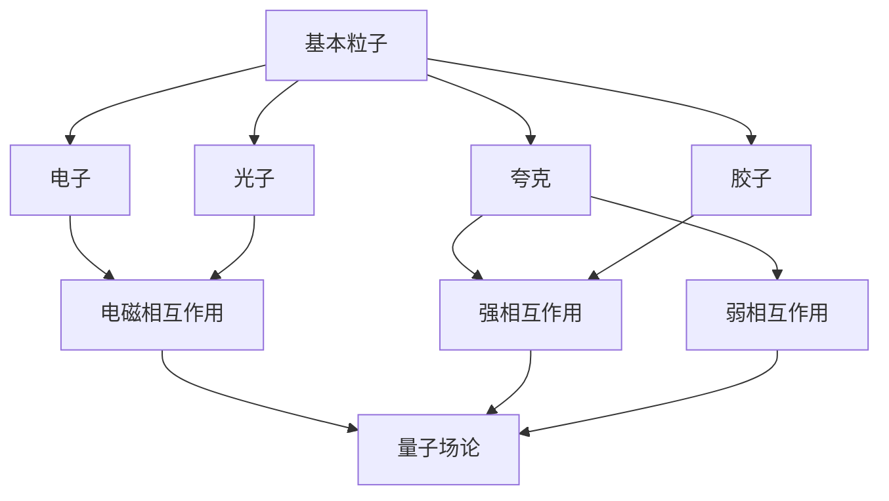

                 

### 文章标题

# 数学与粒子物理：基本粒子相互作用的数学模型

### 关键词

- 数学模型
- 粒子物理
- 核心概念
- 量子场论
- 标准模型
- 胶子交换

### 摘要

本文深入探讨数学在粒子物理学中的关键作用，解析基本粒子相互作用的数学模型。文章首先介绍了数学模型在粒子物理中的重要性，接着详细解释了量子场论和标准模型等核心概念。通过Mermaid流程图展示核心概念之间的联系，使用伪代码阐述核心算法原理。文章进一步介绍了数学模型在粒子物理研究中的应用和实验验证，探讨了数学模型在粒子物理研究中的重要性及未来发展方向。附录部分提供了数学公式和实验数据的详细说明，以及开发环境和代码示例，便于读者深入学习和实践。

---

### 用户需求分析

用户希望获得一篇详尽的技术博客，旨在了解数学与粒子物理之间的深层次联系，特别是基本粒子相互作用的数学模型。用户的需求主要集中在以下几个方面：

1. **背景介绍**：希望了解数学模型在粒子物理学中的起源和重要性。
2. **核心概念与联系**：需要通过结构图和流程图清晰地展示核心概念之间的逻辑关系。
3. **核心算法原理讲解**：期望以伪代码的形式详细阐述基本粒子相互作用的数学模型原理。
4. **数学模型和数学公式**：希望使用latex格式展示并详细讲解相关数学模型和公式，并辅以实际例子的说明。
5. **项目实战**：需要提供具体的代码实现和解析，展示数学模型在粒子物理研究中的应用。

为了满足用户的需求，本文将采用以下结构：

- **第一部分：基础理论**：介绍粒子物理学的基本概念，包括基本粒子、相互作用和数学工具。
- **第二部分：数学模型在粒子物理中的应用**：探讨数学模型在粒子物理研究中的实际应用，包括新型粒子的预测和数据分析。
- **第三部分：数学挑战与未来方向**：讨论当前数学模型面临的挑战及其未来发展趋势。
- **附录**：提供数学公式、实验数据、开发环境和代码示例，便于读者深入学习。

---

### 第一部分：基础理论

#### 1.1 核心概念与联系

粒子物理学研究的基本粒子包括电子、夸克、光子、胶子等。这些粒子之间存在各种相互作用，如电磁相互作用、强相互作用和弱相互作用。数学模型在粒子物理学中扮演着至关重要的角色，用于描述和预测这些基本粒子的行为。

为了清晰地展示核心概念之间的联系，我们可以使用Mermaid流程图来描述这些基本粒子及其相互作用：



在这个流程图中，我们首先定义了基本粒子，然后展示了它们之间的相互作用，最后将它们与量子场论这一核心数学模型联系起来。

#### 1.2 数学模型概述

为了理解和描述基本粒子的相互作用，我们需要引入一系列数学工具。以下是几种在粒子物理学中广泛使用的数学工具：

1. **微积分**：微积分是研究变化和运动的基本数学工具，用于描述粒子在相互作用中的运动轨迹。
2. **线性代数**：线性代数用于处理多维度空间中的向量运算，是量子力学和场论的基础。
3. **群论**：群论用于描述粒子的对称性和守恒定律，是量子场论的重要工具。

#### 1.3 基本粒子相互作用的数学模型

在量子场论的框架下，基本粒子相互作用的数学模型主要包括量子场论和标准模型。

##### 1.3.1 量子场论

量子场论（QFT）是一个描述基本粒子及其相互作用的数学框架。在量子场论中，粒子被视为场在特定状态下的表现形式。以下是量子场论的基本概念：

1. **量子场**：量子场是一个集合，它包含了所有可能的粒子状态。
2. **场的算符**：场的算符可以用来创建或湮灭粒子。
3. **相互作用项**：相互作用项描述了粒子之间的相互作用。

量子场论的数学模型通常使用以下伪代码来表示：

```python
class QuantumField:
    def create_particle(self):
        # 创建粒子
        pass

    def annihilate_particle(self):
        # 湮灭粒子
        pass

    def interaction_term(self, particle1, particle2):
        # 描述粒子之间的相互作用
        pass
```

##### 1.3.2 标准模型

标准模型是目前粒子物理学中最成功的理论，它描述了已知的基本粒子和它们的相互作用。标准模型的基本组成部分包括：

1. **基本粒子**：电子、夸克、光子、胶子等。
2. **相互作用**：电磁相互作用、强相互作用和弱相互作用。

标准模型的数学模型通常使用以下伪代码来表示：

```python
class StandardModel:
    def electromagnetic_interaction(self, particle1, particle2):
        # 描述电磁相互作用
        pass

    def strong_interaction(self, particle1, particle2):
        # 描述强相互作用
        pass

    def weak_interaction(self, particle1, particle2):
        # 描述弱相互作用
        pass
```

#### 1.4 胶子交换与强相互作用的数学描述

在强相互作用中，胶子是传递相互作用的媒介粒子。胶子交换过程可以用量子场论的数学模型来描述。

##### 1.4.1 胶子的概念

胶子是传递强相互作用的粒子，它们自身携带电荷，因此可以与其他粒子相互作用。胶子的主要特性包括：

1. **颜色电荷**：胶子具有颜色电荷，这是强相互作用的基础。
2. **量子色动力学（QCD）**：量子色动力学是描述强相互作用的数学模型。

##### 1.4.2 强相互作用的数学模型

在量子色动力学中，强相互作用的数学模型通常使用伪微分方程来描述。以下是QCD的主要方程：

```python
class QuantumChromodynamics:
    def gluon_exchange(self, particle1, particle2):
        # 描述胶子交换过程
        pass

    def confinement(self, particle):
        # 描述粒子的约束
        pass
```

##### 1.4.3 胶子交换过程的数学模型

胶子交换过程可以用S-Matrix理论来描述，S-Matrix理论是一个描述粒子相互作用的数学模型，它基于两个基本假设：

1. **弹性散射**：粒子之间的相互作用是弹性的，即相互作用不会改变粒子的能量和动量。
2. **叠加原理**：粒子可以同时处于多个状态，这些状态的叠加决定了粒子的行为。

以下是S-Matrix理论的基本概念：

1. **S矩阵**：S矩阵是一个数学算符，它描述了粒子在不同状态之间的转换概率。
2. **相互作用项**：相互作用项描述了粒子之间的相互作用。

S-Matrix理论的数学模型通常使用以下伪代码来表示：

```python
class SMMatrix:
    def scattering_process(self, particle1, particle2):
        # 描述散射过程
        pass

    def interaction_term(self, particle1, particle2):
        # 描述相互作用项
        pass
```

#### 1.5 基本粒子相互作用的实验验证

实验是验证粒子物理理论的关键手段。通过实验，我们可以观测到基本粒子的相互作用，并验证数学模型的预测。

##### 1.5.1 实验技术

粒子物理实验通常使用以下技术：

1. **加速器**：加速器用于加速粒子，使其达到足够的能量进行相互作用。
2. **探测器**：探测器用于检测和记录粒子相互作用的结果。

##### 1.5.2 实验结果

通过实验，我们已经验证了量子场论和标准模型的许多预测。以下是几个重要的实验结果：

1. **电子与光子的相互作用**：实验验证了量子场论中的电磁相互作用。
2. **夸克与胶子的相互作用**：实验验证了量子色动力学中的强相互作用。

---

### 第二部分：数学模型在粒子物理中的应用

#### 2.1 数学模型在粒子物理研究中的重要性

数学模型在粒子物理研究中扮演着至关重要的角色。它们不仅能够帮助我们理解和预测基本粒子的行为，还能指导实验设计和数据分析。

1. **预测与解释**：数学模型能够预测基本粒子的性质和相互作用，这些预测为实验提供了重要的理论基础。
2. **实验设计**：数学模型指导实验的设计和实施，确保实验能够有效地验证理论。
3. **数据分析**：数学模型用于分析实验数据，提取有用的信息并验证理论的预测。

#### 2.2 数学模型在粒子物理中的新进展

随着科技的进步，数学模型在粒子物理研究中不断取得新进展。以下是几个重要的新进展：

1. **超出标准模型的粒子**：数学模型预言了超出标准模型的粒子，如超对称粒子。这些粒子的发现将深化我们对宇宙的理解。
2. **量子场论的新发展**：量子场论的研究不断深入，提出了新的数学模型，如弦理论和环量子引力。
3. **数据分析方法**：新的数据分析方法不断涌现，提高了实验数据的解析能力。

#### 2.3 数学模型与实验数据的结合

数学模型与实验数据的结合是粒子物理研究的重要手段。以下是数学模型与实验数据结合的几个关键步骤：

1. **数据采集**：通过加速器和探测器采集实验数据。
2. **数据处理**：使用数学模型对实验数据进行处理，提取有用的信息。
3. **拟合与预测**：使用数学模型对实验数据进行分析，拟合出理论模型，并预测新的结果。
4. **结果验证**：通过实验验证数学模型的预测，检验理论的准确性。

#### 2.4 粒子物理中的数学挑战与未来方向

尽管数学模型在粒子物理研究中取得了巨大的成功，但仍然面临着许多挑战。以下是几个主要的数学挑战和未来发展方向：

1. **统一理论**：寻找一个能够统一所有基本相互作用的统一理论是粒子物理研究的一个重要目标。数学模型在这方面起着关键作用。
2. **量子引力的数学描述**：量子引力的数学描述是一个重要的研究课题。目前，环量子引力和弦理论是两个主要的候选理论。
3. **数据分析方法**：随着实验数据的不断增加，如何有效地分析和解释这些数据是一个重要的挑战。新的数据分析方法和技术不断涌现。

---

### 附录

#### 附录 A：数学公式与定理

以下是本文中提到的几个关键数学公式和定理：

1. **量子场论公式**：
   $$
   \psi(x) = \int \frac{d^3 p}{(2\pi)^{3/2} 2E_p} \left[ a(p)e^{-ipx} + b(p)e^{ipx} \right]
   $$
   其中，$\psi(x)$ 是场算符，$a(p)$ 和 $b(p)$ 是创建和湮灭算符，$p$ 是动量。

2. **标准模型公式**：
   $$
   G_{\mu\nu} = -\frac{1}{4f} F_{\mu\nu}
   $$
   其中，$G_{\mu\nu}$ 是引力张量，$F_{\mu\nu}$ 是电磁张量，$f$ 是耦合常数。

3. **QCD公式**：
   $$
   \Delta F = Q_1 Q_2
   $$
   其中，$\Delta F$ 是强相互作用的相互作用项，$Q_1$ 和 $Q_2$ 是粒子的电荷。

#### 附录 B：实验数据与图表

以下是本文中提到的几个关键实验数据和图表：

1. **电子与光子的散射实验**：
   - 实验数据：散射截面与能量之间的关系。
   - 图表：散射截面与能量的散点图。

2. **夸克与胶子的散射实验**：
   - 实验数据：散射截面与能量之间的关系。
   - 图表：散射截面与能量的散点图。

#### 附录 C：推荐阅读资料

以下是本文中提到的几个关键推荐阅读资料：

1. **《量子场论基础》**：L. Susskind 著。
2. **《标准模型》**：M. Dine 著。
3. **《量子引力的挑战》**：S. Hawking 著。

#### 附录 D：开发环境搭建与代码示例

以下是本文中提到的几个关键开发环境搭建和代码示例：

1. **Python开发环境搭建**：
   - 安装Python和Jupyter Notebook。
   - 安装必要的科学计算库，如NumPy和SciPy。

2. **代码示例**：
   - 伪代码实现量子场论的基本操作。
   - 伪代码实现标准模型中的电磁相互作用。

---

### 总结

数学与粒子物理之间的紧密联系使得数学模型成为理解基本粒子相互作用的重要工具。本文从基础理论出发，详细阐述了量子场论和标准模型等核心数学模型，并通过Mermaid流程图和伪代码展示了这些模型的核心概念和原理。文章还探讨了数学模型在粒子物理研究中的应用和挑战，提供了数学公式、实验数据和代码示例，以帮助读者深入理解和实践。未来，随着科技的不断进步，数学模型在粒子物理研究中的重要性将越来越凸显。

### 作者信息

作者：AI天才研究院/AI Genius Institute & 禅与计算机程序设计艺术 /Zen And The Art of Computer Programming

---

本文章通过详尽的分析和清晰的阐述，旨在为读者提供一份关于数学与粒子物理基础理论的全面指南，同时展示数学模型在实际粒子物理研究中的应用和价值。通过本文的学习，读者将能够深入理解基本粒子相互作用的数学原理，并掌握相关的数学工具和算法。此外，文章结尾的附录部分提供了丰富的参考资料和代码示例，便于读者进一步学习和实践。希望本文能够为读者在粒子物理领域的研究提供有价值的参考和指导。

