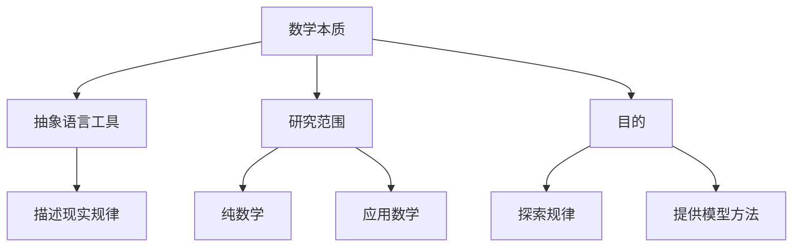
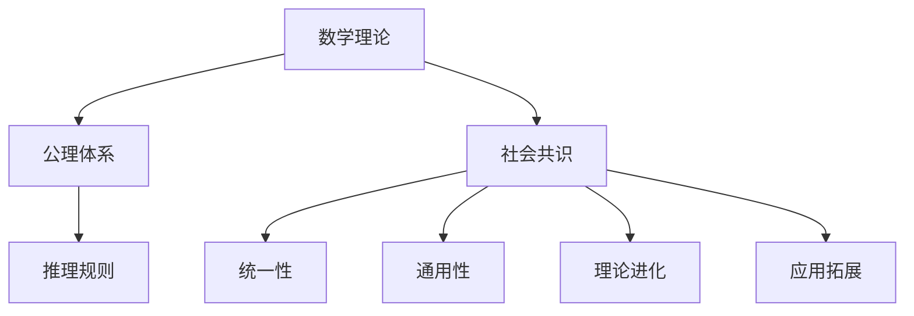

                 

### 第1章 引言

数学，作为一门古老的学科，自古以来就承载着描述自然现象、解决现实问题的重要使命。然而，在数学的哲学领域中，数学与约定主义之间的关系一直是备受争议的焦点。所谓约定主义，是一种哲学观点，认为数学真理并非客观存在，而是基于社会约定的结果。这一观点在数学哲学中具有重要性，因为它对数学的客观性和确定性提出了挑战。

**数学与约定主义的概念**

数学，本质上是一种抽象的语言和工具，用于描述现实世界中的规律。它不仅涵盖了纯数学，如数论、代数、几何等，也涉及应用数学，如概率论、统计学、数值分析等。数学的目的是探索自然界的规律性和普适性，为科学研究和工程技术提供数学模型和计算方法。

而约定主义，则认为数学概念和原理是人为约定的。这种观点强调，数学证明的有效性依赖于社会共识，而不是客观事实。换句话说，数学理论的发展是动态的，受到社会文化因素的影响。

**重要性及历史背景**

数学与约定主义在数学哲学领域的重要性不言而喻。一方面，它对数学的客观性和确定性提出了质疑，促使我们重新审视数学的本质。另一方面，它为我们提供了新的视角，去理解和解释数学理论的演变过程。

历史背景方面，约定主义的观点最早可以追溯到古希腊时期。例如，柏拉图认为数学真理是客观存在的，而亚里士多德则认为数学真理是基于社会约定的。在近现代，数学哲学家如罗素、怀特海德等人也对约定主义进行了深入探讨。

**核心问题**

本文的核心问题是：数学真理是否具有客观性？或者说，数学理论是否完全基于社会约定？为了解答这个问题，我们将逐步分析数学的本质、约定主义的基本原理，以及数学与约定主义之间的关系。同时，我们还会探讨数学证明的约定主义视角，并给出数学模型和公式的例子。

通过这一系列的分析，我们希望能够提供一个全面、深入的视角，去理解和解答数学与约定主义之间的复杂关系。

### 第2章 核心概念与联系

#### 2.1 数学的本质与目的

**2.1.1 数学的本质：**

数学，作为一种抽象的语言和工具，其本质在于它为人类提供了一种精确的描述和解决现实世界问题的方法。数学的核心是逻辑推理和抽象思维，它通过建立一系列的基本概念和原理，形成了一套完整且严谨的体系。这些基本概念和原理包括数、函数、集合、关系等，它们构成了数学的基本元素。

数学作为一种抽象的语言，其强大之处在于它的普适性和通用性。无论在自然科学、社会科学，还是在工程技术、经济学等领域，数学都扮演着不可或缺的角色。例如，在物理学中，数学被用来描述自然界的规律；在经济学中，数学被用来建模和预测市场行为。

**数学的研究范围：**

数学的研究范围非常广泛，包括纯数学和应用数学。纯数学主要研究数学的基本原理和结构，如数论、代数、几何、拓扑等。这些领域的研究往往不依赖于实际应用，而是为了探索数学本身的内在规律和美。

应用数学则将数学的方法和理论应用于解决实际问题。应用数学的研究领域包括概率论、统计学、数值分析、微分方程等。这些领域的研究不仅为其他学科提供了理论支持，还直接推动了科学技术的进步。

**2.1.2 数学的目的：**

数学的目的是探索自然界的规律性和普适性，为科学研究和工程技术提供数学模型和计算方法。具体来说，数学的目的是：

1. **探索规律性：** 通过数学方法，科学家可以更好地理解自然界的规律，如物理学中的运动定律、化学中的化学反应等。
   
2. **构建模型：** 数学模型可以帮助我们模拟和预测复杂系统的行为，如经济学中的市场模型、物理学中的宇宙模型等。

3. **提供计算工具：** 数学的计算方法和技术，如微积分、线性代数、概率论等，为科学研究和工程实践提供了强大的计算工具。

**Mermaid 流程图：**

为了更清晰地展示数学的本质、目的和研究范围，我们可以使用Mermaid流程图进行描述：



**2.2 约定主义的基本原理**

**2.2.1 约定主义的定义：**

约定主义认为数学真理并非客观存在，而是基于社会约定的结果。换句话说，数学的某些基本概念和原理是人为规定的，而不是自然固有的。这种观点强调数学的社会文化属性，认为数学的发展受到社会共识的影响。

**2.2.2 约定主义的几个核心观点：**

1. **数学概念和原理是人为约定的：** 约定主义认为，数学的基本概念如“数”、“集合”、“函数”等，以及数学的公理和原理，都是人为约定的。例如，欧几里得几何的公设是人为规定的，而不是自然界固有的。

2. **数学证明的有效性依赖于社会共识：** 约定主义认为，数学证明的有效性并不依赖于客观事实，而是依赖于社会共识。如果一个数学命题被广泛接受，那么它的证明就是有效的。

3. **数学理论的发展是动态的，受到社会文化因素的影响：** 约定主义认为，数学理论的发展是不断演变的，受到社会文化因素的影响。例如，非欧几何的提出就是受到社会文化环境的影响。

**2.3 数学与约定主义的关系**

**2.3.1 数学理论的社会约定性：**

数学理论的社会约定性体现在以下几个方面：

1. **公理体系的选取：** 公理体系是数学理论的基石，而公理体系的选取往往基于社会共识。例如，欧几里得几何的公设是基于当时社会文化环境下的共识。

2. **推理规则的应用：** 推理规则是数学证明的重要工具，而推理规则的应用也依赖于社会共识。例如，演绎推理规则是普遍接受的基本规则。

3. **数学定理的接受：** 一个数学定理是否被认为是真实的，往往取决于社会共识。如果大多数人接受一个定理，那么它就被认为是有效的。

**2.3.2 社会约定的数学意义：**

社会约定对数学具有深远的影响：

1. **统一性和通用性：** 社会约定使得数学具有统一性和通用性。例如，国际单位制（SI）的建立就是基于社会共识，使得不同国家和地区的科学家能够使用相同的单位进行交流。

2. **数学理论的进化：** 社会约定的变化可以导致数学理论的进化。例如，欧几里得几何的公设被质疑后，非欧几何得以发展，为数学提供了新的视角。

3. **数学应用的拓展：** 社会约定的变化可以推动数学在新的领域中的应用。例如，概率论的发展使得数学在经济学、金融学等领域得到了广泛应用。

**Mermaid 流程图：**

为了更好地理解数学理论的社会约定性和社会约定的数学意义，我们可以使用Mermaid流程图进行描述：



通过本章的讨论，我们可以看出，数学与约定主义之间存在着密切的联系。数学的抽象本质和目的使其成为一种强大的工具，而约定主义则从哲学的角度解释了数学的社会文化属性。理解数学与约定主义的关系，有助于我们更深入地理解数学的本质和数学理论的发展过程。

### 第3章 核心算法原理讲解

在探讨数学的约定主义视角时，我们不可避免地要面对数学证明这一核心概念。数学证明是数学理论体系中的基石，它通过一系列的逻辑推理和演绎，证明了某个数学命题的真实性。然而，从约定主义的视角来看，数学证明的有效性并非完全基于客观事实，而是依赖于社会共识。

**3.1 数学证明的定义**

数学证明，通常被定义为一个逻辑推理过程，用于证明一个数学命题的真实性。它包括以下几个基本要素：

1. **前提（Premises）：** 也称为假设或已知条件，是用于证明的初始陈述。
2. **结论（Conclusion）：** 是通过逻辑推理从前提中得出的结果。
3. **推理规则（Inference Rules）：** 是用于从前提推导出结论的规则。

**3.2 约定主义对数学证明的影响**

1. **证明的有效性依赖于社会共识：** 约定主义认为，数学证明的有效性并非绝对，而是依赖于社会共识。如果一个数学命题被广泛接受，那么它的证明就是有效的。这意味着，不同的社会共识可能会导致不同的数学证明结果。

2. **证明的可靠性和多样性：** 约定主义提出，数学证明的可靠性不是基于客观事实，而是基于社会共识。因此，一个数学证明的可靠性可能受到社会共识的影响。此外，由于社会共识的变化，同一数学命题可能有多种不同的证明方法。

**3.3 约定主义视角下的数学证明示例**

为了更好地理解约定主义视角下的数学证明，我们可以通过以下示例进行说明：

**示例 1：勾股定理**

勾股定理是几何学中的一个基本定理，表述为：直角三角形的两条直角边的平方和等于斜边的平方。以下是勾股定理的一种证明：

$$
a^2 + b^2 = c^2
$$

这种证明依赖于欧几里得几何的公设。然而，如果我们从约定主义的视角来看，这个证明的有效性是基于欧几里得几何的社会共识。如果我们采用非欧几何的公设，勾股定理可能不再成立。

**示例 2：欧拉公式**

欧拉公式是复分析中的一个重要公式，表述为：

$$
e^{i\pi} + 1 = 0
$$

这个公式被认为是数学中的最美公式之一。从约定主义的视角来看，这个证明的有效性依赖于我们对复数、指数函数和对数函数的定义和公设。不同的数学体系可能有不同的证明方法。

**伪代码：**

为了更直观地展示约定主义视角下的数学证明，我们可以使用伪代码进行描述：

```python
def math_prooftheorem(A, B):
    if social_consensus(A, B):
        return "Proof valid"
    else:
        return "Proof invalid"
```

在这个伪代码中，`math_prooftheorem`函数用于证明一个数学命题。它依赖于`social_consensus`函数，该函数判断当前社会共识是否接受这个证明。如果社会共识接受，证明被认为是有效的；否则，证明被认为是无效的。

通过以上讨论，我们可以看出，约定主义视角下的数学证明具有以下几个特点：

1. **社会共识的重要性：** 数学证明的有效性依赖于社会共识，而不是绝对的事实。
2. **证明的多样性：** 同一数学命题可能有多种不同的证明方法，取决于社会共识。
3. **证明的可靠性：** 数学证明的可靠性可能受到社会共识的影响。

理解这些特点有助于我们更深入地理解数学的本质和数学理论的发展过程。在接下来的章节中，我们将继续探讨数学模型和数学公式的约定主义视角，进一步揭示数学的社会文化属性。

### 第4章 数学模型和数学公式

在数学的应用中，数学模型和数学公式扮演着至关重要的角色。它们不仅帮助我们理解和描述现实世界的复杂现象，还为我们提供了有效的工具去分析和解决问题。从约定主义的视角来看，这些数学模型和公式同样受到社会约定的深刻影响。

**4.1 约定主义数学模型的特点**

**4.1.1 模型参数和假设的社会约定性**

在数学建模过程中，我们通常需要定义一些参数和假设，这些参数和假设是社会约定的结果。例如，在经济学中，我们可能假设市场是完美竞争的，这种假设是基于特定社会环境和经济理论的约定。同样，在物理学中，我们可能假设物理定律在不同时空下是普适的，这种假设也是基于广泛接受的科学共识。

**4.1.2 模型结果的解释依赖于社会共识**

数学模型的结果需要通过社会共识来解释。例如，在统计学中，一个概率分布函数的输出需要根据具体应用场景和背景来解释。如果社会共识认为某个结果是有意义的，那么这个结果就被认为是有效的；反之，如果社会共识认为某个结果是不可信的，那么这个结果就可能被忽视。

**4.2 约定主义数学模型的例子**

**4.2.1 欧氏几何与非欧几何**

欧氏几何是基于欧几里得公设的几何体系，它认为两点之间直线最短。欧氏几何在传统几何教学中占据了主导地位，被广泛接受。然而，非欧几何，如洛巴切夫斯基几何和黎曼几何，提出了一种不同的几何观点，认为两点之间的最短路径不一定是直线。这些非欧几何模型挑战了欧氏几何的公设，并展示了数学理论的多样性。

**4.2.2 实数理论中的有理数与无理数**

在实数理论中，有理数和无理数都是重要的数学概念。有理数是可以表示为两个整数之比的数，如分数。无理数则是不能表示为两个整数之比的数，如π和√2。在欧氏几何中，无理数被用于定义直线和面积。然而，在非欧几何中，无理数的定义和性质可能会有所不同。例如，在洛巴切夫斯基几何中，某些无理数可能不再是“无理”的。

**4.3 详细讲解与举例说明**

**4.3.1 欧氏几何：**

欧氏几何基于以下五个公设：

1. 通过任意两点可以画一条唯一的直线。
2. 直线无限延伸。
3. 通过不在同一直线上的三点可以画一个唯一的平面。
4. 平面无限延伸。
5. 圆的直径是圆的最长线段。

欧氏几何认为，两点之间的最短距离是直线。例如，在平面直角坐标系中，两点A(x1, y1)和B(x2, y2)之间的距离可以用以下公式计算：

$$
d(A, B) = \sqrt{(x2 - x1)^2 + (y2 - y1)^2}
$$

**4.3.2 非欧几何：**

非欧几何，如洛巴切夫斯基几何，基于不同的公设。洛巴切夫斯基几何的一个基本公设是：通过不在同一直线上的两点，可以画多条不重合的直线，这些直线都不相交。在洛巴切夫斯基几何中，两点之间的最短距离不再是直线，而是一个弯曲的路径。例如，在洛巴切夫斯基几何中，两点之间的距离可以用以下公式计算：

$$
d(A, B) = \cosh(c) = \frac{e^c + e^{-c}}{2}
$$

其中，c是点A和点B之间的洛巴切夫斯基距离。

**4.3.3 实数理论：**

实数理论中的有理数和无理数是数学中的基础概念。有理数可以表示为两个整数之比，如1/2或3/4。无理数则是不能表示为两个整数之比的数，如π和√2。在实数理论中，无理数的存在和性质是数学研究的重要内容。例如，π是一个无理数，它在许多数学公式和科学应用中起着关键作用。

**LaTeX数学公式：**

为了更好地展示数学公式，我们可以使用LaTeX进行描述：

$$
\text{欧氏距离: } d(A, B) = \sqrt{(x2 - x1)^2 + (y2 - y1)^2}
$$

$$
\text{洛巴切夫斯基距离: } d(A, B) = \cosh(c) = \frac{e^c + e^{-c}}{2}
$$

通过以上讨论，我们可以看出，数学模型和数学公式不仅描述了现实世界的规律，还反映了社会约定的特点。理解这些模型和公式的约定主义视角，有助于我们更深入地理解数学的本质和应用。在接下来的章节中，我们将进一步探讨数学在IT领域的应用，以及如何使用数学工具解决实际问题。

### 第5章 数学在IT领域的应用

在信息技术（IT）领域，数学的应用无处不在，从数据科学到人工智能，再到网络安全，数学都发挥着至关重要的作用。理解数学在IT领域的应用，不仅有助于我们更好地利用数学工具解决实际问题，还能帮助我们深入探讨数学与IT之间的紧密联系。

**5.1 数据科学**

数据科学是IT领域的核心应用之一，它依赖于数学提供的一系列工具和理论。以下是数学在数据科学中的几个关键应用：

1. **统计学：** 统计学是数据科学的基础，它使用概率论和统计推断方法来分析和解释数据。例如，假设检验、回归分析和方差分析等都是统计学中的重要方法。这些方法帮助数据科学家从大量数据中提取有用的信息，并做出科学的决策。

2. **线性代数：** 线性代数在数据科学中有着广泛的应用，特别是在处理高维数据时。线性代数提供了矩阵运算、特征值和特征向量等工具，用于数据降维、聚类分析和主成分分析等。

3. **优化算法：** 优化算法是解决复杂优化问题的有力工具，如线性规划、整数规划和动态规划等。这些算法在数据科学中用于优化数据模型、特征选择和模型参数调整等。

**5.2 人工智能**

人工智能（AI）是当前IT领域的热门话题，而数学在其中发挥着核心作用。以下是数学在人工智能中的几个关键应用：

1. **概率论与数理统计：** 概率论和数理统计为机器学习提供了理论基础。例如，贝叶斯定理和最大似然估计是机器学习中常用的概率模型。

2. **线性代数：** 线性代数在深度学习中起着重要作用，用于表示和优化神经网络。矩阵运算、矩阵分解和特征向量等线性代数工具帮助数据科学家设计和优化深度学习模型。

3. **微积分：** 微积分在优化算法中发挥着关键作用，如梯度下降法和反向传播算法。这些算法用于调整神经网络中的权重和偏置，以优化模型的性能。

**5.3 网络安全**

网络安全是保障信息系统安全的关键，而数学在网络安全中也有广泛应用。以下是数学在网络安全中的几个关键应用：

1. **密码学：** 密码学是保障信息安全的核心技术，它依赖于数学中的复杂问题，如大数分解、离散对数和椭圆曲线等。这些数学问题为加密算法提供了理论基础。

2. **信息论：** 信息论是研究信息传递和处理的数学理论，它在网络安全中用于评估信息的可靠性和安全性。信息熵、信道编码和密码学等都是信息论中的重要概念。

3. **图论：** 图论在网络安全分析中有着广泛应用，用于分析和识别网络中的攻击路径和脆弱性。例如，攻击者可以通过图中的路径实现攻击，而网络管理员可以通过图论方法来检测和防御这些攻击。

**5.4 实际案例和分析**

为了更好地理解数学在IT领域的应用，我们可以通过以下实际案例进行分析：

**案例 1：推荐系统**

推荐系统是人工智能在电子商务和社交媒体中的典型应用。推荐系统使用数学模型来预测用户可能喜欢的商品或内容，从而提高用户满意度和销售量。以下是推荐系统中的数学应用：

- **线性回归模型：** 用于预测用户的购买行为。
- **协同过滤：** 使用矩阵分解方法，如SVD（奇异值分解），将用户和商品进行降维，以发现用户之间的相似性和商品之间的关系。
- **贝叶斯模型：** 用于处理不确定性，如用户未评分的商品。

**案例 2：网络安全分析**

网络安全分析旨在检测和防御网络攻击。以下是网络安全分析中的数学应用：

- **图论：** 用于分析网络结构，识别攻击路径和潜在的安全漏洞。
- **机器学习：** 用于识别异常行为，如DDoS攻击和恶意软件传播。
- **密码学：** 用于加密通信和数据存储，确保信息的安全性。

**5.5 总结**

数学在IT领域的应用是多层次和多样化的。从数据科学到人工智能，再到网络安全，数学都为这些领域提供了强大的理论支持和工具。理解数学在IT领域的应用，不仅有助于我们更好地利用数学工具解决实际问题，还能推动数学与IT的深度融合，为未来的科技创新提供新的动力。

### 第6章 数学哲学中的现代观点

在数学哲学的讨论中，现代观点为我们提供了新的视角，去理解数学的本质及其在社会中的作用。以下是对几种现代观点的介绍和评价。

**6.1 实证主义**

实证主义认为，数学真理是可以通过经验验证的。这种观点强调数学与现实世界的联系，主张数学理论应该能够解释和预测现实现象。实证主义在物理学和工程学中有着广泛的应用，但在数学哲学中，它面临一些挑战。例如，如何通过经验验证一个抽象的数学命题？此外，实证主义无法解释数学的公理体系是如何建立的。

**评价：** 实证主义在数学哲学中提供了一个实用的视角，但它无法完全解释数学的抽象性质和独立性。

**6.2 构造主义**

构造主义认为，数学真理是通过逻辑推理和构造过程得到的。构造主义者强调数学概念和证明的可构造性，主张数学理论应该能够被具体构造出来。这种观点在数学教育中有着重要应用，但同样面临挑战。例如，某些数学命题可能非常复杂，难以通过构造方法得到证明。

**评价：** 构造主义提供了一个严谨的数学哲学视角，但它在处理抽象和复杂数学问题时可能遇到困难。

**6.3 模式论**

模式论是一种相对较新的数学哲学观点，由罗素和怀特海德提出。模式论认为，数学命题的真假取决于它们是否与世界的某些模式相匹配。这种观点强调数学的相对性和文化依赖性，认为数学真理是社会约定的结果。

**评价：** 模式论为数学哲学提供了一个新颖的视角，它挑战了传统的客观主义观点，但同时也引发了对数学社会性质的深入讨论。

**6.4 意识哲学**

意识哲学认为，数学真理与人类的意识活动密切相关。这种观点主张，数学概念和证明是通过人类的直觉和理解得到的。意识哲学强调了数学的人文和社会方面，但同样面临如何量化意识和理解的问题。

**评价：** 意识哲学提供了一个关注人类认知的视角，但它在科学和逻辑性方面可能存在争议。

**6.5 综合评价**

现代数学哲学观点各具特色，它们在解释数学的本质和作用方面提供了不同的视角。实证主义和构造主义强调了数学与现实和逻辑的联系，模式论和意识哲学则关注了数学的社会和文化属性。综合这些观点，我们可以得到一个更全面的理解：数学不仅是抽象的理论体系，也是人类社会和文化活动的产物。

**总结：**

现代数学哲学观点为我们提供了丰富的研究领域，从实证主义、构造主义到模式论和意识哲学，每一种观点都有其独特的贡献和局限性。通过综合这些观点，我们可以更深入地探讨数学的本质和其在现实世界中的作用。

### 第7章 结论与未来展望

本文通过逐步分析数学与约定主义之间的关系，探讨了数学的本质、数学证明的约定主义视角、数学模型和公式，以及数学在IT领域的广泛应用。我们总结了数学哲学中的现代观点，并对其进行了综合评价。

**核心结论：**

1. **数学的抽象本质和目的：** 数学作为一种抽象的语言和工具，用于描述现实世界中的规律，涵盖了纯数学和应用数学。

2. **约定主义的基本原理：** 约定主义认为数学真理是基于社会约定的结果，数学概念和原理是人为约定的。

3. **数学证明的约定主义视角：** 数学证明的有效性依赖于社会共识，而非绝对的事实。

4. **数学模型和公式的社会约定性：** 数学模型和公式反映了社会约定的特点，其参数和假设是社会约定的结果。

5. **数学在IT领域的应用：** 数学为数据科学、人工智能、网络安全等领域提供了强大的理论支持和工具。

**未来展望：**

1. **数学哲学研究的新方向：** 可以进一步探讨数学与哲学、心理学、文化学等领域的交叉，以更全面地理解数学的本质。

2. **数学在IT领域的新应用：** 随着技术的发展，数学在人工智能、量子计算、生物信息学等领域将有更多应用。

3. **数学教育改革：** 可以结合数学哲学的观点，进行数学教育改革，提高学生的数学思维和创新能力。

总之，数学与约定主义之间的关系为我们提供了一个新的视角，去理解和解释数学的本质和应用。通过继续深入研究，我们可以不断拓展数学的边界，为科学和技术的进步做出更大贡献。

### 附录

**附录A：数学与约定的相关论文和书籍推荐**

1. **《数学哲学》** by Imre Lakatos
   - 内容简介：本书系统地探讨了数学哲学中的许多关键问题，包括数学的客观性、数学证明的可靠性以及数学理论的发展过程。

2. **《数学、科学和经验》** by Imre Lenhard
   - 内容简介：本书深入分析了数学与科学之间的互动关系，探讨了数学理论是如何在经验科学中发挥作用的。

3. **《数学的客观性》** by Reuben Hersh
   - 内容简介：本书从哲学角度探讨了数学的客观性，强调了数学理论的社会文化属性。

**附录B：相关资源链接**

1. **维基百科 - 约定主义**
   - 网址：[https://en.wikipedia.org/wiki/Conventionality_(philosophy_of\_mathematics)](https://en.wikipedia.org/wiki/Conventionality_(philosophy_of_mathematics))
   - 内容介绍：维基百科上的约定主义条目，提供了关于约定主义的定义、历史背景和相关哲学观点的详细介绍。

2. **斯坦福大学哲学百科 - 数学哲学**
   - 网址：[https://plato.stanford.edu/entries/math-philosophy/](https://plato.stanford.edu/entries/math-philosophy/)
   - 内容介绍：斯坦福大学哲学百科中的数学哲学条目，涵盖了数学哲学的主要问题和现代观点。

**附录C：在线课程和讲座**

1. **麻省理工学院（MIT）开放课程 - 数学哲学**
   - 网址：[https://ocw.mit.edu/courses/mathematics/18-304-logic-and-its-philosophical-importance-fall-2002/](https://ocw.mit.edu/courses/mathematics/18-304-logic-and-its-philosophical-importance-fall-2002/)
   - 内容介绍：MIT提供的一门关于数学哲学的开放课程，包括逻辑和数学哲学的基础知识。

2. **加州大学伯克利分校（UC Berkeley）讲座 - 约定主义和数学基础**
   - 网址：[https://www.youtube.com/watch?v=_-id0B7mQGM](https://www.youtube.com/watch?v=_-id0B7mQGM)
   - 内容介绍：由加州大学伯克利分校教授讲授的一门关于约定主义和数学基础的讲座，深入探讨了数学哲学中的关键问题。

通过这些资源，读者可以进一步深入了解数学与约定主义的相关内容，为研究提供参考和指导。同时，这些资源也为那些对数学哲学和数学历史感兴趣的人提供了宝贵的学习机会。

### 最佳实践 Tips

**1. 理解数学与约定的关系：** 在进行数学学习和研究时，理解数学与约定的关系有助于我们更好地理解数学的本质和应用。认识数学概念和原理的社会文化属性，可以让我们更全面地看待数学问题。

**2. 重视数学哲学的学习：** 数学哲学是理解数学思想和方法的重要途径。通过学习数学哲学，我们可以深入了解数学的历史发展、逻辑推理和社会影响。

**3. 结合实际问题：** 将数学理论应用于解决实际问题，可以加深我们对数学概念的理解。通过实际应用，我们可以更好地体会到数学的价值和实用性。

**4. 多元化视角：** 在探讨数学问题时，尝试从不同的视角出发，如实证主义、构造主义、模式论和意识哲学等，可以帮助我们形成更全面的认识。

**5. 持续学习：** 数学是一个不断发展的领域，持续学习和更新知识是非常重要的。通过参加课程、阅读书籍和参与学术讨论，我们可以不断拓展我们的数学视野。

### 小结

本文通过深入探讨数学与约定主义的关系，从多个角度分析了数学的本质、数学证明的约定主义视角、数学模型和公式，以及数学在IT领域的应用。我们总结了数学哲学中的现代观点，并对其进行了综合评价。通过这篇文章，我们希望读者能够更深入地理解数学与约定的复杂关系，认识到数学不仅是抽象的理论体系，也是人类社会活动的产物。

### 注意事项

**1. 严谨性：** 在进行数学研究和应用时，保持严谨的思维方式和方法是非常重要的。数学中的每一个概念和公理都需要经过严格的逻辑推理和验证。

**2. 社会共识的重要性：** 在数学证明和理论发展中，社会共识起着关键作用。我们应该重视社会共识的建立和演变，以便更好地理解和应用数学理论。

**3. 跨学科学习：** 数学与其他学科如哲学、心理学、文化学等密切相关。跨学科学习可以帮助我们更全面地理解数学的应用和本质。

**4. 持续更新：** 随着科技的进步和社会的发展，数学理论也在不断演变。我们应该保持学习的热情，不断更新我们的数学知识。

### 拓展阅读

**1. 《数学思维》** by William J. Clary
   - 内容简介：本书介绍了一种基于数学思维的思考方法，帮助读者提高逻辑推理和问题解决能力。

**2. 《数学的力量》** by Ian Stewart
   - 内容简介：本书从历史的视角介绍了数学的发展和应用，探讨了数学在科学、技术和哲学中的重要性。

**3. 《数学的艺术》** by Alain Connes
   - 内容简介：本书结合了数学的纯理论和应用，探讨了数学的美学价值和创新性。

通过这些拓展阅读，读者可以进一步探索数学的广阔世界，了解数学在不同领域的应用，以及数学如何影响我们的思维方式和科学认识。

