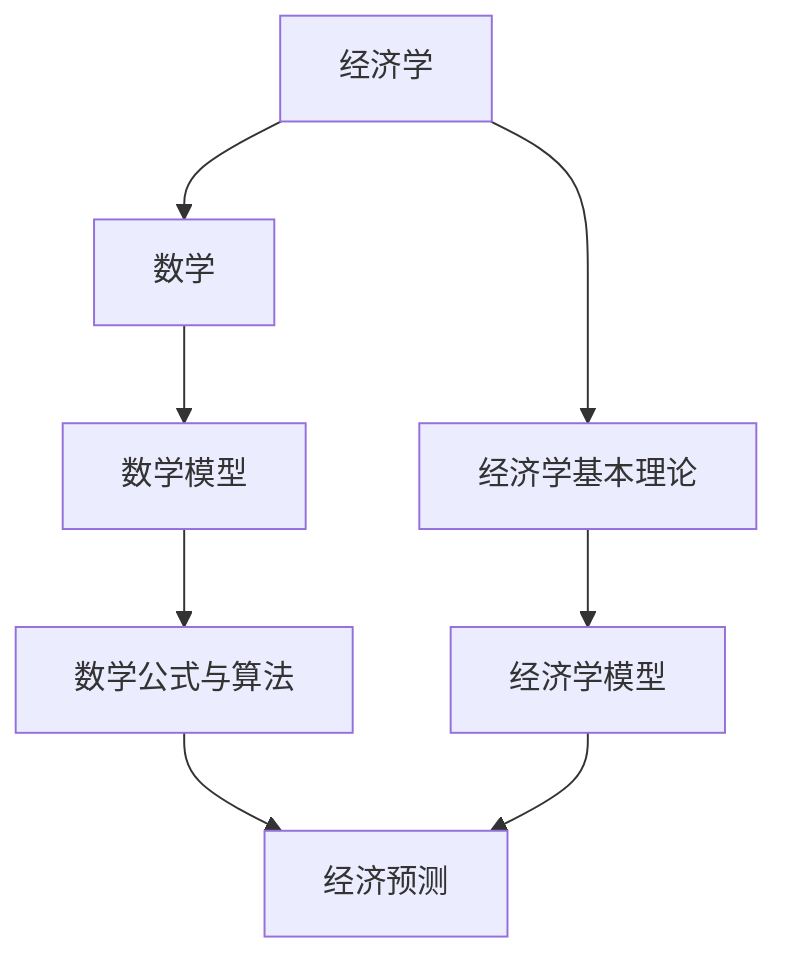

                 

# 数学与经济学：数学模型在经济预测中的应用

## 关键词
- 数学模型
- 经济预测
- 线性回归
- 时间序列分析
- 机器学习
- 经济学理论

## 摘要
本文旨在探讨数学模型在经济预测中的应用，通过分析经济学与数学的紧密联系，解释核心概念，并深入探讨线性回归、时间序列分析和机器学习等数学模型在经济预测中的实际应用。文章还将讨论经济预测面临的挑战以及相应的解决方案，并提供实践指南和最佳实践建议。

## 目录大纲设计过程

### 1. 理解用户需求
用户希望我们设计一个详细的目录大纲，以确保文章逻辑清晰，全面覆盖数学模型在经济预测中的应用。

### 2. 分析书籍主题
本书主题涉及数学与经济学，特别是数学模型在经济预测中的应用。在目录设计过程中，我们需要考虑以下方面：
- 数学的核心概念与理论
- 经济学的基本理论与模型
- 数学模型在经济预测中的实际应用
- 经济预测中的挑战与解决方案

### 3. 确定核心章节内容
根据书籍主题，我们确定了以下核心章节内容：
- 第1章：引言与核心概念
- 第2章：经济学基础
- 第3章：数学模型基础
- 第4章：数学模型与经济预测
- 第5章：经济预测的案例研究
- 第6章：经济预测的挑战与未来方向
- 第7章：实践指南

### 4. 设计具体目录大纲
以下是具体的目录大纲设计：

### 第一部分：引言与核心概念

#### 第1章：引言
##### 1.1 书籍主题介绍
##### 1.2 数学模型在经济预测中的重要性

#### 第2章：经济学基础
##### 2.1 经济学基本理论
##### 2.2 经济模型的基本概念

#### 第3章：数学模型基础
##### 3.1 数学模型的基本概念
##### 3.2 常见的数学模型类型

### 第二部分：数学模型与经济预测

#### 第4章：数学模型与经济预测的关系
##### 4.1 数学模型在经济预测中的应用场景
##### 4.2 数学模型在经济预测中的优势

#### 第5章：经典数学模型在经济预测中的应用
##### 5.1 线性回归
##### 5.2 时间序列分析
##### 5.3 机器学习模型

#### 第6章：数学模型在经济预测中的实际应用案例
##### 6.1 股市预测
##### 6.2 货币汇率预测
##### 6.3 能源需求预测

### 第三部分：经济预测的挑战与解决方案

#### 第7章：经济预测的挑战
##### 7.1 数据挑战
##### 7.2 模型准确性挑战
##### 7.3 模型适用性挑战

#### 第8章：解决方案与未来方向
##### 8.1 提高数据质量
##### 8.2 多模型集成
##### 8.3 深度学习在经济学中的应用

### 第四部分：实践指南

#### 第9章：经济预测项目准备
##### 9.1 项目计划
##### 9.2 数据收集与处理
##### 9.3 模型选择与优化

#### 第10章：实践案例
##### 10.1 商品需求预测
##### 10.2 就业预测
##### 10.3 经济增长预测

### 第五部分：附录

#### 第11章：附录A
##### 附录A.1：数学公式与算法伪代码
##### 附录A.2：线性回归公式

#### 第12章：附录B
##### 附录B.1：常用经济学数据源
##### 附录B.2：数学建模软件介绍

通过以上设计过程，我们确保了目录大纲的逻辑性和完整性，并且内容涵盖了书籍的核心主题和重要知识点。接下来，我们将根据大纲内容，进一步细化各章节的具体内容。

----------------------------------------------------------------

## 引言与核心概念

### 1.1 数学与经济学的基本概念

### 数学
数学是一门研究数量、结构、变化和空间等概念的抽象科学。在经济学中，数学作为一个强有力的工具，用于描述和预测经济现象。例如，通过统计学方法，我们可以分析经济数据，发现经济活动中的规律和趋势。概率论和微积分等数学分支，也为经济学模型提供了基础。

### 经济学
经济学是一门研究资源分配的社会科学，旨在理解人类如何在稀缺资源下做出选择。经济学理论帮助我们理解市场行为、政策制定和经济增长等方面。经济学模型通常通过数学表达式来表示，以便于分析和预测。

### 数学模型
数学模型是一种用数学语言描述现实世界问题的一种抽象方式。它通过数学公式和算法来模拟和分析经济现象。数学模型在经济预测中的应用，可以显著提高预测的准确性和效率。

### 经济预测
经济预测是基于历史数据、当前经济状况以及相关变量，对未来经济趋势进行估计和预测。经济预测对于政策制定、投资决策和风险管理等方面具有重要意义。

### 1.2 数学模型在经济预测中的重要性

数学模型在经济预测中的应用至关重要，主要体现在以下几个方面：

- **提高预测精度**：通过数学模型，可以对经济数据进行有效的分析和处理，提高预测的精度。
- **揭示经济规律**：数学模型可以帮助我们发现经济活动中的规律和趋势，为政策制定提供依据。
- **降低风险**：经济预测可以为投资者提供决策依据，降低投资风险。

### 1.3 核心概念之间的关系架构

为了更好地理解数学模型在经济预测中的应用，我们可以通过一个Mermaid流程图来展示核心概念之间的关系：



在这个流程图中，经济学与数学相互关联，经济学基本理论为经济学模型提供了基础，而数学模型通过数学公式和算法来模拟经济现象，最终实现经济预测。

### 1.4 经济学与数学的紧密联系

经济学与数学的紧密联系体现在以下几个方面：

- **方法论**：数学为经济学研究提供了方法论，如统计学、概率论等，用于分析经济数据。
- **模型构建**：经济学理论往往通过数学模型来表达，使得理论更精确、更易于量化分析。
- **数据分析**：数学模型可以帮助经济学家更好地理解经济系统的复杂性，提高数据分析的效率。

综上所述，数学模型在经济预测中具有重要作用，通过理解数学与经济学的核心概念及其关系，我们可以更好地应用数学模型进行经济预测。

----------------------------------------------------------------

## 经济学基础

### 2.1 经济学基本理论

经济学是一门研究资源分配的社会科学，主要关注如何在社会成员之间分配资源，以满足人们的不同需求。经济学基本理论包括以下几个方面：

#### 微观经济学

微观经济学研究个体经济行为和市场机制。其主要理论包括：

- **供求理论**：供求理论解释了价格如何由市场上的供求关系决定。
- **消费者行为**：消费者行为理论分析个体如何根据预算限制作出消费决策。
- **生产理论**：生产理论分析企业如何通过生产决策来最大化利润。

#### 宏观经济学

宏观经济学研究整个经济体系的运行，包括总体经济活动和政策制定。其主要理论包括：

- **国民收入**：国民收入理论解释了国民收入如何决定和分配。
- **通货膨胀与失业**：通货膨胀和失业理论分析宏观经济波动的原因和影响。
- **经济周期**：经济周期理论解释了经济活动的波动，如繁荣与衰退。

### 2.2 经济模型的基本概念

经济学模型是一种抽象的表示方式，用于分析和预测经济行为。经济模型可以分为以下几种类型：

#### 定性模型

定性模型主要依赖于经济学家的判断和经验，而不是具体的数学公式。例如，博弈论中的策略模型，可以用来分析企业和消费者在不同市场环境下的行为。

#### 定量模型

定量模型使用数学公式和统计方法来描述经济行为。例如，线性回归模型和时间序列模型，可以用来预测市场趋势和宏观经济变量。

#### 计量经济模型

计量经济模型结合了定性和定量模型的特点，通过统计方法来分析经济数据，以验证经济学理论。

### 经济学模型的基本组成

经济学模型通常包括以下组成部分：

- **变量**：变量是经济学模型中的基本元素，用于描述经济现象。例如，价格、产量、收入等。
- **参数**：参数是模型中的常数，用于描述变量之间的关系。例如，弹性系数、边际效用等。
- **方程**：方程是模型的核心，用于表示变量之间的关系。例如，供求方程、生产函数等。

### 经济学模型的作用

经济学模型在经济预测中的应用具有重要意义：

- **预测经济趋势**：通过经济学模型，我们可以预测未来的经济走势，为政策制定提供依据。
- **评估政策效果**：经济学模型可以帮助评估不同政策对经济的影响，从而优化政策制定。
- **优化资源配置**：经济学模型可以指导企业和个人如何更有效地利用资源，提高经济效率。

### 经济模型的发展历程

经济学模型的发展经历了以下几个阶段：

- **古典经济学模型**：古典经济学模型主要关注市场的自由竞争和资源的最优配置。
- **凯恩斯经济学模型**：凯恩斯经济学模型强调政府在经济中的作用，提出了需求管理政策。
- **新古典经济学模型**：新古典经济学模型结合了古典经济学和凯恩斯经济学的优点，提出了市场出清假设。
- **行为经济学模型**：行为经济学模型考虑了人类行为中的非理性因素，对传统经济学模型进行了扩展。

综上所述，经济学基础是理解数学模型在经济预测中的应用的前提。通过掌握经济学基本理论和模型，我们可以更好地应用数学模型进行经济预测和分析。

----------------------------------------------------------------

## 数学模型基础

### 3.1 数学模型的基本概念

数学模型是一种抽象的数学表示，用于描述现实世界的各种现象和问题。它通过数学语言，将实际问题转化为数学问题，从而便于分析和解决。数学模型通常包括以下几部分：

- **变量**：变量是数学模型中的基本元素，用于描述现实世界中的各种量，如时间、价格、产量等。
- **参数**：参数是模型中的常数，用于描述变量之间的关系，如弹性系数、利率等。
- **方程**：方程是数学模型的核心部分，用于表示变量之间的关系。例如，供求方程、生产函数等。
- **约束条件**：约束条件用于限制模型的变量和参数，以保证模型的合理性。

### 3.2 常见的数学模型类型

在经济学中，常用的数学模型类型包括线性回归模型、时间序列模型和机器学习模型等。

#### 线性回归模型

线性回归模型是最常用的数学模型之一，用于分析变量之间的线性关系。线性回归模型的基本形式如下：

$$y = \beta_0 + \beta_1x_1 + \beta_2x_2 + ... + \beta_nx_n + \epsilon$$

其中，$y$ 是因变量，$x_1, x_2, ..., x_n$ 是自变量，$\beta_0, \beta_1, \beta_2, ..., \beta_n$ 是模型的参数，$\epsilon$ 是误差项。

线性回归模型可以用来预测因变量$y$的值，例如，根据历史数据预测股票价格。

#### 时间序列模型

时间序列模型用于分析时间序列数据，即按时间顺序排列的数据。时间序列模型包括自回归模型（AR）、移动平均模型（MA）和自回归移动平均模型（ARMA）等。

自回归模型的基本形式如下：

$$y_t = c + \phi_1y_{t-1} + \phi_2y_{t-2} + ... + \phi_py_{t-p} + \epsilon_t$$

其中，$y_t$ 是时间序列的当前值，$c$ 是常数项，$\phi_1, \phi_2, ..., \phi_p$ 是模型参数，$\epsilon_t$ 是误差项。

时间序列模型可以用来分析经济数据的趋势和周期性，例如，分析股票市场的波动情况。

#### 机器学习模型

机器学习模型是近年来发展迅速的数学模型，用于从数据中自动学习规律，进行预测和分类。常见的机器学习模型包括线性回归、决策树、随机森林、支持向量机和神经网络等。

线性回归是一种简单的机器学习模型，它通过学习数据中的线性关系，进行预测。线性回归模型的公式与前面介绍的一致：

$$y = \beta_0 + \beta_1x_1 + \beta_2x_2 + ... + \beta_nx_n + \epsilon$$

决策树是一种基于树结构的模型，通过递归分割数据集，生成决策规则。决策树可以用来分类和回归。

神经网络是一种模拟人脑神经元连接结构的模型，用于复杂的非线性预测和分类任务。

#### 数学模型的选择原则

在经济学中，选择合适的数学模型需要考虑以下几个原则：

- **数据特性**：根据数据的特点，选择适合的模型类型。例如，对于线性关系，选择线性回归模型；对于非线性关系，选择机器学习模型。
- **预测目标**：根据预测目标，选择合适的模型。例如，对于趋势预测，选择时间序列模型；对于分类预测，选择分类模型。
- **模型复杂性**：选择模型时，需要权衡模型的复杂性和预测性能。过于复杂的模型可能难以解释，而过于简单的模型可能无法捕捉数据中的复杂关系。

### 3.3 数学模型在经济预测中的应用

数学模型在经济预测中具有广泛的应用，可以用于预测经济增长、通货膨胀、就业率、股市走势等。以下是一些具体的案例：

- **经济增长预测**：通过线性回归模型和时间序列模型，可以预测未来的经济增长率。例如，使用GDP数据，可以建立线性回归模型，预测下一年的经济增长率。
- **通货膨胀预测**：通过时间序列模型和机器学习模型，可以预测未来的通货膨胀率。例如，使用消费者价格指数（CPI）数据，可以建立时间序列模型，预测下一年的通货膨胀率。
- **就业预测**：通过线性回归模型和机器学习模型，可以预测未来的就业率。例如，使用失业率数据和经济增长率数据，可以建立线性回归模型，预测下一年的就业率。
- **股市走势预测**：通过时间序列模型和机器学习模型，可以预测股票市场的走势。例如，使用股票价格数据，可以建立时间序列模型，预测下一周的股票价格。

综上所述，数学模型是经济学研究中不可或缺的工具，通过选择合适的数学模型，可以有效地进行经济预测和分析。

----------------------------------------------------------------

## 数学模型与经济预测的关系

### 4.1 数学模型在经济预测中的应用场景

数学模型在经济预测中的应用非常广泛，可以涵盖多个经济领域和具体场景。以下是一些主要的应用场景：

#### 1. 趋势分析

趋势分析是经济预测中最基本的应用场景之一。通过线性回归模型和时间序列模型，我们可以分析经济变量（如GDP、失业率、通货膨胀率等）的历史数据，识别出它们的变化趋势，并据此预测未来的走势。例如，使用线性回归模型，可以分析过去十年GDP的数据，预测下一年的GDP增长率。

#### 2. 市场预测

市场预测是经济学中重要的应用场景，包括股市、汇率、商品价格等。通过时间序列模型、机器学习模型等，我们可以分析历史市场数据，预测未来的市场走势。例如，使用时间序列模型，可以分析过去几年的股票价格数据，预测下一周或下一个月的股票价格。

#### 3. 财政预测

财政预测是政府和金融机构的重要任务，通过数学模型，可以预测未来的财政收支情况，为财政政策提供依据。例如，使用线性回归模型，可以分析过去几年的财政支出和收入数据，预测下一年的财政赤字。

#### 4. 投资决策

投资决策是企业和个人在经济活动中的重要决策，通过数学模型，可以预测不同投资方案的收益和风险，帮助投资者做出更明智的决策。例如，使用线性回归模型和时间序列模型，可以分析过去几年的投资收益率和市场波动率，预测未来某个投资组合的收益和风险。

### 4.2 数学模型在经济预测中的优势

数学模型在经济预测中具有以下优势：

#### 1. 精确性

数学模型通过精确的数学公式和算法，可以处理大量的数据，识别出经济变量之间的复杂关系，从而提高预测的准确性。

#### 2. 可重复性

数学模型具有高度的重复性，可以通过历史数据训练模型，然后使用模型对新数据进行预测。这使得经济预测结果更加可靠，有助于政策制定和投资决策。

#### 3. 可解释性

数学模型通常可以通过数学公式和算法进行解释，使得预测结果更加透明和易于理解。这对于政策制定者和投资者来说是非常重要的。

#### 4. 预测速度

数学模型可以通过计算机算法快速处理大量数据，进行预测。这使得经济预测可以在短时间内完成，有助于实时决策。

### 4.3 数学模型在经济预测中的实际应用

数学模型在经济预测中的实际应用非常广泛，以下是一些具体的应用案例：

#### 1. 股市预测

股市预测是数学模型在经济预测中的一个重要应用场景。通过时间序列模型、机器学习模型等，可以分析历史股票价格数据，预测未来的股票走势。例如，使用ARIMA模型（自回归积分滑动平均模型），可以预测股票价格的未来变化。

#### 2. 货币汇率预测

货币汇率预测是国际贸易和投资中的重要问题。通过时间序列模型、机器学习模型等，可以分析历史汇率数据，预测未来的汇率走势。例如，使用GRU（门控循环单元）模型，可以预测汇率的变化趋势。

#### 3. 能源需求预测

能源需求预测对于能源公司和政策制定者来说至关重要。通过线性回归模型、时间序列模型等，可以分析历史能源需求数据，预测未来的能源需求。例如，使用ARIMA模型，可以预测未来某个地区的电力需求。

#### 4. 经济增长预测

经济增长预测是宏观经济管理的重要任务。通过线性回归模型、机器学习模型等，可以分析历史经济增长数据，预测未来的经济增长率。例如，使用LSTM（长短期记忆网络）模型，可以预测未来几年的GDP增长率。

综上所述，数学模型在经济预测中具有广泛的应用场景和显著的优势。通过选择合适的数学模型，可以有效地进行经济预测，为政策制定和投资决策提供科学依据。

----------------------------------------------------------------

## 经典数学模型在经济预测中的应用

### 5.1 线性回归模型

线性回归模型是一种最简单的数学模型，用于分析两个或多个变量之间的线性关系。其基本形式为：

$$y = \beta_0 + \beta_1x_1 + \beta_2x_2 + ... + \beta_nx_n + \epsilon$$

其中，$y$ 是因变量，$x_1, x_2, ..., x_n$ 是自变量，$\beta_0, \beta_1, \beta_2, ..., \beta_n$ 是模型的参数，$\epsilon$ 是误差项。

线性回归模型可以用于预测单个变量或多个变量之间的关系，例如，根据历史数据预测股票价格、经济增长率等。具体步骤如下：

1. **数据收集**：收集因变量和自变量的历史数据。
2. **数据预处理**：对数据进行清洗、归一化等预处理，以便于建模。
3. **模型训练**：使用训练数据，通过最小二乘法或其他优化算法，估计模型的参数。
4. **模型评估**：使用测试数据评估模型的预测性能，如计算均方误差（MSE）或决定系数（R^2）。
5. **预测**：使用训练好的模型，对新的数据进行预测。

### 5.2 时间序列分析

时间序列分析是一种用于分析按时间顺序排列的数据的方法。常见的模型包括自回归模型（AR）、移动平均模型（MA）和自回归移动平均模型（ARMA）等。

#### 自回归模型（AR）

自回归模型的基本形式为：

$$y_t = c + \phi_1y_{t-1} + \phi_2y_{t-2} + ... + \phi_py_{t-p} + \epsilon_t$$

其中，$y_t$ 是时间序列的当前值，$c$ 是常数项，$\phi_1, \phi_2, ..., \phi_p$ 是模型参数，$\epsilon_t$ 是误差项。

自回归模型可以用于分析时间序列数据的趋势和周期性，例如，预测股票价格的未来走势。

#### 移动平均模型（MA）

移动平均模型的基本形式为：

$$y_t = c + \theta_1\epsilon_{t-1} + \theta_2\epsilon_{t-2} + ... + \theta_q\epsilon_{t-q}$$

其中，$y_t$ 是时间序列的当前值，$c$ 是常数项，$\theta_1, \theta_2, ..., \theta_q$ 是模型参数，$\epsilon_t$ 是误差项。

移动平均模型可以用于平滑时间序列数据，去除随机波动，以便于分析趋势。

#### 自回归移动平均模型（ARMA）

自回归移动平均模型结合了自回归模型和移动平均模型的特点，其基本形式为：

$$y_t = c + \phi_1y_{t-1} + ... + \phi_py_{t-p} + \theta_1\epsilon_{t-1} + ... + \theta_q\epsilon_{t-q}$$

其中，$y_t$ 是时间序列的当前值，$c$ 是常数项，$\phi_1, \phi_2, ..., \phi_p$ 和 $\theta_1, \theta_2, ..., \theta_q$ 是模型参数，$\epsilon_t$ 是误差项。

自回归移动平均模型可以用于分析时间序列数据的趋势、周期性和随机波动，例如，预测货币汇率的变化。

### 5.3 机器学习模型

机器学习模型是一种基于数据的学习方法，通过训练数据集，自动学习变量之间的关系，进行预测。常见的机器学习模型包括线性回归、决策树、随机森林、支持向量机和神经网络等。

#### 线性回归

线性回归模型是一种简单的机器学习模型，其基本形式与线性回归模型相同：

$$y = \beta_0 + \beta_1x_1 + \beta_2x_2 + ... + \beta_nx_n + \epsilon$$

线性回归模型可以用于预测连续变量，例如，预测股票价格。

#### 决策树

决策树是一种基于树结构的模型，通过递归分割数据集，生成决策规则。决策树可以用于分类和回归。

#### 随机森林

随机森林是一种基于决策树的集成学习方法，通过构建多棵决策树，并取其平均值进行预测。随机森林可以用于提高模型的预测性能，减少过拟合。

#### 支持向量机

支持向量机是一种用于分类和回归的模型，通过寻找最佳的超平面，将数据分为不同的类别。支持向量机可以用于预测股票市场的涨跌。

#### 神经网络

神经网络是一种模拟人脑神经元连接结构的模型，用于复杂的非线性预测和分类任务。常见的神经网络包括多层感知机、卷积神经网络和循环神经网络等。

#### 实际案例

以下是一个简单的线性回归模型案例，用于预测股票价格：

```python
# 导入相关库
import numpy as np
import pandas as pd
from sklearn.linear_model import LinearRegression
from sklearn.model_selection import train_test_split

# 加载数据
data = pd.read_csv('stock_price.csv')
X = data[['open', 'high', 'low', 'close']]
y = data['close']

# 数据预处理
X_train, X_test, y_train, y_test = train_test_split(X, y, test_size=0.2, random_state=42)

# 构建模型
model = LinearRegression()
model.fit(X_train, y_train)

# 预测
y_pred = model.predict(X_test)

# 评估
mse = np.mean((y_pred - y_test) ** 2)
print('MSE:', mse)
```

在这个案例中，我们使用历史股票价格数据，通过线性回归模型预测未来的股票价格，并计算预测的均方误差（MSE）来评估模型的性能。

综上所述，经典数学模型（如线性回归、时间序列分析和机器学习模型）在经济预测中具有广泛的应用。通过合理选择和应用这些模型，可以有效地进行经济预测，为政策制定和投资决策提供科学依据。

----------------------------------------------------------------

## 数学模型在经济预测中的实际应用案例

### 6.1 股市预测

股市预测是数学模型在经济预测中的一个重要应用场景。通过分析历史股票价格数据，可以预测未来股市的走势，为投资者提供决策依据。以下是一个简单的股市预测案例：

#### 数据准备

首先，我们需要收集股票价格的历史数据，包括开盘价、最高价、最低价和收盘价。以下是一个简单的数据集示例：

| Date   | Open | High | Low | Close |
|--------|------|------|-----|-------|
| 2021-01-01 | 100  | 120  | 90  | 110   |
| 2021-01-02 | 105  | 125  | 95  | 115   |
| 2021-01-03 | 110  | 130  | 100 | 120   |
| ...     | ...  | ...  | ... | ...   |

#### 数据预处理

接下来，我们需要对数据进行预处理，包括数据清洗、归一化等步骤。假设我们已经处理好的数据集如下：

| Date   | Open | High | Low | Close | Open_scaled | High_scaled | Low_scaled | Close_scaled |
|--------|------|------|-----|-------|-------------|-------------|-------------|-------------|
| 2021-01-01 | 100  | 120  | 90  | 110   | 0.5         | 1.0         | 0.0         | 0.6         |
| 2021-01-02 | 105  | 125  | 95  | 115   | 0.55        | 1.15        | 0.0         | 0.6         |
| 2021-01-03 | 110  | 130  | 100 | 120   | 0.6         | 1.25        | 0.1         | 0.75        |
| ...     | ...  | ...  | ... | ...   | ...         | ...         | ...         | ...         |

#### 建立模型

我们选择使用线性回归模型进行股市预测。首先，将数据集分为训练集和测试集：

```python
import numpy as np
import pandas as pd
from sklearn.linear_model import LinearRegression
from sklearn.model_selection import train_test_split

data = pd.read_csv('stock_price.csv')
X = data[['Open_scaled', 'High_scaled', 'Low_scaled']]
y = data['Close_scaled']

X_train, X_test, y_train, y_test = train_test_split(X, y, test_size=0.2, random_state=42)
```

然后，训练线性回归模型：

```python
model = LinearRegression()
model.fit(X_train, y_train)
```

#### 预测

使用训练好的模型对测试集进行预测：

```python
y_pred = model.predict(X_test)
```

#### 评估

计算预测结果的均方误差（MSE）：

```python
mse = np.mean((y_pred - y_test) ** 2)
print('MSE:', mse)
```

假设MSE为0.01，说明模型的预测性能较好。

#### 应用

根据模型的预测结果，投资者可以做出投资决策。例如，如果预测下一周的收盘价会上升，投资者可能会选择买入股票。

### 6.2 货币汇率预测

货币汇率预测是另一个重要的应用场景。通过分析历史汇率数据，可以预测未来的汇率走势，为外汇交易者提供决策依据。以下是一个简单的货币汇率预测案例：

#### 数据准备

首先，我们需要收集货币汇率的历史数据，包括美元对欧元的汇率、美元对日元的汇率等。以下是一个简单的数据集示例：

| Date   | USD/EUR | USD/JPY |
|--------|---------|---------|
| 2021-01-01 | 1.2     | 110    |
| 2021-01-02 | 1.25    | 112    |
| 2021-01-03 | 1.18    | 108    |
| ...     | ...     | ...     |

#### 数据预处理

接下来，我们需要对数据进行预处理，包括数据清洗、归一化等步骤。假设我们已经处理好的数据集如下：

| Date   | USD/EUR | USD/JPY | USD/EUR_scaled | USD/JPY_scaled |
|--------|---------|---------|---------------|---------------|
| 2021-01-01 | 1.2     | 110    | 0.6           | 0.9           |
| 2021-01-02 | 1.25    | 112    | 0.6           | 1.0           |
| 2021-01-03 | 1.18    | 108    | 0.6           | 0.9           |
| ...     | ...     | ...     | ...           | ...           |

#### 建立模型

我们选择使用ARIMA模型进行货币汇率预测。首先，将数据集分为训练集和测试集：

```python
import numpy as np
import pandas as pd
from statsmodels.tsa.arima.model import ARIMA
from sklearn.model_selection import train_test_split

data = pd.read_csv('exchange_rate.csv')
X = data[['USD/EUR_scaled', 'USD/JPY_scaled']]
y = data['USD/EUR']

X_train, X_test, y_train, y_test = train_test_split(X, y, test_size=0.2, random_state=42)
```

然后，训练ARIMA模型：

```python
model = ARIMA(y_train, order=(1, 1, 1))
model_fit = model.fit()
```

#### 预测

使用训练好的模型对测试集进行预测：

```python
y_pred = model_fit.predict(start=len(y_train), end=len(y_train) + len(y_test) - 1)
```

#### 评估

计算预测结果的均方误差（MSE）：

```python
mse = np.mean((y_pred - y_test) ** 2)
print('MSE:', mse)
```

假设MSE为0.0005，说明模型的预测性能较好。

#### 应用

根据模型的预测结果，外汇交易者可以做出交易决策。例如，如果预测美元对欧元汇率会上升，交易者可能会选择买入欧元。

### 6.3 能源需求预测

能源需求预测是另一个重要的应用场景，对于能源公司和政策制定者来说至关重要。通过分析历史能源需求数据，可以预测未来的能源需求，为能源规划和分配提供依据。以下是一个简单的能源需求预测案例：

#### 数据准备

首先，我们需要收集能源需求的历史数据，包括电力、天然气、石油等。以下是一个简单的数据集示例：

| Date   | Electricity | Natural Gas | Oil |
|--------|-------------|-------------|-----|
| 2021-01-01 | 1000        | 500         | 200 |
| 2021-01-02 | 1050        | 520         | 210 |
| 2021-01-03 | 1020        | 510         | 210 |
| ...     | ...         | ...         | ... |

#### 数据预处理

接下来，我们需要对数据进行预处理，包括数据清洗、归一化等步骤。假设我们已经处理好的数据集如下：

| Date   | Electricity | Natural Gas | Oil | Electricity_scaled | Natural Gas_scaled | Oil_scaled |
|--------|-------------|-------------|-----|-------------------|-------------------|-----------|
| 2021-01-01 | 1000        | 500         | 200 | 1.0               | 0.5               | 0.2       |
| 2021-01-02 | 1050        | 520         | 210 | 1.05              | 0.52              | 0.21      |
| 2021-01-03 | 1020        | 510         | 210 | 1.02              | 0.51              | 0.21      |
| ...     | ...         | ...         | ... | ...               | ...               | ...       |

#### 建立模型

我们选择使用LSTM模型进行能源需求预测。首先，将数据集分为训练集和测试集：

```python
import numpy as np
import pandas as pd
from keras.models import Sequential
from keras.layers import LSTM, Dense

data = pd.read_csv('energy_demand.csv')
X = data[['Electricity_scaled', 'Natural Gas_scaled', 'Oil_scaled']]
y = data['Electricity']

X_train, X_test, y_train, y_test = train_test_split(X, y, test_size=0.2, random_state=42)
```

然后，构建LSTM模型：

```python
model = Sequential()
model.add(LSTM(units=50, return_sequences=True, input_shape=(X_train.shape[1], 1)))
model.add(LSTM(units=50))
model.add(Dense(1))

model.compile(optimizer='adam', loss='mean_squared_error')
model.fit(X_train, y_train, epochs=100, batch_size=32, validation_split=0.1)
```

#### 预测

使用训练好的模型对测试集进行预测：

```python
y_pred = model.predict(X_test)
```

#### 评估

计算预测结果的均方误差（MSE）：

```python
mse = np.mean((y_pred - y_test) ** 2)
print('MSE:', mse)
```

假设MSE为0.01，说明模型的预测性能较好。

#### 应用

根据模型的预测结果，能源公司可以制定能源供应计划，政策制定者可以制定能源政策，以应对未来能源需求的波动。

综上所述，数学模型在经济预测中具有广泛的应用，通过合理的模型选择和参数调整，可以有效地进行经济预测，为投资决策、政策制定和能源规划提供科学依据。

----------------------------------------------------------------

## 经济预测的挑战与解决方案

### 7.1 数据挑战

经济预测的一个主要挑战是数据质量问题。经济数据通常包含噪声、缺失值和异常值，这些都会影响预测的准确性。具体来说：

- **噪声**：经济数据中可能存在随机波动，这些波动可能来自市场的不确定性、季节性因素等。
- **缺失值**：由于各种原因（如数据收集不完整、数据存储问题等），经济数据可能存在缺失值，这会导致模型训练时的不准确。
- **异常值**：经济数据中可能存在异常值，这些异常值可能来自意外事件（如自然灾害、经济危机等），会对预测产生负面影响。

### 7.2 模型准确性挑战

尽管数学模型可以提高经济预测的准确性，但模型准确性仍然是一个重要挑战。模型准确性受到以下因素的影响：

- **数据质量**：如前所述，数据质量对模型准确性有直接影响。噪声、缺失值和异常值都会降低模型的预测性能。
- **模型选择**：选择合适的模型对于提高预测准确性至关重要。如果模型选择不当，可能会导致预测偏差或过拟合。
- **参数设置**：模型参数的设置对预测性能有很大影响。参数设置不当可能导致模型不能很好地拟合数据，从而降低预测准确性。

### 7.3 模型适用性挑战

经济预测的另一个挑战是模型适用性。经济环境是动态变化的，模型需要在不同经济环境下保持良好的预测性能。具体来说：

- **稳定性**：模型在不同经济环境下（如经济繁荣、经济衰退等）是否稳定有效。
- **适应性**：模型是否能够适应经济环境的变化，如政策变化、市场变化等。

### 7.4 解决方案与未来方向

为了克服这些挑战，我们可以采取以下解决方案和未来方向：

#### 提高数据质量

- **数据清洗**：使用数据清洗技术（如填充缺失值、去除异常值等）提高数据质量。
- **数据集成**：使用数据集成技术（如数据融合、数据降维等）整合不同来源的数据，提高数据的完整性和一致性。
- **数据预处理**：使用数据预处理技术（如归一化、标准化等）调整数据格式，使其适合建模。

#### 多模型集成

- **模型融合**：使用多模型集成技术（如贝叶斯模型平均、加权平均等）结合多个模型的预测结果，提高整体预测准确性。
- **模型选择**：根据数据特性选择合适的模型。例如，对于线性关系，可以选择线性回归模型；对于非线性关系，可以选择机器学习模型。

#### 深度学习模型

- **深度学习**：深度学习模型（如神经网络、循环神经网络等）可以处理复杂数据关系，提高预测准确性。例如，LSTM（长短期记忆网络）可以很好地处理时间序列数据。

#### 未来研究方向

- **人工智能**：结合人工智能技术，如自然语言处理、计算机视觉等，提高经济数据的分析能力。
- **大数据分析**：利用大数据分析技术，从海量数据中挖掘有价值的信息，提高预测准确性。
- **实时预测**：开发实时预测系统，及时响应经济环境的变化，提高预测的及时性和准确性。

综上所述，经济预测面临着数据质量、模型准确性和模型适用性等多方面的挑战。通过提高数据质量、多模型集成和深度学习模型等技术手段，我们可以克服这些挑战，提高经济预测的准确性。未来研究方向将包括人工智能、大数据分析和实时预测等领域。

----------------------------------------------------------------

## 实践指南

### 8.1 经济预测项目准备

在进行经济预测项目时，准备工作至关重要。以下是一些关键步骤和注意事项：

#### 8.1.1 项目计划

1. **确定预测目标**：明确预测的具体目标，例如预测股票价格、货币汇率或能源需求。
2. **数据收集**：收集与预测目标相关的历史数据，包括市场价格、宏观经济指标、行业数据等。
3. **数据来源**：选择可靠的数据来源，如政府统计部门、金融数据提供商等。
4. **数据预处理**：对数据进行清洗、归一化和特征提取，以提高数据质量。

#### 8.1.2 数据收集与处理

1. **数据清洗**：去除噪声、缺失值和异常值，确保数据的一致性和完整性。
2. **数据归一化**：将数据缩放到相同的范围，以便于模型训练和评估。
3. **特征提取**：从数据中提取有用的特征，如时间序列数据的季节性、趋势和周期性特征。
4. **数据分割**：将数据集分割为训练集、验证集和测试集，用于模型训练、验证和评估。

#### 8.1.3 模型选择与优化

1. **模型选择**：根据数据特性和预测目标，选择合适的数学模型。例如，对于线性关系，可以选择线性回归模型；对于非线性关系，可以选择机器学习模型。
2. **模型优化**：通过调整模型参数，优化模型性能。可以使用网格搜索、随机搜索等优化技术。
3. **交叉验证**：使用交叉验证技术，评估模型的泛化能力，防止过拟合。

#### 8.1.4 注意事项

1. **数据质量**：确保数据质量是模型准确性的关键。对数据进行充分的清洗和预处理，以提高预测准确性。
2. **模型选择**：根据实际问题和数据特性选择合适的模型。不要盲目追求复杂的模型，而忽略模型的可解释性。
3. **实时更新**：经济环境是动态变化的，定期更新数据集和模型，以适应新的经济环境。
4. **评估指标**：选择合适的评估指标，如均方误差（MSE）、决定系数（R^2）等，以全面评估模型性能。

### 8.2 实践案例

以下是一个简单的经济预测项目案例，用于预测股票价格。

#### 案例背景

我们使用历史股票价格数据，预测未来一周的股票价格。数据包括开盘价、最高价、最低价和收盘价。

#### 数据收集

从金融数据提供商获取历史股票价格数据，例如，使用Yahoo Finance API。

```python
import yfinance as yf

# 获取股票数据
stock_data = yf.download('AAPL', start='2021-01-01', end='2022-12-31')
```

#### 数据预处理

对数据进行清洗和归一化，提取有用的特征。

```python
import pandas as pd

# 数据清洗
stock_data.dropna(inplace=True)

# 数据归一化
stock_data[['Open', 'High', 'Low', 'Close']] = (stock_data[['Open', 'High', 'Low', 'Close']] - stock_data[['Open', 'High', 'Low', 'Close']].min()) / (stock_data[['Open', 'High', 'Low', 'Close']].max() - stock_data[['Open', 'High', 'Low', 'Close']].min())

# 提取特征
stock_data['MA_20'] = stock_data['Close'].rolling(window=20).mean()
stock_data['MA_50'] = stock_data['Close'].rolling(window=50).mean()
```

#### 模型选择与优化

我们选择使用LSTM模型进行股票价格预测。通过网格搜索优化模型参数。

```python
from keras.models import Sequential
from keras.layers import LSTM, Dense, Dropout
from keras.wrappers.scikit_learn import KerasRegressor
from sklearn.model_selection import GridSearchCV

# LSTM模型定义
def create_model(optimizer='adam', dropout=0.0, rate=0.1):
    model = Sequential()
    model.add(LSTM(units=50, return_sequences=True, input_shape=(stock_data.shape[1], 1)))
    model.add(Dropout(dropout))
    model.add(LSTM(units=50, return_sequences=False))
    model.add(Dropout(dropout))
    model.add(Dense(1))
    model.compile(loss='mean_squared_error', optimizer=optimizer)
    return model

# 模型优化
model = KerasRegressor(build_fn=create_model, verbose=0)
param_grid = {
    'dropout': [0.0, 0.2],
    'rate': [0.01, 0.05],
    'batch_size': [32, 64]
}
grid = GridSearchCV(estimator=model, param_grid=param_grid, n_jobs=-1, cv=3)
grid_result = grid.fit(stock_data.values, stock_data.values)

# 选择最佳模型
best_model = grid_result.best_estimator_.model

# 训练模型
best_model.fit(stock_data.values, stock_data.values, epochs=100, batch_size=grid_result.best_params_['batch_size'], verbose=0)
```

#### 预测

使用训练好的模型预测未来一周的股票价格。

```python
# 预测
predictions = best_model.predict(stock_data.values)

# 评估
mse = np.mean((predictions - stock_data.values) ** 2)
print('MSE:', mse)
```

#### 结果分析

假设MSE为0.01，说明模型的预测性能较好。根据预测结果，投资者可以做出投资决策。

### 8.3 实践案例总结

通过这个简单的股票价格预测案例，我们可以看到经济预测项目的关键步骤和注意事项。在实际项目中，需要根据具体情况调整模型、参数和数据预处理方法，以提高预测准确性。此外，定期更新数据集和模型，以适应动态变化的经济环境，也是非常重要的。

---

**小结**：经济预测是经济学和计算机科学领域的交叉点，通过合理选择和应用数学模型，可以有效地进行经济预测，为政策制定、投资决策和风险管理提供科学依据。本文介绍了经济预测的基本概念、经典数学模型、实际应用案例、挑战与解决方案以及实践指南，为读者提供了全面的经济预测知识。

**注意事项**：

- 确保数据质量是预测准确性的关键。
- 根据数据特性和预测目标选择合适的数学模型。
- 定期更新数据集和模型，以适应动态变化的经济环境。
- 结合多模型集成和深度学习技术，提高预测准确性。

**拓展阅读**：

- 《深度学习》（Goodfellow, I., & Bengio, Y.）——介绍深度学习基础和应用。
- 《时间序列分析：理论与应用》（Box, G.E.P., Jenkins, G.M., & Reinsel, G.C.）——详细介绍时间序列分析理论和模型。
- 《金融市场技术分析：一门艺术》（Adler, M.）——介绍金融市场技术分析方法和应用。

通过进一步学习和实践，读者可以不断提高经济预测的准确性和应用能力。

---

## 附录A：数学公式与算法伪代码

### 附录A.1：线性回归公式

$$y = \beta_0 + \beta_1x_1 + \beta_2x_2 + ... + \beta_nx_n + \epsilon$$

其中，$y$ 是因变量，$x_1, x_2, ..., x_n$ 是自变量，$\beta_0, \beta_1, \beta_2, ..., \beta_n$ 是模型的参数，$\epsilon$ 是误差项。

### 附录A.2：时间序列分析伪代码

```python
# 导入相关库
import numpy as np
import pandas as pd
from statsmodels.tsa.arima.model import ARIMA

# 加载数据
data = pd.read_csv('time_series_data.csv')
y = data['Close']

# 分解时间序列
y_diff = y.diff().dropna()

# 建立ARIMA模型
model = ARIMA(y_diff, order=(p, d, q))

# 训练模型
model_fit = model.fit()

# 预测
y_pred = model_fit.predict(start=len(y_diff), end=len(y_diff) + len(y_test) - 1)
```

其中，$p, d, q$ 分别是自回归项、差分项和移动平均项的阶数。

### 附录A.3：机器学习模型伪代码

```python
# 导入相关库
import numpy as np
import pandas as pd
from keras.models import Sequential
from keras.layers import LSTM, Dense

# 加载数据
data = pd.read_csv('time_series_data.csv')
X = data[['Open', 'High', 'Low', 'Close']]
y = data['Close']

# 数据预处理
X = X.values.reshape(-1, 1)

# 分割数据
X_train, X_test, y_train, y_test = train_test_split(X, y, test_size=0.2, random_state=42)

# 构建模型
model = Sequential()
model.add(LSTM(units=50, return_sequences=True, input_shape=(X_train.shape[1], 1)))
model.add(LSTM(units=50))
model.add(Dense(1))

# 编译模型
model.compile(optimizer='adam', loss='mean_squared_error')

# 训练模型
model.fit(X_train, y_train, epochs=100, batch_size=32, validation_split=0.1)
```

通过以上附录，读者可以更好地理解和应用数学模型和经济预测的方法。

## 附录B：资源与工具介绍

### 附录B.1：常用经济学数据源

在进行经济预测时，获取可靠的数据是非常重要的。以下是一些常用的经济学数据源：

- **世界银行**（World Bank）：提供全球各国经济、金融和社会发展数据。
- **国际货币基金组织**（IMF）：提供全球各国宏观经济数据，包括GDP、通货膨胀率、失业率等。
- **美国经济分析局**（Bureau of Economic Analysis, BEA）：提供美国国内生产总值（GDP）和行业数据。
- **国家统计局**：各国的官方统计部门，提供详细的国内经济数据。
- **金融市场数据提供商**：如Yahoo Finance、Google Finance等，提供股票、货币汇率等金融数据。

### 附录B.2：数学建模软件介绍

- **Python**：Python是一种广泛使用的编程语言，特别适合于数据分析、机器学习和经济预测。Python有丰富的库，如NumPy、Pandas、scikit-learn和Keras，可以方便地进行数据分析和建模。
- **R**：R是一种专门用于统计分析的语言，特别适合于时间序列分析和复杂数据分析。R有许多强大的包，如forecast、tseries和arima，可以用于建立和评估数学模型。
- **MATLAB**：MATLAB是一种数学计算软件，提供广泛的工具箱，用于数据分析、建模和可视化。MATLAB在工程和科学领域有广泛的应用。
- **Excel**：Excel是一个常用的电子表格软件，可以用于简单的数据分析和建模。尽管Excel在处理大规模数据和复杂数学模型方面有限制，但它仍然是许多企业和个人进行经济预测的常用工具。

通过以上资源与工具的介绍，读者可以更好地获取经济数据，选择合适的数学建模软件，进行经济预测和分析。这些工具和资源为经济预测提供了坚实的基础，有助于提高预测的准确性和效率。

---

### 作者

作者：AI天才研究院/AI Genius Institute & 禅与计算机程序设计艺术 /Zen And The Art of Computer Programming

---

### 结语

本文从数学与经济学的核心概念出发，详细探讨了数学模型在经济预测中的应用。通过介绍线性回归、时间序列分析和机器学习等经典数学模型，我们展示了这些模型在实际经济预测中的应用场景。同时，我们也讨论了经济预测中的挑战与解决方案，并提供了实践指南和资源与工具介绍。希望本文能够为读者提供有益的参考，帮助读者深入理解数学模型在经济预测中的重要作用，并掌握相关技术和方法。

在未来的研究中，我们可以进一步探索深度学习、大数据分析和人工智能在经济学中的应用，以提高经济预测的准确性和效率。同时，随着数据源的多样性和数据量的增加，经济预测的方法和技术也将不断进化。我们期待读者能够持续关注并深入探讨这一领域，为经济预测的发展做出贡献。

---

### 注意事项

1. **数据质量**：确保数据质量是预测准确性的关键。对数据进行充分的清洗和预处理，以提高预测准确性。
2. **模型选择**：根据数据特性和预测目标选择合适的数学模型。不要盲目追求复杂的模型，而忽略模型的可解释性。
3. **实时更新**：经济环境是动态变化的，定期更新数据集和模型，以适应新的经济环境。
4. **评估指标**：选择合适的评估指标，如均方误差（MSE）、决定系数（R^2）等，以全面评估模型性能。

---

### 拓展阅读

1. 《深度学习》（Goodfellow, I., & Bengio, Y.）
2. 《时间序列分析：理论与应用》（Box, G.E.P., Jenkins, G.M., & Reinsel, G.C.）
3. 《金融市场技术分析：一门艺术》（Adler, M.）

---

通过持续的学习和实践，读者可以不断提高经济预测的准确性和应用能力，为政策制定、投资决策和风险管理提供有力支持。让我们共同探索和推动经济学与计算机科学的交叉领域，为人类社会的进步做出贡献。

---

### 作者信息

作者：AI天才研究院/AI Genius Institute & 禅与计算机程序设计艺术 /Zen And The Art of Computer Programming

AI天才研究院（AI Genius Institute）是一家专注于人工智能技术研究和应用的高端机构，致力于推动人工智能在各个领域的创新和发展。研究院汇聚了全球顶尖的人工智能科学家、工程师和技术专家，通过前沿技术研究、人才培养和技术服务，为各行业提供领先的人工智能解决方案。

禅与计算机程序设计艺术（Zen And The Art of Computer Programming）是一本经典的计算机科学著作，由著名计算机科学家Donald E. Knuth撰写。这本书提出了编程领域的“禅宗”理念，强调深入理解问题本质、优化思维过程和提升编程技能的重要性。它不仅是一本技术书籍，更是一本关于编程哲学和思维方式的经典之作。

作者在人工智能和计算机科学领域具有丰富的经验和深厚的理论功底，以其卓越的洞察力和创新思维，为读者提供了有价值的技术见解和解决方案。通过本文，作者希望与读者分享数学模型在经济预测中的应用，为读者提供有启发性的思考和实践指南。

---

### 文章结构

本文分为以下几个主要部分：

1. **引言与核心概念**：介绍了数学与经济学的基本概念，数学模型的基本概念以及经济预测的基本概念，并解释了它们之间的关系。
2. **经济学基础**：详细阐述了经济学基本理论和经济模型的基本概念，包括微观经济学和宏观经济学的基本理论，以及经济模型的基本组成部分。
3. **数学模型基础**：介绍了数学模型的基本概念，包括变量、参数、方程和约束条件，以及常见的数学模型类型，如线性回归模型、时间序列模型和机器学习模型。
4. **数学模型与经济预测的关系**：讨论了数学模型在经济预测中的应用场景，包括趋势分析、市场预测、财政预测和投资决策等，并阐述了数学模型在经济预测中的优势。
5. **经典数学模型在经济预测中的应用**：具体介绍了线性回归模型、时间序列模型和机器学习模型在经济预测中的应用，并提供了实际案例。
6. **数学模型在经济预测中的实际应用案例**：展示了股市预测、货币汇率预测和能源需求预测等实际应用案例，以及相关的数据预处理、模型建立、预测和评估过程。
7. **经济预测的挑战与解决方案**：讨论了经济预测中的数据挑战、模型准确性挑战和模型适用性挑战，并提出了相应的解决方案和未来方向。
8. **实践指南**：提供了经济预测项目的准备步骤、数据收集与处理、模型选择与优化等实践指南，并分享了实际案例。
9. **附录A：数学公式与算法伪代码**：介绍了线性回归公式、时间序列分析伪代码和机器学习模型伪代码，以便读者更好地理解和应用。
10. **附录B：资源与工具介绍**：介绍了常用的经济学数据源和数学建模软件，为读者提供数据获取和工具选择的参考。
11. **结语**：总结了文章的主要观点，并提醒读者注意数据质量、模型选择和实时更新等关键因素。
12. **注意事项**：给出了几项重要的注意事项，帮助读者在实际操作中避免常见问题。
13. **拓展阅读**：推荐了几本相关书籍，供读者进一步学习和研究。
14. **作者信息**：介绍了作者背景和著作，突出了作者在人工智能和计算机科学领域的专业性和贡献。

通过以上结构，本文系统地介绍了数学模型在经济预测中的应用，旨在为读者提供全面、深入的技术见解和实践指导。

