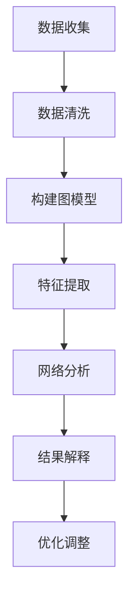
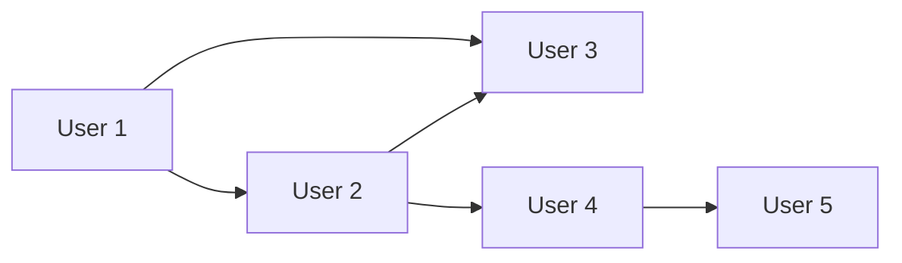

                 

## 文章标题

《数学与经济学：社会行为的数学描述》

> 关键词：数学，经济学，社会行为，模型，算法，应用

### 摘要

本文深入探讨了数学与经济学在描述社会行为方面的结合，通过数学模型和方法揭示了社会行为的复杂性和规律性。文章首先介绍了数学与经济学的基本概念，随后详细阐述了社会行为的数学描述，包括社会网络分析、动态系统建模和数据驱动建模。最后，通过实际案例展示了这些数学模型在经济学和社会科学领域的应用，为读者提供了全面的视角和理解。

### 理解书名与目标读者

《数学与经济学：社会行为的数学描述》这本书的主题在于展示数学与经济学如何结合，用以描述和解释社会行为。数学作为一种精确的语言工具，能够在经济学研究中提供强有力的分析框架。而经济学则为社会行为提供了理论背景和实际应用场景。这本书的目标读者包括对数学、经济学或社会科学有基础知识的读者，尤其是希望深入了解两者交叉领域的学者和研究人员。

### 核心主题

全书的核心主题可以概括为以下几个方面：

1. **数学基础**：介绍初等数学、线性代数和微积分的基础知识，为后续章节的数学建模奠定基础。
2. **经济学原理**：阐述市场经济学、行为经济学和公共经济学的基本概念和原理，为理解社会行为提供理论依据。
3. **社会行为的数学描述**：通过社会网络分析、动态系统建模和数据驱动建模，展示数学在描述社会行为中的应用。
4. **数学模型与经济学应用**：结合实际案例，展示数学模型在经济学研究中的具体应用和效果。
5. **实际案例研究**：通过具体案例，深入探讨数学模型在经济学和社会科学中的实际应用。

### 设计章节结构

为了确保读者能够系统地掌握数学与经济学在描述社会行为方面的知识，本书将分为七个章节。每个章节的结构如下：

#### 第1章 引言

- **引言**：介绍书籍的背景、目标和读者对象，为后续内容奠定基础。

#### 第2章 数学基础

- **初等数学概念**：介绍数的基本概念和运算，函数、图形与方程的基本知识，排列组合与概率论的基础。
- **线性代数基础**：介绍矩阵与向量、线性方程组与行列式、特征值与特征向量等核心概念。
- **微积分基础**：介绍导数与微分、积分与积分变换、泰勒展开等基本原理。

#### 第3章 经济学原理

- **市场经济学基础**：介绍市场的供需分析、价格机制与竞争、市场效率等基本概念。
- **行为经济学**：介绍心理因素与决策、群体行为与市场波动、行为经济学中的前景理论等核心概念。
- **公共经济学**：介绍财政政策与公共产品、社会福利与公平、公共选择理论等基本原理。

#### 第4章 社会行为的数学描述

- **社会网络分析**：介绍社会网络的定义与类型，社会网络模型的基本步骤，以及应用Mermaid流程图展示社会网络分析的过程。
- **动态系统与社会行为**：介绍动态系统的基本概念，离散时间与连续时间的动态系统，以及伪代码描述的离散时间动态系统模拟方法。
- **数据驱动的社会行为建模**：介绍数据收集与预处理、统计模型与社会行为分析的方法，以及使用伪代码描述的线性回归和逻辑回归模型。

#### 第5章 数学模型与经济学应用

- **市场均衡模型**：介绍市场均衡的基本原理，以及供求模型的应用。
- **动态博弈模型**：介绍动态博弈的基本概念，以及动态博弈模型的应用。

#### 第6章 实际案例研究

- **社会网络分析案例**：通过具体案例展示社会网络分析的应用，包括数据收集、预处理和模型分析等过程。
- **动态系统与社会行为案例**：通过具体案例展示动态系统在社会行为分析中的应用。
- **经济学模型应用案例**：通过具体案例展示经济学模型在经济学研究中的应用。

#### 第7章 结论

- **全书总结**：对全书内容进行总结，强调数学与经济学在描述社会行为中的重要性。
- **未来研究方向**：讨论未来研究可能的趋势和方向，为读者提供进一步研究的参考。

### 保持简洁性

为了确保目录大纲的简洁明了，我们将每个章节的内容限定在两个子章节以内。这样既能保证内容的深度和广度，又避免了冗余和复杂的结构。每个子章节都将详细阐述一个核心概念或方法，并通过实例和伪代码展示其实际应用。

### 审查与调整

在完成目录大纲后，我们将对每个章节的内容进行仔细审查和调整。确保每个章节的内容完整且逻辑清晰，避免遗漏重要概念或方法。同时，我们将检查伪代码和数学公式的准确性，确保其在文中能够正确展示和解释。

### 目录大纲设计

基于上述设计原则，以下是一个初步的目录大纲设计，供读者参考：

# 《数学与经济学：社会行为的数学描述》目录大纲

## 第1章 引言
### 1.1 书籍背景
### 1.2 目标读者

## 第2章 数学基础
### 2.1 初等数学概念
### 2.2 线性代数基础
### 2.3 微积分基础

## 第3章 经济学原理
### 3.1 市场经济学基础
### 3.2 行为经济学
### 3.3 公共经济学

## 第4章 社会行为的数学描述
### 4.1 社会网络分析
### 4.2 动态系统与社会行为
### 4.3 数据驱动的社会行为建模

## 第5章 数学模型与经济学应用
### 5.1 市场均衡模型
### 5.2 动态博弈模型

## 第6章 实际案例研究
### 6.1 社会网络分析案例
### 6.2 动态系统与社会行为案例
### 6.3 经济学模型应用案例

## 第7章 结论
### 7.1 全书总结
### 7.2 未来研究方向

通过上述目录大纲，我们将系统地介绍数学与经济学在描述社会行为方面的知识，帮助读者深入理解这一交叉领域的核心概念和应用。在接下来的章节中，我们将详细探讨每个主题，并通过实例和伪代码展示实际应用。

## 第1章 引言

### 1.1 书籍背景

《数学与经济学：社会行为的数学描述》旨在探讨数学与经济学如何结合，用以描述和解释社会行为。数学作为一种精确的语言工具，能够提供强大的分析框架，而经济学则提供了理论背景和实际应用场景。这一结合不仅丰富了数学和经济学的研究领域，也为社会科学提供了新的视角和方法。

本书的背景可以追溯到20世纪中叶，当时数学家和社会科学家开始意识到，社会行为可以通过数学模型进行描述和分析。随着计算机技术的飞速发展，数据驱动的分析方法在社会行为研究中得到了广泛应用。这些分析方法不仅能够揭示社会行为的规律性，还可以预测未来趋势和优化决策。

### 1.2 目标读者

本书的目标读者主要包括以下几类：

1. **数学和经济学专业的研究生和本科生**：这些读者具有数学和经济学的初步知识，希望通过本书深入了解数学与经济学的交叉领域。
2. **社会科学工作者**：包括社会学家、心理学家、政治学家等，他们希望借助数学和经济学的方法，对社会行为进行更深入的分析和解释。
3. **数据科学家和计算机程序员**：这些读者希望通过本书了解数学模型在社会行为研究中的应用，并将其应用于实际项目中。

本书旨在为这些读者提供一个系统、全面的学习资源，帮助他们掌握数学与经济学在描述社会行为方面的核心概念和应用方法。

### 1.3 数学与经济学的关系

数学与经济学的关系可以从多个方面进行探讨。首先，数学为经济学提供了强大的分析工具。经济学中的许多概念和理论都可以通过数学模型进行精确描述和分析。例如，供需模型、市场均衡模型、动态博弈模型等，都是通过数学方法建立的。

其次，经济学为数学提供了实际应用场景。经济学研究的问题往往与社会行为密切相关，例如市场行为、社会福利分配、环境保护等。这些问题的研究需要利用数学工具进行分析和解决。

最后，数学和经济学之间的相互影响也是一个重要的研究方向。数学家和社会科学家通过合作，共同探索数学模型在经济学研究中的应用，并不断优化这些模型。这种跨学科的合作不仅推动了数学和经济学的发展，也为社会科学的进步做出了贡献。

总之，数学与经济学之间的密切关系使得它们在描述社会行为方面具有独特的优势。通过本书的介绍，读者可以深入了解这一交叉领域的核心概念和应用方法。

### 1.4 数学在社会行为研究中的应用

数学在社会行为研究中的应用非常广泛，尤其在描述和预测社会现象方面具有显著优势。以下是一些具体的例子：

1. **社会网络分析**：社会网络分析是一种利用数学模型和方法来研究社会关系的学科。通过构建社会网络的数学模型，研究者可以分析个体或群体之间的互动关系，揭示社会结构的特征和规律。例如，可以分析社交网络中的传播动力学、信息流、影响力等。

2. **行为经济学**：行为经济学利用数学模型来研究个体决策行为，特别是那些与心理、社会和文化因素相关的决策。通过构建数学模型，研究者可以分析个体在不同情境下的选择行为，预测他们的决策结果。例如，可以研究个体对风险和不确定性的偏好、时间偏好、公平与不公平感等。

3. **公共选择理论**：公共选择理论是研究政府在资源配置和公共政策制定中的行为。通过数学模型，研究者可以分析政府决策的机制、效率和公正性。例如，可以研究投票制度、政策选择、税收分配等。

4. **动态系统建模**：动态系统建模是一种用于研究社会行为演变和互动的数学方法。通过构建动态系统模型，研究者可以模拟社会现象的变化过程，预测未来趋势。例如，可以研究人口增长、传染病传播、经济波动等。

5. **数据驱动的社会行为建模**：随着大数据和人工智能技术的发展，数据驱动的社会行为建模变得越来越流行。通过收集和分析大量社会行为数据，研究者可以建立数据驱动的数学模型，用于预测和解释社会现象。例如，可以研究社交媒体上的传播现象、网络舆论动态等。

总之，数学为社会行为研究提供了强大的分析工具和理论框架。通过这些数学方法，研究者可以更深入地理解社会现象，为政策制定和社会管理提供科学依据。

### 1.5 经济学在社会行为研究中的作用

经济学在社会行为研究中扮演着重要的角色，通过其理论工具和分析方法，经济学能够深入解析个体和群体的行为模式，从而为社会现象的理解和预测提供有力支持。以下是一些经济学在社会行为研究中具体应用和作用的例子：

1. **需求与供给分析**：经济学的基本原理之一是供求分析，这一方法被广泛应用于理解市场行为和社会需求。通过分析商品或服务的需求曲线和供给曲线，经济学家可以预测价格变动对市场均衡的影响，以及消费者行为的变化。例如，在研究公共健康政策时，需求分析可以用来预测疫苗接种率的提高对疫情控制的效果。

2. **福利经济学**：福利经济学探讨如何通过经济政策来实现资源的最优分配，以最大化社会整体福利。这一理论框架为理解社会福利、收入分配和公共政策提供了重要的分析工具。例如，经济学家可以通过计算帕累托效率，评估不同政策对贫困率、不平等程度的影响，从而为政府提供制定扶贫政策的依据。

3. **行为经济学**：行为经济学将心理学和经济学结合，研究个体在决策过程中所受到的心理影响，例如时间偏好、风险态度、社会偏好等。通过行为经济学的研究，经济学家可以揭示传统经济学假设下的个体行为差异，从而更准确地预测市场行为。例如，行为经济学的研究可以帮助理解为什么人们会对某些优惠做出过度反应，或者为什么会出现“羊群效应”。

4. **市场结构与竞争**：经济学中的市场结构理论，如完全竞争、垄断和垄断竞争等，为分析市场行为提供了重要框架。通过分析市场结构，经济学家可以预测市场竞争的激烈程度，以及企业定价和策略行为。例如，在研究电子商务市场时，市场结构分析可以帮助理解平台企业如何通过竞争策略来影响消费者行为和市场份额。

5. **公共选择理论**：公共选择理论关注政府决策和行为，研究政治家、官僚和选民在政策制定过程中的行为。通过这一理论，经济学家可以分析政府干预的有效性，以及公共项目的成本效益。例如，在研究环境保护政策时，公共选择理论可以用来分析政府如何平衡经济发展和环境保护的需求。

总之，经济学通过其理论工具和分析方法，为社会行为研究提供了重要的视角和解释力。无论是分析市场行为、社会福利，还是政策制定，经济学都为我们理解复杂的社会现象提供了坚实的理论基础。

### 1.6 社会行为的数学描述的重要性

社会行为的数学描述在社会科学研究中的重要性不可忽视。数学作为一种精确的工具，能够帮助研究者以系统化和量化的方式理解社会现象，从而揭示其背后的规律和机制。以下是社会行为的数学描述的重要性及其影响：

1. **精确性**：数学描述使得社会行为研究更加精确。通过使用数学公式和模型，研究者可以更准确地量化社会现象，避免主观判断和模糊描述。例如，社会网络分析中的度分布、聚类系数等指标，可以通过数学模型进行精确计算。

2. **系统性**：数学描述提供了一个系统化的框架，使得研究者能够将复杂的社会现象分解为更小的部分，并逐一分析。这种系统性的分析有助于理解社会行为的整体结构和动态变化。例如，动态系统建模可以将社会行为看作是一个多变量系统，通过分析各个变量之间的关系，揭示其演化规律。

3. **预测性**：数学模型具有较高的预测能力。通过收集历史数据，研究者可以使用数学模型预测未来社会行为的变化趋势。这种预测能力对于政策制定和社会管理具有重要意义。例如，在传染病传播研究中，数学模型可以预测疫情的发展趋势，帮助制定有效的防控措施。

4. **跨学科整合**：数学描述为不同学科之间的整合提供了桥梁。通过使用数学方法，社会科学家可以与数学家、计算机科学家、物理学家等跨学科合作，共同研究复杂的社会现象。这种跨学科整合不仅促进了知识的融合，也为科学研究带来了新的视角和方法。

5. **政策应用**：数学描述为政策制定提供了科学依据。通过数学模型，研究者可以评估不同政策方案的效果，为政府提供决策支持。例如，在交通管理中，通过交通流模型，可以预测不同交通政策对城市交通状况的影响，从而优化交通管理措施。

总之，社会行为的数学描述为社会科学研究提供了精确、系统、预测性和跨学科整合的方法。通过数学模型，研究者能够更深入地理解社会现象，为政策制定和社会管理提供有力支持。

### 1.7 小结

综上所述，《数学与经济学：社会行为的数学描述》这本书通过对数学与经济学的结合，为描述和解释社会行为提供了强有力的工具和方法。数学的精确性和系统性，经济学的理论框架和应用场景，使得这一交叉领域具有独特的优势。通过社会行为的数学描述，研究者可以更深入地理解社会现象，揭示其背后的规律和机制。这本书不仅为学术界提供了重要的研究资源，也为政策制定者和社会管理者提供了科学依据。在接下来的章节中，我们将进一步探讨数学基础、经济学原理以及社会行为的数学描述，为读者提供全面的视角和理解。

## 第2章 数学基础

数学作为一门基础学科，在社会行为的研究中扮演着至关重要的角色。本章将介绍数学中的基本概念和工具，包括初等数学、线性代数和微积分。这些数学知识不仅是理解和应用其他高级数学模型的基础，也是描述和解释社会行为的基石。

### 2.1 初等数学概念

初等数学是数学的起点，涵盖了数的基本概念、运算、函数、图形和方程等基本知识。以下是几个关键概念：

#### 数的概念与运算

数的基本概念包括自然数、整数、分数、小数、无理数和复数。自然数是最简单的数，用于计数。整数包括正整数、负整数和零。分数表示部分与整体的关系，小数是分数的另一种表示形式。无理数是不能表示为两个整数之比的实数，例如π和e。复数包括实部和虚部，用于解决实际中的复杂问题。

#### 函数、图形与方程

函数是数学中一个核心概念，描述了输入与输出之间的关系。例如，\(y = f(x)\) 表示当 \(x\) 取某一值时，\(y\) 有一个确定的值。函数可以分为许多类型，如线性函数、多项式函数、指数函数和对数函数等。

图形与方程密切相关。方程是表达数学关系的式子，通过解方程可以找到满足条件的变量值。函数的图形通常是通过解方程得到的，如直线方程 \(y = mx + b\) 和圆的方程 \(x^2 + y^2 = r^2\)。

#### 排列组合与概率论基础

排列组合是计算在特定条件下可能的结果数量。排列是指从一组元素中按照一定顺序取出元素，组合是指不考虑顺序。概率论是研究随机事件的数学分支，用于描述和预测事件发生的可能性。概率的基本概念包括概率空间、随机变量、概率分布和期望值。

#### 初等数学在描述社会行为中的应用

初等数学在描述社会行为中发挥着重要作用。例如，在行为经济学中，概率论可以用来分析个体对风险和不确定性的态度；在市场经济学中，排列组合可以用于计算市场需求和供应的可能组合。

### 2.2 线性代数基础

线性代数是数学中研究向量空间和线性变换的学科。它是现代数学的重要组成部分，广泛应用于物理、工程、计算机科学和社会科学等领域。以下是线性代数的几个关键概念：

#### 矩阵与向量

矩阵是一个由数字组成的矩形阵列，用于表示线性变换或系统方程。向量是具有大小和方向的量，可以看作是矩阵的特殊情况。

#### 线性方程组与行列式

线性方程组是由多个线性方程组成的系统，其解可以通过矩阵运算得到。行列式是矩阵的一个标量值，用于判断矩阵的行列式是否为零，以及求解线性方程组的解。

#### 特征值与特征向量

特征值和特征向量是矩阵理论中的核心概念。特征值表示矩阵变换的缩放因子，特征向量表示在变换后方向不变的向量。它们在数据分析、图像处理和物理学中具有重要应用。

#### 伪代码：线性方程组求解算法（如高斯消元法）

```plaintext
// 高斯消元法求解线性方程组
输入：A（系数矩阵），b（常数向量）
输出：x（解向量）

1. 对A进行高斯消元，使得得到上三角矩阵U
2. 对U和b进行回代，求解x
3. 返回x
```

#### 线性代数在社会行为研究中的应用

线性代数在社会行为研究中有着广泛的应用。例如，在社会网络分析中，可以使用矩阵来表示个体之间的互动关系；在动态系统建模中，可以使用线性变换来描述系统的演变过程。

### 2.3 微积分基础

微积分是研究变化和累积的数学学科，由微分和积分两部分组成。微分研究的是局部变化，积分研究的是整体累积。以下是微积分的几个关键概念：

#### 导数与微分

导数表示函数在某一点的瞬时变化率。例如，函数 \(f(x)\) 在 \(x\) 处的导数 \(f'(x)\) 表示 \(x\) 处的切线斜率。

#### 积分与积分变换

积分表示函数在某个区间内的累积。例如，函数 \(f(x)\) 在区间 \([a, b]\) 上的积分表示该区间内函数值的总和。积分变换是用于简化积分计算的一种方法。

#### 泰勒展开

泰勒展开是将函数在某一点的表达式展开成多项式的形式，用于近似计算函数值。

#### 伪代码：牛顿-拉弗森法求解方程

```plaintext
// 牛顿-拉弗森法求解方程f(x) = 0
输入：f（函数），f'（函数的导数），x0（初始近似值）
输出：x（方程的解）

1. 设置迭代次数k=0，误差阈值ε
2. 当k<迭代次数或|f(xk)|<ε时，
   a. 计算 f(xk) 和 f'(xk)
   b. 更新近似值 xk+1 = xk - f(xk) / f'(xk)
   c. k = k + 1
3. 返回xk作为方程的近似解
```

#### 微积分在社会行为研究中的应用

微积分在社会行为研究中广泛应用于动态系统建模、行为经济学和公共政策分析。例如，在社会网络分析中，可以使用微分方程描述节点间的相互作用；在行为经济学中，可以使用泰勒展开近似个体决策行为。

### 2.4 数学基础的重要性

数学基础在社会行为研究中的重要性不可忽视。首先，它为其他高级数学模型提供了基础。例如，线性代数和微积分是建立复杂模型的前提条件。其次，数学基础能够帮助研究者以量化的方式理解和描述社会行为，提高研究的精确性和系统性。最后，数学基础使得跨学科合作成为可能，促进了知识融合和创新。

### 2.5 数学基础的应用实例

为了更好地理解数学基础在社会行为研究中的应用，以下是一些具体的例子：

1. **社会网络分析**：使用矩阵表示社交网络中的节点关系，通过线性代数方法分析社交网络的特性，如聚类系数和平均路径长度。
2. **动态系统建模**：使用微积分方法描述个体行为的动态变化，如传染病传播模型和人口增长模型。
3. **行为经济学**：使用概率论和统计方法分析个体决策行为，如前景理论和效用函数。

通过这些实例，我们可以看到数学基础在社会行为研究中的重要性和广泛的应用。

### 2.6 小结

本章介绍了数学基础中的初等数学、线性代数和微积分，这些基本概念和工具为社会行为的研究提供了必要的理论基础。通过这些数学工具，研究者可以更精确、系统、量化地描述和解释社会行为。下一章我们将探讨经济学原理，结合数学方法深入理解社会行为。

## 第3章 经济学原理

经济学作为一门社会科学，通过对资源分配、市场行为、个体决策和社会福利的研究，为理解社会行为提供了理论框架。本章将介绍经济学中的基本原理，包括市场经济学、行为经济学和公共经济学，这些原理在社会行为研究中具有广泛的应用。

### 3.1 市场经济学基础

市场经济学是研究商品和服务在市场上交换行为的学科。市场经济学的基础理论包括供求分析、市场均衡和价格机制。

#### 供求分析

供求分析是市场经济学的基本工具，用于分析商品或服务的需求和供给如何决定市场价格。需求曲线表示消费者在不同价格下愿意购买的商品数量，供给曲线表示生产者在不同价格下愿意提供的商品数量。当需求曲线和供给曲线相交时，即达到市场均衡，此时的价格为均衡价格，数量为均衡数量。

#### 市场均衡

市场均衡是指市场上需求和供给相等的状态。当市场价格处于均衡价格时，市场上没有过剩或短缺，消费者和生产者都能实现最优选择。

#### 价格机制

价格机制是市场经济的核心机制，通过价格信号调节市场供求关系，实现资源的最优配置。价格上升通常会导致供给增加和需求减少，价格下降则相反。

#### 社会行为与供求分析

在市场经济学中，个体的需求行为和供给行为反映了其对社会行为的理解。例如，在消费行为中，消费者的需求受收入、价格、偏好等因素影响，而供给行为则受生产成本、技术进步和预期收益等因素影响。供求分析能够帮助我们理解这些个体行为如何共同影响市场均衡。

### 3.2 行为经济学

行为经济学是经济学的一个分支，研究个体在真实经济环境中的决策行为。行为经济学通过心理学、社会学等学科的理论和方法，揭示了传统经济学假设下个体行为的差异。

#### 心理因素与决策

行为经济学认为，个体决策受到多种心理因素的影响，如情绪、认知偏差、社会压力等。这些心理因素可能导致个体在决策过程中出现偏差，如过度自信、损失厌恶、社会比较等。

#### 群体行为与市场波动

行为经济学还研究了群体行为对市场波动的影响。例如，在股市中，投资者的情绪波动和群体行为可能导致市场的过度反应，引发泡沫或崩溃。这些现象揭示了市场波动中的复杂性和不确定性。

#### 伪代码：行为经济学中的前景理论

```plaintext
// 前景理论模型
输入：财富值W，参考点R，风险偏好参数α和β
输出：效用函数U(W)

1. 计算收益和损失
   - 收益 = W - R
   - 损失 = R - W
2. 根据风险偏好参数计算效用
   - 如果 α > 0 且 β > 0，则使用线性公式
     U(W) = α * (收益) + β * (损失)
   - 如果 α < 0 或 β < 0，则使用非线性公式
     U(W) = exp(α * (收益) + β * (损失))
3. 返回效用函数U(W)
```

#### 社会行为与行为经济学

行为经济学揭示了个体行为中的心理和社会因素如何影响市场行为。通过研究这些因素，行为经济学为理解市场波动和个体决策提供了新的视角。例如，在股市泡沫和崩溃中，投资者的心理因素（如过度乐观或过度悲观）是导致市场波动的重要原因。

### 3.3 公共经济学

公共经济学研究政府在资源配置、收入分配和社会福利中的作用。公共经济学的基本概念包括财政政策、公共产品和社会福利。

#### 财政政策

财政政策是政府通过税收和支出调节经济活动的一种手段。政府可以通过增加税收和减少支出，抑制经济过热；通过减少税收和增加支出，刺激经济增长。

#### 公共产品

公共产品是指由政府提供的，旨在满足社会共同需求的产品或服务。例如，国防、公路、教育等。公共产品的特点是消费的非排他性和非竞争性，即一人消费时不会减少其他人的消费量。

#### 社会福利

社会福利是政府为提高社会成员的生活水平而提供的一系列保障措施。例如，医疗保险、养老金、失业救济等。社会福利旨在减少贫困、缩小贫富差距，提高社会整体福祉。

#### 伪代码：公共选择模型

```plaintext
// 公共选择模型
输入：选民偏好V，政策选项P，政府预算B
输出：政府选择G

1. 计算各政策选项的投票得分
   - 得分 = Σ(V[i] * P[i])
2. 选择得分最高的政策选项
   - G = argmax(P[i])
3. 确保政府选择在预算范围内
   - 如果 G 的成本 > B，则调整 G，使其成本 ≤ B
4. 返回政府选择G
```

#### 社会行为与公共经济学

公共经济学通过研究政府在资源配置和社会福利中的作用，揭示了社会行为如何受到政策和制度的影响。例如，政府的税收政策会影响个体的消费和储蓄行为；社会福利政策则直接影响个体的生活水平和社会安全感。

### 3.4 经济学原理在社会行为研究中的应用

经济学原理在社会行为研究中具有广泛的应用。例如：

1. **需求与供给分析**：通过分析市场需求和供给，可以预测商品价格和数量变化，为市场调控提供依据。
2. **行为经济学**：通过研究个体决策行为，可以理解市场波动和社会行为中的心理因素。
3. **公共经济学**：通过研究政府政策，可以理解社会行为如何受到制度和政策的影响。

总之，经济学原理为社会行为研究提供了理论框架和分析工具，帮助我们更好地理解复杂的社会现象。

### 3.5 小结

本章介绍了经济学中的基本原理，包括市场经济学、行为经济学和公共经济学。这些原理不仅为经济学研究提供了理论依据，也为社会行为研究提供了重要的分析工具。通过这些经济学原理，研究者可以深入理解市场行为、个体决策和社会福利，为政策制定和社会管理提供科学依据。下一章我们将探讨社会行为的数学描述，结合数学模型和方法，深入分析社会行为。

## 第4章 社会行为的数学描述

社会行为是人类社会活动中的一种复杂现象，涉及个体和群体之间的相互作用、社会结构的形成与演变等多个方面。通过数学模型和方法，研究者可以对社会行为进行定量描述和预测，从而更好地理解其内在机制和外在表现。本章将详细介绍社会行为的数学描述方法，包括社会网络分析、动态系统建模和数据驱动建模。

### 4.1 社会网络分析

社会网络分析（Social Network Analysis，SNA）是研究个体或群体之间社会关系及其结构特征的学科。社会网络分析通过图论模型和数学方法，描述和分析社会关系的结构、动态以及它们对社会行为的影响。

#### 社会网络的定义与类型

社会网络是一种图结构，由节点和边组成。节点代表个体或群体，边代表个体或群体之间的联系。社会网络的类型多种多样，包括：

1. **无向图**：边无方向性，表示个体之间的双向关系。
2. **有向图**：边具有方向性，表示个体之间的单向关系。
3. **加权图**：边具有权重，表示个体之间联系的程度。

#### 社会网络模型

社会网络分析中的经典模型包括小世界网络、巴贝吉网络和复杂网络等。以下是一些常见的模型：

1. **小世界网络**：具有较小平均路径长度和较高聚类系数的网络，表示个体之间的联系既紧密又分散。
2. **巴贝吉网络**：基于随机游走理论的网络，节点之间通过概率转移建立联系。
3. **复杂网络**：包含多种复杂特性的网络，如小世界效应、无标度性、高度聚类等。

#### Mermaid流程图：社会网络分析的基本步骤

以下是一个使用Mermaid绘制的流程图，展示了社会网络分析的基本步骤：



1. **数据收集**：收集社会网络中的节点和边的数据。
2. **数据清洗**：清洗数据，去除噪声和不相关信息。
3. **构建图模型**：将数据转化为图模型，表示个体和关系。
4. **特征提取**：提取网络的特性，如节点度、边权重、聚类系数等。
5. **网络分析**：分析网络的拓扑结构、动态演化等特性。
6. **结果解释**：解释分析结果，揭示社会网络的内在机制。
7. **优化调整**：根据分析结果调整模型参数，优化模型性能。

#### 社会网络分析的应用

社会网络分析广泛应用于多个领域，包括：

1. **社交网络分析**：分析社交媒体上的用户互动关系，揭示信息传播路径和影响力。
2. **组织分析**：研究组织内部的人际关系和组织结构，优化组织管理。
3. **科学合作网络**：分析科学家之间的合作关系，促进科研合作和创新。

### 4.2 动态系统与社会行为

动态系统建模（Dynamic System Modeling）是一种用于研究系统随时间演变的方法。在社会行为研究中，动态系统建模可以用来描述个体和群体行为的演变过程，揭示其内在规律和相互作用。

#### 动态系统的基本概念

动态系统是由一组变量及其变化规则组成的系统，描述系统随时间的变化过程。动态系统的基本概念包括：

1. **状态变量**：描述系统状态的变量，如个体的位置、速度、健康状态等。
2. **变化规则**：描述状态变量随时间变化的规则，如微分方程、差分方程等。
3. **平衡状态**：系统在长期演变中稳定的状态。

#### 离散时间与连续时间的动态系统

动态系统可以分为离散时间和连续时间两种类型：

1. **离散时间动态系统**：系统状态在离散的时间点上发生变化，如差分方程描述的系统。
2. **连续时间动态系统**：系统状态在连续的时间区间上发生变化，如微分方程描述的系统。

#### 伪代码：离散时间动态系统模拟（如随机游走模型）

```plaintext
// 随机游走模型
输入：初始状态S0，时间步长Δt，随机数生成器
输出：状态序列S(t)

1. 初始化S(t) = S0
2. 对于每个时间步t：
   a. 生成随机数r ∈ [0, 1]
   b. 根据随机数更新状态S(t+1) = S(t) + r * Δt
3. 返回状态序列S(t)
```

#### 动态系统在社会行为研究中的应用

动态系统建模在社会行为研究中有着广泛的应用，如：

1. **人口动态**：描述人口数量和结构的演变过程，预测未来人口趋势。
2. **传染病传播**：模拟疾病在人群中的传播过程，评估防控措施的效果。
3. **社会运动**：描述社会运动的演化过程，分析群体行为的变化规律。

### 4.3 数据驱动的社会行为建模

数据驱动的社会行为建模（Data-Driven Social Behavior Modeling）是一种基于大数据和机器学习的方法，通过分析实际观测数据，建立描述社会行为的数学模型。数据驱动方法具有强大的预测能力和适应性，能够处理复杂的社会现象。

#### 数据收集与预处理

数据驱动建模的第一步是数据收集与预处理。数据收集包括从各种来源获取社会行为数据，如社交媒体、问卷调查、传感器数据等。数据预处理包括数据清洗、归一化、特征提取等步骤，确保数据的质量和一致性。

#### 统计模型与社会行为分析

数据驱动建模常用的统计模型包括线性回归、逻辑回归、时间序列分析等。以下是一个简单的线性回归模型：

$$
y = \beta_0 + \beta_1 x_1 + \beta_2 x_2 + ... + \beta_n x_n
$$

其中，\(y\) 是因变量，\(x_1, x_2, ..., x_n\) 是自变量，\(\beta_0, \beta_1, ..., \beta_n\) 是模型参数。

#### 伪代码：线性回归模型

```plaintext
// 线性回归模型
输入：数据集X，标签y
输出：模型参数β

1. 训练线性回归模型
   - β = 最小二乘法求解 (X^T X)^(-1) X^T y
2. 返回模型参数β
```

#### 数据驱动建模的应用

数据驱动建模在社会行为研究中有着广泛的应用，如：

1. **社交媒体分析**：分析用户行为和互动，预测流行趋势和用户偏好。
2. **市场预测**：通过分析历史数据，预测市场需求和销售趋势。
3. **行为预测**：通过分析个体行为数据，预测未来的行为模式。

#### 举例说明

假设我们有一个关于社交媒体用户互动的数据集，包括用户ID、点赞数、评论数和转发数等特征。我们可以使用线性回归模型预测用户的活跃度。以下是使用LaTeX格式书写的线性回归模型和解释：

$$
y = \beta_0 + \beta_1 点赞数 + \beta_2 评论数 + \beta_3 转发数
$$

其中，\(y\) 表示用户活跃度，\(\beta_0, \beta_1, \beta_2, \beta_3\) 分别表示模型参数。

通过训练模型，我们得到如下结果：

$$
y = 1.2 + 0.3x_1 + 0.2x_2 + 0.1x_3
$$

这意味着，当用户的点赞数增加1时，其活跃度增加0.3；评论数增加1时，活跃度增加0.2；转发数增加1时，活跃度增加0.1。

### 4.4 小结

社会行为的数学描述是理解社会现象的重要工具。通过社会网络分析、动态系统建模和数据驱动建模，研究者可以定量描述和预测社会行为，揭示其内在机制和外在表现。本章介绍了这些数学模型和方法，以及它们在社会行为研究中的应用。在下一章中，我们将进一步探讨数学模型与经济学应用，通过实际案例展示这些模型的实际效果。

## 第5章 数学模型与经济学应用

数学模型在经济学中的应用是经济学研究中的一个重要分支，通过数学模型，研究者可以更精确地描述经济现象，分析市场行为，制定政策，并进行预测。本章将探讨几种重要的数学模型，包括市场均衡模型、供求模型和动态博弈模型，并通过实际案例展示这些模型在经济学中的应用。

### 5.1 市场均衡模型

市场均衡模型是经济学中最基础也是最重要的模型之一。市场均衡是指市场上供给和需求相等的状态，此时市场价格和交易量达到一种稳定的状态。市场均衡模型主要通过分析供求函数来确定市场均衡价格和均衡数量。

#### 市场均衡的基本原理

市场均衡的基本原理可以通过以下供求模型来表示：

$$
Q_d = Q_s
$$

其中，\(Q_d\) 是需求量，\(Q_s\) 是供给量。需求函数和供给函数分别表示消费者在不同价格下愿意购买的商品数量和生产者在不同价格下愿意提供的商品数量。

#### 供求模型

供求模型可以分为线性模型和非线性模型。线性模型比较简单，可以通过线性方程来表示。非线性模型则更加复杂，通常需要使用非线性方程来描述。

#### 伪代码：线性供求模型

```plaintext
// 线性供求模型
输入：需求函数 Qd(p)，供给函数 Qs(p)
输出：均衡价格 p，均衡数量 Q

1. 设定初始价格 p0
2. 计算需求量 Qd0 = Qd(p0)
3. 计算供给量 Qs0 = Qs(p0)
4. 当 |Qd0 - Qs0| < ε 时，
   a. 更新价格 p = p - (Qd0 - Qs0) / (Qd'(p0) - Qs'(p0))
   b. 重新计算需求量 Qd = Qd(p)
   c. 重新计算供给量 Qs = Qs(p)
5. 返回均衡价格 p 和均衡数量 Q
```

#### 市场均衡模型的应用

市场均衡模型在经济学中的应用非常广泛。例如，在研究市场价格形成机制时，通过供求模型可以预测市场价格的变化趋势。在政策制定中，政府可以通过调整税收、补贴等政策来影响供求关系，从而实现市场均衡。

#### 实际案例：房价市场均衡分析

以下是一个关于房价市场均衡分析的实际案例：

假设房价的需求函数为 \(Q_d = 1000 - 0.5p\)，供给函数为 \(Q_s = 0.2p + 100\)，其中 \(p\) 为房价（单位：万元/平方米）。通过求解供求函数的均衡点，可以确定房价和市场交易量。

$$
Q_d = Q_s \\
1000 - 0.5p = 0.2p + 100 \\
0.7p = 900 \\
p = 1285.71 \\
Q = Q_d = Q_s = 1000 - 0.5 \times 1285.71 = 1092.86
$$

通过计算，得出均衡房价为1285.71万元/平方米，均衡交易量为1092.86平方米。

### 5.2 动态博弈模型

动态博弈模型是一种用于分析多个个体或群体在决策过程中相互影响的模型。动态博弈模型通常包含多个阶段，每个阶段每个参与者需要做出决策，决策的结果取决于所有参与者的选择。动态博弈模型可以用于研究市场竞争、价格战、政策制定等。

#### 动态博弈的基本原理

动态博弈的基本原理可以通过博弈树来表示，博弈树展示了参与者在不同阶段的选择和结果。动态博弈模型可以分为完美信息动态博弈和不完美信息动态博弈。

#### 伪代码：动态博弈模型（完美信息动态博弈）

```plaintext
// 动态博弈模型
输入：参与者策略集 S，支付函数 U
输出：均衡策略组合

1. 初始化参与者策略 s1, s2, ...
2. 对于每个参与者，
   a. 根据其他参与者的策略选择最优策略
   b. 更新参与者的策略
3. 当所有参与者的策略不再改变时，
   a. 返回均衡策略组合
```

#### 动态博弈模型的应用

动态博弈模型在经济学中的应用非常广泛。例如，在市场竞争中，企业需要通过动态博弈模型分析竞争对手的策略，制定自己的竞争策略。在政策制定中，政府可以通过动态博弈模型分析各方利益，制定最优政策。

#### 实际案例：寡头竞争中的价格战

以下是一个关于寡头竞争中的价格战的实际案例：

假设有两个企业A和B在竞争市场，每个企业可以选择高价格策略或低价格策略。企业的收益取决于市场价格和两个企业的策略。假设企业A的收益函数为 \(U_A = 50 - p_A - p_B\)，企业B的收益函数为 \(U_B = 50 - p_B - p_A\)，其中 \(p_A\) 和 \(p_B\) 分别为企业A和企业B的价格。

通过构建动态博弈模型，可以分析两个企业在不同阶段的策略选择。以下是一个简单的博弈树：

```
                  开始
                   |
               /     \
              高     低
             /   \   /   \
            高  低  高  低
           / \ / \ / \ / \
          A B A B A B A B
```

在这个博弈树中，A和B分别表示两个企业的策略选择。通过计算每个节点上的支付函数，可以确定均衡策略组合。

#### 举例说明

假设在高价格策略下，企业A的收益为20，企业B的收益为20；在低价格策略下，企业A的收益为-10，企业B的收益为-10。通过计算，可以得出以下均衡策略组合：

- 当企业A选择高价格策略时，企业B的最优策略是高价格策略，反之亦然。

因此，均衡策略组合为（高，高），即两个企业都选择高价格策略。

### 5.3 数学模型与经济学应用

数学模型在经济学中的应用不仅限于理论研究，还广泛应用于实际经济分析和政策制定。通过数学模型，研究者可以更深入地理解经济现象，预测市场变化，为决策提供科学依据。

#### 实际案例：货币政策分析

以下是一个关于货币政策分析的实际案例：

假设一个经济体中的通货膨胀率为3%，中央银行希望通过调整利率来控制通货膨胀。假设价格水平的变化可以表示为：

$$
P_t = P_0 + \alpha r_t + \beta \pi_t
$$

其中，\(P_t\) 是第t期的价格水平，\(P_0\) 是初始价格水平，\(r_t\) 是第t期的利率，\(\pi_t\) 是第t期的通货膨胀率。中央银行希望找到一个最优利率 \(r^*\)，使得通货膨胀率保持在目标水平。

通过构建动态优化模型，可以求解最优利率 \(r^*\)：

$$
r^* = \frac{\alpha}{1 - \beta} \pi^*
$$

其中，\(\pi^*\) 是目标通货膨胀率。通过计算，可以得出最优利率水平，从而制定相应的货币政策。

#### 举例说明

假设中央银行的目标通货膨胀率为2%，根据上述公式，可以计算出最优利率：

$$
r^* = \frac{\alpha}{1 - \beta} \times 2
$$

通过调整利率，中央银行可以控制通货膨胀，达到经济稳定的目标。

### 5.4 小结

数学模型在经济学中的应用非常广泛，通过市场均衡模型、供求模型和动态博弈模型，研究者可以更精确地描述和预测经济现象。这些模型不仅为理论研究提供了基础，还为实际经济分析和政策制定提供了科学依据。在下一章中，我们将通过实际案例研究，进一步展示这些数学模型在经济学和社会科学中的应用。

## 第6章 实际案例研究

在本章中，我们将通过具体案例，深入探讨数学模型在经济学和社会科学领域的实际应用。这些案例不仅展示了数学模型在实际问题中的有效性和实用性，也为读者提供了如何应用这些模型进行实际研究的指导。

### 6.1 社会网络分析案例

#### 案例背景

社交媒体平台上的信息传播是一个典型的社会网络分析案例。本案例以一个虚构的社交媒体平台为例，分析用户之间的互动关系和信息传播过程。

#### 数据收集

数据收集包括用户之间的互动数据，如点赞、评论、转发等。假设我们有1000名用户和10000条互动数据，这些数据被存储在一个大数据平台上。

#### 数据预处理

数据预处理包括数据清洗、去重、标签化等步骤。例如，去除重复的互动记录，将用户和互动类型进行编码。

#### 构建图模型

使用图数据库（如Neo4j）构建用户之间的社交网络图。节点表示用户，边表示用户之间的互动关系。以下是一个简单的Mermaid图表示：



#### 特征提取

提取网络特征，如节点度、路径长度、聚类系数等。这些特征可以帮助分析社交网络的结构和特性。

#### 网络分析

使用网络分析工具（如Gephi）对社交网络进行分析，揭示用户之间的互动模式和影响力。以下是一个使用Gephi提取的社交网络特征：

- 节点度：表示节点与其他节点的连接数。
- 聚类系数：表示节点与其邻居之间的互动紧密程度。
- 平均路径长度：表示节点之间平均的路径长度。

#### 结果解释

通过分析结果，我们可以发现社交网络中的关键节点（即具有高度、高聚类系数和短路径长度的节点），这些节点通常是信息传播的核心。

#### 优化调整

根据分析结果，可以对社交网络进行优化，如调整节点之间的互动策略，提高信息传播效率。

### 6.2 动态系统与社会行为案例

#### 案例背景

传染病传播是一个典型的动态系统案例。本案例以新冠病毒（COVID-19）为例，分析其传播过程和防控策略。

#### 数据收集

数据收集包括疫情的时间序列数据，如确诊病例数、治愈病例数、死亡病例数等。以下是一个简单的时间序列数据：

```
日期    确诊病例  治愈病例  死亡病例
2020-01-01    1         0         0
2020-01-02    2         0         0
...
```

#### 数据预处理

数据预处理包括数据清洗、时间序列平滑等步骤，以提高数据质量。

#### 构建动态模型

使用微分方程模型描述传染病的传播过程，如SEIR模型：

$$
S' = -\beta \cdot S \cdot I \\
E' = \beta \cdot S \cdot I - \sigma \cdot E \\
I' = \sigma \cdot E - \gamma \cdot I \\
R' = \gamma \cdot I
$$

其中，\(S\)、\(E\)、\(I\) 和 \(R\) 分别表示易感者、暴露者、感染者和康复者。

#### 模型模拟

使用伪代码模拟传染病传播过程，并根据模拟结果调整模型参数。

```plaintext
// SEIR模型模拟
输入：初始状态 S0, E0, I0, R0，时间步长Δt，模型参数β，σ，γ
输出：时间序列数据

1. 初始化 S(t), E(t), I(t), R(t) = S0, E0, I0, R0
2. 对于每个时间步 t，
   a. 更新 S(t+1) = S(t) - β \* S(t) \* I(t) \* Δt
   b. 更新 E(t+1) = E(t) + β \* S(t) \* I(t) \* Δt - σ \* E(t) \* Δt
   c. 更新 I(t+1) = I(t) + σ \* E(t) \* Δt - γ \* I(t) \* Δt
   d. 更新 R(t+1) = R(t) + γ \* I(t) \* Δt
3. 返回时间序列数据
```

#### 结果解释

通过模拟结果，可以预测疫情的发展趋势，评估不同防控措施的效果。例如，通过调整模型参数，可以模拟不同的隔离策略和疫苗接种策略。

### 6.3 经济学模型应用案例

#### 案例背景

房地产市场的价格波动是一个典型的经济学问题。本案例以一个虚构的房地产市场为例，分析供需关系和市场波动。

#### 数据收集

数据收集包括房地产市场的价格、成交量、利率等数据。以下是一个简单的数据集：

```
日期    房价     成交量    利率
2020-01-01    10000    100      5%
2020-01-02    10100    150      5%
...
```

#### 数据预处理

数据预处理包括数据清洗、时间序列平滑等步骤，以提高数据质量。

#### 构建供需模型

使用供求模型描述房地产市场的供需关系。需求函数和供给函数可以表示为：

$$
Q_d = 10000 - 0.5P \\
Q_s = 0.2P + 1000
$$

其中，\(Q_d\) 和 \(Q_s\) 分别表示需求量和供给量，\(P\) 表示房价。

#### 模型模拟

使用伪代码模拟市场供需关系，并根据模拟结果调整模型参数。

```plaintext
// 供求模型模拟
输入：初始价格 P0，需求函数 Qd(P)，供给函数 Qs(P)
输出：价格变化序列

1. 初始化价格 P = P0
2. 对于每个时间步 t，
   a. 计算需求量 Qd = Qd(P)
   b. 计算供给量 Qs = Qs(P)
   c. 当 Qd != Qs 时，
      - 更新价格 P = P + (Qd - Qs) / (Qd'(P) - Qs'(P))
3. 返回价格变化序列
```

#### 结果解释

通过模拟结果，可以预测房价的变化趋势，评估供需因素对市场波动的影响。

### 6.4 项目实战

在本案例中，我们将使用Python编程语言实现房地产市场的供求模型，并进行模拟。

#### 开发环境搭建

首先，安装Python环境和必要的库，如NumPy和Matplotlib。

```bash
pip install numpy matplotlib
```

#### 源代码实现

以下是一个简单的Python代码示例，用于实现供求模型。

```python
import numpy as np
import matplotlib.pyplot as plt

# 定义需求函数和供给函数
def Qd(P):
    return 10000 - 0.5 * P

def Qs(P):
    return 0.2 * P + 1000

# 定义供求模型
def supply_demand_model(P0, steps):
    P = P0
    prices = [P]
    
    for _ in range(steps):
        Qd_val = Qd(P)
        Qs_val = Qs(P)
        
        if Qd_val != Qs_val:
            P = P + (Qd_val - Qs_val) / (Qd'(P) - Qs'(P))
        
        prices.append(P)
    
    return prices

# 模拟市场供需关系
P0 = 10000
steps = 10
prices = supply_demand_model(P0, steps)

# 可视化价格变化
plt.plot(prices)
plt.xlabel('Steps')
plt.ylabel('Price')
plt.title('Price Evolution in Real Estate Market')
plt.show()
```

#### 代码解读

- 首先，我们定义了需求函数和供给函数，用于计算需求和供给量。
- 然后，我们定义了供求模型，用于模拟价格变化。
- 在模拟过程中，我们不断更新价格，直到需求和供给相等。
- 最后，我们使用Matplotlib可视化价格变化过程。

#### 项目小结

通过本案例，我们展示了如何使用数学模型进行实际问题的模拟和分析。供求模型可以帮助我们预测房价变化，了解供需关系对市场波动的影响。这种方法不仅有助于理论分析，也为实际决策提供了科学依据。

### 6.5 最佳实践 Tips

1. **数据质量是关键**：确保数据清洗和预处理的质量，避免噪声和异常值对模型结果的影响。
2. **模型参数要合理**：选择合适的模型参数，以提高模型预测的准确性。
3. **迭代优化**：通过多次迭代和调整模型参数，优化模型性能。

### 6.6 小结

本章通过实际案例，展示了数学模型在经济学和社会科学中的应用。从社会网络分析到动态系统建模，再到经济学模型，这些案例不仅展示了模型的有效性，也为读者提供了实际操作的指导。通过数学模型，我们可以更深入地理解复杂的社会现象，为决策提供科学依据。

## 第7章 结论

通过本篇文章的深入探讨，我们系统地介绍了数学与经济学在描述社会行为方面的核心概念和应用方法。从数学基础到经济学原理，再到社会行为的数学描述，我们通过多个具体案例展示了数学模型在社会科学研究中的重要性。以下是本文的主要结论：

1. **数学基础的重要性**：数学作为一门基础学科，为社会行为研究提供了精确和量化的工具。初等数学、线性代数和微积分等基础知识是建立复杂模型的前提条件，帮助我们更深入地理解社会现象。

2. **经济学原理的应用**：经济学原理，如供求分析、行为经济学和公共经济学，为理解市场行为、个体决策和社会福利提供了理论框架。这些原理不仅帮助我们分析社会现象，也为政策制定提供了科学依据。

3. **社会行为的数学描述方法**：社会行为的数学描述方法，如社会网络分析、动态系统建模和数据驱动建模，使得我们能够定量描述和预测复杂的社会现象。这些方法不仅揭示了社会行为的规律性，也为政策制定提供了指导。

4. **实际案例研究**：通过实际案例研究，我们展示了数学模型在经济学和社会科学中的具体应用。从社会网络分析到传染病传播模型，再到房地产市场分析，这些案例证明了数学模型在实际问题中的有效性和实用性。

5. **跨学科整合**：数学与经济学的结合为跨学科研究提供了桥梁，促进了知识融合和创新。通过跨学科的合作，我们可以更全面地理解复杂的社会现象，为解决实际问题提供新方法。

### 未来研究方向

虽然数学与经济学在社会行为研究中的应用已经取得了一定的成果，但仍有许多挑战和机遇需要进一步探索：

1. **数据质量和分析方法**：随着大数据技术的发展，数据质量分析和处理方法成为关键。如何从海量数据中提取高质量信息，以及如何设计更有效的数据分析方法是未来研究的重点。

2. **复杂网络建模**：社会行为往往涉及复杂网络结构，如何建立更准确的复杂网络模型，以及如何分析这些模型的动态特性是未来研究的方向。

3. **动态系统建模的优化**：动态系统建模在描述社会行为方面具有广泛的应用，如何优化模型参数，提高模型的预测能力，是未来研究的挑战。

4. **跨学科合作**：随着跨学科研究的兴起，如何更好地整合不同学科的知识和方法，设计多学科协同的模型，是未来研究的机遇。

5. **政策应用与优化**：如何在政策制定和社会管理中应用数学与经济学模型，优化政策效果，是未来研究的重点。

总之，数学与经济学在社会行为研究中的应用前景广阔，未来研究将不断推动这一领域的深入发展。我们期待更多学者和研究机构在这一领域取得突破性成果，为理解社会现象和社会管理提供新方法和新思路。

