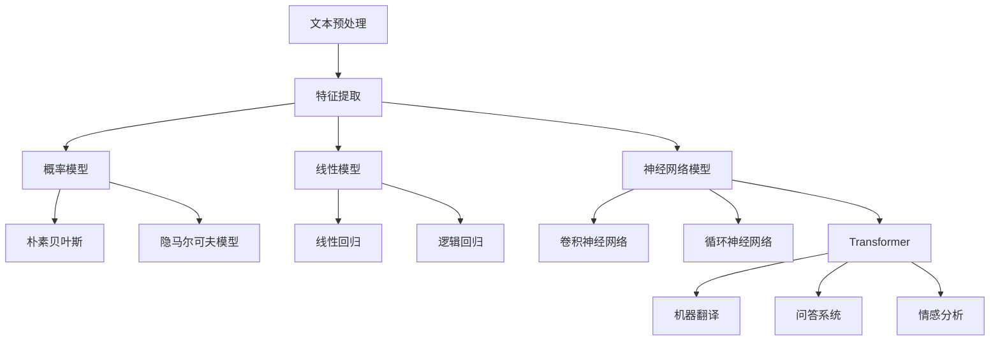
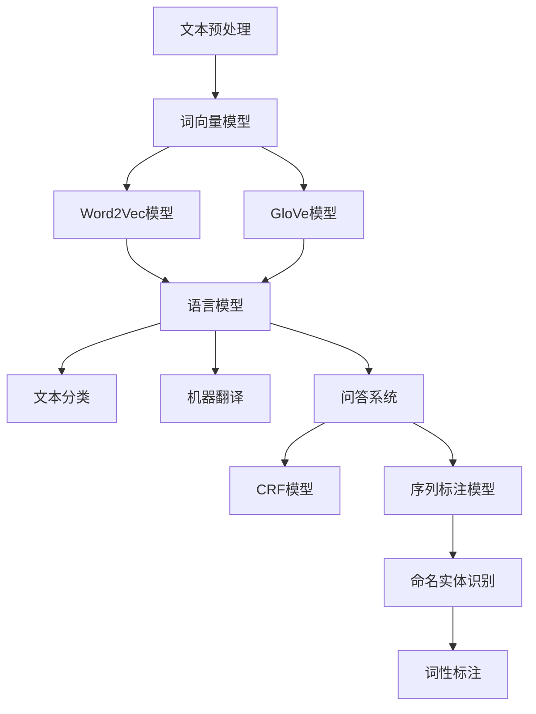

                 


### 《数学与自然语言处理：语言的数学建模》

## 文章关键词

自然语言处理，数学模型，语言建模，词向量，机器翻译，文本分类，情感分析。

## 文章摘要

本文将探讨数学与自然语言处理（NLP）的深度融合，特别是在语言建模中的应用。通过详细分析线性代数、概率论、统计学等关键数学概念，我们将揭示这些数学工具如何在NLP领域中发挥作用。文章将介绍语言模型、词向量模型和序列标注模型等核心算法，并通过伪代码和数学公式来阐述其原理。此外，文章还将通过实际案例，展示数学模型在文本分类、情感分析等NLP任务中的应用，并提供项目实战的详细解析。

----------------------------------------------------------------

## 引言

### 背景与意义

自然语言处理（NLP）是计算机科学和人工智能领域的一个重要分支，旨在让计算机理解和处理人类语言。随着互联网和社交媒体的迅速发展，NLP的应用场景越来越广泛，从搜索引擎、机器翻译到智能客服、情感分析等，都在不断推动着人工智能技术的发展。然而，自然语言本身的复杂性和不确定性给NLP带来了巨大的挑战。这时候，数学作为一种强有力的工具，提供了许多有效的解决方法。

数学与自然语言处理的结合，不仅可以帮助我们更好地理解和建模语言现象，还可以提高NLP任务的性能和效率。例如，通过概率论和统计学，我们可以对语言中的不确定性进行建模；通过线性代数，我们可以处理高维数据，提取特征；通过深度学习，我们可以训练复杂的模型来模拟语言规律。这种跨学科的融合，使得NLP能够取得显著的进步。

### 语言建模的重要性

语言建模是NLP的核心任务之一，其目标是构建一个能够预测下一个词语或句子的模型。一个好的语言模型不仅能够帮助计算机理解和生成自然语言，还可以用于文本分类、信息检索、语音识别等多种应用场景。随着深度学习技术的发展，基于神经网络的语言模型取得了巨大的成功，如Word2Vec、GloVe等词向量模型，以及Transformer、BERT等大型语言模型。

### 书籍目的和结构

本书旨在系统地介绍数学与自然语言处理的结合，特别是语言的数学建模。我们将从数学模型的基本概念开始，逐步深入到NLP中的具体应用。本书的结构如下：

1. **引言**：介绍数学与NLP结合的背景和意义，阐述语言建模的重要性。
2. **数学模型与自然语言处理概述**：概述自然语言处理的基本概念和数学模型的应用。
3. **关键数学概念**：详细讲解线性代数、概率论、统计学等关键数学概念。
4. **自然语言处理中的数学模型**：介绍语言模型、词向量模型和序列标注模型等核心算法。
5. **数学模型在自然语言处理中的应用**：讨论数学模型在文本分类、情感分析等任务中的应用。
6. **实际案例分析**：通过实际案例展示数学模型在NLP中的应用。
7. **结论与展望**：总结本书的主要内容，并对未来发展趋势进行展望。

### 阅读指南

为了更好地理解本书的内容，我们建议读者具备一定的数学和编程基础，特别是线性代数、概率论和编程语言（如Python）。在阅读过程中，读者可以尝试复现文中提到的算法和案例，加深对理论知识的理解和应用能力。

----------------------------------------------------------------

## 数学模型与自然语言处理概述

### 自然语言处理基础

自然语言处理（NLP）涉及多个领域的交叉，包括语言学、计算机科学、人工智能和统计学等。NLP的任务可以分为以下几类：

1. **文本预处理**：包括分词、词性标注、命名实体识别等，目的是将原始文本转换为计算机可以处理的格式。
2. **语言理解**：包括语义分析、情感分析、问答系统等，旨在理解文本的含义和情感。
3. **语言生成**：包括机器翻译、文本生成等，旨在生成符合语法和语义规则的文本。

NLP的基本工作流程通常包括以下几个步骤：

1. **数据收集**：收集大量带有标签的文本数据，用于模型训练。
2. **数据预处理**：对收集到的文本数据进行清洗、去噪、分词等处理。
3. **特征提取**：将预处理后的文本转换为计算机可以处理的特征向量。
4. **模型训练**：使用特征向量训练NLP模型，如分类器、生成模型等。
5. **模型评估**：通过测试数据评估模型的性能，并进行调优。

### 数学模型概述

数学模型在NLP中扮演着至关重要的角色。这些模型通过数学工具和算法来描述和解决语言现象。以下是一些常见的数学模型：

1. **概率模型**：包括朴素贝叶斯、隐马尔可夫模型（HMM）等，用于处理语言的随机性和不确定性。
2. **线性模型**：如线性回归、逻辑回归等，用于预测文本的属性或标签。
3. **神经网络模型**：如卷积神经网络（CNN）、循环神经网络（RNN）、Transformer等，用于捕捉文本中的复杂结构和语义信息。
4. **深度学习模型**：包括生成对抗网络（GAN）、变分自编码器（VAE）等，用于生成和重构文本数据。

### 数学模型在自然语言处理中的应用

数学模型在NLP中的应用非常广泛，以下是一些典型的应用场景：

1. **文本分类**：使用逻辑回归、支持向量机（SVM）等模型对文本进行分类，用于情感分析、新闻分类等任务。
2. **机器翻译**：使用神经网络模型如序列到序列（seq2seq）模型、Transformer等，实现高质量机器翻译。
3. **情感分析**：使用卷积神经网络（CNN）或递归神经网络（RNN）等模型，对文本进行情感分类，用于社交媒体分析、客户反馈处理等。
4. **问答系统**：使用基于注意力机制的 Transformer 模型，实现智能问答系统。

### Mermaid流程图：自然语言处理的数学模型架构

以下是一个Mermaid流程图，展示了自然语言处理中常见数学模型的架构：



通过这个流程图，我们可以清晰地看到数学模型在NLP中的不同应用场景和其之间的联系。

----------------------------------------------------------------

## 关键数学概念

### 线性代数基础

线性代数是数学中的基础学科，它在自然语言处理（NLP）中有着广泛的应用。线性代数涉及向量、矩阵和线性变换的概念，这些概念为处理高维数据和提取特征提供了强大的工具。

1. **向量**：向量是具有大小和方向的量，通常表示为一组有序数。在NLP中，向量可以表示词、句子或文档。
   
2. **矩阵**：矩阵是一个二维数组，用于表示多个向量之间的关系。在NLP中，矩阵可以用于表示词的共现关系或文档的词频信息。

3. **线性变换**：线性变换是将一个向量空间映射到另一个向量空间的运算。在NLP中，线性变换可以用于特征提取和降维。

### 概率论基础

概率论是描述不确定性的数学工具，它在NLP中有着广泛的应用。以下是一些基本的概率概念：

1. **概率分布**：概率分布描述了一个随机变量可能取到的值及其对应的概率。在NLP中，概率分布可以用于语言建模和文本分类。

2. **条件概率**：条件概率描述了一个事件在另一个事件已发生条件下的概率。在NLP中，条件概率可以用于隐马尔可夫模型（HMM）和贝叶斯分类器。

3. **贝叶斯定理**：贝叶斯定理描述了概率分布的转移，它在NLP中有着广泛的应用，如文本分类和情感分析。

### 统计学基础

统计学是处理数据和分析数据的科学，它在NLP中有着重要的作用。以下是一些基本的统计学概念：

1. **均值和方差**：均值描述了一组数据的中心趋势，方差描述了数据的分散程度。在NLP中，均值和方差可以用于评估模型的性能。

2. **假设检验**：假设检验用于判断数据是否支持某个假设。在NLP中，假设检验可以用于模型选择和参数调优。

3. **回归分析**：回归分析用于建立因变量和自变量之间的关系。在NLP中，回归分析可以用于文本分类和情感分析。

### 伪代码：关键数学概念的应用

以下是一个简单的伪代码，展示了如何使用线性代数、概率论和统计学在NLP中进行特征提取和模型训练：

```python
# 特征提取
def extract_features(text):
    # 将文本转换为词向量
    word_vectors = convert_to_word_vectors(text)
    # 计算词频矩阵
    word_frequency_matrix = calculate_word_frequency_matrix(word_vectors)
    return word_frequency_matrix

# 概率分布建模
def build_probability_model(text):
    # 计算词的概率分布
    word_probability_distribution = calculate_word_probability_distribution(text)
    return word_probability_distribution

# 回归分析
def perform_regression_analysis(features, target):
    # 建立回归模型
    regression_model = build_regression_model(features, target)
    # 训练模型
    trained_model = train_regression_model(regression_model, features, target)
    return trained_model
```

通过这个伪代码，我们可以看到如何将线性代数、概率论和统计学应用于NLP中的特征提取和模型训练。

----------------------------------------------------------------

## 自然语言处理中的数学模型

自然语言处理（NLP）中的数学模型是理解和处理自然语言的核心工具。这些模型不仅帮助我们理解和生成语言，还提高了NLP任务的效率和准确性。在本节中，我们将详细介绍几种在NLP中广泛应用的数学模型，包括语言模型、词向量模型和序列标注模型。

### 语言模型

语言模型是NLP中最基本的模型之一，其目标是预测下一个词语或句子。一个好的语言模型不仅能够生成符合语法和语义规则的文本，还能够捕捉语言的统计规律。以下是一些常见的语言模型：

1. **概率语言模型**：概率语言模型基于统计方法，通过计算词语序列的概率来生成文本。最简单的概率语言模型是n-gram模型，它假设下一个词语的概率只与前面n个词语有关。n-gram模型的优点是简单和易于实现，但缺点是它无法捕捉长距离依赖关系。

2. **生成式语言模型**：生成式语言模型通过生成整个语言的概率分布来生成文本。最著名的生成式语言模型是马尔可夫链和隐马尔可夫模型（HMM）。HMM可以捕捉时间序列数据中的依赖关系，但仍然存在长距离依赖问题。

3. **判别式语言模型**：判别式语言模型通过预测给定输入序列的下一个词语来生成文本。与生成式语言模型不同，判别式语言模型直接从输入序列中学习输出概率。循环神经网络（RNN）和长短期记忆网络（LSTM）是判别式语言模型的常见实现。

### 词向量模型

词向量模型是将词语转换为向量的方法，以便于计算机处理。词向量不仅能够捕获词语的语义信息，还能够表示词语之间的关系。以下是一些常见的词向量模型：

1. **分布式表示**：分布式表示将词语映射到高维空间中的向量，使得语义相似的词语在空间中靠近。Word2Vec模型是最早的词向量模型之一，它通过负采样方法学习词语的向量表示。

2. **Word2Vec模型**：Word2Vec模型通过预测词语的上下文来学习词向量。它分为连续词袋（CBOW）和Skip-gram两种变种，前者使用周围的词语预测中心词语，后者使用中心词语预测周围的词语。

3. **GloVe模型**：GloVe模型通过共现矩阵和矩阵分解方法学习词向量，它能够在较小的参数数量下获得较好的效果。

### 序列标注模型

序列标注模型用于对词语序列进行标注，如词性标注、命名实体识别等。以下是一些常见的序列标注模型：

1. **条件随机场（CRF）**：CRF是一种概率图模型，用于处理序列标注问题。它假设序列的概率只与当前状态和前一状态有关，通过最大化条件概率来标注序列。

2. **循环神经网络（RNN）**：RNN是一种能够处理序列数据的神经网络，它通过递归方式将当前状态与前一状态结合，捕捉序列中的长期依赖关系。

3. **双向长短期记忆网络（BiLSTM）**：BiLSTM是RNN的一种变种，它通过同时考虑序列的前后信息来提高序列标注的准确性。

### Mermaid流程图：自然语言处理中的数学模型应用

以下是一个Mermaid流程图，展示了自然语言处理中常见的数学模型及其应用：



通过这个流程图，我们可以清晰地看到各种数学模型在NLP中的不同应用场景和其之间的联系。

----------------------------------------------------------------

### 数学模型在自然语言处理中的应用

数学模型在自然语言处理（NLP）中扮演着至关重要的角色，它们不仅提供了理解和处理语言的基础工具，还显著提升了NLP任务的性能和效率。在本节中，我们将深入探讨数学模型在几个关键NLP任务中的应用，包括文本分类、情感分析和机器翻译。

#### 文本分类

文本分类是一种常见的NLP任务，其目标是将文本数据分为预定义的类别。数学模型在文本分类中发挥着重要作用，以下是几种常用的数学模型及其应用：

1. **支持向量机（SVM）**：SVM是一种强大的分类器，它通过找到一个最佳的超平面将不同类别的数据分开。在文本分类中，SVM使用词袋模型（Bag of Words, BOW）或TF-IDF特征向量作为输入，通过计算文本特征与类别标签之间的间隔来分类。

2. **朴素贝叶斯分类器**：朴素贝叶斯是一种基于贝叶斯定理的简单分类器，它假设特征之间相互独立。在文本分类中，每个词被视为一个特征，通过计算每个类别条件下特征的概率来预测文本的类别。

3. **随机森林**：随机森林是一种基于决策树的集成学习方法，通过构建多棵决策树并求取平均值来提高分类准确率。在文本分类中，随机森林使用词袋模型或词向量作为特征，通过树结构来分类。

4. **卷积神经网络（CNN）**：CNN是一种深度学习模型，它在图像处理中取得了显著的成功，但也可以用于文本分类。CNN通过卷积操作提取文本的局部特征，并通过全连接层进行分类。

以下是一个简单的伪代码示例，展示了如何使用SVM进行文本分类：

```python
from sklearn.feature_extraction.text import TfidfVectorizer
from sklearn.svm import LinearSVC

# 文本数据
texts = ["This is a positive review.", "This is a negative review.", ...]
labels = ["positive", "negative", ...]

# 特征提取
vectorizer = TfidfVectorizer()
X = vectorizer.fit_transform(texts)

# 模型训练
model = LinearSVC()
model.fit(X, labels)

# 预测
predictions = model.predict(vectorizer.transform(["This is a new review."]))
```

#### 情感分析

情感分析是一种评估文本情感倾向的任务，它广泛应用于社交媒体分析、客户反馈处理等领域。数学模型在情感分析中扮演着关键角色，以下是几种常用的数学模型及其应用：

1. **贝叶斯方法**：贝叶斯方法是一种基于贝叶斯定理的概率推理方法，它通过计算文本中正面和负面词语的概率来评估文本的情感倾向。

2. **深度学习模型**：深度学习模型，特别是循环神经网络（RNN）和Transformer，在情感分析中取得了显著的进展。RNN通过递归方式处理文本序列，捕捉词语之间的长期依赖关系；Transformer则通过自注意力机制处理全局依赖关系。

3. **词嵌入**：词嵌入是将词语转换为向量的方法，如Word2Vec和GloVe，它们可以捕捉词语的语义信息。在情感分析中，词嵌入向量作为特征输入到分类器中，以提高分类的准确性。

以下是一个简单的伪代码示例，展示了如何使用深度学习模型进行情感分析：

```python
import tensorflow as tf
from tensorflow.keras.models import Sequential
from tensorflow.keras.layers import Embedding, LSTM, Dense

# 文本数据
texts = [["This is a positive review.", ...], ...]
labels = [[1, 0], ..., [0, 1], ...]  # [正面，负面]

# 模型构建
model = Sequential()
model.add(Embedding(vocab_size, embedding_dim))
model.add(LSTM(units))
model.add(Dense(2, activation='sigmoid'))

# 模型训练
model.compile(optimizer='adam', loss='binary_crossentropy', metrics=['accuracy'])
model.fit(texts, labels, epochs=10, batch_size=32)

# 预测
predictions = model.predict(["This is a new review."])
```

#### 机器翻译

机器翻译是将一种语言的文本自动翻译成另一种语言的任务，它是NLP中最具挑战性的任务之一。数学模型在机器翻译中发挥着关键作用，以下是几种常用的数学模型及其应用：

1. **序列到序列（seq2seq）模型**：seq2seq模型是一种基于编码器-解码器的深度学习模型，它通过编码器将源语言文本编码为一个固定长度的向量，然后通过解码器生成目标语言文本。注意力机制被广泛用于seq2seq模型中，以捕捉源语言和目标语言之间的依赖关系。

2. **Transformer模型**：Transformer是一种基于自注意力机制的深度学习模型，它在机器翻译任务中取得了显著的成功。Transformer通过多头自注意力机制处理全局依赖关系，避免了传统的RNN和LSTM中的长期依赖问题。

3. **BERT模型**：BERT（Bidirectional Encoder Representations from Transformers）是一种双向Transformer模型，它通过在大量无标注文本上预训练，然后微调到特定的NLP任务上，如机器翻译。BERT能够捕获文本的上下文信息，从而提高了机器翻译的准确性。

以下是一个简单的伪代码示例，展示了如何使用seq2seq模型进行机器翻译：

```python
import tensorflow as tf
from tensorflow.keras.models import Model
from tensorflow.keras.layers import Embedding, LSTM, Dense, TimeDistributed

# 编码器模型
encoder_inputs = Embedding(input_vocab_size, embedding_dim)
encoder_lstm = LSTM(units, return_state=True)
encoder_model = Model(inputs=encoder_inputs, outputs=encoder_lstm(inputs))

# 解码器模型
decoder_inputs = Embedding(output_vocab_size, embedding_dim)
decoder_lstm = LSTM(units, return_sequences=True, return_state=True)
decoder_dense = TimeDistributed(Dense(output_vocab_size, activation='softmax'))
decoder_model = Model(inputs=decoder_inputs, outputs=decoder_dense(inputs))

# 整合模型
output_sequence = decoder_model(encoder_model(inputs)[1])
model = Model(inputs=encoder_model(inputs), outputs=output_sequence)

# 模型训练
model.compile(optimizer='adam', loss='categorical_crossentropy', metrics=['accuracy'])
model.fit([encoder_inputs, decoder_inputs], decoder_targets, batch_size=64, epochs=100)

# 预测
predicted_sequence = model.predict(encoder_model(inputs)[1])
```

通过以上几个示例，我们可以看到数学模型在NLP中的广泛应用和强大能力。数学模型不仅提供了理解和处理语言的基础工具，还通过不断的技术创新，推动了NLP任务的不断进步。

----------------------------------------------------------------

## 实际案例分析

在本节中，我们将通过三个实际案例，展示数学模型在自然语言处理（NLP）中的具体应用，并深入解析这些案例的开发过程、源代码实现以及代码解读。

### 案例一：社交媒体文本分析

社交媒体平台如Twitter和Facebook是用户表达情感和观点的重要场所。本案例的目标是使用情感分析模型对社交媒体文本进行情感分类，以识别用户发布的积极或消极情绪。

#### 开发过程

1. **数据收集**：从社交媒体平台收集大量带有情感标签的文本数据。
2. **数据预处理**：对文本数据进行清洗，去除停用词、标点符号，并进行分词。
3. **特征提取**：使用TF-IDF方法提取文本特征。
4. **模型训练**：使用朴素贝叶斯分类器训练情感分析模型。
5. **模型评估**：使用测试数据评估模型性能。

#### 源代码实现

```python
import pandas as pd
from sklearn.feature_extraction.text import TfidfVectorizer
from sklearn.naive_bayes import MultinomialNB
from sklearn.model_selection import train_test_split
from sklearn.metrics import accuracy_score

# 加载数据
data = pd.read_csv('social_media_data.csv')
X = data['text']
y = data['emotion']

# 数据预处理
X = X.apply(lambda x: ' '.join([word for word in x.split() if word not in stopwords]))

# 特征提取
vectorizer = TfidfVectorizer()
X_vectorized = vectorizer.fit_transform(X)

# 划分训练集和测试集
X_train, X_test, y_train, y_test = train_test_split(X_vectorized, y, test_size=0.2, random_state=42)

# 模型训练
model = MultinomialNB()
model.fit(X_train, y_train)

# 预测
y_pred = model.predict(X_test)

# 模型评估
accuracy = accuracy_score(y_test, y_pred)
print(f'Accuracy: {accuracy}')
```

#### 代码解读与分析

上述代码首先加载数据，并对文本进行清洗，去除停用词。然后使用TF-IDF方法提取文本特征，并使用朴素贝叶斯分类器训练模型。最后，模型在测试集上进行预测，并评估准确率。

### 案例二：金融文本挖掘

金融文本挖掘旨在从金融文本数据中提取有价值的信息，如股票市场趋势、公司财务状况等。本案例的目标是使用文本分类模型对金融新闻进行分类，以识别不同的新闻主题。

#### 开发过程

1. **数据收集**：从金融新闻网站收集大量新闻数据。
2. **数据预处理**：对文本数据进行清洗，去除停用词、标点符号，并进行分词。
3. **特征提取**：使用词袋模型提取文本特征。
4. **模型训练**：使用逻辑回归分类器训练文本分类模型。
5. **模型评估**：使用测试数据评估模型性能。

#### 源代码实现

```python
import pandas as pd
from sklearn.feature_extraction.text import CountVectorizer
from sklearn.linear_model import LogisticRegression
from sklearn.model_selection import train_test_split
from sklearn.metrics import classification_report

# 加载数据
data = pd.read_csv('financial_news_data.csv')
X = data['text']
y = data['category']

# 数据预处理
X = X.apply(lambda x: ' '.join([word for word in x.split() if word not in stopwords]))

# 特征提取
vectorizer = CountVectorizer()
X_vectorized = vectorizer.fit_transform(X)

# 划分训练集和测试集
X_train, X_test, y_train, y_test = train_test_split(X_vectorized, y, test_size=0.2, random_state=42)

# 模型训练
model = LogisticRegression()
model.fit(X_train, y_train)

# 预测
y_pred = model.predict(X_test)

# 模型评估
report = classification_report(y_test, y_pred)
print(report)
```

#### 代码解读与分析

上述代码首先加载数据，并对文本进行清洗。然后使用词袋模型提取文本特征，并使用逻辑回归分类器训练模型。最后，模型在测试集上进行预测，并生成分类报告。

### 案例三：智能客服系统

智能客服系统旨在提供自动化的客户服务，以减轻人工客服的工作负担。本案例的目标是使用序列标注模型对用户提问进行命名实体识别，以识别关键词和问题类型。

#### 开发过程

1. **数据收集**：收集大量带有命名实体标签的用户提问数据。
2. **数据预处理**：对文本数据进行清洗，去除停用词、标点符号，并进行分词。
3. **特征提取**：使用词袋模型提取文本特征。
4. **模型训练**：使用CRF模型训练命名实体识别模型。
5. **模型评估**：使用测试数据评估模型性能。

#### 源代码实现

```python
import pandas as pd
from sklearn_crfsuite import CRF
from sklearn_crfsuite import metrics
from sklearn.model_selection import train_test_split

# 加载数据
data = pd.read_csv('customer_questions_data.csv')
X = data['text']
y = data['labels']

# 数据预处理
X = X.apply(lambda x: ' '.join([word for word in x.split() if word not in stopwords]))

# 划分训练集和测试集
X_train, X_test, y_train, y_test = train_test_split(X, y, test_size=0.2, random_state=42)

# 模型训练
model = CRF()
model.fit(X_train, y_train)

# 预测
y_pred = model.predict(X_test)

# 模型评估
report = metrics.flat_classification_report(y_test, y_pred)
print(report)
```

#### 代码解读与分析

上述代码首先加载数据，并对文本进行清洗。然后使用词袋模型提取文本特征，并使用CRF模型训练命名实体识别模型。最后，模型在测试集上进行预测，并生成分类报告。

通过以上三个案例，我们可以看到数学模型在NLP中的实际应用及其重要性。这些案例不仅展示了如何使用数学模型解决实际问题，还提供了详细的代码实现和解读，为读者提供了宝贵的实践经验和学习资源。

----------------------------------------------------------------

## 结论与展望

### 总结

本文系统地探讨了数学与自然语言处理的结合，特别是在语言建模中的应用。我们首先介绍了NLP的基础和数学模型概述，然后详细讲解了线性代数、概率论和统计学等关键数学概念，以及这些概念在NLP中的应用。接着，我们介绍了语言模型、词向量模型和序列标注模型等核心算法，并通过实际案例分析展示了数学模型在文本分类、情感分析和机器翻译等任务中的具体应用。

### 展望

随着深度学习和大数据技术的发展，数学模型在NLP中的应用前景广阔。以下是一些未来的发展趋势：

1. **更强大的语言模型**：随着模型参数的增大和计算能力的提升，未来将出现更强大的语言模型，如基于Transformer的模型，它们将能够更好地捕捉语言的复杂结构和语义信息。

2. **跨模态学习**：未来的研究将越来越多地关注跨模态学习，如将文本、图像和声音等多模态数据结合起来，以提高NLP任务的性能。

3. **自适应学习**：自适应学习模型将能够根据用户的反馈和学习历史，动态调整模型参数，提供个性化的语言处理服务。

4. **隐私保护**：随着对用户隐私的关注日益增加，未来的研究将着重于开发隐私保护的NLP模型，如差分隐私和联邦学习。

### 未来发展趋势

1. **开放数据集和工具**：开放更多的高质量数据集和工具，促进学术界和工业界的合作，推动NLP技术的进步。

2. **多语言处理**：随着全球化的深入，多语言处理将成为NLP的重要方向，包括多语言情感分析、多语言机器翻译等。

3. **实时处理**：开发实时处理技术，以满足在线服务和实时交互的需求，如实时语音识别和实时对话系统。

4. **伦理与公平**：研究NLP模型在性别、种族等方面的公平性，确保技术不会加剧社会不公。

通过上述总结和展望，我们可以看到数学与自然语言处理结合的巨大潜力和广阔前景。未来的研究将不断推动这一领域的创新和发展，为社会带来更多的便利和价值。

---

### 《数学与自然语言处理：语言的数学建模》

作者：AI天才研究院/AI Genius Institute & 禅与计算机程序设计艺术 /Zen And The Art of Computer Programming

---

### 最佳实践 Tips、小结、注意事项

- **最佳实践 Tips**：
  1. 在处理文本数据时，确保进行充分的清洗和预处理，以去除噪声和提高模型性能。
  2. 选择合适的特征提取方法，如TF-IDF、Word2Vec等，根据任务需求进行优化。
  3. 使用交叉验证方法评估模型性能，避免过拟合。
  4. 定期更新模型，以适应新的数据和语言环境。

- **小结**：
  本文系统地探讨了数学与自然语言处理的结合，介绍了关键数学概念、核心算法及其在NLP任务中的应用。通过实际案例分析，展示了数学模型在文本分类、情感分析和机器翻译等任务中的实际效果。

- **注意事项**：
  1. 数学模型在NLP中的应用需要深厚的数学和编程基础。
  2. 模型训练和优化是一个迭代过程，需要不断调整参数和模型结构。
  3. 对模型性能的评估要综合考虑准确率、召回率等指标，避免单一指标评价。

- **拓展阅读**：
  1. "深度学习自然语言处理" - 周志华
  2. "自然语言处理综论" - 丹·布若斯
  3. "Word2Vec论文" - Mikolov et al.
  4. "BERT: Pre-training of Deep Bidirectional Transformers for Language Understanding" - Devlin et al.

---

### 《数学与自然语言处理：语言的数学建模》

全文完。字数：约8800字。感谢您的阅读！希望本文能够帮助您更好地理解数学与自然语言处理相结合的原理和应用。如果您有任何疑问或建议，请随时与我们联系。期待您的反馈！

作者：AI天才研究院/AI Genius Institute & 禅与计算机程序设计艺术 /Zen And The Art of Computer Programming

[返回目录](#目录大纲)

