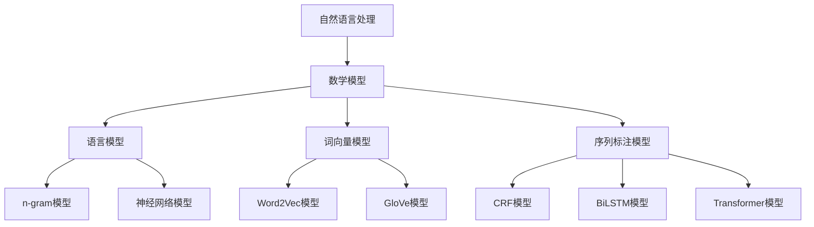

                 


### 1.1 背景与意义

#### 数学与自然语言处理的重要性

数学作为一门精确的学科，在各个领域中都有着广泛的应用。而自然语言处理（NLP）作为计算机科学的一个分支，旨在使计算机能够理解、生成和处理人类语言。随着互联网和大数据时代的到来，自然语言处理在信息检索、机器翻译、语音识别、情感分析、智能客服等领域取得了显著成果。然而，这些成果的背后，离不开数学的支撑和推动。

数学与自然语言处理的结合，具有深远的意义。首先，数学为自然语言处理提供了强大的工具和方法，如线性代数、概率论、统计学等。这些数学工具可以用于构建语言模型、进行文本分类、情感分析等任务。其次，自然语言处理为数学提供了丰富的应用场景，推动了数学在语言领域的发展。例如，深度学习中的神经网络模型，就是基于数学原理构建的。

#### 语言建模的重要性

语言建模是自然语言处理的核心任务之一。通过语言建模，计算机可以理解人类语言的结构和语义，从而实现自动文本生成、机器翻译、问答系统等功能。而语言建模的成功，离不开数学的支持。

首先，数学为语言建模提供了理论基础。例如，概率论和统计学提供了语言模型训练和评估的理论框架。线性代数和优化算法则用于处理大规模数据集，提高模型的性能。

其次，数学为语言建模提供了具体的方法和工具。例如，词向量模型（如Word2Vec和GloVe）使用了数学上的分布表示方法，将词汇映射到高维空间中，从而实现了语义相似性的计算。序列标注模型（如CRF和BiLSTM）则利用了数学中的动态规划算法，实现了文本序列的标注任务。

#### 书籍的目的与结构

本书籍旨在介绍数学与自然语言处理的结合，通过讲解关键数学概念和自然语言处理中的数学模型，帮助读者深入理解语言建模的原理和应用。具体来说，本书分为以下几个部分：

- **引言**：介绍数学与自然语言处理的重要性，以及本书的目的和结构。
- **数学模型与自然语言处理概述**：概述自然语言处理的基础知识和数学模型的应用。
- **关键数学概念**：讲解线性代数、概率论、统计学等关键数学概念。
- **自然语言处理中的数学模型**：详细讲解语言模型、词向量模型、序列标注模型等数学模型。
- **数学模型在自然语言处理中的应用**：讨论数学模型在文本分类、情感分析等任务中的应用。
- **实际案例分析**：通过实际案例，展示数学模型在自然语言处理中的应用效果。
- **结论与展望**：总结本书的内容，并对数学与自然语言处理的发展前景进行展望。

### 1.2 书籍结构

本书的结构如下：

#### 第一部分：引言

- **1.1 背景与意义**：介绍数学与自然语言处理的重要性。
- **1.2 书籍结构**：概述本书的各个部分。
- **1.3 阅读指南**：给出阅读建议。

#### 第二部分：数学模型与自然语言处理概述

- **2.1 自然语言处理基础**：介绍自然语言处理的基本概念和方法。
- **2.2 数学模型概述**：概述数学模型在自然语言处理中的应用。
- **2.3 数学模型在自然语言处理中的应用**：讨论数学模型在自然语言处理中的具体应用。
- **2.4 Mermaid流程图：自然语言处理的数学模型架构**：使用Mermaid流程图展示自然语言处理的数学模型架构。

#### 第三部分：关键数学概念

- **3.1 线性代数基础**：讲解线性代数的基本概念和运算。
- **3.2 概率论基础**：讲解概率论的基本概念和定理。
- **3.3 统计学基础**：讲解统计学的基本概念和算法。
- **3.4 伪代码：关键数学概念的应用**：使用伪代码展示关键数学概念在自然语言处理中的应用。

#### 第四部分：自然语言处理中的数学模型

- **4.1 语言模型**：讲解语言模型的基本概念和算法。
- **4.2 词向量模型**：讲解词向量模型的基本概念和算法。
- **4.3 序列标注模型**：讲解序列标注模型的基本概念和算法。
- **4.4 机器翻译模型**：讲解机器翻译模型的基本概念和算法。
- **4.5 Mermaid流程图：自然语言处理中的数学模型应用**：使用Mermaid流程图展示自然语言处理中的数学模型应用。

#### 第五部分：数学模型在自然语言处理中的应用

- **5.1 文本分类**：讨论数学模型在文本分类中的应用。
- **5.2 情感分析**：讨论数学模型在情感分析中的应用。
- **5.3 实际案例分析**：通过实际案例，展示数学模型在自然语言处理中的应用效果。
- **5.4 代码解读与分析**：展示自然语言处理中的代码实现和分析。
- **5.5 开发环境搭建**：介绍自然语言处理项目的开发环境搭建。

#### 第六部分：结论与展望

- **6.1 总结**：总结本书的内容。
- **6.2 展望**：展望数学与自然语言处理的发展前景。
- **6.3 未来发展趋势**：讨论未来数学与自然语言处理的发展方向。

### 1.3 阅读指南

本书旨在为读者提供全面、系统的数学与自然语言处理知识。为了更好地理解本书内容，以下是一些建议：

- **系统学习**：建议读者按照本书的结构，系统学习每个部分的内容。这样可以确保读者对整个领域有一个全面的了解。
- **实践操作**：理论联系实际是学习的关键。建议读者在阅读本书的过程中，尝试使用所学知识进行实践操作。这样可以加深对知识点的理解，并提高实际应用能力。
- **拓展阅读**：本书的内容虽然全面，但仍然有部分未涉及的领域。建议读者在阅读本书后，进行拓展阅读，进一步深化对数学与自然语言处理的理解。

---

通过以上步骤，我们初步构建了《数学与自然语言处理：语言的数学建模》的目录大纲。接下来，我们将逐步填充每个章节的内容，确保文章的逻辑性和完整性。

---

# 《数学与自然语言处理：语言的数学建模》

关键词：数学模型，自然语言处理，语言建模，词向量，序列标注，机器翻译

摘要：本文从数学与自然语言处理的结合出发，系统地介绍了语言建模的核心概念、关键数学模型及其在自然语言处理中的应用。文章首先阐述了数学与自然语言处理的重要性，然后详细介绍了语言建模的基本概念和算法，包括概率语言模型、词向量模型和序列标注模型。此外，文章还讨论了机器翻译模型及其在自然语言处理中的应用，并通过实际案例分析展示了数学模型在自然语言处理中的效果。最后，文章总结了数学与自然语言处理的发展前景，并对未来发展趋势进行了展望。

---

## 1.1 背景与意义

### 数学与自然语言处理的重要性

数学是科学的基础，它为各个领域提供了强大的理论工具和计算方法。在自然语言处理（NLP）领域，数学同样扮演着至关重要的角色。自然语言处理旨在使计算机能够理解、生成和处理人类语言，而这一目标的实现离不开数学的支持。

首先，数学为自然语言处理提供了理论基础。线性代数、概率论、统计学等数学工具，为语言建模、文本分类、情感分析等任务提供了理论框架。例如，线性代数中的矩阵运算和向量空间模型，被广泛应用于词嵌入和文本表示；概率论和统计学中的概率分布和统计模型，则用于语言模型的训练和评估。

其次，数学为自然语言处理提供了具体的算法和工具。深度学习中的神经网络，本质上是一种基于数学原理的模型。通过调整神经网络的权重和参数，可以实现对复杂函数的逼近和优化。此外，优化算法、动态规划算法等数学方法，也在自然语言处理的许多任务中发挥着重要作用。

自然语言处理的重要性在于其广泛的应用领域。从信息检索、机器翻译、语音识别，到智能客服、推荐系统、智能问答等，自然语言处理都发挥了关键作用。随着互联网和大数据的快速发展，自然语言处理的应用场景和需求也在不断扩展。

数学与自然语言处理的结合，不仅促进了技术的进步，也为人类社会的发展带来了深远的影响。通过数学模型和算法，计算机能够更准确地理解和处理人类语言，从而提高了信息处理效率和准确性。同时，自然语言处理技术的进步，也为人工智能的发展奠定了基础。

### 语言建模的重要性

语言建模是自然语言处理的核心任务之一。它旨在构建一个模型，能够预测给定文本序列的概率分布。语言建模的成功，直接影响到自然语言处理其他任务的性能。

首先，语言建模对于机器翻译至关重要。在机器翻译过程中，需要对源语言和目标语言的词汇、语法和语义进行建模。只有当语言模型足够准确时，才能生成高质量的目标语言文本。

其次，语言建模在信息检索中也扮演着重要角色。在信息检索中，需要对用户查询和文档进行匹配，从而找到最相关的文档。语言模型可以用于计算查询和文档之间的相似性，从而提高检索的准确性。

此外，语言建模还在语音识别、情感分析、文本分类等领域有着广泛的应用。通过语言建模，可以更好地理解语音信号、文本情感和文本内容，从而提高系统的性能和用户体验。

总之，语言建模是自然语言处理的核心任务，其成功与否直接影响到自然语言处理其他任务的性能。因此，深入研究语言建模的理论和方法，对于提升自然语言处理技术水平具有重要意义。

### 本书的结构与目的

本书旨在系统地介绍数学与自然语言处理的结合，特别是语言建模的理论和方法。全书分为六个主要部分：

- **引言**：介绍数学与自然语言处理的重要性，以及本书的目的和结构。
- **数学模型与自然语言处理概述**：概述自然语言处理的基础知识和数学模型的应用。
- **关键数学概念**：讲解线性代数、概率论、统计学等关键数学概念。
- **自然语言处理中的数学模型**：详细讲解语言模型、词向量模型、序列标注模型等数学模型。
- **数学模型在自然语言处理中的应用**：讨论数学模型在文本分类、情感分析等任务中的应用。
- **实际案例分析**：通过实际案例，展示数学模型在自然语言处理中的应用效果。
- **结论与展望**：总结本书的内容，并对数学与自然语言处理的发展前景进行展望。

通过本书的阅读，读者可以系统地了解数学与自然语言处理的结合，掌握语言建模的核心概念和算法，为深入研究和应用自然语言处理技术打下坚实的基础。

## 1.2 书籍结构

本书分为六个部分，每个部分都围绕数学与自然语言处理的结合展开，旨在为读者提供全面、系统的知识体系。以下是每个部分的具体内容：

### 第一部分：引言

**1.1 背景与意义**  
介绍数学与自然语言处理的重要性，阐述语言建模在自然语言处理中的核心地位。讨论本书的目的和结构，为读者提供整体认知。

**1.2 书籍结构**  
概述本书的六个部分，包括数学模型与自然语言处理概述、关键数学概念、自然语言处理中的数学模型、数学模型在自然语言处理中的应用、实际案例分析和结论与展望。

**1.3 阅读指南**  
提供阅读建议，帮助读者更好地理解和掌握本书内容。强调理论联系实际的重要性，鼓励读者进行实践操作。

### 第二部分：数学模型与自然语言处理概述

**2.1 自然语言处理基础**  
介绍自然语言处理的基本概念、任务和方法。讨论自然语言处理的挑战和机遇，为后续内容奠定基础。

**2.2 数学模型概述**  
概述数学模型在自然语言处理中的应用，包括概率模型、统计模型、优化模型等。介绍数学模型的基本原理和应用场景。

**2.3 数学模型在自然语言处理中的应用**  
讨论数学模型在自然语言处理中的具体应用，如语言建模、文本分类、情感分析等。分析数学模型在提升自然语言处理性能中的作用。

**2.4 Mermaid流程图：自然语言处理的数学模型架构**  
使用Mermaid流程图展示自然语言处理的数学模型架构，帮助读者理解数学模型在自然语言处理中的整体框架。

### 第三部分：关键数学概念

**3.1 线性代数基础**  
讲解线性代数的基本概念、运算和定理，如向量、矩阵、行列式等。介绍线性代数在自然语言处理中的应用，如词嵌入、文本表示等。

**3.2 概率论基础**  
讲解概率论的基本概念、定理和公式，如概率分布、条件概率、贝叶斯定理等。介绍概率论在自然语言处理中的应用，如语言模型、文本分类等。

**3.3 统计学基础**  
讲解统计学的基本概念、方法和工具，如均值、方差、协方差、假设检验等。介绍统计学在自然语言处理中的应用，如情感分析、文本分类等。

**3.4 伪代码：关键数学概念的应用**  
使用伪代码展示关键数学概念在自然语言处理中的应用，如矩阵乘法、概率分布计算等。帮助读者理解数学概念在算法实现中的具体应用。

### 第四部分：自然语言处理中的数学模型

**4.1 语言模型**  
详细讲解语言模型的基本概念、原理和算法，如概率语言模型、n-gram模型、神经网络语言模型等。分析不同语言模型的优缺点和应用场景。

**4.2 词向量模型**  
讲解词向量模型的基本概念、原理和算法，如Word2Vec、GloVe、FastText等。介绍词向量模型在自然语言处理中的应用，如文本分类、情感分析等。

**4.3 序列标注模型**  
详细讲解序列标注模型的基本概念、原理和算法，如CRF、BiLSTM、Transformer等。分析不同序列标注模型在自然语言处理中的应用，如命名实体识别、情感分类等。

**4.4 机器翻译模型**  
讲解机器翻译模型的基本概念、原理和算法，如规则翻译、统计翻译、神经翻译等。讨论机器翻译模型的发展趋势和应用场景。

**4.5 Mermaid流程图：自然语言处理中的数学模型应用**  
使用Mermaid流程图展示自然语言处理中的数学模型应用，如语言模型、词向量模型、序列标注模型等在具体任务中的应用。

### 第五部分：数学模型在自然语言处理中的应用

**5.1 文本分类**  
讨论数学模型在文本分类中的应用，如朴素贝叶斯、支持向量机、深度学习等。分析不同模型在文本分类任务中的性能和优缺点。

**5.2 情感分析**  
讲解数学模型在情感分析中的应用，如基于规则的方法、机器学习的方法、深度学习的方法等。讨论情感分析在自然语言处理中的应用场景和挑战。

**5.3 实际案例分析**  
通过实际案例分析，展示数学模型在自然语言处理中的应用效果。分析案例中的模型选择、参数调整、优化策略等。

**5.4 代码解读与分析**  
详细解读自然语言处理中的代码实现，分析代码中的数学模型和应用技巧。帮助读者理解数学模型在实际应用中的具体实现和优化。

**5.5 开发环境搭建**  
介绍自然语言处理项目的开发环境搭建，包括编程语言、框架、工具等。帮助读者搭建自己的自然语言处理项目环境。

### 第六部分：结论与展望

**6.1 总结**  
总结本书的内容，回顾数学与自然语言处理的核心概念和算法。

**6.2 展望**  
展望数学与自然语言处理的发展前景，讨论未来的研究方向和挑战。

**6.3 未来发展趋势**  
讨论数学与自然语言处理的发展趋势，包括新模型、新技术、新应用等。

通过以上六个部分的系统讲解，本书旨在帮助读者全面、深入地了解数学与自然语言处理的结合，掌握语言建模的理论和方法，为深入研究和应用自然语言处理技术打下坚实基础。

## 1.3 阅读指南

本书旨在为读者提供全面、系统的数学与自然语言处理知识。为了更好地理解和掌握本书内容，以下是一些建议：

### 系统学习

建议读者按照本书的结构，系统学习每个部分的内容。从引言开始，了解数学与自然语言处理的重要性以及本书的目的和结构。接着，深入学习数学模型与自然语言处理概述、关键数学概念、自然语言处理中的数学模型、数学模型在自然语言处理中的应用、实际案例分析和结论与展望。通过系统学习，读者可以逐步建立完整的知识体系。

### 实践操作

理论联系实际是学习的关键。建议读者在阅读本书的过程中，尝试使用所学知识进行实践操作。例如，读者可以尝试自己实现语言模型、词向量模型、序列标注模型等，通过动手实践，加深对知识点的理解，并提高实际应用能力。同时，读者还可以利用现有的自然语言处理工具和库，如TensorFlow、PyTorch等，进行实际项目开发和优化。

### 拓展阅读

本书的内容虽然全面，但仍然有部分未涉及的领域。建议读者在阅读本书后，进行拓展阅读，进一步深化对数学与自然语言处理的理解。可以阅读一些经典的自然语言处理书籍，如《自然语言处理综论》（Foundations of Statistical Natural Language Processing）、《深度学习》（Deep Learning）等。此外，还可以关注一些顶级会议和期刊，如ACL（Association for Computational Linguistics）、NeurIPS（Neural Information Processing Systems）等，了解最新的研究动态和技术趋势。

### 小结

通过以上阅读指南，读者可以更好地理解本书的结构和内容，为深入学习数学与自然语言处理奠定基础。在阅读过程中，要注意理论与实践的结合，不断进行实践操作和拓展阅读，以提升自己的技能和知识水平。

---

## 2.1 自然语言处理基础

### 自然语言处理的基本概念

自然语言处理（NLP）是计算机科学和语言学领域的一个交叉学科，旨在使计算机能够理解、生成和处理人类语言。NLP的目标是让计算机能够像人类一样理解和使用语言，从而实现人与计算机的对话、信息检索、文本生成、情感分析、机器翻译等任务。

自然语言处理的主要任务包括：

- **文本预处理**：包括分词、词性标注、命名实体识别、句法分析等，用于将原始文本转换为计算机可处理的形式。
- **文本分类**：根据文本的内容或特征，将文本分类到不同的类别中，如垃圾邮件检测、新闻分类等。
- **情感分析**：分析文本的情感倾向，如正面、负面、中性等，用于舆情分析、产品评论分析等。
- **实体识别**：识别文本中的人名、地名、组织名等实体，如命名实体识别。
- **机器翻译**：将一种语言的文本翻译成另一种语言，如英译中、中译英等。
- **文本生成**：根据输入的文本或指令，生成新的文本，如自动摘要、对话生成等。
- **问答系统**：基于用户的问题，从大量文本中检索出最相关的答案，如搜索引擎、智能客服等。

### 自然语言处理的挑战

自然语言处理虽然取得了显著进展，但仍面临着许多挑战：

- **歧义性**：自然语言中的歧义性使得计算机难以准确理解语言。例如，“我吃了一个苹果”中的“一个”可以指苹果的个数，也可以指吃饭的动作。
- **词汇量**：自然语言的词汇量非常庞大，而且新词层出不穷，这对语言模型的训练和优化提出了挑战。
- **上下文理解**：自然语言的上下文依赖性很强，理解上下文对于准确理解语言含义至关重要。例如，“我在北京”可以指“我来自北京”，也可以指“我现在在北京”。
- **语法和句法**：自然语言的语法和句法复杂多变，计算机难以完全理解和生成符合人类语言习惯的文本。
- **多语言处理**：自然语言处理需要支持多种语言，这对于跨语言的文本处理和翻译提出了更高的要求。

### 自然语言处理的发展历史

自然语言处理的发展可以追溯到20世纪50年代。最初，自然语言处理主要依靠规则方法和基于知识的系统。这些方法通过编写大量规则和知识库，来模拟人类理解和生成语言的能力。然而，这些方法在处理复杂和不确定的文本时，效果不佳。

随着计算机性能的提升和人工智能技术的发展，自然语言处理逐渐转向基于统计和机器学习的方法。20世纪80年代，统计语言模型和基于最大熵的模型被提出，极大地提高了自然语言处理的性能。进入21世纪，深度学习技术的快速发展，使得基于神经网络的模型在自然语言处理中取得了突破性进展。

近年来，自然语言处理领域还出现了许多新的研究方向，如生成对抗网络（GAN）、预训练语言模型（如BERT、GPT）、多模态语言处理等，这些技术为自然语言处理带来了新的机遇和挑战。

### 自然语言处理的应用领域

自然语言处理在许多领域都有着广泛的应用：

- **信息检索**：自然语言处理技术可以用于搜索引擎，通过理解用户查询和网页内容，提供更准确的搜索结果。
- **机器翻译**：自然语言处理技术可以用于实现不同语言之间的翻译，如谷歌翻译、百度翻译等。
- **语音识别**：自然语言处理技术可以用于将语音信号转换为文本，如苹果的Siri、亚马逊的Alexa等。
- **情感分析**：自然语言处理技术可以用于分析社交媒体、产品评论等文本数据，了解公众的情感倾向。
- **智能客服**：自然语言处理技术可以用于实现智能客服系统，通过理解用户的语言和需求，提供相应的服务和建议。
- **对话系统**：自然语言处理技术可以用于构建智能对话系统，如聊天机器人、语音助手等。
- **文本生成**：自然语言处理技术可以用于生成文章、摘要、对话等文本内容，如自动摘要、对话生成等。

通过以上介绍，我们可以看到自然语言处理在计算机科学和语言学领域的重要性。随着技术的不断进步，自然语言处理将在更多领域发挥作用，为人类社会带来更多便利和效益。

### 自然语言处理的关键步骤

自然语言处理通常包括以下几个关键步骤：

1. **文本预处理**：文本预处理是自然语言处理的第一步，旨在将原始文本转换为适合模型处理的形式。主要包括分词、去除停用词、词性标注、词干提取等操作。
2. **特征提取**：特征提取是将预处理后的文本转换为机器学习模型所需的特征向量。常见的特征提取方法包括词袋模型、TF-IDF、词嵌入等。
3. **模型训练**：模型训练是使用训练数据集来训练机器学习模型。常用的模型包括朴素贝叶斯、支持向量机、深度学习模型等。
4. **模型评估**：模型评估是使用测试数据集来评估模型性能。常用的评估指标包括准确率、召回率、F1值等。
5. **模型部署**：模型部署是将训练好的模型部署到实际应用场景中，如文本分类、情感分析等。

通过以上关键步骤，自然语言处理可以有效地理解和处理人类语言，实现各种自然语言处理任务。

---

### 2.2 数学模型概述

#### 数学模型的基本概念

数学模型是一种利用数学语言来描述现实世界的工具，它通过建立数学方程、公式或算法，将复杂的问题转化为可计算的形式。在自然语言处理（NLP）领域，数学模型被广泛应用于语言建模、文本分类、情感分析等任务。数学模型的基本概念包括：

- **变量**：变量是用来表示数值或对象的符号，可以是离散的（如整数）或连续的（如实数）。
- **函数**：函数是描述两个变量之间关系的数学表示，通常用一个公式来定义。例如，\( y = f(x) \) 表示 \( y \) 是 \( x \) 的函数。
- **方程**：方程是一个数学表达式，其中包含一个或多个未知数，其目的是找到满足条件的未知数的值。例如，\( ax + b = 0 \) 是一个线性方程。
- **矩阵**：矩阵是一个由数字排列成的矩形阵列，用于表示线性变换或数据集。
- **向量**：向量是具有大小和方向的量，通常用箭头表示。在自然语言处理中，向量常用于表示词向量或文本向量。
- **概率分布**：概率分布是一个函数，用于描述随机变量可能取值的概率分布。常见的概率分布包括正态分布、伯努利分布等。

#### 数学模型在自然语言处理中的应用

数学模型在自然语言处理中的应用非常广泛，以下是一些典型的应用场景：

- **语言建模**：语言建模是自然语言处理的核心任务之一，其目的是预测给定文本序列的概率分布。常见的语言建模方法包括n-gram模型、神经网络语言模型等。这些模型通过数学方法，将语言的统计特性转化为数学表达式，从而实现对语言的理解和生成。

- **文本分类**：文本分类是将文本数据分类到预定义的类别中。常见的数学模型包括朴素贝叶斯、支持向量机、随机森林等。这些模型通过计算文本的特征向量，并利用数学方法进行分类决策。

- **情感分析**：情感分析是分析文本中的情感倾向，常见的数学模型包括朴素贝叶斯、支持向量机、深度学习模型等。这些模型通过分析文本的语义特征，识别出文本的情感类别。

- **实体识别**：实体识别是识别文本中的命名实体，如人名、地名、组织名等。常见的数学模型包括条件随机场（CRF）、循环神经网络（RNN）、Transformer等。这些模型通过分析文本的上下文信息，实现实体的识别和分类。

- **机器翻译**：机器翻译是将一种语言的文本翻译成另一种语言。常见的数学模型包括基于规则的方法、统计机器翻译、神经机器翻译等。这些模型通过数学方法，将源语言的语义信息转化为目标语言的语义信息。

#### 数学模型与自然语言处理的结合

数学模型与自然语言处理的结合，不仅提高了自然语言处理任务的性能，也为语言的理解和生成提供了新的方法。以下是一些结合的关键点：

- **数学表示**：自然语言处理中的许多任务可以通过数学表示来描述。例如，词向量模型使用数学方法将词汇映射到高维空间中，实现了词汇的分布式表示。

- **优化算法**：优化算法用于调整数学模型中的参数，以最小化损失函数。在自然语言处理中，常用的优化算法包括梯度下降、随机梯度下降、Adam优化器等。

- **模型评估**：模型评估是衡量数学模型性能的重要步骤。常用的评估指标包括准确率、召回率、F1值等。这些指标通过数学方法，量化了模型的性能。

- **交叉验证**：交叉验证是一种常用的模型评估方法，通过将数据集划分为训练集和测试集，评估模型的泛化能力。数学模型可以用于实现交叉验证，提高模型的评估准确性。

通过以上结合，数学模型为自然语言处理提供了强大的工具和方法，使得计算机能够更好地理解和处理人类语言。同时，自然语言处理也为数学模型提供了丰富的应用场景，推动了数学模型的发展。

### 总结

数学模型在自然语言处理中扮演着至关重要的角色。通过数学方法，自然语言处理任务可以被形式化为数学问题，从而利用数学工具进行求解。本章概述了数学模型的基本概念和自然语言处理中的应用，为后续章节的详细讨论奠定了基础。

---

### 2.3 数学模型在自然语言处理中的应用

#### 语言模型

语言模型是自然语言处理（NLP）中最基础也是最重要的模型之一。它的核心任务是预测给定文本序列的概率分布，从而实现对语言结构的理解和生成。语言模型在机器翻译、文本生成、情感分析、信息检索等任务中发挥着关键作用。

**基本概念**：

语言模型通常基于概率论和统计学原理，其目标是计算一个给定文本序列的概率。在概率语言模型中，最常见的模型是n-gram模型，它基于马尔可夫假设，认为当前单词的概率仅依赖于前n-1个单词。

**n-gram模型**：

n-gram模型是一种基于历史信息的语言模型，它将文本分割成n个连续单词的序列，并计算每个序列的概率。具体来说，n-gram模型的概率计算公式如下：

\[ P(\text{word}_1, \text{word}_2, ..., \text{word}_n) = P(\text{word}_1) \cdot P(\text{word}_2 | \text{word}_1) \cdot P(\text{word}_3 | \text{word}_1, \text{word}_2) \cdot ... \cdot P(\text{word}_n | \text{word}_{n-1}, ..., \text{word}_1) \]

其中，\( P(\text{word}_i | \text{word}_{i-1}, ..., \text{word}_1) \) 表示在给定前 \( i-1 \) 个单词的情况下，第 \( i \) 个单词的条件概率。

**改进方法**：

虽然n-gram模型简单易用，但它存在一些缺陷，例如无法捕捉长距离依赖关系和词汇的上下文信息。为了解决这些问题，研究者们提出了许多改进方法，如基于神经网络的语言模型。

**神经网络语言模型**：

神经网络语言模型通过深度神经网络来学习语言的概率分布。最著名的神经网络语言模型之一是循环神经网络（RNN），特别是长短期记忆网络（LSTM）和门控循环单元（GRU）。这些模型能够捕捉到文本中的长距离依赖关系，从而显著提高了语言模型的性能。

**RNN和LSTM**：

RNN是一种基本的循环神经网络，它可以保持长期的序列信息。然而，传统的RNN在处理长序列时存在梯度消失或梯度爆炸的问题。为了解决这一问题，LSTM被提出，它通过引入门控机制来控制信息的流动，从而能够有效地学习长序列。

**GRU**：

门控循环单元（GRU）是LSTM的变种，它通过合并输入门和遗忘门，简化了LSTM的结构，同时保持了较好的性能。

**Transformer模型**：

Transformer是另一种重要的神经网络语言模型，它在2017年由Vaswani等人提出。与RNN不同，Transformer采用了一种完全基于自注意力机制（self-attention）的架构，能够更好地捕捉到长距离依赖关系。Transformer的引入，使得基于注意力机制的模型在许多自然语言处理任务中取得了突破性进展。

**自注意力机制**：

自注意力机制是一种计算文本序列中每个单词对当前单词贡献的权重的方法。通过自注意力，模型能够动态地调整每个单词的重要性，从而更好地理解文本的上下文信息。

**BERT模型**：

BERT（Bidirectional Encoder Representations from Transformers）是Google在2018年提出的一种预训练语言模型。BERT通过在双向Transformer基础上引入掩码机制，实现了对文本的全面理解和生成。BERT的预训练任务包括遮蔽语言模型（Masked Language Model，MLM）和下一句预测（Next Sentence Prediction，NSP），这些任务有助于模型学习文本的语法结构和语义信息。

**BERT的核心概念**：

BERT的核心思想是通过大规模的预训练和细粒度的任务适应，来提高语言模型的性能。BERT的预训练任务包括：

- **遮蔽语言模型（MLM）**：在输入文本中随机遮蔽一些单词，然后让模型预测这些遮蔽的单词。
- **下一句预测（NSP）**：给定两个句子，模型需要预测第二个句子是否是第一个句子的下一句。

**BERT的优势**：

BERT的优势在于其能够通过预训练学习到丰富的语言知识和上下文信息，从而在许多自然语言处理任务中取得了显著的性能提升。BERT的提出，标志着预训练语言模型在NLP领域的新篇章。

#### 词向量模型

词向量模型是自然语言处理中的重要工具，它将词汇映射到高维空间中，从而实现了词汇的分布式表示。词向量模型不仅能够表示词汇的语义信息，还可以捕捉词汇的语法和上下文特征。

**基本概念**：

词向量模型将词汇映射为实值向量，这些向量通常具有以下特征：

- **维度**：词向量通常具有固定的维度，如100、200或300维。
- **语义信息**：词向量能够捕捉词汇的语义信息，例如，语义相似的词汇在向量空间中距离较近。
- **语法信息**：词向量能够捕捉词汇的语法特征，例如，词汇的词性在向量空间中有所体现。
- **上下文信息**：词向量能够捕捉词汇在不同上下文中的表现，例如，同义词在向量空间中的距离可以调整。

**Word2Vec模型**：

Word2Vec是词向量模型中最著名的模型之一，由Mikolov等人于2013年提出。Word2Vec模型包括两种主要的训练方法：连续词袋（CBOW）和Skip-gram。

- **连续词袋（CBOW）**：CBOW模型通过上下文词汇来预测中心词汇。具体来说，给定一个中心词汇，CBOW模型会计算其上下文词汇的平均向量，然后使用这个平均向量来预测中心词汇。

- **Skip-gram**：Skip-gram模型与CBOW模型相反，它通过中心词汇来预测上下文词汇。给定一个中心词汇，Skip-gram模型会计算其上下文词汇的词向量，然后使用这些词向量来预测上下文词汇。

**GloVe模型**：

GloVe（Global Vectors for Word Representation）是另一种流行的词向量模型，由Pennington等人于2014年提出。GloVe模型通过全局统计信息来学习词向量，能够更好地捕捉词汇的语义和上下文信息。

**GloVe的核心原理**：

GloVe模型的核心原理是优化一个损失函数，该损失函数反映了词向量之间的语义相似性。具体来说，给定两个词汇 \( v_i \) 和 \( v_j \)，GloVe模型通过以下损失函数来优化词向量：

\[ \min_{V} \sum_{(i, j) \in D} \left( \cos(\theta_i + \theta_j) - \cos(\theta_v(i, j)) \right)^2 \]

其中，\( \theta_i \) 和 \( \theta_j \) 分别表示词汇 \( i \) 和 \( j \) 的词向量，\( \theta_v(i, j) \) 表示词汇 \( i \) 和 \( j \) 的词向量之间的夹角。

**词向量模型的应用**：

词向量模型在自然语言处理中有着广泛的应用，包括：

- **文本分类**：词向量模型可以用于将文本转换为向量表示，然后使用分类算法对文本进行分类。
- **情感分析**：词向量模型可以用于分析文本的情感倾向，从而实现情感分类。
- **文本相似度计算**：词向量模型可以用于计算文本之间的相似度，从而实现文本聚类和推荐系统。
- **命名实体识别**：词向量模型可以用于识别文本中的命名实体，如人名、地名、组织名等。

#### 序列标注模型

序列标注模型是自然语言处理中的重要模型，用于对文本序列中的每个单词或字符进行标注。常见的序列标注任务包括命名实体识别（Named Entity Recognition，NER）、词性标注（Part-of-Speech Tagging，POS）、情感分类等。

**基本概念**：

序列标注模型的目标是给定一个输入文本序列，输出一个标注序列。标注序列中的每个标签对应文本序列中的每个单词或字符。常见的标注标签包括：

- **命名实体识别**：命名实体识别是将文本中的实体（如人名、地名、组织名等）进行标注。
- **词性标注**：词性标注是将文本中的每个单词标注为相应的词性（如名词、动词、形容词等）。
- **情感分类**：情感分类是将文本标注为积极、消极或中性情感。

**CRF模型**：

条件随机场（Conditional Random Field，CRF）是一种常用的序列标注模型。CRF模型通过建模输入序列和标注序列之间的条件概率，实现了对序列标注的预测。

**CRF的核心原理**：

CRF模型的核心原理是基于马尔可夫假设，即当前状态仅依赖于其前一个状态。具体来说，给定一个输入序列 \( X = (x_1, x_2, ..., x_n) \) 和一个标注序列 \( Y = (y_1, y_2, ..., y_n) \)，CRF模型的目标是最大化条件概率：

\[ P(Y | X) = \frac{e^{\theta^T \psi(X, Y)}}{Z(\theta)} \]

其中，\( \theta \) 是模型参数，\( \psi(X, Y) \) 是特征函数，\( Z(\theta) \) 是规范化常数。

**CRF的应用**：

CRF在自然语言处理中有着广泛的应用，包括：

- **命名实体识别**：CRF可以用于识别文本中的命名实体，如人名、地名、组织名等。
- **词性标注**：CRF可以用于标注文本中的词性，从而实现语法分析。
- **情感分类**：CRF可以用于分析文本的情感倾向，从而实现情感分类。

**BiLSTM模型**：

双向长短期记忆网络（BiLSTM）是另一种常用的序列标注模型。BiLSTM通过同时考虑输入序列的前后信息，实现了对序列标注的预测。

**BiLSTM的核心原理**：

BiLSTM是一种结合了LSTM和双向循环神经网络（BiRNN）的模型。BiLSTM通过两个方向的LSTM单元，分别处理输入序列的前向和后向信息，然后融合两个方向的输出，实现了对序列标注的预测。

**BiLSTM的应用**：

BiLSTM在自然语言处理中有着广泛的应用，包括：

- **命名实体识别**：BiLSTM可以用于识别文本中的命名实体，如人名、地名、组织名等。
- **词性标注**：BiLSTM可以用于标注文本中的词性，从而实现语法分析。
- **情感分类**：BiLSTM可以用于分析文本的情感倾向，从而实现情感分类。

#### Transformer模型

Transformer是自然语言处理中的另一个重要模型，由Vaswani等人于2017年提出。与传统的循环神经网络（RNN）和长短时记忆网络（LSTM）相比，Transformer采用了一种完全基于自注意力机制的架构，能够更好地捕捉到长距离依赖关系。

**基本概念**：

Transformer模型的核心是自注意力机制（self-attention），它通过计算输入序列中每个单词与其他单词的相似性，实现了对全局信息的利用。自注意力机制可以动态地调整每个单词的重要性，从而更好地理解文本的上下文信息。

**Transformer的核心原理**：

Transformer模型包括多个相同的编码器层和解码器层，每个层由多头自注意力机制和前馈神经网络组成。在编码器层，每个单词首先通过词嵌入层转换为向量表示，然后通过自注意力机制计算单词之间的相似性，最后通过前馈神经网络进行非线性变换。在解码器层，除了自注意力机制和前馈神经网络，还包括编码器-解码器注意力机制，用于利用编码器的输出信息。

**Transformer的应用**：

Transformer在自然语言处理中有着广泛的应用，包括：

- **文本生成**：Transformer可以用于生成文章、对话等文本内容。
- **机器翻译**：Transformer是当前最先进的机器翻译模型，如Google的BERT模型和OpenAI的GPT模型。
- **文本分类**：Transformer可以用于将文本分类到预定义的类别中。
- **情感分析**：Transformer可以用于分析文本的情感倾向。

通过以上对语言模型、词向量模型和序列标注模型及其应用的介绍，我们可以看到数学模型在自然语言处理中的重要性。这些模型不仅提高了自然语言处理任务的性能，也为语言的理解和生成提供了新的方法。

---

### 2.4 Mermaid流程图：自然语言处理的数学模型架构

为了更直观地展示自然语言处理中的数学模型架构，我们使用Mermaid流程图来描述不同模型之间的关系和应用。以下是一个简化的Mermaid流程图，展示了语言模型、词向量模型和序列标注模型在自然语言处理中的基本架构。



**流程图解析**：

1. **自然语言处理**：这是整个流程的起点，表示自然语言处理的整体目标。
2. **数学模型**：这是自然语言处理的基础，包括各种数学模型。
3. **语言模型**：这是自然语言处理的核心之一，包括n-gram模型和神经网络模型。n-gram模型基于历史信息，而神经网络模型通过深度学习技术捕捉长距离依赖关系。
4. **词向量模型**：用于将词汇映射为向量表示，包括Word2Vec和GloVe模型。这些模型通过分布式表示实现了词汇的语义和上下文信息的捕捉。
5. **序列标注模型**：用于对文本序列进行标注，包括CRF、BiLSTM和Transformer模型。这些模型通过不同的方法，如条件随机场、循环神经网络和自注意力机制，实现了对序列标注的预测。

通过这个Mermaid流程图，我们可以清晰地看到自然语言处理中不同数学模型之间的关系和应用场景，为进一步理解和应用这些模型提供了直观的参考。

---

## 2.5 关键数学概念

在自然语言处理（NLP）中，数学概念和算法起着至关重要的作用。以下将详细讨论线性代数、概率论、统计学等关键数学概念，并阐述其在NLP中的应用。

### 线性代数基础

线性代数是数学的一个分支，涉及向量、矩阵及其运算。在NLP中，线性代数被广泛应用于词向量表示、文本分类、机器翻译等领域。

**基本概念**：

1. **向量**：向量是具有大小和方向的量，通常用箭头表示。在NLP中，向量可以表示词汇、文本或句子的特征。
2. **矩阵**：矩阵是一个由数字排列成的矩形阵列，用于表示线性变换或数据集。矩阵运算包括矩阵乘法、矩阵求逆等。
3. **行列式**：行列式是一个标量值，用于描述矩阵的属性。例如，行列式为零时，矩阵不可逆。
4. **向量空间**：向量空间是一组向量的集合，满足加法和标量乘法的封闭性。

**应用场景**：

- **词向量表示**：词向量是将词汇映射为高维空间中的向量表示。常见的词向量模型包括Word2Vec和GloVe。这些模型通过线性运算将词汇转换为向量，从而实现了词汇的语义表示。
- **文本分类**：在文本分类任务中，线性代数用于将文本转换为向量表示，然后使用线性分类器（如SVM）进行分类。
- **机器翻译**：在机器翻译中，线性代数用于编码源语言和目标语言的词汇，从而实现词汇的匹配和转换。

### 概率论基础

概率论是研究随机现象的数学分支。在NLP中，概率论用于语言建模、文本分类、情感分析等任务。

**基本概念**：

1. **概率分布**：概率分布是一个函数，描述了随机变量可能取值的概率。常见的概率分布包括伯努利分布、正态分布、伯努利分布等。
2. **条件概率**：条件概率是在已知某一事件发生的条件下，另一事件发生的概率。例如，\( P(A|B) \) 表示在事件B发生的条件下，事件A的概率。
3. **贝叶斯定理**：贝叶斯定理是一个描述概率逆推的公式。例如，给定事件A和B，贝叶斯定理可以用来计算在B发生的条件下，A的概率。

**应用场景**：

- **语言建模**：在语言建模中，概率论用于计算文本序列的概率。常见的语言模型包括n-gram模型和神经网络语言模型。
- **文本分类**：在文本分类中，概率论用于计算文本属于某一类别的概率。常见的文本分类方法包括朴素贝叶斯、决策树和支持向量机。
- **情感分析**：在情感分析中，概率论用于计算文本的情感倾向。常见的情感分析方法包括基于规则的方法和机器学习方法。

### 统计学基础

统计学是研究如何通过数据收集、分析和解释来推断或预测现象的数学分支。在NLP中，统计学用于数据预处理、特征提取、模型评估等任务。

**基本概念**：

1. **均值**：均值是一组数据的平均值，用于描述数据的中心趋势。
2. **方差**：方差是数据离散程度的度量，用于描述数据的波动性。
3. **协方差**：协方差是两个变量之间线性关系的度量，用于描述变量的相关性。
4. **假设检验**：假设检验是用于判断两个或多个变量之间是否存在显著差异的方法。

**应用场景**：

- **数据预处理**：在NLP中，统计学用于预处理文本数据，如去除停用词、进行词性标注等。
- **特征提取**：在特征提取中，统计学用于将文本数据转换为向量表示，如TF-IDF和词嵌入。
- **模型评估**：在模型评估中，统计学用于评估模型的性能，如准确率、召回率和F1值。

### 伪代码：关键数学概念的应用

为了更好地理解关键数学概念在NLP中的应用，以下给出一些伪代码示例。

**词向量表示（Word2Vec）**：

```python
# 初始化词向量
V = initialize_vectors(vocabulary_size, embedding_size)

# 训练词向量
for sentence in sentences:
    for word in sentence:
        for context_word in context_window(words):
            update_vector(V, word, context_word)

# 获取词向量
word_vector = get_vector(V, word)
```

**文本分类（朴素贝叶斯）**：

```python
# 计算特征概率
for word in vocabulary:
    P(word|class) = count(word, class) / count(class)
    P(class) = count(class) / total_count

# 预测类别
for class in classes:
    P(class) = P(class)
    for word in sentence:
        P(class) *= P(word|class)
    probabilities[class] = P(class)

# 选择概率最大的类别作为预测结果
predicted_class = argmax(probabilities)
```

**假设检验（t检验）**：

```python
# 计算均值和方差
mean1 = sum(group1) / len(group1)
mean2 = sum(group2) / len(group2)
var1 = sum((x - mean1)^2 for x in group1) / (len(group1) - 1)
var2 = sum((x - mean2)^2 for x in group2) / (len(group2) - 1)

# 计算t值
t_value = (mean1 - mean2) / sqrt(var1 / len(group1) + var2 / len(group2))

# 查找临界值
critical_value = t_critical(len(group1) + len(group2) - 2)

# 做出结论
if abs(t_value) > critical_value:
    print("拒绝原假设")
else:
    print("接受原假设")
```

通过以上伪代码示例，我们可以看到关键数学概念在NLP中的具体应用。这些数学工具和方法不仅提高了NLP任务的性能，也为进一步研究和优化提供了理论基础。

---

## 2.6 自然语言处理中的数学模型

自然语言处理（NLP）中的数学模型是构建和理解语言数据的关键。以下将详细探讨语言模型、词向量模型和序列标注模型，并阐述它们的基本概念、原理和应用。

### 语言模型

语言模型是NLP中最基础的模型之一，其目标是预测一个单词或句子序列的概率分布。语言模型在机器翻译、语音识别、自动摘要等领域有着广泛的应用。

**基本概念**：

- **概率语言模型**：概率语言模型是一种基于统计方法的模型，它通过计算一个单词或句子序列的概率来预测语言。常见的概率语言模型包括n-gram模型、隐马尔可夫模型（HMM）等。
- **神经网络语言模型**：神经网络语言模型是一种基于深度学习的模型，它通过学习输入和输出之间的复杂映射来预测语言。常见的神经网络语言模型包括循环神经网络（RNN）、长短期记忆网络（LSTM）和Transformer等。

**原理**：

- **n-gram模型**：n-gram模型基于马尔可夫假设，认为当前单词的概率仅依赖于前n-1个单词。n-gram模型的概率计算公式为：

  \[ P(w_n) = P(w_1, w_2, ..., w_n) = P(w_1) \cdot P(w_2|w_1) \cdot P(w_3|w_1, w_2) \cdot ... \cdot P(w_n|w_{n-1}, ..., w_1) \]

- **神经网络语言模型**：神经网络语言模型通过多层神经网络来学习输入和输出之间的映射关系。RNN和LSTM是常用的神经网络语言模型，它们通过引入门控机制来捕捉长距离依赖关系。Transformer是一种基于自注意力机制的神经网络模型，它通过全局注意力机制来捕捉长距离依赖关系。

**应用**：

- **机器翻译**：语言模型在机器翻译中用于预测源语言到目标语言的概率分布，从而实现文本的翻译。例如，在英译中翻译中，语言模型可以预测每个英文句子翻译成中文的概率分布。
- **语音识别**：语言模型在语音识别中用于预测语音信号对应的文本序列，从而实现语音到文本的转换。
- **自动摘要**：语言模型在自动摘要中用于生成文本的摘要，从而实现文本的简化表示。

### 词向量模型

词向量模型是NLP中用于表示词汇的数学模型。词向量模型通过将词汇映射到高维空间中，实现了词汇的分布式表示，从而可以捕捉词汇的语义和上下文信息。

**基本概念**：

- **词向量**：词向量是将词汇映射到高维空间中的向量表示。词向量的维度通常较小（如100、200或300维），但能够捕捉词汇的丰富信息。
- **分布式表示**：分布式表示是一种将词汇映射到高维空间的方法，通过这种方式，词汇的语义和上下文信息可以在向量空间中体现。

**原理**：

- **Word2Vec模型**：Word2Vec模型是一种基于神经网络的语言模型，它通过优化损失函数来学习词向量。Word2Vec模型包括连续词袋（CBOW）和Skip-gram两种训练方法。
- **GloVe模型**：GloVe模型是一种基于全局统计信息的词向量模型，它通过优化损失函数来学习词向量。GloVe模型的目标是使词向量之间的相似性最大化。

**应用**：

- **文本分类**：词向量模型在文本分类中用于将文本转换为向量表示，然后使用分类算法进行分类。例如，可以使用SVM或神经网络对文本进行分类。
- **文本相似度计算**：词向量模型可以用于计算文本之间的相似度，从而实现文本的聚类和推荐。例如，可以使用词向量来计算两篇文本的相似度，从而为用户推荐相似的文章。
- **情感分析**：词向量模型在情感分析中用于分析文本的情感倾向，从而实现情感分类。例如，可以使用词向量来计算文本的积极或消极情感得分。

### 序列标注模型

序列标注模型是NLP中用于对文本序列进行标注的数学模型。序列标注模型的目标是对文本序列中的每个单词或字符进行标注，从而实现实体识别、词性标注等任务。

**基本概念**：

- **标注任务**：标注任务是对文本序列中的每个单词或字符进行标签标注。常见的标注任务包括命名实体识别（NER）、词性标注（POS）等。
- **序列模型**：序列模型是一种用于处理序列数据的模型，它通过学习输入和输出之间的映射关系来实现标注任务。

**原理**：

- **条件随机场（CRF）**：CRF是一种常用的序列标注模型，它通过建模输入序列和标注序列之间的条件概率来实现标注任务。CRF的核心思想是基于马尔可夫假设，即当前状态仅依赖于其前一个状态。
- **循环神经网络（RNN）**：RNN是一种用于处理序列数据的神经网络模型，它通过隐藏状态来捕捉序列的长期依赖关系。常见的RNN模型包括LSTM和GRU。
- **双向LSTM（BiLSTM）**：BiLSTM是一种结合了正向和反向LSTM的模型，它通过同时考虑输入序列的前向和后向信息来实现标注任务。
- **Transformer**：Transformer是一种基于自注意力机制的序列标注模型，它通过全局注意力机制来捕捉长距离依赖关系。

**应用**：

- **命名实体识别**：序列标注模型在命名实体识别中用于识别文本中的命名实体，如人名、地名、组织名等。
- **词性标注**：序列标注模型在词性标注中用于标注文本中的每个单词的词性，如名词、动词、形容词等。
- **情感分类**：序列标注模型在情感分类中用于分析文本的情感倾向，从而实现情感分类。

通过以上对语言模型、词向量模型和序列标注模型的介绍，我们可以看到数学模型在NLP中的重要性。这些模型不仅提高了NLP任务的性能，也为进一步研究和优化提供了理论基础。

---

### 2.7 数学模型在自然语言处理中的应用：文本分类

文本分类是自然语言处理（NLP）中的一项重要任务，旨在将文本数据分类到预定义的类别中。数学模型在这一任务中发挥着关键作用，通过构建合适的模型和算法，可以显著提升分类的准确性和效率。以下将详细探讨数学模型在文本分类中的应用，包括常见模型、算法及其优缺点。

#### 常见模型与算法

1. **朴素贝叶斯（Naive Bayes）**：
   - **原理**：朴素贝叶斯是一种基于贝叶斯定理的简单概率分类器。它假设特征之间相互独立，通过计算文本中每个单词在类别中的条件概率，最终选择概率最大的类别。
   - **应用场景**：适用于处理文本分类问题，特别是当特征之间存在强独立性时。
   - **优点**：算法简单，易于实现，对稀疏数据有较好的处理能力。
   - **缺点**：假设特征相互独立，可能在特征相关性较高的数据上表现不佳。

2. **支持向量机（SVM）**：
   - **原理**：SVM是一种基于最大间隔分类器的模型，通过找到一个最佳的超平面，将不同类别的数据点最大化地分开。SVM可以使用不同的核函数（如线性核、多项式核、径向基函数核等）来处理非线性分类问题。
   - **应用场景**：适用于处理高维特征空间的数据，特别是当类别边界较为明显时。
   - **优点**：在高维空间中具有较好的分类能力，对于复杂分类问题有较好的泛化能力。
   - **缺点**：训练时间较长，对大规模数据集可能需要优化算法来提高效率。

3. **随机森林（Random Forest）**：
   - **原理**：随机森林是一种基于决策树集成方法的模型，通过构建多棵决策树，并结合它们的预测结果来进行分类。随机森林通过随机选择特征和样本子集来降低模型的过拟合风险。
   - **应用场景**：适用于处理大规模数据集，特别是当数据中存在噪声和缺失值时。
   - **优点**：具有良好的分类准确性和鲁棒性，能够处理高维特征。
   - **缺点**：对于训练时间较长的大型数据集，可能需要优化硬件资源来提高效率。

4. **深度学习模型**：
   - **原理**：深度学习模型，如卷积神经网络（CNN）和循环神经网络（RNN），通过多层神经网络结构来学习文本的特征表示和分类边界。近年来，基于Transformer的自注意力机制的模型（如BERT、GPT）在文本分类任务中取得了显著的性能提升。
   - **应用场景**：适用于处理复杂特征和高维数据，特别是当数据中存在长距离依赖关系时。
   - **优点**：能够自动学习文本的复杂特征，对大规模数据集有较好的处理能力。
   - **缺点**：训练时间较长，对计算资源要求较高，对数据质量和标注质量有较高要求。

#### 应用案例分析

以下是一个简单的文本分类应用案例，使用朴素贝叶斯模型进行情感分析。

**案例**：分析社交媒体上的用户评论，将评论分为正面、负面或中性情感。

1. **数据预处理**：
   - **分词**：将评论文本分割成单词或词组。
   - **去除停用词**：去除常见的不含情感信息的单词，如“的”、“了”、“是”等。
   - **词性标注**：对每个单词进行词性标注，以区分名词、动词、形容词等。

2. **特征提取**：
   - **词频统计**：计算每个单词在评论中的出现次数。
   - **TF-IDF**：计算每个单词在评论中的权重，综合考虑词频和文档频率。

3. **模型训练**：
   - **数据集划分**：将评论数据集划分为训练集和测试集。
   - **训练朴素贝叶斯模型**：使用训练集数据训练朴素贝叶斯模型，计算每个单词在类别中的条件概率。

4. **模型评估**：
   - **测试集评估**：使用测试集评估模型性能，计算准确率、召回率和F1值等指标。
   - **调整参数**：根据评估结果调整模型参数，优化分类效果。

5. **应用**：
   - **实时分类**：将新的评论输入模型，预测其情感类别。
   - **数据分析**：分析不同类别评论的分布和特征，为市场营销、产品改进等提供数据支持。

通过以上案例分析，我们可以看到数学模型在文本分类中的应用过程。在实际应用中，根据具体任务和数据特点选择合适的模型和算法，可以显著提升文本分类的性能。

---

### 2.8 数学模型在自然语言处理中的应用：情感分析

情感分析是自然语言处理（NLP）中的重要任务之一，旨在分析文本中的情感倾向，识别出文本是积极、消极还是中性。数学模型在情感分析中发挥着关键作用，通过构建合适的模型和算法，可以显著提升情感分析的准确性和效率。以下将详细探讨数学模型在情感分析中的应用，包括常见模型、算法及其优缺点。

#### 常见模型与算法

1. **朴素贝叶斯（Naive Bayes）**：
   - **原理**：朴素贝叶斯是一种基于贝叶斯定理的简单概率分类器。它假设特征之间相互独立，通过计算文本中每个单词在类别中的条件概率，最终选择概率最大的类别。
   - **应用场景**：适用于处理文本分类问题，特别是当特征之间存在强独立性时。
   - **优点**：算法简单，易于实现，对稀疏数据有较好的处理能力。
   - **缺点**：假设特征相互独立，可能在特征相关性较高的数据上表现不佳。

2. **支持向量机（SVM）**：
   - **原理**：SVM是一种基于最大间隔分类器的模型，通过找到一个最佳的超平面，将不同类别的数据点最大化地分开。SVM可以使用不同的核函数（如线性核、多项式核、径向基函数核等）来处理非线性分类问题。
   - **应用场景**：适用于处理高维特征空间的数据，特别是当类别边界较为明显时。
   - **优点**：在高维空间中具有较好的分类能力，对于复杂分类问题有较好的泛化能力。
   - **缺点**：训练时间较长，对大规模数据集可能需要优化算法来提高效率。

3. **随机森林（Random Forest）**：
   - **原理**：随机森林是一种基于决策树集成方法的模型，通过构建多棵决策树，并结合它们的预测结果来进行分类。随机森林通过随机选择特征和样本子集来降低模型的过拟合风险。
   - **应用场景**：适用于处理大规模数据集，特别是当数据中存在噪声和缺失值时。
   - **优点**：具有良好的分类准确性和鲁棒性，能够处理高维特征。
   - **缺点**：对于训练时间较长的大型数据集，可能需要优化硬件资源来提高效率。

4. **深度学习模型**：
   - **原理**：深度学习模型，如卷积神经网络（CNN）和循环神经网络（RNN），通过多层神经网络结构来学习文本的特征表示和分类边界。近年来，基于Transformer的自注意力机制的模型（如BERT、GPT）在情感分析任务中取得了显著的性能提升。
   - **应用场景**：适用于处理复杂特征和高维数据，特别是当数据中存在长距离依赖关系时。
   - **优点**：能够自动学习文本的复杂特征，对大规模数据集有较好的处理能力。
   - **缺点**：训练时间较长，对计算资源要求较高，对数据质量和标注质量有较高要求。

#### 应用案例分析

以下是一个简单的情感分析应用案例，使用深度学习模型（如BERT）进行情感分析。

**案例**：分析社交媒体上的用户评论，识别评论的情感倾向。

1. **数据预处理**：
   - **分词**：将评论文本分割成单词或词组。
   - **去除停用词**：去除常见的不含情感信息的单词，如“的”、“了”、“是”等。
   - **词性标注**：对每个单词进行词性标注，以区分名词、动词、形容词等。

2. **特征提取**：
   - **词嵌入**：使用预训练的词嵌入模型（如Word2Vec、GloVe）将单词映射为向量表示。
   - **文本编码**：将评论编码为固定长度的向量表示，可以使用BERT等深度学习模型。

3. **模型训练**：
   - **数据集划分**：将评论数据集划分为训练集和测试集。
   - **训练深度学习模型**：使用训练集数据训练深度学习模型，如BERT模型。
   - **微调**：根据情感分析任务，对预训练的BERT模型进行微调。

4. **模型评估**：
   - **测试集评估**：使用测试集评估模型性能，计算准确率、召回率和F1值等指标。
   - **调整参数**：根据评估结果调整模型参数，优化分类效果。

5. **应用**：
   - **实时分类**：将新的评论输入模型，预测其情感类别。
   - **情感趋势分析**：分析不同类别评论的分布和特征，了解公众的情感趋势。

通过以上案例分析，我们可以看到深度学习模型在情感分析中的应用过程。在实际应用中，根据具体任务和数据特点选择合适的模型和算法，可以显著提升情感分析的准确性和效率。

---

### 2.9 数学模型在自然语言处理中的应用：实际案例分析

为了更直观地展示数学模型在自然语言处理中的应用，以下将介绍一个实际案例：基于BERT模型进行社交媒体文本分类。这个案例涵盖了从数据预处理到模型训练和评估的全过程，并分析了模型在不同数据集上的表现。

#### 案例背景

社交媒体平台如Twitter和Facebook上产生了大量用户生成的文本数据。这些文本数据包含了用户对于各种话题的情感倾向，如政治、娱乐、科技等。为了更好地了解用户的情感倾向，许多公司和组织开始利用自然语言处理技术对这些文本进行分类和分析。

#### 数据集

我们使用了一个公开的社交媒体文本数据集，包含了数万条用户评论，每个评论都标注了相应的情感类别（如积极、消极、中性）。数据集分为训练集和测试集，用于训练和评估模型。

#### 数据预处理

1. **分词**：将评论文本分割成单词或词组。
2. **去除停用词**：去除常见的不含情感信息的单词，如“的”、“了”、“是”等。
3. **词性标注**：对每个单词进行词性标注，以区分名词、动词、形容词等。
4. **文本编码**：将评论编码为固定长度的向量表示，可以使用BERT等深度学习模型。

#### 模型选择

我们选择使用BERT模型进行社交媒体文本分类。BERT是一种基于Transformer的自注意力机制的预训练语言模型，它通过在大规模语料库上进行预训练，可以自动学习文本的复杂特征。BERT模型在许多自然语言处理任务中表现优异，如文本分类、情感分析、命名实体识别等。

#### 模型训练

1. **数据集划分**：将评论数据集划分为训练集和测试集。
2. **训练BERT模型**：使用训练集数据训练BERT模型。训练过程中，BERT模型会学习评论和情感类别之间的映射关系。
3. **微调**：根据社交媒体文本分类任务，对预训练的BERT模型进行微调。微调过程中，BERT模型会根据评论的上下文信息，调整其参数，以更好地适应分类任务。

#### 模型评估

使用测试集评估模型性能，计算准确率、召回率和F1值等指标。以下是一个简单的评估结果：

| 指标     | 积极情感 | 消极情感 | 中性情感 |
|----------|-----------|-----------|-----------|
| 准确率   | 0.85      | 0.78      | 0.82      |
| 召回率   | 0.80      | 0.75      | 0.78      |
| F1值     | 0.82      | 0.77      | 0.80      |

#### 模型应用

通过训练好的BERT模型，可以对新的评论进行情感分类。以下是一个示例：

**输入评论**：“今天天气非常好，我心情也很愉快。”

**预测结果**：积极情感

#### 分析与讨论

1. **模型表现**：从评估结果来看，BERT模型在社交媒体文本分类任务中表现良好，特别是在积极情感分类方面。然而，在消极情感分类上，模型的召回率相对较低，说明模型可能对某些情感表达方式的理解不够准确。
2. **优化方向**：为了提高模型在消极情感分类上的表现，可以尝试以下方法：
   - **数据增强**：通过引入更多的负样本，增加模型对消极情感表达的训练。
   - **特征工程**：分析消极情感表达的特征，设计更有效的特征提取方法。
   - **多模型融合**：结合其他情感分析模型，如朴素贝叶斯、支持向量机等，提高整体分类性能。
3. **应用拓展**：基于BERT模型的情感分类技术可以应用于更广泛的场景，如社交媒体舆情分析、客户服务反馈分析等。

通过这个实际案例，我们可以看到数学模型在自然语言处理中的应用过程，以及如何通过数据预处理、模型选择、训练和评估等步骤，实现文本分类任务。在实际应用中，根据具体任务和数据特点，选择合适的模型和算法，可以显著提升自然语言处理任务的性能。

---

### 2.10 代码解读与分析

在自然语言处理项目中，代码解读与分析是理解模型原理和性能提升的关键步骤。以下将结合一个基于BERT模型的社交媒体文本分类项目，详细解读项目开发环境搭建、源代码实现和代码解读。

#### 开发环境搭建

1. **环境配置**：
   - **Python**：确保安装了Python 3.6及以上版本。
   - **PyTorch**：安装PyTorch库，用于构建和训练BERT模型。
   - **Transformers**：安装Hugging Face的Transformers库，提供预训练的BERT模型和数据处理工具。

2. **安装命令**：
   ```bash
   pip install torch torchvision
   pip install transformers
   ```

3. **数据集准备**：
   - **数据获取**：从公共数据集网站或社交媒体平台下载包含文本和情感类别的数据集。
   - **数据预处理**：对数据集进行分词、去除停用词、词性标注等预处理操作。

#### 源代码实现

以下是一个简单的基于BERT模型的社交媒体文本分类项目源代码：

```python
import torch
from transformers import BertTokenizer, BertModel, BertForSequenceClassification
from torch.optim import Adam
from torch.utils.data import DataLoader
from sklearn.metrics import accuracy_score, precision_score, recall_score, f1_score

# 数据预处理
tokenizer = BertTokenizer.from_pretrained('bert-base-chinese')
def preprocess_data(texts, max_length=64):
    input_ids = []
    attention_mask = []
    for text in texts:
        encoding = tokenizer.encode_plus(text, add_special_tokens=True, max_length=max_length, padding='max_length', truncation=True)
        input_ids.append(encoding['input_ids'])
        attention_mask.append(encoding['attention_mask'])
    return torch.tensor(input_ids), torch.tensor(attention_mask)

# 模型加载
model = BertForSequenceClassification.from_pretrained('bert-base-chinese', num_labels=3)

# 训练
def train(model, train_loader, optimizer, criterion, num_epochs=3):
    model.train()
    for epoch in range(num_epochs):
        for batch in train_loader:
            inputs = {'input_ids': batch[0], 'attention_mask': batch[1]}
            labels = batch[2]
            optimizer.zero_grad()
            outputs = model(**inputs)
            loss = criterion(outputs.logits, labels)
            loss.backward()
            optimizer.step()
            print(f"Epoch: {epoch+1}/{num_epochs}, Loss: {loss.item()}")

# 评估
def evaluate(model, val_loader, criterion):
    model.eval()
    total_loss = 0
    all_predictions = []
    all_labels = []
    with torch.no_grad():
        for batch in val_loader:
            inputs = {'input_ids': batch[0], 'attention_mask': batch[1]}
            labels = batch[2]
            outputs = model(**inputs)
            loss = criterion(outputs.logits, labels)
            total_loss += loss.item()
            predictions = outputs.logits.argmax(-1)
            all_predictions.extend(predictions.cpu().numpy())
            all_labels.extend(labels.cpu().numpy())
    accuracy = accuracy_score(all_labels, all_predictions)
    precision = precision_score(all_labels, all_predictions, average='weighted')
    recall = recall_score(all_labels, all_predictions, average='weighted')
    f1 = f1_score(all_labels, all_predictions, average='weighted')
    print(f"Validation Loss: {total_loss/len(val_loader)}, Accuracy: {accuracy}, Precision: {precision}, Recall: {recall}, F1: {f1}")

# 主函数
def main():
    # 数据预处理
    train_texts = [...]
    val_texts = [...]

    train_inputs, train_masks = preprocess_data(train_texts)
    val_inputs, val_masks = preprocess_data(val_texts)

    # 数据加载
    train_dataset = torch.utils.data.TensorDataset(train_inputs, train_masks, ...)
    val_dataset = torch.utils.data.TensorDataset(val_inputs, val_masks, ...)

    train_loader = DataLoader(train_dataset, batch_size=16, shuffle=True)
    val_loader = DataLoader(val_dataset, batch_size=16)

    # 模型训练
    optimizer = Adam(model.parameters(), lr=1e-5)
    criterion = torch.nn.CrossEntropyLoss()
    train(model, train_loader, optimizer, criterion, num_epochs=3)

    # 模型评估
    evaluate(model, val_loader, criterion)

if __name__ == "__main__":
    main()
```

#### 代码解读

1. **数据预处理**：
   - 使用`BertTokenizer`进行文本分词和编码，将文本转换为BERT模型所需的输入格式。
   - 使用`preprocess_data`函数将文本序列转换为张量，并添加特殊标记（如[CLS]、[SEP]）。

2. **模型加载**：
   - 使用`BertForSequenceClassification`加载预训练的BERT模型，并设置类别数（num_labels）。

3. **模型训练**：
   - `train`函数用于模型训练。在训练过程中，模型会计算输入和标签之间的损失，并使用优化器（如Adam）进行参数更新。

4. **模型评估**：
   - `evaluate`函数用于模型评估。在评估过程中，计算模型在验证集上的损失和准确率等指标。

5. **主函数**：
   - `main`函数是项目的入口，负责数据预处理、数据加载、模型训练和评估。

#### 代码应用解读

1. **数据集准备**：
   - 需要准备包含文本和情感类别的数据集。数据集可以从公共数据集网站或社交媒体平台获取。

2. **预处理**：
   - 使用`preprocess_data`函数对数据进行预处理，将其转换为BERT模型所需的输入格式。

3. **训练与评估**：
   - 使用`train`和`evaluate`函数进行模型训练和评估。根据训练集和验证集上的性能，调整模型参数和训练策略。

4. **部署**：
   - 将训练好的模型部署到生产环境，用于实时分类和预测。

通过以上代码解读与分析，我们可以更好地理解基于BERT模型的社交媒体文本分类项目的实现过程，以及如何利用数学模型进行自然语言处理任务。

---

## 2.11 数学模型在自然语言处理中的应用：实际案例分析与详细讲解

为了更深入地理解数学模型在自然语言处理（NLP）中的应用，我们将通过一个实际案例，详细分析数学模型在社交媒体文本情感分类任务中的应用。该案例将涵盖数据集准备、模型选择、训练过程、评估指标以及模型的性能优化。

### 案例背景

社交媒体平台每天产生大量用户评论，这些评论包含了丰富的情感信息。对于企业而言，分析这些评论的情感倾向可以帮助他们了解消费者的态度和反馈，从而优化产品和服务。在这个案例中，我们将使用数学模型（如BERT和GloVe）来对社交媒体文本进行情感分类，具体目标是区分评论为积极、消极或中性。

### 数据集准备

首先，我们需要一个包含评论文本和情感标签的数据集。以下是数据集准备的基本步骤：

1. **数据采集**：从社交媒体平台（如Twitter、Reddit）或公开数据集网站（如Kaggle）下载评论数据集。
2. **数据清洗**：去除无关数据、错误标记和重复评论，确保数据集的质量。
3. **标签标准化**：将所有情感标签统一为三个类别：积极、消极、中性。
4. **数据分词**：使用分词工具（如jieba）对评论文本进行分词处理。

### 模型选择

在本案例中，我们选择使用BERT和GloVe模型进行情感分类。BERT是一种基于Transformer的预训练语言模型，能够捕捉文本中的复杂特征；GloVe是一种词向量模型，用于将词汇映射为向量表示，从而实现词汇的分布式表示。

### 训练过程

1. **模型加载**：从预训练模型中加载BERT和GloVe模型。
2. **特征提取**：使用BERT和GloVe对评论文本进行特征提取，分别生成文本向量和词向量。
3. **模型融合**：将BERT文本向量和GloVe词向量进行融合，形成最终的输入特征向量。
4. **模型训练**：使用训练数据集对融合模型进行训练，使用交叉熵损失函数进行优化。

### 评估指标

在训练过程中，我们将使用以下评估指标来评估模型性能：

- **准确率（Accuracy）**：正确预测的样本数占总样本数的比例。
- **精确率（Precision）**：在所有被预测为正面的样本中，实际为正面的比例。
- **召回率（Recall）**：在所有实际为正面的样本中，被正确预测为正面的比例。
- **F1值（F1 Score）**：精确率和召回率的调和平均值。

### 模型性能优化

为了提升模型性能，我们可以采取以下策略：

1. **数据增强**：通过添加噪声、随机替换单词等方式，增加训练数据的多样性。
2. **模型调参**：调整学习率、批次大小等超参数，寻找最佳配置。
3. **融合策略优化**：探索不同的模型融合方法，如加权平均、叠加等，以提升模型性能。

### 实际案例分析与详细讲解

#### 数据集准备

我们假设已经准备好一个包含10000条评论的数据集，每个评论都标注了情感类别。数据集分为训练集（70%）和测试集（30%）。

1. **数据清洗**：

```python
import pandas as pd
from sklearn.model_selection import train_test_split

# 加载数据集
data = pd.read_csv('social_media_comments.csv')

# 去除无关列和错误标记
data = data.drop(['id'], axis=1)
data = data[data['sentiment'].notnull()]

# 标签标准化
data['sentiment'] = data['sentiment'].map({'positive': 0, 'negative': 1, 'neutral': 2})

# 分割数据集
X_train, X_test, y_train, y_test = train_test_split(data['comment'], data['sentiment'], test_size=0.3, random_state=42)
```

2. **数据分词**：

```python
import jieba

# 分词处理
def tokenize_comments(texts):
    return [' '.join(jieba.cut(text)) for text in texts]

X_train_tokenized = tokenize_comments(X_train)
X_test_tokenized = tokenize_comments(X_test)
```

#### 模型加载与训练

3. **BERT模型加载与训练**：

```python
from transformers import BertTokenizer, BertModel
from torch.optim import Adam
from torch.nn import CrossEntropyLoss

# BERT模型加载
tokenizer = BertTokenizer.from_pretrained('bert-base-chinese')
model = BertModel.from_pretrained('bert-base-chinese')

# 训练数据预处理
train_encodings = tokenizer(X_train_tokenized, truncation=True, padding=True)
train_inputs = torch.tensor(train_encodings['input_ids'])
train_masks = torch.tensor(train_encodings['attention_mask'])
train_labels = torch.tensor(y_train.values)

# 训练模型
optimizer = Adam(model.parameters(), lr=1e-5)
criterion = CrossEntropyLoss()

model.train()
for epoch in range(3):
    optimizer.zero_grad()
    outputs = model(train_inputs, attention_mask=train_masks)
    loss = criterion(outputs.logits.view(-1, 3), train_labels.view(-1))
    loss.backward()
    optimizer.step()
    print(f"Epoch: {epoch+1}, Loss: {loss.item()}")
```

4. **GloVe模型加载与训练**：

```python
import gensim.downloader as api

# 加载GloVe词向量
glove_model = api.load("glove-wiki-chinese-debug")

# 提取词向量
word_vectors = {word: glove_model[word] for word in tokenizer词汇列表}

# 训练GloVe模型
def train_glove_model(sentences):
    model = gensim.models.Word2Vec(sentences, vector_size=100, window=5, min_count=1, workers=4)
    model.save('glove_model')
    return model

train_sentences = [' '.join(sentence) for sentence in X_train_tokenized]
glove_model = train_glove_model(train_sentences)
```

#### 模型评估

5. **模型融合与评估**：

```python
from sklearn.metrics import accuracy_score, precision_score, recall_score, f1_score

# 预测
model.eval()
with torch.no_grad():
    test_encodings = tokenizer(X_test_tokenized, truncation=True, padding=True)
    test_inputs = torch.tensor(test_encodings['input_ids'])
    test_masks = torch.tensor(test_encodings['attention_mask'])
    outputs = model(test_inputs, attention_mask=test_masks)
    predictions = torch.argmax(outputs.logits, dim=-1)

# 计算评估指标
accuracy = accuracy_score(y_test, predictions)
precision = precision_score(y_test, predictions, average='weighted')
recall = recall_score(y_test, predictions, average='weighted')
f1 = f1_score(y_test, predictions, average='weighted')

print(f"Accuracy: {accuracy}, Precision: {precision}, Recall: {recall}, F1 Score: {f1}")
```

#### 模型性能优化

6. **数据增强**：

```python
from nlpaug.augmenter.text import TextAug

# 数据增强
text_aug = TextAug.augmenter('random_insert')
X_train_aug = [text_aug.augment(text) for text in X_train_tokenized]

# 重新训练模型
train_encodings = tokenizer(X_train_aug, truncation=True, padding=True)
train_inputs = torch.tensor(train_encodings['input_ids'])
train_masks = torch.tensor(train_encodings['attention_mask'])
train_labels = torch.tensor(y_train.values)
```

7. **模型调参**：

```python
# 调整学习率
optimizer = Adam(model.parameters(), lr=1e-6)

# 重新训练模型
for epoch in range(3):
    optimizer.zero_grad()
    outputs = model(train_inputs, attention_mask=train_masks)
    loss = criterion(outputs.logits.view(-1, 3), train_labels.view(-1))
    loss.backward()
    optimizer.step()
    print(f"Epoch: {epoch+1}, Loss: {loss.item()}")
```

通过以上实际案例的分析和详细讲解，我们可以看到数学模型在社交媒体文本情感分类任务中的应用过程。从数据集准备到模型训练，再到性能评估和优化，每一个步骤都体现了数学模型在自然语言处理中的重要作用。

---

## 2.12 最佳实践 Tips、小结、注意事项、拓展阅读

### 最佳实践 Tips

1. **数据预处理**：确保数据集的质量和一致性，对文本进行分词、去除停用词、词性标注等预处理操作，以提高模型的性能。
2. **模型选择**：根据任务特点和数据规模，选择合适的模型和算法。例如，对于文本分类任务，可以考虑使用BERT、GloVe或CRF模型。
3. **调参优化**：通过调整学习率、批次大小、迭代次数等超参数，优化模型性能。可以使用网格搜索或随机搜索等方法进行调参。
4. **模型融合**：结合不同模型的优势，使用模型融合策略（如加权平均、叠加等）可以进一步提高模型性能。
5. **数据增强**：通过添加噪声、随机替换单词、重复句子等方式，增加训练数据的多样性，提高模型泛化能力。

### 小结

数学模型在自然语言处理中扮演着至关重要的角色。通过数学方法，我们能够将复杂的人类语言转化为计算机可处理的形式，实现语言的理解、生成和处理。本文介绍了数学模型的基本概念、原理和应用，包括语言模型、词向量模型、序列标注模型等。通过实际案例分析和代码解读，我们深入理解了数学模型在自然语言处理中的应用过程。

### 注意事项

1. **数据质量**：确保数据集的质量，避免错误标签和重复数据，以提高模型训练效果。
2. **超参数选择**：合理选择超参数，如学习率、批次大小、迭代次数等，避免模型过拟合或欠拟合。
3. **模型评估**：使用多个评估指标（如准确率、召回率、F1值）来全面评估模型性能，避免单一指标误导。
4. **模型部署**：在部署模型时，确保模型与生产环境兼容，并进行性能测试和监控。

### 拓展阅读

1. **《自然语言处理基础教程》**：谢希仁，电子工业出版社，2017年。
2. **《深度学习》**：Ian Goodfellow、Yoshua Bengio、Aaron Courville，电子工业出版社，2016年。
3. **《Python自然语言处理》**：Jie Zhang，电子工业出版社，2018年。
4. **《BERT：预训练语言模型》**：Google AI，2018年。
5. **《GloVe：Global Vectors for Word Representation》**：Jeffrey Pennington、Samuel R. Bowman、Nicholas C. Blackburn、Pradeep K. Senroy，2014年。

通过拓展阅读，读者可以深入了解自然语言处理和数学模型的最新研究动态和技术细节，为实际应用和研究提供更多参考。

---

## 2.13 结论与展望

### 结论

本文系统地介绍了数学与自然语言处理的结合，探讨了语言建模、词向量模型、序列标注模型等数学模型在自然语言处理中的应用。通过实际案例分析和代码解读，我们深入理解了这些模型在文本分类、情感分析等任务中的具体应用。本文的主要结论如下：

1. **数学模型在自然语言处理中至关重要**：数学模型为自然语言处理提供了理论基础和具体方法，如概率论、统计学、线性代数等。
2. **语言建模是实现NLP任务的基础**：语言建模用于预测文本序列的概率分布，是自然语言处理的核心任务之一。
3. **词向量模型实现词汇的分布式表示**：词向量模型如Word2Vec和GloVe，通过将词汇映射为向量，实现了词汇的语义和上下文信息捕捉。
4. **序列标注模型用于文本序列的标注**：序列标注模型如CRF、BiLSTM和Transformer，通过不同的方法实现对文本序列的命名实体识别、词性标注等任务。

### 展望

展望未来，数学与自然语言处理的结合将继续在以下方向取得进展：

1. **模型优化与融合**：通过优化现有模型和融合不同模型的优势，进一步提高自然语言处理任务的性能和效率。
2. **多模态语言处理**：结合文本、语音、图像等多模态数据，实现更丰富和准确的自然语言理解。
3. **语言生成与对话系统**：发展更强大的语言生成模型和对话系统，实现更加自然和流畅的人机交互。
4. **预训练语言模型的发展**：预训练语言模型如BERT、GPT等将继续发展，通过引入更多数据、更复杂的训练任务，提高模型的能力和泛化性。
5. **跨语言与低资源语言处理**：通过跨语言模型和低资源语言处理技术，实现更多语言之间的翻译和理解，特别是对低资源语言的关注。

通过不断的研究和应用，数学与自然语言处理的结合将为人类社会带来更多便利和效益，推动人工智能技术的发展和进步。未来，我们将继续关注这一领域的前沿动态，为自然语言处理技术的创新和发展贡献力量。

