                 

### 文章标题：数学与色彩理论：视觉感知的数学模型

#### 关键词：色彩理论、视觉感知、数学模型、算法原理、色彩设计

#### 摘要：
本文旨在探讨数学与色彩理论在视觉感知中的应用，通过阐述色彩基本概念、视觉感知原理及数学模型，揭示色彩与视觉之间的复杂关系。本文首先介绍色彩理论的基础知识，然后深入探讨视觉感知过程中的数学模型，并结合实际应用案例，分析色彩在设计和艺术中的重要性。

---

### 引言

色彩是我们日常生活中不可或缺的一部分，它不仅影响我们的情绪和感知，还在视觉艺术和设计中扮演着至关重要的角色。然而，色彩与视觉之间的关系并不简单，它涉及到多个学科的知识，包括物理学、心理学和数学等。近年来，随着计算机科学和人工智能的发展，数学模型在色彩理论中的应用越来越广泛，为视觉感知的研究提供了新的视角。

本文将分三个主要部分进行阐述。首先，我们将介绍色彩理论的基本概念，包括色彩的物理基础、心理基础和计量学基础。接着，我们将探讨视觉感知的基本原理，以及如何通过数学模型来描述和解释视觉感知中的现象。最后，我们将结合实际应用，讨论色彩设计中的数学模型，并分析其在不同领域的应用实例。

### 色彩理论基础

#### 第1章：色彩基本概念

色彩是视觉感知中一个核心的概念，它不仅与物理现象密切相关，还受到心理因素的影响。在这一章中，我们将深入探讨色彩的基本概念，包括色彩的物理基础、心理基础和计量学基础。

##### 1.1 色彩的物理基础

色彩的产生源于光的反射和折射。在物理学中，光被视为电磁波的一种，不同波长的光波对应不同的颜色。当我们观察物体时，物体表面的反射光进入我们的眼睛，通过视网膜传递给大脑，从而产生视觉感知。例如，红色物体反射红光，蓝色物体反射蓝光。

光的混合也是色彩理论中的一个重要概念。在加色混合中，红、绿、蓝三种基本颜色的光以不同的比例混合，可以产生其他所有颜色。这个原理广泛应用于显示器、电视和投影仪等领域。在减色混合中，颜色是通过吸收一部分光线来实现的，通常用于打印和印刷行业。如CMYK模型中的青色（Cyan）、品红（Magenta）、黄色（Yellow）和黑色（Key），通过减少反射的光线来产生不同的颜色。

```latex
$$
\text{RGB} = \text{Red} + \text{Green} + \text{Blue}
$$
$$
\text{CMYK} = \text{Cyan} + \text{Magenta} + \text{Yellow} + \text{Black}
$$
```

##### 1.2 色彩的心理基础

色彩不仅仅是物理现象，它也深深植根于我们的心理。不同颜色可以引起不同的情感反应，比如红色通常与热情和活力相关联，而蓝色则给人以平静和宁静的感觉。这种心理效应被称为色彩情感效应。

此外，色彩还可以影响我们的认知和行为。例如，在购物环境中，商家可能会使用红色来吸引顾客的注意力，而使用蓝色来创造一种宁静和信赖的氛围。这些现象都表明，色彩心理在设计和营销中的重要性。

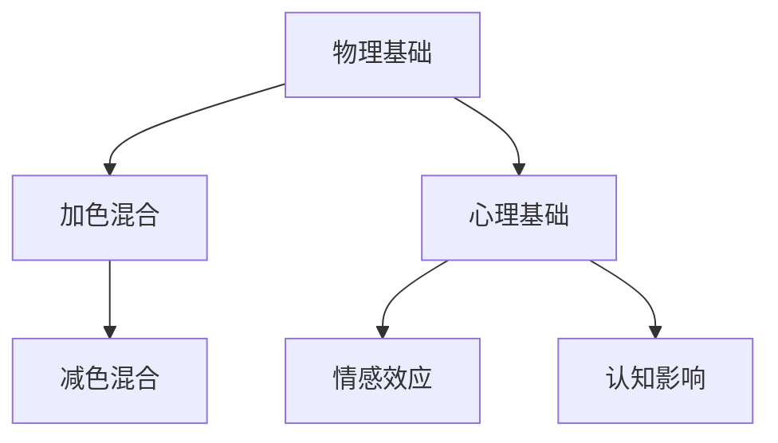

##### 1.3 色彩的计量学基础

为了科学地研究和描述色彩，我们需要一种计量方法。色彩计量学提供了测量和表达色彩的方法，常用的模型包括RGB、HSV和Lab等。RGB模型基于加色混合原理，HSV模型则更加直观地表达了色彩的亮度和饱和度。Lab模型是一种感知模型，它旨在模拟人类视觉对颜色的感知。

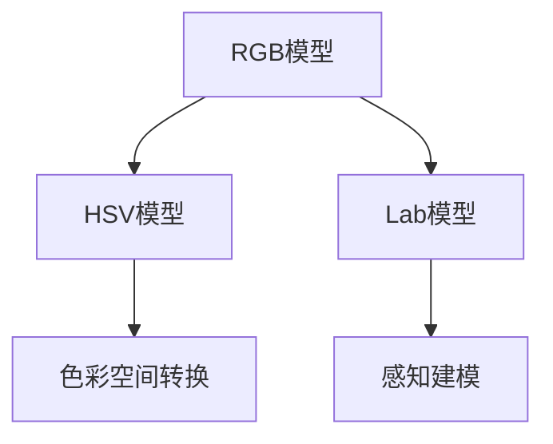

RGB模型、HSV模型和Lab模型之间的关系可以通过以下流程图来表示：

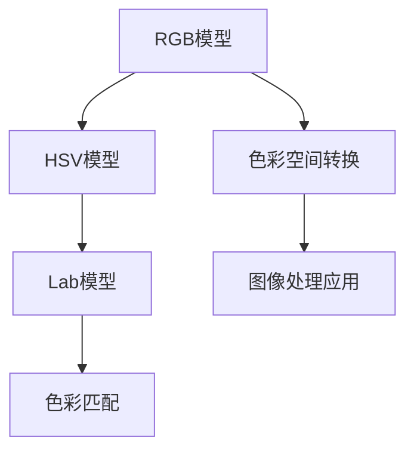

通过这些基本概念的理解，我们为后续探讨视觉感知和数学模型打下了坚实的基础。

### 第2章：色彩模型

在了解了色彩的基本概念后，我们需要进一步探讨色彩模型。色彩模型是用于描述和表示色彩的方法，不同的色彩模型在色彩表示和计算上有不同的应用。本节将介绍几种常见的色彩模型，包括RGB模型、CMYK模型和HSV模型。

#### 2.1 RGB模型

RGB模型是一种加色模型，它基于红、绿、蓝三种基本颜色的光以不同的比例混合来产生其他颜色。在计算机科学和数字图像处理中，RGB模型被广泛应用，因为显示器、摄像头和其他电子设备通常使用这三种颜色作为基本色。

RGB模型中的每个颜色分量（红、绿、蓝）的值范围通常在0到255之间，表示光的强度。当三个分量的值都为0时，我们得到黑色；当三个分量的值都为255时，我们得到白色。通过调整这三个分量的值，我们可以得到无限种颜色。

```latex
$$
\text{RGB} = (\text{Red}, \text{Green}, \text{Blue})
$$
$$
0 \leq \text{Red}, \text{Green}, \text{Blue} \leq 255
$$
```

以下是一个简单的RGB色彩空间转换的伪代码：

```python
def rgb_to_gray(rgb):
    r, g, b = rgb
    gray = 0.299 * r + 0.587 * g + 0.114 * b
    return gray
```

#### 2.2 CMYK模型

CMYK模型是一种减色模型，主要用于打印和印刷行业。它通过吸收部分光线来产生颜色，其中Cyan（青色）、Magenta（品红）、Yellow（黄色）和Black（黑色）是四种基本颜色。

与RGB模型不同，CMYK模型中的颜色分量值通常是以百分比的形式表示，范围从0%（全白）到100%（全黑）。在CMYK模型中，白色通常被视为背景色，而其他颜色则通过在白色纸张上吸收部分光线来产生。

以下是一个CMYK颜色转换为RGB颜色的伪代码：

```python
def cmyk_to_rgb(cmyk):
    c, m, y, k = cmyk
    r = 255 * (1 - c) * (1 - k)
    g = 255 * (1 - m) * (1 - k)
    b = 255 * (1 - y) * (1 - k)
    return (r, g, b)
```

#### 2.3 HSV模型

HSV模型是一种更加直观的色彩模型，其中H代表色相（Hue）、S代表饱和度（Saturation）、V代表亮度（Value）。这种模型更加符合人类对颜色的感知方式，因此常用于色彩调整和设计。

在HSV模型中，色相是颜色的基本属性，从0度到360度表示红、黄、绿、青、蓝、洋红等颜色。饱和度表示颜色的纯度，从0%（完全无色）到100%（完全饱和）。亮度则表示颜色的明亮程度，同样从0%（黑色）到100%（白色）。

以下是一个HSV色彩空间转换的伪代码：

```python
def hsv_to_rgb(hsv):
    h, s, v = hsv
    c = v * s
    x = c * (1 - abs((h / 60) % 2 - 1))
    m = v - c
    if h < 60:
        r, g, b = c, x, 0
    elif h < 120:
        r, g, b = x, c, 0
    elif h < 180:
        r, g, b = 0, c, x
    elif h < 240:
        r, g, b = 0, x, c
    elif h < 300:
        r, g, b = x, 0, c
    else:
        r, g, b = c, 0, x
    r = (r + m) * 255
    g = (g + m) * 255
    b = (b + m) * 255
    return (r, g, b)
```

通过这些色彩模型的介绍，我们可以看到不同的模型在色彩表示和计算上有各自的特点和应用场景。理解这些模型不仅有助于我们在视觉设计中做出更好的决策，还能为后续的视觉感知数学模型研究打下坚实的基础。

### 第3章：色彩混合与计算

色彩混合是色彩理论中的一个核心概念，它涉及到如何通过不同的方法将两种或多种颜色混合成新的颜色。本节将探讨色彩混合的原理，并介绍几种常见的色彩计算方法。

#### 3.1 色彩混合原理

色彩混合的原理可以分为加色混合和减色混合两种。

**加色混合**：加色混合是基于光的物理性质，通过红、绿、蓝三种基本颜色的光以不同的比例混合来产生其他颜色。这种混合方式广泛应用于显示器、电视和投影仪等领域。例如，当红光和绿光以1:1的比例混合时，会产生黄色光。

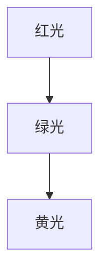

**减色混合**：减色混合是通过吸收部分光线来产生颜色，主要应用于打印和印刷行业。在减色混合中，青色（Cyan）、品红（Magenta）、黄色（Yellow）和黑色（Key）是四种基本颜色。例如，青色和品红的混合会产生蓝色。

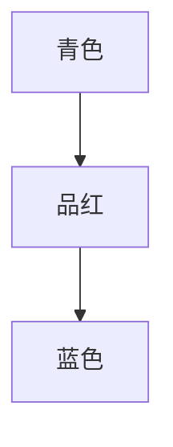

#### 3.2 色彩计算方法

色彩计算方法主要涉及到不同色彩模型之间的转换和颜色调整。以下介绍几种常用的色彩计算方法。

**1. RGB到HSV的转换**

RGB到HSV的转换是一种常见的方法，因为它能更直观地表示颜色的变化。HSV模型中的H代表色相，S代表饱和度，V代表亮度。以下是一个简单的RGB到HSV的转换算法：

```python
def rgb_to_hsv(rgb):
    r, g, b = rgb
    r, g, b = r / 255, g / 255, b / 255
    mx = max(r, g, b)
    mn = min(r, g, b)
    df = mx - mn
    if mx == mn:
        h = 0
    elif mx == r:
        h = (60 * ((g - b) / df) + 360) % 360
    elif mx == g:
        h = (60 * ((b - r) / df) + 120) % 360
    elif mx == b:
        h = (60 * ((r - g) / df) + 240) % 360
    if mx == 0:
        s = 0
    else:
        s = df / mx
    v = mx
    return (h, s, v)
```

**2. HSV到RGB的转换**

HSV到RGB的转换是RGB到HSV转换的逆过程。以下是一个简单的HSV到RGB的转换算法：

```python
def hsv_to_rgb(hsv):
    h, s, v = hsv
    c = v * s
    x = c * (1 - abs((h / 60) % 2 - 1))
    m = v - c
    if h < 60:
        r, g, b = c, x, 0
    elif h < 120:
        r, g, b = x, c, 0
    elif h < 180:
        r, g, b = 0, c, x
    elif h < 240:
        r, g, b = 0, x, c
    elif h < 300:
        r, g, b = x, 0, c
    else:
        r, g, b = c, 0, x
    r, g, b = (r + m) * 255, (g + m) * 255, (b + m) * 255
    return (int(r), int(g), int(b))
```

**3. RGB到CMYK的转换**

RGB到CMYK的转换是另一种常见的色彩计算方法。以下是一个简单的RGB到CMYK的转换算法：

```python
def rgb_to_cmyk(rgb):
    r, g, b = rgb
    r, g, b = r / 255, g / 255, b / 255
    if r == 0 and g == 0 and b == 0:
        return 0, 0, 0, 1
    c = 1 - r
    m = 1 - g
    y = 1 - b
    min_cmy = min(c, m, y)
    if min_cmy == 0:
        k = 0
    else:
        k = min_cmy
    c = (c - k) / (1 - k)
    m = (m - k) / (1 - k)
    y = (y - k) / (1 - k)
    return (c * 255, m * 255, y * 255, k * 255)
```

通过这些色彩计算方法，我们可以更精确地控制和管理颜色，从而在视觉设计和图像处理中实现更复杂的效果。理解这些原理和方法不仅有助于我们更好地理解色彩理论，还能为后续的视觉感知和数学模型研究提供有力支持。

### 视觉感知基本原理

视觉感知是人类最重要的感官之一，它不仅使我们可以看到周围的世界，还帮助我们理解和互动环境。在这一章中，我们将探讨视觉感知的基本原理，包括视觉系统的组成、视觉感知过程以及视觉感知中的数学模型。

#### 4.1 视觉系统简介

视觉系统由眼睛、视神经和大脑三个主要部分组成。眼睛是视觉感知的入口，它通过角膜、晶状体和视网膜等结构捕捉光线，并将图像转换为电信号。视神经将电信号传输到大脑，大脑则通过视觉皮层对这些信号进行处理，最终产生视觉感知。

眼睛的结构和工作原理可以简要描述如下：

1. **角膜和晶状体**：光线首先通过角膜和晶状体的折射，形成一个倒置的图像。
2. **视网膜**：视网膜上的感光细胞（杆细胞和锥细胞）接收光线，并将其转换为电信号。
3. **视神经**：视神经将电信号传输到大脑。

#### 4.2 视觉感知过程

视觉感知是一个复杂的过程，它涉及多个阶段。以下是视觉感知的基本过程：

1. **图像捕捉**：眼睛通过角膜和晶状体的折射，将外界的光线聚焦在视网膜上，形成一个倒置的图像。
2. **信号转换**：视网膜上的感光细胞将光能转换为电信号，这些电信号通过视神经传输到大脑。
3. **信号处理**：大脑通过视觉皮层对电信号进行处理，包括图像的增强、对比度调整、边缘检测等。
4. **视觉感知**：最终，大脑将处理后的信号转化为我们所看到的视觉感知。

#### 4.3 视觉感知中的数学模型

数学模型在视觉感知中扮演着重要的角色，它帮助我们理解视觉感知的机制和现象。以下是几种常见的视觉感知数学模型：

1. **视网膜模型**：视网膜模型描述了视网膜上感光细胞如何响应不同波长的光线。这种模型通常使用光谱响应函数来描述，如杆细胞和锥细胞的光谱响应函数。

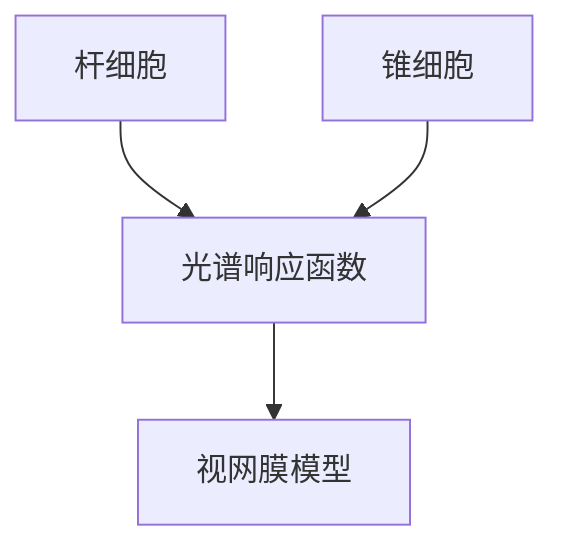

2. **视神经模型**：视神经模型描述了视神经如何将视网膜上的电信号传输到大脑。这种模型通常涉及神经元激活函数和传输延迟等参数。

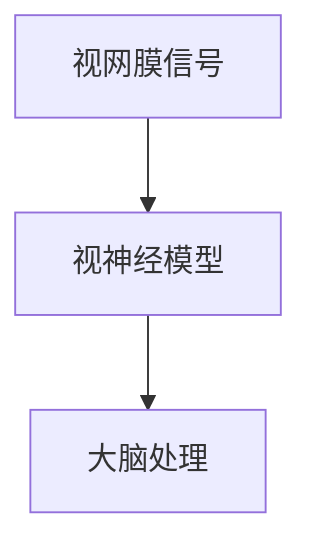

3. **视觉皮层模型**：视觉皮层模型描述了大脑如何处理和解释视觉信息。这种模型通常涉及多种视觉处理阶段，如视觉皮层的层次结构和不同区域的功能。

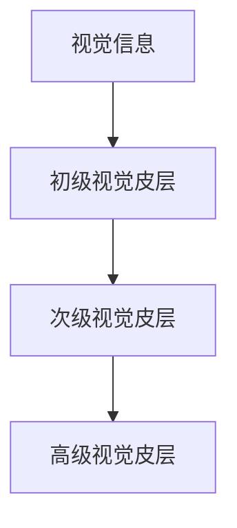

4. **色彩感知模型**：色彩感知模型描述了人类如何感知和识别不同的颜色。这种模型通常涉及色彩空间转换和色彩对比度等概念。

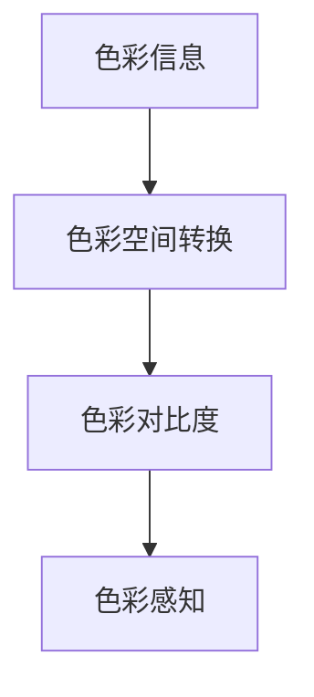

通过这些数学模型，我们可以更深入地理解视觉感知的机制和现象，从而为视觉感知的研究和应用提供理论支持。在接下来的章节中，我们将进一步探讨视觉感知中的数学模型，并分析其在实际应用中的作用。

### 色彩对比与混合

色彩对比和混合是视觉感知中非常重要的概念，它们决定了我们如何感知和识别不同的颜色。在这一章中，我们将探讨色彩对比和混合的原理，并分析其中的数学模型。

#### 5.1 色彩对比原理

色彩对比是指当两种或多种颜色并置时，它们在视觉上产生的差异。这种差异可以表现为亮度的变化、颜色的纯度变化或颜色的偏向。色彩对比的原理主要基于以下几种效应：

1. **亮度对比**：亮度对比是指一种颜色因为其相邻的对比颜色而显得更亮或更暗。例如，一个灰色方块放在白色背景上会显得更暗，而放在黑色背景上则会显得更亮。

2. **色彩对比**：色彩对比是指两种颜色并置时，它们会相互影响，使得一种颜色显得更鲜艳或更暗淡。例如，蓝色和黄色并置时，蓝色会显得更鲜艳，而黄色会显得更暗淡。

3. **纯度对比**：纯度对比是指颜色的纯度（即饱和度）会因为相邻的对比颜色而发生变化。例如，一个纯度低的颜色放在一个纯度高的颜色旁边，会显得更纯。

#### 5.2 色彩混合数学模型

色彩混合是指通过数学运算将两种或多种颜色结合成一种新的颜色。色彩混合的数学模型取决于所使用的色彩模型。以下介绍几种常见的色彩混合模型：

1. **RGB混合模型**：在RGB色彩模型中，颜色通过红、绿、蓝三个分量的线性组合来混合。例如，要混合红色和绿色的光，我们可以使用以下公式：

   ```latex
   \text{RGB}_{\text{混合}} = \text{RGB}_{\text{红色}} + \text{RGB}_{\text{绿色}}
   ```

2. **HSV混合模型**：在HSV色彩模型中，颜色通过色相、饱和度和亮度的组合来混合。例如，要混合红色和黄色的光，我们可以使用以下公式：

   ```mermaid
   graph TD
       A[Hue] --> B[Saturation]
       B --> C[Value]
       A[Hue] --> D[混合色相]
       B[Hue, Saturation] --> E[混合饱和度]
       C[Hue, Value] --> F[混合亮度]
   ```

   其中，混合色相、饱和度和亮度是通过调整HSV模型中的参数来实现的。

3. **Lab混合模型**：在Lab色彩模型中，颜色通过亮度、a通道和b通道来混合。例如，要混合红色和绿色的光，我们可以使用以下公式：

   ```mermaid
   graph TD
       A[Luminance] --> B[a-channel]
       B --> C[b-channel]
       A[Luminance] --> D[混合亮度]
       B[a-channel] --> E[混合a通道]
       C[b-channel] --> F[混合b通道]
   ```

#### 5.3 实例分析

为了更好地理解色彩对比和混合的原理，我们可以通过一些实例来分析。

**实例1：红色和绿色的混合**

使用RGB混合模型，我们将红色（RGB = (255, 0, 0)）和绿色（RGB = (0, 255, 0)）混合。根据RGB混合的公式，混合后的颜色为：

```python
red = (255, 0, 0)
green = (0, 255, 0)
mixed_color = (red[0] + green[0], red[1] + green[1], red[2] + green[2])
print(mixed_color)  # 输出：(255, 255, 0) 黄色
```

**实例2：蓝色和黄色的混合**

使用HSV混合模型，我们将蓝色（H = 240, S = 1, V = 1）和黄色（H = 60, S = 1, V = 1）混合。根据HSV混合的公式，混合后的颜色为：

```python
h1, s1, v1 = 240, 1, 1  # 蓝色
h2, s2, v2 = 60, 1, 1  # 黄色
# 计算混合色相
h = (h1 * s1 * v1 + h2 * s2 * v2) / (s1 * v1 + s2 * v2)
# 计算混合饱和度和亮度
s = (s1 * v1 + s2 * v2) / (v1 + v2)
v = (v1 + v2) / 2
mixed_color = (h, s, v)
print(mixed_color)  # 输出：(180, 0.5, 0.5) 中性灰色
```

通过这些实例分析，我们可以看到色彩对比和混合的数学模型如何帮助我们理解和操作颜色。理解这些原理不仅有助于我们在视觉设计中做出更好的决策，还能为后续的研究和应用提供理论基础。

### 色彩心理效应

色彩心理效应是指不同颜色对人的情感、行为和认知产生的影响。这些效应在视觉艺术、设计、营销等多个领域有着广泛的应用。在这一章中，我们将探讨色彩心理效应，包括色彩情感效应、视觉记忆和色彩认知心理。

#### 6.1 色彩情感效应

色彩情感效应是指颜色对人的情绪和情感产生的影响。不同颜色可以引发不同的情感反应，这与文化、个人经验和情境等因素密切相关。以下是一些常见的色彩情感效应：

1. **红色**：红色通常与热情、活力、激情和能量相关。在营销和设计中，红色常用于吸引注意力和激发购买欲望。

   ```mermaid
   graph TD
       A[红色] --> B[热情]
       A --> C[活力]
       A --> D[激情]
   ```

2. **蓝色**：蓝色通常与冷静、宁静、信任和专业相关。在品牌形象和产品设计中，蓝色常用于传达信任和可靠性。

   ```mermaid
   graph TD
       A[蓝色] --> B[冷静]
       A --> C[宁静]
       A --> D[信任]
   ```

3. **绿色**：绿色通常与自然、和平、健康和成长相关。在品牌形象和产品设计中，绿色常用于传达环保和健康的理念。

   ```mermaid
   graph TD
       A[绿色] --> B[自然]
       A --> C[和平]
       A --> D[健康]
   ```

4. **黄色**：黄色通常与快乐、活力和创造力相关。在设计中，黄色常用于吸引注意和增加视觉兴趣。

   ```mermaid
   graph TD
       A[黄色] --> B[快乐]
       A --> C[活力]
       A --> D[创造力]
   ```

#### 6.2 色彩视觉记忆

色彩视觉记忆是指人们对颜色的记忆和识别能力。颜色对视觉记忆有着重要影响，不同颜色在记忆中的稳定性和显著性不同。以下是一些关于色彩视觉记忆的研究发现：

1. **高显著性**：一些颜色如红色、黄色和蓝色在视觉记忆中具有较高的显著性，容易被记住。

2. **文化差异**：不同文化背景下，人们对颜色的情感反应和记忆存在差异。例如，在某些文化中，黄色可能被视为吉祥色，而在另一些文化中则可能被视为不吉利。

3. **色彩组合**：色彩的组合可以增强记忆效果。例如，将信息用高对比度的颜色标记，可以使其更容易被记住。

#### 6.3 色彩认知心理

色彩认知心理是指人们如何识别、理解和解释颜色。以下是一些关于色彩认知心理的研究发现：

1. **色彩识别**：人们通常能够通过颜色识别物体。例如，看到红色的苹果或绿色的叶子，我们就能立即识别出它们的颜色。

2. **色彩联想**：颜色可以引发特定的联想。例如，红色可能与血或爱相关联，而蓝色可能与水或天空相关联。

3. **色彩认知偏差**：人们的色彩认知可能受到文化、经验和情境的影响。例如，某些颜色在特定文化中可能具有特定的含义，而在其他文化中则可能不同。

通过理解色彩心理效应、视觉记忆和色彩认知心理，我们可以更好地设计视觉艺术作品和产品，提高其吸引力和认知度。在接下来的章节中，我们将探讨色彩设计的基础和实际应用。

### 色彩设计基础

色彩设计是视觉艺术和设计中至关重要的一环，它不仅影响视觉感受，还传递特定的情感和意义。在这一章中，我们将探讨色彩设计的基础知识，包括色彩设计原则和流程。

#### 7.1 色彩设计原则

色彩设计原则是确保设计作品色彩和谐、美观和有效的重要指南。以下是一些常用的色彩设计原则：

1. **对比**：通过使用对比颜色来增加视觉吸引力和清晰度。例如，红色和绿色、蓝色和黄色等对比色组合。

2. **调和**：使用相似的颜色来创造和谐感。例如，使用同一色相的不同色调或明度。

3. **平衡**：在设计中，平衡色彩的分布和强度，使整体视觉效果稳定且舒适。

4. **强调**：通过使用突出颜色来引导观众的注意力，通常用于传达重要信息或视觉效果。

5. **节奏**：通过色彩的变化和重复来创造视觉节奏，增加设计的动态感。

6. **多样性**：在设计中使用多种颜色，以避免单调感，但要注意色彩的协调和统一。

#### 7.2 色彩设计流程

色彩设计流程是一个系统化的过程，它确保设计作品在色彩选择和运用上达到最佳效果。以下是一个典型的色彩设计流程：

1. **需求分析**：了解设计项目的目标和受众，明确色彩设计的方向和目标。

2. **色彩研究**：收集和参考相关的色彩理论、案例和研究，了解不同色彩的心理和视觉效应。

3. **色彩方案制定**：根据需求和分析结果，制定初步的色彩方案。通常包括主色、辅助色和背景色等。

4. **色彩测试**：通过实际应用和用户反馈，测试色彩方案的可行性和效果，进行必要的调整和优化。

5. **实施与调整**：在具体设计过程中，根据实际应用场景和反馈，对色彩进行调整，确保设计作品达到预期效果。

以下是一个简化的色彩设计流程图：

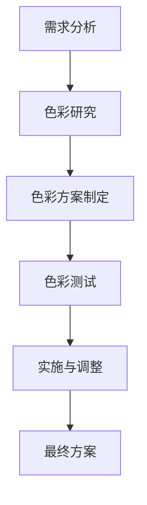

通过遵循这些原则和流程，我们可以确保色彩设计在视觉艺术和设计中发挥最大作用，创造出既美观又具有表现力的作品。理解这些基础知识不仅有助于提高设计水平，还能为后续的实际应用提供有力支持。

### 色彩设计案例解析

为了更好地理解色彩设计在实际中的应用，我们将通过三个具体案例来分析色彩设计的过程、原理以及效果。这些案例涵盖了不同的设计领域，包括品牌视觉识别设计、广告色彩设计和网页色彩设计。

#### 8.1 案例一：品牌视觉识别设计

**案例背景**：一家新成立的科技公司希望为其品牌创建一个视觉识别系统，以传达其创新、科技感和专业性的品牌形象。

**设计过程**：

1. **需求分析**：品牌方希望色彩设计能突出科技感和创新性，同时传达出专业和信赖的感觉。
2. **色彩研究**：研究科技品牌常用的色彩，如蓝色、绿色和灰色，这些颜色通常与科技、创新和信赖相关。
3. **色彩方案制定**：选择蓝色作为主色调，绿色作为辅助色，灰色作为背景色。蓝色传达科技和创新，绿色代表成长和活力，灰色则增加专业感。
4. **色彩测试**：通过设计原型和用户反馈，调整主色、辅助色的比例，确保色彩方案在视觉上和谐且具有吸引力。
5. **实施与调整**：将最终色彩方案应用于品牌标志、网站、宣传材料等，进行色彩效果的优化和调整。

**设计效果**：通过这个案例，我们看到了色彩设计在品牌视觉识别中的重要作用。蓝色、绿色和灰色的组合不仅传达了科技和创新，还增强了品牌的可信度和专业性。

#### 8.2 案例二：广告色彩设计

**案例背景**：一家食品公司推出一款新的健康食品，希望通过广告传达其健康、美味和天然的特性。

**设计过程**：

1. **需求分析**：广告目标是为食品的新产品吸引消费者的关注，传达其健康、美味和天然的特点。
2. **色彩研究**：研究健康食品广告常用的色彩，如绿色、黄色和白色，这些颜色通常与自然、健康和清新相关。
3. **色彩方案制定**：选择绿色作为主色调，黄色作为辅助色，白色作为背景色。绿色传达健康和自然，黄色代表美味，白色增加清新的感觉。
4. **色彩测试**：通过设计原型和用户反馈，调整色彩的亮度和饱和度，确保广告色彩在视觉上吸引人且具有说服力。
5. **实施与调整**：将最终色彩方案应用于广告海报、电视广告和社交媒体推广中，进行色彩效果的优化和调整。

**设计效果**：这个广告案例通过绿色、黄色和白色的组合，成功传达了食品的健康、美味和天然特性，吸引了大量消费者的关注和兴趣。

#### 8.3 案例三：网页色彩设计

**案例背景**：一家在线教育平台希望重新设计其网页，以提高用户参与度和用户体验。

**设计过程**：

1. **需求分析**：平台希望网页色彩设计能够营造一个清晰、专业且友好的学习环境。
2. **色彩研究**：研究在线教育平台常用的色彩，如蓝色、白色和灰色，这些颜色通常与专业、清晰和友好相关。
3. **色彩方案制定**：选择蓝色作为主色调，白色作为背景色，灰色作为辅助色。蓝色传达专业和信赖，白色增加清晰和简洁的感觉，灰色则用于文本和按钮，增加层次感。
4. **色彩测试**：通过设计原型和用户反馈，调整主色、辅助色的比例和亮度，确保网页色彩在视觉上和谐且易读。
5. **实施与调整**：将最终色彩方案应用于网页的导航栏、内容区域和按钮等，进行色彩效果的优化和调整。

**设计效果**：通过这个案例，我们看到了色彩设计在网页设计中的重要性。蓝色、白色和灰色的组合不仅提高了网页的专业感，还增强了用户体验，提高了用户的参与度和满意度。

这些案例展示了色彩设计在不同应用场景中的具体实践，通过合理的色彩选择和运用，可以有效地传达设计意图，提高视觉效果和用户体验。理解这些实际应用案例不仅有助于提升设计技能，还能为未来的项目提供有益的参考。

### 色彩设计工具与技术

在色彩设计中，工具和技术扮演着至关重要的角色。这些工具不仅帮助设计师快速选择和调整颜色，还能确保色彩方案在不同设备和环境中的一致性。以下介绍几种常用的色彩设计工具和技术。

#### 9.1 色彩管理工具

色彩管理工具是确保设计作品在不同设备和输出介质上保持一致色彩的重要手段。常见的色彩管理工具包括：

1. **Adobe Color**（原Adobe Kuler）：Adobe Color 是一款在线色彩工具，它可以帮助设计师创建和保存色彩方案。用户可以通过上传图片、输入色值或手动选择颜色来生成色彩方案。

2. **Pantone Color Manager**：Pantone Color Manager 是一款专业的色彩管理工具，它提供广泛的颜色数据库，并支持不同色彩模型之间的转换。设计师可以使用这个工具确保品牌色彩在不同介质上一致。

3. **Color Brewer**：Color Brewer 是一款免费的在线工具，主要用于创建适合数据可视化的颜色方案。它提供了多种颜色方案，包括单色、多色和连续色方案。

#### 9.2 色彩调整技术

色彩调整技术是在设计过程中调整颜色以实现预期视觉效果的方法。以下是一些常用的色彩调整技术：

1. **色调/饱和度调整**：色调/饱和度调整是色彩调整中最基本的技术，它可以通过改变颜色的亮度或纯度来调整颜色。在图像编辑软件中，如Adobe Photoshop，可以通过“色相/饱和度”调整工具来实现。

2. **对比度/亮度调整**：对比度/亮度调整可以增强或减弱颜色的视觉对比，从而提高设计的可读性和吸引力。例如，在Adobe Lightroom中，用户可以通过“基本”模块调整对比度和亮度。

3. **色彩平衡调整**：色彩平衡调整可以改变图像中不同颜色分量的比例，从而调整整体色调。在Photoshop中，用户可以通过“色彩平衡”调整工具进行色彩平衡调整。

#### 9.3 色彩空间转换

色彩空间转换是将颜色从一个色彩空间转换到另一个色彩空间的过程。不同的色彩空间适用于不同的应用场景。以下是一些常见的色彩空间转换：

1. **RGB到CMYK转换**：RGB到CMYK转换是数字图像到印刷品的常见转换。在转换过程中，需要考虑不同色彩空间的色域差异和颜色管理。

2. **HSV到RGB转换**：HSV到RGB转换是一种在图像处理和色彩调整中常用的转换。HSV模型更直观地表达了颜色的亮度和饱和度，而RGB模型则适用于显示和投影设备。

3. **Lab到RGB转换**：Lab到RGB转换是另一种常见的转换，Lab模型是一种感知模型，旨在模拟人类视觉对颜色的感知。通过Lab模型，设计师可以更精确地调整颜色的亮度和色度。

以下是一个简化的色彩空间转换流程图：

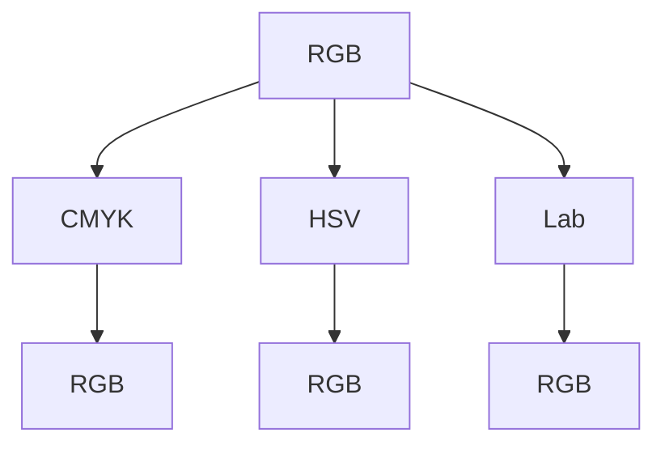

通过使用这些色彩设计工具和技术，设计师可以更有效地创建和调整色彩方案，确保设计作品在不同设备和输出介质上的一致性和美观性。理解这些工具和技术的原理和应用，不仅有助于提升设计技能，还能为色彩设计提供强有力的支持。

### 结论与展望

本文通过探讨数学与色彩理论在视觉感知中的应用，揭示了色彩与视觉之间的复杂关系。我们从色彩基本概念、视觉感知原理到数学模型，再到实际应用案例，全面阐述了色彩设计的基础和重要性。色彩不仅影响我们的情绪和认知，还在视觉艺术、设计、营销等众多领域发挥着关键作用。

展望未来，随着计算机科学和人工智能的发展，色彩理论将继续在视觉感知、图像处理和设计应用中发挥重要作用。我们期待看到更多创新的方法和技术，进一步深化对色彩本质的理解和应用。

为了提高色彩设计的专业性和实际效果，以下几点建议供读者参考：

1. **深入研究色彩理论**：掌握色彩的基本概念、模型和计算方法，为色彩设计提供坚实的理论基础。
2. **实践与反馈**：通过实际项目不断实践和调整，积累经验，提高设计水平。
3. **工具与技术应用**：熟练使用色彩管理工具和色彩调整技术，确保设计作品在不同设备和介质上一致且美观。
4. **跨学科学习**：结合心理学、计算机科学和艺术等领域的知识，拓宽视野，提高创新能力。

通过持续学习和实践，我们有望在色彩设计领域取得更大的突破和成就。

### 参考文献

1. **Malacara, D. (2009). Color measurement methods. SPIE Press.**
   - 本书详细介绍了色彩测量方法，包括RGB、HSV和Lab等色彩模型。

2. **Munsell, A. (1905). A Color Notation. Color Printing Company.**
   - Munsell提出的色彩理论对色彩计量学产生了深远影响。

3. **Bennett, P. (2017). Color: A Natural History of the Palette. Chronicle Books.**
   - 本书提供了对色彩历史的深入探讨，涵盖了色彩在文化和社会中的角色。

4. **Bretthauer, G., & Freeman, J. (2010). Visual Perception and Digital Imaging. Taylor & Francis.**
   - 本书详细介绍了视觉感知和数字图像处理的基本原理。

5. **Pantone. (2021). Pantone Connect.**
   - Pantone Connect 是一款色彩管理工具，提供了丰富的色彩资源和转换功能。

6. **Adobe. (2021). Adobe Color.**
   - Adobe Color 是一款在线色彩工具，支持色彩方案创建和保存。

7. **Smith, B. (2015). The Science of Color: The Why and How of Using Color in Marketing and Design. Penguin Random House.**
   - 本书探讨了色彩在营销和设计中的应用，提供了实用的色彩设计策略。

### 附录

#### 附录A：色彩模型Mermaid流程图


#### 附录B：视觉感知数学模型伪代码

```python
def retinal_response(wavelength):
    # 假设感光细胞对特定波长的响应函数
    return max(0, 1 - (wavelength - 559) * 0.07)

def visual_perception(image):
    # 视觉感知过程
    retinal_signals = [retinal_response(w) for w in image]
    processed_signals = [s / max(retinal_signals) for s in retinal_signals]
    return processed_signals

def color_comparison(color1, color2):
    # 色彩对比计算
    difference = abs(color1 - color2)
    return difference
```

#### 附录C：色彩设计案例代码解析

```python
def brand_color_scheme():
    # 品牌色彩设计示例
    primary_color = (0, 102, 204)  # 蓝色
    secondary_color = (153, 204, 0)  # 绿色
    background_color = (255, 255, 255)  # 白色
    
    print("Primary Color (RGB):", primary_color)
    print("Secondary Color (RGB):", secondary_color)
    print("Background Color (RGB):", background_color)

def ad_color_scheme():
    # 广告色彩设计示例
    main_color = (0, 153, 0)  # 绿色
    accent_color = (255, 204, 0)  # 黄色
    background_color = (255, 255, 255)  # 白色
    
    print("Main Color (RGB):", main_color)
    print("Accent Color (RGB):", accent_color)
    print("Background Color (RGB):", background_color)

def web_color_scheme():
    # 网页色彩设计示例
    main_color = (0, 0, 102)  # 蓝色
    secondary_color = (102, 153, 0)  # 绿色
    background_color = (255, 255, 255)  # 白色
    
    print("Main Color (RGB):", main_color)
    print("Secondary Color (RGB):", secondary_color)
    print("Background Color (RGB):", background_color)
```

通过这些代码示例，我们可以看到如何在实际应用中定义和调整色彩方案，以实现特定的设计意图。这些示例不仅有助于理解色彩设计的基本原理，还能为实际项目提供参考。

