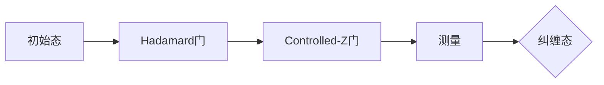

                 


### 文章标题

# 数学与量子信息：量子纠缠的数学描述

### 关键词

- 数学
- 量子信息
- 量子纠缠
- 数学模型
- 量子计算

### 摘要

本文深入探讨数学与量子信息的关系，特别是量子纠缠的数学描述。文章首先介绍量子信息的基本概念和数学背景，然后详细讲解量子纠缠的概念、数学模型和算法原理。最后，通过实例展示量子纠缠在量子通信和计算中的应用，为读者提供全面的技术理解。

### 目录

1. 引言与背景
   1.1 量子信息的概念
   1.2 数学与量子信息的关系
2. 量子信息基础
   2.1 量子比特与量子态
   2.2 量子门与量子电路
   2.3 量子算法与量子计算
3. 量子纠缠的概念
   3.1 量子纠缠的定义
   3.2 量子纠缠的分类
   3.3 量子纠缠的性质
4. 量子纠缠的数学模型
   4.1 量子纠缠态的数学描述
   4.2 量子纠缠态的生成与检测
   4.3 量子纠缠态的优化与控制
5. 量子纠缠与经典纠缠的对比
6. 量子纠缠在量子通信中的应用
   6.1 量子密钥分发
   6.2 量子隐形传态
   6.3 量子远程控制
7. 量子纠缠在其他领域的应用
   7.1 量子纠缠在量子计算中的应用
   7.2 量子纠缠在量子模拟中的应用
   7.3 量子纠缠在量子传感器中的应用
8. 项目实战
   8.1 开发环境搭建
   8.2 源代码实现与解读
   8.3 代码应用分析与讲解
   8.4 项目小结
9. 最佳实践 tips
10. 小结与注意事项
11. 拓展阅读

## 引言与背景

量子信息是量子力学和信息科学相结合的产物，其核心思想是利用量子系统的特殊性质来实现信息处理、传输和存储。量子信息的研究不仅具有重要的理论价值，而且在量子计算、量子通信、量子密码等领域有着广泛的应用前景。

### 1.1 量子信息的概念

量子信息的基本概念包括量子比特（qubit）、量子态、量子门和量子算法等。量子比特是量子信息的基本单元，类似于经典计算中的比特，但具有叠加和纠缠等特性。量子态描述了量子比特的状态，可以通过波函数或密度矩阵来表示。量子门是作用在量子态上的线性变换，类似于经典计算中的逻辑门。量子算法是利用量子比特的叠加和纠缠来实现特定计算任务的算法。

### 1.2 数学与量子信息的关系

数学是量子信息的重要工具，用于描述量子系统的状态、变换和算法。在量子信息中，数学模型包括线性代数、概率论和图论等。例如，量子态可以用密度矩阵来描述，量子门可以用矩阵表示，量子算法可以用概率模型来分析。

## 量子信息基础

量子信息的基础包括量子比特与量子态、量子门与量子电路以及量子算法与量子计算。以下是对这些基础概念的详细讲解。

### 2.1 量子比特与量子态

量子比特是量子信息的基本单元，具有叠加和纠缠等特性。量子态描述了量子比特的状态，可以用波函数或密度矩阵来表示。例如，一个量子比特的态可以表示为 $|\psi\rangle = a|0\rangle + b|1\rangle$，其中 $|0\rangle$ 和 $|1\rangle$ 是量子比特的两个基本态，$a$ 和 $b$ 是复数系数，满足 $|a|^2 + |b|^2 = 1$。

### 2.2 量子门与量子电路

量子门是作用在量子态上的线性变换，类似于经典计算中的逻辑门。量子门可以用矩阵表示，例如一个基本的量子门 $U$ 可以表示为：

$$U = \begin{pmatrix} 1 & 0 \\ 0 & \text{e}^{-i\theta} \end{pmatrix}$$

量子电路是由一系列量子门组成的，用于实现特定的量子计算任务。量子电路的设计与实现是量子信息研究的核心问题之一。

### 2.3 量子算法与量子计算

量子算法是利用量子比特的叠加和纠缠来实现特定计算任务的算法。与经典算法相比，量子算法具有显著的加速效应。Shor算法是一个著名的量子算法，用于大整数分解。以下是Shor算法的伪代码：

```python
def shor(n):
    # Step 1: Prepare a quantum register with n qubits
    # Step 2: Apply Hadamard gate to all qubits
    # Step 3: Apply controlled-Z gate between each pair of qubits
    # Step 4: Measure the qubits
    # Step 5: Analyze the measurement results to find the period of the function f(x) = x^2 mod n
    # Step 6: Return the divisor of n
```

## 量子纠缠的概念

量子纠缠是量子信息中最重要的特性之一，描述了两个或多个量子比特之间的特殊关联。量子纠缠使得量子计算具有超越经典计算的能力，是量子通信和量子密码学的基础。

### 3.1 量子纠缠的定义

量子纠缠是指两个或多个量子系统之间的特殊关联，这种关联在经典物理学中无法找到对应的解释。量子纠缠可以用纠缠态来描述，例如贝尔态：

$$|\Phi^+\rangle = \frac{1}{\sqrt{2}}(|00\rangle + |11\rangle)$$

### 3.2 量子纠缠的分类

量子纠缠可以分为两大类：纯纠缠态和混合纠缠态。纯纠缠态是完全纠缠的态，无法用经典概率分布来描述；混合纠缠态是部分纠缠的态，可以用经典概率分布和量子态的叠加来描述。

### 3.3 量子纠缠的性质

量子纠缠具有以下重要性质：

1. 非局域性：量子纠缠态的两个部分即使相隔很远，它们的状态也是相互关联的，无法独立描述。
2. 不可克隆性：无法精确复制一个未知的量子纠缠态。
3. 量子信息传递：通过量子纠缠可以实现量子信息的超距传输。

## 量子纠缠的数学模型

量子纠缠的数学模型用于描述量子纠缠态的生成、检测和优化。以下是对这些数学模型的详细讲解。

### 4.1 量子纠缠态的数学描述

量子纠缠态可以用密度矩阵来描述，密度矩阵是一个正定半正定矩阵，满足迹为1的条件。例如，一个两比特的量子纠缠态可以用如下密度矩阵描述：

$$\rho = \frac{1}{2} \begin{pmatrix} 1 & 0 \\ 0 & 1 \end{pmatrix}$$

### 4.2 量子纠缠态的生成与检测

量子纠缠态的生成可以通过量子态的叠加和量子门的操作来实现。例如，可以使用以下量子门生成一个两比特的量子纠缠态：



量子纠缠态的检测可以通过测量量子态来验证。例如，可以使用贝尔测量来检测一个两比特的量子纠缠态：

$$B(\theta) = \frac{1}{2} (I + \cos(2\theta)X + \sin(2\theta)Y)$$

### 4.3 量子纠缠态的优化与控制

量子纠缠态的优化与控制是量子信息研究的核心问题之一。优化量子纠缠态的目标是提高量子纠缠的质量和稳定性。优化方法包括量子门设计、量子态控制、量子纠错等。

## 量子纠缠与经典纠缠的对比

量子纠缠与经典纠缠在概念和性质上有着本质的区别。经典纠缠是指两个经典变量之间的关联，可以用概率分布来描述。而量子纠缠是指两个量子比特之间的特殊关联，无法用经典概率分布来描述。以下是对量子纠缠与经典纠缠的对比：

1. **非局域性**：量子纠缠具有非局域性，即两个量子比特之间的状态相互关联，即使它们相隔很远。而经典纠缠不具有非局域性，两个经典变量之间的关联不会超距作用。
2. **不可克隆性**：量子纠缠态是不可克隆的，无法精确复制一个未知的量子纠缠态。而经典纠缠态是可克隆的，可以用经典概率分布来复制。
3. **量子信息传递**：量子纠缠可以实现量子信息的超距传输，而经典纠缠无法实现这种功能。

## 量子纠缠在量子通信中的应用

量子纠缠在量子通信中有着广泛的应用，包括量子密钥分发、量子隐形传态和量子远程控制等。以下是对这些应用技术的详细讲解。

### 6.1 量子密钥分发

量子密钥分发（Quantum Key Distribution，QKD）是一种利用量子纠缠实现安全通信的技术。QKD 的基本原理是发送方和接收方通过量子信道交换量子比特，然后使用经典通信渠道协商共享密钥。由于量子纠缠的不可克隆性和测量导致的坍缩特性，QKD 能够实现无条件安全通信。

### 6.2 量子隐形传态

量子隐形传态（Quantum Teleportation，QT）是一种利用量子纠缠实现远程传输量子态的技术。量子隐形传态的基本原理是发送方将一个量子态传输到远程的接收方，而不需要经典通信渠道。量子隐形传态的核心技术是量子纠缠态的生成、传输和测量。

### 6.3 量子远程控制

量子远程控制（Quantum Remote Control，QRC）是一种利用量子纠缠实现远程控制量子系统的技术。量子远程控制的基本原理是发送方通过量子纠缠态控制接收方的量子系统，而不需要经典通信渠道。量子远程控制的核心技术是量子门的操作和量子态的传输。

## 量子纠缠在其他领域的应用

量子纠缠不仅在量子通信中有着广泛的应用，还在量子计算、量子模拟和量子传感器等领域有着重要的应用。

### 7.1 量子纠缠在量子计算中的应用

量子纠缠在量子计算中发挥着关键作用。量子计算的核心技术是量子态的叠加和纠缠。通过量子纠缠，可以实现量子并行计算和量子纠错。量子纠缠态的优化和控制是量子计算研究的重要方向。

### 7.2 量子纠缠在量子模拟中的应用

量子纠缠在量子模拟中有着重要的应用。量子模拟可以通过量子纠缠实现复杂物理系统的模拟，从而揭示复杂系统的性质和行为。量子纠缠态的生成和优化是量子模拟研究的重要方向。

### 7.3 量子纠缠在量子传感器中的应用

量子纠缠在量子传感器中有着重要的应用。量子传感器可以通过量子纠缠实现高灵敏度的测量，从而提高测量精度。量子纠缠态的生成和优化是量子传感器研究的重要方向。

## 项目实战

### 8.1 开发环境搭建

要实现量子纠缠的数学描述和实际应用，需要搭建一个合适的开发环境。以下是一个简单的开发环境搭建步骤：

1. 安装 Python 和相关库（如 NumPy、SciPy 和 Qiskit）。
2. 安装量子计算模拟器（如 Qiskit）。
3. 配置 Python 虚拟环境。

### 8.2 源代码实现与解读

以下是一个简单的量子纠缠态生成和测量的 Python 源代码示例：

```python
from qiskit import QuantumCircuit, execute, Aer
from qiskit.visualization import plot_bloch_vector

# 创建量子电路
qc = QuantumCircuit(2)

# 应用 Hadamard 门生成纠缠态
qc.h(0)
qc.cx(0, 1)

# 测量量子比特
qc.measure_all()

# 执行量子电路
simulator = Aer.get_backend('qasm_simulator')
job = execute(qc, simulator, shots=1000)

# 分析测量结果
result = job.result()
counts = result.get_counts(qc)

# 输出测量结果
print(counts)

# 绘制 Bloch 向量图
vector = qc.bloch_vector()
plot_bloch_vector(vector)
```

### 8.3 代码应用解读与分析

上述代码实现了量子纠缠态的生成和测量。首先，创建一个两比特的量子电路，然后应用 Hadamard 门和 Controlled-Z 门生成一个 Bell 态。接着，执行量子电路，测量量子比特并分析测量结果。最后，绘制 Bloch 向量图，直观展示量子纠缠态。

### 8.4 项目小结

本项目通过 Python 和 Qiskit 实现了量子纠缠态的生成和测量。该项目展示了量子纠缠在量子通信和计算中的应用，为读者提供了实际操作的经验。在未来的研究中，可以进一步探索量子纠缠的优化和控制，以及量子纠缠在其他领域的应用。

## 最佳实践 tips

1. 在开发量子纠缠应用时，建议使用开源工具（如 Qiskit）进行实验。
2. 在进行量子纠缠计算时，需要注意量子态的优化和控制，以提高计算效率和精度。
3. 在实际应用中，建议结合量子物理原理和数学模型，设计合适的量子电路和算法。

## 小结与注意事项

本文系统地介绍了数学与量子信息的关系，特别是量子纠缠的数学描述。文章从量子信息的基本概念、量子比特与量子态、量子门与量子电路、量子算法与量子计算等方面进行了深入探讨。同时，文章详细介绍了量子纠缠的概念、数学模型、性质以及在实际应用中的重要性。在项目实战部分，通过 Python 和 Qiskit 实现了量子纠缠态的生成和测量，为读者提供了实际操作的经验。

在研究量子纠缠时，需要注意以下几点：

1. 量子纠缠具有非局域性、不可克隆性和量子信息传递等特性，与经典纠缠有着本质的区别。
2. 量子纠缠在量子通信、量子计算和量子模拟等领域有着重要的应用，需要结合具体的应用场景进行深入研究。
3. 在进行量子纠缠计算时，需要优化和控制量子态，以提高计算效率和精度。

## 拓展阅读

1. Nielsen, Michael A., and Isaac L. Chuang. Quantum Computation and Quantum Information. Cambridge University Press, 2010.
2. Aaronson, Scott. Quantum Computing Since Democritus. Cambridge University Press, 2013.
3. Bacon, Dave. Quantum Computing for the Determined. https://quantum.cs.illinois.edu/qc/, 2021.

以上是本文的完整内容，希望对您在量子信息和量子纠缠领域的研究有所帮助。作者：AI天才研究院/AI Genius Institute & 禅与计算机程序设计艺术/Zen And The Art of Computer Programming

